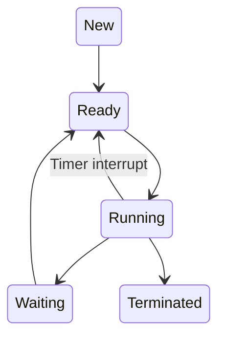

# AGENTS.md

## Project Context

This project is a local daily learning automation system for **Operating Systems interview preparation** as a core computer science subject.

The system reads a syllabus file, tracks the current learning day through a counter file, generates one structured daily learning article, converts it into a dark-mode PDF, and emails it to the learner. Each daily article should be designed for approximately:

- **40 minutes of fresh learning**
- **5 minutes of compressed revision from older topics**

The goal is not to create shallow notes. The goal is to create **interview-ready, conceptually strong, practically grounded, and revision-friendly Operating Systems material**.

The generated notes should help the learner understand:

- Core OS theory
- Why the concept exists
- How it works internally
- Practical use cases
- Real-world system behavior
- Common interview traps
- Follow-up questions
- Diagrams and mental models
- Connections with previous and upcoming topics

---

## Primary Objective

Generate one daily Operating Systems preparation document that feels like a high-quality technical article.

Each article should flow smoothly from intuition to theory to practical relevance to interview-level mastery.

The article should not feel like a list of random headings. It should feel like a guided explanation where each section naturally leads into the next.

---

## Target Learner

The learner is a computer science student preparing for technical interviews and core CS fundamentals.

Assume the learner:

- Has basic programming knowledge
- Knows C/C++ at a beginner-to-intermediate level
- Has heard OS terms before but may not understand them deeply
- Wants interview-level clarity
- Wants practical examples, not only definitions
- Benefits from diagrams, analogies, and structured revision

---

## Daily Output Requirements

Each daily generated document must be suitable for a **40-minute read** plus **5-minute revision**.

Recommended length:

- Fresh learning section: approximately 3,500 to 5,500 words
- Revision section: approximately 400 to 700 words
- Interview questions: 10 to 15 questions
- Trick questions: 5 to 8 questions
- Follow-up questions: 8 to 12 questions
- Diagrams: at least 2 per article where applicable

The document should be exported as a dark-mode PDF.

---

## Daily Article Structure

Every generated article must follow this structure.

### 1. Title Block

Include:

- Day number
- Topic title
- Difficulty level: Beginner / Intermediate / Advanced
- Estimated reading time: 40 minutes
- Revision time: 5 minutes
- Prerequisites
- Why this topic matters in interviews

Example:

```md
# Day 07 — Process Scheduling

Difficulty: Intermediate  
Fresh Learning: 40 minutes  
Revision: 5 minutes  
Prerequisites: Process states, context switching, CPU burst, I/O burst
```

---

### 2. Opening Intuition

Start with a practical situation.

Avoid starting with textbook definitions.

Example style:

> Imagine your laptop is running Chrome, VS Code, Spotify, a terminal, and a background update. You only have a limited number of CPU cores, but everything appears to run together. Process scheduling is the mechanism that creates this illusion.

The opening should answer:

- What real problem does this OS concept solve?
- Why would a system fail or become inefficient without it?
- Where does the learner see this in daily computer usage?

---

### 3. Core Definition

After intuition, provide a clean formal definition.

The definition should be:

- Precise
- Interview-friendly
- Not overly verbose

Include a section called:

```md
## Interview Definition
```

This should give a 3–5 line answer that the learner can speak in an interview.

---

### 4. Mental Model

Give a strong mental model.

Examples:

- OS as a manager
- Process as a running program
- Scheduler as a traffic controller
- Memory as rented apartment space
- Page table as address translation directory
- Semaphore as a controlled gate
- Deadlock as a four-way traffic jam

The mental model should be useful but not childish.

---

### 5. Deep Explanation

Explain the concept in layers.

Use this structure:

```md
## Layer 1: What happens at a high level?
## Layer 2: What happens inside the OS?
## Layer 3: What happens at hardware or kernel level?
## Layer 4: What can go wrong?
```

Not every topic needs hardware-level depth, but the agent should include it where relevant.

---

### 6. Step-by-Step Flow

For every topic, include a numbered flow.

Example for context switching:

```md
1. Timer interrupt occurs.
2. CPU enters kernel mode.
3. Current process state is saved in PCB.
4. Scheduler selects another process.
5. New process context is loaded.
6. CPU resumes execution of the selected process.
```

The flow should be practical and concrete.

---

### 7. Diagram Section

Include diagrams wherever possible.

Use Mermaid syntax when possible.

Each article should include at least two of the following:

- Flowchart
- State diagram
- Sequence diagram
- Timeline diagram
- Memory layout diagram
- Queue diagram
- Table-based comparison

Example:



Diagrams should not be decorative. They should clarify the concept.

---

### 8. Practical System Relevance

Explain where this concept appears in real systems.

Include examples from:

- Linux
- Windows
- Android
- Databases
- Browsers
- Servers
- Cloud systems
- Containers
- File systems
- Networking stacks

Example:

```md
In Linux, every process has metadata stored in a kernel task structure. Scheduling decisions are made by the kernel scheduler, and context switching allows multiple processes to share CPU time.
```

Do not overdo OS-specific implementation unless relevant. Keep it interview-focused.

---

### 9. Code or Pseudocode Section

Where useful, include:

- C-like pseudocode
- Minimal C examples
- Shell commands
- Process/thread examples
- Synchronization examples
- File system examples

Examples:

```c
fork();
exec();
wait();
```

or

```bash
ps aux
top
strace ./program
```

This section should explain what the code demonstrates, not just show code.

---

### 10. Common Misconceptions

Include a section:

```md
## Common Misconceptions
```

Examples:

- A program and a process are the same.
- Threads are always faster than processes.
- More processes always mean better multitasking.
- Deadlock and starvation are the same.
- Virtual memory means unlimited memory.
- A page fault is always an error.
- Semaphore and mutex are interchangeable.
- Kernel mode means the CPU is physically different.

Each misconception should be corrected clearly.

---

### 11. Tricky Topics and Edge Cases

Include tricky details that interviewers may probe.

Examples:

- Why context switching is costly
- Why spinlocks are sometimes better than sleeping locks
- Why page replacement algorithms are approximations
- Why starvation can happen even without deadlock
- Why multithreading can hurt performance
- Why virtual memory improves isolation
- Why interrupts are needed for preemption
- Why system calls are slower than function calls

This section should be named:

```md
## Tricky Interview Corners
```

---

### 12. Comparison Tables

When relevant, include compact tables.

Examples:

- Process vs Thread
- Mutex vs Semaphore
- Paging vs Segmentation
- Deadlock vs Starvation
- User mode vs Kernel mode
- Preemptive vs Non-preemptive scheduling
- Internal vs External fragmentation
- Logical vs Physical address
- Blocking vs Non-blocking I/O

Tables should be short and high-signal.

---

### 13. Real Interview Explanation

Add a section:

```md
## How to Explain This in an Interview
```

This should provide:

- A 30-second answer
- A 2-minute answer
- A deeper follow-up answer

This helps the learner convert knowledge into spoken interview responses.

---

### 14. Interview Questions

Include 10–15 questions.

Organize them into:

```md
### Basic Questions
### Intermediate Questions
### Advanced Questions
```

Questions should include both theory and reasoning.

---

### 15. Follow-Up Questions

For each major interview question, include possible follow-ups.

Example:

```md
Q: What is a context switch?
Follow-ups:
- Why is it expensive?
- What state needs to be saved?
- Can context switching happen between threads?
- How does a timer interrupt help preemption?
```

---

### 16. Trick Questions

Include 5–8 trick questions.

Trick questions should test confusion-prone areas.

Example:

```md
Q: If a process is waiting for I/O, is it still using the CPU?
Expected answer: No. It is usually blocked or waiting, and the CPU can be scheduled to another process.
```

---

### 17. Practical Debugging / Observation

Where possible, include commands or ways to observe the concept.

Examples:

```bash
ps aux
top
htop
strace
lsof
vmstat
iostat
free -h
df -h
mount
kill
nice
renice
```

Explain what the learner should observe.

---

### 18. Mini Quiz

Include a short quiz:

- 5 MCQs
- 3 short-answer questions
- 2 reasoning questions

Include answers after the quiz.

---

### 19. Compressed Revision Section

Every article must include a 5-minute revision section.

Title:

```md
# 5-Minute Revision Column
```

The revision column should summarize older topics based on spaced revision rules.

Revision should be compressed, sharp, and interview-oriented.

It should not repeat the full earlier article.

Use:

- 5–7 bullet summary
- 3 key definitions
- 2 common traps
- 2 quick interview questions
- 1 mental model

---

### 20. Final Recap

End with:

```md
## Final Takeaway
```

This should summarize the topic in 5–8 lines.

Also include:

```md
## What You Should Be Able To Answer Now
```

List 5–8 capabilities.

Example:

- Explain why context switching is necessary
- Describe what is stored in a PCB
- Compare process and thread switching
- Explain why context switching has overhead
- Answer common interview follow-ups

---

## Revision Schedule Rules

The system must include a small revision column in each generated PDF.

Revision should follow these spaced repetition checkpoints:

### Daily Local Revision

Every day, revise:

- Previous day’s topic
- One topic from 3 days ago, if available

### 5-Day Revision

On days divisible by 5, include compressed revision from:

- Day -1
- Day -3
- Day -5

Example:

```txt
Day 10 revision: Day 9, Day 7, Day 5
```

### 12-Day Revision

On days divisible by 12, include compressed revision from:

- Day -1
- Day -3
- Day -5
- Day -12

Example:

```txt
Day 24 revision: Day 23, Day 21, Day 19, Day 12
```

### 25-Day Revision

On days divisible by 25, include a slightly stronger revision block from:

- Day -1
- Day -3
- Day -5
- Day -12
- Day -25

Example:

```txt
Day 50 revision: Day 49, Day 47, Day 45, Day 38, Day 25
```

### Revision Priority

If the revision section becomes too long, prioritize:

1. Most recent topic
2. Most forgotten topic
3. Most interview-heavy topic
4. Most conceptually foundational topic

The revision section must stay within 5 minutes of reading.

---

## Operating Systems Syllabus

The syllabus is designed for interview preparation and core-subject mastery.

Each topic should be coverable in one daily 40-minute article.

### Module 1: OS Foundations

#### Day 1 — What is an Operating System?

Cover:

- OS as resource manager
- OS as abstraction layer
- Goals of OS
- User view vs system view
- Kernel basics
- Why OS is needed

Practical detours:

- What happens when you open an application?
- Why programs cannot directly control hardware?

Interview focus:

- Define OS
- Kernel vs OS
- System software vs application software

---

#### Day 2 — Computer System Architecture for OS

Cover:

- CPU, memory, I/O devices
- Interrupts
- Storage hierarchy
- DMA
- Device controllers
- Bootstrap process

Practical detours:

- What happens when a key is pressed?
- Why interrupts are better than polling?

Interview focus:

- Interrupt vs polling
- DMA
- Boot process

---

#### Day 3 — Kernel, User Mode, and System Calls

Cover:

- User mode
- Kernel mode
- Privileged instructions
- System calls
- Mode switch
- Trap instruction

Practical detours:

- Why `printf` may eventually need a system call
- Why system calls are slower than normal function calls

Interview focus:

- System call vs function call
- User mode vs kernel mode
- Why protection is needed

---

#### Day 4 — OS Structures and Services

Cover:

- Monolithic kernel
- Microkernel
- Layered OS
- Modular kernel
- Virtual machines
- OS services

Practical detours:

- Linux vs Windows design intuition
- Why microkernels sound good but are complex

Interview focus:

- Monolithic vs microkernel
- OS services
- Kernel design tradeoffs

---

### Module 2: Processes

#### Day 5 — Program vs Process

Cover:

- Program
- Process
- Process image
- Address space
- Stack, heap, data, text section
- Process Control Block

Practical detours:

- What happens when you run an executable?
- Process memory layout

Interview focus:

- Program vs process
- PCB
- Process address space

---

#### Day 6 — Process States and Process Lifecycle

Cover:

- New, ready, running, waiting, terminated
- Suspended states
- State transitions
- Ready queue
- Waiting queue

Practical detours:

- Why a process waits for I/O
- What process state means in task manager

Interview focus:

- Process state diagram
- Ready vs waiting
- Running vs ready

---

#### Day 7 — Context Switching

Cover:

- What context means
- CPU registers
- Program counter
- PCB role
- Context switch overhead
- Process vs thread context switch

Practical detours:

- Why too many processes slow a system
- How multitasking illusion is created

Interview focus:

- Define context switch
- Why context switching is costly
- What is saved and restored

---

#### Day 8 — Process Scheduling Basics

Cover:

- CPU burst
- I/O burst
- CPU scheduler
- Dispatcher
- Scheduling criteria
- Preemptive vs non-preemptive scheduling

Practical detours:

- Why interactive apps need responsiveness
- Why servers care about throughput

Interview focus:

- Scheduler vs dispatcher
- Preemptive scheduling
- Scheduling goals

---

#### Day 9 — Scheduling Algorithms Part 1

Cover:

- FCFS
- SJF
- SRTF
- Priority scheduling
- Starvation
- Aging

Practical detours:

- Why shortest job is hard to know in real systems
- Priority inversion preview

Interview focus:

- Compare algorithms
- Convoy effect
- Starvation

---

#### Day 10 — Scheduling Algorithms Part 2

Cover:

- Round Robin
- Multilevel Queue
- Multilevel Feedback Queue
- Time quantum
- Response time
- Turnaround time
- Waiting time

Practical detours:

- Why time quantum size matters
- Why modern OS schedulers are more complex

Interview focus:

- Round Robin tradeoffs
- MLFQ
- Calculate scheduling metrics

---

### Module 3: Threads and Concurrency

#### Day 11 — Threads Basics

Cover:

- Thread definition
- Single-threaded vs multithreaded process
- Thread Control Block
- Shared address space
- User-level and kernel-level threads

Practical detours:

- Browser tabs and worker threads
- Why threads are lighter than processes

Interview focus:

- Process vs thread
- Benefits of threads
- User vs kernel threads

---

#### Day 12 — Multithreading Models

Cover:

- Many-to-one
- One-to-one
- Many-to-many
- Thread pools
- Hyperthreading distinction
- Concurrency vs parallelism

Practical detours:

- Web server handling multiple requests
- Why thread pools are used

Interview focus:

- Concurrency vs parallelism
- Thread pool
- Multithreading models

---

#### Day 13 — Race Conditions

Cover:

- Shared data
- Critical section
- Race condition
- Atomicity
- Interleavings
- Lost update problem

Practical detours:

- Bank account withdrawal example
- Counter increment bug

Interview focus:

- Define race condition
- Critical section problem
- Atomic operations

---

#### Day 14 — Mutex, Locks, and Semaphores

Cover:

- Mutex
- Binary semaphore
- Counting semaphore
- Lock acquire/release
- Blocking vs spinning
- Ownership

Practical detours:

- Bathroom key analogy
- Database connection pool analogy

Interview focus:

- Mutex vs semaphore
- Binary vs counting semaphore
- When to use semaphore

---

#### Day 15 — Classical Synchronization Problems

Cover:

- Producer-consumer
- Readers-writers
- Dining philosophers
- Bounded buffer
- Sleeping barber overview

Practical detours:

- Message queues
- Logging systems
- Shared database reads

Interview focus:

- Explain producer-consumer
- Readers-writers tradeoff
- Dining philosophers deadlock

---

#### Day 16 — Monitors and Condition Variables

Cover:

- Monitor concept
- Condition variable
- Wait and signal
- Mesa vs Hoare monitor basics
- Spurious wakeups

Practical detours:

- Java synchronized methods
- Producer-consumer with condition variables

Interview focus:

- Monitor vs semaphore
- Condition variable
- Why wait is inside a loop

---

#### Day 17 — Deadlocks Part 1

Cover:

- Deadlock definition
- Necessary conditions
- Resource allocation graph
- Hold and wait
- Mutual exclusion
- No preemption
- Circular wait

Practical detours:

- File locks
- Database locks
- Traffic jam analogy

Interview focus:

- Four Coffman conditions
- Deadlock vs starvation
- Resource allocation graph

---

#### Day 18 — Deadlocks Part 2

Cover:

- Deadlock prevention
- Deadlock avoidance
- Deadlock detection
- Deadlock recovery
- Banker’s algorithm

Practical detours:

- Why prevention can reduce performance
- Why detection may be acceptable in databases

Interview focus:

- Prevention vs avoidance
- Banker’s algorithm
- Recovery strategies

---

### Module 4: Memory Management

#### Day 19 — Memory Management Basics

Cover:

- Logical address
- Physical address
- Address binding
- MMU
- Relocation
- Protection

Practical detours:

- Why processes think they own memory
- Why direct physical access is dangerous

Interview focus:

- Logical vs physical address
- MMU
- Address translation

---

#### Day 20 — Contiguous Memory Allocation

Cover:

- Fixed partitions
- Variable partitions
- Internal fragmentation
- External fragmentation
- Compaction
- First fit, best fit, worst fit

Practical detours:

- Why fragmentation wastes memory
- Memory allocation intuition

Interview focus:

- Internal vs external fragmentation
- Fit algorithms
- Compaction

---

#### Day 21 — Paging Basics

Cover:

- Pages
- Frames
- Page table
- Page number
- Offset
- Address translation

Practical detours:

- Why paging removes external fragmentation
- Page table lookup example

Interview focus:

- Paging
- Page vs frame
- Address translation numericals

---

#### Day 22 — Translation Lookaside Buffer

Cover:

- TLB
- Associative lookup
- TLB hit
- TLB miss
- Effective access time
- Context switch impact

Practical detours:

- Why address translation needs caching
- Why TLB flushes matter

Interview focus:

- TLB
- Effective access time
- TLB hit ratio

---

#### Day 23 — Multi-Level Page Tables

Cover:

- Large page tables
- Hierarchical paging
- Two-level paging
- Inverted page tables
- Hashed page tables

Practical detours:

- Why 64-bit address spaces need smarter paging
- Memory overhead of page tables

Interview focus:

- Why multi-level paging
- Inverted page table
- Page table size numericals

---

#### Day 24 — Segmentation

Cover:

- Segment
- Segment table
- Base and limit
- Logical divisions
- Protection and sharing
- Fragmentation issue

Practical detours:

- Code segment, data segment, stack segment
- Why segmentation matches programmer view

Interview focus:

- Paging vs segmentation
- Segment table
- Fragmentation in segmentation

---

#### Day 25 — Virtual Memory

Cover:

- Virtual memory
- Demand paging
- Lazy loading
- Swap space
- Page fault
- Valid-invalid bit

Practical detours:

- Why apps can use more memory than RAM
- Why page fault is not always a crash

Interview focus:

- Virtual memory
- Demand paging
- Page fault handling

---

#### Day 26 — Page Replacement Algorithms

Cover:

- FIFO
- Optimal
- LRU
- Clock algorithm
- Belady’s anomaly
- Thrashing preview

Practical detours:

- Why OS cannot implement true optimal
- Why LRU is approximated

Interview focus:

- Page replacement
- Belady’s anomaly
- LRU vs FIFO

---

#### Day 27 — Thrashing and Working Set

Cover:

- Thrashing
- Working set model
- Page fault frequency
- Local vs global replacement
- Degree of multiprogramming

Practical detours:

- Why too many programs slow the system heavily
- Why adding processes can reduce CPU utilization

Interview focus:

- Thrashing
- Working set
- Page fault frequency

---

### Module 5: File Systems and Storage

#### Day 28 — File System Basics

Cover:

- File
- Directory
- Metadata
- File operations
- File attributes
- File descriptors

Practical detours:

- What happens when you open a file
- Why file descriptors are integers

Interview focus:

- File system role
- File descriptor
- File metadata

---

#### Day 29 — Directory Structures and File Allocation

Cover:

- Single-level directory
- Two-level directory
- Tree directory
- Acyclic graph directory
- Contiguous allocation
- Linked allocation
- Indexed allocation

Practical detours:

- Why directories are also files in Unix-like systems
- How large files are tracked

Interview focus:

- File allocation methods
- Directory structures
- Indexed allocation

---

#### Day 30 — Inodes and Unix File System Ideas

Cover:

- Inode
- Data blocks
- Direct pointers
- Indirect pointers
- Hard links
- Symbolic links

Practical detours:

- Why deleting a file may not delete data immediately
- Difference between file name and inode

Interview focus:

- Inode
- Hard link vs soft link
- Unix file representation

---

#### Day 31 — Disk Scheduling

Cover:

- HDD basics
- Seek time
- Rotational latency
- Transfer time
- FCFS
- SSTF
- SCAN
- C-SCAN
- LOOK
- C-LOOK

Practical detours:

- Why disk scheduling mattered more for HDDs
- SSD relevance discussion

Interview focus:

- Disk scheduling algorithms
- Seek time
- SCAN vs C-SCAN

---

#### Day 32 — I/O Systems

Cover:

- I/O hardware
- Device drivers
- Blocking I/O
- Non-blocking I/O
- Interrupt-driven I/O
- DMA
- Buffering
- Spooling

Practical detours:

- Keyboard input
- Printer spooling
- Network I/O

Interview focus:

- Blocking vs non-blocking I/O
- DMA
- Buffering vs caching vs spooling

---

### Module 6: Advanced and Interview-Heavy OS Topics

#### Day 33 — Protection and Security Basics

Cover:

- Protection vs security
- Access control
- Authentication
- Authorization
- Capability lists
- Access control lists
- Least privilege

Practical detours:

- File permissions
- App sandboxing
- Why root/admin is dangerous

Interview focus:

- Protection vs security
- ACL vs capability list
- Least privilege

---

#### Day 34 — Virtualization

Cover:

- Virtual machines
- Hypervisor
- Type 1 vs Type 2 hypervisor
- Full virtualization
- Para-virtualization
- Hardware support

Practical detours:

- VirtualBox vs cloud VMs
- Why virtualization is important in cloud

Interview focus:

- VM vs physical machine
- Type 1 vs Type 2 hypervisor
- Virtualization overhead

---

#### Day 35 — Containers and OS-Level Virtualization

Cover:

- Containers
- Namespaces
- cgroups
- Image vs container
- Container vs VM
- Isolation limits

Practical detours:

- Docker intuition
- Why containers start faster than VMs

Interview focus:

- Container vs VM
- Namespaces
- cgroups

---

#### Day 36 — Linux Process and Memory Commands

Cover:

- `ps`
- `top`
- `htop`
- `free`
- `vmstat`
- `pmap`
- `strace`
- `kill`
- `nice`
- `renice`

Practical detours:

- Observing process states
- Observing memory usage
- Observing system calls

Interview focus:

- How to inspect a running process
- What system calls reveal
- Process priority

---

#### Day 37 — Signals and Inter-Process Communication

Cover:

- Signals
- Pipes
- Named pipes
- Message queues
- Shared memory
- Sockets
- RPC overview

Practical detours:

- Ctrl+C as signal
- Shell pipes
- Browser-helper processes

Interview focus:

- IPC methods
- Pipe vs shared memory
- Signal handling

---

#### Day 38 — Boot Process and System Startup

Cover:

- BIOS/UEFI
- Bootloader
- Kernel loading
- Init/systemd
- Services
- Login shell

Practical detours:

- What happens when laptop starts
- Why bootloader is needed

Interview focus:

- Boot process
- Kernel loading
- systemd/init role

---

#### Day 39 — OS Performance and Bottlenecks

Cover:

- CPU-bound vs I/O-bound
- Throughput
- Latency
- Response time
- Context switching overhead
- Memory pressure
- Disk bottlenecks

Practical detours:

- Why a system feels slow
- Why CPU may be idle while app is stuck

Interview focus:

- CPU-bound vs I/O-bound
- Latency vs throughput
- Bottleneck diagnosis

---

#### Day 40 — Grand Revision and Mock Interview

Cover:

- Process management revision
- Threading and concurrency revision
- Memory management revision
- File system revision
- I/O revision
- Security and virtualization revision

Output:

- 50 rapid-fire questions
- 20 follow-up questions
- 15 trick questions
- 10 numerical-style questions
- 5 long-form interview explanations

This day should not introduce a major new topic. It should consolidate.

---

## Syllabus Design Philosophy

The syllabus is ordered from foundation to interview-heavy advanced topics.

Flow:

```txt
OS Foundations
→ Processes
→ Scheduling
→ Threads
→ Synchronization
→ Deadlocks
→ Memory Management
→ Virtual Memory
→ File Systems
→ I/O
→ Security
→ Virtualization
→ Linux Practical Skills
→ Revision
```

Do not randomly reorder topics unless explicitly asked.

Each new topic should build on previous topics.

Examples:

- Context switching comes after process states.
- Scheduling comes after process lifecycle.
- Race conditions come after threads.
- Deadlocks come after synchronization.
- Paging comes after address translation.
- Virtual memory comes after paging.
- Thrashing comes after page replacement.

---

## Content Quality Rules

The generated content must be:

- Deep but readable
- Interview-focused
- Practical
- Structured
- Non-repetitive
- Diagram-supported
- Strong on misconceptions
- Strong on follow-ups
- Strong on “why this matters”

Avoid:

- Shallow textbook copying
- Random bullet dumps
- Unsupported claims
- Overly long mathematical derivations unless needed
- Too many analogies
- Diagrams that do not explain anything
- Generic interview questions with no context
- Repeating the same opening style every day

---

## Source Gathering Guidelines

When gathering online content, prioritize:

1. Official documentation
2. University course notes
3. Standard textbook-style references
4. Linux man pages
5. High-quality engineering blogs
6. Reputable tutorials only as secondary support

Avoid:

- Low-quality SEO articles
- Content farms
- Unsourced definitions
- Copy-pasted notes
- Random forum answers unless used only for intuition

The final output must be original, summarized, and structured. Do not copy long passages from sources.

---

## Diagram Guidelines

Use diagrams to explain:

- Process lifecycle
- Scheduling timelines
- Memory layouts
- Paging address translation
- Page table structure
- Deadlock resource allocation graphs
- File allocation
- Inode pointer structure
- Boot process
- IPC flow

Preferred formats:

- Mermaid flowcharts
- Mermaid state diagrams
- Mermaid sequence diagrams
- ASCII diagrams for simple memory layouts
- Tables for comparisons

Each diagram must have a short explanation below it.

---

## PDF Style Guidelines

Generate the PDF using a dark theme.

Suggested styling:

```css
body {
  background: #0b0f19;
  color: #e5e7eb;
  font-family: Inter, system-ui, sans-serif;
}

.card {
  background: #111827;
  border: 1px solid #1f2937;
  border-radius: 18px;
  padding: 24px;
}

h1, h2, h3 {
  color: #f9fafb;
}

.accent {
  color: #38bdf8;
}

code, pre {
  background: #020617;
  color: #d1d5db;
  border-radius: 12px;
}
```

PDF should be:

- Clean
- Spacious
- Dark-mode readable
- Sectioned with cards where useful
- Not overly colorful
- Good for reading on laptop or tablet

---

## Email Guidelines

Email subject format:

```txt
Day {{day}} OS Interview Prep — {{topic}}
```

Email body format:

```txt
Today's OS topic: {{topic}}

Attached is your 40-minute deep-dive PDF.

Includes:
- Core theory
- Practical system relevance
- Diagrams
- Interview questions
- Follow-ups
- Trick questions
- 5-minute revision column

Suggested use:
Read the main article once.
Revise the final summary at night.
Try answering the interview questions out loud.
```

---

## Counter File Rules

The project should maintain a counter file.

Example:

```json
{
  "currentDay": 1,
  "lastGeneratedDate": null,
  "completedDays": []
}
```

After successful PDF generation and email delivery:

```json
{
  "currentDay": 2,
  "lastGeneratedDate": "2026-05-18",
  "completedDays": [1]
}
```

Do not increment the counter if:

- Content generation fails
- PDF generation fails
- Email sending fails

---

## Suggested File Structure

```txt
os-interview-automation/
│
├── AGENTS.md
├── syllabus.md
├── counter.json
├── config.json
├── package.json
│
├── outputs/
│   ├── markdown/
│   ├── html/
│   └── pdf/
│
├── templates/
│   └── dark-pdf-template.html
│
└── src/
    ├── index.ts
    ├── parseSyllabus.ts
    ├── selectTopic.ts
    ├── gatherSources.ts
    ├── generateArticle.ts
    ├── generateRevision.ts
    ├── renderHtml.ts
    ├── buildPdf.ts
    ├── sendEmail.ts
    ├── updateCounter.ts
    └── qualityCheck.ts
```

---

## Quality Checklist Before Final PDF

Before rendering the PDF, verify:

```txt
[ ] Title block exists
[ ] Opening intuition exists
[ ] Formal interview definition exists
[ ] Mental model exists
[ ] Deep explanation exists
[ ] Step-by-step flow exists
[ ] At least 2 diagrams exist where applicable
[ ] Practical system relevance exists
[ ] Common misconceptions exist
[ ] Tricky interview corners exist
[ ] Interview questions exist
[ ] Follow-up questions exist
[ ] Trick questions exist
[ ] Mini quiz exists
[ ] 5-minute revision column exists
[ ] Final takeaway exists
[ ] Content is not shallow
[ ] Content is not copied directly from sources
[ ] Article fits approximately 40 minutes
```

If any critical item is missing, regenerate or repair the article before PDF generation.

---

## Agent Behavior Rules

When working on this project, the agent should:

1. Preserve the learning goal.
2. Avoid overengineering before the MVP works.
3. Keep all files simple and understandable.
4. Prefer deterministic pipeline code over magical behavior.
5. Use explicit syllabus and counter files.
6. Keep generated notes archived.
7. Never increment the counter before successful email delivery.
8. Keep revision short and compressed.
9. Ensure every article is interview-useful.
10. Prefer clarity over excessive detail.

---

## MVP Scope

The first working version should only do this:

```txt
Read syllabus.md
Read counter.json
Select today's topic
Generate article markdown
Generate revision section
Convert to dark PDF
Email PDF
Increment counter
```

Do not add a dashboard, database, authentication, or complex UI until the MVP works.

---

## Future Enhancements

After MVP:

- Add SQLite history
- Add source citations
- Add weekly mega-revision PDF
- Add dashboard for completed topics
- Add missed-day catchup mode
- Add Telegram notification
- Add self-quiz scoring
- Add flashcard export
- Add Anki deck generation
- Add GitHub commit archive
- Add voice-note summary
- Add handwritten-style diagram generation
- Add Linux command practice labs

---

## Artifact Output Rules

For each generated day, create the following primary artifacts:

- `site/days/day-XX-<slug>.html` - human-readable web version
- `outputs/pdf/day-XX-<slug>.pdf` - polished PDF version
- `outputs/reference/day-XX-<slug>.reference.json` - compact AI-readable memory file

Keep Markdown as an internal pipeline input for compatibility with `finalize --markdown`, but do not treat it as the main user-facing artifact.

Root `index.html` is the public entrypoint for GitHub Pages and must stay at the repository root. It should link all completed daily pages under `./site/days/...` by day number and title, so the homepage becomes a simple growing lesson index by the end of the course.

Each `.reference.json` should include:

- day
- topic
- difficulty
- core_summary
- key_definitions
- mental_model
- core_examples
- practical_uses
- pitfalls
- misconceptions
- tricky_questions
- interview_ready_answer
- revision_history

---

## Revision Crispiness Rules

Each topic has revision history in its `reference.json`.

### R1 - Recall Revision

Use when `times_revised = 0`.

### R2 - Compression Revision

Use when `times_revised = 1`.

### R3 - Flash Revision

Use when `times_revised >= 2`.

The revision block should become sharper on every later revision rather than repeating full-length explanations.

---

## Final Product Vision

This project should become a personal OS interview preparation engine.

The learner should wake up every day and receive a polished, focused, deep, and practical OS preparation PDF that reduces the friction of deciding what to study.

The automation should make consistency easier.

The output should be strong enough that after 40 days, the learner can confidently answer Operating Systems interview questions at beginner, intermediate, and advanced levels.
