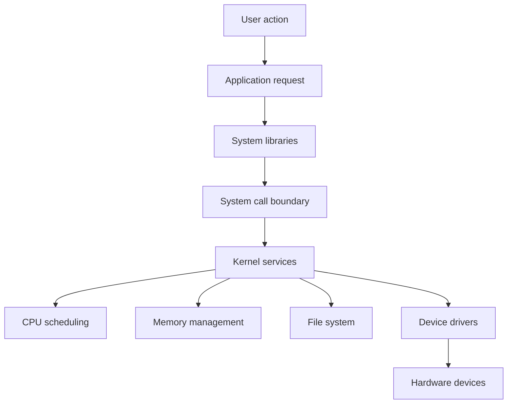
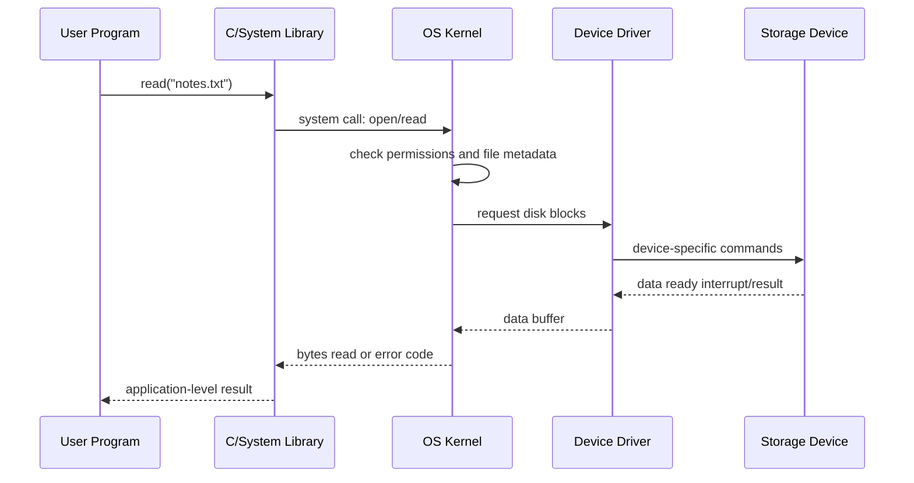
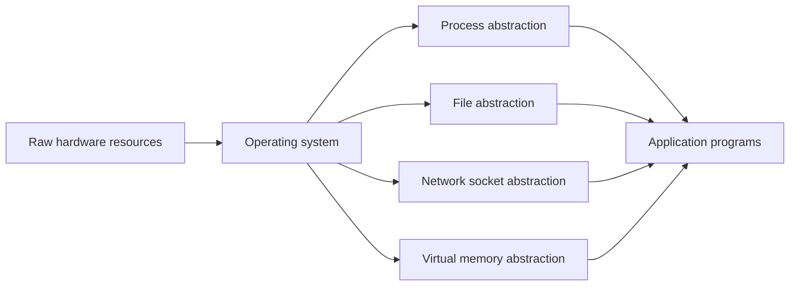

# Day 01 - What is an Operating System?

Difficulty: Beginner  
Fresh Learning: 40 minutes  
Revision: 5 minutes  
Prerequisites: None  
Why this topic matters in interviews: Forms the base definition for every OS interview discussion. If this answer is weak, later answers about processes, memory, files, system calls, scheduling, and security also sound weak.

Imagine you double-click a browser icon. A window appears, network requests start, files are read from disk, memory is assigned, the keyboard and mouse keep responding, audio may keep playing, and other apps do not collapse just because the browser is busy. You did not manually tell the CPU where to run browser instructions, which RAM addresses to use, how to talk to the network card, or how to share the display with other windows.

That invisible coordination is the job of the operating system.

Without an operating system, every program would need to understand every hardware device, protect itself from every other program, manage raw memory, decide when to use the CPU, and recover from conflicts. That would make software fragile and hardware-specific. A text editor should not need to know the exact disk controller protocol. A browser tab should not be able to overwrite your password manager's memory. A video player should not permanently freeze the machine just because it entered a long loop.

An operating system solves this by sitting between applications and hardware. It gives programs clean abstractions such as processes, files, sockets, virtual memory, and permissions. It also manages real resources such as CPU time, RAM, disk space, devices, and network access. From the user's view, the OS makes the computer usable. From the system's view, it makes resource sharing controlled, efficient, and protected.

## Interview Definition

An operating system is system software that manages computer hardware resources and provides services and abstractions for application programs. It acts as an intermediary between users, applications, and hardware. Its main responsibilities include CPU management, memory management, file management, device management, security, and providing interfaces such as system calls and user shells.

In interviews, say it simply: the OS is both a resource manager and an abstraction provider.

## Mental Model

Think of the operating system as the building manager of a large technical campus.

Applications are teams that want rooms, electricity, network access, printers, storage, and meeting slots. Hardware resources are limited shared facilities. If every team directly controlled the power lines, elevators, locks, and room assignments, the campus would become unsafe and chaotic. The manager does not do every team's work, but it allocates space, enforces rules, resolves conflicts, hides maintenance complexity, and keeps the whole campus usable.

That is the OS. A process asks for memory instead of grabbing physical RAM. A program asks to read a file instead of controlling the disk motor. A browser asks for network I/O instead of directly programming the network card. The OS exposes simple, stable interfaces while internally dealing with messy hardware details.

This mental model also explains why an OS is not just a user interface. A graphical desktop is only one visible service. The deeper OS role is controlled resource management.

## Layer 1: What happens at a high level?

At a high level, an operating system does four big things.

First, it starts and manages programs. When you open an application, the OS loads executable code, creates a process, assigns memory, tracks its state, and gives it a controlled environment to run in.

Second, it shares the CPU. Most machines run more active programs than there are CPU cores. The OS scheduler decides which process or thread runs next, for how long, and with what priority. This creates the feeling of multitasking.

Third, it manages memory and storage. Programs see convenient address spaces and file names. The OS maps these to physical RAM, disk blocks, caches, and permissions. It protects one program from reading or corrupting another program's memory.

Fourth, it controls devices and I/O. Keyboards, screens, disks, network cards, cameras, and printers all have different hardware details. The OS uses device drivers and I/O subsystems so applications can use them through standard operations like read, write, open, close, send, and receive.

For a beginner, the most important idea is this: applications do not own the machine. They request services from the OS, and the OS decides how to safely use the machine on their behalf.

## Layer 2: What happens inside the OS?

Inside the OS, the core component is the kernel. The kernel is the privileged part of the operating system that runs with direct access to hardware and protected CPU instructions. It is responsible for the most sensitive operations: scheduling CPU time, managing memory mappings, handling interrupts, enforcing access control, and talking to device drivers.

The OS also includes user-facing and service components around the kernel. Examples include shells, graphical desktops, background services, networking utilities, file managers, package managers, and system libraries. These pieces are important, but they usually do not all run with the same privilege as the kernel.

When an application wants a protected service, it normally uses a system call. A system call is the controlled entry point from user code into the kernel. For example, a C program may call `printf`, but if the output must appear on the terminal, eventually some library code asks the OS to write bytes to a file descriptor. The application does not directly control the display device.

The OS keeps internal data structures to track everything. It may store process metadata in process control blocks, open-file information in file tables, memory mappings in page tables, and device state in driver-specific structures. These data structures are the OS's working memory about the machine.

## Layer 3: What happens at hardware or kernel level?

Hardware supports operating systems through privilege modes, interrupts, timers, memory protection, and device interfaces.

Privilege modes separate normal application execution from kernel execution. User mode is restricted: a program cannot directly execute privileged instructions, modify page tables, or access arbitrary device registers. Kernel mode is privileged: the OS can perform those operations when needed. This separation is essential because protection cannot rely on every application behaving nicely.

Interrupts let hardware get the CPU's attention. For example, a disk may interrupt when data is ready, a keyboard may interrupt when a key is pressed, and a timer interrupt may let the OS regain control from a running process. Without interrupts, the OS would often have to poll devices repeatedly, wasting CPU time.

Memory management hardware helps the OS translate virtual addresses to physical addresses and enforce protection. When a process uses an address, the CPU and memory-management unit cooperate with OS-managed page tables to decide where that address actually maps in RAM, and whether the process is allowed to access it.

Device controllers expose hardware-specific registers and protocols. The OS uses drivers to control these devices. An application sees a file, socket, or stream; the driver deals with the device-specific commands.

## Layer 4: What can go wrong?

Many OS problems come from sharing and protection.

If CPU scheduling is poor, interactive applications feel slow even if the CPU is powerful. If memory management is weak, one process may corrupt another process or the system may waste RAM. If device handling is inefficient, programs spend too much time waiting for I/O. If permissions are wrong, malicious or buggy programs can damage files or steal data.

Another problem is abstraction leakage. The OS tries to hide hardware details, but real limits still appear. A file read may be slow because the disk is busy. A program may appear frozen because it is waiting for network I/O. An app may be killed because it used too much memory. The abstraction is useful, not magical.

A strong interview answer should acknowledge this tradeoff: the OS hides hardware complexity, but it must still manage real, limited resources.

## Step-by-Step Flow

Here is a practical flow for opening an application:

1. The user asks to launch a program by clicking an icon or running a command.
2. The shell or desktop environment sends a request to the OS.
3. The OS locates the executable file on storage.
4. The kernel creates a new process and initializes process metadata.
5. The OS sets up the process address space with code, data, heap, stack, and shared libraries.
6. The loader prepares the program's starting point.
7. The scheduler gives the process CPU time.
8. The process runs in user mode.
9. When the process needs files, memory, display, input, or network access, it requests OS services through system calls.
10. The OS handles those requests, enforces protection, and returns control to the process.

This is why "opening an app" is not just running code. It is a coordinated OS workflow involving files, memory, CPU scheduling, permissions, and I/O.

## Diagram Section



This diagram shows the OS as the controlled path between applications and hardware. Applications usually do not directly touch hardware; they move through libraries, system calls, kernel services, and drivers.



This sequence shows how a simple file read hides many layers. The app thinks in terms of a file name and bytes; the OS handles permissions, metadata, drivers, and storage hardware.



This diagram emphasizes the abstraction role. The OS turns raw hardware into safer programming concepts.

## Practical System Relevance

In Linux, the kernel manages processes, virtual memory, filesystems, networking, and device drivers. Commands such as `ps`, `top`, `free`, `mount`, `ls`, and `strace` expose OS-managed state. When you run `ps`, you are not asking each program directly what it is doing; you are reading process information exposed by the operating system.

In Windows, the same broad responsibilities exist: process management, memory management, device drivers, access control, file systems, and a graphical shell. Task Manager is a user-facing window into OS-managed process and resource information.

In Android, the OS manages apps, permissions, storage, background execution, memory pressure, and device access. When Android restricts background apps or asks for camera permission, it is enforcing OS-level resource and security policy.

In browsers, the OS provides processes, memory isolation, files, network sockets, timers, and threads. Modern browsers also build their own internal isolation, but they still rely heavily on OS primitives.

In databases, the OS matters because databases depend on files, disk I/O, memory mapping, network sockets, locks, and scheduling. A database may implement its own buffer pool, but it still runs on top of OS-provided memory and storage services.

In cloud systems and containers, the OS becomes even more visible. Containers rely on OS-level isolation features such as namespaces and control groups. Virtual machines rely on hypervisors and OS kernels to safely share physical servers.

The practical point: OS concepts are not only academic. They show up whenever software needs performance, isolation, reliability, or hardware access.

## Code or Pseudocode Section

A beginner-friendly way to see the OS boundary is to compare a normal function call with a system call.

```c
#include <stdio.h>
#include <unistd.h>

int main(void) {
    printf("Printed through the C library\n");
    write(1, "Written through a system call path\n", 35);
    return 0;
}
```

`printf` is a library function. It formats text and may buffer output. But when bytes actually need to go to the terminal, the program eventually needs OS help. `write` more directly represents the system-call style request: "write these bytes to file descriptor 1."

The application does not know how the terminal is implemented. The OS decides where file descriptor `1` points, whether writing is allowed, and how to move bytes to the appropriate device or pipe.

Useful observation commands:

```bash
ps aux
top
strace ./a.out
ls -l
df -h
free -h
```

What to observe:

- `ps aux` shows processes managed by the OS.
- `top` shows CPU and memory sharing in real time.
- `strace` on Linux shows system calls, making the user-kernel boundary visible.
- `ls -l` shows file metadata and permissions.
- `df -h` shows mounted storage capacity.
- `free -h` shows memory usage and available memory.

Even these simple commands are OS lessons in disguise.

## Common Misconceptions

1. Misconception: The OS is just the desktop or graphical interface.  
   Correction: The desktop is only one part of the user experience. The OS includes deeper services such as the kernel, process management, memory management, file systems, networking, and device control.

2. Misconception: The kernel and the OS are exactly the same thing.  
   Correction: The kernel is the privileged core of the OS. The full OS usually includes the kernel plus system libraries, utilities, services, shells, and user interfaces.

3. Misconception: Applications directly control hardware.  
   Correction: Normal applications usually request hardware-related services through the OS. Direct hardware access is restricted because it would be unsafe and non-portable.

4. Misconception: The OS only matters when multiple programs are running.  
   Correction: Even one program needs loading, memory setup, I/O, file access, device handling, and error management.

5. Misconception: More abstraction always means less performance.  
   Correction: Abstractions have overhead, but they also enable caching, batching, scheduling, protection, portability, and better resource utilization.

6. Misconception: A system call is just a normal function call.  
   Correction: A system call crosses from user mode into kernel mode through a controlled mechanism. That transition is more expensive and more protected than a normal function call.

7. Misconception: If a program crashes, the whole OS should crash.  
   Correction: A major OS goal is isolation. A user program crash should usually terminate only that process, not the entire machine.

## Tricky Interview Corners

The first tricky corner is the difference between resource management and abstraction. Resource management is about deciding who gets CPU time, memory, disk, and devices. Abstraction is about giving programs simpler concepts like files and processes. A strong definition includes both.

The second tricky corner is kernel versus operating system. Interviewers often ask this to check precision. The kernel is the core privileged component. The OS is the broader software environment built around it.

The third tricky corner is user mode versus kernel mode. User mode protects the system from applications. Kernel mode allows privileged operations. A system call is one controlled way to cross that boundary.

The fourth tricky corner is that the OS is not only for convenience; it is also for safety. Without memory protection, a bug in one application could corrupt another application or the kernel.

The fifth tricky corner is performance. The OS introduces overhead, but the alternative is not automatically faster. Without scheduling, caching, buffering, and device coordination, real systems would often be slower and less reliable.

The sixth tricky corner is that OS design involves tradeoffs. A microkernel may improve modularity and isolation but can add communication overhead. A monolithic kernel may be faster in some paths but has more code in privileged space.

## Comparison Tables

| Concept | Meaning | Interview signal |
|---|---|---|
| OS as resource manager | Allocates CPU, memory, storage, and devices | Shows you understand limited shared resources |
| OS as abstraction layer | Provides processes, files, sockets, virtual memory | Shows you understand programmer convenience and portability |
| Kernel | Privileged core managing sensitive operations | Shows precision |
| Shell/UI | Interface for users to interact with the system | Avoids confusing UI with the whole OS |

| User Mode | Kernel Mode |
|---|---|
| Restricted execution mode | Privileged execution mode |
| Runs normal application code | Runs kernel code and sensitive services |
| Cannot directly access arbitrary hardware | Can manage hardware through controlled code |
| Safer for untrusted or buggy programs | Powerful but dangerous if buggy |

| System Call | Function Call |
|---|---|
| Requests an OS service | Jumps to another function in the same program context |
| Crosses user-kernel boundary | Usually stays in user mode |
| More overhead and protection checks | Lower overhead |
| Examples: `read`, `write`, `fork` | Examples: `strlen`, `sort`, custom helper |

## How to Explain This in an Interview

30-second answer:

An operating system is system software that manages hardware resources and provides services to applications. It controls CPU scheduling, memory, files, devices, and security. It also gives programs abstractions like processes, files, and virtual memory so they do not need to deal with raw hardware directly.

2-minute answer:

An OS sits between applications and hardware. From the resource-management side, it decides how CPU time, RAM, disk, devices, and network access are shared safely and efficiently. From the abstraction side, it gives applications simpler interfaces such as system calls, files, processes, sockets, and virtual address spaces. The kernel is the privileged core that enforces protection and performs sensitive operations. Applications normally run in user mode and request kernel services through system calls. This separation improves safety, portability, and multitasking.

Deeper follow-up answer:

The OS exists because raw hardware is difficult and unsafe for applications to manage directly. If programs could directly access physical memory or device registers, one buggy or malicious program could crash the system or steal data. Hardware support such as privilege modes, interrupts, timers, and memory protection allows the OS kernel to enforce boundaries. The OS then builds higher-level services on top: process scheduling, virtual memory, filesystems, I/O, device drivers, and security. Good OS design balances performance, protection, simplicity, and flexibility.

## Interview Questions

### Basic Questions

1. What is an operating system?
2. Why do we need an operating system?
3. What is the difference between a kernel and an operating system?
4. What are the main functions of an OS?
5. What is meant by OS as a resource manager?
6. What is meant by OS as an abstraction layer?

### Intermediate Questions

7. Why should applications not directly access hardware?
8. What is the difference between user mode and kernel mode?
9. What is a system call, and why is it needed?
10. What happens when you open an application?
11. How does the OS support multitasking?
12. Why is memory protection important?

### Advanced Questions

13. What are the tradeoffs between protection and performance in OS design?
14. Why is a system call slower than a normal function call?
15. How do interrupts help the OS manage hardware and regain control?

## Follow-Up Questions

Q: What is an operating system?  
Follow-ups:
- Can you explain it as both a resource manager and an abstraction layer?
- Is the desktop environment the same as the OS?
- Where does the kernel fit in?

Q: Why is the kernel privileged?  
Follow-ups:
- What could go wrong if every program had kernel privileges?
- What is user mode?
- What is kernel mode?

Q: What is a system call?  
Follow-ups:
- How is it different from a library call?
- Why does it have overhead?
- Give examples of common system calls.

Q: What happens when an application starts?  
Follow-ups:
- Who loads the executable?
- Who assigns memory?
- When does scheduling become involved?

Q: Why does the OS manage memory?  
Follow-ups:
- Why not give physical memory directly to programs?
- How does memory protection improve reliability?
- How does virtual memory help?

Q: How does the OS manage devices?  
Follow-ups:
- What is the role of device drivers?
- Why are device interfaces abstracted?
- Why are interrupts useful for I/O?

Q: What is multitasking?  
Follow-ups:
- Can multitasking happen on one CPU core?
- What role does the scheduler play?
- Why does timer interrupt matter?

Q: What is the difference between OS services and application logic?  
Follow-ups:
- Should a browser implement its own disk driver?
- Should a text editor manage physical RAM?
- Why is shared OS service better?

## Trick Questions

1. Q: Is the graphical desktop the operating system?  
   Expected answer: No. It is part of the user-facing environment. The OS also includes deeper components such as the kernel, services, file systems, memory management, and device handling.

2. Q: If only one program is running, is an OS unnecessary?  
   Expected answer: No. The program still needs loading, memory setup, I/O, device control, errors, and protection from invalid operations.

3. Q: Is every function that reads a file a system call?  
   Expected answer: No. A library function may wrap, buffer, or combine operations, but actual protected file access eventually uses OS services.

4. Q: Does kernel mode mean a physically different CPU is used?  
   Expected answer: No. It is a privileged execution mode of the CPU, not a separate processor.

5. Q: Is the kernel always the entire OS?  
   Expected answer: No. The kernel is the core privileged part. The full OS includes other system programs, services, libraries, and interfaces.

6. Q: Does abstraction mean the OS hides all performance details?  
   Expected answer: No. Abstractions simplify usage, but real limits such as CPU time, memory pressure, disk latency, and network delay still affect programs.

7. Q: Can user programs directly execute privileged instructions?  
   Expected answer: Normally no. The CPU and OS restrict privileged instructions to kernel mode.

## Practical Debugging / Observation

Try observing your own system through OS-provided tools.

On Linux or WSL:

```bash
ps aux | head
top
free -h
df -h
ls -l
strace -o trace.txt ls
```

On Windows:

```powershell
Get-Process
Get-Service
Get-PSDrive
Get-ComputerInfo
```

What these show:

- Process lists prove the OS tracks running programs.
- CPU and memory views show resource management.
- Disk and filesystem views show storage abstraction.
- Service lists show background OS-managed programs.
- Tracing tools reveal that simple commands still ask the OS for many services.

The learning goal is not to memorize commands today. It is to connect visible system behavior with OS responsibilities.

## Mini Quiz

### MCQs

1. Which statement best describes an operating system?  
   A. Only a graphical interface  
   B. System software that manages hardware and provides services  
   C. A programming language runtime  
   D. A hardware component

2. Which component is the privileged core of the OS?  
   A. Shell  
   B. Browser  
   C. Kernel  
   D. Text editor

3. Why are system calls needed?  
   A. To make code shorter only  
   B. To request protected OS services  
   C. To avoid using libraries  
   D. To replace hardware

4. Which is an OS abstraction?  
   A. Raw voltage level  
   B. Disk platter angle  
   C. File  
   D. CPU transistor

5. Why should applications not freely access physical memory?  
   A. It is always slower  
   B. It makes programs impossible to compile  
   C. It breaks protection and isolation  
   D. It prevents using files

### Short-Answer Questions

1. Explain OS as a resource manager in two lines.
2. Explain OS as an abstraction layer in two lines.
3. Give two examples of services provided by the OS.

### Reasoning Questions

1. A music player continues playing while a browser loads a heavy page. What OS responsibilities are involved?
2. A program crashes, but the rest of the system keeps running. Which OS idea does this demonstrate?

### Answers

MCQs: 1-B, 2-C, 3-B, 4-C, 5-C.

Short-answer sample answers:

1. The OS allocates limited resources such as CPU time, RAM, storage, and devices among programs. It decides who can use what, when, and under which rules.
2. The OS hides raw hardware complexity behind simpler concepts such as processes, files, sockets, and virtual memory. Programs use these abstractions instead of controlling hardware directly.
3. Examples include process creation, file access, memory allocation, device I/O, networking, and permission checks.

Reasoning sample answers:

1. CPU scheduling, process management, memory management, interrupt handling, and device/audio I/O are involved.
2. This demonstrates process isolation and protection. A user program failure should not automatically crash the whole OS.

# 5-Minute Revision Column

Revision targets returned by the automation: none. This is Day 1, so there are no older topics to revise yet.

Use this first revision column to lock the foundation:

- An operating system is both a resource manager and an abstraction provider.
- The kernel is the privileged core, not necessarily the entire OS.
- Applications normally run in user mode and request protected services through system calls.
- The OS manages CPU, memory, files, devices, I/O, and security.
- Abstractions such as process, file, socket, and virtual memory make hardware usable and safer.
- Protection matters because buggy or malicious programs must not control the whole machine.

Key definitions:

- Operating system: System software that manages hardware resources and provides services to applications.
- Kernel: The privileged core of the OS that handles sensitive resource and hardware operations.
- System call: A controlled request from a user program to the kernel for an OS service.

Common traps:

- Do not say the OS is only the graphical interface.
- Do not say system calls and normal function calls are the same.

Quick interview questions:

1. Explain OS as a resource manager and abstraction layer.
2. Why do applications need system calls?

Mental model: The OS is the building manager of the computer, assigning shared resources, enforcing rules, and hiding infrastructure complexity.

## Final Takeaway

An operating system exists because applications need a safe and convenient way to use hardware. It manages limited resources like CPU, memory, storage, devices, and network access. It also provides abstractions like processes, files, sockets, and virtual memory so programs do not need to understand raw hardware. The kernel is the privileged core that enforces protection and performs sensitive operations. User programs run with restrictions and request OS services through system calls. Good OS understanding starts with this dual identity: resource manager plus abstraction layer.

## What You Should Be Able To Answer Now

- Define an operating system in an interview-friendly way.
- Explain why the OS is needed even for simple program execution.
- Distinguish between OS, kernel, shell, and user interface.
- Explain OS as both a resource manager and an abstraction layer.
- Describe what happens at a high level when an application opens.
- Explain why user mode and kernel mode exist.
- Explain why system calls are different from normal function calls.
- Give practical examples of OS responsibilities in Linux, Windows, Android, browsers, databases, and cloud systems.
