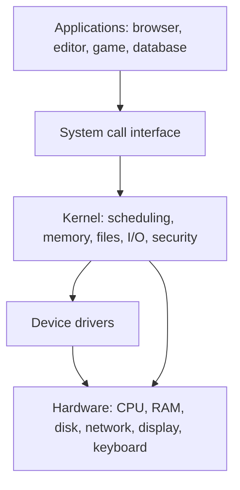
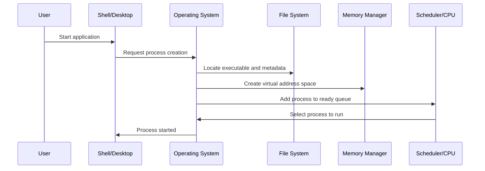
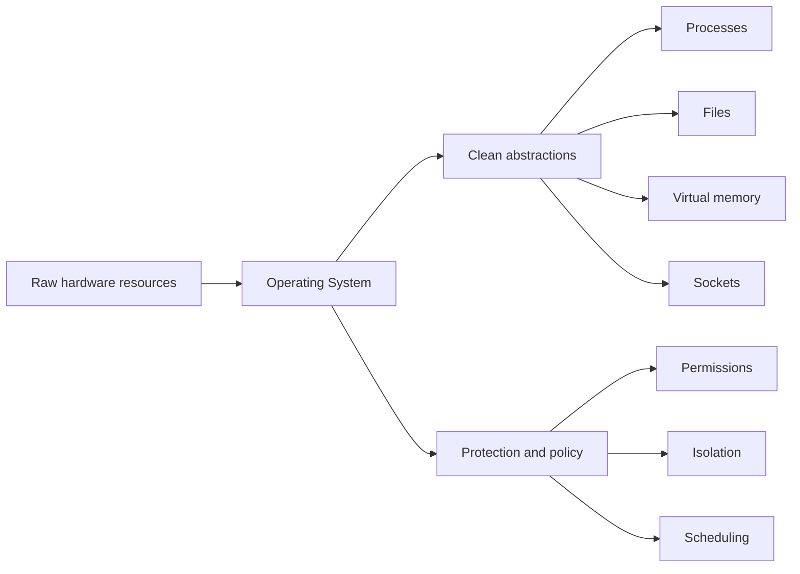

# Day 01 - What is an Operating System?

Difficulty: Beginner  
Fresh Learning: 40 minutes  
Revision: 5 minutes  
Prerequisites: None  
Why this topic matters in interviews: Forms the base definition for every OS interview discussion. If this idea is weak, later topics like processes, memory management, files, interrupts, system calls, and synchronization feel disconnected.

## Opening Intuition

Imagine you double-click a browser icon. A window appears, it loads your saved tabs, it reads files from storage, it receives keyboard and mouse input, it uses network hardware to fetch pages, it plays audio, and it competes with other apps for CPU time. From your point of view, the browser is simply "running." Underneath that simple experience, many shared resources are being coordinated at once.

The computer has limited CPU cores, finite RAM, a storage device with latency, network hardware, display hardware, and input devices. If every program directly controlled these resources, the system would quickly become unsafe and chaotic. One badly written application could overwrite another program's memory, monopolize the CPU, read private files, or send invalid commands to a device.

An operating system exists to prevent that chaos. It gives programs clean abstractions such as processes, files, sockets, virtual memory, and windows, while also managing the real hardware underneath. When an application says "read this file," it does not need to know disk sectors, filesystem metadata, driver details, permission checks, or cache state. The OS handles those details and returns a useful result.

You see this every day. A music app continues playing while a browser downloads a file. A text editor saves a document without knowing the details of the SSD. A game uses graphics hardware without directly owning the GPU. A phone prevents one app from reading another app's private data. These ordinary experiences depend on the operating system acting as both a resource manager and an abstraction layer.

Without an operating system, each application would need to know how to control hardware directly, protect itself from other programs, manage memory manually, handle interrupts, schedule CPU time, and enforce permissions. That would make software harder to write, harder to debug, and unsafe for multiple programs running together.

## Interview Definition

An operating system is system software that manages computer hardware resources and provides services and abstractions for application programs. It controls resources such as CPU time, memory, storage, files, devices, and security. The OS sits between applications and hardware, allowing programs to run safely and conveniently without directly controlling low-level hardware.

In an interview, a strong short answer is: an operating system is both a resource manager and an abstraction provider. It decides how shared hardware is allocated, and it exposes simpler interfaces like processes, files, virtual memory, and system calls.

## Mental Model

Think of the operating system as the building manager of a large shared building. Many people want to use rooms, elevators, electricity, locks, storage areas, and communication lines. If every person controlled everything directly, conflicts would happen. Someone might lock others out, overload power, enter restricted rooms, or damage shared infrastructure.

The building manager does not do every person's work. Instead, it provides rules, controlled access, scheduling, safety, and shared services. It decides who can use which room, when maintenance happens, who has permission to enter, and how conflicts are resolved.

Similarly, the OS does not write your document or render your web page itself. Applications still do their own logic. But the OS provides controlled access to CPU, memory, files, devices, network, and security. It also hides unnecessary details. Applications can ask for "a file" instead of managing disk blocks, or create "a process" instead of manually loading executable bytes into physical memory.

This mental model is useful because it captures both halves of the OS:

- Resource manager: decides who gets CPU time, memory, I/O, storage, and device access.
- Abstraction provider: presents clean objects such as processes, files, sockets, and virtual address spaces.
- Protector: prevents one program from accidentally or maliciously damaging another program or the whole system.
- Coordinator: handles interrupts, scheduling, device events, and background work.

## Layer 1: What happens at a high level?

At a high level, the operating system makes a computer usable by turning raw hardware into a controlled environment for programs. The CPU can execute instructions, memory can store bytes, disks can persist data, and devices can send or receive signals. But raw hardware alone does not automatically give you multitasking, files, permissions, user accounts, networking APIs, or application isolation.

The OS adds those capabilities.

When a program runs, the OS creates a process for it. A process is not just the program file. It is a running execution context with memory, open files, CPU state, permissions, and scheduling information. When multiple processes exist, the OS decides which process runs next and for how long.

When a program needs memory, the OS provides an address space. The process thinks it has its own memory range, while the OS and hardware translate those virtual addresses to physical memory. This prevents one process from freely reading or writing another process's memory.

When a program needs a file, the OS gives it file operations such as open, read, write, and close. The program does not need to directly manage the storage device. The OS checks permissions, finds metadata, uses buffers and caches, talks to drivers, and coordinates with the filesystem.

When hardware needs attention, such as a keyboard press, network packet, disk completion, or timer event, interrupts notify the CPU. The OS responds to those interrupts and decides what should happen next.

So the high-level answer is simple: the OS makes many programs safely share one machine while hiding hardware complexity behind useful abstractions.

## Layer 2: What happens inside the OS?

Inside the OS, several major subsystems cooperate.

The process management subsystem creates, schedules, pauses, resumes, and terminates processes and threads. It keeps metadata such as process identifiers, process state, priority, CPU register state, open files, and memory mapping information. Later days will cover process states, context switching, scheduling algorithms, and threads in detail.

The memory management subsystem tracks physical memory, gives each process a protected virtual address space, maps virtual pages to physical frames, and enforces access permissions. It also handles page faults and can move inactive memory pages to storage when virtual memory is used.

The file system subsystem organizes persistent data into files and directories. It manages names, metadata, permissions, allocation, caching, and consistency. When you save a file, the OS must translate that operation into lower-level storage activity.

The I/O subsystem manages devices through drivers. A device driver is OS-level software that knows how to communicate with a particular device or class of devices. Applications usually do not talk directly to hardware controllers; they request OS services, and the OS uses drivers.

The security and protection subsystem controls what users and programs are allowed to do. It enforces user permissions, process isolation, file permissions, access control, sandboxing, and privileged operations.

The system call interface is the controlled doorway between applications and the kernel. Applications normally run in user mode, where they cannot execute privileged instructions directly. When they need OS help, they make a system call. The CPU switches into kernel mode, the OS performs the protected operation, and control returns to the application.

These subsystems are not independent islands. Opening a file may involve process state, permissions, filesystem lookup, memory buffers, device drivers, interrupts, and scheduling. A good interview answer should show that the OS is a coordinated system, not a random list of services.

## Layer 3: What happens at hardware or kernel level?

At the hardware and kernel level, the OS depends on CPU support for protection and control. Modern processors provide execution modes, commonly described as user mode and kernel mode. User mode is restricted. Kernel mode is privileged. Code running in kernel mode can perform sensitive operations such as configuring hardware, changing memory mappings, handling interrupts, and controlling devices.

This distinction is essential. If normal applications could execute privileged instructions directly, any program could corrupt the system. For example, a user program could disable interrupts, overwrite kernel memory, read another process's memory, or directly command hardware devices.

The kernel is the privileged core of the operating system. It handles the most sensitive responsibilities: process scheduling, memory protection, system calls, interrupt handling, and device coordination. The full operating system may include many other components such as shells, graphical interfaces, background services, utilities, libraries, and configuration tools. The kernel is central, but it is not always the entire OS experience.

Hardware also helps the OS through interrupts. A timer interrupt allows the OS to regain control even if a program keeps running. This is what makes preemptive multitasking possible. Device interrupts tell the OS that something happened: a disk finished reading, a network packet arrived, or a key was pressed.

Memory protection hardware, often involving an MMU, helps translate addresses and enforce boundaries. A process can use virtual addresses, but the OS controls the mappings. This prevents ordinary programs from directly accessing arbitrary physical memory.

In short, the OS is not just a high-level software idea. It relies on hardware features that let it control execution, protect memory, handle device events, and safely switch between programs.

## Layer 4: What can go wrong?

Many system problems are failures of resource management, abstraction, or protection.

If CPU scheduling is poor, interactive applications may feel slow, background tasks may starve, or throughput may drop. If memory management is poor, programs may crash, leak memory, or cause heavy paging. If file system handling is weak, data may be corrupted or lost. If permission checks are weak, one user or application may access data it should not see.

Even when the OS behaves correctly, applications can misuse OS services. A program may create too many threads, open too many files, allocate too much memory, ignore errors from system calls, or assume a file write is immediately persistent. Interviewers often test these practical boundaries because real systems fail in these areas.

Security failures can be especially serious. If a bug allows user-mode code to gain kernel privileges, that program may take full control of the system. This is why kernel code must be carefully designed and why the user/kernel boundary matters.

Another common issue is performance invisibility. Applications see simple abstractions, but abstractions still have costs. A file read may hit memory cache and be fast, or it may wait on disk and be slow. A system call is convenient, but it is usually slower than a normal function call because it crosses into the kernel. Virtual memory is powerful, but page faults and TLB misses have real costs.

The strongest OS understanding keeps both views in mind: abstractions are useful because they hide complexity, but they do not make underlying costs disappear.

## Step-by-Step Flow

Here is a practical flow for what happens when you open an application:

1. The user asks to run an application, for example by double-clicking an icon or executing a command.
2. The shell, desktop environment, or parent process requests the OS to create a new process.
3. The OS checks permissions and locates the executable file.
4. The OS creates process metadata, including a process identifier and control information.
5. The OS prepares a virtual address space for the process.
6. Program code, libraries, stack, heap, and data regions are mapped or loaded as needed.
7. The process is placed into a schedulable state.
8. The scheduler eventually selects the process to run on a CPU core.
9. The CPU begins executing the program in user mode.
10. When the program needs protected services, such as file I/O or network I/O, it makes system calls.
11. The OS handles interrupts, scheduling, memory, files, and devices while the application continues its logic.
12. When the process exits, the OS releases its resources and records its exit status for the parent process if needed.

This flow matters because it shows the OS as an active coordinator. Starting a program is not just "loading an app." It involves files, memory, permissions, process management, scheduling, and hardware control.

## Diagram Section

### Diagram 1: OS Between Applications and Hardware



This diagram shows the OS as the controlled path between applications and hardware. Applications request services through OS interfaces instead of directly commanding hardware.

### Diagram 2: Opening a Program



This sequence shows that launching an application crosses several OS subsystems. A process is created only after the OS coordinates file lookup, memory setup, scheduling, and execution state.

### Diagram 3: Resource Manager and Abstraction Provider



This diagram captures the two most interview-friendly roles of the OS: it manages real resources and exposes safer, simpler abstractions.

## Practical System Relevance

- Linux uses the OS kernel to represent processes, schedule CPU time, manage virtual memory, expose process metadata through `/proc`, and mediate device access through drivers.
- Windows uses OS services for process and thread management, virtual memory, file handles, security tokens, graphical services, and controlled access to devices.
- Android uses Linux-kernel foundations plus app sandboxing, permissions, and lifecycle management so mobile apps can share hardware safely.
- Browsers depend on OS abstractions for processes, threads, sockets, files, memory allocation, display output, input events, and sandbox boundaries.
- Servers and cloud platforms rely on OS scheduling, networking, filesystem behavior, memory pressure handling, permissions, and container isolation.
- Databases depend on OS file I/O, page cache behavior, thread scheduling, memory allocation, locks, and durability-related storage behavior.

In Linux, processes are represented by kernel data structures that contain scheduling, memory, file, and credential information. Commands such as `ps`, `top`, and `cat /proc/<pid>/status` expose some of this process metadata. Linux also exposes files, pipes, sockets, and devices through filesystem-like interfaces, which is one reason "everything is a file" is a common Unix-like design intuition.

In Windows, the OS provides process and thread management, virtual memory, file APIs, security tokens, handles, services, and a graphical environment. Applications do not directly own the disk, network card, or physical RAM. They use OS APIs, and Windows enforces access control and scheduling policies.

In Android, the OS is based on the Linux kernel but adds application sandboxing, permissions, lifecycle management, and mobile-specific services. Each app is isolated so that one app cannot freely read another app's private data. This is a clear example of the OS as both a resource manager and a security boundary.

In browsers, the OS is involved whenever the browser creates processes, opens files, uses network sockets, schedules threads, allocates memory, displays graphics, or receives input events. Modern browsers also add their own internal sandboxing, but they still depend on OS-level isolation and system calls.

In servers and cloud systems, the OS controls process scheduling, networking, file I/O, memory pressure, and permissions. Containers depend heavily on OS features such as namespaces and control groups. A container is not a full independent physical machine; it is isolated using OS-level mechanisms.

In databases, the OS affects file I/O, page cache behavior, memory allocation, synchronization, process/thread scheduling, and durability. A database may have its own buffer pool and scheduling logic, but it still runs on top of OS services.

The practical lesson is that every serious system uses the OS constantly. Even when application developers do not think about it, the OS is shaping performance, safety, and reliability.

## Code or Pseudocode Section

The following examples show how programs interact with the OS rather than directly controlling hardware.

### Running a program from a shell

```bash
ps aux
```

This command asks the OS for information about running processes. The output usually includes process IDs, CPU usage, memory usage, process states, and commands. It demonstrates that the OS tracks processes as managed entities.

### Reading process metadata on Linux

```bash
cat /proc/1/status
```

On Linux, `/proc` exposes kernel-maintained process information through a filesystem-like interface. The file is not a normal document stored on disk. It is generated from OS state. This is a useful example of the OS turning internal system data into a readable abstraction.

### Minimal C-style process creation intuition

```c
pid_t pid = fork();

if (pid == 0) {
    execl("/bin/ls", "ls", NULL);
} else {
    wait(NULL);
}
```

This simplified Unix-style example shows three OS ideas. `fork()` asks the OS to create a new process. `exec()` asks the OS to replace the process image with a different program. `wait()` asks the OS to let the parent observe the child process completion. These are not ordinary hardware operations performed directly by the application; they are system services.

### System call versus function call intuition

```c
int x = add(2, 3);        // normal function call
write(1, "hello\n", 6);   // system call path for output
```

A normal function call stays inside the process. A system call crosses from user mode into the kernel so the OS can perform a protected operation. This crossing is one reason system calls are generally more expensive than normal function calls.

## Common Misconceptions

1. The OS is not just the graphical interface; the core includes process management, memory management, filesystems, device handling, protection, and system calls.
2. The kernel is not always the entire operating system; it is the privileged core inside the wider OS environment.
3. Normal applications do not directly control hardware; they request OS services through APIs and system calls.
4. Abstraction does not remove hardware cost; disk latency, memory pressure, CPU scheduling, and network delay still matter.
5. Multitasking does not always mean exact simultaneous execution; on a single core, the OS rapidly switches between runnable work.
6. System software supports the machine and applications, while application software solves user-level tasks.

### Misconception 1: The OS is just the graphical interface

The desktop, taskbar, launcher, and windows are user-facing parts of the overall experience, but the OS is much deeper. Process management, memory management, file systems, device drivers, interrupts, security, and system calls are core OS responsibilities even on systems without a graphical interface.

### Misconception 2: The kernel and OS are always the same thing

The kernel is the privileged core of the OS, but many operating systems include additional services, utilities, libraries, shells, and graphical components. In interviews, say the kernel is the central privileged part, not automatically the entire OS.

### Misconception 3: Applications directly control hardware

Most normal applications do not directly control hardware. They request services through OS APIs and system calls. The OS and drivers coordinate actual hardware access. Direct hardware access from arbitrary applications would be unsafe.

### Misconception 4: Abstraction means the underlying cost disappears

Abstraction hides complexity; it does not remove cost. A file read can still be slow, memory can still run out, and a network request can still block. Strong engineers understand both the abstraction and the underlying resource behavior.

### Misconception 5: Multitasking means every program runs at the exact same instant

On a single CPU core, only one thread of execution runs at a precise instant. The OS switches between tasks quickly enough to create the illusion of simultaneity. On multi-core systems, true parallel execution is possible, but scheduling is still required.

### Misconception 6: System software and application software are the same

Application software solves user-level tasks such as browsing, editing, gaming, or messaging. System software supports the operation of the computer itself. The OS is system software because it manages resources and provides services for applications.

## Tricky Interview Corners

### Why is an OS needed if hardware already executes instructions?

Hardware can execute instructions, but it does not automatically provide safe sharing, process isolation, files, permissions, virtual memory, scheduling, or user-friendly services. The OS turns hardware capability into a usable computing environment.

### Why can a system call be slower than a function call?

A function call usually stays in user space. A system call requires a controlled transition to kernel mode, argument validation, permission checks, possible scheduling effects, and a return to user mode. The exact cost varies, but the path is more complex.

### Why should user programs not directly access physical memory?

Direct physical memory access would allow one program to corrupt another program, read private data, or damage kernel structures. The OS and memory hardware provide virtual memory and protection boundaries.

### Is the OS always loaded before every program?

For normal general-purpose systems, the OS is loaded during boot before user applications run. The bootloader loads the kernel, the kernel initializes hardware and system services, and then user programs can start.

### Can a computer run without an OS?

Yes, in special cases. Embedded systems or bootloaders may run code directly on hardware. But general-purpose computers need an OS to safely and conveniently support multiple applications, users, files, devices, and networking.

### Why is the OS involved in file access?

Files need naming, metadata, permissions, allocation, caching, consistency, and device interaction. If applications directly manipulated storage, data safety and sharing would be extremely difficult.

## Comparison Tables

### Kernel vs Operating System

| Aspect | Kernel | Operating System |
|---|---|---|
| Meaning | Privileged core of the OS | Full system software environment |
| Main role | Manage critical resources and hardware access | Provide complete services and user/application environment |
| Runs in | Kernel mode | Mix of kernel-level and user-level components |
| Examples | Scheduler, memory manager, syscall handler | Kernel, shell, services, UI, utilities |
| Interview trap | Kernel is not always the whole OS | OS is not just the GUI |

### System Software vs Application Software

| Aspect | System Software | Application Software |
|---|---|---|
| Purpose | Runs and supports the computer system | Solves user-specific tasks |
| Examples | OS, drivers, shells, system utilities | Browser, editor, game, media player |
| Hardware access | Often manages or mediates hardware | Usually uses OS-provided services |
| User dependency | Needed for applications to run conveniently | Depends on system software |

### Resource Manager vs Abstraction Provider

| OS Role | What it means | Example |
|---|---|---|
| Resource manager | Allocates and controls finite resources | CPU scheduling, memory allocation, disk I/O |
| Abstraction provider | Hides hardware complexity behind simpler objects | Files, processes, virtual memory, sockets |
| Protector | Enforces boundaries and permissions | User accounts, file permissions, process isolation |
| Coordinator | Responds to events and keeps work moving | Interrupt handling, device completion, timers |

## How to Explain This in an Interview

### 30-second answer

An operating system is system software that manages hardware resources and provides services to applications. It controls CPU time, memory, files, devices, and security. It also gives applications abstractions such as processes, files, sockets, and virtual memory so programs do not directly manage hardware.

### 2-minute answer

An operating system sits between applications and hardware. Its first role is resource management: it decides how CPU, memory, storage, devices, and network resources are shared among programs. Its second role is abstraction: it gives programs simpler interfaces like processes instead of raw CPU execution, files instead of disk blocks, and virtual memory instead of direct physical memory. It also protects programs from each other using user mode, kernel mode, permissions, and memory protection. For example, when an application reads a file, it does not control the disk directly. It asks the OS, and the OS checks permissions, talks to the filesystem and drivers, and returns data.

### Deeper follow-up answer

At a deeper level, the OS kernel runs with privileged CPU permissions and handles sensitive operations such as scheduling, interrupt handling, memory mapping, and device coordination. Applications normally run in user mode. When they need protected operations, they use system calls, which transfer control into the kernel. Hardware features like interrupts, privilege modes, and memory management units help the OS enforce isolation and regain control. This design allows many programs to run safely and efficiently on shared hardware.

## Interview Questions

### Basic Questions

1. What is an operating system?
2. Why do we need an operating system?
3. What is the difference between system software and application software?
4. What is the kernel?
5. Is the graphical interface the same as the operating system?

### Intermediate Questions

6. Explain the OS as a resource manager.
7. Explain the OS as an abstraction layer.
8. What happens when an application opens a file?
9. Why should applications not directly access hardware?
10. What is the difference between a normal function call and a system call?

### Advanced Questions

11. Why does the OS need hardware support such as privilege modes?
12. How does the OS provide process isolation?
13. What could go wrong if every application could access physical memory directly?
14. How do interrupts help the OS coordinate system activity?
15. Why do abstractions improve software development but still have performance costs?

## Follow-Up Questions

Q: What is an operating system?  
Follow-ups:

- Why is it called system software?
- What resources does it manage?
- What abstractions does it provide?
- Is the kernel the same as the OS?

Q: Why do we need an OS?  
Follow-ups:

- What would happen if applications directly controlled hardware?
- How does the OS improve safety?
- How does the OS improve convenience for programmers?
- Can a computer run without an OS in special cases?

Q: What is the kernel?  
Follow-ups:

- Why does the kernel run with higher privilege?
- What are examples of kernel responsibilities?
- Why is kernel code security-sensitive?
- How does user mode differ from kernel mode?

Q: What is a system call?  
Follow-ups:

- Why is it slower than a function call?
- Give examples of system calls.
- Why can user programs not perform those operations directly?
- What happens during a user-to-kernel transition?

Q: Explain OS abstraction.  
Follow-ups:

- What abstraction represents a running program?
- What abstraction represents persistent data?
- What abstraction represents communication over a network?
- Why does abstraction not remove performance cost?

Q: Explain the OS as a resource manager.  
Follow-ups:

- How does the OS manage CPU time?
- How does it manage memory?
- How does it manage files and devices?
- What happens when demand exceeds available resources?

## Trick Questions

1. Q: Is the desktop wallpaper and taskbar the operating system?  
   Expected answer: No. They are user-facing components. The OS also includes kernel services, process management, memory management, filesystems, device handling, and security.

2. Q: If an application reads a file, does it directly command the disk hardware?  
   Expected answer: Usually no. It asks the OS through APIs or system calls. The OS handles permissions, filesystem logic, caching, drivers, and device interaction.

3. Q: Is the kernel always the entire operating system?  
   Expected answer: No. The kernel is the privileged core. The full OS may include shells, services, utilities, graphical interfaces, libraries, and configuration tools.

4. Q: Does virtual memory mean a process owns physical memory directly?  
   Expected answer: No. Virtual memory is an abstraction. The OS and hardware translate virtual addresses to physical memory and enforce protection.

5. Q: Can two programs run at the same exact instant on a single-core CPU?  
   Expected answer: No. On one core, the OS switches between them rapidly. True simultaneous execution needs multiple cores or hardware threads.

6. Q: Are system calls just normal function calls with a different name?  
   Expected answer: No. A system call crosses into the kernel to request a protected OS service. A normal function call usually stays inside the process.

7. Q: Does abstraction mean performance details no longer matter?  
   Expected answer: No. Abstraction hides complexity, but disk latency, memory pressure, CPU scheduling, and network delays still affect real performance.

## Practical Debugging / Observation

Use these commands to observe OS ideas directly.

```bash
ps aux
```

Observe that the OS tracks many processes with identifiers, CPU usage, memory usage, states, and command names.

```bash
top
```

Observe CPU usage, memory usage, process activity, and scheduling effects over time. On Windows, Task Manager provides a graphical view of similar ideas.

```bash
cat /proc/1/status
```

On Linux, observe process metadata exposed through `/proc`. This shows how the OS can expose internal kernel-maintained information through a filesystem-like interface.

```bash
ls -l
```

Observe file metadata and permissions. This connects to the OS role in file management and access control.

```bash
strace ls
```

On Linux systems with `strace`, observe system calls made by a program. You will see that even a simple command asks the OS for services such as file access, memory mapping, and output.

```bash
whoami
```

Observe the current user identity. User identity matters because the OS uses it for permissions and access control.

## Mini Quiz

### MCQs

1. Which statement best describes an operating system?
   - A. A hardware chip that stores files
   - B. System software that manages hardware resources and provides services to applications
   - C. Only the graphical desktop
   - D. Only a program launcher

2. Which is usually a kernel responsibility?
   - A. Editing a spreadsheet
   - B. Scheduling processes
   - C. Designing a website
   - D. Writing user documents

3. Why are system calls needed?
   - A. To make all function calls faster
   - B. To let programs request protected OS services safely
   - C. To avoid using memory
   - D. To bypass permissions

4. Which abstraction commonly represents persistent data?
   - A. File
   - B. CPU register
   - C. Timer interrupt
   - D. Physical address only

5. Why should applications not directly access arbitrary physical memory?
   - A. It would make text editors slower only
   - B. It could break isolation and corrupt other programs or the kernel
   - C. It would remove the need for files
   - D. It is only a graphical issue

### Short-answer questions

1. Give two roles of an operating system.
2. What is the difference between the kernel and the full OS?
3. Give one example of an OS abstraction.

### Reasoning questions

1. A program says it wants to read `notes.txt`. List at least three OS responsibilities involved in making that happen.
2. Why does multitasking require the OS to regain control from running programs?

### Answers

1. B
2. B
3. B
4. A
5. B

Short answers:

1. The OS manages resources and provides abstractions. It also protects programs and coordinates hardware events.
2. The kernel is the privileged core that handles sensitive operations. The full OS may include the kernel plus services, shells, utilities, graphical components, and libraries.
3. Examples include process, file, socket, virtual memory, directory, and pipe.

Reasoning answers:

1. The OS checks permissions, finds file metadata, uses the filesystem, manages caches/buffers, talks to drivers, schedules I/O, and returns data to the process.
2. Without regaining control, one program could run forever and prevent others from making progress. Timer interrupts and scheduling allow the OS to share CPU time.

# 5-Minute Revision Column

Revision Targets: None. This is Day 1 after the reset, so there are no prior completed topics returned by `prepare:day`.

Use this first-day compressed memory instead:

- An operating system is system software that manages hardware resources and provides services to applications.
- The two strongest interview roles are resource manager and abstraction provider.
- The kernel is the privileged core of the OS, but the OS can include more than the kernel.
- Applications normally use OS APIs and system calls instead of controlling hardware directly.
- User mode and kernel mode help protect the system from unsafe application behavior.
- Abstractions like files, processes, and virtual memory simplify programming but do not erase real hardware costs.
- A strong OS answer should mention CPU, memory, files, devices, security, and controlled sharing.

Key definitions:

- Operating System: System software that manages hardware resources and provides services and abstractions for applications.
- Kernel: The privileged core of the OS responsible for sensitive operations such as scheduling, memory management, system calls, and interrupt handling.
- System Call: A controlled request from a user program to the kernel for an OS service.

Common traps:

- Do not say the OS is only the GUI.
- Do not say applications directly control hardware in normal systems.

Quick interview questions:

1. Why is the OS called a resource manager?
2. Why is a system call different from a normal function call?

Mental model: The OS is a building manager for the computer. It allocates shared resources, enforces rules, hides infrastructure details, and prevents one user or program from damaging others.

## Final Takeaway

An operating system is the software layer that makes raw hardware usable, safe, and shareable. It manages CPU, memory, files, devices, and security while exposing abstractions that applications can use conveniently. The kernel is the privileged core that handles sensitive operations, while applications normally run in restricted user mode. System calls provide the controlled path from applications into the kernel. The most important first-day interview framing is: OS equals resource manager plus abstraction provider plus protection boundary.

## What You Should Be Able To Answer Now

- Define an operating system in interview-friendly language.
- Explain why the OS is needed instead of direct hardware access.
- Describe the OS as both a resource manager and abstraction provider.
- Distinguish the kernel from the full operating system.
- Explain why user mode and kernel mode matter.
- Give examples of OS abstractions such as processes, files, sockets, and virtual memory.
- Explain what happens at a high level when an application starts.
- Avoid common traps such as equating the OS with only the graphical interface.
