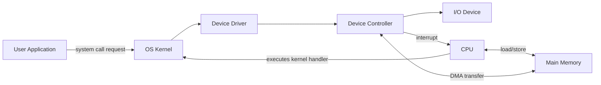
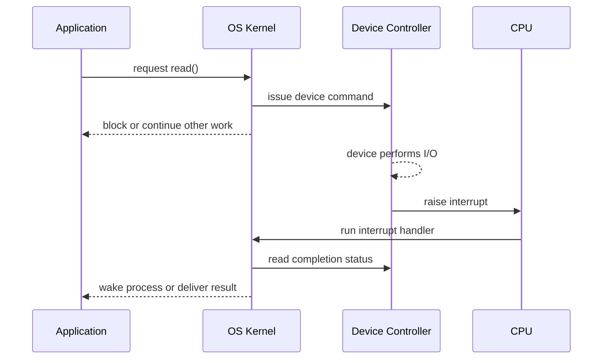
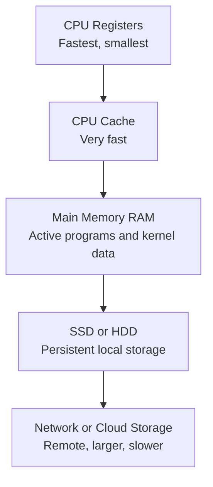

# Day 02 - Computer System Architecture for OS

Difficulty: Beginner  
Fresh Learning: 40 minutes  
Revision: 5 minutes  
Prerequisites: Day 01 - What is an Operating System?  
Why this topic matters in interviews: Computer system architecture explains how the OS coordinates the CPU, memory, device controllers, interrupts, DMA, storage, and boot process. Without this foundation, later topics like system calls, scheduling, paging, I/O, and device drivers feel like isolated facts instead of one connected machine.

## Opening Intuition

Imagine pressing a key while a video is playing, a browser tab is downloading a file, VS Code is indexing a project, and the operating system is writing logs in the background. From the user's point of view, these events seem smooth and simultaneous. Internally, the machine is a carefully coordinated system of CPU execution, memory access, device communication, interrupts, buses, storage layers, and kernel control.

The CPU cannot personally babysit every device. If it had to keep asking the keyboard, disk, network card, and display, "Do you need me now?", it would waste huge amounts of time. The OS solves this by using hardware support: devices communicate through controllers, controllers raise interrupts when they need attention, DMA moves large data blocks without forcing the CPU to copy every byte, and the storage hierarchy keeps recently needed data close to the processor.

This topic answers a basic but powerful question: what is the computer actually made of from the OS point of view? The OS is not floating above the machine. It depends on CPU modes, interrupts, memory, controllers, buses, firmware, and boot mechanisms. Once you understand that architecture, OS behavior becomes much easier to reason about.

## Interview Definition

Computer system architecture for operating systems describes the organization of the CPU, main memory, storage, I/O devices, buses, device controllers, interrupts, DMA, and boot firmware that allow the OS to manage hardware safely and efficiently. The OS uses this architecture to run programs, handle I/O, respond to device events, protect resources, and start the system. In interviews, explain it as the hardware foundation that makes OS abstractions such as processes, files, and device access possible.

## Mental Model

Think of the computer as a technical campus.

The CPU is the main work desk where instructions are executed. RAM is the working table where active papers are kept. Storage is the archive room where long-term records live. I/O devices are external departments such as printers, keyboards, network links, and displays. Device controllers are department managers who know the specific details of their devices. The OS is the operations manager that decides who can use the desk, where papers should be placed, which department request is urgent, and how work should resume after an interruption.

The important detail is that the CPU does not directly understand every device's mechanical or electrical details. It talks to controllers through registers, memory-mapped I/O, ports, interrupts, and drivers. This separation lets the OS provide a uniform interface even though the hardware below it is very different.

## Layer 1: What happens at a high level?

A running computer is a loop of computation and coordination.

Applications execute instructions on the CPU. Their code and data live in memory while they run. When they need input, output, files, networking, timers, or hardware access, they request OS services. The OS then talks to the right hardware component, often through a device driver. The device may complete the request immediately, or it may work in parallel and notify the CPU later using an interrupt.

At a high level, the architecture contains these major pieces:

- CPU: Executes instructions and switches between user work and kernel work.
- Main memory: Holds running programs, kernel data structures, stacks, heaps, buffers, and page tables.
- I/O devices: Keyboard, mouse, disk, network card, display, printer, timers, and other peripherals.
- Device controllers: Hardware units that manage specific devices and expose registers to the CPU.
- Bus or interconnect: Communication path between CPU, memory, and devices.
- Storage hierarchy: Registers, cache, RAM, SSD/HDD, and remote storage with increasing capacity and increasing latency.
- Firmware and bootloader: Early startup software that initializes hardware and loads the OS kernel.

The OS is the coordinator across these pieces. It decides when a program runs, what memory it can use, how I/O is requested, how device events are handled, and how the machine starts.

## Layer 2: What happens inside the OS?

Inside the OS, architecture appears as services and kernel subsystems.

When a program reads a file, the OS does not simply "read the file" as one action. It checks permissions, resolves the path, consults filesystem metadata, checks whether the data is already cached in memory, issues a block I/O request if needed, waits for disk completion, receives an interrupt, copies or maps data back to the process, and returns control to the application.

Several kernel subsystems cooperate:

- Process management decides which process or thread runs.
- Memory management maps virtual addresses to physical memory and protects address spaces.
- I/O management routes requests to device drivers.
- Interrupt handling responds to hardware events.
- Filesystem code translates file operations into storage operations.
- Device drivers translate generic OS requests into device-specific commands.
- Boot code transitions the machine from firmware startup into a running kernel.

This is why interviews often ask about interrupts, DMA, device controllers, and booting. They reveal whether you understand the OS as a bridge between software and hardware, not just as a list of definitions.

## Layer 3: What happens at hardware or kernel level?

At the hardware level, the CPU executes instructions from memory. Some instructions are ordinary user instructions, such as arithmetic or function calls. Other instructions are privileged, such as changing page tables, disabling interrupts, configuring I/O devices, or halting the CPU. The OS kernel runs with the authority needed to use privileged instructions.

I/O devices are usually not controlled directly by application code. A device controller exposes registers or memory-mapped addresses. The OS device driver writes commands into those registers, and the controller performs the actual device operation. When the operation finishes or needs attention, the controller raises an interrupt. The CPU temporarily pauses its current instruction flow, enters kernel interrupt handling code, services the event, and then resumes suitable work.

For large transfers, DMA matters. Without Direct Memory Access, the CPU might need to copy every byte from a device into memory. With DMA, the OS programs a DMA-capable controller with a memory address, length, and direction. The controller transfers data directly between the device and memory. The CPU is interrupted only when the operation completes or fails. This improves throughput and frees CPU cycles.

## Layer 4: What can go wrong?

Architecture exists because many things can go wrong without coordination.

If the CPU constantly polls devices, it wastes cycles. If devices can write anywhere in memory, they can corrupt the kernel or another process. If applications can execute privileged instructions, one bad program can crash the system. If interrupts are mishandled, the system can miss device events or become unresponsive. If the storage hierarchy is ignored, programs can become slow because they repeatedly fetch data from the slowest layer. If boot firmware cannot find a valid bootloader or kernel, the OS never starts.

Common failure patterns include:

- A device driver bug can crash the kernel because drivers often run with high privilege.
- Interrupt storms can consume CPU time and make the machine sluggish.
- Slow storage can make the CPU appear idle while applications are blocked on I/O.
- Bad DMA configuration can cause memory corruption.
- Firmware or bootloader misconfiguration can prevent startup.
- Poor cache behavior can make code slower even when the algorithm looks reasonable.

## Step-by-Step Flow

### What Happens When a Key Is Pressed?

1. The keyboard hardware detects a key press.
2. The keyboard controller records scan code data.
3. The controller raises an interrupt to notify the CPU.
4. The CPU temporarily pauses the current execution path.
5. The CPU enters kernel mode and jumps to the interrupt handler.
6. The keyboard driver reads the controller data.
7. The OS converts the scan code into a higher-level input event.
8. The event is placed into an input queue for the correct application or window system.
9. The interrupted work resumes, or the scheduler chooses another task.
10. The application eventually reads and handles the key event.

The key insight is that the CPU did not repeatedly ask the keyboard whether a key was pressed. The device signaled the CPU only when attention was needed.

### What Happens During Boot?

1. Power is applied and the CPU begins execution from a predefined firmware location.
2. BIOS or UEFI firmware initializes essential hardware.
3. Firmware performs basic checks and identifies a bootable device.
4. Firmware loads a bootloader from disk or EFI partition.
5. The bootloader loads the OS kernel into memory.
6. The bootloader passes hardware and boot configuration information to the kernel.
7. The kernel initializes memory management, interrupt tables, device drivers, and scheduler structures.
8. The kernel starts the first user-space service or init process.
9. System services start, login becomes available, and normal applications can run.

Booting is the handoff from simple firmware control to full OS control.

## Diagram Section

### Diagram 1: CPU, Memory, and Device Controller Relationship



This diagram shows the OS path between an application and a physical device. The application asks the OS, the kernel uses a driver, the driver programs the controller, and the controller may notify the CPU through an interrupt. DMA allows large data movement without the CPU copying every byte.

### Diagram 2: Interrupt-Driven I/O Timeline



The important point is overlap. The device performs I/O while the CPU can run other work. The interrupt tells the OS when the result is ready.

### Diagram 3: Storage Hierarchy



The OS uses the hierarchy to balance speed, size, and persistence. Faster layers are smaller and more expensive. Slower layers are larger and persistent.

## Practical System Relevance

In Linux, hardware events are handled through interrupt handlers and device drivers. A keyboard, disk, or network card typically communicates through controller registers and interrupts. The kernel exposes cleaner interfaces above that complexity: files, sockets, terminals, block devices, and character devices.

In Windows, the same broad idea applies even though the internal implementation differs. Hardware devices are accessed through drivers, I/O requests are represented using OS structures, and interrupts notify the kernel about device events. User applications do not directly program disk controllers or network cards.

In Android, the Linux kernel manages processes, memory, devices, and drivers underneath the Android framework. When a phone receives touch input, sensor data, network packets, or storage events, the hardware and kernel layers still rely on interrupts, drivers, and memory coordination.

In databases, storage hierarchy matters heavily. A database tries to keep hot pages in memory because disk or SSD access is slower than RAM. It also uses buffered I/O, direct I/O, fsync behavior, and background flushing. These database behaviors make more sense when you understand that storage is layered and device access is expensive.

In browsers, rendering, networking, disk cache, GPU acceleration, and input events all rely on OS-managed hardware access. A browser may feel like a single app, but underneath it uses processes, threads, memory mappings, file descriptors, sockets, timers, and device events.

In servers and cloud systems, interrupt handling and I/O performance directly affect throughput and latency. Network packets arrive through network interface cards, disk requests complete asynchronously, and the kernel must efficiently move data between devices, memory, and application buffers.

In containers, the container does not contain a separate physical computer. It shares the host kernel and host hardware, while namespaces and cgroups restrict what the process can see and use. That makes the hardware and OS boundary especially important.

## Code or Pseudocode Section

### Observing Devices and CPU Activity

On a Unix-like system, these commands help connect architecture to real observations:

```bash
lscpu
lsblk
cat /proc/interrupts
free -h
vmstat 1
dmesg | less
```

- `lscpu` shows CPU architecture, cores, threads, and cache-related details.
- `lsblk` shows block devices such as disks and partitions.
- `/proc/interrupts` shows interrupt counts per CPU, which helps reveal device activity.
- `free -h` shows memory usage.
- `vmstat 1` shows CPU, memory, and I/O activity once per second.
- `dmesg` shows kernel messages, including device initialization logs.

### Pseudocode: Interrupt-Driven I/O

```c
// Application asks the OS to read from a device-backed file.
read(fd, buffer, size);

// Kernel side idea:
driver_programs_controller(fd, buffer, size);
mark_process_waiting(current_process);
schedule_another_process();

// Later, hardware raises an interrupt.
interrupt_handler() {
    status = read_controller_status();
    mark_io_complete(status);
    wake_waiting_process();
}
```

This pseudocode demonstrates why I/O does not require the CPU to spin forever. The process can wait, the CPU can run other work, and the interrupt handler wakes the process when the data is ready.

### Pseudocode: DMA Setup

```c
dma_request.address = physical_buffer_address;
dma_request.length = 4096;
dma_request.direction = DEVICE_TO_MEMORY;

program_dma_controller(dma_request);
start_device_transfer();

// CPU can do other work here.

on_dma_completion_interrupt() {
    verify_transfer_status();
    make_buffer_available_to_kernel_or_process();
}
```

DMA is a performance mechanism. The CPU sets up the transfer; the controller performs the bulk movement.

## Common Misconceptions

1. A CPU alone is the whole computer.  
   The CPU executes instructions, but useful computing also needs memory, storage, I/O devices, controllers, buses, firmware, and OS coordination.

2. Interrupts are errors.  
   Many interrupts are normal hardware notifications. A keyboard press, timer tick, network packet, or disk completion can all use interrupts.

3. Polling is always bad.  
   Polling wastes CPU time when events are rare, but it can be useful in very high-performance or low-latency situations where the expected wait is tiny.

4. DMA means the CPU is not involved at all.  
   The CPU and OS are involved in setup, permission, mapping, and completion handling. DMA avoids byte-by-byte CPU copying, not all CPU involvement.

5. Storage and memory are the same because both store data.  
   RAM is fast and volatile. Disk or SSD storage is slower and persistent. The OS uses them for different roles.

6. Booting begins with the OS.  
   Booting begins with firmware. The OS kernel is loaded later by firmware and bootloader stages.

7. Device drivers are optional convenience code.  
   Drivers are essential translation layers between generic OS requests and device-specific behavior.

8. A system call directly manipulates hardware every time.  
   Some system calls touch only kernel data structures. Others may eventually trigger I/O. The point is controlled kernel entry, not always immediate hardware access.

## Tricky Interview Corners

### Why are interrupts better than polling?

Polling means the CPU repeatedly checks device status. If the device has nothing to report, CPU cycles are wasted. Interrupts allow the device to notify the CPU when attention is needed. This improves responsiveness and CPU utilization for many I/O workloads.

The trick is that interrupts are not free. Handling an interrupt requires saving state, entering kernel code, running a handler, and returning. If events are extremely frequent, interrupt overhead can become high. Some high-performance network systems combine interrupts with polling techniques.

### Why is DMA faster for large transfers?

Without DMA, the CPU may need to copy data word by word between a device and memory. With DMA, a controller transfers data directly between the device and memory after the OS sets up the address and length. This frees CPU time and improves throughput, especially for disk and network operations.

The interview trap is saying "DMA does not use the CPU." A better answer is: the CPU sets up and later handles completion, but it does not perform the bulk data movement.

### Why do we need device controllers?

Devices are very different internally. A keyboard, SSD, display, and network card do not expose the same behavior. Controllers hide device-specific electrical and operational details behind registers, interrupts, buffers, and command protocols. The OS driver knows how to talk to the controller.

### Why does the boot process need multiple stages?

At power-on, there is no running OS, no full filesystem service, and no normal process environment. Firmware must do minimal initialization and locate boot code. The bootloader then loads the kernel and passes control. The kernel then initializes the full OS environment.

### Why does storage hierarchy matter to OS design?

The CPU is much faster than main memory, and main memory is much faster than persistent storage. The OS must use caching, buffering, paging, and scheduling to reduce waiting. Many "slow computer" problems are really waiting problems, not pure CPU problems.

## Comparison Tables

### Interrupts vs Polling

| Point | Interrupts | Polling |
|---|---|---|
| Basic idea | Device notifies CPU | CPU repeatedly checks device |
| CPU usage | Efficient when events are infrequent | Can waste cycles |
| Latency | Usually responsive | Depends on polling interval |
| Overhead | Interrupt handling cost | Repeated checking cost |
| Common use | Keyboard, timers, disk completion, network | Tight embedded loops, some high-performance I/O |

### RAM vs Secondary Storage

| Point | RAM | SSD/HDD |
|---|---|---|
| Speed | Fast | Slower than RAM |
| Persistence | Volatile | Persistent |
| OS role | Active code, data, buffers, kernel structures | Files, executables, swap, logs |
| Access granularity | Loads/stores by CPU | Block-based I/O through storage stack |
| Interview phrase | Working area | Long-term storage |

### Programmed I/O vs DMA

| Point | Programmed I/O | DMA |
|---|---|---|
| Data movement | CPU copies data | Controller transfers data |
| CPU cost | High for large transfers | Lower for large transfers |
| Setup complexity | Simpler | More setup needed |
| Best fit | Small or simple I/O | Disk, network, large buffers |
| Completion | CPU checks or handles event | Interrupt usually signals completion |

## How to Explain This in an Interview

### 30-second answer

Computer system architecture is the hardware organization that the OS manages: CPU, memory, storage, I/O devices, buses, controllers, interrupts, DMA, and firmware. The OS uses this architecture to run programs, protect resources, handle I/O, and respond to hardware events efficiently.

### 2-minute answer

From the OS point of view, the CPU executes instructions, memory holds active programs and kernel data, storage keeps persistent data, and I/O devices communicate through device controllers. Applications do not directly control hardware. They request OS services through controlled interfaces. The kernel uses drivers to program device controllers, handles interrupts when devices need attention, and may use DMA so large data transfers happen directly between devices and memory. During boot, firmware and the bootloader initialize enough of the system to load the kernel, after which the OS takes control.

### Deeper follow-up answer

The key reason this architecture matters is coordination and protection. Hardware is shared, slow devices must not waste CPU time, and user programs must not execute privileged operations. Interrupts allow asynchronous device notification, DMA reduces CPU copying, device controllers isolate hardware details, and the storage hierarchy explains why caching and buffering are necessary. These ideas show up later in process scheduling, system calls, memory management, file systems, and I/O performance.

## Interview Questions

### Basic Questions

1. What are the main components of a computer system from an OS perspective?
2. Why does an OS need to understand CPU, memory, and I/O devices?
3. What is an interrupt?
4. What is polling?
5. What is a device controller?

### Intermediate Questions

6. Why are interrupts usually preferred over polling for I/O?
7. What is DMA, and why is it useful?
8. What happens when a key is pressed on the keyboard?
9. What is the difference between RAM and secondary storage?
10. Why are device drivers needed?

### Advanced Questions

11. Why can interrupt overhead become a performance problem?
12. How does DMA improve throughput while still requiring OS control?
13. Explain the boot process from power-on to the first user process.
14. How does storage hierarchy influence OS design?
15. Why should applications not directly execute privileged hardware instructions?

## Follow-Up Questions

Q: What is an interrupt?  
Follow-ups:

- How is it different from polling?
- What happens to the currently running program during an interrupt?
- Can interrupts happen while user code is running?
- Why must interrupt handlers be fast?

Q: What is DMA?  
Follow-ups:

- Who sets up the DMA transfer?
- Why is DMA useful for disk and network I/O?
- Does DMA completely eliminate CPU involvement?
- What can go wrong if DMA is misconfigured?

Q: What is a device controller?  
Follow-ups:

- How does the OS communicate with it?
- Why not let applications program controllers directly?
- What role does a device driver play?

Q: Explain the boot process.  
Follow-ups:

- What does firmware do?
- Why is a bootloader needed?
- When does the kernel take control?
- What is the first user-space process?

Q: Why is storage hierarchy important?  
Follow-ups:

- Why cannot all storage be as fast as CPU registers?
- How does caching help?
- Why can a program be slow even when CPU usage is low?

## Trick Questions

1. Q: If a device raises an interrupt, does that always mean something went wrong?  
   Expected answer: No. Many interrupts are normal notifications, such as keyboard input, timer ticks, network packets, or I/O completion.

2. Q: Does DMA mean the device can safely write anywhere in memory?  
   Expected answer: No. The OS must set up allowed buffers and mappings. Uncontrolled DMA would be a security and correctness problem.

3. Q: Is polling always worse than interrupts?  
   Expected answer: No. Polling can be useful when events are extremely frequent or when predictable low latency matters, but it wastes CPU when events are rare.

4. Q: Does the OS start running immediately when power is applied?  
   Expected answer: No. Firmware runs first, then a bootloader loads the OS kernel.

5. Q: Is a device driver the same as the physical device?  
   Expected answer: No. A driver is software that knows how to communicate with the physical device or its controller.

6. Q: If the CPU is idle, does that mean the system has nothing to do?  
   Expected answer: Not necessarily. The system may be waiting for disk, network, memory, or device events.

7. Q: Are RAM and disk interchangeable because both store bytes?  
   Expected answer: No. RAM is volatile and fast; disk/SSD storage is persistent and slower.

## Practical Debugging / Observation

If you are on Linux or WSL, try:

```bash
cat /proc/interrupts
vmstat 1
free -h
lsblk
dmesg | tail -50
```

What to observe:

- In `/proc/interrupts`, interrupt counts increase as devices generate events.
- In `vmstat 1`, watch `us`, `sy`, `id`, `wa`, `bi`, and `bo`. High `wa` suggests time waiting on I/O.
- In `free -h`, notice that Linux uses memory for buffers and cache, not just application allocations.
- In `lsblk`, map storage devices and partitions.
- In `dmesg`, look for hardware detection and driver initialization messages.

On Windows, similar observations can be made through:

```powershell
Get-ComputerInfo
Get-PhysicalDisk
Get-Process
resmon
msinfo32
```

Resource Monitor is especially useful for connecting CPU, memory, disk, and network behavior to real system activity.

## Mini Quiz

### MCQs

1. Which component executes program instructions?
   A. SSD  
   B. CPU  
   C. Keyboard controller  
   D. Bootloader  

2. What is the main advantage of interrupts over constant polling?
   A. They remove the need for memory  
   B. They let devices notify the CPU when attention is needed  
   C. They make disks as fast as registers  
   D. They eliminate device drivers  

3. DMA is mainly used to:
   A. Encrypt files automatically  
   B. Transfer data between a device and memory without CPU byte-by-byte copying  
   C. Replace all interrupts  
   D. Start the bootloader  

4. Which stage usually runs before the OS kernel?
   A. Application login shell  
   B. Browser process  
   C. Firmware and bootloader  
   D. User-level thread scheduler  

5. Why is RAM not used as permanent storage?
   A. It is too slow  
   B. It is volatile  
   C. The CPU cannot access it  
   D. It has no addresses  

### Short-Answer Questions

1. Define device controller in two lines.
2. Why does the OS use device drivers?
3. What is the difference between polling and interrupt-driven I/O?

### Reasoning Questions

1. A system shows low CPU usage but applications feel slow. Explain how storage or I/O waiting could cause this.
2. Why would letting user programs directly execute privileged I/O instructions be dangerous?

### Answers

1. B  
2. B  
3. B  
4. C  
5. B  

Short answers:

1. A device controller is hardware that manages a specific I/O device and exposes registers, buffers, status, and command interfaces to the CPU or OS.
2. The OS uses drivers because each device has specific behavior. Drivers translate generic OS requests into device-specific commands.
3. Polling repeatedly checks device status. Interrupt-driven I/O lets the device notify the CPU when it needs attention or completes work.

Reasoning answers:

1. The CPU may be idle because processes are blocked waiting for disk, network, or device completion. The bottleneck is not instruction execution; it is slow I/O.
2. Direct privileged I/O access could let a program corrupt devices, read private data, overwrite memory, crash the system, or bypass OS security.

# 5-Minute Revision Column

Revision targets for today: Day 01 - What is an Operating System? (R1, previous day reinforcement)

## 5-7 Bullet Summary

- An operating system is system software that manages hardware resources and provides services to applications.
- The OS acts as both a resource manager and an abstraction provider.
- As a resource manager, it decides how CPU time, memory, files, and devices are shared.
- As an abstraction provider, it exposes simpler ideas such as processes, files, and virtual memory instead of raw hardware details.
- Applications normally request OS services instead of directly controlling hardware.
- The kernel is the privileged core of the OS, but the full OS may also include system utilities, shells, services, and user interfaces.
- A good interview answer should connect the OS to safety, sharing, convenience, and hardware control.

## 3 Key Definitions

- Operating System: System software that manages hardware and provides services and abstractions for programs.
- Kernel: The privileged core component that manages CPU, memory, devices, interrupts, and system calls.
- System Call: A controlled entry point through which a user program requests a service from the OS kernel.

## 2 Common Traps

- Trap 1: Saying the OS is only the desktop or graphical interface. The desktop is only one user-facing part; the OS includes deeper resource management and kernel services.
- Trap 2: Saying the kernel and OS are always exactly the same. The kernel is central, but the OS can include additional system programs, services, and interfaces.

## 2 Quick Interview Questions

1. Why do applications not directly control hardware?  
   Because direct hardware control would be unsafe, inconsistent, and difficult to share. The OS enforces protection and provides stable interfaces.

2. What are the two best ways to describe an OS?  
   As a resource manager and as an abstraction layer.

## 1 Mental Model

Think of the OS as a building manager for a technical campus. Applications are teams needing rooms, electricity, network access, storage, and tools. The manager allocates shared resources, enforces rules, hides infrastructure complexity, and prevents one team from disrupting another.

## Final Takeaway

Computer system architecture is the physical and logical foundation underneath operating systems. The CPU executes instructions, memory holds active state, storage preserves data, device controllers manage peripherals, interrupts notify the CPU about events, DMA improves large transfers, and firmware plus bootloaders start the OS. The operating system becomes meaningful only because it coordinates all these pieces safely and efficiently. If you understand this layer, later topics like system calls, scheduling, device drivers, paging, and I/O performance become easier to connect.

## What You Should Be Able To Answer Now

- Explain the roles of CPU, memory, storage, I/O devices, controllers, and buses.
- Describe why interrupts are usually better than constant polling.
- Explain what happens when a key is pressed.
- Define DMA and explain why it improves large I/O transfers.
- Describe the boot process from firmware to kernel startup.
- Compare RAM and secondary storage.
- Explain why device drivers are needed.
- Connect architecture concepts to real OS behavior in Linux, Windows, Android, servers, browsers, and databases.
