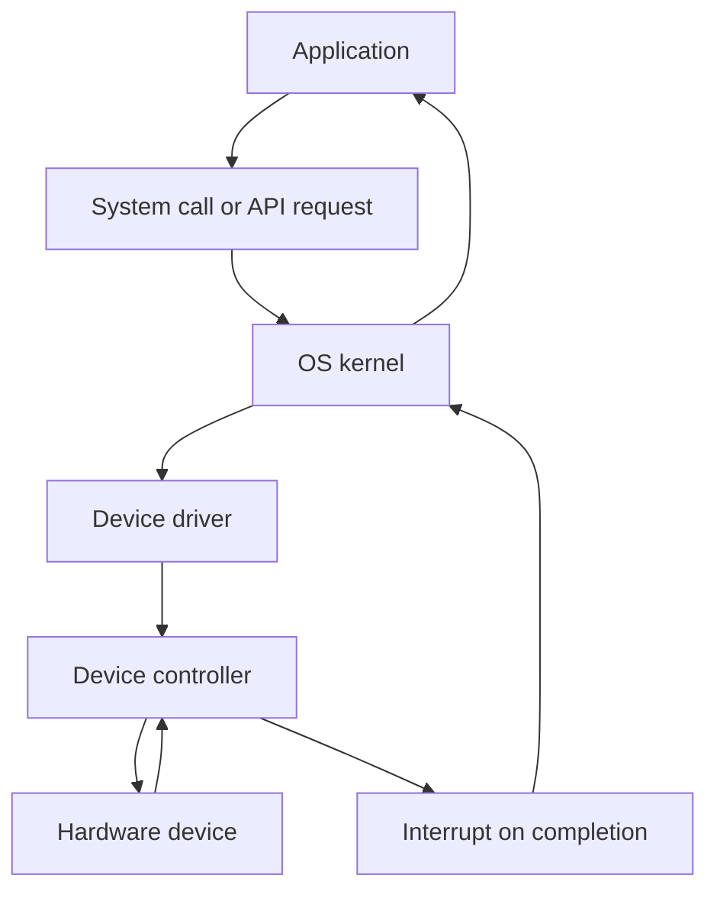
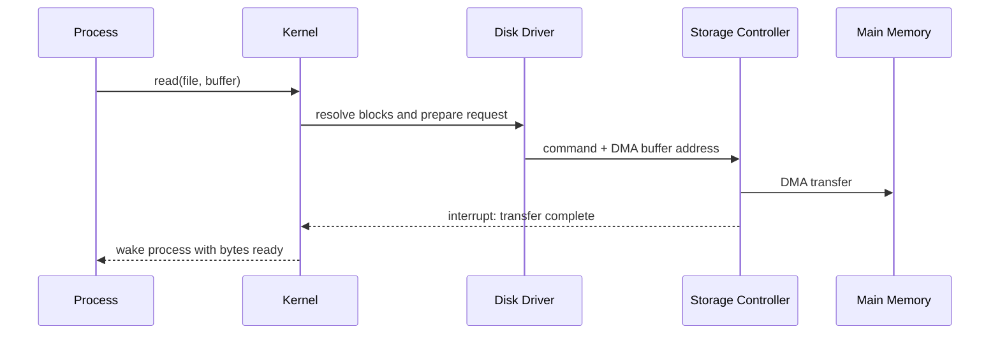
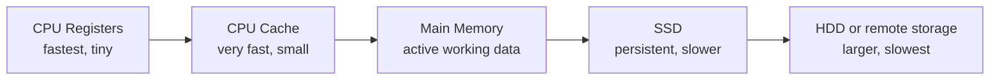

# Day 02 - Computer System Architecture for OS

Difficulty: Beginner  
Fresh Learning: 40 minutes  
Revision: 5 minutes  
Prerequisites: Day 01 - What is an Operating System?  
Why this topic matters in interviews: Explains how the OS coordinates CPU, memory, devices, interrupts, DMA, storage, and bootstrapping. Without this architecture, later topics such as system calls, scheduling, virtual memory, device drivers, and I/O feel disconnected.

## Opening Intuition

Imagine pressing a key while a video is playing, a browser is downloading a file, a code editor is saving changes, and the battery manager is watching power usage. The CPU cannot personally stare at every key, disk block, network packet, and timer at all times. It needs a disciplined way to execute program instructions, hear from devices, move data, and recover control when something needs attention.

Computer system architecture is the hardware shape that makes operating systems possible. The OS is not magic software floating above the machine. It depends on CPUs, registers, memory, buses, device controllers, interrupts, DMA engines, firmware, and storage hierarchy. These pieces decide what the OS can do efficiently and what it must carefully protect.

You see this architecture every day. A key press appears instantly because the keyboard controller signals the CPU through an interrupt. A file download does not freeze the machine because the network device and OS cooperate asynchronously. A disk transfer does not require the CPU to copy every byte one by one because DMA can move data directly between a device and memory. A laptop starts from power-off because firmware finds boot code and loads the OS kernel.

Without this architecture, the OS would either waste CPU time constantly polling devices, expose unsafe hardware access to applications, or fail to coordinate memory and I/O correctly. This is why interviewers ask about interrupts, DMA, storage hierarchy, and boot process early. These ideas explain the physical foundation beneath every OS abstraction.

## Interview Definition

Computer system architecture for OS describes how the CPU, main memory, storage, I/O devices, device controllers, buses, interrupts, DMA, and firmware cooperate so an operating system can manage resources safely and efficiently.

In an interview, say: the CPU executes instructions, memory holds active code and data, devices communicate through controllers, interrupts notify the CPU about events, DMA transfers bulk data without constant CPU copying, and firmware starts the boot process that loads the OS.

## Mental Model

Think of the computer as a busy operations floor.

The CPU is the central worker that executes instructions. Main memory is the working desk where active papers are kept. Storage is the archive room: larger but slower. Devices are specialized departments: keyboard, display, disk, network card, printer, audio hardware. Device controllers are the clerks who know how to talk to each department's hardware. Interrupts are urgent notifications sent to the central worker. DMA is a delivery cart that can move boxes between a department and the desk without making the central worker carry every item.

The OS is the floor manager. It does not physically become the CPU, memory, or disk. Instead, it knows how to coordinate them. It decides which program gets CPU time, where memory is assigned, which device request is legal, how data moves, and what happens when a device reports completion.

This model is useful because it separates responsibility:

- CPU: executes instructions and switches between user/kernel work.
- Memory: stores active instructions, data, buffers, and kernel structures.
- Device controllers: expose hardware operations through registers and interrupts.
- Interrupts: let hardware request OS attention without constant polling.
- DMA: moves large data blocks efficiently.
- Firmware and bootloader: create the first path from powered-off hardware to a running OS.

## Layer 1: What happens at a high level?

At a high level, a computer system runs programs by moving instructions and data between storage, memory, CPU, and devices. The OS sits in the middle and gives order to that movement.

When you launch an application, the executable usually lives on storage. The OS reads the executable, maps parts of it into memory, creates a process, prepares CPU state, and schedules it. The CPU then fetches instructions from memory, decodes them, executes them, and writes results back to registers or memory.

When the program needs input or output, it cannot safely control devices directly. It asks the OS through system calls or runtime APIs. The OS checks permission, prepares buffers, talks to device drivers, and lets device controllers perform work. When the work finishes, the device can interrupt the CPU so the OS can wake the waiting process or continue the I/O pipeline.

This high-level picture gives three core flows:

1. Execution flow: storage to memory to CPU.
2. I/O flow: process request to OS to driver to device controller and back.
3. Event flow: device or timer to interrupt to kernel handler to scheduler or waiting process.

The OS depends on this architecture to create the illusion that many programs are progressing together. In reality, the CPU executes instructions in small pieces, devices complete asynchronously, and the kernel coordinates all shared state.

## Layer 2: What happens inside the OS?

Inside the OS, hardware architecture appears as kernel responsibilities.

The CPU management part of the OS tracks which process or thread should run. It uses hardware timers to receive periodic interrupts. These interrupts allow preemption: the OS can regain control even if a user program does not voluntarily stop. Without timer interrupts, a badly behaved program could keep the CPU indefinitely.

The memory management part tracks physical RAM, builds virtual address mappings, protects kernel memory from user programs, and prepares memory buffers for I/O. Later, paging and virtual memory will explain this in detail, but the early idea is simple: memory is shared hardware, and the OS must isolate users of that memory.

The I/O subsystem uses device drivers. A driver is kernel-level code that understands a device's command registers, status registers, interrupt behavior, and data transfer rules. Applications normally see clean interfaces such as read, write, send, recv, open, close, or file handles. The driver sees hardware details.

The interrupt subsystem keeps tables of interrupt handlers. When a device or timer signals an interrupt, the CPU enters a controlled kernel path. The OS saves enough current state, identifies the interrupt source, runs the correct handler, acknowledges the device if needed, updates kernel structures, and returns to execution or schedules another task.

The storage subsystem uses the storage hierarchy. Registers are fastest and smallest. CPU caches are fast but small. RAM is larger but slower. SSDs and HDDs are much larger but far slower than RAM. The OS uses caching, buffering, paging, and file systems partly because storage levels have different speed and capacity.

## Layer 3: What happens at hardware or kernel level?

At the hardware level, the CPU repeatedly performs a fetch-decode-execute cycle. It fetches an instruction from memory using an address, decodes what operation is requested, executes it, and updates registers, memory, or control flow. Registers such as the program counter, stack pointer, and general-purpose registers hold the immediate execution state.

Modern CPUs also support privilege levels. User programs run in a restricted mode. Kernel code runs in a privileged mode. This matters because instructions that control devices, memory maps, interrupts, or CPU state must not be available to arbitrary applications. The architecture gives the OS protected control.

Devices are usually not controlled by applications directly. They expose control and status through device controllers. A controller may have registers for commands, status bits, buffer addresses, and completion information. The OS driver writes commands to these registers and reads status from them. The exact mechanism can involve port-mapped I/O or memory-mapped I/O depending on architecture.

Interrupts are a hardware-supported way to break the normal execution flow. A device raises an interrupt line or sends an interrupt message. The CPU pauses current execution at a safe boundary, saves enough state, enters kernel mode, and jumps to an interrupt service routine. After handling the event, the kernel either resumes the interrupted task or schedules something else.

DMA, or Direct Memory Access, lets a device controller transfer blocks of data directly to or from main memory after the OS configures the transfer. The CPU still sets up the operation, validates buffers, and handles completion, but it does not copy every byte. This is essential for disks, network cards, audio, video, and other high-throughput devices.

## Layer 4: What can go wrong?

Several things can go wrong when hardware and OS coordination is weak.

Polling can waste CPU time. If the CPU repeatedly asks a device "are you done yet?", it burns cycles that could run useful work. Interrupts solve this for many cases by letting devices notify the CPU only when attention is needed. Polling is still useful in some high-performance cases, but it is not the default mental model for ordinary OS I/O.

Interrupt storms can hurt performance. If a device generates too many interrupts, the CPU may spend excessive time handling events instead of running user work. Real systems often use batching, interrupt coalescing, and careful driver design to reduce this.

DMA can be unsafe without OS control. If a device is allowed to write to arbitrary memory, it could corrupt kernel data or another process. Modern systems use IOMMUs and careful buffer management to restrict device memory access.

Slow storage can dominate performance. A process may appear "slow" even while the CPU is idle because it waits for disk or network I/O. Understanding storage hierarchy helps explain why RAM, caches, SSDs, and disks behave differently.

Boot failure can happen before the OS is even running. Firmware must initialize hardware enough to find a bootloader. The bootloader must load the kernel. The kernel must initialize drivers, memory management, and process startup. If any stage fails, the machine may never reach the login screen.

## Step-by-Step Flow

Here is a concrete flow for a keyboard key press:

1. The user presses a key.
2. The keyboard hardware detects the signal.
3. The keyboard controller records key event data.
4. The controller raises an interrupt.
5. The CPU pauses the currently running instruction stream at a controlled point.
6. The CPU enters kernel mode and jumps to the interrupt handler.
7. The OS keyboard driver reads the event from the controller.
8. The OS places the event into an input buffer or event queue.
9. The scheduler later lets the relevant application process consume the event.
10. The application receives a clean input event, not raw electrical behavior.

Here is a concrete flow for disk read using DMA:

1. A process calls read on a file.
2. The system call enters the kernel.
3. The filesystem resolves the file offset to storage blocks.
4. The driver prepares a memory buffer and device command.
5. The OS configures the storage controller with the command and buffer address.
6. The process may block while I/O is pending.
7. The device controller performs DMA into memory.
8. The device raises an interrupt when the transfer completes.
9. The OS marks the I/O complete and wakes the waiting process.
10. The process resumes and sees bytes in its buffer.

## Diagram Section



This flow shows why applications do not directly manage hardware. The OS checks, translates, and coordinates requests through drivers and controllers, then uses interrupts to learn when work is complete.



This sequence diagram shows the important interview point: DMA transfers the bulk data, but the OS still validates, configures, tracks, and completes the operation.



The storage hierarchy explains why the OS uses caching, buffering, paging, and careful I/O scheduling. Bigger storage usually costs more time to access.

## Practical System Relevance

In Linux, hardware events enter the kernel through interrupt handlers, device drivers, and kernel subsystems. You can observe many hardware-facing concepts through files under `/proc` and `/sys`, commands like `lspci`, `lsblk`, `dmesg`, `top`, and `vmstat`, and tracing tools such as `strace`.

In Windows, device drivers, interrupt handling, kernel scheduling, memory management, and I/O completion mechanisms work together so applications can use files, windows, network sockets, and USB devices without owning the hardware directly.

In Android, the Linux kernel foundation manages CPU scheduling, memory, interrupts, drivers, and device access, while higher layers add app lifecycle, permissions, sandboxing, and user-facing services. The phone experience depends heavily on interrupt-driven input, power-aware scheduling, and storage hierarchy.

In databases, storage hierarchy matters a lot. A database may keep hot pages in memory, rely on OS page cache behavior, use direct I/O in some configurations, and carefully manage disk flushes for durability. A slow disk or poor I/O pattern can dominate latency even when CPU usage looks low.

In browsers, multiple processes and threads issue network, file, GPU, input, and rendering work. The browser depends on OS scheduling, sockets, memory protection, timers, and device drivers. A page loading slowly may be waiting on network I/O, not CPU execution.

In cloud and containers, the OS and hypervisor must coordinate virtual CPUs, virtual memory, virtual disks, and virtual network devices. Even when hardware is abstracted, interrupts, DMA-like mechanisms, storage hierarchy, and scheduling remain important.

## Code or Pseudocode Section

You can observe the architecture from a shell:

```bash
# See CPU model and cores on Linux
lscpu

# See block devices
lsblk

# See recent kernel and driver messages
dmesg | tail

# Watch CPU, memory, and waiting behavior
vmstat 1

# Trace system calls made by a program
strace ./program
```

On Windows, similar observations can be made through Task Manager, Resource Monitor, Device Manager, Event Viewer, and PowerShell commands:

```powershell
Get-ComputerInfo
Get-Process
Get-PhysicalDisk
Get-PnpDevice
```

C-like pseudocode for interrupt-driven I/O looks like this:

```c
read(file, user_buffer) {
    enter_kernel();
    validate_user_buffer(user_buffer);
    block = filesystem_lookup(file);
    setup_dma(device, block, kernel_buffer);
    mark_process_waiting();
    schedule_another_process();
}

interrupt_handler() {
    acknowledge_device();
    copy_or_map_data_to_user_buffer();
    mark_process_ready();
}
```

This is not exact kernel code. It demonstrates the concept: the process requests I/O, the kernel starts device work, another process can run, and an interrupt completes the request later.

## Common Misconceptions

- Misconception: The CPU personally controls every device operation.  
  Correction: The CPU configures operations, but device controllers and DMA engines can perform work independently after setup.

- Misconception: Interrupts are errors.  
  Correction: Many interrupts are normal hardware notifications, such as timer ticks, keyboard input, network packets, and disk completion.

- Misconception: DMA means the OS is not involved.  
  Correction: The OS configures DMA, validates memory buffers, tracks ownership, and handles completion.

- Misconception: Polling is always bad.  
  Correction: Polling wastes CPU in many ordinary cases, but controlled polling can be useful in very high-performance paths where interrupt overhead is too high.

- Misconception: Storage is just "memory but bigger."  
  Correction: Registers, cache, RAM, SSD, HDD, and remote storage have very different latency, capacity, persistence, and access patterns.

- Misconception: Booting starts when the OS starts.  
  Correction: Booting begins before the OS kernel is running. Firmware and bootloader steps prepare the path to load the kernel.

- Misconception: A device driver is an application.  
  Correction: A driver is usually privileged OS-level code that talks to hardware controllers and exposes safe services to the rest of the OS.

## Tricky Interview Corners

Interrupts are needed for preemption. A timer interrupt gives the OS a way to regain control from a running program. This is one reason modern multitasking does not depend entirely on programs voluntarily yielding.

System calls and interrupts are different but related. A system call is usually initiated by a program requesting an OS service. A hardware interrupt is usually initiated by hardware requiring attention. Both can move execution into kernel-controlled code paths.

DMA improves throughput but creates protection questions. If hardware can write memory directly, the OS must ensure it writes only allowed buffers. This is why IOMMU-style protection matters in modern systems.

The CPU can be idle while the system feels slow. If processes are waiting for disk or network I/O, CPU utilization may be low. Interviewers often use this to test whether you confuse CPU bottlenecks with I/O bottlenecks.

Storage hierarchy is not only about speed. It is also about volatility, capacity, cost, and access granularity. Registers and cache are fast but tiny. RAM is active and volatile. SSDs and disks are persistent but much slower.

Polling vs interrupts is a tradeoff. Interrupts avoid wasting CPU while waiting, but too many interrupts can add overhead. Polling can be reasonable when events arrive extremely frequently and the system can dedicate CPU resources.

## Comparison Tables

| Concept | What starts it? | Main purpose | Interview trap |
|---|---|---|---|
| System call | User program | Request OS service | Not a normal function call |
| Hardware interrupt | Device/timer | Notify CPU/kernel of event | Not always an error |
| Exception/trap | CPU detects condition or instruction | Handle fault or controlled transition | Some are normal control mechanisms |

| Method | CPU role | Device role | Best for |
|---|---|---|---|
| Polling | Repeatedly checks status | Waits for CPU checks | Simple or high-rate controlled cases |
| Interrupt-driven I/O | Starts work, handles notification | Signals when attention is needed | General asynchronous I/O |
| DMA | Configures and completes transfer | Moves bulk data to/from memory | Disk, network, audio, video |

| Layer | Speed | Size | Persistence | OS relevance |
|---|---:|---:|---|---|
| Registers | Fastest | Tiny | No | Current CPU state |
| Cache | Very fast | Small | No | Hidden performance effects |
| RAM | Fast | Medium | No | Active processes and buffers |
| SSD/HDD | Slow compared to RAM | Large | Yes | Files, swap, durable data |

## How to Explain This in an Interview

### 30-second answer

A computer system for OS consists of CPU, memory, storage, devices, controllers, buses, interrupts, DMA, and firmware. The CPU executes instructions, memory holds active code and data, devices report events through controllers and interrupts, DMA moves large data efficiently, and firmware plus bootloader load the OS. The OS coordinates all of this safely.

### 2-minute answer

The OS depends on hardware architecture to manage resources. Programs execute on the CPU, but active instructions and data must be in memory. Devices such as disks, keyboards, network cards, and displays are controlled through device controllers and drivers. Instead of constantly polling every device, the CPU can receive interrupts, which let the kernel handle events such as timer ticks, key presses, and I/O completion. For large transfers, DMA allows devices to move data directly between the device and main memory after the OS sets up a safe buffer. At boot time, firmware initializes enough hardware to find a bootloader, and the bootloader loads the kernel. Once the kernel runs, it initializes memory management, drivers, interrupts, and the first user processes.

### Deeper follow-up answer

The important depth is protection and efficiency. User programs should not directly control hardware, memory mappings, or interrupts, so the CPU supports privileged execution modes. The OS uses kernel mode to configure hardware and user mode to isolate applications. Interrupts and timers allow preemptive multitasking. DMA reduces CPU copying cost but requires memory protection, often with IOMMU support. Storage hierarchy explains why systems cache aggressively and why I/O-bound programs can be slow even with low CPU usage.

## Interview Questions

### Basic Questions

1. What are the major hardware components an OS coordinates?
2. What is the role of the CPU in a computer system?
3. Why must active program data be in main memory?
4. What is a device controller?
5. What is an interrupt?

### Intermediate Questions

6. Why are interrupts usually better than polling for ordinary I/O?
7. What is DMA, and why does it improve performance?
8. Explain what happens when a key is pressed.
9. Explain what happens when a process reads from disk.
10. What is the storage hierarchy, and why does it matter to the OS?

### Advanced Questions

11. How do timer interrupts help preemptive scheduling?
12. Why can DMA be a security risk without OS protection?
13. Why can a system feel slow even when CPU usage is low?
14. How does bootstrapping move from firmware to a running kernel?
15. Compare system calls, hardware interrupts, and exceptions.

## Follow-Up Questions

Q: What is an interrupt?  
Follow-ups:
- Who raises a hardware interrupt?
- Why does the CPU enter kernel-controlled code?
- How is a timer interrupt useful for scheduling?
- Can too many interrupts hurt performance?

Q: Why is DMA useful?  
Follow-ups:
- Does DMA mean the CPU does nothing?
- What memory buffer must the OS prepare?
- Why can arbitrary DMA be dangerous?
- Which devices commonly use DMA?

Q: What happens when a key is pressed?  
Follow-ups:
- What does the keyboard controller do?
- Why does the application not read raw hardware signals?
- Where might the OS store the event?
- How does the waiting application receive it?

Q: Explain the boot process.  
Follow-ups:
- What does firmware do before the OS runs?
- Why is a bootloader needed?
- When does the kernel initialize drivers?
- Why can boot fail before user login?

Q: Why is storage hierarchy important?  
Follow-ups:
- Why is RAM not used for all persistent data?
- Why does the OS cache file data?
- Why can disk I/O dominate latency?
- How does this connect to virtual memory later?

## Trick Questions

1. Q: If a disk uses DMA, is the OS bypassed completely?  
   Expected answer: No. The OS configures the transfer, validates buffers, tracks the request, and handles completion.

2. Q: Are interrupts always caused by bugs or crashes?  
   Expected answer: No. Many interrupts are normal events such as keyboard input, timer ticks, network packets, and I/O completion.

3. Q: If CPU usage is low, is the system definitely not overloaded?  
   Expected answer: No. The workload may be blocked on disk, network, memory pressure, or other I/O.

4. Q: Is polling always worse than interrupts?  
   Expected answer: No. Interrupts are better for many ordinary cases, but polling can be useful in high-frequency, low-latency paths.

5. Q: Does booting begin when the kernel starts?  
   Expected answer: No. Firmware and bootloader stages happen before the kernel is running.

6. Q: Can a user application safely write to device controller registers directly?  
   Expected answer: Normally no. Device control is privileged and mediated by the OS and drivers.

7. Q: Is main memory the same as permanent storage?  
   Expected answer: No. RAM is volatile active memory; SSDs and disks are persistent storage.

## Practical Debugging / Observation

Use these observations to connect theory to real systems:

```bash
lscpu
```

Look for CPU count, architecture, threads per core, and cache information.

```bash
lsblk
```

Observe storage devices and partitions. This connects file systems to physical or virtual block devices.

```bash
dmesg | tail -50
```

Look for kernel messages from drivers, storage, USB, network, and boot-time hardware detection.

```bash
vmstat 1
```

Watch CPU usage, runnable processes, memory, and I/O wait. The `wa` column helps show time waiting for I/O.

```bash
strace -e read,write,openat ./program
```

Observe how normal-looking library operations become system calls.

On Windows, use Task Manager and Resource Monitor to compare CPU, memory, disk, and network. A process can be unresponsive because of disk or network wait, not only because of high CPU use.

## Mini Quiz

### MCQs

1. Which component executes program instructions?  
   A. SSD  
   B. CPU  
   C. Keyboard controller  
   D. Bootloader

2. What is the main advantage of interrupts over simple polling?  
   A. They remove the need for memory  
   B. They let devices notify the CPU when attention is needed  
   C. They make storage permanent  
   D. They prevent all bugs

3. What does DMA mainly reduce?  
   A. CPU copying work during bulk data transfer  
   B. Need for device controllers  
   C. Need for kernel mode  
   D. Need for storage

4. What usually happens first after power-on?  
   A. User app starts  
   B. Firmware initializes enough hardware to find boot code  
   C. Browser opens  
   D. Shell command runs

5. Which storage level is typically volatile but active for running programs?  
   A. RAM  
   B. HDD  
   C. Optical disk  
   D. Remote backup

### Short-answer questions

1. Define device controller in one or two lines.
2. Why does the OS need timer interrupts?
3. Why can a process wait even when the CPU is free?

### Reasoning questions

1. A program is downloading a large file, but CPU usage is low. Explain a likely reason.
2. Why should applications not directly control hardware registers?

### Answers

1. B  
2. B  
3. A  
4. B  
5. A  

Short answers:

1. A device controller is hardware that manages a device and exposes command/status mechanisms the OS driver can use.
2. Timer interrupts let the OS regain control for scheduling, accounting, and preemption.
3. The process may be blocked on I/O, a lock, memory paging, network response, or another event.

Reasoning:

1. The program is likely I/O-bound, waiting for network or disk transfer rather than CPU computation.
2. Direct hardware access would break protection, allow device misuse, corrupt memory or data, and make safe multitasking impossible.

# 5-Minute Revision Column

Revision Targets:

- Day 01: What is an Operating System? - R1 Recall Revision

## Day 01 compressed recall

An operating system is system software that manages hardware resources and provides abstractions for applications. The strong interview framing is: OS = resource manager + abstraction provider + protector. It manages CPU time, memory, files, devices, networking, and security while giving programs cleaner objects such as processes, files, sockets, virtual memory, and system calls.

Key definitions:

- Operating System: software that manages hardware resources and provides services and abstractions to applications.
- Kernel: the privileged core responsible for scheduling, memory management, interrupts, device control, and system calls.
- System Call: a controlled request from user code into the kernel for an OS service.

Core example: when an application reads a file, it does not command the SSD directly. It asks the OS. The OS checks permissions, resolves filesystem metadata, uses buffers or cache, talks to a driver, and returns bytes.

Common traps:

- The OS is not just the GUI. The desktop is only a user-facing layer above deeper OS services.
- The kernel is not always the full OS. It is the privileged core inside the wider operating environment.

Quick interview questions:

1. Why should applications not directly access hardware?
2. Explain OS as both a resource manager and an abstraction provider.

Mental model: the OS is like a building manager for shared infrastructure. It does not do every person's work, but it allocates rooms, enforces permissions, coordinates shared services, and prevents one user from damaging another.

## Final Takeaway

Computer system architecture is the hardware foundation that lets the OS do its job. The CPU executes instructions, memory stores active code and data, devices communicate through controllers, and interrupts let hardware notify the kernel. DMA improves large data transfers by avoiding byte-by-byte CPU copying, but the OS still controls safety and completion. Storage hierarchy explains why systems cache, buffer, and sometimes wait. Bootstrapping explains how a powered-off machine reaches a running kernel. If Day 1 explained why an OS exists, Day 2 explains the machine structure that gives the OS something to manage.

## What You Should Be Able To Answer Now

- Explain the roles of CPU, memory, storage, devices, and device controllers.
- Describe why interrupts are better than constant polling in many cases.
- Explain how a key press reaches an application.
- Explain how DMA helps disk or network I/O.
- Compare system calls, hardware interrupts, and exceptions.
- Describe the basic boot path from firmware to kernel.
- Explain why storage hierarchy matters for OS performance.
- Recognize why low CPU usage can still mean an I/O bottleneck.
