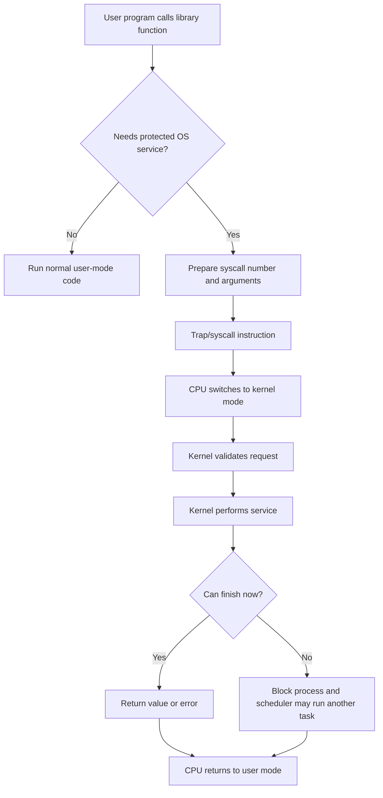
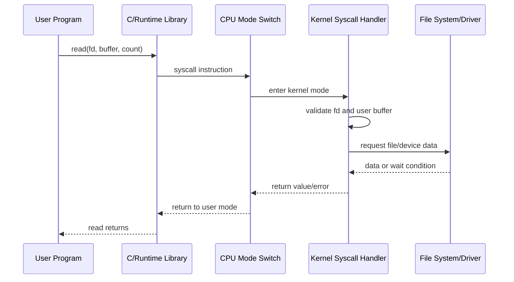
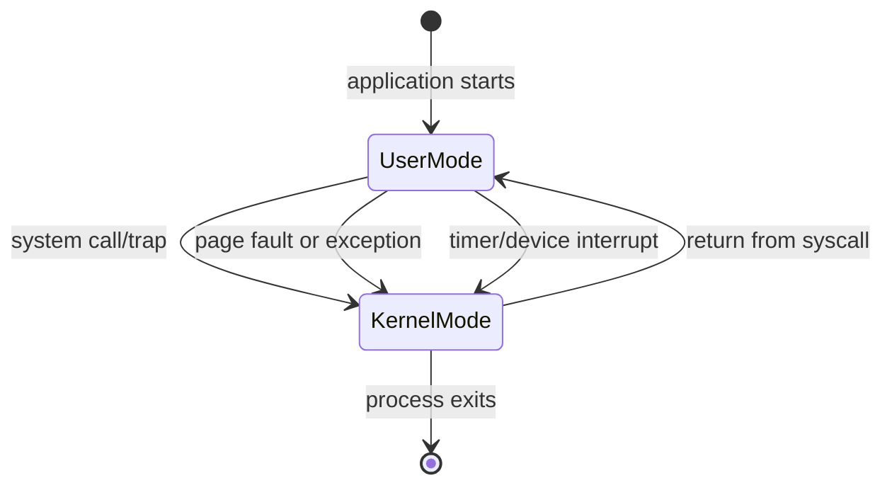

# Day 03 - Kernel, User Mode, and System Calls

Difficulty: Beginner  
Fresh Learning: 40 minutes  
Revision: 5 minutes  
Prerequisites: Days 01-02: OS basics, CPU, memory, interrupts, device controllers, DMA, and boot flow  
Why this topic matters in interviews: Interviewers use this topic to test whether you understand protection, privilege, and the path from an application API call into real kernel work.

## Opening Intuition

Imagine a normal program could directly turn off interrupts, overwrite another program's memory, reprogram the disk controller, or change the CPU's memory mapping rules. One buggy browser tab could freeze the whole machine. One malicious downloaded program could read private files, corrupt the kernel, or take control of hardware.

Modern operating systems avoid this by separating execution into safer and more privileged worlds. Ordinary applications run in **user mode**, where they can compute, manage their own data, call libraries, and request services, but they cannot directly perform sensitive hardware operations. The kernel runs in **kernel mode**, where privileged instructions are allowed and the OS can manage memory, files, devices, scheduling, and protection.

The bridge between these worlds is the **system call**. When a program wants to read a file, create a process, allocate certain resources, send data on a socket, or wait for another process, it cannot simply perform the protected operation itself. It asks the kernel through a controlled entry point. The CPU switches into kernel mode, the kernel validates the request, performs the service if allowed, and returns a result.

You see this every day even if you never type the words "system call." Printing text to a terminal may eventually call `write`. Opening a file may call `open` or `CreateFile`. Starting a new program may use `fork` plus `exec` on Unix-like systems or `CreateProcess` on Windows. Pressing Ctrl+C sends a signal through OS-managed paths. A browser tab fetching a page uses sockets, timers, files, memory mapping, and scheduling, all behind application-level APIs.

Without this privilege boundary, the OS could not safely share one machine among many programs. With it, the OS can let applications be productive while still protecting memory, devices, files, and the kernel itself.

## Interview Definition

A kernel is the privileged core of an operating system that manages protected resources such as CPU scheduling, memory, files, devices, and security.

User mode is a restricted CPU execution mode used by normal applications. Kernel mode is a privileged CPU execution mode used by the OS kernel and trusted kernel code.

A system call is a controlled request from a user-mode program to the kernel for an OS service, usually entered through a trap or special CPU instruction that switches execution into kernel mode.

In an interview, say: applications run in user mode for safety, the kernel runs in kernel mode for protected resource control, and system calls provide the safe boundary where user programs request kernel services.

## Mental Model

Think of the OS as a secured airport.

Passengers can move through public areas, buy food, wait at gates, and use normal services. That is like user mode: useful, but restricted. Air traffic control, runway access, baggage control, and security checkpoints are not open to passengers. That is like kernel mode: privileged and dangerous if misused.

A system call is like an official service counter. A passenger cannot walk onto the runway to load luggage. They submit a request through the counter. The staff checks permissions, follows procedure, performs the protected action, and returns a result.

This model helps because the boundary is not about making applications weak. It is about making the whole system safe. User programs can still do powerful work, but they do it through controlled interfaces instead of touching hardware and kernel memory directly.

## Layer 1: What happens at a high level?

At a high level, a program runs mostly in user mode. It executes normal instructions, manipulates its own variables, calls functions, performs calculations, and uses library code. Most of this does not need the kernel.

The kernel becomes necessary when the program needs a protected service:

- Reading or writing files.
- Creating, waiting for, or terminating processes.
- Allocating virtual memory mappings.
- Communicating through sockets or pipes.
- Asking for the current time from the OS.
- Sleeping until a timer expires.
- Interacting with devices.
- Changing permissions or ownership.

The user program usually does not call raw system calls directly. It calls a library function. For example, C code may call `printf`, `fopen`, `read`, or `malloc`. Some library calls stay entirely in user space. Others eventually make a system call. `printf("hello\n")` formats text in user space, but writing that text to a terminal or file may eventually enter the kernel through `write`.

The key idea is separation:

1. User code handles ordinary computation.
2. Library code provides convenient APIs.
3. System calls enter the kernel for protected operations.
4. The kernel validates and performs the operation.
5. Control returns to user mode with a result or error.

This is why system calls are slower than normal function calls. A normal function call stays in the same privilege mode and address space. A system call crosses a protection boundary, switches CPU mode, runs kernel code, may touch kernel data structures, and may block or schedule another task.

## Layer 2: What happens inside the OS?

Inside the OS, a system call is not treated as a casual jump into arbitrary kernel code. It follows a disciplined path.

First, the user program places a system call number and arguments in an agreed location. The exact convention depends on the CPU architecture and OS ABI. Arguments may be placed in registers, on the user stack, or referenced through pointers. Then the program executes a special instruction such as `syscall`, `sysenter`, `svc`, or a trap instruction. This instruction is designed for controlled entry into privileged code.

The CPU switches from user mode to kernel mode and jumps to a predefined kernel entry point. The kernel saves enough user state to return later. It identifies the requested system call, validates the arguments, checks permissions, and dispatches to the appropriate kernel service.

Validation matters. If a user program passes a pointer, the kernel cannot blindly trust it. The pointer might be invalid, point to memory the process does not own, or change during the call. Kernel code must copy data carefully between user memory and kernel memory. This is one reason kernel programming is difficult: bugs in validation can become security vulnerabilities.

After the service runs, several outcomes are possible:

- The call completes immediately and returns a value.
- The call fails and returns an error code.
- The process blocks, for example waiting for disk, network, keyboard input, or a child process.
- The kernel schedules another process while the current one waits.
- The call triggers more kernel work, such as file system lookup, device driver operations, or memory mapping changes.

When the kernel is ready to return, it restores the user-mode state, places the result where the ABI expects it, and switches the CPU back to user mode. The program continues as if a function returned, but a protected boundary was crossed.

## Layer 3: What happens at hardware or kernel level?

At the hardware level, CPUs support privilege levels. Many systems simplify this idea as two modes:

- User mode: restricted mode for applications.
- Kernel mode: privileged mode for OS kernel code.

Some architectures have more rings or exception levels, but the interview-level idea is the same: sensitive operations require privilege.

Privileged instructions include operations such as changing page tables, configuring interrupt handling, controlling device registers, disabling interrupts, changing CPU mode, or accessing protected kernel memory. If a user-mode program attempts a privileged instruction directly, the CPU raises an exception or trap instead of allowing it.

System calls use hardware support to enter kernel mode safely. The CPU does not let user code choose any random kernel address. The OS configures trusted entry points during boot. When the system call instruction runs, the CPU switches privilege mode, updates control registers or saved state according to the architecture, and transfers control to the kernel's system call handler.

This is closely connected to Day 2 architecture:

- Interrupts let devices and timers bring the CPU into kernel-handled paths.
- Traps let software intentionally enter the kernel for services.
- Page tables help isolate user memory from kernel memory.
- Device controllers are managed by kernel drivers, not ordinary applications.
- DMA and I/O require kernel-controlled buffers and permissions.

A **mode switch** is the CPU changing between user mode and kernel mode. A **context switch** is the OS changing from one process or thread execution context to another. They are related but not identical. A system call causes a mode switch. It does not necessarily cause a context switch. If the system call is quick, the same process may return to user mode immediately. If it blocks, the scheduler may context switch to another process.

## Layer 4: What can go wrong?

Several things can go wrong around kernel mode and system calls.

The first risk is unsafe privilege. If applications could run privileged instructions freely, one program could corrupt memory mappings, disable interrupts, control devices incorrectly, or read other programs' data. This breaks isolation and security.

The second risk is trusting user input. Kernel code must treat user pointers, sizes, file descriptors, permissions, and flags carefully. A bad pointer should not crash the kernel. A malicious request should not escalate privileges. Many real vulnerabilities come from incorrect boundary checks.

The third risk is performance overhead. If a program enters the kernel too often, performance can suffer. For example, writing one byte at a time to a file may cause many system calls. Buffering reduces this by collecting data in user space and making fewer larger calls.

The fourth risk is blocking. Some system calls may wait for I/O, locks, child processes, or timers. If a program does not understand blocking behavior, it may appear frozen even though the OS is working correctly.

The fifth risk is confusion between APIs and system calls. `printf` is not itself always a system call. `fread` is a C library function. Browser JavaScript APIs are not system calls. These APIs may eventually cause system calls, but interview answers should keep the layers separate.

## Step-by-Step Flow

Here is a concrete flow for `printf("hello\n")` writing to a terminal:

1. The program calls `printf` in user mode.
2. The C library formats the string into bytes.
3. The library decides those bytes must be written to the terminal file descriptor.
4. The library prepares the `write` system call number and arguments.
5. The CPU executes a system call or trap instruction.
6. The CPU switches from user mode to kernel mode.
7. The kernel system call handler receives control.
8. The kernel validates the file descriptor, buffer pointer, and byte count.
9. The kernel routes the write to the terminal, driver, pipe, file, or other target.
10. If the target can accept data immediately, the kernel copies or queues the bytes.
11. If the operation would block, the process may sleep and another process may run.
12. The kernel stores the return value or error code.
13. The CPU returns to user mode.
14. The library returns control to the program.

Here is a concrete flow for opening a file:

1. The program calls `open("notes.txt", flags)` or a higher-level wrapper.
2. The wrapper prepares a system call.
3. The CPU enters kernel mode through the system call entry path.
4. The kernel copies the path from user memory carefully.
5. The virtual file system resolves directories and file metadata.
6. The kernel checks permissions.
7. The file system and storage layers may read metadata from cache or disk.
8. The kernel creates a per-process file descriptor entry.
9. The system call returns an integer file descriptor or an error.
10. User code later passes that file descriptor to `read`, `write`, or `close`.

## Diagram Section



This flow shows why a system call is more than a function call. It crosses a privilege boundary, enters trusted kernel code, and may involve scheduling or I/O.



This sequence diagram separates the application API, runtime wrapper, CPU privilege transition, kernel validation, and real OS service.



This state diagram highlights an important interview point: system calls are not the only way the kernel gets control. Exceptions and interrupts can also move execution into kernel-handled paths.

## Practical System Relevance

- Linux: User programs commonly enter the kernel through system calls such as `read`, `write`, `openat`, `mmap`, `clone`, `execve`, `wait`, `socket`, and `ioctl`.
- Windows: Applications use Win32 APIs such as `CreateFile`, `ReadFile`, and `CreateProcess`; many eventually transition into native system services managed by the Windows kernel.
- Android: Apps are sandboxed and rely on Linux kernel services underneath Android framework APIs; permissions and process isolation are essential to app safety.
- Browsers: Browser processes use system calls for files, sockets, timers, shared memory, process creation, and sandbox enforcement.
- Databases: A database uses system calls for file I/O, memory mapping, fsync, sockets, locks, and process/thread coordination.
- Servers: Web servers depend on system calls for accepting connections, reading requests, writing responses, timers, and efficient event loops.
- Containers: Containers are not separate kernels; they rely on kernel features such as namespaces, cgroups, capabilities, and system call filtering.
- Security tools: Sandboxes and seccomp-style filters limit which system calls a process can make, reducing damage if the process is compromised.

## Code or Pseudocode Section

This tiny C-style example shows that ordinary-looking code can cross into the kernel:

```c
#include <unistd.h>

int main(void) {
    const char message[] = "hello from write\n";
    write(1, message, sizeof(message) - 1);
    return 0;
}
```

`write` requests that the kernel write bytes to file descriptor `1`, usually standard output. The program does not directly control the terminal hardware. It passes a buffer and length to the kernel through a system call wrapper.

This shell command can reveal system calls on Linux:

```bash
strace -e write,read,openat,close ./a.out
```

You should observe calls such as `write(1, ...)`. The exact output depends on the program and environment, but the learning goal is clear: application code uses OS services through system calls.

A simplified pseudocode view of kernel dispatch:

```c
syscall_entry(registers) {
    save_user_state(registers);
    number = registers.syscall_number;
    args = collect_arguments(registers);

    if (!is_valid_syscall(number)) {
        return_to_user(-EINVAL);
    }

    result = syscall_table[number](args);
    return_to_user(result);
}
```

Real kernels are much more complex, but this captures the interview-level path: save state, identify service, validate, dispatch, return.

## Common Misconceptions

1. User mode means the program is unimportant. Correction: user mode is where most application work happens; it is restricted for safety, not because it is useless.
2. Kernel mode means the CPU is physically different. Correction: the same CPU executes instructions, but privilege checks and allowed operations change.
3. A system call is just a normal function call. Correction: a function call stays in the same privilege mode; a system call crosses into kernel mode through a controlled CPU mechanism.
4. Every library call is a system call. Correction: many library calls are pure user-space code; only protected OS services require system calls.
5. `printf` is the system call that writes to the screen. Correction: `printf` is a library function; it may eventually use `write` or another OS-specific mechanism.
6. A mode switch and a context switch are the same. Correction: a mode switch changes user/kernel privilege; a context switch changes the running process or thread context.
7. Kernel code is always faster because it is privileged. Correction: privilege allows protected operations, but kernel entry has overhead and kernel bugs are more dangerous.
8. If a system call fails, the OS is broken. Correction: failure may be the correct result for invalid arguments, missing permissions, absent files, or unavailable resources.

## Tricky Interview Corners

System calls are slower than function calls because they involve privilege transition, validation, kernel dispatch, possible scheduler interaction, and sometimes cache or TLB side effects. The overhead is justified because safety requires a controlled boundary.

A system call may not cause a context switch. If `getpid` or a small `write` completes immediately, the same process can resume. If `read` waits for keyboard input, the process may block and the scheduler may run something else.

System calls are not the only kernel entry path. Interrupts, exceptions, page faults, and traps can also transfer control to kernel handlers. The reason differs: system calls are intentional service requests, interrupts are external or timer-driven events, and exceptions are caused by execution conditions.

User pointers are dangerous. The kernel must copy from or to user memory carefully. It cannot assume user memory is valid, stable, or authorized.

Not all OS services expose one simple system call. A high-level operation may involve multiple calls, library buffering, runtime behavior, file system caches, device drivers, and scheduler decisions.

Some modern performance techniques try to reduce system call frequency. Examples include buffering, memory-mapped files, asynchronous I/O, batched network operations, and user-space fast paths where safe.

## Comparison Tables

| Concept | User Mode | Kernel Mode |
|---|---|---|
| Used by | Normal applications | OS kernel and trusted kernel code |
| Privilege | Restricted | Privileged |
| Direct hardware access | Usually not allowed | Allowed through kernel code |
| Memory access | Own user space | Kernel space plus controlled user access |
| Failure impact | Usually one process | Can crash or compromise whole system |

| Concept | Function Call | System Call |
|---|---|---|
| Boundary crossed | Same program/module | User-kernel protection boundary |
| CPU mode change | No | Yes |
| Typical cost | Lower | Higher |
| Purpose | Reuse code or logic | Request protected OS service |
| Example | `strlen`, helper function | `read`, `write`, `fork`, `execve` |

| Concept | Mode Switch | Context Switch |
|---|---|---|
| Meaning | CPU changes privilege mode | OS changes running process/thread |
| Example | Entering kernel for `read` | Switching from browser to editor process |
| Always together? | No | No |
| Main reason | Protection boundary | CPU sharing and scheduling |

## How to Explain This in an Interview

### 30-second answer

The kernel is the privileged core of the OS. Applications run in user mode so they cannot directly access hardware, kernel memory, or other processes. When an application needs a protected service, it makes a system call, which uses a trap or syscall instruction to enter kernel mode. The kernel validates the request, performs the service, and returns control to user mode.

### 2-minute answer

Modern CPUs support privilege modes. User mode is for ordinary application code, while kernel mode allows sensitive operations such as memory management, device control, interrupt handling, and scheduling. This separation protects the system from buggy or malicious programs. A system call is the controlled interface between the two modes. For example, when a program reads a file, it may call a library function, which prepares a system call. The CPU switches to kernel mode, the kernel checks the file descriptor, validates the buffer, performs file system or device work, and returns a result. This is slower than a function call because it crosses a protection boundary and may block, but it is necessary for safety and resource management.

### Deeper follow-up answer

The subtle point is that system calls, interrupts, and exceptions are all kernel entry paths, but they are not the same. A system call is intentional: user code requests a service. An interrupt is usually external or timer-driven: a device or timer needs attention. An exception is caused by execution, such as an invalid instruction or page fault. Also, a mode switch is not automatically a context switch. A quick system call may return to the same process, while a blocking call may put the process to sleep and let the scheduler choose another one.

## Interview Questions

### Basic Questions

1. What is the kernel?
2. What is user mode?
3. What is kernel mode?
4. Why are privileged instructions restricted?
5. What is a system call?

### Intermediate Questions

6. Why is a system call slower than a normal function call?
7. Explain the path from `printf` to a possible `write` system call.
8. What is the difference between a mode switch and a context switch?
9. Why should user programs not directly control hardware?
10. What happens if a user-mode program attempts a privileged instruction?

### Advanced Questions

11. Why must the kernel validate user pointers passed to system calls?
12. Can a system call complete without blocking or context switching?
13. How are system calls different from interrupts and exceptions?
14. Why do containers often restrict system calls?
15. How can frequent system calls hurt performance, and how can programs reduce that overhead?

## Follow-Up Questions

Q: What is a system call?  
Follow-ups:
- Why is it needed?
- Is it the same as a library function?
- What CPU mechanism is used to enter the kernel?
- What must the kernel validate?

Q: What is the difference between user mode and kernel mode?  
Follow-ups:
- Why not run everything in kernel mode?
- What are examples of privileged operations?
- What happens if user code tries a privileged instruction?
- How does this improve security?

Q: Why are system calls slower than function calls?  
Follow-ups:
- Does every system call block?
- Can batching reduce overhead?
- What is the role of the system call table?
- How does validation add cost?

Q: What is a mode switch?  
Follow-ups:
- Is it the same as a context switch?
- Does a system call always switch mode?
- Does an interrupt switch mode?
- Can the same process continue after a mode switch?

Q: Why must the kernel distrust user memory?  
Follow-ups:
- What if a pointer is invalid?
- What if the user changes memory during the call?
- How can pointer validation affect security?
- Why are kernel bugs serious?

## Trick Questions

1. Q: Is `printf` itself a system call?  
Expected answer: No. `printf` is a library function. It may eventually call a system call such as `write` when output must be sent to a file, terminal, or pipe.

2. Q: Does every system call cause a context switch?  
Expected answer: No. Every system call crosses into kernel mode, but the same process may return immediately if the call completes without blocking.

3. Q: Is kernel mode a different physical CPU?  
Expected answer: No. It is a CPU privilege mode with different permissions and checks.

4. Q: If a program runs in user mode, can it never use hardware?  
Expected answer: It can use hardware indirectly through OS services, drivers, and system calls. It usually cannot control hardware directly.

5. Q: Are interrupts and system calls the same because both enter the kernel?  
Expected answer: No. A system call is an intentional request from software. An interrupt is usually a hardware or timer event needing kernel attention.

6. Q: Can a failed system call be correct behavior?  
Expected answer: Yes. The kernel may return errors for invalid arguments, missing permissions, unavailable resources, or nonexistent files.

7. Q: Is kernel code always safe because it is part of the OS?  
Expected answer: No. Kernel code is powerful, and bugs can crash the system or create security vulnerabilities.

## Practical Debugging / Observation

On Linux, use these commands to observe the boundary between user code and kernel services:

```bash
strace -c ls
```

This summarizes system calls made by `ls`. Notice that a simple command may use many calls for loading libraries, reading directories, writing output, and exiting.

```bash
strace -e openat,read,write,close cat notes.txt
```

This narrows output to file-related calls. Watch how user-level `cat` relies on kernel services to open, read, write, and close.

```bash
man 2 read
man 2 write
man 2 fork
```

Section 2 of Linux manual pages documents system calls. This is different from section 3, which usually documents library functions.

```bash
time ./program
```

If a program performs many tiny I/O operations, compare it with a buffered version. Fewer system calls often improve performance.

On Windows, tools such as Process Monitor can show file, registry, and process activity. The names differ, but the principle is the same: applications ask the OS kernel for protected services.

## Mini Quiz

### MCQs

1. Which mode should ordinary applications normally run in?
   - A. Kernel mode
   - B. User mode
   - C. Firmware mode
   - D. DMA mode

2. What is the main purpose of a system call?
   - A. To call another C function
   - B. To request a protected OS service
   - C. To bypass the kernel
   - D. To disable memory protection

3. Which operation usually requires kernel involvement?
   - A. Adding two local integers
   - B. Calling a pure helper function
   - C. Reading from a file descriptor
   - D. Comparing two strings in user memory

4. What is a mode switch?
   - A. Switching from one process to another
   - B. Switching CPU privilege level between user and kernel mode
   - C. Moving data from disk to RAM using DMA
   - D. Changing from HDD to SSD

5. Which statement is correct?
   - A. Every function call is a system call
   - B. Every system call must context switch
   - C. Kernel mode allows privileged operations
   - D. User programs should directly reprogram device controllers

### Short-Answer Questions

1. Why should user programs not directly access kernel memory?
2. Give two examples of privileged operations.
3. Why does the kernel validate system call arguments?

### Reasoning Questions

1. A program writes one byte at a time to a file in a tight loop. Why might this be slower than buffering output and writing larger chunks?
2. A process calls `read` on a keyboard and no key has been pressed. What might the kernel do with that process?

### Answers

MCQs: 1-B, 2-B, 3-C, 4-B, 5-C.

Short answers:

1. Direct kernel memory access would allow corruption, data leaks, privilege escalation, or full system crashes.
2. Examples include changing page tables, controlling device registers, disabling interrupts, configuring interrupt handlers, or accessing protected kernel memory.
3. The kernel validates arguments because user input may be invalid, malicious, unauthorized, or unsafe to access directly.

Reasoning answers:

1. Each tiny write may require a separate user-kernel transition and validation path. Buffering reduces the number of system calls.
2. The kernel may block the process, place it on a waiting queue, and schedule another runnable process until input arrives.

# 5-Minute Revision Column

Revision Targets:

- Day 02: Computer System Architecture for OS - Previous day reinforcement - R1 Recall Revision

## Day 02 Recall - Computer System Architecture for OS

Core recall:

- Computer system architecture explains how CPU, memory, storage, I/O devices, controllers, interrupts, DMA, firmware, and buses cooperate so the OS can manage resources.
- The CPU executes instructions, but it should not waste time constantly checking every device.
- Device controllers expose hardware operations to the OS through registers, status, commands, and interrupts.
- Interrupts let devices or timers ask for CPU attention without constant polling.
- DMA allows bulk transfer between device and memory after the OS configures it.
- Firmware and bootloader create the first path from powered-off hardware to a running kernel.

Key definitions:

- Kernel: The privileged OS core that coordinates CPU, memory, files, devices, and protection.
- System call: A controlled request from user mode to the kernel for a protected OS service.
- Interrupt: A hardware or timer signal that brings the CPU into a kernel-handled path.

Pitfalls:

- Interrupts are not always errors; they are normal control mechanisms for devices and timers.
- DMA does not mean the OS is bypassed completely; the OS still configures, authorizes, and handles completion.

Core example:

When a key is pressed, the keyboard controller records the event and raises an interrupt. The CPU enters a kernel handler, the driver reads the event, and the OS delivers clean input to the application.

Practical use:

This architecture explains why later topics work: system calls need privilege modes, scheduling needs timer interrupts, virtual memory needs CPU memory-management support, and I/O needs device controllers and drivers.

Tricky questions:

1. If a disk uses DMA, is the OS bypassed completely?
2. Are interrupts always caused by crashes?
3. If CPU usage is low, can the system still be bottlenecked on I/O?

One-line final memory:

Day 02 is the hardware foundation: CPU executes, memory stores active work, devices signal through controllers and interrupts, DMA moves bulk data, and the OS coordinates everything safely.

## Final Takeaway

Kernel mode, user mode, and system calls are the foundation of OS protection. User programs are powerful enough to do real work, but restricted enough that they cannot directly corrupt hardware, memory, or other programs. The kernel runs with privilege because it must manage shared resources safely. System calls are the official bridge: user code requests a protected service, the CPU enters kernel mode, the kernel validates and performs the work, and control returns to user mode.

The most interview-important distinction is this: a function call is ordinary control flow inside a program, while a system call crosses the user-kernel boundary. A mode switch changes privilege; a context switch changes the running execution context. Keeping these layers clear will help you answer many OS questions cleanly.

## What You Should Be Able To Answer Now

- Explain why operating systems separate user mode and kernel mode.
- Define kernel, user mode, kernel mode, privileged instruction, trap, and system call.
- Describe the step-by-step path of a system call such as `write` or `read`.
- Compare a system call with a normal function call.
- Distinguish mode switch from context switch.
- Explain why system calls have overhead.
- Explain why the kernel must validate user arguments and pointers.
- Answer tricky questions about `printf`, interrupts, blocking calls, and privilege boundaries.
