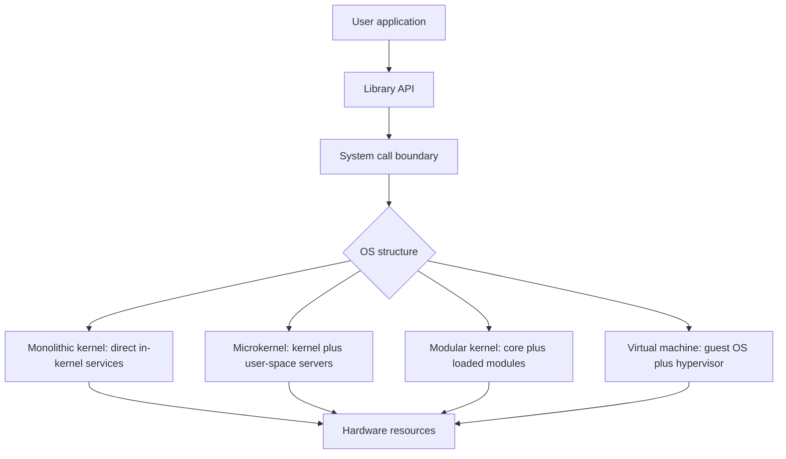
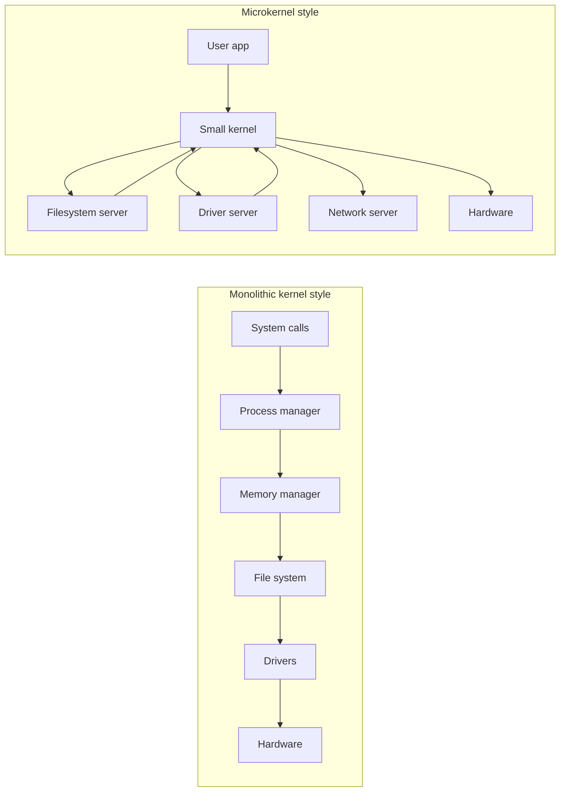
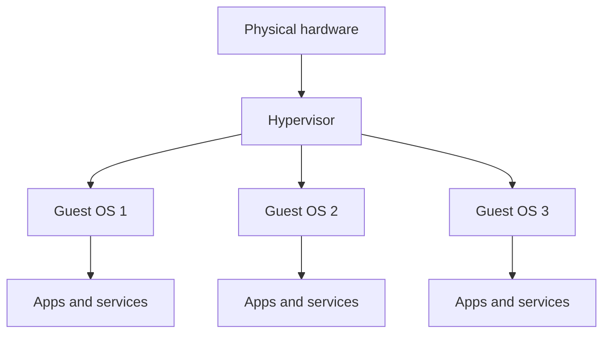

# Day 04 - OS Structures and Services

Difficulty: Intermediate  
Fresh Learning: 40 minutes  
Revision: 5 minutes  
Prerequisites: Days 01-03: OS basics, computer architecture, interrupts, kernel mode, user mode, and system calls  
Why this topic matters in interviews: Interviewers use OS structure questions to test whether you understand not just what an OS does, but how design choices affect performance, reliability, security, maintainability, and system-call behavior.

## Opening Intuition

Imagine two machines.

On the first machine, almost every important OS service lives in one large privileged kernel: file systems, memory management, process scheduling, device drivers, networking, and system-call handling. When an application reads a file or sends a packet, the request quickly enters this privileged core, and the kernel can coordinate many services with low overhead.

On the second machine, the kernel is intentionally tiny. It mainly provides low-level communication, address spaces, and scheduling. File systems, device drivers, and many services run as separate user-space servers. If a driver crashes, the whole OS may not collapse. But a simple file read may require more communication between separate components.

Both machines are trying to solve the same problem: how should an operating system organize its responsibilities?

This is the topic of OS structures and services. An OS is not just a random collection of code. It has an internal architecture. That architecture decides where services live, how modules communicate, how much code runs with kernel privilege, how failures spread, and how easily the OS can evolve.

You see these choices every day. Linux is commonly described as a monolithic kernel with strong modularity: much of the core OS work runs in kernel space, while loadable modules allow drivers and features to be added or removed. Windows uses a layered and modular design with a large privileged kernel and executive services. Mobile operating systems build app frameworks and security layers on top of kernel services. Cloud virtual machines depend on hypervisors and virtualization support. Containers rely on one shared kernel but use OS services such as namespaces and cgroups to isolate processes.

Without structure, an OS would become a fragile pile of code. Every service would depend on every other service. A small driver bug could corrupt memory anywhere. A feature change in one place could unexpectedly break scheduling, file systems, or device handling. Structure gives the OS a way to divide responsibility.

The tradeoff is that no structure is perfect. A monolithic kernel is fast and direct, but a bug in privileged code can be dangerous. A microkernel improves isolation and separation, but communication overhead and design complexity can rise. A layered system is easier to reason about, but strict layers can be inefficient. A modular kernel is flexible, but modules still often run with high privilege. Virtual machines provide strong isolation, but they add another layer of resource management.

The interview point is simple: OS design is tradeoff management. The best answer is not "monolithic is bad" or "microkernel is always better." A strong answer explains what each design optimizes and what cost it pays.

## Interview Definition

OS structure describes how an operating system organizes its kernel, services, drivers, user interfaces, system-call handlers, and resource-management components.

OS services are the functions the operating system provides to users, applications, and the system itself, such as process management, memory management, file management, I/O handling, protection, security, networking, accounting, and error handling.

In an interview, say: an OS structure is the architectural design of the operating system, while OS services are the actual capabilities exposed by that design. Monolithic, microkernel, layered, modular, and virtual-machine designs differ mainly in where services run, how they communicate, and what tradeoffs they make between performance, isolation, reliability, and maintainability.

## Mental Model

Think of an operating system as a large hospital.

The hospital must provide many services: emergency care, surgery, labs, pharmacy, patient records, security, billing, scheduling, and maintenance. One design could place every department in one tightly connected central building. Requests move quickly because everyone is nearby, but a fire or failure in the central building affects many critical functions.

Another design could keep only emergency coordination in the central building and move labs, pharmacy, records, and maintenance into separate buildings. A lab failure may not shut down surgery, but communication takes more coordination.

A layered design is like arranging hospital services by authority: public reception, diagnosis, specialist care, operating rooms, and critical infrastructure. A modular design is like allowing new departments to be attached to the hospital without rebuilding it. A virtual-machine design is like splitting one physical hospital campus into multiple isolated mini-hospitals, each believing it has its own building, equipment, and staff.

This mental model helps because OS structure is about responsibility boundaries:

- Which services are central?
- Which services are separated?
- Which parts are trusted?
- Which failures are isolated?
- Which requests take the shortest path?
- Which design is easier to extend?

An interviewer wants to hear that you can reason about those boundaries, not just memorize architecture names.

## Layer 1: What happens at a high level?

At a high level, an operating system provides services to applications and users while managing hardware resources underneath.

Applications ask for services through APIs and system calls. For example, a program may request file access, memory allocation, process creation, network communication, or timer events. The OS receives those requests, checks permissions, coordinates hardware and internal data structures, and returns results.

The structure of the OS decides the path of that request.

In a monolithic kernel, many services run inside the kernel address space. A file read may enter the kernel, pass through the system-call layer, reach the virtual file system, interact with cache structures, call a filesystem implementation, and use a device driver, all inside privileged kernel code.

In a microkernel, the same file read may enter a small kernel, then communicate with a user-space filesystem server and possibly a user-space driver or device service. The kernel mainly coordinates message passing, scheduling, and low-level protection.

In a layered OS, services are arranged in conceptual levels. Higher layers use lower layers. For example, user programs sit above system-call interfaces, which sit above file and process services, which sit above memory and device control.

In a modular kernel, the kernel has a core plus modules that can be loaded or unloaded. Device drivers, filesystems, and networking features may be compiled as modules. The system can extend itself without rebuilding the entire kernel.

In a virtual-machine structure, a hypervisor presents virtual hardware to guest operating systems. Each guest OS believes it controls a machine, but the hypervisor multiplexes the real CPU, memory, storage, and devices.

The high-level question is always: when an application requests an OS service, how many boundaries does the request cross, and where does the trusted code run?

## Layer 2: What happens inside the OS?

Inside the OS, structure affects both code organization and runtime behavior.

The system-call interface is usually the front door. A user program calls a library function such as `read`, `CreateFile`, `socket`, `fork`, or `mmap`. If the request needs protected OS work, execution crosses from user mode into kernel mode. The kernel then dispatches to the relevant service.

In a monolithic design, the dispatch often stays inside one privileged address space. The scheduler, memory manager, file system, networking stack, and drivers can share kernel data structures and call each other directly. This is efficient, but it increases the amount of code that can damage the system if it contains a bug.

In a microkernel design, the kernel tries to keep only essential mechanisms in privileged space. It may provide:

- Address-space management.
- Thread or process scheduling.
- Inter-process communication.
- Low-level interrupt handling.
- Basic synchronization.

Higher-level services may run as user-space servers:

- Filesystem server.
- Device-driver server.
- Network server.
- Process manager.
- Security service.

This separation can improve fault isolation. If a user-space driver fails, the kernel may be able to restart it. But operations can require extra message passing and context switches. The design must be careful to avoid turning every common operation into a long chain of communication.

In a layered design, each layer exposes an interface to the layer above it and relies on services from the layer below it. This helps teaching, verification, and reasoning. However, real operating systems often cannot stay perfectly layered because performance and hardware realities force shortcuts.

In a modular kernel, the kernel keeps a core architecture but supports dynamically attachable pieces. Linux kernel modules are a common example. A driver can be loaded when hardware appears. A filesystem module can be added without compiling a completely new kernel image. The benefit is flexibility. The risk is that modules may still run in kernel mode, so a bad module can still crash or compromise the kernel.

Virtual machines add a different kind of structure. The hypervisor creates isolated execution environments. A guest OS runs its own kernel, system calls, page tables, drivers, and services, but the hypervisor ultimately controls physical resources. This is powerful for cloud systems, testing, isolation, and running multiple OSes on one machine.

## Layer 3: What happens at hardware or kernel level?

At the hardware and kernel level, OS structure is shaped by privilege, address spaces, interrupts, traps, and memory protection.

Kernel code usually runs in a privileged CPU mode. It can execute instructions that user programs cannot, such as changing page tables, configuring interrupt handling, controlling devices, or manipulating privileged CPU state. This is why placing a service inside the kernel is a serious decision. Kernel-space code has speed and direct access, but also high blast radius.

Memory protection is central. A monolithic kernel typically has one kernel address space where many services share privileged memory. If a driver writes through a bad pointer, it may corrupt unrelated kernel structures. That is why kernel bugs are dangerous.

A microkernel uses address-space separation more aggressively. Services can run in user space with their own protected memory. Communication happens through inter-process communication rather than direct function calls. This means hardware protection can help contain faults.

Interrupts also matter. Device interrupts enter the kernel or a low-level handler. In a monolithic kernel, the interrupt path may quickly reach an in-kernel driver. In a microkernel, interrupt handling may be split so the kernel receives the interrupt and notifies a user-space driver or service. That separation improves isolation but requires efficient IPC.

Virtualization depends heavily on hardware support. Modern CPUs provide virtualization extensions so a guest OS can run efficiently while still being controlled by a hypervisor. The hypervisor must manage privileged instructions, virtual memory translation, virtual devices, and scheduling of virtual CPUs onto physical CPUs. Nested page tables, trap handling, and device virtualization are examples of hardware-level concerns behind virtual machines.

The key hardware-level insight is this: OS structure is not only an abstract software diagram. It decides how often the CPU crosses protection boundaries, how memory is protected, how interrupts are routed, and how much privileged code the system trusts.

## Layer 4: What can go wrong?

Several things can go wrong depending on the structure.

In a monolithic kernel, one buggy driver can crash the whole system because drivers often run with kernel privilege. A memory corruption bug in kernel space is much more severe than a normal user-space bug. Security vulnerabilities are also dangerous because compromised kernel code can bypass most protections.

In a microkernel, the system can become slower or more complex if too many services communicate too often. The design may look clean on paper but require careful optimization in practice. If message passing is inefficient, ordinary operations like file I/O and networking can suffer.

In a layered OS, strict layering can add overhead or make some features awkward. Real systems often need cross-layer coordination. For example, the memory manager, file cache, and filesystem may need to cooperate closely. If the layers are too rigid, performance can drop.

In a modular kernel, flexibility can create compatibility and trust problems. A module compiled for the wrong kernel version may fail. A poorly written module can still crash the system. Loading third-party kernel modules also expands the trusted code base.

In virtual machines, isolation is strong but not free. The hypervisor must share physical resources among guests. A noisy guest can create resource pressure. Virtualized I/O can be slower than native I/O unless paravirtualized drivers or hardware passthrough are used. VM sprawl can also waste resources if many guests run full OS stacks unnecessarily.

The deeper interview trap is assuming architecture alone guarantees quality. A monolithic kernel can be reliable if engineered carefully. A microkernel can be insecure if services are badly designed. A modular system can be flexible but risky. A virtualized system can be isolated but resource-heavy. Structure gives a design direction, not automatic correctness.

## Step-by-Step Flow

Here is a practical flow for a simple file read request in different OS structures.

1. A user program calls a library function such as `read(fd, buffer, size)`.
2. The library places arguments according to the OS ABI and enters the kernel through a system call.
3. The kernel validates the file descriptor, buffer pointer, size, and permissions.
4. In a monolithic kernel, the request may move through in-kernel file, cache, filesystem, block, and driver layers.
5. In a microkernel, the kernel may forward or coordinate the request with a user-space filesystem or device service through IPC.
6. In a layered design, the request moves through conceptual layers from user interface to system-call layer to filesystem to device handling.
7. In a modular kernel, the active filesystem or driver may be a loaded module attached to the kernel.
8. In a virtual machine, the guest OS handles the system call, but its virtual disk operation may be translated by the hypervisor to real storage I/O.
9. The OS copies data or maps results safely back to the user process.
10. Control returns to user mode with a success value or error code.

The same user-level operation can therefore travel through different internal paths depending on OS structure.

## Diagram Section

### Diagram 1: OS Service Request Paths



This diagram shows that the user program may call the same apparent API, but the internal path depends on the OS architecture.

### Diagram 2: Monolithic vs Microkernel Responsibility Split



The monolithic side keeps many OS services in privileged kernel space. The microkernel side keeps the kernel smaller and moves more services into separate servers.

### Diagram 3: Virtual Machine Structure



Virtualization creates isolated guest operating systems on top of shared physical hardware. Each guest has its own OS structure, while the hypervisor controls real resources.

## Practical System Relevance

In Linux, the kernel is usually described as monolithic but modular. Process scheduling, virtual memory, filesystems, networking, and many drivers run in kernel space. At the same time, Linux supports loadable kernel modules, so drivers and features can be inserted or removed dynamically. This gives performance and flexibility, but loaded modules are still trusted kernel code.

In Windows, the architecture is layered and modular. It includes user-mode subsystems, system services, the executive, kernel, hardware abstraction layer, drivers, and graphical components. For interview purposes, the important point is that Windows also separates user mode and kernel mode, uses system calls for protected services, and has a structured internal design rather than one flat code pile.

In Android, applications run in a managed framework environment on top of Linux-kernel foundations. App sandboxing, permissions, Binder IPC, process management, and lifecycle rules all depend on OS services and structure. Android demonstrates that an OS is not only a kernel; the full system includes frameworks, runtime components, user-space services, and security policies.

In browsers, the browser itself often uses a multi-process structure. The OS provides processes, threads, virtual memory, files, sockets, timers, and sandbox controls. A browser renderer process may be restricted so a bug in web content cannot easily access files or devices. This relies on OS protection services.

In databases, OS services affect real performance. Databases use file I/O, memory mapping, page cache behavior, fsync, locks, networking, and scheduling. A database may care deeply about whether writes are buffered, when data reaches durable storage, and how the OS schedules worker threads.

In cloud systems, virtual machines are fundamental. A cloud provider can run many guest OSes on shared physical machines. Hypervisors isolate tenants, allocate CPU and memory, and virtualize devices. Containers provide lighter isolation by sharing the host kernel while using OS-level features such as namespaces and cgroups.

In embedded systems, microkernel or small-kernel ideas can be attractive because reliability and separation are important. In real-time systems, structure may be chosen to keep timing predictable and minimize unnecessary overhead.

## Code or Pseudocode Section

The following pseudocode shows the difference between a direct in-kernel service path and a microkernel-style message path. It is simplified, but it captures the design idea.

```c
// Monolithic-style simplified path
ssize_t sys_read(int fd, void *user_buffer, size_t size) {
    file_t *file = validate_fd(fd);
    check_user_buffer(user_buffer, size);
    bytes_t data = vfs_read(file, size);
    copy_to_user(user_buffer, data);
    return data.length;
}
```

In this model, the system-call handler can directly call kernel services such as the virtual filesystem and lower-level driver paths.

```c
// Microkernel-style simplified path
ssize_t sys_read(int fd, void *user_buffer, size_t size) {
    request_t req = build_read_request(fd, size);
    response_t res = ipc_send(filesystem_server, req);
    check_response(res);
    copy_to_user(user_buffer, res.data);
    return res.length;
}
```

In this model, the kernel coordinates communication with a separate service. The benefit is separation. The cost is extra communication and careful coordination.

You can observe OS services on a Unix-like system with commands such as:

```bash
ps aux
top
lsmod
uname -a
strace -e trace=openat,read,write ls
lsof
```

`ps` and `top` show process-management services. `lsmod` shows loaded kernel modules on Linux. `strace` shows how ordinary commands use system calls. `lsof` shows file descriptors and open files, which are OS-managed resources.

## Common Misconceptions

1. Monolithic means messy.  
   Correction: monolithic means many services run in kernel space. A monolithic kernel can still be highly organized, modular, and carefully engineered.

2. Microkernel always means better.  
   Correction: microkernels reduce the trusted kernel core and can improve isolation, but they may introduce IPC overhead and design complexity.

3. A modular kernel is the same as a microkernel.  
   Correction: a modular kernel can load components dynamically, but those modules often still run in kernel mode. A microkernel moves many services out to user-space servers.

4. Layered OS means every real OS follows strict layers.  
   Correction: layering is a useful design principle, but real systems often bend layers for performance, hardware access, or cross-component coordination.

5. Virtual machines are the same as containers.  
   Correction: a VM usually runs a full guest OS on virtual hardware. A container shares the host kernel and isolates processes using OS-level mechanisms.

6. OS services are only for user convenience.  
   Correction: OS services also protect the system, arbitrate shared resources, isolate programs, handle errors, account for usage, and enforce security.

7. More isolation always means more performance.  
   Correction: isolation often improves safety, but it can add communication and context-switching overhead.

8. Device drivers are harmless add-ons.  
   Correction: drivers often run with high privilege. A buggy driver can crash or compromise the system.

## Tricky Interview Corners

The first tricky corner is the difference between policy and mechanism. A mechanism provides a way to do something. A policy decides what should be done. For example, a scheduler mechanism can switch processes, while a scheduling policy decides which process should run next. Good OS design often separates mechanism from policy where possible.

The second tricky corner is trusted code size. A large privileged kernel has a larger trusted computing base. That does not automatically make it insecure, but it means more code has the ability to damage the system if it fails.

The third tricky corner is IPC overhead in microkernels. Moving services to user space improves separation, but common operations may need extra message passing. Modern microkernel designs try to make IPC extremely efficient because it is central to performance.

The fourth tricky corner is that modules do not automatically reduce privilege. A loadable kernel module may be separate as a file and dynamically loaded, but once loaded it may execute with kernel privileges.

The fifth tricky corner is virtualization layering. A system call inside a guest VM first enters the guest kernel, not the host kernel directly. If the operation needs real hardware, the hypervisor and host-side drivers may become involved.

The sixth tricky corner is failure isolation. In a monolithic kernel, a bad driver can crash the whole OS. In a microkernel, the driver may be restartable, but only if the rest of the system is designed to tolerate that failure.

The seventh tricky corner is performance measurement. A design that is slower in one operation may be better overall if it improves reliability, security, or maintainability. Interview answers should avoid one-dimensional claims.

## Comparison Tables

### Monolithic Kernel vs Microkernel

| Point | Monolithic Kernel | Microkernel |
|---|---|---|
| Service location | Many services in kernel space | Minimal kernel, many services in user space |
| Performance path | Often direct and fast | May require IPC between servers |
| Fault isolation | Lower for kernel bugs | Better for separated services |
| Trusted code size | Larger | Smaller kernel core |
| Common example style | Linux-like kernel organization | MINIX/QNX-style design ideas |

### Layered vs Modular Design

| Point | Layered OS | Modular Kernel |
|---|---|---|
| Main idea | Arrange services in levels | Attach replaceable components to a core |
| Strength | Easier reasoning and teaching | Flexibility and extensibility |
| Weakness | Strict layers can add overhead | Modules may still be privileged |
| Example | Conceptual OS design, Windows-style layering ideas | Linux loadable modules |

### Virtual Machine vs Container

| Point | Virtual Machine | Container |
|---|---|---|
| Kernel | Guest has its own kernel | Shares host kernel |
| Isolation | Stronger hardware-level abstraction | OS-level process isolation |
| Startup | Usually slower | Usually faster |
| Resource cost | Higher | Lower |
| Common use | Cloud VMs, OS testing | App deployment, microservices |

## How to Explain This in an Interview

### 30-second answer

OS structure is how an operating system organizes its kernel and services. OS services include process management, memory management, file systems, I/O, protection, security, and networking. Monolithic kernels keep many services in kernel space for direct performance, microkernels keep the kernel small and move services to user space for isolation, layered systems organize responsibilities by levels, modular kernels support loadable components, and virtual machines isolate full guest OSes through a hypervisor.

### 2-minute answer

An OS must provide services to applications while safely managing shared hardware. The structure decides where those services live and how they communicate. In a monolithic kernel, services such as scheduling, memory management, filesystems, networking, and drivers often run in kernel space. This gives efficient direct calls, but bugs in privileged code can be severe. In a microkernel, the kernel keeps only essential mechanisms such as scheduling, IPC, and address-space control, while services like filesystems or drivers may run as user-space servers. This improves separation but can add communication overhead. Layered systems make dependencies easier to reason about, modular kernels make extension easier, and virtual machines add a hypervisor layer so multiple guest OSes can share hardware safely.

### Deeper follow-up answer

The deeper tradeoff is performance versus isolation and maintainability. Direct in-kernel calls are fast, but they increase trusted code size. User-space servers are safer to isolate and restart, but they require efficient IPC. Modules add flexibility, but loaded kernel modules often remain privileged. Virtualization gives strong isolation and cloud flexibility, but it introduces hypervisor scheduling, virtual memory translation, and virtual I/O overhead. A strong OS design chooses structure based on workload, reliability needs, hardware support, and security goals.

## Interview Questions

### Basic Questions

1. What does OS structure mean?
2. What are common services provided by an operating system?
3. What is a monolithic kernel?
4. What is a microkernel?
5. What is a layered OS design?

### Intermediate Questions

6. Compare monolithic kernels and microkernels.
7. Why can a monolithic kernel be faster for common OS operations?
8. Why can microkernels provide better fault isolation?
9. How is a modular kernel different from a microkernel?
10. What is the role of a hypervisor in virtualization?

### Advanced Questions

11. Why is IPC performance important in a microkernel?
12. How does trusted code size affect OS security?
13. What happens when a guest OS performs I/O inside a virtual machine?
14. Why do real operating systems often mix multiple structural ideas?
15. Explain the tradeoff between mechanism and policy in OS design.

## Follow-Up Questions

Q: What is a monolithic kernel?  
Follow-ups:
- Does monolithic mean unstructured?
- Why can in-kernel service calls be fast?
- Why are driver bugs dangerous in this design?
- How do loadable modules change the design?

Q: What is a microkernel?  
Follow-ups:
- Which services stay in the kernel?
- Which services may move to user space?
- Why does IPC become important?
- Can a microkernel still be complex?

Q: What are OS services?  
Follow-ups:
- Which services are visible to applications?
- Which services are mainly internal?
- How are services exposed through system calls?
- Why are protection and error handling OS services?

Q: What is the difference between a modular kernel and a microkernel?  
Follow-ups:
- Where do modules usually execute?
- Does dynamic loading imply user-space isolation?
- Why are third-party kernel modules risky?
- How does modularity help hardware support?

Q: What is virtualization?  
Follow-ups:
- What does a hypervisor do?
- How is a VM different from a container?
- Why does virtualization need hardware support?
- What are virtualized I/O costs?

Q: Why do OS designs mix ideas?  
Follow-ups:
- Why is a pure layered design hard?
- Why might performance require shortcuts?
- Why might security require extra separation?
- How does workload influence structure?

## Trick Questions

1. Q: Is Linux a microkernel because it supports modules?  
   Expected answer: No. Linux is commonly described as monolithic with modular support. Modules can be loaded dynamically, but many still run in kernel space.

2. Q: Is a microkernel always faster than a monolithic kernel because it is smaller?  
   Expected answer: No. A smaller kernel may improve isolation, but operations can require extra IPC and context switches.

3. Q: If a driver is loaded as a module, is it automatically safe from crashing the kernel?  
   Expected answer: No. A kernel module often runs with kernel privilege, so a bad module can still crash or corrupt the system.

4. Q: Does a virtual machine share the host kernel the same way a container does?  
   Expected answer: No. A VM normally runs a guest kernel on virtual hardware; a container shares the host kernel.

5. Q: Are OS services only system calls?  
   Expected answer: No. System calls expose many services to applications, but the OS also performs internal services such as scheduling, interrupt handling, accounting, caching, and error management.

6. Q: Does layered design mean higher layers never interact indirectly with lower hardware behavior?  
   Expected answer: No. Layers hide details, but hardware behavior such as latency, interrupts, and memory pressure still affects higher-level services.

7. Q: Is a large kernel automatically insecure?  
   Expected answer: No. Size increases trusted code surface, but security depends on engineering, validation, isolation, updates, and design discipline.

## Practical Debugging / Observation

On Linux or WSL, you can observe OS structure and services with these commands:

```bash
uname -a
ps aux
top
lsmod
cat /proc/modules
strace -e trace=openat,read,write,close ls
lsof -p <pid>
dmesg | tail
```

What to observe:

- `uname -a` shows kernel identity and version information.
- `ps aux` and `top` show process-management services in action.
- `lsmod` and `/proc/modules` show kernel modules currently loaded.
- `strace` shows that a simple command relies on system calls.
- `lsof` shows open files and file descriptors attached to a process.
- `dmesg` can show kernel and driver messages, which reminds you that drivers and hardware events are part of OS service handling.

On Windows, similar observation ideas include:

```powershell
Get-Process
Get-Service
driverquery
Get-ComputerInfo
```

What to observe:

- Processes and services are managed OS objects.
- Drivers are system-level components, not ordinary application code.
- Many user-visible actions depend on kernel and service layers underneath.

## Mini Quiz

### MCQs

1. Which design keeps many OS services in kernel space?
   A. Monolithic kernel  
   B. Pure user-level application  
   C. Browser sandbox only  
   D. Shell script  
   Answer: A

2. What is a major advantage of a microkernel?
   A. It removes all system calls  
   B. It improves separation by moving many services out of the kernel  
   C. It makes hardware unnecessary  
   D. It prevents all bugs  
   Answer: B

3. What does a hypervisor primarily provide?
   A. A text editor  
   B. Virtualized hardware and resource control for guest OSes  
   C. A filesystem directory tree only  
   D. A replacement for all processes  
   Answer: B

4. Which statement about kernel modules is correct?
   A. They always run in user mode  
   B. They are always safer than user programs  
   C. They can often be loaded dynamically but may still run with kernel privilege  
   D. They are the same as containers  
   Answer: C

5. Why can a strict layered OS design become inefficient?
   A. It has no structure  
   B. It may force requests through layers even when direct coordination would be faster  
   C. It cannot support files  
   D. It cannot run applications  
   Answer: B

### Short-answer questions

1. Define OS services in two lines.  
   Answer: OS services are capabilities provided by the operating system, such as process management, memory management, file systems, I/O, protection, security, networking, accounting, and error handling.

2. Why is a bad kernel driver more dangerous than a bad user program?  
   Answer: A kernel driver often runs with privileged access and can corrupt kernel memory or hardware state, while a user program is restricted by memory protection and OS policy.

3. How is a VM different from a container?  
   Answer: A VM usually runs a full guest OS on virtual hardware managed by a hypervisor. A container shares the host kernel and uses OS-level isolation.

### Reasoning questions

1. A file read is slower in a microkernel-style system than expected. What structural reason might explain this?  
   Answer: The request may require IPC between the application, kernel, filesystem server, and driver service. Extra message passing and context switching can add overhead.

2. A system wants high driver fault isolation for safety-critical devices. Which design idea may help and what cost might it pay?  
   Answer: Microkernel-style separation can run drivers as user-space services, improving isolation and restartability. The cost may be IPC overhead and more complex service coordination.

# 5-Minute Revision Column

Revision Targets:

- Day 03: Kernel, User Mode, and System Calls - Previous day reinforcement - R1
- Day 01: What is an Operating System? - Three-day spaced recall - R2

## Day 03 - Kernel, User Mode, and System Calls (R1 Recall Revision)

Core recall: the kernel is the privileged core of the OS. Normal applications run in user mode so they cannot directly access hardware, kernel memory, privileged CPU instructions, or other process memory. When an application needs a protected service, it enters the kernel through a system call. The CPU changes privilege mode, the kernel validates the request, performs the service if allowed, and returns control to user mode.

Key definitions:

- Kernel: privileged OS core responsible for protected resource management.
- User mode: restricted execution mode used by normal applications.
- System call: controlled user-to-kernel request for an OS service.

Core example: `printf` is not itself a system call. It formats data in user space, but printing to a terminal may eventually call `write`, which enters the kernel.

Pitfalls:

- System call is not the same as a normal function call.
- Mode switch is not the same as context switch.
- Kernel mode is not a physically different CPU.

Tricky questions:

- Does every library call enter the kernel?
- Can a system call block and let another process run?
- Why must the kernel validate user pointers?

One-line final memory: user mode protects the system, kernel mode controls protected resources, and system calls are the safe bridge between them.

## Day 01 - What is an Operating System? (R2 Compression Revision)

Core recall:

- OS = resource manager plus abstraction provider.
- It manages CPU, memory, files, devices, I/O, networking, and security.
- It exposes abstractions such as processes, files, sockets, virtual memory, and system calls.
- The kernel is the privileged core, not always the entire OS.
- Applications request protected services instead of directly controlling hardware.

Key definitions:

- Operating System: system software that manages hardware resources and provides services to applications.
- Kernel: privileged core that handles sensitive operations such as scheduling, memory management, system calls, and interrupt handling.

Example: opening an app requires the OS to load executable code, create a process, assign memory, schedule CPU time, and manage I/O.

Pitfalls:

- GUI is not the full OS.
- Abstraction does not remove hardware costs such as disk latency, memory pressure, and CPU scheduling delay.

Tricky questions:

- If an application reads a file, does it directly command the disk?
- Why should two programs not freely access the same physical memory?

One-line final memory: an OS makes shared hardware safe and usable by managing resources and exposing controlled abstractions.

## Final Takeaway

OS structures explain how the operating system is organized internally, while OS services explain what it provides. Monolithic kernels prioritize direct in-kernel coordination and performance, but privileged bugs are dangerous. Microkernels reduce the privileged core and improve service isolation, but IPC and coordination become central. Layered designs improve reasoning, modular kernels improve extensibility, and virtual machines add a hypervisor layer for strong guest isolation. Good interview answers compare tradeoffs instead of declaring one structure universally best. The key lens is where services run, how they communicate, how much code is trusted, and what cost the design pays for performance, isolation, and maintainability.

## What You Should Be Able To Answer Now

- Define OS structure and OS services clearly.
- Explain monolithic, microkernel, layered, modular, and virtual-machine designs.
- Compare monolithic kernels and microkernels using performance, isolation, and trusted code size.
- Explain why kernel modules are not automatically safe user-space components.
- Describe how a system call path changes across OS structures.
- Explain why IPC performance matters in microkernel designs.
- Compare virtual machines and containers.
- Answer interview follow-ups about design tradeoffs without oversimplifying.
