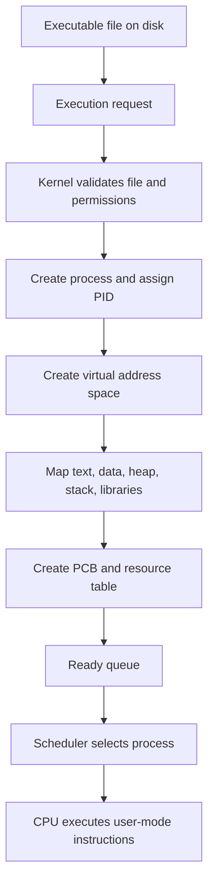
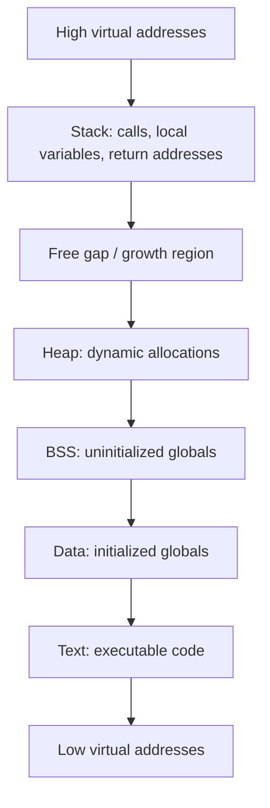
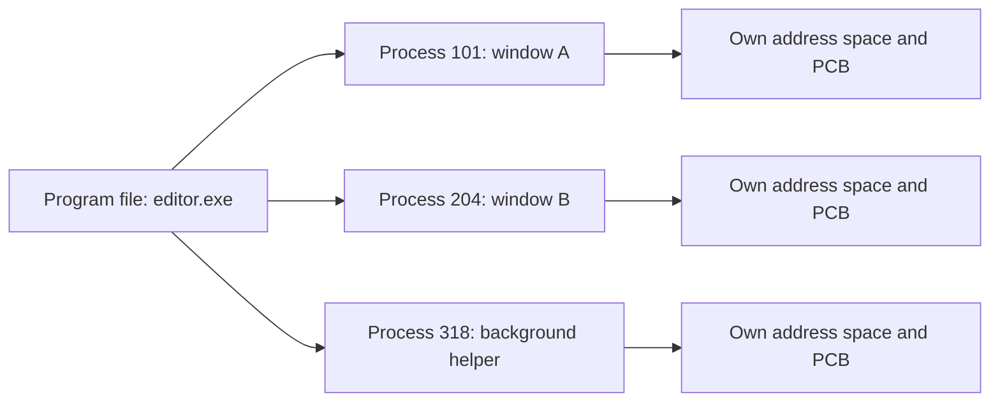

# Day 05 - Program vs Process

Difficulty: Beginner  
Fresh Learning: 40 minutes  
Revision: 5 minutes  
Prerequisites: Days 01-04: OS basics, computer architecture, kernel/user mode, system calls, and OS structures  
Why this topic matters in interviews: Interviewers ask "program vs process" to check whether you understand what actually happens when software starts running. This topic also prepares you for process states, context switching, scheduling, virtual memory, and system calls.

Imagine you download a music player installer. The file sits on your disk for weeks and does nothing. One day you double-click it. Suddenly the OS loads code into memory, creates bookkeeping data, gives it an address space, connects it to files and devices, schedules it on the CPU, and shows a window. The file did not magically become active by itself. The OS converted a passive program into an active process.

This distinction looks simple, but it is one of the most important foundations in Operating Systems. A program is a stored set of instructions and data. A process is a running instance of that program, managed by the OS. One program can produce many processes. Two users can run the same browser executable, and each running browser instance has its own memory, open files, security identity, CPU state, and process metadata.

If the OS did not distinguish between programs and processes, it could not safely run multiple applications at once. It would not know which memory belongs to which running instance, which process is waiting for I/O, which process owns a file descriptor, which process should receive a signal, or which process should be scheduled next. The process abstraction is how the OS turns static code into isolated, schedulable, controllable execution.

## Interview Definition

A program is a passive file stored on disk that contains executable instructions and related data. A process is an active execution instance of a program, loaded into memory and managed by the operating system. A process has its own address space, execution state, resources, and Process Control Block. In interviews, say that a program is "what can run," while a process is "what is currently running or ready to run."

## Mental Model

Think of a program as a recipe saved in a cookbook. It lists ingredients, steps, and instructions, but it does not cook anything by itself. A process is an actual cooking session in a kitchen. The cook has ingredients on the counter, utensils in use, a current step, a timer, and a kitchen manager tracking progress.

The same recipe can be used by many cooks at the same time. Each cook follows the same instructions but has separate ingredients, separate progress, and possibly different outcomes. Similarly, one executable file can create many processes. Each process has its own memory layout, CPU register state, stack, heap, open files, permissions, and OS bookkeeping.

The OS is the kitchen manager. It decides who gets access to the stove, prevents one cook from taking another cook's ingredients, handles interruptions, and records enough state to pause one cooking session and resume another later. That record is the Process Control Block.

## Layer 1: What happens at a high level?

At the highest level, a program becomes a process when the OS creates an execution environment for it.

A program normally exists as an executable file on storage: for example, `chrome.exe`, `/bin/ls`, `node.exe`, or a compiled C program. The file contains machine instructions, metadata, static data, library references, and information that tells the loader how to place pieces of the program into memory.

When a user or another process requests execution, the OS does several things:

1. It validates the executable file and permissions.
2. It creates a new process entry in OS data structures.
3. It creates or maps an address space for that process.
4. It loads or maps executable code and data into memory.
5. It sets up the initial stack, arguments, environment variables, and runtime metadata.
6. It creates a Process Control Block.
7. It marks the process as ready to run.
8. The scheduler eventually gives the process CPU time.

The program is not "used up" by this. It remains on disk. If you launch the same executable again, the OS can create another process from the same program. Both processes may share read-only code pages internally for efficiency, but each process gets a separate execution identity.

This is why a text editor can open multiple windows, a server can create worker processes, and a shell can run many commands over time. The executable is the template. The process is the running instance.

## Layer 2: What happens inside the OS?

Inside the OS, a process is not just code in memory. It is a collection of state and resources tracked by kernel data structures.

The OS must answer many questions about each running process:

- What is its process ID?
- Which user owns it?
- What memory regions are mapped into its address space?
- What is its current state: ready, running, waiting, terminated?
- Which CPU registers must be restored if it runs again?
- Which files, sockets, or pipes has it opened?
- What priority or scheduling policy does it have?
- Which parent process created it?
- What exit status should be reported when it finishes?

This information is stored in and around the Process Control Block, commonly called the PCB. Different operating systems use different names and internal structures. Linux uses kernel task structures and related memory-management structures. Windows uses process and thread executive objects. The exact implementation differs, but the idea is the same: the OS needs a durable record of each process so it can manage execution safely.

The process image is the in-memory representation of a process. It usually includes:

- Text section: executable code.
- Data section: initialized global and static variables.
- BSS section: uninitialized global and static variables.
- Heap: dynamically allocated memory.
- Stack: function calls, local variables, return addresses, and call frames.
- Memory-mapped regions: shared libraries, mapped files, shared memory, and runtime mappings.

The process also has resource handles outside the raw memory image, such as open file descriptors, sockets, signal handlers, credentials, and scheduling metadata.

### Program vs process in one sentence

A program is a stored instruction set; a process is the OS-managed execution context created from that instruction set.

## Layer 3: What happens at hardware or kernel level?

At hardware and kernel level, the process abstraction depends on memory protection, CPU state, and controlled entry into the kernel.

When a process runs, the CPU is executing instructions on behalf of that process. The CPU registers hold temporary values, the program counter points to the next instruction, the stack pointer points into the process stack, and the memory-management hardware translates the process's virtual addresses into physical memory addresses.

Modern systems do not normally let a process use raw physical addresses. Instead, each process sees a virtual address space. Address `0x400000` in one process is not necessarily the same physical memory as address `0x400000` in another process. The Memory Management Unit and page tables help enforce this separation.

This isolation is the reason one buggy application usually cannot overwrite another application's memory. It is also the reason a process can behave as if it owns a large private memory space, even though the OS is sharing physical RAM among many processes.

The kernel also keeps CPU state for each process or thread. During scheduling, the OS may stop one process and later resume it. To resume correctly, it must restore enough execution state: program counter, stack pointer, CPU registers, scheduling state, memory map reference, and other architecture-specific details. This is why the PCB is essential. Without saved state, the OS could not pause and resume execution reliably.

System calls connect this topic to Day 3. A process runs mostly in user mode. When it needs a protected service, such as opening a file or creating another process, it enters the kernel through a system call. The kernel checks permissions, updates process data structures, and returns control to user mode.

## Layer 4: What can go wrong?

Several problems appear when learners blur the difference between program and process.

First, they assume the executable file changes whenever the process changes. Usually it does not. If a process increments a variable, allocates heap memory, opens files, or crashes, the original executable file normally remains unchanged.

Second, they assume one program always means one process. This is false. One program can create many processes. A web server may spawn worker processes. A browser may create separate processes for tabs, renderers, extensions, GPU work, and network services. A shell can start many processes from the same command over time.

Third, they assume every process must have a completely separate copy of code in RAM. In practice, operating systems often share read-only code pages and shared library pages between processes. The processes still remain logically separate because their writable memory and execution state are isolated.

Fourth, they confuse a process with a thread. A process owns an address space and resources. A thread is an execution path inside a process. Threads in the same process share memory, but separate processes normally do not share memory unless the OS explicitly maps shared memory.

Finally, they ignore the PCB. In interviews, the PCB is often the bridge between simple definitions and real OS behavior. The PCB explains how the OS tracks, schedules, blocks, resumes, terminates, and accounts for processes.

## Step-by-Step Flow

Here is a practical flow for launching a program and turning it into a process:

1. The user double-clicks an application or types a command in a shell.
2. The existing process, such as the shell or desktop environment, asks the OS to create or execute a new program.
3. The kernel checks permissions and validates the executable format.
4. The OS creates a new process entry and assigns a process ID.
5. The OS creates a virtual address space for the process.
6. The loader maps the executable's text and data sections into memory.
7. The OS sets up the stack with arguments, environment variables, and startup data.
8. The OS initializes process metadata such as state, priority, parent process, credentials, and open handles.
9. The process is placed into the ready queue.
10. The scheduler chooses the process when CPU time is available.
11. The dispatcher loads the process execution context.
12. The CPU begins executing the process's first user-mode instructions.
13. The process may request OS services through system calls.
14. When the process exits, the OS records its exit status and releases most resources.

## Diagram Section

### Diagram 1: Program to process flow



This diagram shows the key point: the executable file is only the starting material. The OS creates a process by adding memory mappings, execution state, resource tables, and scheduling identity.

### Diagram 2: Typical process memory image



The exact layout varies by OS, architecture, loader, and security settings, but the interview idea is stable: a process has a structured address space containing code, data, heap, stack, and mapped regions.

### Diagram 3: One program, multiple processes



The same executable can be the source of multiple active process instances. The OS tracks each one separately.

## Practical System Relevance

In Linux, when a command runs, the system usually involves a combination of `fork()` and `exec()` semantics. `fork()` creates a child process based on the current process, while `exec()` replaces the child's program image with a new executable. The process identity and some inherited resources can continue, but the program being executed changes.

For example, when you type `ls` in a shell, the shell does not become `ls` forever. It typically creates a child process. The child executes the `ls` program. The shell waits or continues depending on whether the command runs in the foreground or background.

In Windows, process creation is exposed through APIs such as `CreateProcess`. The internal implementation differs from Unix-like systems, but the concept remains: the OS creates a process object, address space, thread, handles, security context, and scheduling state.

Browsers make this topic concrete. A modern browser may use multiple processes for isolation. One process may manage the browser UI, others may run page renderers, a GPU process may handle graphics work, and utility processes may handle network or extension tasks. This design helps contain crashes and security problems. If a renderer process fails, the whole browser may not need to die.

Servers use processes to isolate work. A web server can create worker processes so one worker's crash does not necessarily kill the master process. Databases use process and thread designs carefully because isolation, memory sharing, IPC, and scheduling overhead all affect performance.

Containers also depend on process identity. A container is not a full machine in the same way a virtual machine is. It usually runs processes isolated by OS features such as namespaces and cgroups. From the host's perspective, containerized apps are still processes, but their view of process IDs, filesystems, networks, and resources may be restricted.

Android uses process boundaries heavily for app isolation. Each app often runs in its own Linux process with a distinct user identity. This helps the system enforce permissions and reduce damage from faulty or malicious apps.

## Code or Pseudocode Section

### C-like intuition: same program, separate process state

```c
#include <stdio.h>
#include <unistd.h>

int main() {
    int x = 10;
    pid_t pid = fork();

    if (pid == 0) {
        x = 20;
        printf("Child process: x = %d\n", x);
    } else {
        x = 30;
        printf("Parent process: x = %d\n", x);
    }

    return 0;
}
```

This example demonstrates a key idea: after `fork()`, parent and child are separate processes. They may begin with similar memory contents, but changes to ordinary variables happen in separate address spaces. The child changing `x` does not directly change the parent's `x`.

### Shell observation commands

```bash
ps -ef
ps -o pid,ppid,stat,comm
top
pstree
```

Use `ps` to observe process IDs, parent process IDs, status, and command names. Use `top` to see active processes competing for CPU and memory. Use `pstree` where available to see parent-child relationships.

### Linux process memory observation

```bash
cat /proc/<pid>/status
cat /proc/<pid>/maps
ls -l /proc/<pid>/fd
```

These commands show that a process is more than an executable. It has status, memory mappings, and open file descriptors. This is a practical way to connect the abstract PCB and process image ideas to real OS data.

## Common Misconceptions

### Misconception 1: A program and a process are the same

They are related, but not the same. A program is passive and stored. A process is active and managed by the OS. A program can exist without running. A process cannot exist without execution state and OS bookkeeping.

### Misconception 2: Running the same program twice uses the same process

Usually it creates separate processes. They may share read-only code pages internally, but each process has its own identity, address space, resources, and state.

### Misconception 3: The process is only the code loaded into memory

The code is only one part. A process also includes stack, heap, data, memory mappings, CPU state, open files, credentials, scheduling metadata, and the PCB.

### Misconception 4: The PCB is stored inside the user's process memory

The PCB is kernel-managed metadata. User programs do not directly edit their PCB. They request changes through system calls, and the kernel updates its own structures.

### Misconception 5: Each process always has a complete private physical copy of everything

Each process has a private virtual address space, but the OS can share physical pages for read-only code, shared libraries, copy-on-write pages, or explicit shared memory.

### Misconception 6: A process and a thread are interchangeable terms

A process is a resource and isolation container. A thread is an execution path inside a process. Threads in the same process share the process address space.

### Misconception 7: If a process is not currently running, it does not exist

A process can be ready, waiting, stopped, or suspended. It still exists as long as the OS keeps its process metadata and resources.

## Tricky Interview Corners

### Why can one program create many processes?

Because the executable is a template. The OS can create multiple independent execution contexts from the same file. Each process gets a PID, address space, state, and resource table.

### Why is process creation more expensive than a simple function call?

Process creation involves kernel work: creating metadata, address spaces, page tables or memory mappings, file-handle inheritance rules, security checks, scheduler integration, and sometimes copying or mapping memory. A function call only changes control flow inside the same process.

### If parent and child after `fork()` look identical, are they the same process?

No. They are separate processes with different PIDs. They may initially have similar memory contents, and modern systems use copy-on-write to avoid copying every page immediately, but they have separate execution identities.

### Can a process change its program?

Yes, on Unix-like systems `exec()` replaces the current process image with a new program. The process continues as an execution identity, but its code, data, heap, stack, and memory mappings are replaced according to the new executable.

### Is a process always isolated from every other process?

It is normally isolated by default, but the OS can allow controlled sharing through shared memory, memory-mapped files, pipes, sockets, files, and other IPC mechanisms. Isolation is the default protection model, not a claim that sharing is impossible.

### Why does the OS need both PID and PCB?

The PID is a user-visible identifier. The PCB is the kernel's detailed record. The PID lets users and programs refer to a process; the PCB lets the OS actually manage it.

## Comparison Tables

### Program vs Process

| Feature | Program | Process |
|---|---|---|
| Nature | Passive | Active |
| Location | Stored on disk or storage | Loaded/mapped into memory and tracked by OS |
| Has PID | No | Yes |
| Has address space | No active address space | Yes |
| Has CPU state | No | Yes |
| Can be scheduled | No | Yes |
| Example | `python.exe`, `/bin/ls` | A running Python interpreter, a running `ls` command |

### Process image vs PCB

| Feature | Process Image | Process Control Block |
|---|---|---|
| Meaning | In-memory view of process code/data/stack/heap | Kernel metadata used to manage the process |
| Contains | Text, data, heap, stack, mapped regions | PID, state, registers, scheduling info, resources |
| Managed by | Loader, runtime, memory manager | Kernel |
| User visible | Partly, through memory behavior | Indirectly, through OS tools and system calls |

### Process vs Thread preview

| Feature | Process | Thread |
|---|---|---|
| Main role | Resource ownership and isolation | Execution path |
| Address space | Usually separate | Shared within same process |
| Creation cost | Usually higher | Usually lower |
| Failure impact | Often isolated from other processes | Can corrupt/crash the whole process |
| Interview shortcut | "Container of resources" | "Unit of execution" |

## How to Explain This in an Interview

### 30-second answer

A program is a passive executable file, while a process is an active running instance of that program. When the OS starts a program, it creates a process with a PID, address space, stack, heap, open resources, execution state, and PCB. The same program can create multiple processes, and each process is scheduled and managed separately.

### 2-minute answer

A program is stored code and data, such as an executable on disk. It does not consume CPU by itself and has no active execution state. A process is created when the OS loads or maps that program into memory and gives it an execution environment. The process has a virtual address space containing text, data, heap, stack, and mapped regions. It also has kernel-managed metadata such as PID, process state, scheduling information, CPU register state, parent process, credentials, and open files. This metadata is often summarized as the Process Control Block. The distinction matters because one program can produce many processes, and the OS must isolate, schedule, pause, resume, and terminate each process independently.

### Deeper follow-up answer

At a deeper level, the process abstraction combines software loading, memory protection, CPU scheduling, and kernel bookkeeping. The loader maps the executable and libraries into a virtual address space. The MMU and page tables help ensure that one process cannot normally access another process's memory. The scheduler treats the process or its threads as candidates for CPU time. During context switching, the OS saves and restores execution state using process and thread metadata. System calls allow the process to request protected services without directly controlling hardware. This is why "program vs process" is not just a definition question; it is the entry point to process lifecycle, scheduling, virtual memory, and protection.

## Interview Questions

### Basic Questions

1. What is the difference between a program and a process?
2. Can one program have multiple processes? Give an example.
3. What is a Process Control Block?
4. What is a process image?
5. What are the typical memory sections of a process?

### Intermediate Questions

6. Why does a process need its own address space?
7. How does the OS create a process from an executable file?
8. What is the difference between process image and PCB?
9. Why is process creation more expensive than a function call?
10. What happens to parent and child memory after `fork()`?

### Advanced Questions

11. How can different processes share code pages but still remain isolated?
12. What changes when a process calls `exec()`?
13. Why is the PCB necessary for context switching?
14. How do processes relate to containers?
15. Why is a process usually considered a unit of resource ownership rather than just a unit of execution?

## Follow-Up Questions

Q: What is the difference between a program and a process?  
Follow-ups:
- Can the same executable create multiple processes?
- Does a program have a PID before it runs?
- Is a process only code in memory?

Q: What is a PCB?  
Follow-ups:
- What fields are typically stored in a PCB?
- Is the PCB directly editable by user programs?
- How does the PCB help context switching?

Q: What is a process image?  
Follow-ups:
- What are text, data, heap, and stack?
- Is the process image the same as the PCB?
- Where do shared libraries fit?

Q: What happens when a program starts?  
Follow-ups:
- What does the loader do?
- How is the stack initialized?
- When does the scheduler become involved?

Q: Why are processes isolated?  
Follow-ups:
- What role does virtual memory play?
- Can processes still share data?
- What could happen if one process could write arbitrary physical memory?

Q: What is `fork()`?  
Follow-ups:
- Are parent and child the same process?
- Why is copy-on-write useful?
- What is the difference between `fork()` and `exec()`?

Q: How are process and thread different?  
Follow-ups:
- Which one owns the address space?
- Which one is usually cheaper to switch?
- Why can a thread bug affect the whole process?

Q: How do processes appear in real systems?  
Follow-ups:
- Why do browsers use multiple processes?
- Why do servers create worker processes?
- How do containers isolate processes?

## Trick Questions

1. Q: If an executable file is deleted while a process is running, must the process immediately stop?  
Expected answer: Not necessarily. The process may continue using already mapped code and resources, depending on OS and filesystem behavior. The directory entry and running mappings are separate concepts.

2. Q: If two processes run the same program, do they always have two full physical copies of the code?  
Expected answer: No. The OS can share read-only code pages while keeping each process's writable memory and state separate.

3. Q: Is a process that is waiting for I/O still using the CPU?  
Expected answer: Usually no. It is blocked or waiting, and the scheduler can run another process.

4. Q: Does `exec()` create a new process?  
Expected answer: `exec()` replaces the current process image with a new program. It does not by itself create a separate new process.

5. Q: Is the PID the same thing as the PCB?  
Expected answer: No. PID is an identifier; PCB is the detailed kernel record.

6. Q: Can a process exist without a program?  
Expected answer: A process is always executing or prepared to execute some program image or kernel-defined task. However, after creation, the active process state is more than the original program file.

7. Q: If a process has crashed, did the program file become corrupted?  
Expected answer: Usually no. A process crash normally affects the running instance, not the executable file stored on disk.

## Practical Debugging / Observation

Use these commands to observe the concept directly on a Unix-like system:

```bash
ps -o pid,ppid,stat,comm
```

Look for PID and PPID. The process has an identity and a parent relationship.

```bash
ps -o pid,stat,vsz,rss,comm
```

Compare virtual size and resident set size. This helps show that process memory is tracked and that virtual memory is not the same as physical RAM currently resident.

```bash
cat /proc/$$/status
```

In a shell, `$$` expands to the shell's process ID. The status file exposes process metadata such as PID, parent PID, state, memory, and capabilities.

```bash
cat /proc/$$/maps
```

This shows memory mappings for the shell process: executable regions, libraries, heap, stack, and mapped files.

```bash
ls -l /proc/$$/fd
```

This shows open file descriptors. It reinforces that a process includes resources, not only code.

On Windows, Task Manager and Process Explorer show similar ideas: process IDs, parent relationships, memory usage, handles, threads, and loaded modules.

## Mini Quiz

### MCQs

1. A program is best described as:
   A. An active execution instance  
   B. A passive set of instructions and data  
   C. A kernel data structure only  
   D. A CPU register set  

2. Which item is most closely associated with a process?
   A. PID  
   B. File extension  
   C. Compiler warning  
   D. Source-code comment  

3. Which memory region usually stores function call frames?
   A. Text  
   B. Stack  
   C. BSS  
   D. File descriptor table  

4. What does the PCB mainly help the OS do?
   A. Draw the GUI  
   B. Track and manage process state  
   C. Compile source code  
   D. Encrypt every file  

5. Which statement is correct?
   A. One program can never create multiple processes  
   B. A process has no execution state  
   C. A process is an active OS-managed execution instance  
   D. A PID is the full process memory image  

### Short-answer questions

1. Define process image.
2. Name four typical fields or categories of information in a PCB.
3. Explain why a process needs an address space.

### Reasoning questions

1. A browser runs each tab in a different process. What benefit does this give?
2. After `fork()`, parent and child both have a variable named `count`. The child changes `count`. Why does the parent's value usually not change?

### Answers

1. B
2. A
3. B
4. B
5. C

Short answers:

1. A process image is the in-memory representation of a process, including code, data, heap, stack, and mapped regions.
2. PID, process state, CPU register state, scheduling info, memory-management info, open files, credentials, parent process, and accounting data.
3. A process needs an address space so the OS can isolate memory, map code/data/stack/heap, and translate virtual addresses safely.

Reasoning answers:

1. Separate tab processes improve fault isolation and security. A crash or compromise in one renderer is less likely to kill or corrupt the entire browser.
2. Parent and child are separate processes with separate virtual address spaces. Copy-on-write may initially share physical pages, but writes create private copies.

# 5-Minute Revision Column

Revision Targets:
- Day 4: OS Structures and Services - Previous day reinforcement - R1
- Day 2: Computer System Architecture for OS - Three-day spaced recall - R2

## Day 4 - OS Structures and Services (R1 Recall Revision)

Core recall:
- OS structure means how the operating system organizes its kernel, drivers, services, system-call paths, user interfaces, and resource-management components.
- OS services are the actual capabilities provided by that structure: process management, memory management, file management, I/O, protection, security, networking, accounting, and error handling.
- Monolithic kernels keep many services in kernel space for speed and direct integration.
- Microkernels keep only minimal core functions in the kernel and move many services to user space for stronger isolation.
- Modular kernels, such as Linux-style designs, keep a monolithic core but allow loadable modules for drivers and features.
- Virtual machines isolate complete guest OS environments through a hypervisor.

Key definitions:
- Monolithic kernel: kernel design where many OS services run in kernel space.
- Microkernel: design that keeps the kernel small and moves services such as drivers or filesystems into user-space servers.
- OS service: a function the OS provides to users, programs, or the system, such as file access or process creation.

Common traps:
- Do not say microkernels are automatically faster because they are smaller. Extra communication can add overhead.
- Do not say a modular kernel is the same as a microkernel. Loadable kernel modules may still run in kernel space.

Quick interview questions:
- Why does Linux support modules but still count as broadly monolithic?
- What tradeoff exists between monolithic performance and microkernel isolation?

Mental model:
The OS is like a hospital with many departments. A monolithic design keeps departments tightly connected in one central building. A microkernel design keeps only coordination in the center and moves many departments into separate buildings, improving isolation but increasing coordination cost.

## Day 2 - Computer System Architecture for OS (R2 Compression Revision)

Core recall:
- CPU executes instructions; memory holds active code and data; storage keeps long-term files.
- I/O devices communicate through device controllers, not usually by direct application control.
- Interrupts let hardware notify the CPU about events instead of forcing constant polling.
- DMA moves bulk data between device and memory without making the CPU copy every byte.
- Firmware and bootloader start the chain that eventually loads the OS kernel.

Key definitions:
- Interrupt: a signal that asks the CPU to pause normal execution and handle an event.
- DMA: Direct Memory Access, where a controller transfers data to or from memory with limited CPU involvement.
- Device controller: hardware interface that manages a specific device and communicates with the CPU/OS.

Common traps:
- DMA does not mean the OS is irrelevant; the OS configures and coordinates the transfer.
- Interrupts are not always errors; they are normal mechanisms for I/O completion, timers, and hardware events.

Quick interview questions:
- Why are interrupts often better than polling?
- What happens at a high level when a key is pressed?

Mental model:
The computer is an operations floor: CPU as worker, memory as desk, storage as archive, device controllers as clerks, interrupts as urgent notifications, and the OS as the manager coordinating safe access.

## Final Takeaway

A program is a passive executable or instruction set. A process is the active, OS-managed execution instance created from that program. The process abstraction gives the OS a way to isolate memory, track resources, schedule CPU time, handle system calls, and safely run many applications at once. The process image explains what exists in memory; the PCB explains what the kernel tracks. If you understand this distinction, process states, scheduling, context switching, threads, and virtual memory become much easier to reason about.

## What You Should Be Able To Answer Now

- Explain the difference between a program and a process.
- Describe how the OS turns an executable into a running process.
- Identify the major parts of a process image.
- Explain what a PCB stores and why it matters.
- Describe why one program can create multiple processes.
- Explain how process isolation depends on address spaces.
- Compare process image, PCB, process, and thread at a basic level.
- Answer common interview follow-ups about `fork()`, `exec()`, PID, and memory sharing.
