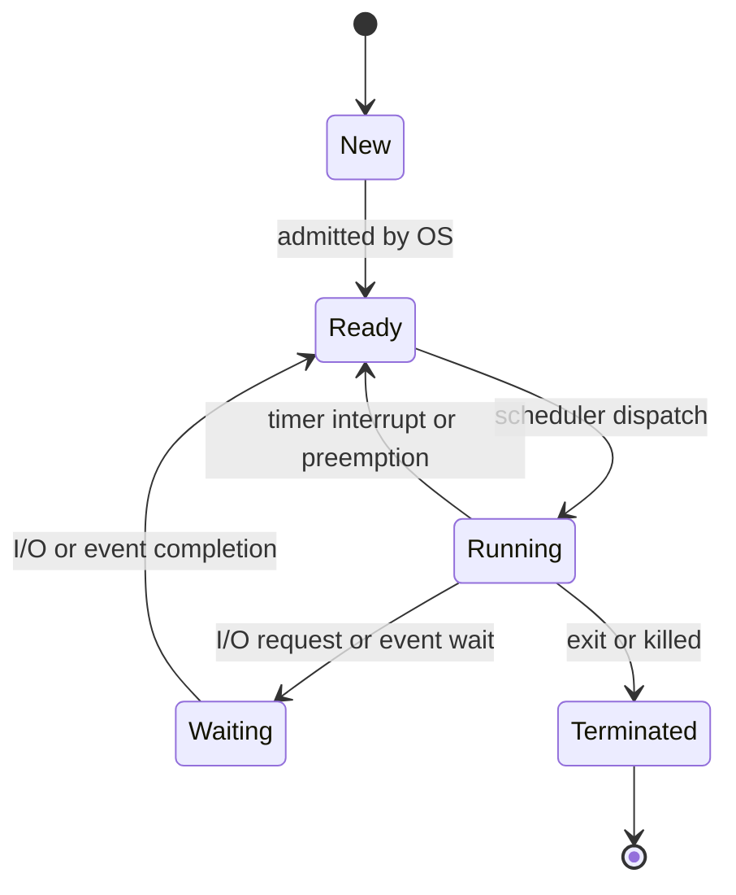
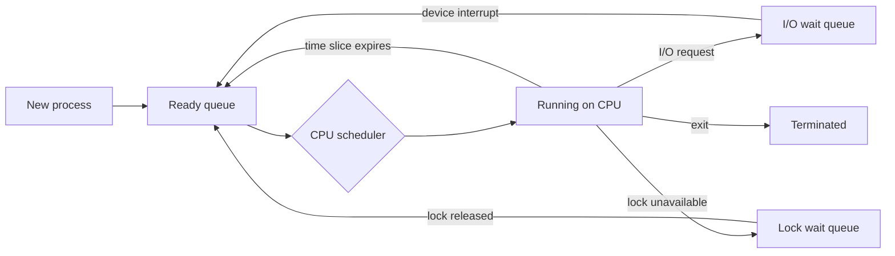
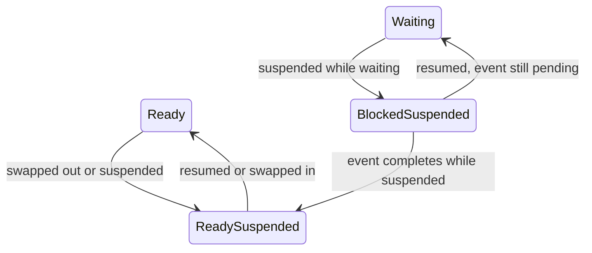

# Day 06 - Process States and Lifecycle

Difficulty: Beginner  
Fresh Learning: 40 minutes  
Revision: 5 minutes  
Prerequisites: Day 05 - Program vs Process, basic idea of PCB and address space  
Why this topic matters in interviews: Process states explain why a program may exist but not be using the CPU, why task managers show sleeping or waiting processes, and how scheduling, I/O blocking, and context switching fit together.

Imagine you open a browser, a code editor, a terminal, and a music player. At any instant, a CPU core can execute only one thread of instruction at a time, yet the system feels alive: one process waits for network data, another redraws the screen, another compiles code, and another sleeps until you press a key. The reason this does not collapse into chaos is that the OS does not treat every process as simply "running" or "not running." It tracks where each process is in its lifecycle.

A process can be newly created, ready for CPU time, currently running, waiting for I/O, suspended to reduce memory pressure, or terminated after finishing. These states are not decorative labels. They are the OS scheduler's working vocabulary. If the kernel cannot tell the difference between "ready to run" and "waiting for disk," it may waste CPU time on a process that cannot make progress. If it cannot record termination, parent processes cannot collect exit status. If it cannot move processes through queues, multitasking becomes unmanageable.

This topic is the bridge between Day 5's "what is a process?" and upcoming scheduling topics. A process image and PCB tell us what the process is. Process states tell us what the process is doing right now and what the OS should do next.

## Interview Definition

A process state describes the current execution condition of a process from the operating system's point of view. Common states are new, ready, running, waiting or blocked, and terminated. The OS moves a process between these states based on events such as creation, scheduler dispatch, timer interrupts, I/O requests, I/O completion, and program exit.

In an interview, say: process states help the OS decide whether a process needs CPU time, is waiting for an event, has just been created, or has finished. They are stored as part of process management metadata, usually associated with the PCB.

## Mental Model

Think of a busy hospital emergency department. Patients are registered, wait in a queue, enter the treatment room, pause while waiting for lab results, return for treatment after results arrive, and eventually get discharged. The doctor is the CPU. The hospital coordinator is the OS scheduler. The patient's file is the PCB.

A patient who is waiting for lab results should not occupy the treatment room. Similarly, a process waiting for disk or network I/O should not occupy the CPU. A patient ready for the doctor but not yet selected belongs in the waiting queue. Similarly, a ready process can run, but only after the scheduler chooses it. A discharged patient should not stay in the active queue. Similarly, a terminated process must be cleaned up after the parent or OS collects its status.

This model is useful because it separates "can make progress now" from "exists in the system." Many interview mistakes happen when students assume every live process is using the CPU. Most processes on a normal laptop are alive but sleeping or waiting most of the time.

## Layer 1: What happens at a high level?

At the highest level, the OS gives each process a lifecycle. The process starts when a program is launched or a parent process creates it. The OS builds process metadata, assigns a PID, prepares memory mappings, initializes resources, and eventually makes the process eligible for execution.

Once eligible, the process enters the ready state. Ready means the process has everything it needs except the CPU. It is not blocked on input, disk, network, a lock, or a timer. It is waiting only because some other process or thread is currently executing.

When the CPU scheduler chooses it, the process becomes running. Its instructions are actively executed by a CPU core. While running, it may continue until it exits, gets preempted by the timer, requests I/O, waits for a lock, sleeps, or is interrupted by an external event.

If the process asks for something that is not immediately available, such as disk data or network input, it enters waiting or blocked state. A blocked process is alive, but it should not be scheduled on the CPU because it cannot continue until the event completes. When the event completes, the OS moves it back to ready.

Finally, when the process finishes normally or is killed, it enters terminated state. The OS must release resources such as memory mappings, file descriptors, kernel objects, and scheduling records. In Unix-like systems there may be a short zombie phase where the process has exited but its parent has not yet collected the exit status.

## Layer 2: What happens inside the OS?

Inside the OS, process states are tied to queues and kernel data structures. A process is not merely tagged with a state string; it is usually linked into a queue or wait structure that matches its current condition.

The ready queue contains processes that can run as soon as the scheduler gives them CPU time. There may be one ready queue, multiple priority queues, per-CPU run queues, or more complex structures depending on the OS. The important interview idea is simple: ready processes compete for CPU.

Waiting queues are organized around events or resources. A process waiting for disk I/O may be attached to a device or block I/O wait queue. A process waiting for keyboard input may sleep on a terminal or input queue. A process waiting for a lock may be placed on a synchronization object's wait list. The OS does this so it can wake only the relevant processes when the event happens.

The PCB or equivalent kernel process structure stores enough information to manage these transitions: PID, process state, program counter, CPU registers when saved, scheduling information, priority, memory management information, open file references, accounting data, and parent-child relationships.

When an event occurs, the OS updates the process state and moves it between queues. For example, if a disk interrupt says that a read request is complete, the kernel finds the process or thread waiting for that request, marks it ready, and places it back on a run queue. The process still does not run immediately unless the scheduler chooses it.

## Layer 3: What happens at hardware or kernel level?

At the hardware level, process state transitions often begin with interrupts, traps, and privileged kernel code.

When a running process performs a system call such as `read()`, the CPU enters kernel mode through a controlled mechanism. The kernel checks the request. If the requested data is already available in memory, the system call may return quickly and the process may continue running. If the data requires disk or network I/O, the kernel starts or waits for the I/O operation, marks the process blocked, and invokes the scheduler to run something else.

When a timer interrupt fires, the CPU stops the currently running user code and enters the kernel interrupt handler. The OS may decide that the current process has used its time slice. It saves the execution context, moves that process from running to ready, selects another ready process, restores that process's context, and returns to user mode. This is the basis of preemptive multitasking.

When I/O completes, the device raises an interrupt. The kernel interrupt handler records completion and wakes the waiting process. Waking does not mean the process instantly uses the CPU; it means the process becomes ready.

On multiprocessor systems, more than one process or thread may be running at the same time on different CPU cores. The state model still applies per execution context. A process can have multiple threads, and individual threads may be running, ready, or blocked independently. For a beginner OS interview, explain process states first, then mention that real kernels often schedule threads rather than whole processes.

## Layer 4: What can go wrong?

Several problems become easier to reason about once you understand process states.

A process can starve in the ready state if the scheduler repeatedly chooses other processes. It is capable of running, but it does not receive CPU time. This is different from being blocked. A blocked process is waiting for an event; a starving process is waiting for fair scheduling.

A process can remain blocked forever if the event it waits for never happens. This can be caused by a deadlock, lost signal, broken I/O device, network timeout, or a lock that is never released. In monitoring tools, this may appear as a process sleeping or stuck in a wait state.

A system can become sluggish if too many processes are ready at once. The CPU must share time among many runnable entities, which increases waiting time and context-switch overhead. The process state diagram still works, but the ready queue becomes crowded.

A process can become a zombie after termination if the parent never collects its exit status. A zombie is not running and does not hold its full address space, but it still consumes a process table entry until reaped.

A process can be suspended or swapped when the OS wants to reduce memory pressure or stop it temporarily. Suspended states are not always included in the simple five-state model, but they matter in real systems and in advanced interview follow-ups.

## Step-by-Step Flow

Here is a practical lifecycle for a simple command such as running `./app` from a shell:

1. The shell asks the OS to create a child process.
2. The OS allocates a PID and creates process metadata such as a PCB or task structure.
3. The process is placed in the new state while its address space and initial resources are prepared.
4. After loading or mapping the executable and setting up the initial execution context, the OS places it in the ready queue.
5. The scheduler chooses the process and dispatches it to the CPU.
6. The process enters running state and begins executing instructions.
7. The process calls `read()` to wait for input or file data.
8. If the data is not immediately available, the kernel marks the process waiting or blocked and links it to the relevant wait queue.
9. The scheduler selects another ready process so the CPU is not wasted.
10. The I/O device or event completes and notifies the kernel.
11. The kernel wakes the blocked process and moves it back to ready.
12. The scheduler later dispatches it again, and it continues running.
13. The process finishes, returns from `main`, calls `exit`, or receives a termination signal.
14. The OS marks it terminated, records exit status, releases resources, and eventually removes its remaining process table entry.

## Diagram Section

The classic process lifecycle is often shown as a five-state diagram:



This diagram shows the most important interview distinction: ready means the process can run but lacks CPU time, while waiting means it cannot run until an event completes.

The queue view shows how the OS organizes processes behind those states:



This second diagram makes it clear that waiting is not one universal line. Real systems may have many wait queues, each connected to a different device, lock, timer, or event source.

Suspended states extend the simple model:



Suspension is useful when memory pressure, manual pause, debugging, or job control requires a process to stop competing for memory or CPU even though it still exists.

## Practical System Relevance

In Linux, the scheduler mostly deals with schedulable tasks. A process or thread can be running, runnable, interruptible sleep, uninterruptible sleep, stopped, traced, zombie, and more. Tools such as `ps` show simplified state letters. For example, `R` usually means running or runnable, `S` means interruptible sleep, `D` means uninterruptible sleep, `T` means stopped, and `Z` means zombie.

In Windows, Task Manager and Resource Monitor expose process status, CPU usage, wait chains, suspended processes, and background activity. A process can exist with 0 percent CPU usage because its threads are waiting, sleeping, or blocked on I/O.

In Android, apps move through higher-level lifecycle states, but underneath they still rely on Linux process scheduling and states. Android may keep background app processes cached, stop them, or kill them under memory pressure. This is different from CPU process state, but it builds on the same idea that "alive" does not mean "currently executing."

In servers, most worker processes or threads spend much of their time waiting for sockets, disk, database responses, or locks. Efficient servers avoid wasting CPU while waiting. Event-driven servers go further by keeping many connections in waitable states and waking work only when events arrive.

In databases, process and thread states matter when diagnosing slow queries. A database worker may be CPU-bound, waiting on disk I/O, waiting for a lock, waiting for network output, or sleeping in a pool. Correct diagnosis depends on distinguishing running from waiting.

In browsers, renderer processes and worker threads frequently move between runnable and sleeping states. A tab that is open but inactive may have processes alive with little CPU activity. Modern browsers throttle background work to preserve battery and responsiveness.

In containers, the process state model still comes from the host kernel. A container does not have a separate kernel scheduler. Tools inside the container may show only the container's process namespace, while the host sees the broader scheduling picture.

## Code or Pseudocode Section

This small C-like example demonstrates common lifecycle transitions:

```c
int main() {
    printf("Starting work\n");

    char buffer[100];
    read(0, buffer, sizeof(buffer));  // may block waiting for keyboard input

    compute_result();                 // uses CPU while running

    return 0;                          // process exits
}
```

When this program starts, it moves from new to ready to running. If `read()` waits for keyboard input, the process becomes blocked. When input arrives, the terminal driver wakes it and the OS moves it back to ready. Later, after the scheduler dispatches it, it runs `compute_result()` and finally exits.

In Unix-like systems, a parent process can create and observe a child process:

```c
pid_t pid = fork();

if (pid == 0) {
    execl("./worker", "worker", NULL);
    _exit(1);
} else {
    int status;
    waitpid(pid, &status, 0);
}
```

The child is created, becomes ready, runs another program after `exec`, and eventually terminates. The parent calling `waitpid` may block until the child exits. If the parent never waits, the child may briefly remain as a zombie after it terminates.

Useful observation commands:

```bash
ps -eo pid,ppid,state,comm
top
htop
ps aux | grep app
strace -p <pid>
```

`ps` helps identify state letters. `top` and `htop` show which processes are consuming CPU. `strace` can reveal whether a process is blocked in a system call such as `read`, `poll`, `futex`, or `wait4`.

## Common Misconceptions

- Misconception: A process that exists is always running. Correction: most live processes are ready, waiting, sleeping, stopped, or otherwise not currently executing.
- Misconception: Ready and waiting mean the same thing. Correction: ready means only the CPU is missing; waiting means some event or resource is missing.
- Misconception: A blocked process wastes CPU. Correction: a blocked process normally does not use CPU until it is woken.
- Misconception: Running means the process will continue until it finishes. Correction: preemptive systems can interrupt a running process and move it back to ready.
- Misconception: Terminated means all traces vanish instantly. Correction: the OS may keep exit status briefly, creating a zombie-like state until the parent collects it.
- Misconception: The scheduler chooses from all processes. Correction: the CPU scheduler chooses from runnable or ready tasks, not from processes blocked on I/O.
- Misconception: Suspended and blocked are identical. Correction: blocked waits for an event; suspended is deliberately stopped or swapped out by the OS or user.
- Misconception: More ready processes always improve CPU use. Correction: once the CPU is saturated, extra ready processes increase waiting and context-switch pressure.

## Tricky Interview Corners

Ready vs waiting is the most common trap. If a process is ready, it can execute immediately if given CPU time. If it is waiting, giving it CPU time would not help because it needs an I/O completion, lock release, timer expiry, child exit, signal, or some other event.

Running vs runnable can be subtle. Some tools use `R` for both currently running and runnable. On a multicore machine, several tasks can be running at once, while many more may be runnable but not executing.

Blocked I/O is not automatically bad. Blocking is often the efficient behavior. If a process asks for disk data and sleeps while waiting, the CPU can do other work. The problem is not blocking itself; the problem is unexpected or long blocking that hurts latency.

Uninterruptible sleep is a special case in Unix-like systems. A process in uninterruptible sleep is usually waiting for kernel-level I/O and may not respond immediately to signals. Interviewers may ask why `kill -9` does not instantly remove every stuck process. The short answer is that the kernel may be waiting for a non-interruptible operation to return before safely handling termination.

Zombie processes are not CPU consumers. A zombie has already finished execution. The remaining issue is bookkeeping: the parent has not collected its exit status. Too many zombies can exhaust process table entries, but a zombie is not "running in the background."

Suspended states are separate from waiting states. A process can be ready but suspended, meaning it could run logically but is not allowed to compete for CPU or may be swapped out. A process can also be blocked and suspended, meaning the event has not happened and the process has also been suspended.

In modern kernels, threads are often the scheduled units. A process may contain one blocked thread and one running thread. For beginner answers, describe process states; for stronger answers, mention that real schedulers usually track states at thread or task granularity.

## Comparison Tables

| State | Meaning | Can use CPU immediately? | Typical reason |
|---|---|---:|---|
| New | Process is being created | No | OS is building metadata and memory setup |
| Ready | Process can run | Yes, if scheduled | Waiting only for CPU |
| Running | CPU is executing it | Already using CPU | Scheduler dispatched it |
| Waiting or blocked | Cannot continue yet | No | I/O, lock, signal, timer, child process |
| Terminated | Finished or killed | No | Exit, fatal error, or kill signal |

| Pair | Key difference | Interview trap |
|---|---|---|
| Ready vs Waiting | Ready lacks CPU; waiting lacks an event or resource | Do not say waiting process just needs scheduler selection |
| Running vs Ready | Running is executing now; ready is runnable but not selected | On multicore, several tasks can run at once |
| Blocked vs Suspended | Blocked waits for an event; suspended is stopped or swapped | A suspended process may not be waiting for I/O |
| Terminated vs Zombie | Terminated is finished; zombie is unreaped exit status | Zombie does not consume normal CPU execution |

## How to Explain This in an Interview

### 30-second answer

Process states describe where a process is in its execution lifecycle. The common states are new, ready, running, waiting or blocked, and terminated. The OS moves processes between these states based on events like creation, scheduler dispatch, timer preemption, I/O requests, I/O completion, and exit.

### 2-minute answer

When a process is created, the OS builds metadata such as a PID, address space, and PCB. Once it is prepared, it enters the ready queue, meaning it can run but is waiting for CPU time. The scheduler dispatches it to the CPU, so it becomes running. While running, it may be preempted and return to ready, request I/O and become waiting, or exit and become terminated. Waiting is different from ready: a waiting process cannot make progress until an event occurs, while a ready process can run as soon as the scheduler selects it.

### Deeper follow-up answer

In real systems, these states are implemented through kernel task structures, ready queues, wait queues, interrupts, and scheduler decisions. A blocked process is often linked to a wait queue for a device, lock, timer, or child process. When the relevant event completes, an interrupt or kernel wake-up path moves the process back to the ready queue. Modern kernels often schedule threads rather than whole processes, and tools may show richer states such as sleeping, uninterruptible sleep, stopped, and zombie. The core idea remains: the OS tracks whether each schedulable entity is runnable, currently executing, waiting for an event, stopped, or finished.

## Interview Questions

### Basic Questions

1. What are the common states in a process lifecycle?
2. What is the difference between ready and running?
3. What is the difference between ready and waiting?
4. Why does a process enter the waiting or blocked state?
5. What happens when a process terminates?

### Intermediate Questions

6. How does a timer interrupt move a process from running to ready?
7. How does I/O completion move a process from waiting to ready?
8. Why should the scheduler not choose a blocked process?
9. What is a ready queue?
10. What information in the PCB helps manage process state transitions?

### Advanced Questions

11. What is a zombie process, and why does it exist?
12. How are suspended states different from blocked states?
13. Why can a system have high load even when not all processes are running?
14. How do process states become more complex in multithreaded processes?
15. Why might a process not respond immediately to a kill signal?

## Follow-Up Questions

Q: What is the ready state?  
Follow-ups:
- Can a ready process execute immediately if CPU is free?
- Is a ready process waiting for I/O?
- Where is a ready process usually stored?

Q: What is the waiting state?  
Follow-ups:
- What events can wake a waiting process?
- Does a waiting process consume CPU?
- How does waiting differ from starvation?

Q: What causes a running process to leave the CPU?  
Follow-ups:
- What is preemption?
- What role does a timer interrupt play?
- Can a system call cause the process to block?

Q: What is a zombie process?  
Follow-ups:
- Is it still executing?
- Why does the OS keep it temporarily?
- How does the parent remove it?

Q: What are suspended states?  
Follow-ups:
- Why might the OS suspend a process?
- Is suspended the same as blocked?
- Can a blocked process become blocked-suspended?

Q: How does I/O completion affect process states?  
Follow-ups:
- Does I/O completion directly put the process on the CPU?
- What queue does it usually return to?
- What hardware mechanism often notifies the kernel?

## Trick Questions

1. Q: If a process is waiting for disk I/O, is it using the CPU?  
   Expected answer: Usually no. It is blocked, and the CPU can run another ready process.

2. Q: If a process is ready, is it blocked?  
   Expected answer: No. Ready means it can run but has not been selected by the scheduler.

3. Q: Can a process move from waiting directly to running?  
   Expected answer: In the conceptual model, it normally moves from waiting to ready first. The scheduler must then dispatch it.

4. Q: Is a zombie process dangerous because it keeps executing secretly?  
   Expected answer: No. It has already exited. The problem is unreaped bookkeeping, not hidden CPU execution.

5. Q: If `top` shows 0 percent CPU for a process, is the process necessarily terminated?  
   Expected answer: No. It may be sleeping, waiting, or simply not scheduled recently.

6. Q: Can a process be alive but not in memory?  
   Expected answer: In systems with swapping or suspension, a process may be suspended or swapped out while still existing as an OS-managed entity.

7. Q: Does every system call move the process to waiting state?  
   Expected answer: No. Some system calls complete immediately; others block if the requested resource or event is unavailable.

## Practical Debugging / Observation

On Linux or WSL, inspect process states with:

```bash
ps -eo pid,ppid,state,comm | head
ps -o pid,ppid,state,wchan,comm -p <pid>
top
```

Look for state letters. `R` means running or runnable. `S` often means interruptible sleep. `D` often means uninterruptible sleep. `T` means stopped. `Z` means zombie.

To observe blocking behavior, run a command that waits for input:

```bash
cat
```

In another terminal, inspect it:

```bash
ps -o pid,ppid,state,wchan,comm -C cat
```

The process is alive, but it is likely sleeping while waiting for terminal input. Pressing keys or sending EOF lets it continue.

To observe system calls that may block:

```bash
strace -p <pid>
```

If a program is waiting in calls such as `read`, `poll`, `select`, `epoll_wait`, `futex`, or `wait4`, that tells you why it is not using CPU.

On Windows, Task Manager gives a simplified view, but Resource Monitor and Process Explorer provide deeper wait and thread-state information. A process with many threads may show low CPU because most threads are waiting on events, I/O, or timers.

## Mini Quiz

### MCQs

1. Which state means the process can run but has not been assigned the CPU?
   A. Waiting  
   B. Ready  
   C. Terminated  
   D. New

2. A process requests disk data that is not yet available. What usually happens?
   A. It stays running and wastes CPU  
   B. It becomes waiting or blocked  
   C. It terminates immediately  
   D. It becomes a zombie

3. What event commonly moves a process from running to ready in a preemptive system?
   A. Timer interrupt  
   B. Parent wait  
   C. File deletion  
   D. Program compilation

4. What is a zombie process?
   A. A process still using CPU in secret  
   B. A process that has exited but whose status has not been collected  
   C. A process waiting for keyboard input  
   D. A process in the ready queue

5. Which queue contains processes waiting only for CPU time?
   A. Ready queue  
   B. Disk wait queue  
   C. Lock wait queue  
   D. Zombie list

### Short-answer questions

1. Explain ready vs waiting in one sentence.
2. Why does the OS keep blocked processes out of the ready queue?
3. What role does the PCB play in process state management?

### Reasoning questions

1. A process is alive, has 0 percent CPU, and resumes immediately when network data arrives. Which state was it likely in and why?
2. A system has many ready processes and feels slow even though they are not blocked. What scheduler-related issue might the user observe?

### Answers

1. B  
2. B  
3. A  
4. B  
5. A  

Short answers:

1. Ready means the process can run if scheduled; waiting means it cannot continue until an event or resource becomes available.
2. A blocked process cannot make progress, so scheduling it would waste CPU time.
3. The PCB stores process metadata such as state, saved context, scheduling information, memory information, resources, and identifiers.

Reasoning answers:

1. It was likely waiting or blocked on network I/O. When data arrived, the kernel woke it and moved it back toward ready/running.
2. The user may observe long response time, high load, and frequent context switching because many runnable processes compete for limited CPU time.

# 5-Minute Revision Column

Revision Targets:
- Day 05: Program vs Process - R1 Recall Revision
- Day 03: Kernel, User Mode, and System Calls - R2 Compression Revision

## Day 05 - Program vs Process

Core recall:
- A program is passive code and data stored on disk. A process is an active execution instance managed by the OS.
- The same program can have many process instances, each with its own PID, address space, stack, heap, open resources, and execution state.
- The PCB is the OS record that helps pause, resume, schedule, and clean up a process.
- Process image means the in-memory layout: text/code, data, heap, stack, mapped libraries, and kernel-tracked resources.
- Running an executable involves loading or mapping code, creating process metadata, preparing memory, and making the process schedulable.

Key definitions:
- Program: a passive executable file or set of instructions that can be run.
- Process: an active running or runnable instance of a program.
- PCB: the kernel bookkeeping structure containing identity, state, scheduling, context, memory, and resource information.

Common traps:
- Do not say program and process are the same. One executable can create multiple separate processes.
- Do not say deleting the executable must instantly kill a running process. The process may continue using already mapped code and resources depending on OS behavior.

Quick interview questions:
- Why can the same program have multiple processes?
- What does the PCB store that a plain executable file does not?

Mental model: A program is a recipe; a process is a cooking session with its own ingredients, current step, tools, and manager's record.

## Day 03 - Kernel, User Mode, and System Calls

Compressed recall:
- Kernel = privileged OS core that controls protected resources.
- User mode = restricted application execution; kernel mode = privileged execution.
- System call = controlled user-to-kernel request for services such as file I/O, process creation, sockets, memory mapping, or timers.
- A system call is not just a normal function call because it crosses a privilege boundary.
- Mode switch and context switch are related but different: mode switch changes privilege; context switch changes the running schedulable entity.

Key definitions:
- Kernel: trusted OS core with authority over hardware and protected resources.
- System call: official entry point through which user code asks the kernel to perform protected work.
- Trap/syscall instruction: CPU mechanism that transfers control from user mode to kernel mode.

Common traps:
- `printf` is a library function; it may eventually cause a `write`-like system call.
- Kernel mode is not a different physical CPU. It is a privilege level enforced by hardware.

Quick interview questions:
- Why are applications not allowed to directly execute privileged instructions?
- Why is a system call usually slower than a normal function call?

Mental model: User programs are visitors in a secured facility; system calls are the official service counters for protected operations.

## Final Takeaway

Process states are the OS's way of answering a practical question: what should happen to this process right now? A ready process needs CPU time. A running process currently has it. A waiting process needs an event. A terminated process needs cleanup. These states let the OS keep the CPU busy without pretending every live process can run at every moment. Once this model is clear, scheduling, context switching, blocking I/O, deadlocks, and performance diagnosis become much easier to understand.

## What You Should Be Able To Answer Now

- Explain the five classic process states and why each exists.
- Distinguish ready, running, waiting, terminated, and suspended states.
- Explain how timer interrupts and I/O completion cause state transitions.
- Describe ready queues and wait queues in OS process management.
- Explain why a blocked process does not normally consume CPU.
- Identify common Linux state letters such as R, S, D, T, and Z at a beginner level.
- Explain what a zombie process is without confusing it with a running process.
- Connect process lifecycle to scheduling, context switching, and future OS topics.
