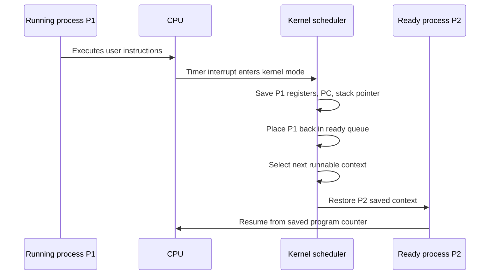
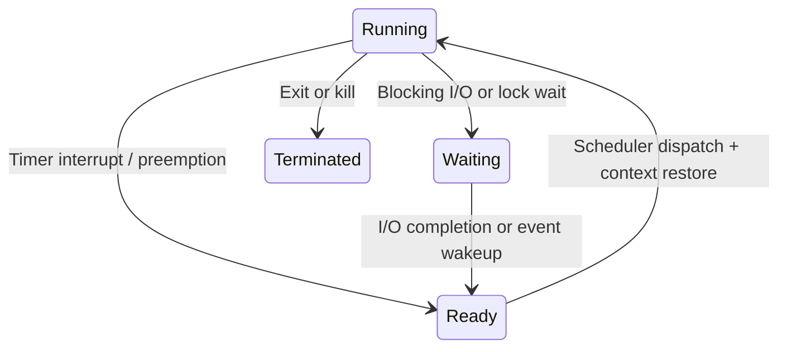
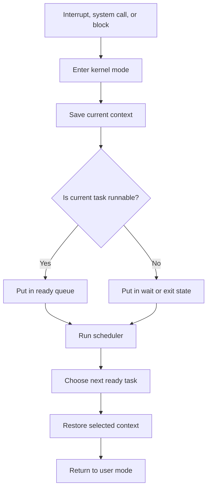

# Day 07 - Context Switching

Difficulty: Intermediate  
Fresh Learning: 40 minutes  
Revision: 5 minutes  
Prerequisites: Days 05-06 - Program vs Process, PCB, process image, process states, ready and waiting queues  
Why this topic matters in interviews: Context switching is the mechanism behind multitasking, preemption, CPU sharing, responsiveness, and scheduling overhead. Interviewers use it to test whether you understand what the OS really saves, why switching is not free, and how process lifecycle connects to scheduling.

Imagine you are typing code while music plays, a browser downloads files, a terminal runs tests, and an antivirus scanner works in the background. Your CPU has a limited number of cores, but the system feels as if many activities are progressing together. That illusion is not magic. The operating system repeatedly pauses one execution stream, saves enough information to resume it later, chooses another execution stream, restores its saved information, and lets it run.

That pause-and-resume operation is context switching.

Without context switching, one process could hold the CPU until it voluntarily stopped, blocked on I/O, or finished. A buggy or CPU-heavy program could make the whole machine feel frozen. Interactive programs would be painful because the browser, editor, shell, and UI could not quickly take turns. Servers would respond poorly because one request could monopolize a worker while other ready requests waited.

Context switching is the practical bridge between Day 6 process states and upcoming scheduling. The process state diagram says a process can move between running, ready, waiting, and terminated. Context switching explains the low-level operation that actually moves the CPU from one runnable execution context to another.

## Interview Definition

Context switching is the operating system operation of saving the current execution context of a running process or thread and restoring the saved context of another process or thread so the CPU can continue execution from the new one.

The context usually includes the program counter, CPU registers, stack pointer, processor status, and scheduling or memory-management metadata connected to the PCB or thread control block.

In an interview, say: a context switch lets the OS share CPU time among multiple processes or threads, but it has overhead because the CPU stops useful user work while the kernel saves and restores execution state and may disturb caches and TLB entries.

## Mental Model

Think of the CPU as a single focused interview room and the OS scheduler as the coordinator. A candidate is answering a question on the whiteboard. Suddenly, the coordinator says time is up or the candidate needs to wait for a document. Before removing the candidate from the room, the coordinator photographs the board, records the current question, stores the candidate's notes, and marks where the candidate stopped.

Then the coordinator brings in another candidate and restores that candidate's previous board state, notes, and question. The second candidate continues as if the room had always belonged to them.

The photograph and notes are the saved CPU context. The candidate file is like the PCB or TCB. The coordinator's decision is scheduling. The act of clearing one board and restoring another is context switching.

This model is useful because it makes two things clear. First, a context switch is not the same as just picking a process. Scheduling is the decision; context switching is the mechanical handoff. Second, switching has cost. During the handoff, nobody is answering interview questions. Similarly, during a context switch, the CPU is doing kernel bookkeeping instead of running the user's application logic.

## Layer 1: What happens at a high level?

At a high level, context switching happens when the CPU stops executing one process or thread and starts executing another. The currently running execution context becomes no longer running. It may move to the ready state if it was preempted, to the waiting state if it requested I/O or a lock, or to terminated if it finished. Another ready context becomes running.

There are three common reasons this happens.

First, a timer interrupt may occur. In a preemptive multitasking system, the OS sets a hardware timer. When the timer fires, the CPU enters kernel mode, and the OS gets a chance to decide whether the current process has used enough of its time slice. If yes, the scheduler chooses another ready process or thread, and the kernel performs a context switch.

Second, the running process may block. For example, it calls `read()` for disk or network data that is not ready yet. Since the process cannot make progress, the OS marks it waiting and switches to another ready context.

Third, a higher-priority or newly ready task may need CPU time. For example, an interactive UI thread wakes up after keyboard input. The OS may preempt a CPU-heavy background task so the UI remains responsive.

The important interview point is that context switching is how process state transitions become real CPU behavior. Day 6 taught that a process can be ready or running. Day 7 explains how the OS physically moves the CPU from one saved execution point to another.

## Layer 2: What happens inside the OS?

Inside the OS, context switching is tied to kernel data structures and scheduler code. A process or thread has a saved execution state stored in kernel-managed metadata. In textbook terms, this is often described as part of the Process Control Block. In real kernels, process and thread structures may separate process-wide information from thread-specific execution state.

When a context switch starts, the CPU is already in kernel mode or is entering kernel mode because of an interrupt, trap, or system call. The kernel saves the current execution context. This typically includes general-purpose registers, program counter or instruction pointer, stack pointer, flags or status register, and sometimes architecture-specific control registers. The exact details depend on the CPU architecture.

The kernel also updates scheduling metadata. It records why the current context stopped: preempted, blocked, yielded, exited, or interrupted. It may update runtime counters, priority information, time-slice accounting, and queue placement. If the context remains runnable, it goes back into a ready queue. If it is waiting for I/O, a lock, a timer, or a signal, it is attached to the appropriate wait queue.

Then the scheduler selects the next runnable context. The scheduler may use priority, fairness, time slices, CPU affinity, interactive responsiveness, or other policies. After selecting the next context, the kernel loads that context's saved registers and related state. Finally, control returns from kernel mode to the selected context, and execution continues at the exact instruction where that context previously stopped.

For a clean interview distinction:

| Term | Meaning |
| --- | --- |
| Scheduling | Deciding which ready process or thread should run next |
| Dispatching | Giving CPU control to the selected process or thread |
| Context switch | Saving the old context and restoring the selected context |
| Mode switch | Changing between user mode and kernel mode without necessarily changing processes |

The trap is to use these terms as synonyms. They are related, but not identical.

## Layer 3: What happens at hardware or kernel level?

At the hardware level, a context switch is possible because the CPU exposes registers and privileged control mechanisms that the kernel can save and restore. User programs cannot freely switch CPU ownership because that would break protection. The kernel performs the switch while running in privileged mode.

A timer interrupt is a classic starting point. The hardware timer interrupts the currently running code. The CPU saves a small amount of immediate interrupt state according to the architecture and jumps to the kernel's interrupt handler. The kernel handler can inspect the current task, update accounting, and decide whether scheduling is needed. If the current task should continue, the kernel returns from the interrupt. If another task should run, the kernel enters the scheduler and performs a context switch.

During the switch, the kernel uses per-task kernel stacks and saved register areas. It may also switch address spaces. A process context switch is often more expensive than a thread switch inside the same process because different processes have different virtual address spaces. Switching processes may require changing page-table related registers and may invalidate or reduce the usefulness of TLB entries. Threads in the same process usually share the same address space, so a thread switch may avoid some memory-translation overhead, although registers and stacks still must change.

Modern CPUs complicate the picture. Caches, branch predictors, TLBs, CPU affinity, and multicore scheduling all affect cost. A context switch does not always flush every cache, but it can reduce cache locality because the next task uses different code and data. If the OS moves a task to another core, that task may lose warm cache state. If the switch changes address spaces, address translation caching can be affected.

This is why interviewers ask why context switching is expensive. The answer is not only "saving registers." Saving registers is part of the direct cost. The indirect cost is that the CPU pipeline, cache locality, TLB state, and scheduler bookkeeping may all suffer.

## Layer 4: What can go wrong?

Too many context switches can make a system slower even when the CPU looks busy. If a machine constantly switches among many runnable tasks, a larger fraction of CPU time is spent in kernel overhead instead of useful application work. This can happen with too many threads, very small time slices, excessive lock contention, heavy I/O wakeups, or a server design that creates far more runnable workers than the CPU can handle.

A bad scheduling policy can cause unnecessary switching. If the OS switches too frequently, responsiveness may improve slightly but throughput may drop. If it switches too rarely, throughput may improve for CPU-bound jobs but interactive programs may feel laggy. This tradeoff is one reason scheduling algorithms matter.

Priority problems can also interact with context switching. A high-priority task may repeatedly preempt lower-priority tasks. That can be useful for responsiveness, but it can also starve lower-priority work. Priority inversion can occur when a high-priority task waits for a lock held by a low-priority task, while medium-priority tasks keep running and prevent the low-priority task from releasing the lock.

Context switching can hide bugs in concurrent programs. A race condition may appear only when a switch happens between two specific instructions. For example, one thread reads a shared counter, gets preempted, another thread updates the counter, and the first thread resumes with stale information. This is why upcoming synchronization topics depend on understanding interleavings.

Finally, confusing context switches with mode switches leads to wrong answers. A system call causes a mode switch from user mode to kernel mode. It may or may not cause a context switch. If the system call completes quickly, the same process may resume immediately. If it blocks, the OS switches to another process or thread.

## Step-by-Step Flow

Here is a practical flow for a timer-driven context switch:

1. A user process is running on the CPU.
2. A hardware timer interrupt occurs.
3. The CPU enters kernel mode and jumps to the interrupt handler.
4. The kernel saves the current process or thread's CPU context.
5. The scheduler checks whether the current time slice is over or another task should run.
6. The current task is moved to the ready queue if it is still runnable.
7. The scheduler selects the next ready task.
8. The kernel loads the selected task's saved context.
9. The CPU returns from kernel mode to the selected task.
10. The selected task continues from its saved program counter.

Here is a blocking I/O version:

1. A running process calls `read()` for data that is not currently available.
2. The CPU enters kernel mode through a system call.
3. The kernel validates the request and starts or waits for the I/O operation.
4. Because the process cannot continue, the kernel marks it waiting or blocked.
5. The scheduler selects another ready process or thread.
6. The kernel saves the old context and restores the new one.
7. Later, the device signals I/O completion through an interrupt.
8. The kernel moves the blocked process back to the ready queue.
9. The process runs only when the scheduler selects it again.

## Diagram Section



This sequence shows the difference between the running process, the CPU interrupt, and the kernel scheduler. The process does not voluntarily hand off the CPU in preemption; the timer interrupt gives the kernel control.



This diagram connects Day 6 process states to Day 7 context switching. The transitions from running to ready and ready to running are where context saving and restoring become visible.



This flowchart is the interview-safe version: event, kernel entry, save, queue update, schedule, restore, return.

## Practical System Relevance

- Linux schedules tasks, where a task may represent a process or thread. Context switching is part of how the kernel moves CPU execution between runnable tasks.
- Windows also schedules threads rather than only whole processes. A process owns resources such as address space and handles, while threads are the schedulable execution units.
- Android depends heavily on context switching because UI responsiveness, background services, media playback, and app sandboxing all compete for CPU time.
- Browsers use multiple processes and many threads. Rendering, networking, JavaScript execution, GPU work, and extensions may be isolated or scheduled separately.
- Servers rely on context switching when handling many clients. A web server may use worker processes, worker threads, async event loops, or a combination.
- Databases care about context switching because too many worker threads can reduce throughput through scheduler overhead and cache disruption.
- Containers do not remove context switching. Containerized processes are still scheduled by the host kernel, often with cgroup limits influencing CPU share.
- Cloud systems tune CPU quotas and core placement because scheduling overhead, preemption, and cache locality affect latency-sensitive workloads.

In Linux-style tools, context switching is visible through system counters. A high context-switch rate is not automatically bad, but it is a signal to investigate workload shape. A busy interactive desktop may switch often. A high-performance server with excessive switching may have too many threads, lock contention, or inefficient I/O behavior.

## Code or Pseudocode Section

Here is simplified C-like pseudocode for a kernel context switch. Real kernels are architecture-specific and use assembly in critical parts, but the idea is:

```c
void context_switch(task_t *old, task_t *next) {
    save_registers(&old->cpu_context);
    old->state = READY;

    current = next;
    next->state = RUNNING;

    load_address_space(next->mm);
    restore_registers(&next->cpu_context);
}
```

This demonstrates the shape, not real implementation detail. The OS saves state for the old task, updates states, switches the current task pointer, possibly changes address-space metadata, and restores the next task's state.

A blocking call can trigger scheduling:

```c
ssize_t kernel_read(file_t *file, char *buf, size_t n) {
    if (!data_available(file)) {
        current->state = WAITING;
        add_to_wait_queue(file->wait_queue, current);
        schedule();
    }

    return copy_data_to_user(buf, file, n);
}
```

The key point: if data is unavailable, the process should not keep using the CPU. It is placed on a wait queue, and the scheduler chooses someone else.

On a Linux machine, these commands help observe related behavior:

```bash
vmstat 1
pidstat -w 1
top
ps -eo pid,ppid,stat,comm
```

In `vmstat`, the `cs` column shows context switches per second. In `ps`, process states such as running, sleeping, or stopped help connect lifecycle states to real observation. `top` shows CPU usage and task states. `pidstat -w` can show voluntary and involuntary context switches per process if the tool is installed.

## Common Misconceptions

1. Context switching is the same as scheduling. Correction: scheduling chooses the next task; context switching performs the save-and-restore handoff.
2. A system call always causes a context switch. Correction: a system call causes a mode switch. It causes a context switch only if the current task blocks, exits, yields, or is preempted.
3. Context switching is only saving the program counter. Correction: the OS must preserve enough CPU and execution state to resume correctly, including registers, stack pointer, flags, and related scheduling or memory metadata.
4. Thread switches are free. Correction: thread switches are often cheaper than process switches within the same address space, but they still save and restore registers, stacks, and scheduling state.
5. More threads always improve performance. Correction: too many runnable threads can increase context switching, cache misses, lock contention, and memory use.
6. A process waiting for I/O is still consuming CPU because it is alive. Correction: a blocked process exists but should not run until the awaited event completes.
7. Context switching means the OS copies the whole process memory. Correction: the OS switches mappings and execution state; it does not copy the entire address space on every switch.
8. High context-switch count is always bad. Correction: it depends on workload. It is suspicious when it correlates with poor throughput or latency.

## Tricky Interview Corners

The first tricky corner is direct cost versus indirect cost. Direct cost includes entering the kernel, saving registers, choosing the next task, and restoring registers. Indirect cost includes cache locality loss, TLB disruption, pipeline effects, and branch prediction disturbance.

The second corner is process switch versus thread switch. Threads in the same process share an address space, so switching between them may avoid changing page tables. But each thread still has its own stack and register state. A process switch usually changes both execution state and address-space context.

The third corner is voluntary versus involuntary context switching. A voluntary switch happens when a task blocks or yields. An involuntary switch happens when the OS preempts it, often because a time slice expires or a higher-priority task becomes runnable.

The fourth corner is mode switch versus context switch. If a program calls `getpid()`, the CPU may enter the kernel and return to the same process quickly. That is a mode switch without necessarily changing the running task. If a program calls `read()` and data is not ready, it may block, causing both a mode switch and a context switch.

The fifth corner is multicore behavior. On a multicore system, one core can switch from task A to task B while another core continues running task C. Context switching is per CPU core, but scheduling decisions are system-wide enough to consider load balancing and affinity.

The sixth corner is why context switching enables fairness but can hurt throughput. Fairness needs sharing. Sharing requires switching. But switching too often reduces the amount of time spent doing useful work.

## Comparison Tables

| Context Switch Type | What changes | Typical cost | Example |
| --- | --- | --- | --- |
| Process to process | Registers, stack, task metadata, often address space | Higher | Browser process to editor process |
| Thread to thread in same process | Registers, stack, thread metadata | Lower but not free | Worker thread A to worker thread B |
| Mode switch only | CPU privilege level | Usually lower than full context switch | Fast system call returning to same process |
| Interrupt handling without task switch | Temporary kernel handling | Usually short | Timer interrupt decides same task continues |

| Concept | Interview distinction |
| --- | --- |
| Ready | Can run, waiting only for CPU |
| Running | Currently executing on a CPU core |
| Waiting | Cannot run until an event occurs |
| Preempted | Was running, forced back to ready |
| Blocked | Was running, moved to waiting because progress requires an event |

## How to Explain This in an Interview

### 30-second answer

A context switch is when the OS saves the CPU execution state of the currently running process or thread and restores the saved state of another one. It enables multitasking and preemption, but it is not free because the kernel must save and restore registers and may disturb caches, TLB state, and scheduling locality.

### 2-minute answer

When a timer interrupt, blocking system call, yield, or higher-priority wakeup occurs, the CPU enters kernel mode. The kernel saves the current task's context, such as program counter, registers, stack pointer, and status flags, usually in task metadata associated with the PCB or TCB. The scheduler decides which ready task should run next. The kernel updates queues, restores the selected task's saved state, and returns to user mode so that task continues from where it stopped. A process switch can be more expensive than a thread switch because it may involve changing address-space information and harming TLB locality. Context switching is necessary for responsiveness and fairness, but excessive switching can reduce throughput.

### Deeper follow-up answer

The most important nuance is that scheduling, mode switching, and context switching are different. A scheduler decision chooses the next runnable task. A mode switch changes privilege level, such as user to kernel during a system call. A context switch changes the active execution context. A system call may only mode-switch if it returns immediately, but if it blocks on I/O, the kernel will context-switch to another ready task. The cost includes direct kernel work and indirect hardware effects such as cache warmth, TLB behavior, and CPU affinity.

## Interview Questions

### Basic Questions

1. What is a context switch?
2. Why does an operating system need context switching?
3. What is usually saved during a context switch?
4. How is context switching related to the PCB?
5. What is the difference between ready and running in the context-switching story?

### Intermediate Questions

6. Why is context switching considered overhead?
7. How can a timer interrupt cause a context switch?
8. What is the difference between a voluntary and involuntary context switch?
9. Is a system call always a context switch? Explain.
10. Why is a process context switch often more expensive than a thread context switch?

### Advanced Questions

11. How can excessive context switching hurt server performance?
12. How do cache and TLB effects contribute to context-switch cost?
13. How does context switching relate to race conditions?
14. What role does CPU affinity play in reducing context-switch overhead?
15. Can context switching happen on multiple CPU cores at the same time?

## Follow-Up Questions

Q: What is a context switch?  
Follow-ups:
- Which registers or state must be saved?
- Where is the saved state stored?
- Is the whole process memory copied?

Q: Why is context switching costly?  
Follow-ups:
- What is the direct kernel cost?
- What are the cache and TLB effects?
- Why can too many threads make this worse?

Q: How does a timer interrupt help preemption?  
Follow-ups:
- Who sets the timer?
- Does the process know it was interrupted?
- What happens if the scheduler chooses the same process again?

Q: Is a system call a context switch?  
Follow-ups:
- What is a mode switch?
- When does a system call block?
- Can the same process resume after the system call?

Q: Process switch vs thread switch?  
Follow-ups:
- What state is shared by threads?
- Why can same-process thread switching be cheaper?
- Why is it still not free?

Q: What happens when a process blocks for I/O?  
Follow-ups:
- Which state does it enter?
- How does it become ready again?
- Does I/O completion immediately mean running?

Q: How can context switching cause performance problems?  
Follow-ups:
- What symptoms would you look for?
- Which commands can show high switch rates?
- How might a server reduce unnecessary switching?

Q: How does context switching connect to synchronization bugs?  
Follow-ups:
- What is an interleaving?
- Why can a race condition be intermittent?
- Why do locks change possible execution orders?

## Trick Questions

1. Q: Does context switching copy the entire memory of a process?  
Expected answer: No. The OS saves execution state and switches mappings or metadata. Copying the full address space on every switch would be far too expensive.

2. Q: If a process calls a system call, must another process run next?  
Expected answer: No. The system call may return to the same process. Another process runs only if scheduling chooses a different context.

3. Q: Is a thread context switch always faster than a process context switch?  
Expected answer: Usually it can be cheaper within the same address space, but "always" is too strong. Actual cost depends on architecture, kernel path, cache state, and workload.

4. Q: If a task is preempted, is it blocked?  
Expected answer: No. A preempted task is usually still ready. It can run again when scheduled.

5. Q: If context switching enables multitasking, should the OS switch as often as possible?  
Expected answer: No. Frequent switching improves fairness only up to a point; beyond that it wastes CPU time and damages locality.

6. Q: Does a context switch always move from user mode to user mode?  
Expected answer: The handoff is managed in kernel mode. It may be triggered from user execution, kernel execution, interrupts, or blocking paths.

7. Q: If a process is sleeping, is its context lost?  
Expected answer: No. Its saved state and kernel metadata remain so it can resume when woken and scheduled.

## Practical Debugging / Observation

Use these commands on a Linux system or VM when available:

```bash
vmstat 1
pidstat -w 1
cat /proc/stat
ps -eo pid,stat,comm
top
```

What to observe:

- In `vmstat 1`, watch the `cs` column for context switches per second. Compare idle system behavior with heavy multitasking.
- In `pidstat -w 1`, look for voluntary and involuntary context switches per process. Voluntary switches often come from blocking or yielding; involuntary switches often come from preemption.
- In `/proc/stat`, the `ctxt` line shows total context switches since boot on Linux.
- In `ps`, process states help you connect ready, running, sleeping, stopped, and zombie-style states to lifecycle theory.
- In `top`, watch whether high CPU usage and high task counts correspond to system sluggishness.

Do not diagnose from one number alone. A high context-switch count can be normal for interrupt-heavy or interactive workloads. It becomes a performance clue when paired with high latency, lock contention, too many runnable workers, or poor throughput.

## Mini Quiz

### MCQs

1. Which event commonly triggers preemptive context switching?  
A. Timer interrupt  
B. File rename only  
C. HTML rendering only  
D. Variable declaration  
Answer: A

2. Which item is most likely part of saved CPU context?  
A. Program counter  
B. Monitor brightness  
C. File name string only  
D. Desktop wallpaper  
Answer: A

3. A process waiting for disk I/O is usually:  
A. Running continuously  
B. Waiting or blocked  
C. Terminated  
D. Always zombie  
Answer: B

4. Scheduling is best described as:  
A. Copying full memory  
B. Choosing the next runnable task  
C. Formatting the disk  
D. Compiling source code  
Answer: B

5. A mode switch without a context switch can happen when:  
A. A quick system call returns to the same process  
B. The computer is unplugged  
C. The process memory is copied entirely  
D. The scheduler deletes all queues  
Answer: A

### Short-answer questions

1. Why is context switching necessary for interactive systems?  
Answer: It lets the OS quickly move CPU time among UI, background, I/O, and user tasks so no single runnable program monopolizes the CPU.

2. Why can process switching be costlier than thread switching?  
Answer: A process switch may change address-space information and disturb TLB locality, while threads in the same process usually share the address space.

3. What is the difference between blocked and preempted?  
Answer: Blocked means the task cannot run until an event occurs. Preempted means the task can run but was moved back to ready so another task can use the CPU.

### Reasoning questions

1. A web server creates 10,000 runnable threads on an 8-core machine. Why might throughput fall?  
Answer: The scheduler may spend too much time switching among threads. Cache locality worsens, stacks consume memory, locks contend, and many threads wait for CPU rather than doing useful work.

2. A program calls `read()` and the data is already in the page cache. Must the OS context-switch away?  
Answer: No. The CPU enters kernel mode for the system call, but if data is ready and the call completes quickly, the same process may resume without switching to another task.

# 5-Minute Revision Column

Revision targets for Day 7:

- Day 6: Process States and Lifecycle - R1 Recall Revision
- Day 4: OS Structures and Services - R2 Compression Revision

## Day 6 - Process States and Lifecycle

Core recall: Process states describe what a process is currently able to do from the OS point of view. New means being created. Ready means it can run but does not currently have CPU time. Running means its instructions are executing on a CPU core. Waiting or blocked means it cannot continue until an event such as I/O completion, a lock release, or a signal. Terminated means execution is done and cleanup is needed.

Key definitions:

- Process state: The current execution condition of a process as tracked by the OS.
- Ready queue: The set of runnable processes or threads waiting for CPU time.
- Waiting queue: A structure holding processes blocked on a specific event or resource.

Common traps:

- Ready does not mean running. It means eligible for CPU.
- Waiting does not mean dead. It means blocked until an event occurs.

Quick interview questions:

1. If a process waits for disk I/O, should it stay on the CPU?
2. Can a process move from waiting directly to running?

Mental model: The CPU is the doctor, the ready queue is the waiting room, and the PCB is the patient file. A patient waiting for lab results should not occupy the treatment room.

## Day 4 - OS Structures and Services

Core recall: OS structure is how the OS organizes kernel responsibilities, drivers, services, and communication paths. OS services are the capabilities exposed by that structure: process management, memory management, files, I/O, protection, security, networking, accounting, and error handling.

Key definitions:

- Monolithic kernel: Many core services run in kernel space for direct performance.
- Microkernel: The kernel keeps only minimal core mechanisms, moving many services to user space.
- Modular kernel: A kernel can load components dynamically while still keeping them in kernel space.

Common traps:

- Modular kernel is not automatically microkernel.
- Microkernel is not automatically faster; isolation can add communication overhead.

Quick interview questions:

1. Why can a monolithic design be fast but risky?
2. Why are OS services more than just system calls?

Mental model: A hospital can place many departments in one central building for speed, or separate departments for isolation. OS structures make similar performance, reliability, and maintainability tradeoffs.

## Final Takeaway

Context switching is the operating system's save-and-restore mechanism for moving CPU execution from one process or thread to another. It is what makes multitasking, preemption, and responsive systems possible. The OS saves the old execution context, updates process or thread state, chooses a ready task, restores that task's context, and resumes execution from the saved program counter. The cost is not only saving registers; caches, TLBs, scheduling work, and CPU locality also matter. A strong interview answer separates scheduling, dispatching, mode switching, and context switching instead of merging them into one vague idea.

## What You Should Be Able To Answer Now

- Define context switching in a precise interview-ready way.
- Explain what CPU context includes and why it must be saved.
- Describe how timer interrupts enable preemptive multitasking.
- Walk through a context switch step by step.
- Distinguish scheduling, dispatching, mode switch, and context switch.
- Compare process context switches and thread context switches.
- Explain why excessive context switching hurts performance.
- Connect context switching to process states, I/O blocking, and future synchronization bugs.
