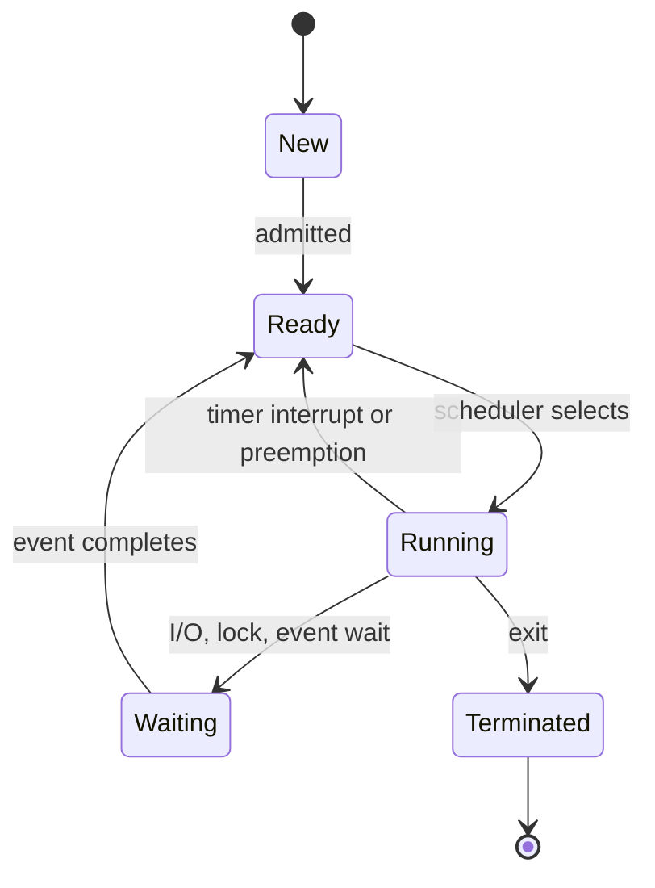
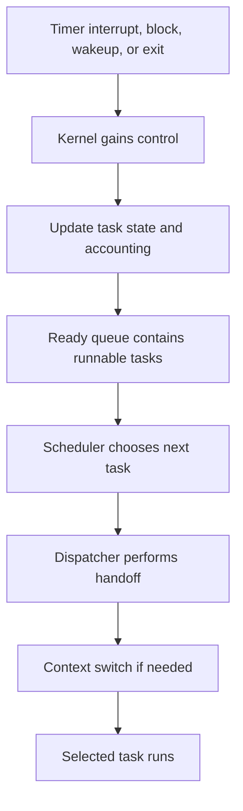
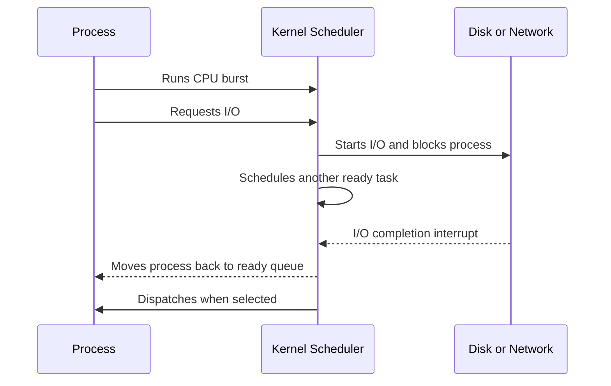

# Day 08 - Process Scheduling Basics

Difficulty: Intermediate  
Fresh Learning: 40 minutes  
Revision: 5 minutes  
Prerequisites: Days 06-07 - process states, ready queue, waiting queue, context switching, PCB  
Why this topic matters in interviews: Process scheduling is the vocabulary and decision layer behind almost every CPU management question. It explains why a system feels responsive, why CPU-bound and I/O-bound tasks behave differently, and why later scheduling algorithms optimize different goals.

Imagine your laptop is compiling code, syncing cloud files, playing music, rendering browser tabs, and waiting for keyboard input from you. The CPU cannot truly run every runnable activity at the same instant unless there are enough cores for all of them. Still, the system tries to make the editor respond quickly, the music avoid glitches, the compiler make progress, and the background sync stay out of the way.

That balancing act is process scheduling.

Day 7 explained the mechanical handoff: a context switch saves one execution context and restores another. Day 8 explains the decision that usually comes before that handoff: which ready process or thread should get the CPU next, and why?

Without scheduling, a single CPU-heavy program could dominate the processor. A user interface could freeze while a background calculation runs. A server could waste time keeping the CPU on a request that is waiting for disk or network data while many ready requests sit idle. Scheduling exists because the OS must share limited CPU time among competing tasks while balancing fairness, throughput, latency, responsiveness, and overhead.

## Interview Definition

Process scheduling is the operating system activity of selecting a ready process or thread to run on the CPU according to a scheduling policy.

The scheduler chooses what should run next from the ready queue, while the dispatcher gives CPU control to the selected task by performing the low-level handoff needed to resume it.

In an interview, say: scheduling decides which runnable task gets CPU time, using criteria such as CPU utilization, throughput, waiting time, turnaround time, response time, priority, and fairness.

## Mental Model

Think of the CPU as a busy service counter and the OS scheduler as the queue manager. Many people are waiting. Some only need a quick form stamped. Some need long processing. Some step away because they are waiting for a document. Some are urgent because they are holding up a customer-facing process.

The queue manager has to decide who gets the counter next. If one person occupies the counter for too long, everyone else waits. If the manager switches people every few seconds, the counter wastes time repeatedly collecting papers and resetting context. If urgent users never get priority, the office feels unresponsive. If short jobs are always preferred, long jobs may starve.

This model captures the main tension of scheduling. The OS is not only trying to keep the CPU busy. It is trying to keep the whole system useful. A desktop values responsiveness. A batch machine may value throughput. A real-time system may value deadlines. A server may value tail latency and fairness across clients. The scheduler is the policy that turns these goals into CPU allocation decisions.

## Layer 1: What happens at a high level?

At a high level, the OS keeps track of tasks that are ready to run. A task is ready when it has all the resources it currently needs except the CPU. It is not waiting for disk, network, keyboard input, a lock, a timer, or another event. The scheduler picks one ready task and allows it to run.

The CPU alternates between two broad kinds of work patterns: CPU bursts and I/O bursts. During a CPU burst, a process is actively using the processor to execute instructions. During an I/O burst, the process is waiting for something outside the CPU, such as disk data, network data, user input, or a device completion event.

Most interactive and server workloads are not one continuous CPU burst. They repeatedly compute for a short time, wait for I/O, compute again, wait again, and so on. This matters because the OS should not keep the CPU assigned to a process that is blocked on I/O. When a process blocks, the scheduler can pick another ready process and keep the CPU productive.

Scheduling is therefore closely connected to process states:

1. A new process becomes ready after creation.
2. A ready process is selected by the scheduler.
3. The dispatcher gives it the CPU, so it becomes running.
4. If it requests I/O, it moves to waiting.
5. If its time slice expires, it may move back to ready.
6. If it finishes, it moves to terminated.

The high-level goal is to use the CPU well while keeping user-visible behavior acceptable. A scheduler that maximizes raw CPU utilization but makes keyboard input lag is poor for a desktop. A scheduler that gives every task tiny time slices may look fair but waste too much time in context switches. A scheduler that always prefers high-priority work may starve low-priority work.

## Layer 2: What happens inside the OS?

Inside the OS, scheduling works through queues, metadata, timer interrupts, and scheduler policy.

The ready queue contains tasks that can run immediately if given a CPU. The waiting queues contain tasks blocked on specific events, such as disk I/O, network I/O, locks, timers, or child process completion. When an event completes, the OS wakes the waiting task and moves it back to the ready set. On a multicore machine, there may be per-CPU run queues, global balancing logic, CPU affinity rules, and load-balancing decisions.

Each schedulable task has metadata. Textbooks often describe this inside the Process Control Block. Real kernels may schedule threads or tasks rather than only whole processes, but the idea is the same: the OS stores priority, state, accounting data, CPU time consumed, wakeup information, and links into scheduling queues.

The scheduler is the policy component. It answers: among all ready tasks, which one should run next? A simple scheduler might pick the first ready task. A priority scheduler may pick the highest-priority task. A round-robin scheduler may rotate through ready tasks with a time quantum. Modern schedulers are more sophisticated, but they still solve the same basic problem.

The dispatcher is the execution handoff component. Once the scheduler has selected a task, the dispatcher performs the work needed to actually run it. This can involve context switching, switching to the selected task's address space, restoring registers, entering user mode, and jumping back to the correct instruction.

This distinction is a common interview trap:

| Term | Main job | Interview shortcut |
| --- | --- | --- |
| Scheduler | Chooses the next ready task | Decision maker |
| Dispatcher | Transfers CPU control to the chosen task | Handoff executor |
| Context switch | Saves old context and restores new context | Mechanical state swap |
| Ready queue | Holds runnable tasks waiting for CPU | CPU waiting line |
| Waiting queue | Holds blocked tasks waiting for events | Event waiting line |

The scheduler does not run randomly. It uses scheduling criteria. Common criteria include CPU utilization, throughput, turnaround time, waiting time, response time, fairness, priority, and deadline behavior. Different environments weight these differently. A phone UI cares about response time. A build server may care about throughput. A database may care about predictable latency and avoiding too many runnable worker threads.

## Layer 3: What happens at hardware or kernel level?

At the hardware and kernel level, scheduling depends heavily on interrupts and privileged control.

In a preemptive system, the OS programs a hardware timer. When the timer fires, the CPU enters kernel mode through an interrupt. The kernel interrupt handler updates accounting information: how long the current task has run, whether its time slice is exhausted, and whether a scheduling decision is needed. If the current task can keep running, the kernel returns to it. If not, the scheduler chooses another ready task and the dispatcher performs the context switch.

This is why timer interrupts are central to preemption. If a running process never blocks voluntarily, the OS still needs a way to regain control. The hardware timer gives the kernel periodic opportunities to intervene. Without it, a CPU-bound process could run indefinitely unless it made a system call, faulted, or ended.

Scheduling also interacts with memory management. If the selected task belongs to a different process, the kernel may need to switch address-space related state, such as page-table pointers. That can affect TLB locality. If the next task has different working data, cache locality may suffer. So scheduling policy is not only about choosing a fair order; it can affect low-level performance through caches, TLBs, CPU affinity, and multicore placement.

On multicore systems, scheduling becomes more complex. Each CPU core can run one hardware thread at a time, or more with simultaneous multithreading. The OS must decide not only which task should run, but where it should run. Moving a task between cores may balance load, but it can lose warm cache state. Keeping a task on the same core improves locality, but may leave another core overloaded. This is why modern schedulers consider CPU affinity and load balancing.

Kernel scheduling also has to protect critical sections. The kernel cannot switch at arbitrary unsafe points if internal data structures are inconsistent. It may disable preemption briefly, use locks, or defer scheduling until a safe point. This does not mean the system is non-preemptive overall; it means the kernel controls where preemption is safe.

## Layer 4: What can go wrong?

Scheduling mistakes are visible as poor system behavior.

If a scheduler favors long CPU-bound jobs too strongly, interactive tasks may feel frozen. The CPU is busy, but the user experience is bad. This is why desktop and mobile systems often give special treatment to foreground or interactive work.

If the scheduler switches too frequently, context switching overhead becomes significant. The CPU spends too much time saving and restoring state instead of doing useful application work. Very small time slices can improve apparent responsiveness but reduce throughput.

If priority is handled poorly, starvation can occur. A low-priority task may remain ready for a long time but never get selected because higher-priority tasks keep arriving. Aging is a common idea used to reduce starvation: the longer a task waits, the more its effective priority improves.

If the scheduler ignores I/O behavior, it may reduce overall system efficiency. I/O-bound tasks often need short CPU bursts to submit new I/O or process completed data. Running them promptly can keep devices busy and improve responsiveness. CPU-bound tasks can usually tolerate longer waits because they mainly need processor time.

If too many runnable threads exist, the system can become overloaded. More threads do not automatically mean more progress. They can increase context switches, cache misses, lock contention, memory pressure, and scheduler overhead. Servers and databases often use worker pools partly to control this problem.

## Step-by-Step Flow

Here is a practical flow for preemptive CPU scheduling:

1. A process or thread is running on the CPU.
2. A timer interrupt fires, an I/O event completes, a task blocks, or a higher-priority task becomes ready.
3. The CPU enters kernel mode.
4. The kernel updates accounting information for the current task.
5. If the current task blocked, it is moved to a waiting queue. If it was preempted, it usually returns to the ready queue.
6. Newly unblocked tasks are moved from waiting queues to the ready queue.
7. The scheduler examines ready tasks and applies its policy.
8. The scheduler selects the next task to run.
9. The dispatcher performs the handoff, including any required context switch.
10. The selected task resumes execution on the CPU.

For a blocking I/O case, the flow is slightly different:

1. A running process calls `read()` for data that is not ready.
2. The system call transfers control into the kernel.
3. The kernel starts or waits for the I/O operation.
4. The process cannot continue, so it is marked waiting.
5. The scheduler selects another ready process.
6. Later, the device interrupt signals I/O completion.
7. The waiting process becomes ready again.
8. The scheduler eventually selects it, and the dispatcher resumes it.

The key point: scheduling decisions happen at moments when the OS has control, such as interrupts, system calls, blocking events, wakeups, and process termination.

## Diagram Section

The first diagram connects process states to scheduling points.



This diagram shows that scheduling is mainly about the Ready to Running transition, but it is triggered by many other transitions. A task returns to the ready queue after preemption or wakeup, and the scheduler decides when it runs again.

The second diagram shows the scheduler and dispatcher as separate roles.



This diagram is useful for interviews because it prevents the common mistake of merging scheduler, dispatcher, and context switch into one vague idea.

The third diagram shows why CPU bursts and I/O bursts matter.



An I/O-bound process is not useless while waiting; it is simply not runnable. Good scheduling uses that wait time to run other ready work.

## Practical System Relevance

In Linux, scheduling is done by the kernel over schedulable tasks. A task can represent a process or a thread from the scheduler's perspective. The scheduler tracks runnable tasks, priorities, runtime, wakeups, CPU affinity, and fairness. Commands such as `ps`, `top`, and `htop` expose process states and CPU usage, but they show only a simplified view of a much richer kernel scheduling system.

In Windows, scheduling is thread-oriented. A process owns resources such as address space and handles, but threads are the execution units that compete for CPU time. This distinction is important: saying "the OS schedules processes" is acceptable in a textbook introduction, but in many real systems the runnable unit is a thread or task.

In Android, scheduling affects foreground responsiveness, background services, media playback, and battery life. A phone must keep the UI responsive while limiting background work and managing power. Scheduling is therefore tied to user experience and energy efficiency.

In browsers, scheduling appears at multiple levels. The OS schedules browser processes and threads, while the browser also schedules JavaScript tasks, rendering work, network callbacks, and background timers. A slow web page may involve both browser-level scheduling and OS-level CPU contention.

In servers, scheduling affects latency and throughput. A web server may use worker processes, worker threads, async event loops, or a hybrid model. Too many runnable workers can increase context switching and reduce cache locality. Too few workers can leave CPU cores idle or make requests wait.

In databases, scheduling interacts with locks, disk I/O, worker pools, and query execution. A database engine may have its own internal scheduling for queries and background tasks, but the OS still schedules the database threads on CPU cores.

In containers and cloud systems, containers do not have their own physical CPUs by magic. Containerized processes are still scheduled by the host kernel, often with CPU quotas, cgroups, shares, or limits influencing how much CPU they receive. If many containers compete for the same host CPU, scheduling decisions can affect application latency.

## Code or Pseudocode Section

The following pseudocode is not a real kernel implementation, but it captures the idea of scheduling a ready task.

```c
while (true) {
    current = running_task();

    if (current->state == BLOCKED || current->time_slice_used()) {
        if (current->state == RUNNING) {
            current->state = READY;
            ready_queue.push(current);
        }

        next = scheduler_pick_next(ready_queue);
        dispatch(next);
    }
}
```

The important idea is that the scheduler chooses from runnable work. A blocked task is not a candidate until the event it waits for completes.

On a Unix-like system, you can observe scheduling-related behavior with commands like these:

```bash
ps -eo pid,ppid,state,ni,pri,pcpu,comm
top
htop
vmstat 1
nice -n 10 ./cpu_heavy_program
renice 5 -p <pid>
```

`ps` can show state, priority, nice value, and CPU usage. `top` and `htop` show live CPU competition. `vmstat 1` can show runnable processes and context-switch activity. `nice` and `renice` influence priority, though the exact effect depends on the OS scheduler and permissions.

Here is a small CPU-bound example:

```c
int main(void) {
    volatile unsigned long long x = 0;
    while (1) {
        x++;
    }
}
```

If multiple copies run, they compete for CPU time. On a preemptive OS, one copy should not permanently freeze the others because timer interrupts let the scheduler rotate CPU access.

## Common Misconceptions

1. Misconception: Scheduling and context switching are the same thing.  
   Correction: Scheduling chooses the next task. Context switching performs the save-and-restore handoff when the chosen task differs from the current one.

2. Misconception: A process waiting for I/O should still be scheduled because it is active.  
   Correction: A waiting process exists, but it is blocked. It should not consume CPU until its awaited event completes.

3. Misconception: The best scheduler always maximizes CPU utilization.  
   Correction: CPU utilization matters, but responsiveness, waiting time, turnaround time, deadlines, fairness, and overhead also matter.

4. Misconception: Preemptive scheduling means the OS can interrupt safely at literally any machine instruction.  
   Correction: Hardware interrupts can occur asynchronously, but the kernel controls safe scheduling points and protects internal critical sections.

5. Misconception: More threads always improve scheduling.  
   Correction: Too many runnable threads can increase context switches, lock contention, cache misses, and memory pressure.

6. Misconception: I/O-bound tasks are less important because they use little CPU.  
   Correction: I/O-bound tasks often need quick CPU bursts to stay responsive and keep devices busy.

7. Misconception: Priority scheduling automatically solves responsiveness.  
   Correction: Priority can help, but poor priority handling can cause starvation or priority inversion.

## Tricky Interview Corners

The scheduler is not only choosing the "fastest" process. In many cases, it cannot know how long a CPU burst will be. Shortest-job scheduling is theoretically attractive, but future burst length is usually unknown in real systems. OS schedulers rely on policy, history, priority, interactivity signals, and approximations.

Preemption depends on interrupts. If an interviewer asks why a timer interrupt is needed, the answer is that the kernel needs a way to regain control from CPU-bound user code. Without preemption, a process that never blocks could monopolize the CPU.

A mode switch is not the same as a process switch. A system call moves from user mode to kernel mode, but the same process may continue running afterward. A context switch only happens if the OS changes the running task.

The dispatcher has latency. Dispatch latency is the time needed to stop one task and start another. It includes scheduler and context-switch related overhead. Real-time and interactive systems care deeply about this latency.

Fairness can conflict with performance. Strictly equal CPU sharing may hurt cache locality or fail to prioritize interactive work. Giving interactive tasks preference may improve perceived speed but can reduce raw throughput for background jobs.

CPU-bound and I/O-bound behavior affects policy. I/O-bound tasks often run briefly and block again, so scheduling them quickly can improve responsiveness and device utilization. CPU-bound tasks need long processor time and can often tolerate waiting longer.

Starvation can happen even when there is no deadlock. A task may be ready forever but repeatedly not selected because other tasks keep winning the scheduling decision. It is not blocked in a circular wait; it is simply not being chosen.

## Comparison Tables

| Concept | Meaning | Common trap |
| --- | --- | --- |
| CPU burst | Time spent executing on CPU | Not the whole lifetime of a process |
| I/O burst | Time spent waiting for I/O progress | The process is usually not using CPU |
| Scheduler | Selects the next ready task | Not the same as dispatcher |
| Dispatcher | Gives CPU control to selected task | Not the policy decision itself |
| Preemptive scheduling | OS can interrupt a running task | Needs timer or similar interrupt |
| Non-preemptive scheduling | Running task keeps CPU until block, yield, or exit | Can hurt responsiveness |

| Criterion | Better means | Why it matters |
| --- | --- | --- |
| CPU utilization | Higher CPU busy time | Avoids wasting processor capacity |
| Throughput | More jobs completed per time | Useful for batch and server work |
| Turnaround time | Lower submit-to-finish time | Measures total job completion delay |
| Waiting time | Lower time in ready queue | Measures CPU queue delay |
| Response time | Lower first-response delay | Critical for interactive systems |
| Fairness | No task ignored forever | Prevents starvation and bad sharing |

## How to Explain This in an Interview

### 30-second answer

Process scheduling is how the OS decides which ready process or thread should run on the CPU next. The scheduler chooses from the ready queue using policy goals like CPU utilization, throughput, waiting time, response time, fairness, and priority. The dispatcher then gives CPU control to the selected task, often through a context switch.

### 2-minute answer

When a process is ready, it has everything it needs except CPU time. Many ready tasks may compete for limited cores, so the OS scheduler decides which one runs next. This decision can happen when a process blocks for I/O, exits, wakes up, or is preempted by a timer interrupt. Scheduling is separate from context switching: scheduling is the decision, and context switching is the low-level save-and-restore operation used to move the CPU to a different task. Good scheduling balances throughput, responsiveness, fairness, and overhead. A desktop may prioritize fast response, while a batch system may prioritize completion rate.

### Deeper follow-up answer

At the kernel level, scheduling uses task metadata, ready queues, waiting queues, priorities, runtime accounting, and timer interrupts. Preemptive systems use hardware timers so the kernel can regain control from CPU-bound tasks. The dispatcher then resumes the chosen task, possibly changing register state, stack state, address-space state, and CPU mode. On multicore systems, the scheduler also considers load balancing and CPU affinity. Scheduling policy has tradeoffs: frequent preemption improves responsiveness but increases overhead, priority can improve urgent work but can cause starvation, and moving tasks between cores can balance load but hurt cache locality.

## Interview Questions

### Basic Questions

1. What is process scheduling?
2. What is the difference between a scheduler and a dispatcher?
3. What is a ready queue?
4. What is the difference between a CPU burst and an I/O burst?
5. What is preemptive scheduling?

### Intermediate Questions

6. Why does an OS need timer interrupts for preemptive scheduling?
7. How is scheduling related to context switching?
8. Why can too many runnable threads reduce performance?
9. What is dispatch latency?
10. Why are I/O-bound tasks often scheduled quickly in interactive systems?

### Advanced Questions

11. How can priority scheduling cause starvation?
12. Why might moving a task between CPU cores hurt performance?
13. Why is maximizing CPU utilization not always the best scheduling goal?
14. How do CPU-bound and I/O-bound workloads influence scheduler design?
15. In real systems, why is it hard to implement shortest-job-first scheduling perfectly?

## Follow-Up Questions

Q: What is process scheduling?  
Follow-ups:
- What data structure usually holds runnable tasks?
- Does the scheduler choose from waiting tasks?
- Is the scheduled unit always a whole process?

Q: What is the difference between scheduler and dispatcher?  
Follow-ups:
- Which one makes the policy decision?
- Which one performs the handoff?
- Where does context switching fit?

Q: What is preemptive scheduling?  
Follow-ups:
- Why is a timer interrupt needed?
- Can preemption happen while a process is CPU-bound?
- What is the downside of too much preemption?

Q: What is a CPU burst?  
Follow-ups:
- How is it different from an I/O burst?
- Why do burst patterns matter?
- Can the OS know future burst length exactly?

Q: Why is scheduling important for responsiveness?  
Follow-ups:
- What happens if a background job monopolizes CPU?
- Why do UI tasks often need low response time?
- How can scheduling hurt throughput while improving responsiveness?

Q: What is starvation?  
Follow-ups:
- Is starvation the same as deadlock?
- How can priority scheduling cause starvation?
- How can aging help?

Q: Why can too many threads hurt performance?  
Follow-ups:
- What happens to context switch overhead?
- How do caches and locks become involved?
- Why do servers use worker pools?

Q: What does dispatch latency mean?  
Follow-ups:
- Why does it matter in real-time systems?
- Is it only the time to save registers?
- How is it related to context switching?

## Trick Questions

1. Q: If a process is in the ready queue, is it currently using the CPU?  
   Expected answer: No. It is runnable but waiting for CPU time.

2. Q: If a process is waiting for disk I/O, should the CPU keep checking it by running that process?  
   Expected answer: No. The process is usually blocked, and an interrupt or event will make it ready when I/O completes.

3. Q: Does every system call cause a different process to be scheduled?  
   Expected answer: No. A system call causes a mode switch. A context switch happens only if the task blocks, exits, yields, or is preempted.

4. Q: Is the scheduler the code that saves and restores registers?  
   Expected answer: Not exactly. The scheduler chooses the next task; context-switch and dispatch code perform the low-level handoff.

5. Q: Is preemptive scheduling always better than non-preemptive scheduling?  
   Expected answer: No. Preemption improves responsiveness and control, but it adds overhead and complexity.

6. Q: If CPU utilization is 100 percent, is the system definitely performing well?  
   Expected answer: No. It may still have terrible response time, high waiting time, starvation, or lock contention.

7. Q: Can a low-priority process starve even though it is not blocked?  
   Expected answer: Yes. It can remain ready but repeatedly not selected.

## Practical Debugging / Observation

Use these commands on Linux or WSL to observe scheduling-adjacent behavior:

```bash
ps -eo pid,ppid,state,ni,pri,pcpu,comm --sort=-pcpu | head
top
htop
vmstat 1
pidstat 1
nice -n 10 ./cpu_task
renice 5 -p <pid>
```

What to observe:

- `state` shows whether a process is running, sleeping, stopped, or in another state.
- `%CPU` shows recent CPU consumption, not the entire scheduling history.
- `NI` is the nice value. Higher nice generally means the process is more willing to give CPU to others.
- `PRI` is priority, interpreted according to the OS.
- `vmstat 1` can show runnable processes and context switching activity over time.
- If many CPU-heavy tasks run at once, the system may remain busy while response time worsens.

On Windows, Task Manager and Resource Monitor expose CPU usage, process state, and priority class at a higher level. They are less kernel-specific than Linux tools, but they still show the same idea: many runnable activities compete for limited CPU resources.

When observing a real system, avoid a common mistake: seeing a process with low CPU usage does not mean it is unimportant. It may be I/O-bound, event-driven, sleeping most of the time, or waiting for user input. Interactive processes often need short bursts at the right time, not continuous CPU.

## Mini Quiz

### MCQs

1. The scheduler mainly chooses:
   A. Which file to open  
   B. Which ready task should run next  
   C. Which disk block to read  
   D. Which program to compile  

2. A process waiting for network input is usually:
   A. Running  
   B. Ready  
   C. Waiting or blocked  
   D. Terminated  

3. Preemptive scheduling usually depends on:
   A. Timer interrupts  
   B. File extensions  
   C. User passwords  
   D. Disk partitions  

4. Dispatch latency is closest to:
   A. Time to compile a program  
   B. Time to stop one task and start another selected task  
   C. Time to format a disk  
   D. Time to allocate a file name  

5. Starvation means:
   A. A process has finished  
   B. A ready task waits indefinitely because it is not selected  
   C. A process has no memory at all  
   D. The CPU has no clock  

### Short-answer questions

1. Explain scheduler vs dispatcher in two sentences.
2. Why are CPU burst and I/O burst patterns important?
3. Why can very small time slices reduce throughput?

### Reasoning questions

1. A music player glitches while a background compiler uses 100 percent CPU. Which scheduling goal is being hurt, and why?
2. A low-priority task is ready for a long time but never runs because high-priority tasks keep arriving. Is this deadlock or starvation? Explain.

### Answers

1. B
2. C
3. A
4. B
5. B

Short answers:

1. The scheduler chooses the next ready task according to policy. The dispatcher gives CPU control to that selected task, often by context switching.
2. Burst patterns help the OS balance CPU-bound and I/O-bound work. I/O-bound tasks often need quick short CPU bursts, while CPU-bound tasks need sustained processor time.
3. Very small time slices increase context switching and dispatcher overhead. The CPU spends more time switching and less time doing useful application work.

Reasoning:

1. Response time and interactive responsiveness are being hurt. The music player likely needs timely CPU bursts to refill buffers, but the CPU-heavy compiler is dominating processor time.
2. This is starvation, not deadlock. The task is ready and could run, but the scheduling policy repeatedly chooses other tasks.

# 5-Minute Revision Column

Revision Targets:
- Day 7: Context Switching (R1 - Recall Revision)
- Day 5: Program vs Process (R2 - Compression Revision)

## Day 7 - Context Switching

Core recall: A context switch is the OS operation of saving the execution context of one running process or thread and restoring the saved context of another. The saved context includes enough CPU state to resume correctly: program counter, registers, stack pointer, flags or processor status, and related scheduling or memory-management metadata. It connects directly to scheduling because the scheduler chooses the next task, while the context switch performs the state handoff.

Key definitions:
- Context: The CPU and execution state needed to pause and resume a task.
- PCB or TCB: Kernel-managed metadata that stores process or thread state.
- Preemption: Interrupting a running task so another task can run.

Core example: A timer interrupt fires while a CPU-heavy program is running. The kernel saves that program's registers and instruction position, places it back in the ready queue if needed, selects another task, restores that task's saved state, and resumes it.

Pitfalls:
- Context switch is not the same as scheduling. Scheduling is the decision; context switching is the handoff.
- A system call is not automatically a context switch. It is a mode switch unless the running task blocks, exits, yields, or gets preempted.
- Thread switches are often lighter than process switches, but not free.

Tricky questions:
1. Does a context switch copy the full memory of a process? No. It saves execution state and may switch address-space metadata, but it does not copy the entire address space.
2. If a task is preempted, is it blocked? No. A preempted task usually returns to ready state.

One-line final memory: Context switching is the costly save-and-restore mechanism that makes CPU sharing real.

## Day 5 - Program vs Process

Core recall:
- A program is a passive executable file on disk.
- A process is an active running instance with memory, state, resources, and OS metadata.
- One program can create many processes.
- Each process has its own address space and execution state.
- The PCB lets the OS track and resume the process.

Definitions:
- Program: Stored instructions and data that can be loaded and executed.
- Process: A program in execution, managed by the OS.

Example: Opening two instances of the same editor may use the same program file, but the OS creates separate processes with separate PIDs, stacks, heaps, open resources, and scheduling state.

Pitfalls:
- Program and process are not synonyms.
- PID is an identifier, not the whole PCB.

Tricky questions:
1. Does `exec()` create a new process? No. It replaces the current process image.
2. Is a process waiting for I/O still using CPU? Usually no. It is blocked until the event completes.

One-line final memory: A program is what can run; a process is what the OS is currently managing as an execution instance.

## Final Takeaway

Process scheduling is the OS decision layer that chooses which ready process or thread gets CPU time next. It exists because CPU time is limited and many tasks compete for it. Good scheduling balances CPU utilization, throughput, turnaround time, waiting time, response time, fairness, priority, and overhead. The scheduler chooses; the dispatcher hands off; context switching performs the low-level state swap when needed. Preemptive scheduling depends on interrupts so the kernel can regain control from CPU-bound tasks. The right scheduling policy depends on the system goal: desktop responsiveness, server throughput, real-time deadlines, or fair sharing.

## What You Should Be Able To Answer Now

- Define process scheduling in interview-friendly language.
- Explain scheduler vs dispatcher vs context switch.
- Distinguish CPU bursts from I/O bursts.
- Explain why preemptive scheduling needs timer interrupts.
- Compare preemptive and non-preemptive scheduling.
- Describe common scheduling criteria such as throughput, waiting time, turnaround time, and response time.
- Explain why too many runnable threads can hurt performance.
- Identify starvation and explain how it differs from deadlock.
