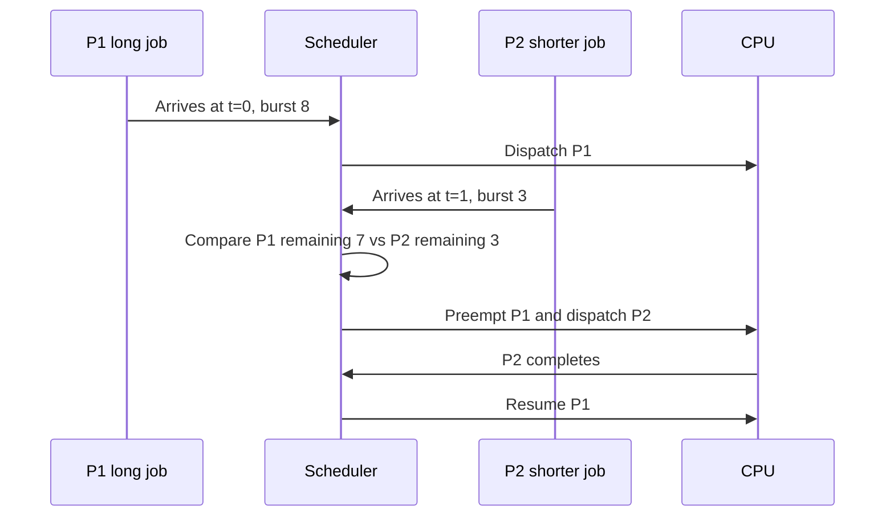

# Day 09 — Scheduling Algorithms Part 1

Difficulty: Intermediate  
Fresh Learning: 40 minutes  
Revision: 5 minutes  
Prerequisites: Process scheduling basics, ready queue, CPU burst, I/O burst, preemption  
Why this topic matters in interviews: Scheduling algorithms are a classic OS interview topic because they test whether you can reason about fairness, waiting time, turnaround time, starvation, and real system tradeoffs instead of memorizing names.

Imagine a small clinic with one doctor and many patients. Some patients need a two-minute prescription renewal. Some need a long examination. Some are urgent. Some arrived early but can safely wait. If the clinic always serves people strictly by arrival time, one very long case can delay everyone else. If it always serves quick cases first, a long case may wait forever. If it always serves urgent patients first, normal patients can starve. CPU scheduling algorithms solve the same problem for the operating system: many ready processes want CPU time, but only a limited number of CPU cores can run them at any instant.

On your laptop, this shows up when VS Code, Chrome, a terminal, a music player, and background updates all feel alive at once. The CPU is not truly running every task at the same moment on a single core. The OS repeatedly chooses which ready process or thread should run next. Day 8 explained the scheduler and dispatcher. Today focuses on the first family of scheduling policies: First-Come First-Served, Shortest Job First, Shortest Remaining Time First, and Priority Scheduling. These are simple enough to calculate by hand, but rich enough to expose most interview traps.

## Interview Definition

A CPU scheduling algorithm is the policy used by the operating system to choose the next ready process or thread for CPU execution. FCFS chooses by arrival order, SJF chooses the smallest next CPU burst, SRTF preempts when a shorter remaining burst appears, and priority scheduling chooses by assigned priority. The goal is to balance criteria such as waiting time, turnaround time, response time, throughput, fairness, and starvation avoidance.

## Mental Model

Think of the ready queue as a dispatch board in an operations room. Every process on the board is capable of running now. The scheduler is the person deciding which ticket should be handled next. Different algorithms represent different rules for choosing tickets:

- FCFS says: "Handle the oldest ticket first."
- SJF says: "Handle the ticket that will finish fastest."
- SRTF says: "If a faster unfinished ticket appears, switch to it."
- Priority scheduling says: "Handle the most important ticket first."

This model is useful because every rule has a cost. Oldest-first is fair by arrival time but can make short jobs wait behind a long job. Shortest-first improves average waiting time when burst estimates are accurate, but it can delay long jobs. Remaining-time-first improves responsiveness for short jobs, but adds preemption overhead. Priority scheduling reflects business or system importance, but can starve low-priority work unless the OS uses aging.

The scheduler is not trying to be "nice" in a human sense. It is optimizing system behavior under constraints. A desktop wants quick response to keyboard and mouse activity. A batch system wants high throughput. A server wants low tail latency and fairness across clients. A real-time system wants predictable deadlines. These goals lead to different scheduling policies.

## Layer 1: What happens at a high level?

At a high level, a scheduling algorithm receives a set of ready processes and chooses one to run. Each process has attributes that may affect the decision:

- Arrival time: when it entered the ready queue.
- CPU burst: how long it is expected to need the CPU before blocking or finishing.
- Remaining time: how much CPU time is still needed in the current burst.
- Priority: how important the process is compared with others.
- Waiting time: how long it has been ready but not running.

Consider four processes:

| Process | Arrival Time | CPU Burst | Priority |
|---|---:|---:|---:|
| P1 | 0 | 8 | 3 |
| P2 | 1 | 4 | 1 |
| P3 | 2 | 2 | 4 |
| P4 | 3 | 1 | 2 |

FCFS runs P1 first because it arrived first. SJF, if all jobs were available at time 0, would prefer P4, then P3, then P2, then P1. SRTF starts with P1 at time 0, but when shorter jobs arrive, it may preempt P1. Priority scheduling depends on the priority convention. In many textbook problems, a smaller priority number means higher priority, so P2 has the highest priority.

The important interview idea is that the algorithm changes the order of execution, and that order changes waiting time, turnaround time, and response time.

Definitions you should speak clearly:

- Completion time: when the process finishes.
- Turnaround time: completion time minus arrival time.
- Waiting time: turnaround time minus CPU burst time.
- Response time: first time the process gets CPU minus arrival time.

If you only memorize algorithm names, interviews become fragile. If you track these four metrics, you can reason through most scheduling numericals.

## Layer 2: What happens inside the OS?

Inside the OS, the scheduler does not work with textbook tables. It works with kernel data structures representing tasks. Each runnable process or thread has scheduling metadata: state, priority, CPU accounting, last run time, estimated behavior, and links into scheduling queues. The exact structure differs by OS, but the core idea is stable: the kernel must quickly find a runnable task that best matches the active policy.

For simple textbook algorithms:

- FCFS can be implemented with a FIFO ready queue.
- SJF needs a way to compare estimated burst lengths.
- SRTF needs preemption and comparison of remaining time.
- Priority scheduling can use priority queues or multiple ready queues.

In a real OS, pure SJF is hard because the OS usually does not know the future CPU burst exactly. It can estimate using past behavior. A common idea is exponential averaging:

```txt
next_estimate = alpha * last_actual_burst + (1 - alpha) * old_estimate
```

If `alpha` is high, the estimate reacts strongly to the most recent burst. If `alpha` is low, it changes slowly and smooths noise. This is not magic prediction. It is a practical approximation based on recent behavior.

Priority is also not always one fixed number. A system may combine static priority with dynamic adjustments. Interactive tasks may receive temporary boosts because they often sleep waiting for input and then need quick CPU service. CPU-heavy background tasks may receive lower effective priority over time. This is why real schedulers are more complex than FCFS or SJF, but textbook algorithms still matter: they teach the tradeoffs that real schedulers combine.

## Layer 3: What happens at hardware or kernel level?

Scheduling decisions become real only when the kernel can stop one execution stream and start another. That requires hardware support:

- Timer interrupts let the OS regain control after a time interval.
- Privileged mode protects scheduler data structures from user programs.
- Context switching saves the old task's CPU state and restores the new task's state.
- Memory management structures may need updates when switching between processes.

FCFS and non-preemptive SJF can wait until the running process blocks, exits, or voluntarily yields. SRTF requires preemption. If a short process arrives while a longer one is running, the kernel must be able to interrupt the current process and run the shorter one. That is why preemptive scheduling depends on timer interrupts and safe kernel entry points.

The hardware does not "know" FCFS or SJF. The hardware provides mechanisms: interrupts, privilege modes, registers, page tables, and timers. The OS implements policy: which task should run next. A strong interview answer separates mechanism from policy:

- Mechanism: how the OS can switch CPU control.
- Policy: which task the OS chooses and why.

## Layer 4: What can go wrong?

Scheduling algorithms can fail system goals even when implemented correctly.

FCFS can suffer the convoy effect. One long CPU-bound process runs first, while many short or I/O-bound processes wait behind it. The CPU may be busy, but interactive responsiveness becomes bad. When the long process finally blocks, many short tasks run quickly, then the pattern repeats.

SJF can minimize average waiting time under ideal assumptions, but it needs burst predictions. If long jobs keep getting delayed by newly arriving short jobs, starvation can occur.

SRTF gives excellent response to short jobs, but it can preempt often. Too much preemption increases context switching overhead and can hurt cache locality. It also depends on knowing or estimating remaining time.

Priority scheduling is practical because not all tasks are equally important. But if high-priority tasks keep arriving, low-priority tasks may wait indefinitely. Aging solves this by gradually increasing the effective priority of waiting tasks.

The central tradeoff is not "which algorithm is best." It is "best for what workload and what goal?"

## Step-by-Step Flow

Here is a practical flow for a scheduling decision:

1. A process becomes ready because it was created, finished I/O, or was preempted.
2. The kernel places it in the ready queue or an equivalent runnable data structure.
3. A scheduling event occurs: timer interrupt, process exit, blocking I/O call, yield, or arrival of a higher-priority task.
4. The scheduler examines runnable tasks according to the active policy.
5. FCFS checks arrival order.
6. SJF checks estimated next CPU burst length.
7. SRTF checks current remaining burst time and may preempt.
8. Priority scheduling checks priority and possibly aging-adjusted priority.
9. The scheduler selects the next task.
10. The dispatcher performs the low-level handoff, possibly through a context switch.
11. The selected task runs until it blocks, exits, is preempted, or loses priority.
12. The OS updates accounting data such as runtime, wait time, and scheduling statistics.

## Diagram Section

### FCFS and Convoy Effect

```mermaid
gantt
    title FCFS: one long job delays short jobs
    dateFormat X
    axisFormat %s
    section CPU
    P1 long burst :0, 8
    P2 short burst :8, 2
    P3 short burst :10, 2
    P4 short burst :12, 1
```



In FCFS, short processes can wait behind a long process even when they would finish quickly. This is the convoy effect: one large CPU burst can drag a group of smaller tasks behind it.

### SRTF Preemption Timeline



SRTF is the preemptive version of SJF. When a process with shorter remaining time arrives, the scheduler may stop the current process and run the shorter one.

### Algorithm Comparison Snapshot

| Algorithm | Preemptive? | Strength | Main Risk |
|---|---|---|---|
| FCFS | No | Simple and arrival-fair | Convoy effect |
| SJF | Usually no | Low average waiting time under ideal knowledge | Starvation of long jobs |
| SRTF | Yes | Strong response for short jobs | More context switches |
| Priority | Either | Models importance and urgency | Starvation of low-priority jobs |
| Aging | Adjustment technique | Reduces starvation | Adds policy complexity |

The table is the interview map. Most questions are asking you to explain one row and compare it with another.

## Practical System Relevance

- Linux does not use pure FCFS, SJF, or SRTF as its modern general-purpose scheduler, but these algorithms explain the tradeoffs behind fairness, latency, and CPU accounting.
- Windows also uses priority-based scheduling ideas with dynamic priority adjustments, especially to keep interactive workloads responsive.
- Android inherits Linux scheduling foundations, but mobile systems care heavily about foreground responsiveness, battery usage, and background task control.
- Web servers use scheduling concepts when deciding how worker threads, event loops, and request queues share CPU time.
- Databases care about scheduling because query workers, background vacuuming, checkpointing, and I/O threads compete for CPU and disk.
- Cloud systems apply similar ideas above the OS level when scheduling containers or VMs across hosts.
- Containers do not contain their own physical CPU; the host kernel scheduler still decides when containerized processes run.
- Browsers use multiple processes and threads, so scheduling affects tab responsiveness, rendering, JavaScript execution, and background throttling.

Practical examples:

```bash
ps -eo pid,ppid,stat,ni,pri,pcpu,comm
```

This shows process state, nice value, priority, CPU percentage, and command name on Linux-like systems. It helps connect scheduling theory to visible process metadata.

```bash
top
```

Watch CPU-heavy processes and sleeping processes. A process can exist without using CPU. That fact connects Day 6 process states with today&apos;s scheduling policies.

```bash
nice -n 10 ./cpu_task
renice -n 5 -p <pid>
```

These commands change user-visible priority hints on Unix-like systems. They do not directly implement textbook priority scheduling, but they demonstrate that OS scheduling can consider priority-like inputs.

## Code or Pseudocode Section

### FCFS Pseudocode

```c
while (!ready_queue.empty()) {
    process p = ready_queue.pop_front();
    run_until_block_or_exit(p);
}
```

FCFS is simple because it only needs queue order. Its weakness is also simple: it does not care whether the next job is tiny or huge.

### Non-preemptive SJF Pseudocode

```c
while (!ready_set.empty()) {
    process p = find_process_with_smallest_estimated_burst(ready_set);
    run_until_block_or_exit(p);
}
```

SJF needs a burst estimate. In real systems, that estimate comes from history or workload hints, not from perfect future knowledge.

### SRTF Pseudocode

```c
on_scheduling_event() {
    process current = running_process();
    process best = process_with_shortest_remaining_time(ready_set + current);

    if (best != current) {
        preempt(current);
        dispatch(best);
    }
}
```

SRTF is preemptive. It can react when a shorter job arrives, but every preemption has overhead.

### Aging Pseudocode

```c
for each process p in ready_queue:
    if (p.wait_time > threshold) {
        improve_priority(p);
    }
```

Aging is not a separate scheduling algorithm in the same way FCFS is. It is a starvation-prevention technique often combined with priority scheduling.

## Common Misconceptions

- Misconception: FCFS is always fair. Correction: It is fair by arrival order, but it can be unfair to short jobs and interactive tasks.
- Misconception: SJF is always practical because it is mathematically good. Correction: It requires knowing or estimating CPU bursts, which is difficult in real systems.
- Misconception: SRTF always improves performance. Correction: It can reduce waiting time for short jobs, but frequent preemption increases overhead.
- Misconception: Priority scheduling means high-priority tasks are always more important forever. Correction: Dynamic priority and aging can change effective priority.
- Misconception: Starvation and deadlock are the same. Correction: Starvation means a task waits indefinitely because scheduling keeps favoring others; deadlock means tasks are stuck waiting on each other&apos;s resources.
- Misconception: A lower priority number always means lower importance. Correction: Priority conventions vary. Textbook problems often say smaller number means higher priority, but you must check the question.
- Misconception: The scheduler saves registers itself. Correction: The scheduler chooses the next task; the dispatcher and context switch mechanism perform the low-level CPU handoff.
- Misconception: The best algorithm is the one with the lowest average waiting time. Correction: Real systems also care about response time, deadlines, fairness, throughput, and overhead.

## Tricky Interview Corners

### Convoy effect

The convoy effect happens when a long CPU-bound job delays many short or I/O-bound jobs behind it, especially under FCFS. It is a responsiveness problem, not just a mathematical waiting-time problem.

### Burst time prediction

SJF and SRTF look powerful in textbook problems because burst times are provided. In real systems, the OS usually estimates future CPU bursts from past behavior. This is why pure SJF is rare in general-purpose OS scheduling.

### Starvation without deadlock

A low-priority process can starve even when the system is making progress. Other processes keep running, resources are not necessarily cyclically locked, and the CPU is active. The victim simply keeps losing scheduling decisions.

### Aging

Aging gradually improves the priority of a process the longer it waits. It is the standard fix for starvation in priority scheduling. A good answer says aging changes effective priority over time, not that it randomly gives everyone equal priority.

### Preemption cost

Preemption helps responsiveness but is not free. It can require saving/restoring registers, disrupting cache locality, and possibly affecting TLB or memory-management state depending on the switch.

### Priority inversion preview

Priority inversion happens when a high-priority task is blocked because a lower-priority task holds a resource it needs. This belongs more deeply to synchronization, but priority scheduling makes it visible.

## Comparison Tables

### FCFS vs SJF vs SRTF vs Priority

| Feature | FCFS | SJF | SRTF | Priority |
|---|---|---|---|---|
| Decision basis | Arrival order | Shortest next burst | Shortest remaining time | Priority value |
| Preemption | No | Usually no | Yes | Either |
| Needs burst estimate | No | Yes | Yes | No, unless combined |
| Good for | Simplicity | Average waiting time | Short-job responsiveness | Importance-based service |
| Main trap | Convoy effect | Unrealistic future knowledge | Too many switches | Starvation |

### Waiting Time vs Turnaround Time vs Response Time

| Metric | Meaning | Interview trap |
|---|---|---|
| Waiting time | Time spent in ready queue | Does not include running time |
| Turnaround time | Completion time minus arrival time | Includes waiting and running |
| Response time | First CPU start minus arrival time | Not the same as completion time |

## How to Explain This in an Interview

### 30-second answer

Scheduling algorithms decide which ready process gets the CPU next. FCFS runs by arrival order, SJF chooses the shortest CPU burst, SRTF preempts if a process with shorter remaining time appears, and priority scheduling chooses by priority. The tradeoffs are waiting time, response time, throughput, fairness, overhead, and starvation.

### 2-minute answer

CPU scheduling is needed because many processes may be ready while only limited CPU cores are available. FCFS is simple but can cause the convoy effect when short jobs wait behind a long one. SJF can minimize average waiting time if CPU bursts are known, but that knowledge is unrealistic, so systems estimate. SRTF is the preemptive version of SJF and improves short-job response, but it can increase context-switch overhead. Priority scheduling supports importance-based decisions, but low-priority tasks may starve. Aging fixes starvation by gradually improving the priority of tasks that wait too long.

### Deeper follow-up answer

The key distinction is policy versus mechanism. The scheduling algorithm is policy: it decides which runnable task should execute. The dispatcher and context switch are mechanisms: they transfer CPU control to the selected task. Real operating systems combine ideas from these textbook algorithms with dynamic priority, fairness, CPU accounting, interactivity boosts, and multiprocessor concerns. In interviews, I would also mention that metrics can conflict: the algorithm that lowers average waiting time may hurt fairness, and the algorithm that improves responsiveness may add overhead.

## Interview Questions

### Basic Questions

1. What is a CPU scheduling algorithm?
2. What is First-Come First-Served scheduling?
3. What is Shortest Job First scheduling?
4. What is Shortest Remaining Time First scheduling?
5. What is priority scheduling?

### Intermediate Questions

6. Why can FCFS cause the convoy effect?
7. Why is SJF difficult to implement exactly in real operating systems?
8. How is SRTF different from SJF?
9. What is starvation in scheduling?
10. How does aging reduce starvation?

### Advanced Questions

11. Why can preemptive scheduling improve response time but hurt throughput?
12. How do waiting time, turnaround time, and response time differ?
13. Why is priority scheduling useful in real systems?
14. Can starvation happen without deadlock?
15. Why do real OS schedulers not simply use one textbook algorithm?

## Follow-Up Questions

Q: What is FCFS scheduling?  
Follow-ups:
- Why is it simple to implement?
- What is the convoy effect?
- Is FCFS preemptive?
- When might FCFS be acceptable?

Q: What is SJF scheduling?  
Follow-ups:
- Why does it reduce average waiting time?
- What assumption makes textbook SJF unrealistic?
- How can burst time be estimated?
- Can SJF cause starvation?

Q: What is SRTF scheduling?  
Follow-ups:
- When does preemption occur?
- How is it related to SJF?
- Why can it cause more context switches?
- What happens if short jobs keep arriving?

Q: What is priority scheduling?  
Follow-ups:
- What does priority represent?
- Can priority scheduling be preemptive?
- How can low-priority tasks starve?
- How does aging help?

Q: What is starvation?  
Follow-ups:
- How is it different from deadlock?
- Which algorithms can suffer from it?
- Can a system be busy while a task starves?
- What practical mechanisms reduce starvation?

Q: What metrics do scheduling algorithms optimize?  
Follow-ups:
- What is waiting time?
- What is turnaround time?
- What is response time?
- Why can optimizing one metric hurt another?

## Trick Questions

1. Q: If FCFS is fair, can it still give bad performance?  
   Expected answer: Yes. It is fair by arrival order, but a long job can create the convoy effect and make short jobs wait.

2. Q: Does SJF require the OS to know the future perfectly?  
   Expected answer: Textbook SJF assumes known bursts, but real systems can only estimate future CPU bursts.

3. Q: If a task has low priority, is it guaranteed never to run?  
   Expected answer: No. It may run when higher-priority work is absent, and aging can raise its effective priority.

4. Q: Is SRTF just SJF with a different name?  
   Expected answer: No. SRTF is the preemptive form. It can interrupt the running task when a shorter remaining task appears.

5. Q: Is starvation the same as deadlock?  
   Expected answer: No. In starvation, the system can keep making progress while one task is repeatedly denied service.

6. Q: If a process has the highest priority, does it always finish first?  
   Expected answer: Not necessarily. It may block for I/O, wait for locks, or be affected by policy details.

7. Q: Is lower numeric priority always higher importance?  
   Expected answer: Not always. The convention depends on the system or problem statement.

## Practical Debugging / Observation

Use these commands on a Linux-like system to observe scheduler-related behavior:

```bash
ps -eo pid,stat,pri,ni,pcpu,comm --sort=-pcpu | head
```

Observe which processes are consuming CPU and which are sleeping. `STAT` connects to process states, while `PRI` and `NI` connect to priority-like scheduling inputs.

```bash
top
```

Sort by CPU usage. A CPU-bound process tends to stay near the top. Interactive or I/O-bound processes may wake briefly and then sleep again.

```bash
nice -n 10 yes > /dev/null
renice -n 15 -p <pid>
```

This demonstrates that user-level priority hints can influence CPU allocation. Be careful: nice values are not the same as textbook priority numbers, and the actual scheduler uses more data.

```bash
vmstat 1
```

Watch runnable processes, blocked processes, CPU idle time, and context switch counts. This helps connect scheduling decisions with whole-system behavior.

## Mini Quiz

### MCQs

1. Which algorithm runs processes by arrival order?  
   A. SJF  
   B. FCFS  
   C. SRTF  
   D. Aging

2. Which algorithm is the preemptive version of SJF?  
   A. FCFS  
   B. Round Robin  
   C. SRTF  
   D. Priority without aging

3. What problem does aging mainly solve?  
   A. Page fault handling  
   B. CPU overheating  
   C. Starvation  
   D. Disk fragmentation

4. Which metric measures first CPU access after arrival?  
   A. Response time  
   B. Completion time  
   C. Turnaround time  
   D. Burst time

5. What is the convoy effect most associated with?  
   A. FCFS  
   B. SRTF  
   C. DMA  
   D. Paging

### Short-answer questions

1. Why is pure SJF hard to implement in a real OS?
2. What is the difference between waiting time and turnaround time?
3. How can priority scheduling cause starvation?

### Reasoning questions

1. A long CPU-bound process arrives before five short interactive processes. Which algorithm handles this badly and why?
2. A low-priority background task has been waiting for a very long time. What technique can make the scheduler eventually run it?

### Answers

1. B  
2. C  
3. C  
4. A  
5. A  
Short answer 1: The OS does not know future CPU bursts exactly, so it must estimate from history.  
Short answer 2: Waiting time is time in the ready queue; turnaround time is total time from arrival to completion.  
Short answer 3: High-priority tasks can keep arriving and repeatedly prevent low-priority tasks from running.  
Reasoning 1: FCFS handles it badly because short jobs wait behind the long first job, creating the convoy effect.  
Reasoning 2: Aging gradually improves the task&apos;s effective priority as it waits.

# 5-Minute Revision Column

Revision Targets:
- Day 8: Process Scheduling Basics, R1 Recall Revision
- Day 6: Process States and Lifecycle, R2 Compression Revision

## Day 8 — Process Scheduling Basics

Core Recall:
Process scheduling is the OS activity of selecting which ready process or thread should run on the CPU next. The scheduler chooses from the ready queue using policy goals such as CPU utilization, throughput, waiting time, turnaround time, response time, priority, and fairness. The dispatcher performs the low-level handoff after the scheduler has made the choice.

Key Definitions:
- Scheduler: kernel component or logic that chooses the next runnable task.
- Dispatcher: mechanism that gives CPU control to the selected task.
- Ready queue: set of tasks that can run but are waiting for CPU time.

Core Example:
If Chrome, VS Code, and a terminal are all runnable, the scheduler decides which gets CPU time next. If one task blocks for disk or network I/O, it should leave the CPU so another ready task can run.

Pitfalls:
- Scheduling is not the same as context switching. Scheduling is the decision; context switching is part of the handoff.
- CPU utilization is not the only goal. Responsiveness and fairness can matter more for interactive systems.

Tricky Questions:
1. If a process is in the ready queue, is it currently using the CPU?
2. Can a scheduler improve responsiveness while increasing context-switch overhead?

One-Line Final Memory:
Scheduling is the policy decision that chooses the next ready task; dispatching and context switching make that choice execute.

## Day 6 — Process States and Lifecycle

Core Recall:
- A process state describes whether a process is new, ready, running, waiting, or terminated.
- Ready means the process can run but is waiting for CPU selection.
- Waiting or blocked means the process cannot run until an event, usually I/O, completes.
- Running means the process currently has CPU control.
- State transitions are driven by creation, dispatch, preemption, blocking, wakeup, and exit.

Key Definitions:
- Ready: able to run, not currently on CPU.
- Waiting: blocked until an event occurs.

Example:
A process reading from disk should move to waiting instead of occupying the CPU. When disk I/O completes, it returns to ready, not directly to running unless the scheduler selects it.

Pitfalls:
- A live process is not necessarily using CPU.
- A waiting process usually should not be scheduled.

Tricky Questions:
1. Can a process move from waiting directly to running?
2. If `top` shows 0 percent CPU, is the process necessarily terminated?

One-Line Final Memory:
Process states tell the scheduler whether a process can make progress now, must wait for an event, or is already finished.

## Final Takeaway

Scheduling algorithms are policies for deciding which ready task gets the CPU. FCFS is simple but can cause the convoy effect. SJF lowers average waiting time under ideal burst knowledge but can starve long jobs. SRTF adds preemption and improves short-job response, but it increases switching overhead. Priority scheduling expresses importance, but it needs aging or related techniques to avoid starving low-priority work. The interview goal is not to declare one winner. The goal is to explain each algorithm's decision rule, metric impact, and failure mode.

## What You Should Be Able To Answer Now

- Explain FCFS, SJF, SRTF, and priority scheduling in clear interview language.
- Describe the convoy effect and why FCFS can suffer from it.
- Explain why SJF is hard to implement exactly in real systems.
- Compare non-preemptive SJF with preemptive SRTF.
- Define waiting time, turnaround time, response time, and completion time.
- Explain starvation and how aging reduces it.
- Separate scheduling policy from dispatching and context-switch mechanism.
- Reason through simple scheduling timelines and tradeoffs.
