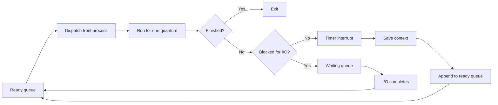
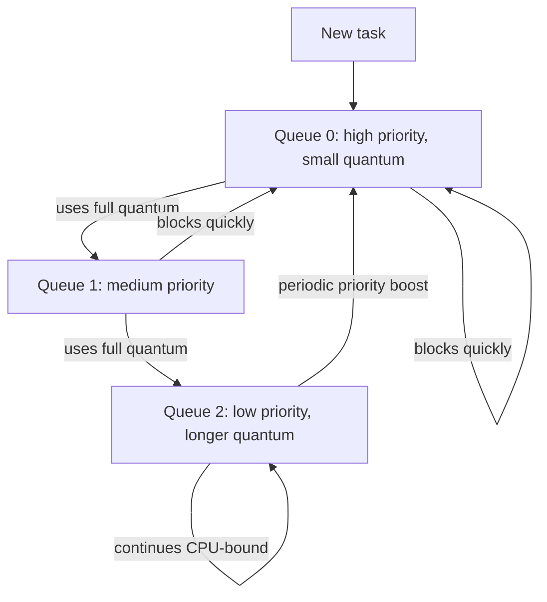

# Day 10 - Scheduling Algorithms Part 2

Difficulty: Intermediate  
Fresh Learning: 40 minutes  
Revision: 5 minutes  
Prerequisites: Day 09, CPU bursts, ready queue, preemption, context switching, FCFS, SJF, SRTF, priority scheduling  
Why this topic matters in interviews: Round Robin and Multilevel Feedback Queue are common interview topics because they test whether you can reason about responsiveness, fairness, time quantum, context-switch overhead, starvation, and scheduling metrics instead of only naming algorithms.

Imagine a busy customer support desk with one agent and a long queue of users. If one user has a very complex issue and the agent spends an hour with that user, everyone else waits. A better rule might be: give each user five minutes, then move them to the back if they still need help. Short requests finish quickly, long requests still make progress, and no one can monopolize the desk forever. That is the intuition behind Round Robin scheduling.

Now imagine the support desk also separates requests into categories. Payment failures go to a fast-response queue. Regular account questions go to a normal queue. Long research-heavy complaints go to a slower queue. A request may start in the fast queue, but if it keeps using time without finishing, it may be moved downward. If it waits too long, it may be boosted upward. That is the intuition behind multilevel queue and multilevel feedback queue scheduling.

Day 9 explained FCFS, SJF, SRTF, priority scheduling, starvation, and aging. Those algorithms are important because they expose the basic tradeoffs. Today adds the algorithms that make the scheduling story feel closer to practical systems: Round Robin for time sharing, Multilevel Queue for separated workload classes, and MLFQ for adaptive scheduling. These ideas explain why interactive apps stay responsive, why a time quantum is not a random number, and why modern schedulers avoid naive textbook policies.

## Interview Definition

Round Robin is a preemptive time-sharing scheduling algorithm where each ready process gets a fixed time quantum; if it does not finish within that quantum, it is preempted and placed back into the ready queue. Multilevel Queue scheduling separates processes into fixed queues, often by workload type or priority, and schedules among those queues using a policy such as fixed priority or time sharing. Multilevel Feedback Queue scheduling improves this by allowing processes to move between queues based on behavior, rewarding interactive or I/O-bound tasks and demoting CPU-bound tasks.

## Mental Model

Think of the CPU as a shared meeting room.

Round Robin is a strict meeting timer. Each person gets, say, 10 minutes. If the person finishes early, the room goes to the next person immediately. If not, the timer rings, their notes are saved, and they return to the end of the line. This prevents one person from occupying the room all day.

Multilevel Queue is a building with separate lines: emergency line, regular appointment line, and long-consultation line. People do not freely jump between lines. The building may always serve emergency first, or it may split time across lines.

Multilevel Feedback Queue is a smarter building manager. New people often begin in the fast line. If someone keeps needing more time, the manager moves them to a slower line. If someone has waited too long, the manager may boost them upward. This creates a practical compromise: short interactive tasks get quick service, long CPU-heavy tasks still run, and starvation is controlled.

The mental model matters because scheduling is never only about average performance. A desktop user cares about first response. A server cares about tail latency and throughput. A batch job cares about completion. A fair scheduler must balance all of these without spending too much CPU time on scheduling itself.

## Layer 1: What happens at a high level?

At a high level, Round Robin adds a timer to scheduling. The ready queue is usually treated like a FIFO queue, but the running process is not allowed to hold the CPU forever. It receives at most one quantum. When the quantum expires, the OS preempts it, saves its context, and appends it to the back of the ready queue if it is still runnable.

This is different from FCFS. FCFS lets the process run until it blocks or completes. Round Robin says: "Run for a bounded slice, then give others a chance." This is why Round Robin is associated with time-sharing systems.

The time quantum is the key parameter.

- If the quantum is very large, Round Robin behaves almost like FCFS.
- If the quantum is very small, the system switches often and wastes time on context-switch overhead.
- If the quantum is balanced, users get good response time without excessive overhead.

Consider three ready processes arriving at time 0:

| Process | CPU Burst |
|---|---:|
| P1 | 8 |
| P2 | 4 |
| P3 | 5 |

With Round Robin and quantum = 3, execution may look like this:

```txt
0     3     6     9    12    13    15    17
| P1  | P2  | P3  | P1 | P2 | P3 | P1 |
```

P2 finishes after its second turn. P3 finishes after its second turn. P1, the longest process, finishes last, but it did not block everyone else from getting CPU service.

Multilevel Queue scheduling adds another idea: not all ready tasks belong to the same queue. The OS may separate system tasks, foreground interactive tasks, background jobs, and batch tasks. Each queue can have its own scheduling policy. For example:

- Foreground queue: Round Robin with small quantum.
- Background queue: FCFS or longer quantum.
- System queue: higher priority.

Multilevel Feedback Queue then makes this dynamic. If a task uses its entire quantum repeatedly, it likely behaves like a CPU-bound task and may be moved to a lower-priority queue. If a task blocks quickly for I/O, it likely behaves like an interactive or I/O-bound task and can stay in a higher-priority queue. This approximates SJF behavior without needing to know the future.

## Layer 2: What happens inside the OS?

Inside the OS, scheduling is implemented using kernel data structures for runnable tasks. A task has a state, priority or scheduling class, CPU accounting data, and links into ready queues. Round Robin needs at least:

- A ready queue of runnable tasks.
- A timer interrupt or similar preemption mechanism.
- A remaining quantum counter for the running task.
- Context-switch machinery to save and restore execution state.

The sequence is conceptually simple. The scheduler chooses the front task from the ready queue. The dispatcher loads its context. A timer is programmed. The task runs until it finishes, blocks for I/O, yields, or exhausts its quantum. If the quantum expires and the task is still runnable, it is placed at the back of the ready queue.

In a multilevel queue system, the scheduler may maintain several ready queues. The top-level decision is: which queue should be served? Then the queue's internal policy decides which task inside that queue runs. For example, the OS might first check high-priority interactive tasks. If that queue is empty, it checks normal tasks. If that is empty, it checks background work. Another design may allocate fixed CPU percentages, such as 70 percent to foreground and 30 percent to background.

MLFQ requires more bookkeeping. The OS tracks how a task behaves over time:

- Did it use the entire quantum?
- Did it block quickly for I/O?
- How long has it waited?
- How much CPU has it consumed recently?
- Should it be promoted, demoted, or boosted?

The exact rules differ across systems, but the interview idea is stable: MLFQ adapts priority based on observed behavior. It tries to give short or interactive jobs quick response while still allowing long jobs to complete.

This is also where scheduling metrics become practical:

- Completion time: when the process finishes.
- Turnaround time: completion time - arrival time.
- Waiting time: turnaround time - total CPU burst.
- Response time: first run time - arrival time.

Round Robin often improves response time compared with FCFS because each process tends to get a first turn quickly. It may increase average turnaround time for some workloads because preemption and repeated queue cycling add overhead and can delay completion of long jobs.

## Layer 3: What happens at hardware or kernel level?

Preemptive scheduling depends on interrupts. The CPU does not voluntarily stop a running user program after exactly one quantum unless something interrupts it. A hardware timer generates an interrupt. The processor switches into kernel mode and jumps to the kernel's interrupt handler. The kernel updates accounting information, checks whether the current task's quantum has expired, and may invoke the scheduler.

If the scheduler chooses another task, the kernel performs a context switch. It saves enough execution state for the old task to resume later: program counter, registers, stack pointer, processor status, and scheduler-related metadata. It then restores the next task's saved state and returns from the interrupt path into that task's execution context.

This hardware-level detail explains why the time quantum has a lower bound in practice. A quantum that is too tiny causes a storm of timer interrupts and context switches. During a context switch, the CPU is doing kernel bookkeeping rather than useful user-level work. Caches may also suffer because the new task may touch different memory. If the process address space changes, TLB state may also be affected depending on the architecture and OS optimizations.

For Round Robin, the timer interrupt is the enforcement tool. Without timer interrupts, a CPU-bound process could simply keep running and ignore fairness. This is why preemption is one of the major differences between old cooperative designs and modern general-purpose systems.

For MLFQ, hardware does not directly understand "interactive" or "batch" jobs. The kernel infers behavior from events: blocking, waking, CPU usage, wait duration, and priority rules. A task that repeatedly gives up the CPU early because it waits for keyboard, network, or disk events may be treated differently from a task that consumes complete quanta doing CPU computation.

## Layer 4: What can go wrong?

The first problem is choosing a bad quantum. If the quantum is too large, interactive tasks may wait too long for a response. The algorithm becomes close to FCFS, and the convoy effect can reappear. If the quantum is too small, the OS spends too much time switching contexts. Response may look good superficially, but throughput can drop.

The second problem is starvation. In fixed-priority multilevel queues, a low-priority queue may wait indefinitely if high-priority queues are always non-empty. This is why real systems need fairness mechanisms, time sharing between queues, priority aging, or periodic priority boosts.

The third problem is gaming or misclassification. MLFQ rewards tasks that yield or block quickly. A poorly designed MLFQ can be tricked by programs that voluntarily yield just before their quantum expires to stay in a high-priority queue. Practical systems add accounting rules to reduce this problem.

The fourth problem is overhead. More complex schedulers need more bookkeeping. A scheduler cannot be so clever that scheduling itself consumes too much CPU time. Good OS design balances decision quality with fast scheduling paths.

The fifth problem is confusing textbook algorithms with production schedulers. Linux, Windows, Android, and modern server kernels do not simply run the exact textbook Round Robin or MLFQ from exam examples for all tasks. They use richer scheduling classes and policies. But textbook Round Robin and MLFQ remain essential because they explain the tradeoffs behind responsiveness, fairness, preemption, priority, and CPU accounting.

## Step-by-Step Flow

Round Robin flow:

1. A process enters the ready queue.
2. The scheduler selects the process at the front of the queue.
3. The dispatcher gives it the CPU and starts or refreshes the quantum timer.
4. The process runs.
5. If the process finishes before the quantum expires, it leaves the system.
6. If the process blocks for I/O before the quantum expires, it moves to a waiting state.
7. If the quantum expires while the process is still runnable, a timer interrupt enters the kernel.
8. The kernel saves the process context.
9. The process is appended to the back of the ready queue.
10. The scheduler selects the next ready process.

MLFQ flow:

1. A new process enters the highest or default queue.
2. The scheduler chooses from the highest non-empty queue.
3. The selected task runs for that queue's quantum.
4. If it finishes or blocks early, it may stay at a high priority because it appears interactive.
5. If it uses the entire quantum, it may be demoted to a lower-priority queue.
6. Lower queues often have longer quanta to reduce overhead for CPU-bound tasks.
7. If a low-priority task waits too long, aging or priority boost promotes it.
8. The system repeats this behavior-based adjustment over time.

## Diagram Section



This diagram captures the key Round Robin idea: a runnable process that does not finish within its quantum cycles to the back of the ready queue instead of monopolizing the CPU.



This diagram shows MLFQ behavior. It rewards tasks that behave interactively, demotes tasks that repeatedly consume full quanta, and uses priority boosts to avoid permanent starvation.

```mermaid
gantt
    title Round Robin Example, Quantum = 3
    dateFormat X
    axisFormat %s
    section CPU
    P1 first slice :0, 3
    P2 first slice :3, 3
    P3 first slice :6, 3
    P1 second slice :9, 3
    P2 final slice :12, 1
    P3 final slice :13, 2
    P1 final slice :15, 2
```



This timeline makes the metric calculation concrete. A process may appear multiple times because it receives several CPU slices.

## Practical System Relevance

In Linux, real-time tasks can use policies such as `SCHED_RR`, which is a Round Robin policy for real-time scheduling classes. Normal Linux desktop and server tasks are handled by more advanced fair scheduling logic, but the same ideas still matter: tasks receive CPU time, preemption occurs, accounting is tracked, and latency versus throughput tradeoffs are real.

In Windows, threads are the schedulable units. The system uses priorities and dynamic adjustments to keep interactive applications responsive. This is related to the multilevel scheduling idea: foreground and interactive behavior can influence how quickly a thread gets CPU attention.

In Android, responsiveness is critical because UI rendering has tight timing expectations. A background CPU-heavy task should not make touch input or animation feel frozen. Android builds on Linux scheduling foundations but combines them with mobile-specific constraints such as battery, foreground app priority, and background execution limits.

In browsers, tabs, renderer processes, extension processes, network threads, GPU work, and JavaScript execution all compete for CPU time. Scheduling affects whether a web page scrolls smoothly while another tab performs heavy computation.

In servers, Round Robin-like fairness appears at multiple layers. The OS schedules worker threads. A web server may distribute requests among workers. Load balancers may use Round Robin across backend machines. These are not the same scheduler, but the same fairness intuition appears repeatedly.

In databases, too many worker threads can hurt performance. If every query gets a thread and all threads become runnable, the OS may spend more time switching and less time doing useful work. Databases often use worker pools and internal scheduling to control concurrency.

In containers and cloud systems, the host kernel still schedules containerized processes. CPU quotas, shares, and cgroups influence how much CPU time a container receives. If a container hits CPU throttling, application latency can increase even if the code inside the container looks unchanged.

## Code or Pseudocode Section

Here is a simple Round Robin scheduler in C-like pseudocode. It is not kernel code; it is an interview model for reasoning.

```c
queue ready;
int quantum = 3;

while (!ready.empty()) {
    Process *p = ready.pop_front();

    int slice = min(quantum, p->remaining_time);
    run_process_for(p, slice);
    p->remaining_time -= slice;

    if (p->remaining_time == 0) {
        mark_finished(p);
    } else if (p->blocked_for_io) {
        move_to_waiting_queue(p);
    } else {
        ready.push_back(p);
    }
}
```

The important line is `ready.push_back(p)`. A process that remains runnable after its time slice does not continue immediately. It returns to the back of the ready queue, which gives other ready processes a chance.

Here is MLFQ-style pseudocode:

```c
Queue q0; // high priority
Queue q1; // medium priority
Queue q2; // low priority

Process *pick_next() {
    if (!q0.empty()) return q0.pop_front();
    if (!q1.empty()) return q1.pop_front();
    return q2.pop_front();
}

void after_slice(Process *p) {
    if (p->finished) return;
    if (p->blocked_early) {
        promote_or_keep_high(p);
    } else if (p->used_full_quantum) {
        demote(p);
    }
}
```

The core idea is behavior-based feedback. The scheduler observes how a task uses CPU and adjusts its queue.

Useful observation commands:

```bash
ps -eo pid,ppid,stat,ni,pri,comm
top
htop
nice -n 10 ./cpu_heavy_program
renice -n 5 -p <pid>
```

What to observe:

- `STAT` shows process state, such as running or sleeping.
- `PRI` and `NI` expose priority/nice-related scheduling hints on Unix-like systems.
- `top` and `htop` reveal CPU-heavy processes and responsiveness under load.
- `nice` and `renice` let you influence scheduling priority, but they do not give exact manual control over every scheduler decision.

## Common Misconceptions

- Round Robin always has the best average turnaround time. Correction: Round Robin improves fairness and response time, but repeated preemption can increase turnaround time compared with SJF-like policies.
- Smaller quantum is always better because response becomes faster. Correction: too small a quantum creates high context-switch overhead.
- Larger quantum is always better because overhead decreases. Correction: too large a quantum makes Round Robin behave like FCFS and can hurt interactivity.
- Multilevel Queue and MLFQ are the same. Correction: Multilevel Queue usually has fixed queues; MLFQ allows movement between queues based on behavior.
- MLFQ knows whether a job is short or long. Correction: MLFQ infers behavior from CPU usage, blocking, and waiting; it does not know the future perfectly.
- Low-priority queues never run. Correction: badly designed strict priority can starve them, but practical designs use time allocation, aging, or priority boosts.
- Round Robin removes the need for context switching. Correction: Round Robin depends on context switching at quantum boundaries.
- Scheduling metrics are interchangeable. Correction: response time, waiting time, and turnaround time measure different experiences.

## Tricky Interview Corners

The most common trap is the time quantum tradeoff. If asked "what happens if quantum is too small?", mention context-switch overhead, cache disruption, and lower throughput. If asked "what happens if quantum is too large?", mention FCFS-like behavior, poor response time, and possible convoy effect.

Another trap is response time versus turnaround time. Round Robin often gives a quick first response because every process gets a turn soon. But a process may complete later because it is split across multiple slices. A system can feel responsive while individual completion times are not minimal.

A third trap is context-switch cost. Textbook Gantt charts often ignore context-switch time. Real systems cannot. If a quantum is 1 ms and a context switch costs a meaningful fraction of that, overhead becomes serious. Interviewers may ask whether Round Robin with quantum 1 is always ideal. The answer is no.

A fourth trap is MLFQ starvation. If high-priority queues are always full, lower queues can starve unless the scheduler periodically boosts waiting jobs or reserves CPU time for lower queues.

A fifth trap is "MLFQ is SJF." MLFQ is not SJF. It approximates some advantages of SJF by treating quick-blocking or short-running tasks favorably, but it does not require exact burst-time knowledge.

A sixth trap is confusing OS Round Robin with load balancer Round Robin. Both share the idea of rotating service, but OS Round Robin schedules CPU time among runnable tasks, while load balancer Round Robin distributes requests among servers.

## Comparison Tables

| Algorithm | Main idea | Strength | Weakness |
|---|---|---|---|
| FCFS | Run by arrival order | Simple, low overhead | Convoy effect, poor response |
| SJF | Run shortest estimated burst first | Low average waiting if estimates are accurate | Needs burst prediction, can starve long jobs |
| SRTF | Preempt for shortest remaining time | Strong response for short jobs | More preemption and overhead |
| Round Robin | Give each task a time quantum | Fair and responsive | Quantum-sensitive, context-switch overhead |
| Priority | Run highest priority | Expresses importance | Starvation without aging |
| MLFQ | Dynamic priority queues | Adaptive, practical compromise | More complex, rule-sensitive |

| Metric | Formula | What it tells you |
|---|---|---|
| Completion time | Finish timestamp | When the process is done |
| Turnaround time | Completion - arrival | Total time spent in the system |
| Waiting time | Turnaround - CPU burst | Time spent ready but not running |
| Response time | First run - arrival | How quickly the process first got CPU |

| Quantum choice | Behavior | Interview conclusion |
|---|---|---|
| Too small | Frequent preemption | Better apparent response but high overhead |
| Balanced | Bounded waits with tolerable overhead | Desired practical zone |
| Too large | Few preemptions | Approaches FCFS and hurts interactivity |

## How to Explain This in an Interview

### 30-second answer

Round Robin is a preemptive scheduling algorithm where each process gets a fixed time quantum. If it finishes early, it leaves; if not, it is moved to the back of the ready queue. It improves fairness and response time but depends heavily on quantum size. MLFQ extends this idea using multiple priority queues and moves tasks between them based on behavior.

### 2-minute answer

Round Robin is designed for time-sharing systems. FCFS can make short or interactive jobs wait behind long CPU-bound jobs, so Round Robin limits how long any one process can run at once. A timer interrupt enforces the quantum. When the quantum expires, the OS saves the current process context, places the process back into the ready queue if it is still runnable, and dispatches the next process. A small quantum improves responsiveness but increases context-switch overhead. A large quantum reduces overhead but behaves closer to FCFS.

Multilevel Queue scheduling separates tasks into multiple queues, such as foreground, background, and system tasks. Each queue may have a different policy. MLFQ improves this by allowing tasks to move between queues. Interactive tasks that block quickly can remain high priority, while CPU-bound tasks that consume full quanta are demoted. Aging or periodic boosts prevent starvation.

### Deeper follow-up answer

The deeper point is that MLFQ is an adaptive approximation. SJF is attractive because short jobs finish quickly, but the OS usually cannot know future CPU bursts. MLFQ uses observed behavior as a signal. If a task repeatedly yields before its quantum, it may be I/O-bound or interactive, so the scheduler favors it for low latency. If a task repeatedly consumes entire quanta, it is likely CPU-bound, so it can move to a lower queue with a longer quantum. This reduces overhead for long tasks while protecting responsiveness for interactive tasks.

## Interview Questions

### Basic Questions

1. What is Round Robin scheduling?
2. What is a time quantum?
3. What happens when a process does not finish within its quantum?
4. How is Round Robin different from FCFS?
5. What is the difference between turnaround time and response time?

### Intermediate Questions

6. Why does a very small quantum hurt performance?
7. Why does a very large quantum make Round Robin behave like FCFS?
8. What is Multilevel Queue scheduling?
9. How is Multilevel Feedback Queue different from Multilevel Queue?
10. Why does MLFQ help interactive tasks?

### Advanced Questions

11. How does MLFQ approximate SJF without knowing exact burst times?
12. How can starvation occur in multilevel scheduling?
13. Why are timer interrupts necessary for preemptive Round Robin?
14. How do context-switch costs affect scheduling decisions?
15. Why might Round Robin improve response time but not minimize average turnaround time?

## Follow-Up Questions

Q: What is Round Robin scheduling?  
Follow-ups:
- What data structure is usually used for the ready queue?
- What happens if the running process blocks before the quantum expires?
- Is Round Robin preemptive or non-preemptive?
- What kind of system benefits from Round Robin?

Q: What is the time quantum?  
Follow-ups:
- What if it is too small?
- What if it is too large?
- Does the best quantum depend on context-switch overhead?
- Should every system use the same quantum?

Q: How does MLFQ work?  
Follow-ups:
- When should a process be demoted?
- When should a process be promoted?
- Why do lower queues often have longer quanta?
- How does priority boosting help?

Q: How do you calculate waiting time and turnaround time in Round Robin?  
Follow-ups:
- Why can a process appear multiple times on the Gantt chart?
- How do you find completion time?
- What changes if arrival times are not all zero?
- Do you include context-switch time if the problem mentions it?

Q: Why is MLFQ practical?  
Follow-ups:
- Does it know the future CPU burst?
- How does it infer interactive behavior?
- Can a task game the scheduler?
- Why is starvation still a concern?

## Trick Questions

1. Q: If Round Robin gives everyone a fair turn, does it always minimize waiting time?  
   Expected answer: No. It improves fairness and response, but SJF-like policies can produce lower average waiting time when burst estimates are accurate.

2. Q: If the quantum is 1 millisecond, is the system always more responsive?  
   Expected answer: Not necessarily. The overhead of timer interrupts, context switching, and cache disruption may dominate.

3. Q: If the quantum is infinite, is it still meaningful Round Robin?  
   Expected answer: It effectively becomes FCFS because a process can run until completion or blocking.

4. Q: Does MLFQ require knowing the exact future CPU burst?  
   Expected answer: No. It adapts based on observed behavior such as using full quanta or blocking early.

5. Q: Can a low-priority queue starve even when there is no deadlock?  
   Expected answer: Yes. Starvation can happen if higher-priority queues keep receiving work and no aging or boost exists.

6. Q: Is a time quantum the same as CPU burst time?  
   Expected answer: No. CPU burst is how long a process wants the CPU before blocking or finishing; quantum is the maximum slice the scheduler grants at once.

7. Q: Does Round Robin remove the convoy effect completely?  
   Expected answer: It reduces FCFS-style convoy behavior, but poor quantum choice and heavy CPU-bound workloads can still create delays.

8. Q: Are Multilevel Queue and MLFQ identical because both use multiple queues?  
   Expected answer: No. MLFQ allows feedback-based movement between queues; basic Multilevel Queue often keeps tasks fixed.

## Practical Debugging / Observation

On a Unix-like system, run:

```bash
ps -eo pid,ppid,stat,pri,ni,pcpu,comm --sort=-pcpu | head
```

This shows processes sorted by CPU usage. A CPU-bound process may stay near the top. `PRI` and `NI` expose scheduling-related values. A lower nice value usually means the process is treated more favorably than a higher nice value.

Run:

```bash
top
```

Watch whether one process consumes a large percentage of CPU. Then start another CPU-heavy process and observe how CPU time is shared. On a multi-core system, remember that several processes can run truly in parallel if different cores are available.

Run:

```bash
nice -n 10 ./cpu_heavy_program
renice -n 15 -p <pid>
```

These commands adjust niceness. They do not force a precise Round Robin order, but they help you observe that scheduling priority is a real OS concept rather than only a textbook table.

For interview observation, focus on these questions:

- Which processes are runnable?
- Which are sleeping or waiting?
- Which ones consume CPU continuously?
- Does changing priority affect CPU share?
- Is the system slow because of CPU saturation, I/O waiting, memory pressure, or too much context switching?

## Mini Quiz

### MCQs

1. Round Robin is mainly designed to improve:
   A. Disk layout  
   B. Time-sharing fairness and response  
   C. File permissions  
   D. Page table size  
   Answer: B

2. If Round Robin quantum is extremely large, the algorithm behaves closest to:
   A. SRTF  
   B. FCFS  
   C. Paging  
   D. Deadlock detection  
   Answer: B

3. In Round Robin, an unfinished runnable process after quantum expiry is usually:
   A. Terminated  
   B. Moved to waiting forever  
   C. Placed at the back of the ready queue  
   D. Given the CPU again immediately in all cases  
   Answer: C

4. MLFQ differs from Multilevel Queue because:
   A. It has no queues  
   B. It allows movement between queues based on behavior  
   C. It is always non-preemptive  
   D. It only works for file systems  
   Answer: B

5. Response time means:
   A. Completion time minus arrival time  
   B. First CPU allocation time minus arrival time  
   C. Turnaround time minus burst time  
   D. CPU burst plus I/O burst  
   Answer: B

### Short-answer questions

1. Why is a very small quantum harmful?  
   Answer: It causes frequent timer interrupts and context switches, increasing overhead and potentially reducing throughput.

2. Why does MLFQ demote CPU-bound tasks?  
   Answer: Tasks that repeatedly consume full quanta are likely CPU-bound, so demotion protects responsiveness for interactive tasks and gives long tasks larger, less frequent slices.

3. Why is aging or priority boosting needed?  
   Answer: It prevents low-priority tasks from waiting indefinitely when higher-priority queues keep receiving work.

### Reasoning questions

1. A system has excellent response time but poor throughput. Could the Round Robin quantum be part of the problem?  
   Answer: Yes. A very small quantum can make tasks receive quick first service while wasting too much time on switching overhead.

2. A task starts high priority but repeatedly uses its full quantum. What should MLFQ likely do and why?  
   Answer: It should demote the task because its behavior suggests CPU-bound execution, and lower queues can use longer quanta to reduce overhead.

# 5-Minute Revision Column

Revision targets from prepare:day only:

- Day 9: Scheduling Algorithms Part 1 - R1 Recall Revision
- Day 7: Context Switching - R2 Compression Revision
- Day 5: Program vs Process - R3 Flash Revision

## Day 9 - Scheduling Algorithms Part 1

Core recall: A CPU scheduling algorithm is the policy used by the OS to choose the next ready process or thread. FCFS chooses by arrival order, SJF chooses the shortest estimated burst, SRTF preempts for the shortest remaining time, and priority scheduling chooses by priority. The important interview skill is not listing names; it is explaining the tradeoff among waiting time, turnaround time, response time, throughput, fairness, overhead, and starvation.

Key definitions:

- FCFS: non-preemptive arrival-order scheduling.
- SJF: shortest estimated next CPU burst first.
- SRTF: preemptive SJF based on remaining burst time.

Pitfalls:

- FCFS can be "fair" by arrival order and still perform badly because of the convoy effect.
- SJF is attractive in theory but depends on burst prediction.
- Priority scheduling can starve low-priority tasks unless aging is used.

Quick interview questions:

1. Why is SRTF more responsive than SJF for newly arrived short jobs?
2. Why is starvation possible even when the system is not deadlocked?

Mental model: The ready queue is a dispatch board. Each algorithm is a different rule for choosing the next ticket.

## Day 7 - Context Switching

Core recall: A context switch saves the execution state of the current process or thread and restores another task's saved state so the CPU can continue elsewhere. It enables multitasking and preemption, but it is not free.

Definitions:

- Context: program counter, registers, stack pointer, flags, and related scheduling or memory-management state.
- Scheduler: chooses the next task.
- Dispatcher/context switch path: performs the actual handoff.

Pitfalls:

- A system call is a mode switch; it becomes a context switch only if another task is scheduled.
- A thread switch is usually lighter than a process switch, but it still has overhead.

Quick interview questions:

1. Why does a timer interrupt help preemption?
2. What makes context switching expensive besides saving registers?

Mental model: The CPU is a shared interview room; the OS records one candidate's board state before bringing in the next.

## Day 5 - Program vs Process

Flash recall: A program is a passive executable file; a process is an active running instance with memory, resources, execution state, and a PCB.

Must remember:

- One program can create multiple processes.
- Each process has its own address space and scheduling identity.
- The PCB stores OS bookkeeping needed to manage and resume the process.

Killer pitfall: `exec()` replaces the current process image; it does not by itself create a new process.

Tricky question: If two processes run the same executable, do they always need two full physical copies of the code? No. The OS may share read-only code pages while keeping process state separate.

## Final Takeaway

Round Robin solves the problem of CPU monopolization by giving each runnable task a bounded time quantum. It is simple, fair, and useful for time sharing, but its behavior depends heavily on quantum size. Multilevel Queue scheduling separates workloads into different queues, while MLFQ adds feedback so the scheduler can adapt to observed behavior. The deeper interview lesson is that scheduling is a tradeoff among response time, turnaround time, fairness, starvation avoidance, and overhead. A good answer should connect algorithms to timer interrupts, context switching, real workload behavior, and practical systems.

## What You Should Be Able To Answer Now

- Define Round Robin scheduling and explain why it is preemptive.
- Explain how time quantum size affects response time and overhead.
- Calculate completion time, turnaround time, waiting time, and response time from a Round Robin timeline.
- Compare FCFS, SJF, SRTF, Priority, Round Robin, Multilevel Queue, and MLFQ.
- Explain why MLFQ helps interactive tasks without knowing future burst times.
- Describe how timer interrupts enforce preemption.
- Explain how starvation can occur in multilevel scheduling and how aging or priority boost helps.
- Connect scheduling behavior to Linux, Windows, Android, browsers, servers, databases, and containers.
