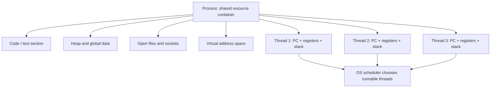
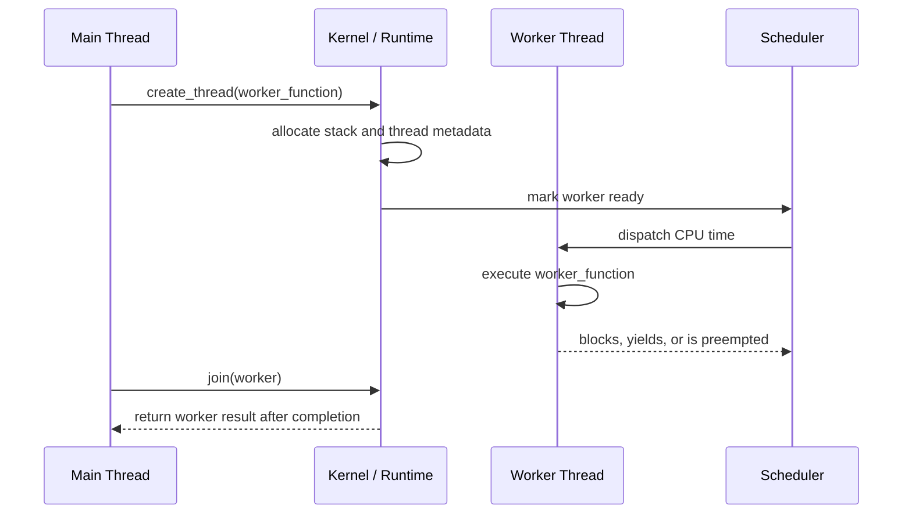
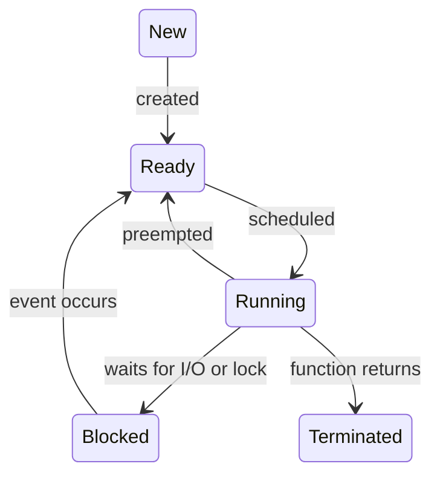

# Day 11 - Thread Basics

Difficulty: Beginner  
Fresh Learning: 40 minutes  
Revision: 5 minutes  
Prerequisites: Days 05-10: process address space, PCB, process states, context switching, CPU scheduling, Round Robin, MLFQ  
Why this topic matters in interviews: Threads are the bridge between isolated processes and practical concurrency. Interviewers use them to test whether you understand shared memory, lightweight execution, scheduling, performance tradeoffs, and the bugs that appear when multiple flows of control run inside one process.

Imagine a browser with one tab loading a web page, another playing music, a third running JavaScript, and a background task downloading a file. If each activity had to be a completely separate heavyweight process, the browser would still work, but it would spend more memory, communication would be clumsier, and some activities would be slower to coordinate. If everything ran in only one execution path, one slow network request or long script could freeze the whole browser experience.

Threads solve this middle problem. They let one process contain multiple execution flows. Those flows can share the same code, heap, open files, and process resources, while each thread keeps its own execution state such as program counter, registers, and stack. This is why a server can handle many client requests, a UI app can keep responding while background work continues, and a database can flush logs while query workers keep running.

The key interview idea is simple but deep: a process is a resource container; a thread is a schedulable execution path inside that container. Once you understand that sentence, many later topics become easier: race conditions, mutexes, semaphores, condition variables, deadlocks, thread pools, and concurrency versus parallelism.

## Interview Definition

A thread is the smallest schedulable unit of execution within a process. Multiple threads in the same process share the process address space and resources, such as code, heap, global variables, and open files, but each thread has its own program counter, CPU registers, stack, and thread control information. Threads are lighter than processes because creating and switching between threads usually requires less resource isolation work than creating and switching between separate processes.

In an interview, say: a process owns resources; a thread executes instructions using those resources. Threads improve responsiveness and concurrency, but shared memory makes synchronization necessary.

## Mental Model

Think of a process as a workshop. The workshop has shared tools, storage shelves, electricity, doors, and a work plan. A thread is a worker inside that workshop. Several workers can use the same shelves and tools, but each worker has their own clipboard showing what they are doing right now.

The shared workshop is useful because workers can coordinate quickly without shipping materials between buildings. But it also creates danger. If two workers update the same inventory sheet at the same time without rules, the final count may be wrong. If one worker locks a cabinet and waits for another locked cabinet, and the second worker does the reverse, both may be stuck.

This is the right mental model for threads:

- Shared process resources make communication cheap.
- Private thread state keeps each execution path independent.
- The scheduler can run, pause, and resume threads.
- Synchronization is required when threads touch shared mutable data.

## Layer 1: What happens at a high level?

At a high level, a thread is a path of execution inside a process. A single-threaded process has one path: it starts, executes instructions in order, calls functions, returns from functions, and eventually exits. A multithreaded process has more than one such path active within the same process.

For example, a simple text editor might use:

- One UI thread to handle typing, menu clicks, and screen updates.
- One background thread to autosave the file.
- One spell-checking thread to scan text.
- One indexing thread to update search data.

All of these threads belong to the same process. They can access the same heap objects, configuration, file handles, and loaded code. The OS scheduler may run one thread, pause it, run another, and later resume the first. On a multicore CPU, two or more threads from the same process may run truly at the same time on different cores.

This gives three important benefits.

First, responsiveness improves. If the UI thread stays free while a background worker performs disk or network work, the app does not feel frozen.

Second, resource sharing becomes cheaper. Threads can communicate through shared memory instead of using heavier inter-process communication.

Third, parallelism becomes possible on multicore systems. If work can be split safely, multiple threads can execute at the same time.

But threads are not magic performance switches. If threads fight over the same lock, wait on slow I/O, update shared data incorrectly, or exceed the useful number of CPU cores, they may make performance worse and correctness harder.

## Layer 2: What happens inside the OS?

Inside the OS, the scheduler needs something schedulable. In many modern systems, the schedulable entity is effectively a thread or kernel task, not just the old textbook idea of a whole process. A process provides an address space and resource ownership. Threads provide runnable execution contexts.

The OS stores per-process information such as:

- Virtual address space mappings.
- Open file table references.
- Credentials and permissions.
- Signal or exception handling configuration.
- Process identifier and parent-child relationship.

The OS stores per-thread information such as:

- Thread identifier.
- Thread state: ready, running, blocked, terminated.
- Program counter.
- CPU register snapshot.
- Stack pointer.
- Scheduling priority or policy.
- Kernel stack or kernel-mode execution state.
- Thread-local storage pointer.

This per-thread metadata is often called a Thread Control Block, or TCB. The exact structure differs by OS, but the conceptual role is consistent: it stores enough thread-specific information to stop and later resume that thread.

When a thread blocks for I/O, the whole process does not necessarily block. Another ready thread from the same process can continue. This is one major reason threads are useful in servers and interactive applications. A web server can have one request thread waiting for disk or database I/O while another request thread continues using the CPU.

## Layer 3: What happens at hardware or kernel level?

At the hardware level, a CPU core executes one instruction stream at a time. The currently running thread has values loaded into CPU registers, including the program counter or instruction pointer, stack pointer, and general-purpose registers. When the OS switches from one thread to another, it must save the current thread's CPU state and load the next thread's CPU state.

A thread context switch inside the same process can be cheaper than a process context switch because the address space may remain the same. If the memory mappings do not change, the OS may avoid some expensive memory-management work such as changing page table roots or flushing address-translation caches. However, a thread switch is still not free. Registers must be saved and restored, scheduler code must run, caches may be disturbed, and lock contention may increase.

Kernel-level threads are known to the OS kernel. The kernel can schedule them independently across CPU cores. If one kernel-level thread blocks in a system call, the kernel can run another thread from the same process.

User-level threads are managed mostly by a user-space runtime or library. The kernel may see only one underlying schedulable entity for many user-level threads. This makes user-level thread creation and switching fast, but it creates a major trap: if the underlying kernel thread blocks, all user-level threads mapped onto it may be unable to run.

Modern systems often combine ideas. Many language runtimes provide lightweight user-mode tasks, green threads, goroutines, fibers, or async tasks, but they ultimately map execution onto kernel threads so the OS can use CPU cores.

## Layer 4: What can go wrong?

The main danger of threads is shared mutable state. If two threads read and write the same variable without synchronization, the final result can depend on timing. That timing may change across runs, CPU cores, compiler optimizations, and input load. This is the root of race conditions.

Another problem is deadlock. If Thread A holds Lock 1 and waits for Lock 2, while Thread B holds Lock 2 and waits for Lock 1, both are blocked. Threads make deadlock easier to create because shared resources are common.

Threads can also hurt performance. Too many runnable threads increase scheduling overhead and context switching. Too many blocked threads consume memory for stacks and kernel metadata. Too much locking can serialize the program, removing the benefit of parallelism. False sharing can cause multiple cores to repeatedly invalidate cache lines even when threads update logically separate variables.

A good interview answer should therefore avoid saying "threads are always faster." Threads are useful when they express concurrency, hide I/O latency, improve responsiveness, or use multiple cores effectively. They are harmful when they create synchronization overhead, nondeterministic bugs, or unnecessary scheduling pressure.

## Step-by-Step Flow

Here is a practical flow for creating and running a thread:

1. A process starts with at least one main thread.
2. The program asks the OS or runtime to create another thread.
3. The OS or runtime allocates thread-specific state, including a stack and TCB-like metadata.
4. The new thread is placed in a ready state.
5. The scheduler selects the thread when CPU time is available.
6. The dispatcher loads the thread's register state and stack pointer.
7. The thread begins executing its start routine.
8. If it blocks for I/O or a lock, the scheduler can run another ready thread.
9. If its time slice expires, it may be preempted and placed back into a ready queue.
10. When the thread finishes, its return value and resources are collected by the runtime or joined by another thread.

For a context switch between two threads of the same process:

1. Timer interrupt, blocking call, yield, or priority decision triggers scheduling.
2. CPU enters kernel mode if the kernel is involved.
3. Current thread registers and program counter are saved in its thread state.
4. Scheduler chooses another ready thread.
5. If the next thread belongs to the same process, the address space may remain unchanged.
6. The next thread's registers and stack pointer are restored.
7. CPU resumes at the next thread's saved program counter.

## Diagram Section



This diagram separates the resource container from the execution paths. The process owns the shared environment. Each thread owns the state needed to continue its own instruction stream.



This sequence shows that thread creation is not only a function call. Some runtime or kernel structure must exist so the new execution path can be scheduled, blocked, resumed, and eventually joined.



Thread states look similar to process states because both represent schedulable execution. The difference is that several threads can share one process address space.

## Practical System Relevance

- Linux represents schedulable execution through task-like kernel structures. Threads in the same process can share memory mappings and file tables while still being scheduled independently.
- Windows processes contain one or more threads, and the scheduler runs threads rather than abstract process containers.
- Android apps use a main UI thread; long work on that thread can cause an Application Not Responding failure because the UI event loop stops responding.
- Browsers use multiple processes for isolation and multiple threads for work such as rendering, networking, JavaScript execution, and background tasks.
- Databases use worker threads for query execution, background checkpointing, logging, compaction, and connection handling.
- Web servers commonly use thread pools or event loops with worker threads to avoid creating a new OS thread for every request.
- Cloud services use threads to overlap I/O, handle concurrent requests, and use multiple cores, but they also use limits to avoid thread explosion.
- Containers do not remove threads. A containerized process can still create threads; the kernel still schedules those threads, subject to cgroup CPU and memory limits.

## Code or Pseudocode Section

Here is C-like pseudocode showing what a thread is meant to express:

```c
void *download_file(void *arg) {
    fetch_bytes_from_network(arg);
    return NULL;
}

int main() {
    thread_t worker;

    create_thread(&worker, download_file, "notes.pdf");

    keep_ui_responsive();

    join_thread(worker);
    return 0;
}
```

The point is not the exact API. The point is separation of execution. The main thread can continue handling UI work while the worker thread waits on network I/O. Both threads still belong to the same process and can share memory, so the program must be careful with shared variables.

A dangerous shared counter example:

```c
int counter = 0;

void *worker(void *arg) {
    for (int i = 0; i < 100000; i++) {
        counter = counter + 1;
    }
    return NULL;
}
```

Two threads running this function may not produce `200000`. The expression `counter = counter + 1` is not a single indivisible operation. It usually means load, add, and store. If two threads interleave those steps, one update can overwrite the other. This previews Day 13: race conditions.

Useful observation commands:

```bash
ps -eLf
top -H
htop
strace -f ./program
```

On Linux, `ps -eLf` can show threads, `top -H` can show thread-level CPU usage, and `strace -f` follows child processes or threads depending on the program behavior. On Windows, Task Manager and Process Explorer can show per-process thread counts and thread activity.

## Common Misconceptions

1. Threads and processes are the same. A process is a resource container with an address space; a thread is an execution path inside a process.
2. Threads are always faster than processes. Threads are often cheaper to create and switch, but poor synchronization, lock contention, and cache effects can make threaded programs slower.
3. Threads do not need scheduling. Threads are schedulable entities. The OS or runtime decides when each runnable thread gets CPU time.
4. If one thread blocks, the whole process always blocks. With kernel-level threads, another ready thread in the same process can continue running.
5. All thread memory is shared. Threads share the process address space, but each thread has its own stack and execution state.
6. More threads always improve responsiveness. Too many threads can increase context switching, memory use, and lock contention.
7. User-level threads and kernel-level threads have the same blocking behavior. User-level threads can be very fast, but blocking the underlying kernel thread may block many user-level threads.
8. A thread-safe program is automatically fast. Correct synchronization can still serialize execution or create contention.

## Tricky Interview Corners

The first tricky corner is the process-versus-thread boundary. A process normally has a separate address space. A thread shares the address space of its process. This is why inter-thread communication through memory is cheap, while inter-process communication usually needs pipes, sockets, shared memory, files, or other OS mechanisms.

The second tricky corner is thread context switching. A thread switch is usually lighter than a process switch, especially when both threads share the same address space. But it still has overhead: kernel scheduling, register save and restore, cache disruption, and possible synchronization effects.

The third tricky corner is blocking. In a many-to-one user-level threading model, a blocking system call can block all user-level threads mapped onto that one kernel thread. In a one-to-one model, each user thread maps to a kernel thread, so the kernel can schedule another thread while one blocks, but creating many threads can be more expensive.

The fourth tricky corner is shared stack confusion. Threads do not share a single call stack. Each thread needs its own stack because each thread has its own function calls, local variables, return addresses, and stack pointer. However, a thread can still access shared heap memory and global variables.

The fifth tricky corner is parallelism. A single-core CPU can run multiple threads concurrently by interleaving them, but not truly in parallel. Multiple cores allow true parallel execution, but only if there are multiple runnable threads and the workload can be split safely.

## Comparison Tables

| Feature | Process | Thread |
|---|---|---|
| Main role | Resource ownership and isolation | Execution path |
| Address space | Usually separate | Shared within process |
| Communication | IPC often needed | Shared memory possible |
| Creation cost | Usually higher | Usually lower |
| Context switch | Usually heavier | Usually lighter |
| Failure impact | More isolated | One bad thread can corrupt process state |
| Typical use | Isolation, separate programs | Concurrency inside one program |

| Feature | User-Level Threads | Kernel-Level Threads |
|---|---|---|
| Managed by | User-space library/runtime | OS kernel |
| Creation/switch cost | Very low | Higher than pure user-level |
| Kernel awareness | Kernel may not see each user thread | Kernel schedules each thread |
| Blocking problem | One blocking syscall may block all mapped threads | Other threads can still run |
| Parallelism on cores | Limited unless mapped to multiple kernel threads | Kernel can run threads on different cores |
| Example idea | Green threads/fibers | POSIX/Windows kernel-scheduled threads |

## How to Explain This in an Interview

### 30-second answer

A thread is the smallest unit of execution inside a process. Threads in the same process share code, heap, global variables, open files, and address space, but each thread has its own program counter, registers, and stack. Threads are useful for concurrency, responsiveness, and parallelism, but shared memory means we need synchronization.

### 2-minute answer

A process is like a container for resources, while a thread is a running execution path inside that container. A process may have one main thread or many threads. Multiple threads can work on different tasks while sharing the same process resources. This makes communication cheaper than between processes because threads can use shared memory. For example, a browser or server may use separate threads for UI, networking, disk work, and request handling.

The OS or runtime maintains per-thread state such as thread ID, state, stack pointer, registers, program counter, and scheduling metadata. In kernel-level threading, the OS scheduler can run different threads on different CPU cores or switch between them when one blocks or its quantum expires.

The tradeoff is safety. Shared memory can cause race conditions, deadlocks, and visibility bugs unless locks, atomic operations, or other synchronization mechanisms are used.

### Deeper follow-up answer

Threading models matter. User-level threads are fast because the runtime can create and switch them without always entering the kernel, but if the kernel only sees one schedulable entity, a blocking system call can block all user-level threads in that process. Kernel-level threads are visible to the OS and can be scheduled independently, including on multiple cores, but they cost more to create and manage. Modern runtimes often mix these ideas by scheduling lightweight tasks onto a pool of kernel threads.

## Interview Questions

### Basic Questions

1. What is a thread?
2. How is a thread different from a process?
3. What resources are shared between threads of the same process?
4. What state is private to each thread?
5. Why are threads considered lightweight compared with processes?

### Intermediate Questions

6. Why can a multithreaded application remain responsive during I/O?
7. What is a Thread Control Block?
8. What happens during a thread context switch?
9. What is the difference between user-level and kernel-level threads?
10. Why does shared memory make threads both useful and dangerous?

### Advanced Questions

11. Can two threads of the same process run on different CPU cores?
12. Why might too many threads reduce performance?
13. How can a blocking system call affect user-level threads?
14. Why is a thread switch usually cheaper than a process switch?
15. How do threads prepare us for race conditions and locks?

## Follow-Up Questions

Q: What is a thread?  
Follow-ups:
- What does "smallest schedulable unit" mean?
- Is a thread a complete program?
- Can a process exist without any thread?
- What happens to a process when all its threads finish?

Q: How is a thread different from a process?  
Follow-ups:
- Which one owns the address space?
- Which one has a stack?
- Why is inter-thread communication usually cheaper?
- Why is process isolation safer?

Q: What is shared between threads?  
Follow-ups:
- Are global variables shared?
- Are file descriptors or handles shared?
- Is the heap shared?
- Is the stack shared?

Q: Why are threads useful in servers?  
Follow-ups:
- What happens when one request waits for I/O?
- Why do servers use thread pools?
- What is the danger of one thread per request without limits?
- How do threads interact with CPU cores?

Q: What are user-level threads?  
Follow-ups:
- Why are they fast?
- What is the blocking syscall problem?
- Can they use multiple cores by themselves?
- How do modern runtimes reduce this limitation?

Q: What are kernel-level threads?  
Follow-ups:
- Why can the OS schedule them independently?
- Why are they more expensive than user-level threads?
- What happens if one kernel-level thread blocks?
- How does this model help parallelism?

Q: Are threads always better than processes?  
Follow-ups:
- When is process isolation preferred?
- What bugs become easier with threads?
- What performance costs can threads introduce?
- Why might a browser use both processes and threads?

## Trick Questions

1. Q: If two threads are in the same process, do they share the same stack?  
Expected answer: No. Each thread has its own stack. They share the process address space, heap, globals, code, and many resources, but each needs its own call stack and stack pointer.

2. Q: If a process has four threads, does it always run four times faster?  
Expected answer: No. Speedup depends on available cores, workload independence, synchronization overhead, I/O behavior, and contention.

3. Q: If one thread crashes, can the whole process be affected?  
Expected answer: Yes. Threads share an address space, so memory corruption or an unhandled fatal error in one thread can bring down or corrupt the entire process.

4. Q: Is a thread context switch free because threads share memory?  
Expected answer: No. It may be cheaper than a process switch, but the OS still saves and restores CPU state and may disturb caches.

5. Q: If one thread is waiting for disk I/O, is it still using the CPU?  
Expected answer: Usually no. It is blocked, and the scheduler can run another ready thread or process.

6. Q: Do user-level threads always allow true parallelism on multiple cores?  
Expected answer: Not by themselves if the kernel sees only one underlying thread. Parallelism usually requires mapping work onto multiple kernel-scheduled threads.

7. Q: Are local variables always safe from thread interference?  
Expected answer: Usually local variables on a thread's own stack are private, but pointers or references to shared heap objects can still create races.

## Practical Debugging / Observation

To observe threads, look for thread count, per-thread CPU use, blocked threads, and whether many threads are sleeping or runnable.

```bash
ps -eLf | head
top -H -p <pid>
htop
cat /proc/<pid>/status
ls /proc/<pid>/task
strace -f -p <pid>
```

What to observe:

- `ps -eLf` shows lightweight process/thread entries on Linux-like systems.
- `top -H` shows CPU usage per thread.
- `/proc/<pid>/task` contains entries for each thread in a process on Linux.
- `strace -f` helps reveal whether threads are blocked in system calls.
- A high thread count with low CPU usage may mean threads are mostly waiting.
- High CPU usage across several threads may indicate real parallel CPU work.

On Windows, use Task Manager, Resource Monitor, or Process Explorer to inspect thread count, CPU activity, and wait states. In interviews, you do not need tool memorization as much as the observation principle: threads can be inspected as schedulable execution units within a process.

## Mini Quiz

### MCQs

1. What is the best description of a thread?  
A. A file on disk  
B. A schedulable execution path inside a process  
C. A complete operating system  
D. A hardware interrupt  
Answer: B

2. Which memory area is typically private to each thread?  
A. Heap  
B. Global data  
C. Stack  
D. Code section  
Answer: C

3. Why is a thread switch often cheaper than a process switch?  
A. Threads never use registers  
B. Threads do not execute instructions  
C. Threads in the same process may share the same address space  
D. Threads cannot block  
Answer: C

4. What is a common risk of multithreading?  
A. Race conditions on shared data  
B. No CPU scheduling  
C. No memory use  
D. No need for synchronization  
Answer: A

5. Which model lets the kernel schedule each thread independently?  
A. Pure user-level threading only  
B. Kernel-level threading  
C. Single-threaded execution  
D. Static linking  
Answer: B

### Short-Answer Questions

1. Name three things shared by threads in the same process.  
Answer: Code, heap/global data, open files or sockets, and address space are common examples.

2. Name three things private to each thread.  
Answer: Program counter, CPU register state, stack, thread ID, and thread-local metadata.

3. Why can threads improve UI responsiveness?  
Answer: Long-running or blocking work can run on a worker thread while the UI thread continues processing events.

### Reasoning Questions

1. A server creates one thread per request and suddenly becomes slower under heavy load. Why?  
Answer: Too many threads can increase memory use, scheduling overhead, context switches, and lock contention. A bounded thread pool or event-driven design may behave better.

2. A program has two threads incrementing the same integer. The final value is sometimes wrong. What concept explains this?  
Answer: Race condition. The increment is not atomic, so interleavings can lose updates unless synchronization or atomic operations are used.

# 5-Minute Revision Column

Revision Targets:

- Day 10: Scheduling Algorithms Part 2 - R1 Recall Revision
- Day 8: Process Scheduling Basics - R2 Compression Revision

## Day 10 - Scheduling Algorithms Part 2 - R1 Recall

Core recall: Round Robin is a preemptive time-sharing algorithm. Each ready process or thread receives a fixed time quantum. If it finishes early, it leaves the queue; if it uses the full quantum and remains runnable, it goes to the back of the ready queue. This improves fairness and response time compared with FCFS, but the quantum size is crucial. A very large quantum behaves like FCFS. A very small quantum creates too much context-switch overhead.

Key definitions:

- Round Robin: Preemptive scheduling where each runnable task receives a bounded time slice.
- Time quantum: Maximum CPU time a task gets before preemption.
- MLFQ: Multilevel Feedback Queue, an adaptive scheduler that moves tasks between priority queues based on behavior.

Practical use: Interactive systems use time slicing so one CPU-heavy task does not freeze every other runnable task. MLFQ-like thinking rewards tasks that block quickly for I/O and demotes tasks that repeatedly consume full quanta.

Pitfalls:

- Fair turns do not guarantee minimum average waiting time.
- A smaller quantum is not always better because switching has overhead.
- MLFQ does not know the future; it estimates behavior from past CPU use.

Quick interview questions:

1. Why does Round Robin improve response time over FCFS?
2. What happens if the time quantum is too small or too large?

Mental model: Round Robin is a meeting timer. MLFQ is a building manager who moves people between fast and slow lines based on how they behave.

## Day 8 - Process Scheduling Basics - R2 Compression

Core recall:

- Scheduling decides which ready task gets the CPU next.
- The scheduler chooses; the dispatcher performs the low-level handoff.
- Scheduling goals include CPU utilization, throughput, waiting time, turnaround time, response time, priority, and fairness.
- Preemptive scheduling can interrupt a running task; non-preemptive scheduling waits until the task blocks or exits.
- A task waiting for I/O is not ready to use the CPU.

Key definitions:

- Scheduler: Kernel component or logic that selects the next runnable task.
- Dispatcher: Mechanism that transfers CPU control to the selected task.
- Ready queue: Collection of runnable tasks waiting for CPU time.

Pitfalls:

- Scheduling is not the same as context switching.
- A ready task is not currently running; it is eligible to run.

Quick interview questions:

1. Why should an I/O-waiting process not stay on the CPU?
2. Why can maximizing CPU utilization still produce bad user responsiveness?

Mental model: The CPU is a service counter. Scheduling is the queue policy that decides who gets served next and why.

## Final Takeaway

Threads let one process contain multiple independent execution paths while sharing the same resource container. Each thread has its own program counter, registers, stack, and scheduling state, but threads in the same process share code, heap, globals, open files, and address space. This makes communication cheap and responsiveness better, but it creates correctness risks around shared mutable data. Kernel-level threads are visible to the OS scheduler and can run independently across cores. User-level threads can be faster to manage but need careful mapping to avoid blocking and parallelism limits. The interview-safe summary is: processes isolate resources; threads share resources and execute concurrently.

## What You Should Be Able To Answer Now

- Define a thread in an interview-friendly way.
- Explain the difference between a process and a thread.
- List what threads share and what each thread owns privately.
- Explain why threads are lighter than processes but not free.
- Compare user-level and kernel-level threads.
- Describe what happens during thread creation and thread context switching.
- Explain why threads improve responsiveness and concurrency.
- Identify thread-related traps such as race conditions, deadlocks, and excessive context switching.
