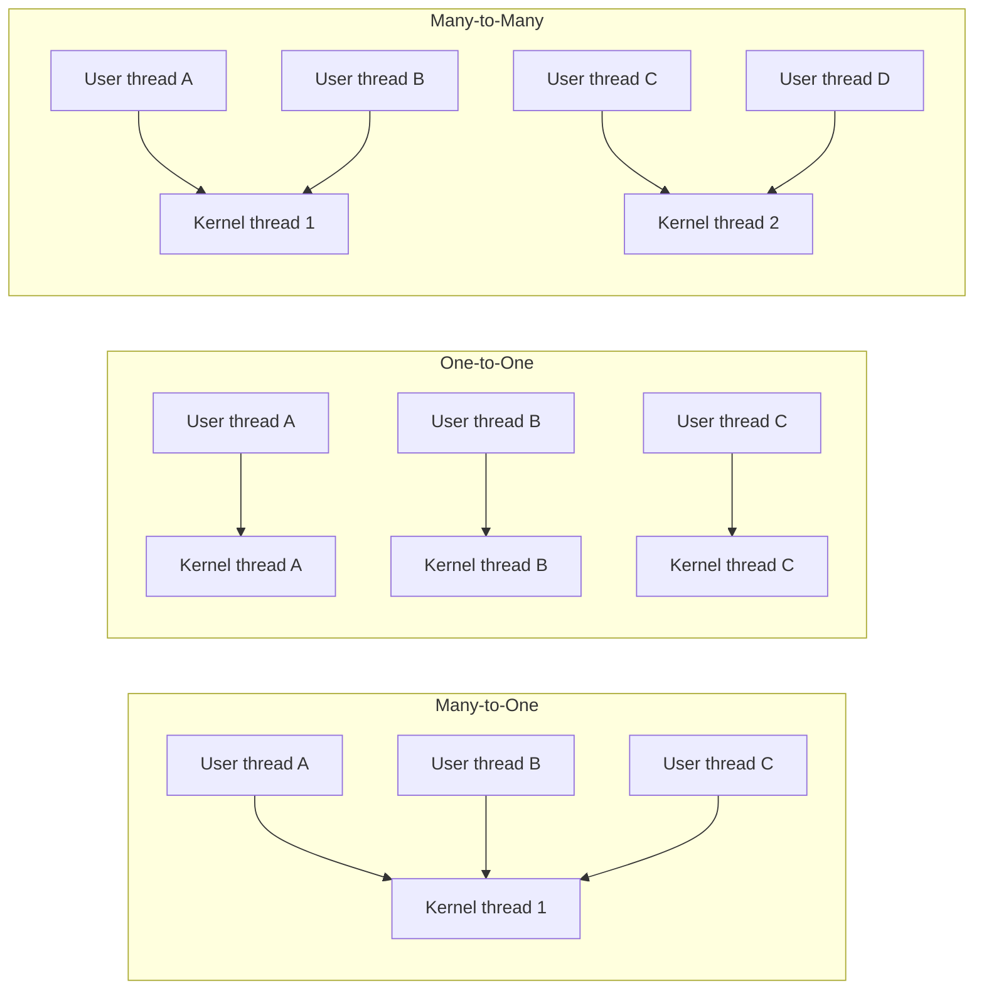
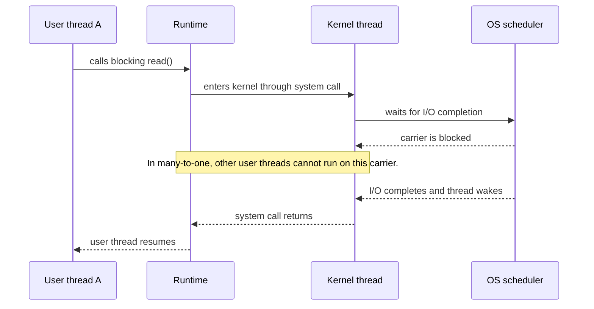
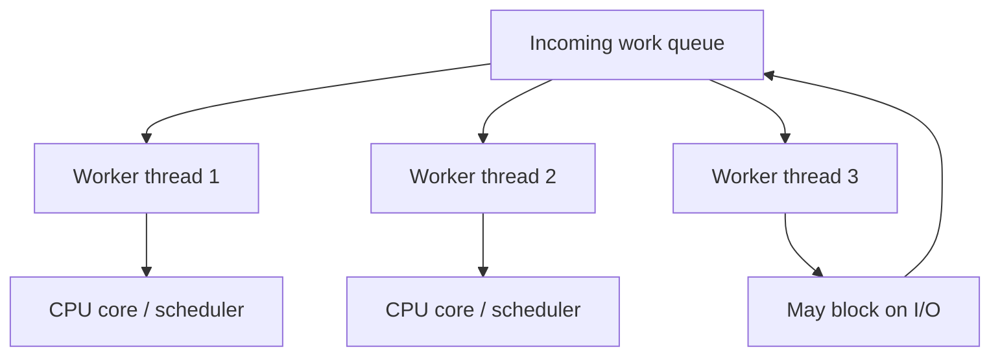

# Day 12 - Multithreading Models

Difficulty: Intermediate  
Fresh Learning: 40 minutes  
Revision: 5 minutes  
Prerequisites: Day 11 - Thread Basics; process address space; CPU scheduling; context switching  
Why this topic matters in interviews: Multithreading models test whether you can connect the clean textbook idea of a thread to real operating systems, runtimes, thread pools, blocking calls, multicore execution, and the difference between concurrency and parallelism.

Imagine a web server receiving thousands of requests. Some requests need CPU work, some wait for the database, some wait for disk, and some are just waiting for network bytes. If the server creates one heavy process for every request, memory and context-switching overhead can explode. If it uses only one execution path, one slow operation can delay unrelated clients. Threads give a middle path, but there is still a design question: who manages those threads, and how are application-level threads connected to kernel-scheduled threads?

That design question is the heart of multithreading models. A language runtime, operating system, or server framework may expose threads to programmers in different ways. Sometimes many user-level threads are mapped onto one kernel thread. Sometimes every user thread maps to its own kernel thread. Sometimes many user threads are multiplexed across a controlled number of kernel threads. Each design changes blocking behavior, parallelism, scheduling overhead, and implementation complexity.

The topic also prevents a common interview mistake: saying "multithreading means parallelism." Multithreading can provide concurrency even on one CPU core, because multiple tasks can make progress over time. Parallelism requires actual simultaneous execution, usually on multiple cores. A correct answer must separate these ideas.

## Interview Definition

A multithreading model describes how user-level threads created by an application or runtime are mapped to kernel-level threads scheduled by the operating system. The main models are many-to-one, one-to-one, and many-to-many. These models determine whether threads can run in parallel, what happens when one thread blocks, how much scheduling overhead exists, and how much control the runtime has.

In an interview, say: user-level threads are managed by a user-space library or runtime, kernel-level threads are known to the OS scheduler, and the mapping between them decides the tradeoff between speed, parallelism, blocking behavior, and complexity.

## Key Definitions

- Multithreading model: the mapping policy between application or runtime-managed user threads and operating-system-managed kernel threads.
- User-level thread: a thread-like execution unit managed mainly in user space by a library, language runtime, or application scheduler.
- Kernel-level thread: a schedulable execution context known to the OS kernel and placed onto CPU cores by the kernel scheduler.
- Many-to-one model: many user-level threads share one kernel-level thread.
- One-to-one model: each user-level thread maps to a distinct kernel-level thread.
- Many-to-many model: many user-level threads are multiplexed over multiple kernel-level threads.
- Thread pool: a bounded set of reusable worker threads that execute queued tasks.
- Concurrency: multiple tasks are in progress over overlapping time, even if only one runs at an instant.
- Parallelism: multiple tasks execute at the same instant, usually on different CPU cores.

## Mental Model

Think of user-level threads as work tickets created inside a company and kernel-level threads as licensed delivery drivers recognized by the city. If the company has many tickets but only one licensed driver, it can reorder tickets internally, but only one delivery can happen at a time. If every ticket gets its own driver, many deliveries can happen in parallel, but drivers are expensive to create and coordinate. If many tickets share a pool of drivers, the company can keep control over the work while still using multiple drivers when useful.

That is the mental model:

- Many-to-one: many user tickets, one kernel driver.
- One-to-one: each user ticket gets a kernel driver.
- Many-to-many: many user tickets are scheduled over a smaller or equal set of kernel drivers.
- Thread pools: instead of creating drivers on demand forever, reuse a bounded group.

The interview depth comes from explaining what happens when a ticket blocks. If the only driver is stuck at a closed gate, every other ticket waits. If there are multiple drivers, unrelated tickets may continue.

## Layer 1: What happens at a high level?

At a high level, applications want to express multiple activities at once. A browser wants UI responsiveness, networking, rendering, media playback, JavaScript execution, and background maintenance. A database wants query workers, logging, checkpointing, cache eviction, and network handling. A web server wants to handle many clients without creating unlimited processes.

Threads are one way to express these activities. But a thread visible to the programmer is not always the same thing as a thread visible to the kernel. A programming language runtime may create user-level threads, fibers, coroutines, green threads, or lightweight tasks. The kernel schedules kernel-level threads onto CPU cores. The multithreading model defines the bridge between those two worlds.

There are three classic models:

1. Many-to-one: many user-level threads map to one kernel thread.
2. One-to-one: each user-level thread maps to one kernel thread.
3. Many-to-many: many user-level threads map to a set of kernel threads.

The model decides four practical things:

- Can multiple threads run truly in parallel on multiple cores?
- If one thread makes a blocking system call, does the whole process stall?
- Is thread creation and switching cheap or expensive?
- Who controls scheduling decisions: the user-level runtime, the kernel, or both?

## Layer 2: What happens inside the OS?

The OS scheduler can only schedule entities it knows about. If a runtime creates ten user-level threads but maps them all to a single kernel thread, the OS sees only one schedulable execution context. The runtime can switch between user threads in user space, but the kernel cannot place those ten user threads on ten CPU cores because it does not know they exist separately.

In a one-to-one model, the OS knows about each thread. Each user thread corresponds to a kernel thread or kernel-scheduled task. The kernel can preempt, block, wake, prioritize, and run those threads independently. This enables parallelism on multicore CPUs and prevents one blocking thread from necessarily stopping the entire process.

In a many-to-many model, the runtime exposes many logical user threads but runs them over a smaller set of kernel threads. The runtime may decide which user task runs on which kernel thread, while the OS schedules the kernel threads onto CPUs. This can reduce kernel-thread overhead while still allowing real parallelism.

The key distinction:

| Concept | Managed by | Scheduler visibility | Typical role |
|---|---|---|---|
| User-level thread | User-space library/runtime | Often invisible as a separate unit | Cheap logical concurrency |
| Kernel-level thread | Operating system kernel | Visible to OS scheduler | True schedulable execution on CPUs |
| Thread pool worker | Runtime/application plus kernel | Visible as worker threads | Reused execution capacity |
| Coroutine/fiber/task | Runtime | Usually invisible directly | Lightweight cooperative work unit |

## Layer 3: What happens at hardware or kernel level?

At the hardware level, CPUs execute instruction streams. A CPU core does not understand "Java thread" or "Go goroutine" as a special concept. It executes the currently scheduled kernel thread's instruction stream. The kernel uses timer interrupts, blocking events, wakeups, priorities, and CPU affinity rules to decide which kernel thread runs on which core.

When a kernel-level thread blocks on disk, network, a futex, a sleep, or another wait condition, the kernel can mark that thread blocked and schedule another runnable kernel thread. This is why one-to-one threading works well for many common blocking operations: one blocked thread does not automatically freeze unrelated kernel threads in the same process.

In many-to-one threading, the kernel sees one kernel thread. If that kernel thread performs a blocking system call, the entire underlying execution carrier may block. The runtime cannot switch to another user thread because the only kernel thread is sleeping inside the kernel. Some runtimes avoid this by using non-blocking I/O, asynchronous system calls, or special wrappers, but the basic model has this risk.

On multicore hardware, parallelism requires more than one kernel-scheduled execution context. Ten user-level threads mapped to one kernel thread can be concurrent in structure, but not parallel in execution. Ten user-level threads mapped to ten kernel threads may run on multiple cores, subject to scheduler decisions and available CPUs.

## Layer 4: What can go wrong?

The first failure mode is false parallelism. A program may create many user-level threads but still use only one core if those threads map to one kernel thread or if a runtime lock limits execution. The program looks multithreaded but does not gain CPU parallelism.

The second failure mode is blocking surprise. In a many-to-one design, a blocking system call can block the carrier thread and stop all user-level threads. This is why runtime and I/O design matters.

The third failure mode is thread explosion. In one-to-one threading, creating one OS thread per request can work at small scale but collapse under large load because each thread needs stack memory, kernel metadata, scheduler attention, and context-switch cost.

The fourth failure mode is oversubscription. If a program creates far more runnable CPU-bound threads than CPU cores, the scheduler spends more time switching and less time doing useful work. More threads do not automatically mean more throughput.

The fifth failure mode is shared-state bugs. Multithreading models describe mapping and scheduling, but they do not remove race conditions. If multiple threads share data, synchronization is still required.

## Step-by-Step Flow

Here is a practical flow for a one-to-one threaded server:

1. The process starts and creates a main thread.
2. The server creates worker threads, often as a bounded pool.
3. Each user-visible worker maps to a kernel-level thread.
4. The OS scheduler places runnable worker threads on available CPU cores.
5. A worker handling a client may block on disk, database, or network I/O.
6. The kernel marks that worker blocked and runs another ready thread.
7. When I/O completes, an interrupt or completion event wakes the blocked worker.
8. The scheduler eventually runs that worker again.
9. The application reuses the worker for another task instead of constantly creating new threads.

Here is a contrasting many-to-one flow:

1. The process starts with one kernel thread.
2. A user-level thread library creates many logical threads in user space.
3. The library switches between logical threads without entering the kernel for every switch.
4. The OS scheduler sees only one kernel thread for this process.
5. If a logical thread yields cooperatively, the library can run another logical thread.
6. If the carrier kernel thread blocks in a system call, all logical threads are unable to run until the call returns.

## Diagram Section

### Diagram 1: Thread Mapping Models



This diagram shows the central mapping question. The number of user-level threads exposed to the program may be larger than, equal to, or multiplexed across kernel-level threads.

### Diagram 2: Blocking Behavior



The important interview point is not the exact API. The point is that blocking at the kernel-thread level can stop all user-level threads that depend on that same carrier.

### Diagram 3: Thread Pool Work Queue



A thread pool keeps a bounded set of reusable workers. This avoids creating an unbounded number of threads under load.

## Practical System Relevance

In Linux, the kernel scheduler works with schedulable task-like execution contexts. Threads in the same process can share memory mappings and file tables, while still being scheduled independently. This makes Linux-style threading close to the one-to-one model from the programmer's perspective.

In Windows, processes contain one or more threads, and the scheduler schedules threads. A process is not "running" by itself in the same way; its threads run. This distinction is useful in interviews because it separates resource ownership from execution.

In Java, `Thread` objects traditionally map to operating-system threads on mainstream JVMs. Newer Java virtual threads provide a runtime-managed lightweight concurrency model where many virtual threads can be mounted on fewer carrier threads. The interview concept remains the same: logical threads and kernel-scheduled threads are not always one-to-one.

In Go, goroutines are lightweight user-level execution units scheduled by the Go runtime over OS threads. This is a practical many-to-many style design. It allows a large number of goroutines without creating an OS thread for every goroutine.

In Android, the main UI thread must stay responsive. Long CPU work or blocking I/O on that thread can freeze the app and cause an Application Not Responding condition. Background workers, executors, coroutines, or thread pools are used to keep UI work separate.

In databases, worker pools prevent unbounded thread creation. A database may use threads for client connections, query execution, logging, flushing, compaction, checkpointing, and background maintenance. Too many workers can increase lock contention and cache pressure.

In servers and cloud systems, thread pools are often combined with async I/O, event loops, and backpressure. The goal is not simply "more threads"; the goal is enough concurrency to keep resources busy without overwhelming CPU, memory, queues, and downstream services.

In containers, threads are still scheduled by the host kernel. A container does not get a private CPU scheduler in the ordinary sense. cgroups and quotas may limit CPU time, but kernel threads still compete on the host.

## Code or Pseudocode Section

### One request per new thread: simple but risky at scale

```c
while (server_running) {
    int client = accept(server_socket);
    create_thread(handle_client, client);
}
```

This design is easy to understand. Every client gets a thread. But at high load, it may create thousands of OS threads. Each thread consumes stack memory and scheduler attention. If requests block on slow clients or databases, the server can run out of memory or spend too much time switching.

### Bounded thread pool: common production pattern

```c
queue work_queue;
thread workers[N];

worker_loop() {
    while (server_running) {
        task t = work_queue.take();
        handle(t);
    }
}

main() {
    start N workers;
    while (server_running) {
        task t = accept_or_read_request();
        work_queue.push(t);
    }
}
```

The pool controls concurrency. If work arrives faster than workers can process it, the queue grows or the server applies backpressure. This is often better than allowing unlimited thread creation.

### Observing threads on Linux

```bash
ps -eLf | head
top -H -p <pid>
cat /proc/<pid>/status
```

`ps -eLf` shows lightweight process/thread information. `top -H` shows threads within a process. `/proc/<pid>/status` includes thread count and process metadata. The lesson to observe is that a process can contain multiple schedulable execution paths.

## Common Misconceptions

- Multithreading always means parallelism. Not necessarily. Concurrency means multiple tasks are in progress over time. Parallelism means simultaneous execution. A single-core CPU can run concurrent threads by time-slicing, but not truly run them at the same instant.
- User-level threads and kernel-level threads are the same. User-level threads are managed by a runtime or library. Kernel-level threads are visible to the OS scheduler.
- Many-to-one is always bad. It can be very fast for user-space switching and simple cooperative workloads, but it has serious blocking and parallelism limitations.
- One-to-one is always best. It enables parallelism and better blocking behavior, but too many OS threads can be expensive.
- Thread pools are only an optimization. They are also a control mechanism. They limit concurrency, protect memory, reduce creation overhead, and make overload behavior more predictable.
- More threads always improve throughput. If work is CPU-bound and there are already enough runnable threads to fill all cores, more threads can increase overhead and reduce throughput.
- A blocked thread is still using a CPU. A blocked thread is normally not running on the CPU. It waits for an event while the scheduler can run another ready thread.
- A runtime scheduler replaces the OS scheduler completely. Runtime schedulers still depend on kernel threads. The OS ultimately schedules kernel execution contexts onto CPU cores.

## Tricky Interview Corners

### Why many-to-one can be fast but limited

Many-to-one threading can switch between user-level threads without a kernel transition. That makes switching cheap. But because the OS sees only one kernel thread, the process cannot use multiple cores for those user threads. A blocking system call can also block the whole carrier.

### Why one-to-one enables parallelism but can be expensive

One-to-one gives the OS visibility into each thread. If one thread blocks, another can run. Multiple threads can run on multiple cores. The tradeoff is kernel involvement, memory for stacks and thread metadata, and scheduling overhead.

### Why many-to-many is attractive but complex

Many-to-many tries to combine lightweight user threads with real multicore execution. The runtime schedules many logical tasks over a bounded number of kernel threads. This is powerful, but the runtime must handle blocking, preemption, work stealing, fairness, and debugging complexity.

### Why thread pools are not just about speed

Thread pools protect systems under load. Without a pool, a burst of requests can create a burst of threads, which increases memory use and context switching. With a pool, the system can queue, reject, throttle, or backpressure work.

### Why concurrency can improve latency without improving CPU throughput

If tasks spend much time waiting for I/O, concurrency lets one task wait while another makes progress. This can reduce latency and improve resource utilization. But if all tasks are CPU-bound and cores are saturated, concurrency alone does not create more CPU capacity.

## Comparison Tables

### Many-to-One vs One-to-One vs Many-to-Many

| Model | Mapping | Parallelism | Blocking risk | Overhead | Main tradeoff |
|---|---|---:|---|---|---|
| Many-to-one | Many user threads to one kernel thread | No true multicore parallelism for those threads | High if carrier blocks | Low user-space switching cost | Fast switching but limited parallelism |
| One-to-one | Each user thread maps to a kernel thread | Yes, subject to cores | Lower; other threads may run | Higher OS thread cost | Practical and common, but can overcreate threads |
| Many-to-many | Many user threads over multiple kernel threads | Yes | Runtime-dependent | Moderate to complex | Scalable logical concurrency with runtime complexity |

### Concurrency vs Parallelism

| Idea | Meaning | Possible on one core? | Example |
|---|---|---:|---|
| Concurrency | Multiple tasks are in progress over overlapping time | Yes | A server handles many clients by interleaving waits and work |
| Parallelism | Multiple tasks execute at the same instant | No | Two CPU-bound threads run on two different cores |
| Multithreading | Program has multiple execution paths | Yes | UI thread plus background worker |
| Multiprocessing | Program/system uses multiple processes | Yes | Browser uses separate renderer processes |

## How to Explain This in an Interview

### 30-second answer

Multithreading models describe how user-level threads map to kernel-level threads. In many-to-one, many user threads share one kernel thread, which is cheap but cannot use multiple cores and can block as a group. In one-to-one, every user thread maps to a kernel thread, enabling parallelism and independent blocking but increasing overhead. In many-to-many, many user threads are scheduled over several kernel threads, balancing lightweight concurrency with parallel execution.

### 2-minute answer

The core idea is that a thread visible to the programmer may be managed by a runtime, while the OS scheduler only schedules kernel-level threads. If many logical threads map to one kernel thread, the runtime can switch quickly in user space, but the OS cannot run them on multiple cores. If one logical thread blocks the kernel thread, all logical threads depending on that carrier may stop. In one-to-one, the OS sees every thread, so blocking and scheduling are handled independently and multicore parallelism is possible. But OS threads have memory and scheduling overhead, so creating one per small task can be wasteful. Many-to-many models and thread pools try to keep concurrency high while bounding the number of kernel threads.

### Deeper follow-up answer

A strong design depends on workload. CPU-bound work usually needs around the number of CPU cores, sometimes slightly more. I/O-bound work can benefit from more concurrency because many tasks spend time waiting. But unlimited threads are dangerous because each thread has stack memory, kernel metadata, and scheduling overhead. Modern runtimes often combine lightweight tasks, event loops, non-blocking I/O, and worker pools. The key is to separate logical concurrency from physical parallelism: logical tasks express work; kernel threads and CPU cores determine how much can execute simultaneously.

## Interview Questions

### Basic Questions

1. What is a multithreading model?
2. What is the difference between a user-level thread and a kernel-level thread?
3. What is the many-to-one model?
4. What is the one-to-one model?
5. What is the many-to-many model?

### Intermediate Questions

6. Why can a many-to-one model fail to use multiple CPU cores?
7. What happens if one user thread blocks in a many-to-one model?
8. Why is one-to-one threading common in modern operating systems?
9. Why can creating too many OS threads hurt performance?
10. What problem does a thread pool solve?

### Advanced Questions

11. How do concurrency and parallelism differ?
12. Why might a runtime use lightweight user-level tasks instead of raw OS threads?
13. How does blocking I/O affect thread model design?
14. Why does CPU-bound work need different thread counts than I/O-bound work?
15. How would you explain Go goroutines or Java virtual threads using multithreading models?

## Follow-Up Questions

Q: What is a multithreading model?  
Follow-ups:
- Why does the OS need kernel-level threads?
- Can the runtime schedule threads without the kernel knowing?
- What does the mapping affect?

Q: What is many-to-one threading?  
Follow-ups:
- Can it use multiple cores?
- What happens on a blocking system call?
- Why might switching be cheap?

Q: What is one-to-one threading?  
Follow-ups:
- Why does it support parallelism?
- What overhead does it introduce?
- Why can thread-per-request servers fail under load?

Q: What is many-to-many threading?  
Follow-ups:
- What role does the runtime scheduler play?
- Why is it harder to implement?
- How does it relate to goroutines or virtual threads?

Q: What is a thread pool?  
Follow-ups:
- Why not create a new thread for every task?
- What happens when the queue fills?
- How does a pool protect a server during overload?

Q: What is concurrency vs parallelism?  
Follow-ups:
- Can concurrency happen on one core?
- Can multithreading exist without parallelism?
- Why does I/O-bound work benefit from concurrency?

## Trick Questions

Q: If a program has 1,000 user-level threads, is it definitely using 1,000 CPU cores?  
Expected answer: No. User-level threads may map to fewer kernel threads, and actual parallelism is limited by kernel scheduling and available CPU cores.

Q: If a process has multiple threads, is the process itself scheduled?  
Expected answer: In modern systems, schedulable entities are threads or task-like execution contexts. A process owns resources; its threads run.

Q: Is many-to-one always slower than one-to-one?  
Expected answer: No. User-level switching can be faster, but many-to-one has blocking and parallelism limitations.

Q: If one thread blocks on I/O, does the whole process always block?  
Expected answer: Not with kernel-level threads in a one-to-one style model. Other ready threads in the same process can run.

Q: Does a thread pool increase the number of CPU cores?  
Expected answer: No. It controls work execution and reuse. It does not create hardware capacity.

Q: Can a single-core system have multithreading?  
Expected answer: Yes. It can have concurrent threads through time-slicing, but not true simultaneous parallel execution.

Q: Are coroutines exactly the same as OS threads?  
Expected answer: No. Coroutines are typically runtime-managed lightweight units and may run on a smaller number of OS threads.

## Practical Debugging / Observation

Use these commands to connect the concept to real systems:

```bash
ps -eLf
top -H -p <pid>
cat /proc/<pid>/status
cat /proc/<pid>/task/<tid>/status
```

What to observe:

- A process can have many threads.
- Threads have IDs and states.
- A process with multiple threads may show CPU use above one core's worth on multicore systems.
- A blocked thread should not consume CPU like a running thread.

For Java:

```bash
jcmd <pid> Thread.print
```

This can show Java thread states such as runnable, waiting, blocked, or timed waiting. The names are runtime-level views, but they help connect application behavior to execution state.

For server debugging, watch:

- thread count growth,
- CPU saturation,
- blocked/waiting thread dumps,
- queue length,
- response latency,
- context-switch rate.

A practical interview answer should mention that thread count is not a success metric by itself. Useful throughput and stable latency matter more.

## Mini Quiz

### MCQs

1. Which model maps many user threads to one kernel thread?  
   A. One-to-one  
   B. Many-to-one  
   C. One-to-many  
   D. Direct mapping

2. Which model most directly supports multicore parallelism for multiple user threads?  
   A. Many-to-one only  
   B. No threading model  
   C. One-to-one or many-to-many  
   D. Single-threaded execution

3. What is the main risk of one thread per request?  
   A. No concurrency  
   B. Unlimited memory and scheduling overhead under load  
   C. No blocking possible  
   D. No system calls

4. Concurrency means:  
   A. tasks execute at the exact same instant only  
   B. tasks make progress over overlapping time  
   C. every task has a CPU core  
   D. no scheduling is needed

5. A thread pool primarily helps by:  
   A. removing the kernel  
   B. increasing physical cores  
   C. bounding and reusing worker threads  
   D. preventing all race conditions

### Short-answer Questions

1. Why can a many-to-one model block all user threads when one thread performs blocking I/O?
2. Why is one-to-one threading more suitable for multicore CPUs?
3. Why does a thread pool improve overload control?

### Reasoning Questions

1. A CPU-bound program creates 200 runnable threads on an 8-core machine and gets slower. Explain why.
2. A server handles many slow network clients. Should it always create one OS thread per client? Explain the tradeoff.

### Answers

1. B  
2. C  
3. B  
4. B  
5. C  

Short answers:

1. Because all user-level threads depend on the same kernel carrier; if that carrier sleeps in the kernel, the runtime cannot run the others on it.
2. Because the kernel can schedule different kernel threads onto different CPU cores.
3. Because it limits thread creation, reuses workers, keeps queues visible, and allows backpressure or rejection.

Reasoning answers:

1. With only 8 cores, 200 runnable CPU-bound threads cause oversubscription. The scheduler must switch among many threads, increasing context-switch overhead, cache disruption, and lock contention without adding CPU capacity.
2. Not always. Thread-per-client is simple but may waste memory and scheduler time. A bounded pool, async I/O, or many-to-many runtime can handle slow clients more predictably.

# 5-Minute Revision Column

Revision Targets:

- Day 11: Thread Basics - R1 Recall Revision
- Day 9: Scheduling Algorithms Part 1 - R2 Compression Revision

## Day 11 - Thread Basics (R1 Recall Revision)

Core recall: A thread is the smallest schedulable execution path inside a process. The process owns resources such as address space, open files, code, heap, credentials, and global data. Each thread has its own program counter, registers, stack, and thread-specific control information. Threads are lighter than processes because threads in the same process reuse the same resource container instead of creating a separate address space.

Key definitions:

- Thread: an execution path inside a process.
- Process: a resource container with one or more threads.
- TCB: thread control information needed to pause and resume a thread.

Core example: A browser may use threads for UI, networking, rendering, and background work while still sharing process resources.

Practical use: Threads improve responsiveness and allow I/O overlap. On multicore systems, independent threads may also run in parallel.

Pitfalls:

- A process and a thread are not the same thing.
- Threads share memory, so synchronization is required for shared mutable state.
- Threads are not always faster; lock contention and context switching can hurt.

Tricky questions:

1. Do two threads in the same process share the same stack? No. They share the address space, but each thread normally has its own stack.
2. If one thread blocks on I/O, is it using CPU? Usually no. It waits while the scheduler can run other ready work.

One-line final memory: A process owns resources; a thread executes within those resources.

## Day 9 - Scheduling Algorithms Part 1 (R2 Compression Revision)

Core recall:

- CPU scheduling chooses the next ready process or thread to run.
- FCFS runs by arrival order and can suffer convoy effect.
- SJF chooses the shortest estimated CPU burst but requires prediction.
- SRTF is preemptive SJF and can switch when a shorter remaining job appears.
- Priority scheduling chooses by priority but may cause starvation without aging.

Definitions:

- Scheduler: OS component that selects the next ready task.
- Starvation: a runnable task waits too long because others keep getting preferred.

Example: A long CPU-bound task at the front of an FCFS queue can delay many short interactive tasks behind it.

Pitfalls:

- FCFS fairness by arrival order does not guarantee good response time.
- Starvation is not deadlock; the task could run, but keeps being postponed.

Tricky questions:

1. Can SJF be implemented perfectly in a real OS? Usually no, because future CPU bursts are estimated.
2. Does higher priority mean lower-priority tasks never run? Not necessarily; aging or fairness can raise waiting tasks.

One-line final memory: Scheduling algorithms trade waiting time, response time, throughput, fairness, overhead, and starvation risk.

## Final Takeaway

Multithreading models explain the bridge between application-level concurrency and kernel-level scheduling. Many-to-one is cheap but limited by blocking and lack of parallelism. One-to-one is practical and parallel but can become expensive when threads are unbounded. Many-to-many gives runtimes a way to support many logical tasks over a controlled number of kernel threads. Thread pools apply the same lesson in production: reuse bounded workers instead of creating unlimited execution contexts. The strongest interview answer separates concurrency from parallelism and ties the model to blocking behavior, core usage, and scheduler visibility.

## What You Should Be Able To Answer Now

- Explain user-level threads versus kernel-level threads.
- Compare many-to-one, one-to-one, and many-to-many models.
- Explain why many-to-one can block all user threads.
- Explain why one-to-one supports multicore parallelism.
- Describe how a thread pool controls overload.
- Distinguish concurrency from parallelism.
- Reason about CPU-bound versus I/O-bound thread counts.
- Connect runtime-managed lightweight tasks to OS kernel threads.
