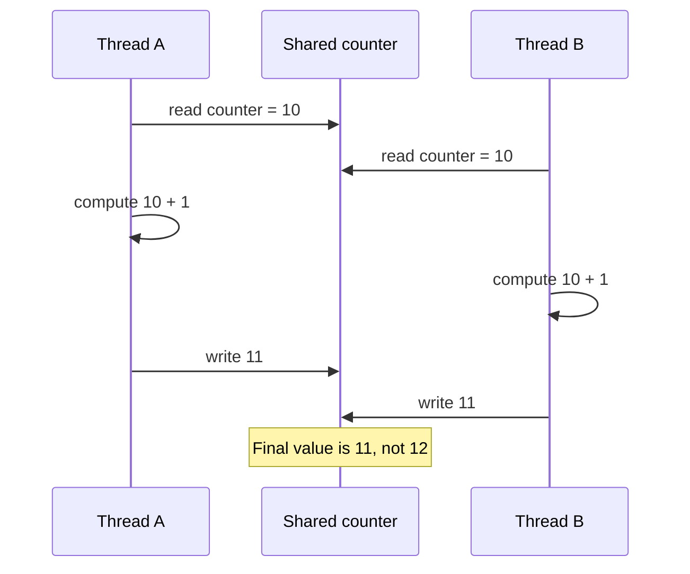
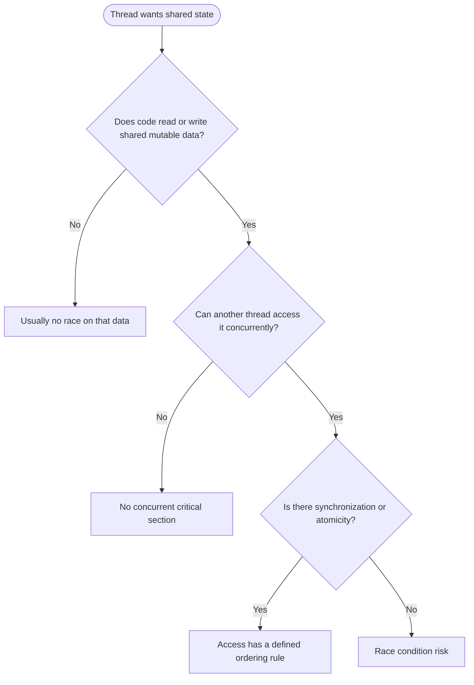
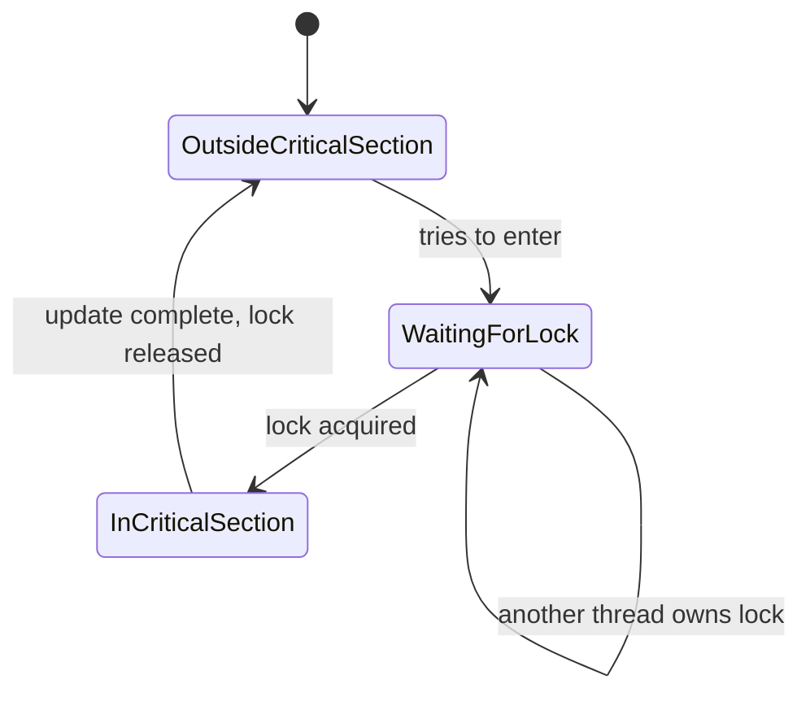

# Day 13 - Race Conditions

Difficulty: Intermediate  
Fresh Learning: 40 minutes  
Revision: 5 minutes  
Prerequisites: Day 11 - Thread Basics; Day 12 - Multithreading Models; shared address space; basic CPU scheduling  
Why this topic matters in interviews: Race conditions test whether you understand that concurrency bugs are not only about syntax or speed. They are about correctness when multiple execution flows touch shared state in unpredictable orders.

Imagine a banking app where two ATM withdrawals happen at nearly the same time. The balance is 1000. One withdrawal reads the balance, sees 1000, and plans to subtract 700. Another withdrawal also reads 1000 and plans to subtract 500. If both write back based on their stale reads, the account may end with 300 or 500 instead of rejecting one withdrawal or ending with the correct result. Nothing "crashed"; the program followed valid instructions. The bug came from timing.

That is the uncomfortable part of race conditions: the same code can appear correct in a normal test, pass many times, and then fail when the scheduler, CPU cores, interrupts, I/O timing, or runtime thread mapping changes the order of operations. Race conditions are the bridge between yesterday's multithreading models and the synchronization topics coming next. Once multiple threads share memory, correctness depends not just on what each line does, but on what can happen between lines.

## Interview Definition

A race condition occurs when the correctness of a program depends on the relative timing or interleaving of multiple threads, processes, interrupts, or asynchronous tasks accessing shared state. It usually happens when at least one execution flow writes shared data and the access is not properly synchronized.

In an interview, say: a race condition is a concurrency bug where the final result depends on unpredictable scheduling order. The common fix is to identify the critical section and protect it using atomic operations, locks, semaphores, monitors, message passing, or another synchronization strategy.

## Key Definitions

- Shared data: memory, file state, database rows, counters, queues, caches, or device state visible to more than one execution flow.
- Critical section: a region of code that accesses shared state and must not be executed concurrently in an unsafe way.
- Race condition: a correctness bug caused by timing-dependent access to shared state.
- Data race: a lower-level case where two threads access the same memory location concurrently, at least one access is a write, and there is no proper synchronization.
- Atomic operation: an operation that appears indivisible to other threads.
- Interleaving: the order in which steps from multiple execution flows are mixed by the scheduler or hardware.
- Lost update: a race where two updates are based on old values and one update overwrites the effect of the other.
- Mutual exclusion: a guarantee that only one thread enters a protected critical section at a time.

## Mental Model

Think of shared state as a whiteboard in a meeting room. Several people can read it, calculate something on paper, and write a new value back. If two people read the same old number before either writes, their later writes may conflict. The whiteboard itself is not wrong. The problem is that "read, modify, write" was treated like one action even though it is really multiple steps.

The useful interview mental model is:

- Shared state is the whiteboard.
- A thread is a person making a decision.
- A critical section is the part where the person reads, decides, and writes back.
- A lock is the room key that allows only one person to modify the whiteboard at a time.
- Atomicity means other people cannot observe the half-finished middle of the update.

Do not reduce this to "threads run at the same time." Race conditions can happen on a single-core machine too, because preemption can switch threads between instructions. Parallel cores make the problem easier to trigger, but the logical bug is the unsafe interleaving.

## Layer 1: What happens at a high level?

At a high level, a program has multiple execution flows: threads in the same process, worker processes using shared files, async tasks updating a cache, signal handlers touching global state, or interrupt handlers updating kernel structures. These flows may all access a common resource.

If all flows only read immutable data, there is usually no race. If one flow writes and another reads or writes the same state, the program needs a rule about ordering. Without that rule, the final state can depend on scheduling. The scheduler is allowed to pause a thread after almost any instruction. On a multicore system, two cores can also execute instructions truly simultaneously.

A simple counter increment looks harmless:

```c
counter++;
```

But at the machine level it is closer to:

```txt
load counter into register
add 1 to register
store register back to counter
```

If two threads both load `counter = 10`, both add one, and both store 11, one increment is lost. The programmer expected 12. The program produced 11. That is the lost update problem.

The high-level question is therefore: which pieces of code must be treated as one logical unit even though the CPU executes them as many smaller steps?

## Layer 2: What happens inside the OS?

The OS scheduler decides which runnable threads get CPU time. In a one-to-one threading model, the kernel can schedule different threads from the same process independently. Those threads share the process address space, so they can access the same heap objects, global variables, file descriptors, and memory-mapped regions.

The OS does not automatically know which variables form your application invariant. It sees instructions, memory pages, registers, and scheduling states. It cannot infer that `balance`, `transaction_log`, and `last_updated` must change together. That correctness rule belongs to the program.

When a thread enters a critical section, a synchronization primitive creates an ordering rule. For example:

- A mutex makes other threads wait before entering the same protected region.
- A semaphore limits how many threads can enter a resource pool.
- An atomic instruction updates a small value without a visible middle state.
- A condition variable lets a thread sleep until a shared condition becomes true.
- Message passing avoids sharing writable memory directly.

Inside the kernel, synchronization is also everywhere. The scheduler's ready queues, file descriptor tables, page cache metadata, device driver queues, and networking buffers are shared by many CPUs and interrupts. Kernel code must protect its own critical sections using spinlocks, mutexes, atomic operations, per-CPU data, interrupt disabling in narrow cases, or lock-free structures.

## Layer 3: What happens at hardware or kernel level?

At the hardware level, race conditions become sharper because CPUs do not simply execute source lines one by one in a globally obvious order. A modern CPU has registers, private caches, store buffers, instruction pipelines, memory-ordering rules, and cache-coherence protocols. Compilers also optimize code by reordering or caching values when the language rules allow it.

Consider two threads on two CPU cores. Both may cache the same memory line. When one core writes, the hardware coherence protocol eventually makes the write visible to the other core. But "eventually visible" is not the same as "safe program order." Without synchronization, one thread may observe stale data or observe related writes in an unexpected order depending on architecture and language memory model.

This is why correct synchronization is not just about blocking. It also creates memory visibility guarantees. A lock acquire and release usually act as ordering boundaries: writes made before releasing a lock become visible to a thread after it acquires the same lock. Atomic operations can provide similar guarantees depending on their memory order.

In the kernel, interrupt handlers create another race source. Suppose normal kernel code updates a device queue while an interrupt handler also updates it when the device completes I/O. If the normal path is interrupted in the middle of a queue update, the handler may see inconsistent state. Kernel code often needs special rules to protect data shared with interrupt context.

## Layer 4: What can go wrong?

Race conditions usually fail in ways that look random:

- A counter is slightly wrong under load.
- A queue loses an item or processes the same item twice.
- A bank balance, inventory count, or reference count becomes incorrect.
- A cache says data exists while the backing object was already deleted.
- A file is written with mixed content from two writers.
- A process crashes because one thread frees memory while another still uses it.
- A server works in testing but fails when requests arrive concurrently.

The hardest part is that adding logs can hide the bug. Logging changes timing. Running under a debugger changes timing. Using a slower machine changes timing. That is why interviewers care about reasoning: you cannot rely only on "it passed once."

## Step-by-Step Flow

Here is a lost-update race on a shared counter:

1. `counter` starts at 10.
2. Thread A reads `counter` into a register and gets 10.
3. The scheduler preempts Thread A before it stores the result.
4. Thread B reads `counter` into a register and also gets 10.
5. Thread B adds 1 and stores 11.
6. Thread A resumes, adds 1 to its old register value, and stores 11.
7. Two increments were requested, but the final value is 11 instead of 12.

Here is the same flow with a mutex:

1. Thread A acquires the mutex.
2. Thread A reads, modifies, and writes `counter`.
3. Thread B tries to acquire the mutex and blocks or waits.
4. Thread A releases the mutex.
5. Thread B acquires the mutex.
6. Thread B reads the updated value, modifies it, and writes the correct next value.

## Diagram Section



This sequence diagram shows why `counter++` is not automatically safe. The two reads happen before either update sees the other's write.



This flowchart is a practical interview test: shared mutable state plus concurrent access plus missing ordering is where race conditions live.



This state diagram connects race conditions to the next topic: synchronization. The point of the lock is not decoration; it serializes the unsafe region.

## Practical System Relevance

In Linux, threads in the same process share an address space, open file table references, signal dispositions, and other process resources. Kernel code must protect internal shared structures because many CPUs can enter kernel code at once. You see the practical effect in tools like `top` or `ps -L`, where a process can have multiple schedulable threads.

In Windows, the scheduler also schedules threads, not "the process" as a single running object. GUI applications often require UI state to be touched from a main UI thread because concurrent updates to widgets can create races and inconsistent state.

In Android, touching UI elements from background threads is restricted. Long work moves to workers, but UI state changes must be coordinated back to the main thread. This is a race-prevention design, not just a style rule.

In browsers, multiple processes and threads isolate work: rendering, networking, JavaScript execution, compositing, and storage may be separated. Shared caches and event queues still need ordering rules. JavaScript avoids many shared-memory races in normal single-threaded event-loop code, but Web Workers and shared buffers reintroduce explicit synchronization concerns.

In databases, race conditions appear as lost updates, dirty reads, double booking, inconsistent indexes, or incorrect inventory counts. Transactions, isolation levels, row locks, compare-and-swap updates, and optimistic concurrency checks exist because shared data correctness is difficult under concurrent requests.

In servers and cloud systems, race conditions appear in request counters, token refresh logic, distributed locks, cache invalidation, job queues, and idempotency handling. A race can happen across machines too, not only inside one process, when two services update the same external resource.

## Code or Pseudocode Section

Unsafe increment:

```c
int counter = 0;

void *worker(void *arg) {
    for (int i = 0; i < 100000; i++) {
        counter++; // not guaranteed atomic
    }
    return NULL;
}
```

The bug is not that `counter++` is invalid C syntax. The bug is that it expands to a read-modify-write sequence, and multiple threads can interleave in the middle.

Mutex-protected increment:

```c
pthread_mutex_t lock = PTHREAD_MUTEX_INITIALIZER;
int counter = 0;

void *worker(void *arg) {
    for (int i = 0; i < 100000; i++) {
        pthread_mutex_lock(&lock);
        counter++;
        pthread_mutex_unlock(&lock);
    }
    return NULL;
}
```

The mutex makes the increment critical section mutually exclusive. The protected region should be as small as practical: large enough to protect the invariant, but not so large that it destroys concurrency.

Atomic-style pseudocode:

```c
atomic_fetch_add(&counter, 1);
```

Atomic operations are useful for small independent updates like counters and flags. They are not a universal replacement for locks. If an invariant spans multiple variables, a single atomic increment may not protect the whole logical operation.

## Common Misconceptions

- "Race conditions require multiple CPU cores." False. A single-core system can switch threads between instructions and create unsafe interleavings.
- "`counter++` is one operation." False at the level that matters for concurrency. It usually involves load, modify, and store.
- "If I cannot reproduce it, it is not a bug." False. Race conditions are timing-sensitive and may be rare.
- "Locks make code correct automatically." False. The lock must protect the right data, and all access paths must follow the same rule.
- "Atomic variables solve every race." False. Atomics help with small values and carefully designed lock-free protocols, but complex invariants often need broader synchronization.
- "Race condition and deadlock are the same." False. A race is unsafe timing-dependent access. A deadlock is a set of flows stuck waiting forever.
- "Only writes matter." In practice, a read racing with a write can observe inconsistent or stale state and produce incorrect decisions.
- "Thread-safe means fast." Thread-safe means correct under concurrency. It may be slower, and performance must be designed separately.

## Tricky Interview Corners

The first tricky corner is the difference between a race condition and a data race. A data race is usually defined narrowly: unsynchronized conflicting access to the same memory location. A race condition is broader: the program's correctness depends on timing. You can have timing races involving files, messages, database rows, external APIs, or check-then-act logic even if there is no low-level shared-memory data race.

The second tricky corner is check-then-act. Code like "if file does not exist, create it" can race if another process creates the file after the check but before the create. The fix is often an atomic create operation, not just another check.

The third tricky corner is read-modify-write. Increment, decrement, append, remove, transfer money, and update inventory often look like one business action but contain multiple lower-level operations.

The fourth tricky corner is memory visibility. One thread may write `ready = true` while another waits for it, but without synchronization the waiting thread may not reliably see related data writes in the intended order.

The fifth tricky corner is that over-locking can hurt performance or create deadlocks, but under-locking creates races. Correct design chooses the right granularity.

## Comparison Tables

| Concept | Meaning | Interview trap |
|---|---|---|
| Race condition | Correctness depends on timing/interleaving | Broader than only shared-memory bugs |
| Data race | Unsynchronized conflicting access to same memory | A specific low-level race pattern |
| Critical section | Code that must be protected | Must include the full invariant, not just one line |
| Atomic operation | Indivisible with respect to other threads | Not enough for every multi-variable invariant |
| Deadlock | Threads wait forever in a cycle or dependency | Different from wrong result due to timing |

| Protection method | Good for | Watch out for |
|---|---|---|
| Mutex | Multi-step critical sections | Deadlock, contention, forgotten unlock |
| Atomic operation | Counters, flags, small state transitions | Hard memory-order reasoning |
| Semaphore | Bounded resources | Does not express ownership like a mutex |
| Message passing | Avoiding shared writable memory | Queue ordering and backpressure |
| Database transaction | Shared persistent data | Isolation level matters |

## How to Explain This in an Interview

### 30-second answer

A race condition happens when multiple threads or processes access shared state and the program's correctness depends on their timing. The classic example is two threads incrementing a shared counter: both read the same old value, both compute a new value, and one update is lost. We prevent it by identifying the critical section and enforcing synchronization with locks, atomics, transactions, or message passing.

### 2-minute answer

Race conditions appear because source-level operations are often not atomic. A line like `counter++` is a read-modify-write sequence. The scheduler may switch threads after the read and before the write, or two CPU cores may execute the sequence at the same time. If both threads use stale values, the final state becomes wrong. The fix starts by finding shared mutable state and defining which operations must be atomic from the program's perspective. Then we choose a mechanism: mutex for multi-step shared state, atomic operations for small independent updates, condition variables when threads wait for state changes, or transactions for database state. A strong answer also mentions that race conditions are timing-sensitive and may disappear under debugging because timing changes.

### Deeper follow-up answer

At the OS and hardware level, the kernel schedules threads independently, and threads in the same process share address space. Hardware caches and compiler optimizations mean memory visibility also matters. Synchronization is not only about preventing two threads from entering a region; it also creates ordering guarantees so one thread sees another thread's writes consistently. Race conditions are therefore solved by designing a clear happens-before relationship around shared state.

## Interview Questions

### Basic Questions

1. What is a race condition?
2. What is a critical section?
3. Why is `counter++` not necessarily thread-safe?
4. What is a lost update?
5. Can race conditions happen on a single-core CPU?

### Intermediate Questions

6. How would you fix a race condition in a shared counter?
7. What is the difference between a race condition and a deadlock?
8. What is the difference between a race condition and a data race?
9. Why can logging or debugging hide a race condition?
10. When would you prefer an atomic operation over a mutex?

### Advanced Questions

11. How does memory visibility relate to race conditions?
12. Why might a check-then-act pattern be unsafe?
13. How can database transactions prevent lost updates?
14. What problems can happen if a critical section is too large?
15. How do race conditions appear in distributed systems?

## Follow-Up Questions

Q: What is a race condition?  
Follow-ups:
- What shared state is involved?
- Which interleaving causes the wrong result?
- Is the problem a data race or a broader timing race?

Q: Why is `counter++` unsafe?  
Follow-ups:
- What machine-level steps are hidden inside it?
- Can an atomic increment fix it?
- What if the update also changes another variable?

Q: How do you fix a race?  
Follow-ups:
- What is the critical section?
- Would you use a mutex, atomic operation, transaction, or message queue?
- What are the performance and deadlock risks?

Q: Can a race happen without threads?  
Follow-ups:
- What about processes sharing files?
- What about two services updating the same database row?
- What about signal handlers or interrupt handlers?

Q: How do you test for race conditions?  
Follow-ups:
- Why are they hard to reproduce?
- How can stress tests help?
- Why is reasoning still required?

## Trick Questions

1. Q: If a program runs correctly 1000 times, is it free of race conditions?  
   Expected answer: No. Timing-sensitive bugs may require a rare interleaving.

2. Q: Does a single CPU core eliminate race conditions?  
   Expected answer: No. Preemption can switch threads in the middle of a non-atomic operation.

3. Q: If two threads only read the same variable, is that a race?  
   Expected answer: Usually no for immutable stable data. Races require conflicting access or timing-dependent correctness.

4. Q: Is every race condition a deadlock?  
   Expected answer: No. A race often produces a wrong result; a deadlock means execution gets stuck.

5. Q: Does making a variable `volatile` fix a shared counter race?  
   Expected answer: No. `volatile` is not a general mutual-exclusion or atomicity mechanism.

6. Q: Can a database application have race conditions even if it has no shared memory?  
   Expected answer: Yes. Concurrent transactions can race on persistent rows, inventory counts, bookings, or uniqueness checks.

7. Q: If you add a lock around only the write, is the race fixed?  
   Expected answer: Not necessarily. The entire read-modify-write invariant must be protected.

## Practical Debugging / Observation

Useful commands and techniques:

```bash
ps -L -p <pid>
top -H -p <pid>
strace -f ./program
perf top
```

What to observe:

- `ps -L` or `top -H` can show threads inside a process on Linux.
- `strace -f` follows threads/processes and can reveal blocking system calls, futex waits, file races, and process interactions.
- Repeated stress runs can make rare interleavings more likely.
- Thread sanitizers in compiled languages can detect many data races during testing.

Practical debugging rule: first identify the shared state, then list every path that reads or writes it, then check whether all paths follow the same synchronization rule.

## Mini Quiz

### MCQs

1. A race condition depends on:
   A. File size only  
   B. Timing or interleaving of execution flows  
   C. Whether the program has a GUI  
   D. Whether the CPU is old  

2. `counter++` is unsafe because it is usually:
   A. A single uninterruptible operation  
   B. A read-modify-write sequence  
   C. A system call  
   D. A deadlock  

3. A critical section is:
   A. Any slow code  
   B. Code that accesses shared state and needs protection  
   C. Only kernel code  
   D. Only code with loops  

4. Which can prevent a lost update on a shared in-memory counter?
   A. Mutex or atomic increment  
   B. More logging only  
   C. Bigger stack  
   D. Renaming the variable  

5. Race conditions can happen:
   A. Only on multicore systems  
   B. Only in databases  
   C. In threads, processes, kernels, databases, and distributed services  
   D. Only in C programs  

### Short-answer questions

1. Define lost update in one sentence.
2. Why can adding logs hide a race condition?
3. What is the difference between a mutex and an atomic increment?

### Reasoning questions

1. Two users buy the last ticket at the same time. Both requests check availability before either updates the database. What is the race and how would you fix it?
2. A cache has `isLoaded = true` but the data pointer is still null in another thread. What kind of synchronization mistake might cause this?

### Answers

1. B
2. B
3. B
4. A
5. C

Short answers:

1. A lost update occurs when two operations read the same old value and one write overwrites the effect of the other.
2. Logging changes timing, often slowing or reordering execution enough to hide the unsafe interleaving.
3. A mutex protects a region of code or invariant; an atomic increment protects one small indivisible update.

Reasoning answers:

1. The race is check-then-act on shared inventory. Fix with a transaction, row lock, atomic conditional update, or unique constraint plus retry logic.
2. The writer likely published the readiness flag without a proper ordering guarantee, so another thread observed the flag before the data write was safely visible.

# 5-Minute Revision Column

Revision targets: Day 12 - Multithreading Models (R1); Day 10 - Scheduling Algorithms Part 2 (R2).

## Day 12 - Multithreading Models (R1 Recall Revision)

- Core recall: A multithreading model explains how user-level threads created by an application or runtime map to kernel-level threads scheduled by the OS. Many-to-one is cheap but cannot use multiple cores and may block as a group. One-to-one enables parallelism and independent blocking but can create many expensive OS threads. Many-to-many multiplexes many logical threads over a controlled number of kernel threads.
- Key definitions: user-level thread means runtime-managed execution; kernel-level thread means OS-visible schedulable execution; thread pool means a bounded set of reusable worker threads.
- Mental model: user threads are work tickets; kernel threads are licensed drivers. More tickets do not mean more drivers or more CPU cores.
- Common traps: multithreading does not always mean parallelism; a process owns resources, but its threads are what the scheduler runs.
- Quick interview questions: If one user-level thread blocks in a many-to-one model, what can happen? Why do servers use thread pools instead of creating unlimited threads?

## Day 10 - Scheduling Algorithms Part 2 (R2 Compression Revision)

- Round Robin gives each ready process a fixed time quantum, then preempts unfinished work and moves it to the back of the queue.
- A tiny quantum improves apparent responsiveness only up to a point; too tiny means excessive context-switch overhead.
- An extremely large quantum behaves close to FCFS because processes keep the CPU for long stretches.
- Multilevel Queue uses fixed queues, while Multilevel Feedback Queue allows movement between queues based on observed behavior.
- MLFQ does not know the future CPU burst; it approximates behavior by rewarding interactive tasks and demoting CPU-heavy tasks.

Definitions: time quantum is the maximum CPU slice per turn; response time is the delay until a job first gets CPU attention.

Traps: fairness does not mean minimum waiting time; low-priority queues can starve without aging or periodic boosts.

Quick interview questions: Why does quantum size matter in Round Robin? How does MLFQ reduce starvation compared with fixed-priority queues?

## Final Takeaway

Race conditions happen when shared mutable state meets unpredictable execution order without a clear synchronization rule. The key skill is not memorizing the word "race"; it is spotting the hidden multi-step operation behind a simple line of code. Reads, writes, checks, updates, and publishes must be protected when another execution flow can observe or modify the same state. Correct fixes define a critical section or an atomic state transition and then enforce it consistently.

## What You Should Be Able To Answer Now

- Define a race condition in interview-ready language.
- Explain why `counter++` can lose updates.
- Identify the critical section in a shared-state example.
- Distinguish race condition, data race, and deadlock.
- Explain why races can happen on a single-core CPU.
- Choose between mutexes, atomics, transactions, and message passing for common scenarios.
- Explain why debugging can hide timing-sensitive concurrency bugs.
- Connect race conditions to real systems such as kernels, databases, Android UI, browsers, and servers.
