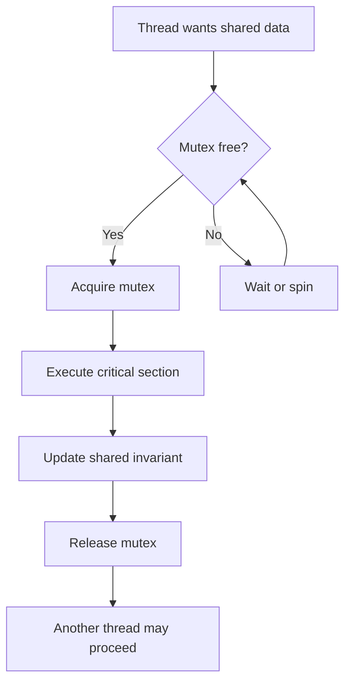
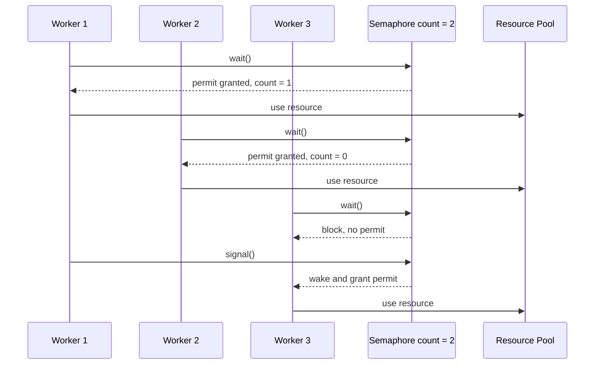

# Day 14 - Mutex, Locks, and Semaphores

Difficulty: Intermediate  
Fresh Learning: 40 minutes  
Revision: 5 minutes  
Prerequisites: Day 13 - Race Conditions; critical sections; shared address space; basic thread scheduling  
Why this topic matters in interviews: Interviewers often probe whether you know the semantic difference between a mutex, a binary semaphore, and a counting semaphore, and whether you can choose the right primitive without creating races, deadlocks, starvation, or unnecessary performance loss.

Imagine an online ticketing server selling the last seat for a concert. Two requests arrive at nearly the same time. Both read "1 seat left." Both try to reserve it. If the update is not protected, the system may sell the same seat twice. Race conditions explained the bug yesterday. Today is about the tools used to stop that bug from happening.

Locks, mutexes, and semaphores are operating-system synchronization tools. They exist because threads are useful only if shared state can be protected. Without synchronization, shared memory becomes fast but unsafe. With synchronization, the OS and runtime can enforce rules such as "only one thread may update this data at a time" or "only five threads may use this limited resource at once."

The key idea is not "add a lock everywhere." The key idea is to protect the correct critical section with the correct primitive for the invariant you care about.

## Interview Definition

A mutex is a mutual-exclusion lock that allows only one thread to enter a protected critical section at a time, usually with ownership: the thread that locks it should unlock it. A semaphore is a synchronization counter controlled by wait and signal operations; it can represent either a single permit or multiple identical permits. Locks are the general idea of restricting access; mutexes and semaphores are specific tools used to implement coordination.

In an interview, say: use a mutex to protect shared data that must be modified by one thread at a time. Use a counting semaphore to limit access to a fixed number of identical resources, such as database connections. A binary semaphore can behave like a one-permit gate, but unlike a mutex it is usually not ownership-based.

## Key Definitions

- Lock: a general synchronization mechanism that restricts access to a critical section or resource.
- Mutex: a mutual-exclusion lock with ownership; one thread acquires it, enters the critical section, and the same thread releases it.
- Critical section: code that accesses shared mutable state and must be protected from unsafe concurrent execution.
- Binary semaphore: a semaphore with only 0 or 1 permit available.
- Counting semaphore: a semaphore whose count represents multiple available permits for identical resources.
- Wait/P operation: decrements a semaphore if a permit is available; otherwise blocks or waits.
- Signal/V operation: increments a semaphore and may wake a waiting thread.
- Blocking lock: a lock that puts the waiting thread to sleep when the lock is unavailable.
- Spinlock: a lock where the waiting thread repeatedly checks until the lock becomes available.
- Ownership: the rule that the thread that acquired the lock is responsible for releasing it.

## Mental Model

Think of a mutex as the only key to a small room where a shared whiteboard is updated. If one person has the key, nobody else can enter and modify the whiteboard. The key is owned: the person who took it must return it.

Think of a counting semaphore as a tray of limited entry passes. If a database pool has five connections, the tray starts with five passes. A worker must take one pass before using a connection and return it when done. The pass does not necessarily identify a specific connection by itself; it controls the number of concurrent users.

The useful interview distinction is:

- Mutex protects correctness of a shared invariant.
- Semaphore controls availability of permits.
- Binary semaphore can look like a lock, but the ownership semantics are different.
- Spin versus block is about what a waiting thread does while it cannot proceed.

## Layer 1: What happens at a high level?

At a high level, synchronization creates an ordering rule around shared state. Yesterday's race-condition example showed that `counter++` is not one indivisible operation. It is a read, a modification, and a write. A mutex makes that entire logical update behave like a protected region.

Without a mutex:

```txt
Thread A reads counter = 10
Thread B reads counter = 10
Thread A writes counter = 11
Thread B writes counter = 11
```

The expected result was 12, but the actual result is 11.

With a mutex:

```txt
Thread A locks mutex
Thread A reads counter = 10
Thread A writes counter = 11
Thread A unlocks mutex
Thread B locks mutex
Thread B reads counter = 11
Thread B writes counter = 12
Thread B unlocks mutex
```

The scheduler may still switch between threads, but it cannot let both threads execute the protected counter update at the same time if both follow the same mutex rule.

Semaphores solve a related but different problem. Suppose a server has only 10 database connections. You do not want one thread at a time; you want up to 10 threads at a time. A counting semaphore starts at 10. Each worker waits before using the pool and signals when it returns the resource. If all 10 permits are in use, the next worker waits.

## Layer 2: What happens inside the OS?

Inside the OS or threading runtime, a mutex is represented by small shared state: locked or unlocked, optional owner thread, and a queue or list of waiters. When a thread tries to acquire a locked mutex, the implementation must choose whether to spin briefly, block, or use a hybrid strategy.

Blocking usually means the thread is moved out of the running state and placed into a waiting state. The scheduler can give the CPU to another runnable thread. When the mutex is released, one or more waiting threads may be woken and moved back to the ready queue.

Semaphore internals are similar, but the central value is a counter rather than a simple owned lock. A wait operation checks the count:

- If count is greater than 0, decrement it and proceed.
- If count is 0, block or wait.

A signal operation increments the count or wakes a waiting thread. In many implementations, the wake-up and counter update must be atomic so that no permit is lost.

The OS is not protecting your business rule by itself. It only enforces the primitive's rule. If one code path updates a shared list under a mutex and another code path updates the same list without the mutex, the program is still unsafe.

## Layer 3: What happens at hardware or kernel level?

At the lowest level, synchronization depends on atomic CPU instructions and memory-ordering rules. A lock implementation needs a way to change lock state without two cores both believing they acquired the same lock. CPUs provide instructions such as test-and-set, compare-and-swap, exchange, load-linked/store-conditional, or similar atomic operations depending on architecture.

A simplified spinlock acquisition might look like this:

```c
while (atomic_exchange(&lock, 1) == 1) {
    // keep trying until the old value was 0
}
```

The atomic exchange is the important part. If two CPU cores execute it at the same time, the hardware still serializes the update so only one core observes the unlocked value first.

Kernel implementations also care about memory visibility. Lock acquire and lock release often act as memory barriers. That means writes made inside the critical section become visible in the right order to another thread that later acquires the same lock. Without these ordering guarantees, one CPU core might see stale or reordered values.

In kernel code, spinlocks are common when the protected section is tiny and sleeping is not allowed, such as in interrupt-sensitive paths. In user-level application code, blocking mutexes are usually preferred for longer waits because spinning wastes CPU time.

## Layer 4: What can go wrong?

Synchronization fixes races only when used correctly. It can also introduce new problems.

Deadlock happens when threads wait forever for resources held by each other. For example, Thread A holds `lock_user` and waits for `lock_account`, while Thread B holds `lock_account` and waits for `lock_user`.

Starvation happens when a thread keeps waiting because other threads repeatedly get the lock first. This can happen with unfair locks or priority scheduling interactions.

Priority inversion happens when a low-priority thread holds a lock needed by a high-priority thread, while medium-priority threads keep running and delay the low-priority thread from releasing the lock. Some systems use priority inheritance to reduce this.

Performance collapse happens when the lock is too coarse. If every operation grabs one global lock, threads spend more time waiting than doing useful work.

Incorrect release is also dangerous. Releasing a mutex from a thread that did not acquire it may be an error. Signaling a semaphore too many times can create phantom permits and allow too many threads into a resource-limited region.

## Step-by-Step Flow

### Mutex-protected update

1. Thread reaches code that updates shared state.
2. Thread calls `lock(mutex)`.
3. If the mutex is free, the thread becomes the owner.
4. If the mutex is already locked, the thread waits or spins depending on implementation.
5. The owner executes the critical section.
6. The owner updates the shared invariant completely.
7. The owner calls `unlock(mutex)`.
8. The mutex becomes available and one waiting thread may be woken.

### Counting semaphore resource access

1. A resource pool starts with N equivalent resources.
2. The semaphore count is initialized to N.
3. A worker calls `wait(semaphore)` before using the pool.
4. If count is positive, count is decremented and the worker proceeds.
5. If count is zero, the worker waits.
6. After using the resource, the worker calls `signal(semaphore)`.
7. The count increases or a waiting worker is allowed to proceed.

## Diagram Section

### Mutex critical-section flow



This diagram shows why the mutex must wrap the entire invariant update, not only one assignment line. The protected region should contain the full read-modify-write sequence.

### Counting semaphore permits



The semaphore is not protecting one specific object like a mutex usually does. It is limiting how many workers can use a set of equivalent resources at the same time.

### Lock-order deadlock risk


The fix is usually to enforce a consistent lock ordering rule, reduce nested locks, use timeouts carefully, or redesign the shared-state ownership.

## Practical System Relevance

In Linux user programs, POSIX mutexes and semaphores are common abstractions exposed through pthreads and related APIs. The kernel also uses locks internally to protect shared structures such as run queues, filesystem metadata, memory-management structures, and device-driver state. Linux often uses spinlocks in kernel paths where sleeping is not valid, and sleeping locks where waiting may take longer.

In Windows, synchronization objects include mutexes, semaphores, critical sections, events, and slim reader-writer locks. A Windows mutex can be used across processes, while a critical section is usually process-local and optimized for threads inside one process.

In Android, Java and Kotlin code often use synchronized blocks, locks, semaphores, handlers, coroutines, and executors to coordinate background work with the main UI thread. The reason UI frameworks restrict direct background-thread UI updates is that shared UI state must remain consistently ordered.

In browsers, the JavaScript main thread avoids many shared-memory races by running one event at a time, but browser engines themselves use many locks internally across rendering, networking, storage, and compositing threads. SharedArrayBuffer and Web Workers require explicit synchronization mechanisms because they reintroduce shared memory.

In databases, locks and semaphores show up as row locks, table locks, latch-like internal locks, connection-pool semaphores, transaction locks, and isolation mechanisms. A database connection pool is a classic counting-semaphore example.

In servers and cloud systems, mutexes protect in-process caches, rate-limiter counters, refresh-token state, metrics buffers, and job queues. Semaphores limit expensive concurrency: maximum uploads, maximum active database calls, maximum background jobs, or maximum outbound requests.

## Code or Pseudocode Section

### Mutex around a shared counter

```c
pthread_mutex_t lock = PTHREAD_MUTEX_INITIALIZER;
int counter = 0;

void increment(void) {
    pthread_mutex_lock(&lock);
    counter = counter + 1;
    pthread_mutex_unlock(&lock);
}
```

This demonstrates mutual exclusion. The important part is that every access path that modifies `counter` must follow the same locking rule. If one function increments without the mutex, the invariant is not protected.

### Semaphore for a connection pool

```c
sem_t permits;

void init_pool(void) {
    sem_init(&permits, 0, 5); // five connections may be used concurrently
}

void handle_request(void) {
    sem_wait(&permits);
    use_database_connection();
    sem_post(&permits);
}
```

This demonstrates capacity control. The semaphore does not say which exact connection object is used. It says only that no more than five request handlers should enter the limited region.

### Safer cleanup shape

```c
pthread_mutex_lock(&lock);
// update shared state
pthread_mutex_unlock(&lock);
```

In real code, be careful with early returns, exceptions, and error paths. Many languages provide RAII, `defer`, `finally`, or scoped locks so the release happens even if the protected code exits early.

### Observation commands

```bash
top -H -p <pid>
ps -L -p <pid>
strace -f ./program
perf top
```

Use `top -H` or `ps -L` to observe threads. Use `strace -f` to see futex-like waiting behavior on Linux when user-space mutexes need kernel help. Use performance tools to detect time spent waiting on locks, high context-switch rates, or CPU wasted in spin loops.

## Common Misconceptions

- "A mutex and a semaphore are the same." False. A mutex protects a critical section with ownership. A semaphore controls permits and may allow more than one thread.
- "A binary semaphore is always a mutex." False. It can behave like a one-permit gate, but typical semaphore semantics do not enforce the same ownership rule as a mutex.
- "Locks remove all concurrency bugs." False. They help only if they protect the correct data, all access paths obey the rule, and lock ordering is safe.
- "Spinlocks are faster than blocking locks." Not always. Spinning can be faster for tiny waits, but it wastes CPU if the lock is held for long.
- "One global lock is the safest design." It may be simple, but it can destroy concurrency and create large contention bottlenecks.
- "Semaphores are only for mutual exclusion." Counting semaphores are often better understood as capacity controllers.
- "Unlocking is just cleanup." Unlocking is part of correctness. It publishes the completed update and allows progress.
- "Volatile replaces locks." It does not provide mutual exclusion or protect compound invariants.

## Tricky Interview Corners

### Why context matters more than names

Different languages and operating systems use slightly different names. The interview goal is not to memorize every API. The goal is to explain the semantics: ownership, permit count, blocking behavior, fairness, and the invariant being protected.

### Why a mutex should be released by the owner

Ownership prevents one thread from accidentally opening a critical section while another thread is still relying on exclusive access. If non-owners could casually unlock a mutex, reasoning about shared-state correctness would become much harder.

### Why spinlocks exist at all

If a lock is held for only a few CPU instructions, putting the thread to sleep and waking it later may cost more than briefly spinning. Kernel code also has contexts where sleeping is not allowed. That is why spinlocks exist, even though they are dangerous for long waits.

### Why semaphore over-release is a serious bug

If a counting semaphore starts at 5 and code accidentally signals twice after one resource use, the count may grow beyond the real resource capacity. Then the program may allow more workers than resources, defeating the entire purpose.

### Why locks can reduce performance

Locks serialize work. If many threads fight for the same lock, a multicore program can behave like a single-threaded program plus extra overhead. Lock contention also causes context switches, cache invalidation, and scheduling delays.

## Comparison Tables

### Mutex vs Binary Semaphore vs Counting Semaphore

| Feature | Mutex | Binary Semaphore | Counting Semaphore |
|---|---|---|---|
| Main purpose | Protect shared data | One-permit signaling or gating | Limit access to N resources |
| Count | Locked/unlocked | 0 or 1 | 0 to N or more depending on use |
| Ownership | Usually yes | Usually no strict ownership | Usually no strict ownership |
| Typical use | Critical section | Signal between threads, one-slot gate | Connection pool, worker limit |
| Release rule | Owner releases | Any designed signaler may signal | Releaser returns a permit |
| Interview trap | Too broad or wrong lock | Calling it identical to mutex | Over-signaling creates phantom permits |

### Blocking vs Spinning

| Waiting style | What happens | Good for | Risk |
|---|---|---|---|
| Blocking | Thread sleeps; scheduler runs another thread | Longer waits, user apps, I/O waits | Sleep/wake overhead |
| Spinning | Thread repeatedly checks lock | Very short waits, low-level kernel paths | Wastes CPU if wait is long |
| Hybrid | Spin briefly, then block | Modern runtimes and OS locks | More complex implementation |

### Coarse-Grained vs Fine-Grained Locks

| Style | Meaning | Advantage | Disadvantage |
|---|---|---|---|
| Coarse-grained | One lock protects a large structure | Simple reasoning | High contention |
| Fine-grained | Multiple locks protect smaller parts | More concurrency | More deadlock and ordering risk |

## How to Explain This in an Interview

### 30-second answer

A mutex protects a critical section by allowing only one thread at a time, usually with ownership. A semaphore is a counter of permits: wait consumes a permit, signal returns one. Use a mutex when protecting shared data; use a counting semaphore when limiting access to a fixed number of identical resources.

### 2-minute answer

Race conditions happen when multiple threads touch shared state without a correct ordering rule. A mutex creates mutual exclusion around the critical section, so one thread completes the protected update before another enters. This is ideal for shared structures like counters, maps, queues, and account balances. A semaphore is different: it represents available permits. A binary semaphore has one permit, while a counting semaphore has multiple permits and is useful for resource pools, such as five database connections. Blocking locks put waiting threads to sleep; spinlocks keep checking and are useful only for very short waits or special kernel contexts. The main dangers are deadlock, starvation, priority inversion, forgotten unlocks, and overly broad locking.

### Deeper follow-up answer

At implementation level, lock acquisition relies on atomic CPU operations such as compare-and-swap or exchange, plus memory-ordering guarantees. If the lock is unavailable, the runtime may spin briefly or ask the kernel to block the thread. On release, waiting threads may be woken. Correctness depends on all access paths obeying the same synchronization discipline. Performance depends on keeping critical sections short, choosing the right granularity, avoiding lock-order cycles, and using semaphores only for permit-style coordination rather than pretending they are always mutexes.

## Interview Questions

### Basic Questions

1. What is a mutex?
2. What is a critical section?
3. What problem does a lock solve after a race condition is identified?
4. What is a semaphore?
5. What is the difference between a binary semaphore and a counting semaphore?

### Intermediate Questions

6. How is a mutex different from a binary semaphore?
7. When would you use a counting semaphore instead of a mutex?
8. What is the difference between blocking and spinning?
9. Why should critical sections usually be short?
10. What can go wrong if a lock is not released on every path?

### Advanced Questions

11. Why are atomic CPU instructions needed to implement locks?
12. How can a lock introduce deadlock?
13. What is priority inversion, and how can priority inheritance help?
14. Why can fine-grained locking improve performance but increase complexity?
15. Why is over-signaling a semaphore dangerous?

## Follow-Up Questions

Q: What is a mutex?  
Follow-ups:
- What does ownership mean?
- Can two threads hold the same mutex at the same time?
- What should happen if a thread tries to lock an already locked mutex?
- What is the difference between recursive and non-recursive mutex behavior?

Q: How is a semaphore different from a mutex?  
Follow-ups:
- Why is a counting semaphore useful for a resource pool?
- Can a semaphore allow more than one thread through?
- What happens when the semaphore count is zero?
- Why can a binary semaphore still be semantically different from a mutex?

Q: Why are spinlocks sometimes used?  
Follow-ups:
- Why are they bad for long waits?
- Why might kernel code use them?
- What happens to CPU utilization while spinning?
- What is a hybrid lock strategy?

Q: How do locks cause deadlock?  
Follow-ups:
- What is circular wait?
- How does lock ordering help?
- Can timeouts solve deadlock completely?
- Why will deadlocks appear in the next OS topic sequence?

Q: What makes a good critical section?  
Follow-ups:
- Should I include I/O inside a lock?
- What happens if the section is too broad?
- What happens if the section is too narrow?
- How do you decide which data a lock protects?

## Trick Questions

Q: If a semaphore has count 1, is it always exactly the same as a mutex?  
Expected answer: No. It can create similar mutual exclusion, but a mutex usually has ownership rules and is intended to protect a critical section. A binary semaphore is a one-permit synchronization counter and may be used for signaling.

Q: If code uses a lock, is it automatically thread-safe?  
Expected answer: No. The lock must protect the right invariant, and every access path must follow the same rule.

Q: Is a spinlock always faster because it avoids sleep and wake-up?  
Expected answer: No. It can be faster for very short waits, but wastes CPU when the wait is long.

Q: Can a counting semaphore accidentally allow too much concurrency?  
Expected answer: Yes. If code signals too many times or initializes the count incorrectly, the semaphore can expose more permits than real resources.

Q: Should a mutex be held while doing slow network I/O?  
Expected answer: Usually no. Holding a lock across slow I/O increases contention and can cause severe latency or deadlock risks.

Q: Does a lock prevent context switches?  
Expected answer: No. The scheduler can still switch threads. The lock prevents other cooperating threads from entering the protected critical section.

Q: Can two different locks still protect the same data safely?  
Expected answer: Only with a very clear protocol. If different code paths use different locks for the same invariant, the data is usually not truly protected.

## Practical Debugging / Observation

When a program has synchronization issues, symptoms often look indirect: high CPU usage, low throughput, rare wrong results, hung requests, or threads waiting forever.

Useful observations:

```bash
ps -L -p <pid>
top -H -p <pid>
strace -f -p <pid>
perf top
```

What to look for:

- Many threads sleeping can mean blocking on locks, I/O, or condition variables.
- High CPU with little progress can mean spinning, busy waiting, or lock contention.
- A process stuck in futex-related waits on Linux often indicates user-space synchronization that needed kernel blocking.
- Long request latency with low CPU can mean threads are blocked on a shared resource, connection pool, or global lock.
- Rare wrong results usually point back to missing or incomplete synchronization, not just performance.

In interviews, do not claim you would "just add more threads." If the bottleneck is lock contention or a small semaphore-limited pool, more threads can make the system worse.

## Mini Quiz

### MCQs

1. Which primitive is best for protecting one shared map from concurrent updates?
   A. Counting semaphore initialized to 100  
   B. Mutex  
   C. Sleep call  
   D. More threads  
   Answer: B

2. A semaphore initialized to 5 is best described as:
   A. A five-owner mutex  
   B. A permit counter allowing up to five concurrent entries  
   C. A CPU scheduler  
   D. A memory allocator  
   Answer: B

3. What is a major risk of holding a lock too long?
   A. More concurrency  
   B. Lower contention  
   C. Reduced throughput and higher latency  
   D. Automatic deadlock prevention  
   Answer: C

4. What does a spinlock do while waiting?
   A. Sleeps until an interrupt  
   B. Repeatedly checks for availability  
   C. Sends an email  
   D. Creates a new process  
   Answer: B

5. Why are atomic instructions needed for lock implementation?
   A. To make file systems faster  
   B. To ensure only one thread can change lock state first  
   C. To avoid all context switches  
   D. To disable virtual memory  
   Answer: B

### Short-Answer Questions

1. Define mutex in one sentence.  
   Answer: A mutex is an ownership-based mutual-exclusion lock used to allow only one thread at a time into a protected critical section.

2. Give one real use of a counting semaphore.  
   Answer: Limiting a web server to at most N active database connections from a fixed-size connection pool.

3. Why is a binary semaphore not always the same as a mutex?  
   Answer: A binary semaphore has one permit, but a mutex usually has ownership semantics and is specifically meant for critical-section protection.

### Reasoning Questions

1. A service has 200 request threads but only 20 database connections. Which primitive fits the connection limit and why?  
   Answer: A counting semaphore initialized to 20 fits because it represents 20 permits for 20 equivalent database connections.

2. Two threads deadlock because one takes lock A then B and the other takes lock B then A. What design rule helps?  
   Answer: Enforce a global lock ordering rule, such as always acquiring A before B, or redesign to avoid nested locking.

# 5-Minute Revision Column

Revision Targets:
- Day 13: Race Conditions - R1 Recall Revision
- Day 11: Thread Basics - R2 Compression Revision

## Day 13 - Race Conditions (R1)

Core recall: A race condition is a correctness bug where the final result depends on unpredictable timing or interleaving between execution flows. It usually appears when multiple threads, processes, interrupts, or async tasks access shared state and at least one writes without proper synchronization. The classic lost-update bug happens when two threads both read the same old value, compute separately, and write back a result that overwrites one update.

Key definitions:
- Shared data: state visible to more than one execution flow.
- Critical section: code that touches shared mutable state and must be protected.
- Atomic operation: an operation that appears indivisible to other threads.

Pitfalls:
- Race conditions do not require multiple CPU cores; preemption on one core is enough.
- `counter++` is not automatically atomic.
- Locks help only if they protect the entire invariant and all access paths obey the same rule.

Tricky questions:
1. If a race appears only once in a million runs, is it still a real bug? Yes.
2. If two threads only read immutable data, is that a race? Usually no.

One-line memory: Race condition = timing-dependent correctness failure on shared state.

## Day 11 - Thread Basics (R2)

Core recall:
- A process owns resources; a thread executes instructions inside those resources.
- Threads in the same process share code, heap, globals, and open files.
- Each thread has its own stack, registers, program counter, and scheduling state.
- Threads improve responsiveness and concurrency, but they make shared-memory correctness harder.
- Too many threads can increase context switching, memory use, and lock contention.

Definitions:
- Thread: smallest schedulable execution unit inside a process.
- TCB: thread-specific metadata needed to stop and resume a thread.

Example: A browser can use threads for networking, rendering, background work, and UI responsiveness while sharing process resources.

Pitfalls:
- Threads are not the same as processes.
- Threads are not always faster; synchronization overhead can dominate.

Tricky questions:
1. Do threads in the same process share the same stack? No.
2. If one kernel-level thread blocks on I/O, can another thread in the same process run? Yes, if it is ready.

One-line memory: Threads are cheap execution paths inside a process, powerful because they share memory and risky for the same reason.

## Final Takeaway

Mutexes, locks, and semaphores are synchronization tools used to turn unsafe concurrent access into controlled coordination. A mutex is best for protecting shared data and critical sections. A counting semaphore is best for limiting access to a fixed number of identical resources. Blocking and spinning are different waiting strategies, and each has a cost. Correct synchronization requires choosing the right primitive, protecting the right invariant, keeping critical sections short, and avoiding deadlock-prone lock ordering.

## What You Should Be Able To Answer Now

- Explain why race conditions lead naturally to locks and semaphores.
- Define mutex, binary semaphore, and counting semaphore.
- Compare mutex ownership with semaphore permit counting.
- Choose between a mutex and a counting semaphore for practical scenarios.
- Explain blocking versus spinning.
- Describe how atomic CPU instructions help implement locks.
- Identify deadlock, starvation, priority inversion, and over-signaling risks.
- Answer interview follow-ups about critical-section design and lock granularity.
