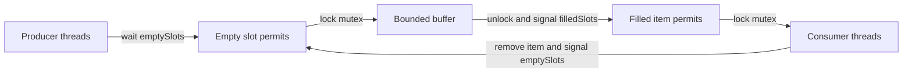
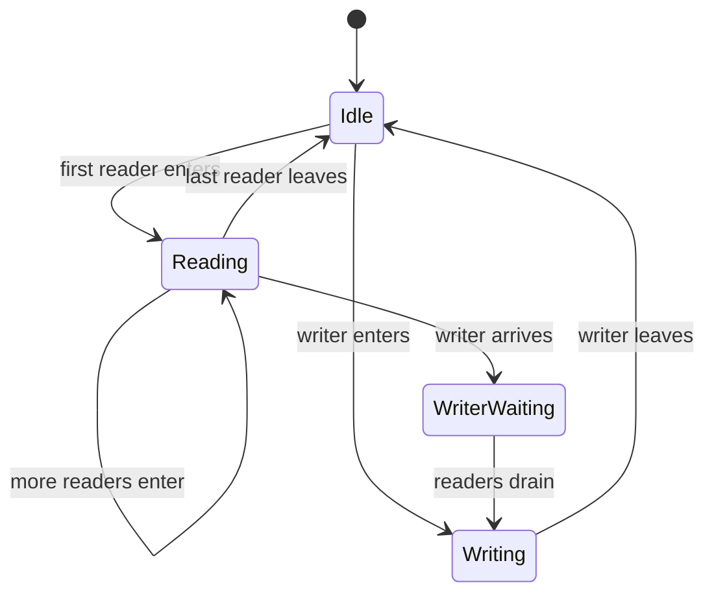
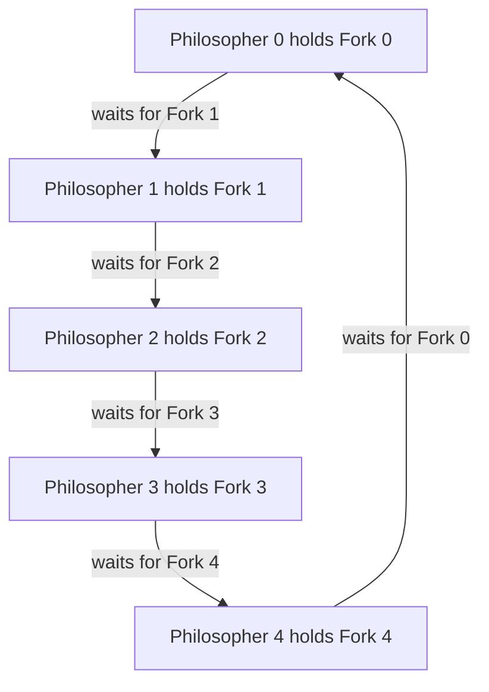

# Day 15 - Classical Synchronization Problems

Difficulty: Intermediate  
Fresh Learning: 40 minutes  
Revision: 5 minutes  
Prerequisites: Day 14 - Mutex, Locks, and Semaphores; critical sections; semaphores; basic thread scheduling  
Why this topic matters in interviews: Producer-consumer, readers-writers, and dining philosophers are standard interview problems because they test whether you can use synchronization primitives to protect correctness without accidentally creating deadlock, starvation, or wasted CPU time.

Imagine a logging service inside a busy server. Dozens of worker threads produce log records, but only one background thread writes them to disk in batches. If workers write directly to the file at the same time, lines may interleave or corrupt. If the writer checks the queue while it is empty and then sleeps forever, logs are lost. If producers keep adding faster than the writer can drain, memory grows without limit. This is not an artificial textbook story. It is the same shape as web request queues, browser event pipelines, database readers, printer spooling, and operating-system buffers.

Classical synchronization problems are reusable patterns for reasoning about this kind of coordination. They are not important because interviewers want you to memorize old names. They are important because the same problems appear whenever multiple threads share a bounded resource, read mostly shared data, or compete for several locks. These problems force you to answer three questions:

- What shared state must be protected?
- Which condition must a thread wait for before it can proceed?
- Can the waiting rule cause deadlock, starvation, or poor throughput?

Yesterday's topic gave you the tools: mutexes, binary semaphores, counting semaphores, blocking waits, and ownership. Today is about using those tools in realistic coordination designs.

## Interview Definition

Classical synchronization problems are well-known concurrency scenarios used to model common coordination challenges among threads or processes. Producer-consumer models bounded buffers, readers-writers models shared data with many readers and fewer writers, dining philosophers models circular waiting and deadlock, and sleeping barber models waiting-room capacity and service coordination. They help interviewers test whether you can combine mutual exclusion, condition synchronization, ordering, and fairness.

In an interview, say: these problems are templates for reasoning about shared state. Producer-consumer is about buffer capacity and empty/full conditions. Readers-writers is about allowing concurrent reads but exclusive writes. Dining philosophers is about avoiding circular wait. The real skill is identifying the invariant, the waiting condition, and the failure mode.

## Key Definitions

- Producer-consumer problem: a synchronization problem where producer threads add items to a shared buffer and consumer threads remove items from it.
- Bounded buffer: a fixed-capacity queue or storage area shared by producers and consumers.
- Condition synchronization: coordination where a thread waits until a required condition becomes true, such as "buffer not empty" or "buffer not full."
- Readers-writers problem: a synchronization problem where multiple readers may access shared data concurrently, but writers require exclusive access.
- Reader preference: a readers-writers policy that favors readers and can delay writers.
- Writer preference: a readers-writers policy that gives waiting writers priority and can delay readers.
- Dining philosophers problem: a deadlock-prone synchronization problem where each participant needs two shared resources and circular waiting may occur.
- Deadlock: a state where threads wait forever because each is holding a resource and waiting for another resource held by someone else.
- Starvation: a state where a thread could theoretically proceed, but is repeatedly delayed because others keep getting priority.
- Sleeping barber problem: a synchronization problem where a barber sleeps when there are no customers, customers wait if seats exist, and customers leave if the waiting room is full.

## Mental Model

Think of synchronization problems as traffic rules at shared facilities.

Producer-consumer is a delivery counter with limited shelves. Producers bring packages to the shelf. Consumers take packages from the shelf. If the shelf is full, producers must wait. If the shelf is empty, consumers must wait. A mutex protects the shelf data structure, while counting semaphores track available empty slots and filled slots.

Readers-writers is a library reading room. Many students can read the same book copy if nobody is editing it. But when a librarian updates the book, nobody should read a half-updated version. Readers can share access; writers need exclusive access. The hard part is fairness: if readers keep arriving, a writer may never get a turn.

Dining philosophers is a circular table where every person needs the fork on the left and the fork on the right. If everyone takes the left fork first and waits for the right fork, nobody can continue. The table becomes a deadlock even though every individual action looked locally reasonable.

Sleeping barber is a service desk with limited waiting chairs. If no customers exist, the worker sleeps. A new customer wakes the worker. If all waiting chairs are full, later customers leave. This is a practical model for queues with finite capacity and worker wake-up behavior.

The useful interview idea: each problem has a different invariant. Do not blindly use one lock everywhere. Identify the protected state, the wait condition, and the ordering rule.

## Layer 1: What happens at a high level?

At a high level, these problems are about coordinating progress.

In producer-consumer, two types of threads interact through a queue. Producers must not add when the queue is full. Consumers must not remove when the queue is empty. The data structure itself must not be modified concurrently without protection. That means the solution usually needs both mutual exclusion and capacity tracking.

In readers-writers, the shared resource can tolerate many readers at once because reading does not change the data. But a writer changes the data, so it must run alone. The challenge is to maximize concurrency while preserving correctness. A simple exclusive mutex around every read and write is correct but too restrictive; it destroys the benefit of parallel reads.

In dining philosophers, the issue is not a race on one variable. The issue is resource acquisition order. Each philosopher needs two resources. If the system allows every philosopher to hold one resource while waiting for the next, circular wait can form. This is a direct connection to deadlock conditions.

In sleeping barber, the problem combines queue capacity, sleep/wake behavior, and customer loss. If there are no customers, the barber should not spin forever wasting CPU. If too many customers arrive, some must leave or be rejected. This maps well to real services under bounded queue load.

## Layer 2: What happens inside the OS?

Inside an OS or runtime, synchronization problems turn into operations on shared memory, waiting queues, and scheduler decisions.

A mutex protects short critical sections where shared metadata changes. For example, the producer-consumer buffer needs protected updates to the queue head, tail, count, and array slots. Without the mutex, two producers might write to the same slot or corrupt the queue pointers.

Semaphores or condition variables represent waiting conditions. A producer does not simply check `count < capacity` once and hope it remains true. It waits on a "not full" condition. A consumer waits on a "not empty" condition. When a producer adds an item, it signals that at least one filled slot exists. When a consumer removes an item, it signals that at least one empty slot exists.

When a thread waits, the OS or runtime usually blocks it and puts it on a wait queue. It is no longer consuming CPU. When another thread signals the condition, one or more waiting threads become ready and can later be scheduled. This distinction matters in interviews: waiting on a blocking synchronization primitive is different from busy spinning.

Fairness is often policy-dependent. A readers-writers lock may prefer readers, prefer writers, or use a fair queue. Different policies affect throughput and starvation. The OS does not magically know your application invariant; the synchronization primitive and algorithm encode that policy.

## Layer 3: What happens at hardware or kernel level?

At the hardware level, the primitive building blocks are atomic operations and memory-ordering rules. A mutex or semaphore implementation may use instructions such as test-and-set, compare-and-swap, fetch-and-add, or exchange to update lock state atomically. These instructions prevent two CPU cores from both believing they acquired the same lock.

However, classical synchronization problems are usually solved above that level. You do not manually implement atomic instructions in interviews unless asked. You use a mutex, semaphore, condition variable, monitor, or read-write lock. The underlying runtime may spin briefly, then block through a kernel mechanism such as a futex-like wait, event object, or scheduler wait queue.

The hardware cache system also matters. Shared counters such as buffer count, reader count, and lock state bounce between CPU caches when many cores update them. That is why synchronization overhead can appear even when the critical section is small. A correct answer should mention that locks protect correctness but are not free.

Kernel-level behavior becomes visible when waiting threads sleep and wake. A blocked consumer is not running on the CPU; it is waiting for a wake-up event. When a producer signals, the scheduler decides when the consumer actually runs. Signal does not mean "the waiting thread runs immediately"; it means "the waiting condition may now be satisfied and a waiter can be made ready."

## Layer 4: What can go wrong?

The main failure modes are race conditions, deadlock, starvation, missed wakeups, lost signals, and poor throughput.

Race conditions happen when shared state is accessed without the correct mutual exclusion. In producer-consumer, this can corrupt the buffer. In readers-writers, this can expose a partially written value.

Deadlock happens when threads wait forever in a cycle. Dining philosophers is the classic example: each philosopher holds one fork and waits for another. The same shape appears in real systems when code grabs `lockA` then `lockB` in one place and `lockB` then `lockA` somewhere else.

Starvation happens when a policy is correct but unfair. Reader preference can starve writers if readers continuously arrive. Writer preference can delay readers heavily if a stream of writers keeps arriving.

Missed wakeups happen when signaling and waiting are not protected by the same condition discipline. A thread may check a condition, get preempted, another thread signals, and then the first thread goes to sleep even though the condition already became true. This is why condition-variable code checks the condition under a mutex and usually waits in a loop.

Poor throughput happens when the solution is correct but too coarse. One global lock may avoid races but serialize too much work. A busy wait may work in a tiny kernel path but waste CPU in normal application code.

## Step-by-Step Flow

### Producer-consumer with a bounded buffer

1. Initialize a mutex to protect the buffer structure.
2. Initialize `emptySlots` semaphore to buffer capacity.
3. Initialize `filledSlots` semaphore to 0.
4. A producer waits on `emptySlots` before adding.
5. The producer locks the mutex.
6. The producer inserts the item and updates queue metadata.
7. The producer unlocks the mutex.
8. The producer signals `filledSlots`.
9. A consumer waits on `filledSlots` before removing.
10. The consumer locks the mutex.
11. The consumer removes the item and updates queue metadata.
12. The consumer unlocks the mutex.
13. The consumer signals `emptySlots`.

The order matters. A producer should not lock the buffer and then wait forever for empty space while blocking consumers from removing items. In many designs, capacity waits happen before entering the buffer critical section.

### Readers-writers with writer fairness

1. Track the number of active readers.
2. Protect the reader count with a mutex.
3. Use a write lock to give writers exclusive access.
4. The first reader acquires the write lock so writers cannot enter.
5. Later readers increment the reader count and proceed concurrently.
6. Each reader decrements the count when leaving.
7. The last reader releases the write lock.
8. A writer acquires the write lock before modifying data.
9. The writer updates the shared resource alone.
10. The writer releases the write lock.

This simple version can prefer readers. A fairer version adds a queue or turnstile so new readers do not continuously jump ahead of waiting writers.

### Dining philosophers without deadlock

1. Place five philosophers around a table with five forks.
2. Each philosopher needs both adjacent forks to eat.
3. A naive philosopher picks up the left fork, then waits for the right fork.
4. If all philosophers do this together, every fork is held and every philosopher waits.
5. To prevent circular wait, impose an ordering rule.
6. Example: always pick up the lower-numbered fork first, then the higher-numbered fork.
7. Because resource acquisition order is consistent, a circular wait cannot form.
8. After eating, the philosopher releases both forks.

The important lesson is not the forks. The important lesson is lock ordering.

## Diagram Section

### Producer-consumer coordination



This diagram separates the two responsibilities: semaphores count buffer capacity and filled items, while the mutex protects actual queue mutation.

### Readers-writers access rule



Readers may share the resource with other readers, but writers need exclusive access. The `WriterWaiting` state is where fairness policy matters.

### Dining philosophers deadlock pattern



This cycle is the core danger. Every participant is waiting for a resource held by the next participant.

## Practical System Relevance

In Linux, producer-consumer patterns appear in kernel buffers, device-driver queues, network packet queues, pipes, logging paths, and work queues. The exact primitives vary by context: kernel code may use spinlocks where sleeping is not allowed and sleeping locks or wait queues when blocking is valid.

In Windows, synchronization objects such as mutexes, semaphores, events, condition variables, and slim reader-writer locks support the same patterns. A reader-writer lock is useful for shared configuration, routing tables, or caches that are read often and written occasionally.

In Android, producer-consumer appears between background worker threads and the main UI thread. Work is posted to queues, and the UI thread consumes messages in order. Long work on the UI thread blocks consumption and makes the app feel frozen.

In browsers, event loops, task queues, rendering pipelines, network loaders, and storage systems all use producer-consumer shapes. JavaScript hides some shared-memory complexity on the main thread, but browser engines themselves are highly concurrent.

In databases, readers-writers is central. Many transactions may read shared data, but writes need isolation. Real databases use sophisticated locks, latches, MVCC, and isolation levels, but the interview foundation starts with "readers can share, writers need exclusive access."

In servers and cloud systems, bounded buffers protect memory. A service that accepts unlimited queued work can crash under load. A bounded queue plus worker pool is a producer-consumer design with backpressure.

In containers, the host kernel still schedules threads. A containerized service with a bounded worker queue still needs synchronization. CPU quotas can make poor synchronization worse because blocked or spinning threads compete within limited CPU time.

## Code or Pseudocode Section

### Producer-consumer using semaphores

```c
semaphore emptySlots = N;
semaphore filledSlots = 0;
mutex bufferLock;

producer(item) {
    wait(emptySlots);
    lock(bufferLock);
    enqueue(item);
    unlock(bufferLock);
    signal(filledSlots);
}

consumer() {
    wait(filledSlots);
    lock(bufferLock);
    item = dequeue();
    unlock(bufferLock);
    signal(emptySlots);
    process(item);
}
```

This demonstrates the standard division of responsibility. `emptySlots` prevents overflow, `filledSlots` prevents underflow, and `bufferLock` prevents queue corruption.

### Readers-writers sketch

```c
int readerCount = 0;
mutex readerCountLock;
mutex resourceLock;

reader() {
    lock(readerCountLock);
    readerCount++;
    if (readerCount == 1) {
        lock(resourceLock);
    }
    unlock(readerCountLock);

    read_shared_data();

    lock(readerCountLock);
    readerCount--;
    if (readerCount == 0) {
        unlock(resourceLock);
    }
    unlock(readerCountLock);
}

writer() {
    lock(resourceLock);
    write_shared_data();
    unlock(resourceLock);
}
```

This version allows many concurrent readers and exclusive writers, but it can starve writers if readers keep arriving. Mention that limitation in interviews.

### Observation commands

```bash
top
ps -L -p <pid>
strace -f ./program
perf top
```

Use `top` to watch CPU usage when a program spins instead of blocking. Use `ps -L` on Linux to list threads for a process. Use `strace -f` to observe blocking system calls such as futex waits in threaded programs. The exact output depends on the program, but the idea is to distinguish CPU-burning busy waits from blocking waits.

## Common Misconceptions

- "Producer-consumer is only about queues." False. It is about bounded handoff between producers and consumers. Queues are the common implementation.
- "A mutex alone solves producer-consumer." Not enough. A mutex protects the buffer, but producers also need to wait when full and consumers need to wait when empty.
- "Readers never need synchronization because they only read." False. Readers need coordination with writers or they may observe inconsistent data.
- "Readers-writers is always faster than a normal mutex." Not always. If writes are frequent or critical sections are tiny, reader-writer lock overhead can outweigh the benefit.
- "Dining philosophers is unrealistic." The fork story is artificial, but circular wait across multiple locks is extremely real.
- "Deadlock and starvation are the same." False. Deadlock is a cycle of permanent waiting. Starvation is unfair repeated delay even though progress is possible.
- "Signal means the waiting thread immediately runs." False. It usually means a waiter becomes eligible to run; the scheduler still decides when.
- "Sleeping means the thread disappears." False. It remains blocked in a wait queue and can be made ready when the condition changes.

## Tricky Interview Corners

### Mutex plus condition is different from only mutex

A mutex answers "who can modify this state now?" A condition answers "is it meaningful for this thread to continue?" Producer-consumer needs both. Locking an empty queue does not create an item.

### Waiting must be tied to a condition

Do not say "the thread waits because another thread tells it to." Say the thread waits because a condition is false: buffer empty, buffer full, writer active, no waiting chair, or fork unavailable.

### Condition checks should usually happen in a loop

In condition-variable style code, a waiting thread should re-check the condition after waking. Another thread may have consumed the item first, or the wake-up may be spurious depending on the primitive.

### Avoid holding locks while doing slow work

In producer-consumer, the consumer should usually remove the item under lock, then process it after releasing the lock. Holding the buffer lock during slow processing blocks unrelated producers and consumers.

### Reader preference can starve writers

If new readers can always enter while a writer waits, the writer may never get the lock. A fair solution blocks new readers once a writer is waiting or uses a queue.

### Dining philosophers is solved by breaking a Coffman condition

Deadlock requires mutual exclusion, hold and wait, no preemption, and circular wait. Solutions often break circular wait with resource ordering, break hold-and-wait by acquiring both forks at once, or limit the number of philosophers trying to eat.

### Bounded queues are a form of backpressure

When a queue is full, producers wait or reject work. That is not a bug; it is how the system avoids unbounded memory growth.

## Comparison Tables

### Problem patterns

| Problem | Shared resource | Main condition | Main risk | Common primitive |
|---|---|---|---|---|
| Producer-consumer | Bounded buffer | Not empty / not full | Underflow, overflow, races | Mutex + semaphores |
| Readers-writers | Shared data | No writer active | Starvation, stale reads | Reader-writer lock |
| Dining philosophers | Multiple resources | Need both forks | Deadlock | Lock ordering |
| Sleeping barber | Waiting room and worker | Seats available / customer available | Lost wakeup, rejection | Semaphores + mutex |

### Deadlock vs starvation

| Aspect | Deadlock | Starvation |
|---|---|---|
| Meaning | Threads wait forever in a cycle | One thread repeatedly loses access |
| Progress elsewhere | Often no progress in the cycle | Other threads may keep progressing |
| Typical cause | Circular wait over resources | Unfair scheduling or priority policy |
| Example | Every philosopher holds one fork | Writer waits forever while readers arrive |
| Fix | Break a deadlock condition | Add fairness or aging |

## How to Explain This in an Interview

### 30-second answer

Classical synchronization problems are standard patterns for coordinating threads. Producer-consumer handles a bounded buffer with producers adding and consumers removing. Readers-writers allows many readers but requires exclusive writers. Dining philosophers shows how circular wait over multiple resources causes deadlock. The key is to identify the shared state, the waiting condition, and the failure mode.

### 2-minute answer

I would explain them as templates. In producer-consumer, a mutex protects the buffer data structure, one semaphore counts empty slots, and another counts filled slots. Producers wait for empty space, insert under mutex, then signal that an item exists. Consumers wait for an item, remove under mutex, then signal that space exists. In readers-writers, concurrent reads are safe but writes must be exclusive, so the algorithm tracks reader count and blocks writers while readers are active. Depending on the policy, readers or writers may starve. Dining philosophers is about deadlock: if each philosopher holds one fork and waits for the next, circular wait forms. A common fix is global lock ordering.

### Deeper follow-up answer

The subtle part is fairness and condition discipline. A solution can be race-free but still starve one side. Reader preference can starve writers. A bounded queue can be correct but perform badly if processing happens while holding the queue lock. Condition variables require checking the condition under the mutex and usually waiting in a loop. At system level, waits may block threads in OS wait queues, while low-level locks are built from atomic hardware instructions. A strong solution protects invariants, avoids circular wait, and minimizes unnecessary lock hold time.

## Interview Questions

### Basic Questions

1. What is the producer-consumer problem?
2. Why does producer-consumer need both a mutex and condition synchronization?
3. What is a bounded buffer?
4. What is the readers-writers problem?
5. Why can multiple readers access shared data at the same time?

### Intermediate Questions

6. How do `emptySlots` and `filledSlots` semaphores work in producer-consumer?
7. Why can reader-preference readers-writers solutions starve writers?
8. What is the dining philosophers problem trying to demonstrate?
9. How does lock ordering prevent dining-philosophers deadlock?
10. What is the difference between deadlock and starvation?

### Advanced Questions

11. Why should condition-variable waits usually be inside a loop?
12. How can a bounded queue protect a server during overload?
13. When might a reader-writer lock be worse than a simple mutex?
14. How would you design a fair readers-writers lock?
15. Why is holding a lock during slow I/O usually dangerous?

## Follow-Up Questions

Q: What is the producer-consumer problem?  
Follow-ups:
- What happens if the buffer is full?
- What happens if the buffer is empty?
- Which state does the mutex protect?
- Why is a bounded buffer useful in servers?

Q: How do you solve producer-consumer using semaphores?  
Follow-ups:
- Why initialize `emptySlots` to capacity?
- Why initialize `filledSlots` to zero?
- Why signal `filledSlots` after producing?
- Why signal `emptySlots` after consuming?

Q: What is the readers-writers problem?  
Follow-ups:
- Why are concurrent readers allowed?
- Why must writers be exclusive?
- What does reader starvation mean?
- What does writer starvation mean?

Q: What is dining philosophers?  
Follow-ups:
- Which Coffman condition is most visible?
- How does resource ordering help?
- Can limiting philosophers at the table help?
- Is the problem realistic outside the table story?

Q: What is the sleeping barber problem?  
Follow-ups:
- What happens when no customers exist?
- What happens when all waiting chairs are full?
- How does this model finite service queues?
- Where do lost wakeups appear?

Q: Why can a synchronization solution be correct but slow?  
Follow-ups:
- What is lock contention?
- Why avoid holding locks during I/O?
- What happens if one global lock protects too much?
- How do blocking and spinning differ?

## Trick Questions

Q: If producer-consumer uses a mutex, can consumers safely remove from an empty buffer?  
Expected answer: No. The mutex protects the buffer from concurrent mutation, but it does not guarantee that an item exists. Consumers still need to wait for the not-empty condition.

Q: If many readers only read, do they need any synchronization?  
Expected answer: Yes, because writers may update the data concurrently. Readers need coordination with writers to avoid seeing inconsistent state.

Q: Is dining philosophers only about philosophers and forks?  
Expected answer: No. It models any situation where threads acquire multiple resources and may form circular wait.

Q: If a writer is waiting, should new readers always be allowed in?  
Expected answer: It depends on the policy, but always allowing new readers can starve the writer.

Q: Does `signal` guarantee the waiting thread immediately owns the lock?  
Expected answer: No. Depending on the primitive, it may only make the waiter ready. The waiter usually has to reacquire the lock and re-check the condition.

Q: Is a larger buffer always better in producer-consumer?  
Expected answer: No. Larger buffers can smooth bursts, but they also increase memory usage and latency by allowing more work to wait in the system.

Q: Can a deadlock-free solution still starve a thread?  
Expected answer: Yes. Deadlock freedom does not automatically imply fairness.

## Practical Debugging / Observation

When studying synchronization in real systems, observe whether threads are running, sleeping, or waiting on locks.

```bash
top -H -p <pid>
ps -L -p <pid>
strace -f -e futex ./threaded-program
perf top
```

What to observe:

- If CPU usage is high while progress is low, threads may be spinning or repeatedly contending.
- If many threads are sleeping in futex-like waits, they may be blocked on locks or condition variables.
- If queue length keeps growing, producers are faster than consumers or consumers are blocked.
- If write operations have high latency while reads continue, a readers-writers policy may be starving writers.
- If a program hangs with several locks held, inspect lock acquisition order for a circular wait pattern.

In production systems, the same logic appears as metrics: queue depth, worker utilization, request latency, dropped work, database lock wait time, and thread-pool saturation.

## Mini Quiz

### MCQs

1. In producer-consumer, what does `emptySlots` usually count?  
   A. Number of active consumers  
   B. Number of available buffer positions  
   C. Number of mutexes  
   D. Number of blocked producers

2. In readers-writers, which operation requires exclusive access?  
   A. Reading only  
   B. Writing  
   C. Incrementing a local variable  
   D. Sleeping

3. Dining philosophers mainly demonstrates which risk?  
   A. External fragmentation  
   B. Circular wait deadlock  
   C. Page replacement  
   D. CPU burst prediction

4. A bounded queue primarily helps a server by:  
   A. Removing all synchronization  
   B. Making CPU cores faster  
   C. Applying backpressure under load  
   D. Avoiding all blocking

5. Writer starvation can happen when:  
   A. Readers are always blocked  
   B. Writers never request access  
   C. New readers continuously enter before waiting writers  
   D. The system has only one thread

### Short-answer questions

1. Why is a mutex alone insufficient for producer-consumer?
2. What is the difference between deadlock and starvation?
3. Why can holding a lock during slow I/O harm throughput?

### Reasoning questions

1. A buffer has capacity 5. Three items are currently inside it. What should `emptySlots` and `filledSlots` be?
2. A system allows unlimited readers to enter while a writer waits. What is the likely fairness problem?

### Answers

1. B  
2. B  
3. B  
4. C  
5. C  

Short answers:

1. A mutex protects queue mutation, but producers and consumers also need to wait for not-full and not-empty conditions.
2. Deadlock is permanent circular waiting. Starvation is unfair repeated delay while others continue to make progress.
3. Slow I/O keeps the critical section occupied, blocking unrelated threads and increasing latency.

Reasoning answers:

1. `emptySlots = 2`, `filledSlots = 3`.
2. Writer starvation.

# 5-Minute Revision Column

Revision Targets:

- Day 14: Mutex, Locks, and Semaphores - R1 recall revision
- Day 12: Multithreading Models - R2 compression revision
- Day 10: Scheduling Algorithms Part 2 - R3 flash revision

## Day 14 - Mutex, Locks, and Semaphores (R1)

Core recall: A lock restricts access to a critical section. A mutex is a mutual-exclusion lock with ownership: the thread that locks it should unlock it. A semaphore is a permit counter controlled by wait and signal operations. Use a mutex when one thread at a time must protect a shared invariant. Use a counting semaphore when a fixed number of identical resources may be used concurrently, such as database connections or worker slots.

Key definitions:

- Mutex: ownership-based mutual exclusion for a critical section.
- Binary semaphore: one permit; can behave like a gate but is not necessarily ownership-based.
- Counting semaphore: multiple permits for limited identical resources.

Pitfalls:

- A binary semaphore is not automatically the same as a mutex because ownership semantics differ.
- A lock only works if every access path follows the same protection rule.

Tricky questions:

- If code uses a lock, is it automatically thread-safe?
- Should a mutex be held while doing slow network or disk I/O?

One-line memory: mutex protects a shared invariant; semaphore controls how many threads may pass.

## Day 12 - Multithreading Models (R2)

Core recall:

- A multithreading model maps user-level threads to kernel-level threads.
- Many-to-one is cheap in user space but cannot use multiple cores and can block as a group.
- One-to-one enables parallelism and independent blocking, but many OS threads are expensive.
- Many-to-many maps many user threads over fewer or many kernel threads to balance runtime control and parallelism.
- Thread pools control concurrency; they do not create hardware capacity.

Key definitions:

- User-level thread: managed mainly by a runtime or library.
- Kernel-level thread: visible to the OS scheduler.

Pitfalls:

- Concurrency is not the same as parallelism.
- More threads can reduce throughput when they increase contention and context-switch overhead.

Tricky questions:

- If a process has many user-level threads, is it definitely using many cores?
- If one thread blocks on I/O, does the entire process always block?

One-line memory: thread models decide how logical concurrency becomes kernel-scheduled execution.

## Day 10 - Scheduling Algorithms Part 2 (R3)

Round Robin gives each ready process a fixed time quantum. MLFQ uses multiple queues and moves tasks based on behavior.

Must remember:

- Tiny quantum improves responsiveness only until context-switch overhead dominates.
- Infinite quantum makes Round Robin behave like FCFS.
- MLFQ does not know the future; it guesses from observed behavior.

Killer pitfall: fairness in CPU turns does not automatically minimize waiting time or turnaround time.

Tricky question: can a low-priority queue starve even when there is no deadlock?

One-line memory: Round Robin manages time-sharing; MLFQ adapts priority to observed interactivity and CPU usage.

## Final Takeaway

Classical synchronization problems are interview templates for real coordination failures. Producer-consumer teaches bounded handoff and condition synchronization. Readers-writers teaches shared reads, exclusive writes, and fairness. Dining philosophers teaches deadlock through circular wait. Sleeping barber teaches finite queues and wake-up coordination. A strong answer always names the shared state, the waiting condition, the primitive used, and the failure mode being avoided. Correct synchronization is not just "add a lock"; it is protecting the right invariant with the right progress rule.

## What You Should Be Able To Answer Now

- Explain the producer-consumer problem and solve it with semaphores.
- Describe why bounded buffers need both mutual exclusion and condition synchronization.
- Explain readers-writers and the fairness tradeoff between reader preference and writer preference.
- Show how dining philosophers can deadlock through circular wait.
- Describe at least two ways to prevent dining-philosophers deadlock.
- Explain the sleeping barber problem as a finite service-queue model.
- Distinguish deadlock from starvation in synchronization problems.
- Connect classical synchronization problems to real systems such as servers, databases, kernels, browsers, and Android apps.
