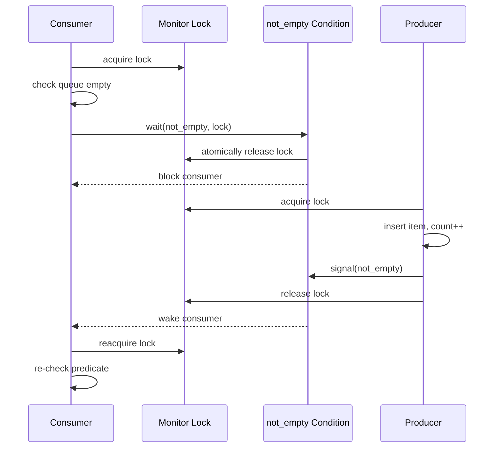
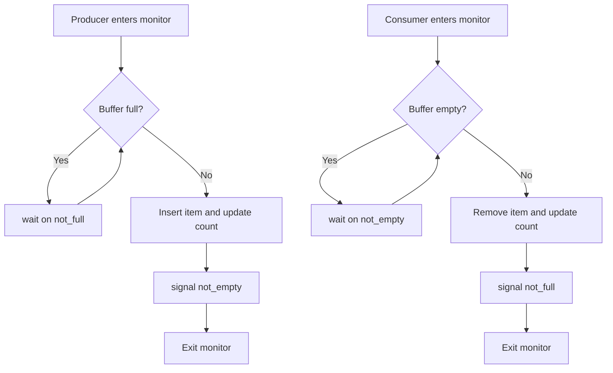

# Day 16 - Monitors and Condition Variables

Difficulty: Advanced  
Fresh Learning: 40 minutes  
Revision: 5 minutes  
Prerequisites: Days 14-15 - mutexes, semaphores, critical sections, producer-consumer, readers-writers  
Why this topic matters in interviews: Monitors and condition variables test whether you understand not only mutual exclusion, but also condition-based waiting, wakeups, and the subtle reason `wait` must usually be placed inside a loop.

Imagine a bounded task queue inside a web server. Worker threads remove requests from the queue. Network threads add requests to the queue. A mutex can protect the queue data structure, but it cannot by itself answer the most important question: what should a worker do when the queue is empty? It should not keep checking in a tight loop and waste CPU. It should sleep until some producer adds work. Similarly, a producer should sleep when the queue is full and wake when a consumer frees space.

This is where condition variables and monitors become important. A monitor bundles shared state with the lock that protects it. A condition variable gives threads a disciplined way to sleep until some condition involving that shared state may have changed. The condition is not stored inside the condition variable like a boolean. The condition lives in your program state, such as `count > 0`, `count < capacity`, or `writer_active == false`. The condition variable is the waiting room and wake-up mechanism.

This topic connects directly to yesterday's classical synchronization problems. Producer-consumer becomes cleaner when you express it as a monitor with two conditions: `not_empty` and `not_full`. Readers-writers can also be implemented with monitor state and condition variables. Interviewers like this topic because many candidates know the words "mutex" and "semaphore", but fail when asked why `if (queue.empty()) wait()` is wrong.

## Interview Definition

A monitor is a synchronization construct that combines shared data, the operations that access that data, and an implicit or explicit mutual-exclusion lock. A condition variable is used inside a monitor to let a thread wait until a condition over the protected shared state may become true. The standard pattern is: acquire the monitor lock, check the condition in a loop, call `wait` if the condition is false, perform the protected operation, update state, signal or broadcast waiting threads, and release the lock.

In an interview, say: a monitor protects shared state and condition variables coordinate waiting for state changes. `wait` atomically releases the monitor lock and blocks the thread; when the thread wakes up, it reacquires the lock and must re-check the condition because wakeups are not proof that the condition is now true.

## Key Definitions

- Monitor: a synchronization abstraction that groups shared state, protected methods, and a lock so only one thread executes monitor code at a time.
- Condition variable: a waiting mechanism used with a lock; it lets threads sleep until another thread signals that a relevant condition may have changed.
- Wait: an operation that atomically releases the associated lock, blocks the calling thread, and later reacquires the lock before returning.
- Signal: an operation that wakes one waiting thread, if any, on a condition variable.
- Broadcast: an operation that wakes all waiting threads on a condition variable.
- Predicate: the actual boolean condition over shared state, such as `queue.size() > 0` or `readers == 0`.
- Mesa monitor: a monitor semantics where `signal` only makes a waiting thread ready; the signaling thread continues, and the waiter must later reacquire the lock and re-check the predicate.
- Hoare monitor: a monitor semantics where control transfers immediately from the signaling thread to the waiting thread, so the condition is guaranteed at the moment of wakeup.
- Spurious wakeup: a wakeup where `wait` returns even though no useful signal or no still-true predicate exists.

## Mental Model

Think of a monitor as a secured service counter with one clerk window. Only one customer can stand at the window and modify the official ledger at a time. The ledger is the shared state. The counter's door lock is the monitor lock.

A condition variable is not the ledger and not the rule. It is a waiting bench next to the counter. If a customer reaches the counter and sees that the required condition is not true, they step away to the proper bench and release the counter lock so someone else can change the ledger. Later, the clerk may call someone from the bench because the ledger may now allow progress. When the customer comes back to the window, they must check the ledger again. Another customer may have used the same opportunity first, or the clerk may have called everyone only to let one person proceed.

The mature interview mental model is: the lock protects state; the predicate describes truth; the condition variable manages sleeping and wakeup. Confusing these three is the source of most bugs.

## Layer 1: What happens at a high level?

At a high level, monitors solve two related problems.

First, they centralize mutual exclusion. Instead of scattering `lock()` and `unlock()` calls across unrelated code paths, a monitor says: all access to this shared state happens through these protected operations. That makes the synchronization boundary clear. In Java, a `synchronized` method is a monitor-like operation. In many C or C++ designs, you manually build the same idea by pairing a mutex with shared state and functions that always hold the mutex before touching that state.

Second, condition variables solve waiting for state. A mutex can stop two threads from modifying a queue at the same time, but it cannot put a consumer to sleep until the queue is non-empty. Without a condition variable, the consumer may either poll repeatedly, wasting CPU, or sleep for arbitrary time intervals, increasing latency. A condition variable lets the consumer wait efficiently and lets a producer wake it after adding an item.

The important phrase is "may have changed." A signal does not mean the condition is permanently true. It means a thread should wake, reacquire the lock, and inspect the protected state again. This is why the correct pattern uses a `while` loop, not a single `if`.

## Layer 2: What happens inside the OS?

Inside the OS or runtime, a condition variable usually has a wait queue. When a thread calls `wait(cv, mutex)`, the runtime performs an atomic transition:

1. Put the current thread on the condition variable's waiting queue.
2. Release the associated mutex.
3. Block the thread so it stops consuming CPU.

The atomicity matters. If the thread released the mutex first and only then tried to sleep, a signal could occur in the gap. That signal might be lost, and the thread could sleep forever even though the condition became true. Correct condition-variable implementations avoid this lost-wakeup window by making "release lock and block" one synchronized operation with respect to signaling.

When another thread modifies the shared state, it may call `signal` or `broadcast`. `signal` wakes one waiting thread. `broadcast` wakes all waiting threads. The awakened thread does not normally run immediately. It moves from the condition-variable wait queue to the scheduler's ready set or to a lock wait queue, because it still needs to reacquire the monitor lock before returning from `wait`.

The monitor lock remains the guard for shared state. A condition variable without a consistent lock is almost always wrong, because the waiting predicate can change concurrently while the waiter is checking it.

## Layer 3: What happens at hardware or kernel level?

At the hardware level, monitors and condition variables are built on lower-level primitives: atomic instructions, memory barriers, scheduler blocking, and wakeup mechanisms. A mutex may use compare-and-swap or exchange to acquire a fast uncontended path. If the lock is contended, the runtime may ask the kernel to park the thread instead of burning CPU.

On Linux-like systems, user-space synchronization commonly tries to avoid kernel transitions when uncontended and enters the kernel only when a thread must sleep or wake another thread. A futex-style mechanism is a practical example: user space checks a memory word first, and the kernel helps block or wake threads only when necessary. Windows exposes synchronization objects and condition-variable APIs with similar goals: keep fast paths cheap, block efficiently when needed, and wake waiters when state changes.

At the memory-model level, the lock also creates ordering guarantees. The producer's writes to the queue must become visible to the consumer after the consumer wakes and reacquires the lock. Without proper synchronization, one CPU core might see stale values or reorder operations in ways that break the program's logical invariant.

You do not need to implement these internals in a normal OS interview, but mentioning them shows depth: condition variables are not just "callbacks." They depend on atomic release-and-sleep, scheduler wait queues, and lock-based memory visibility.

## Layer 4: What can go wrong?

The most common bug is checking the predicate with `if` instead of `while`. Suppose two consumers are waiting for a queue item. A producer adds one item and signals. One consumer wakes. Before it reacquires the lock, another consumer or a still-running thread may remove the item. If the awakened consumer does not re-check `queue.empty()`, it may remove from an empty queue. A `while` loop prevents this.

Another bug is signaling without changing the state that waiters care about. If a producer calls `signal(not_empty)` before actually inserting the item, a consumer may wake, reacquire the lock, and still find the queue empty. The usual design is: hold the lock, modify state, then signal.

A third bug is waiting on the wrong condition variable. In producer-consumer, producers should wait on `not_full` and signal `not_empty` after adding. Consumers should wait on `not_empty` and signal `not_full` after removing. Mixing these up creates missed progress or deadlock-like stalls.

Another failure is using `signal` when `broadcast` is required. If many different predicates share the same condition variable, one signal may wake a thread whose predicate is still false while another thread that could proceed remains asleep. Broadcast is more expensive, but sometimes it is the simplest correct answer.

Finally, monitor code can still deadlock if it calls other monitors in inconsistent order. A monitor prevents concurrent access to its own state; it does not magically solve global lock ordering across the whole program.

## Step-by-Step Flow

Here is the practical flow for a consumer thread using a monitor-protected bounded buffer:

1. The consumer enters the monitor by acquiring the buffer mutex.
2. It checks the predicate `count > 0`.
3. If the predicate is false, it calls `wait(not_empty, mutex)`.
4. The wait operation atomically releases the mutex and blocks the consumer.
5. A producer later acquires the same mutex.
6. The producer inserts an item and updates `count`.
7. The producer calls `signal(not_empty)` because the queue may no longer be empty.
8. The producer releases the mutex.
9. The consumer wakes, competes to reacquire the mutex, and returns from `wait`.
10. The consumer re-checks `count > 0` in a `while` loop.
11. If true, it removes an item, updates `count`, signals `not_full`, and releases the mutex.

The key invariant is simple: every read or write of `count`, `head`, `tail`, and queue slots happens while holding the same monitor lock.

## Diagram Section

### Monitor wait and signal flow



This sequence shows why `wait` is special: it releases the lock and blocks atomically, then reacquires the lock before the waiting thread continues.

### Bounded buffer monitor structure



The loops back to the condition checks are the important part. A wakeup only means "try again under the lock," not "the operation is guaranteed safe."

## Practical System Relevance

- In Linux and POSIX-style programming, `pthread_mutex_t` plus `pthread_cond_t` is the classic way to build monitor-like code in C. The programmer manually keeps the mutex, condition variable, and predicate consistent.
- In Java, every object can act as a monitor with `synchronized`, `wait`, `notify`, and `notifyAll`. Higher-level utilities such as `BlockingQueue` and `ReentrantLock` with `Condition` are often safer in real applications.
- In C++, `std::mutex`, `std::unique_lock`, and `std::condition_variable` are used to express the same pattern. The standard examples intentionally use `cv.wait(lock, predicate)` because it handles the loop pattern.
- In Windows, condition variables and slim reader-writer locks support efficient waiting and shared/exclusive coordination in user-mode applications.
- In Android, the main thread event loop is not usually written with condition variables by app developers, but the same idea appears inside queues, executors, handlers, and runtime internals: threads sleep until work is available.
- In browsers, rendering pipelines and worker queues use condition-style coordination internally. The JavaScript event loop hides much of this from application code, but browser engines still rely on low-level synchronization.
- In databases, condition-style waiting appears in lock managers, buffer pools, transaction scheduling, worker pools, and background checkpointing. A transaction may wait until a lock, log buffer slot, or worker becomes available.
- In servers and cloud systems, monitor-like queues implement bounded work submission. This creates backpressure: when the queue is full, producers block, reject, or slow down instead of allowing memory to grow without limit.

## Code or Pseudocode Section

### Bounded buffer with a monitor-style API

```c
monitor BoundedBuffer {
    mutex lock;
    condition not_empty;
    condition not_full;
    Item buffer[N];
    int count = 0;
    int head = 0;
    int tail = 0;

    void put(Item x) {
        acquire(lock);
        while (count == N) {
            wait(not_full, lock);
        }

        buffer[tail] = x;
        tail = (tail + 1) % N;
        count++;

        signal(not_empty);
        release(lock);
    }

    Item take() {
        acquire(lock);
        while (count == 0) {
            wait(not_empty, lock);
        }

        Item x = buffer[head];
        head = (head + 1) % N;
        count--;

        signal(not_full);
        release(lock);
        return x;
    }
}
```

This code demonstrates the full monitor pattern. The lock protects the buffer state. `not_empty` is used by consumers. `not_full` is used by producers. The `while` loops protect against spurious wakeups and against another thread changing the state before the awakened thread runs.

### C++-style condition-variable pattern

```cpp
std::mutex m;
std::condition_variable cv;
std::queue<int> q;

int take() {
    std::unique_lock<std::mutex> lock(m);
    cv.wait(lock, [] { return !q.empty(); });

    int value = q.front();
    q.pop();
    return value;
}
```

The predicate form of `wait` is interview-friendly because it encodes the correct loop internally. It does not mean spurious wakeups disappear. It means the library repeats the predicate check for you.

### Observation commands

```bash
top -H -p <pid>
ps -L -p <pid>
strace -f -e futex ./program
```

On Linux, these commands can help observe many threads and blocking behavior. `strace -e futex` may show when a user-space synchronization path enters the kernel to wait or wake. The exact output depends on the runtime and program, but the useful lesson is that blocking synchronization eventually interacts with scheduler wait/wakeup mechanisms.

## Common Misconceptions

- "A condition variable stores the condition." False. The condition is the predicate over protected shared state. The condition variable stores waiters and helps wake them.
- "If a thread wakes up, the condition must be true." False under Mesa-style semantics and because of spurious wakeups. Always re-check the predicate.
- "`if` before `wait` is enough." False. Use `while` because another thread may consume the state before the awakened waiter runs.
- "Signal gives the lock to the waiting thread immediately." Usually false in modern systems. The waiter normally competes to reacquire the lock.
- "Broadcast is always better because it wakes everyone." False. Broadcast can create a thundering herd where many threads wake only to sleep again.
- "Monitors eliminate deadlock." False. A monitor protects its own state, but multiple monitors or external locks can still deadlock if acquired in inconsistent order.
- "Semaphores and condition variables are interchangeable." Not exactly. A semaphore has a counter-like memory of permits. A condition variable has no standalone permit count and must be paired with a predicate.
- "Spurious wakeups mean the OS is broken." False. APIs permit them because it simplifies implementations and because correct code must re-check the predicate anyway.

## Tricky Interview Corners

The first tricky corner is the lost wakeup problem. If waiting were implemented as "unlock, then sleep" in two independent steps, a signal could happen between them. The waiter would miss the signal and then sleep forever. Correct condition-variable wait operations avoid this by atomically releasing the lock and blocking.

The second tricky corner is Mesa vs Hoare semantics. Under Hoare semantics, signaling transfers control immediately to the waiter, so the condition is true when the waiter runs. Under Mesa semantics, which is the practical model in many systems, signaling only makes the waiter ready. The signaling thread continues, and other threads may run before the waiter. Therefore the waiter must re-check the condition.

The third tricky corner is signal vs broadcast. If exactly one waiting thread can make progress, `signal` is usually enough. If a state change may allow many waiters to proceed, or if waiters are checking different predicates on the same condition variable, `broadcast` may be required. The tradeoff is performance: waking many threads can be expensive.

The fourth tricky corner is predicate design. The condition variable is not named after a thread type; it should represent what changed. In a buffer, `not_empty` and `not_full` are better than `consumer_cv` and `producer_cv` because they describe the actual waiting condition.

The fifth tricky corner is holding the lock while signaling. Many designs signal while holding the lock after updating state. Some systems permit signaling after unlocking, but you must understand the invariant and memory visibility. In interviews, the safest answer is: update the predicate under the lock, then signal the condition associated with that predicate.

## Comparison Tables

### Monitor vs Semaphore

| Feature | Monitor | Semaphore |
|---|---|---|
| Main role | Encapsulates shared state with mutual exclusion | Counts permits or controls access |
| Waiting style | Wait for predicate over protected state | Wait for permit count |
| State location | Explicit program variables inside monitor | Counter is inside semaphore |
| Common use | Bounded queues, shared objects, condition coordination | Resource pools, event counting, simple gating |
| Interview trap | Condition variable does not store condition | Semaphore count can hide design intent |

### Condition Variable vs Mutex

| Feature | Mutex | Condition Variable |
|---|---|---|
| Protects shared data | Yes | No |
| Puts thread to sleep until state changes | No | Yes |
| Must be paired with predicate | Indirectly | Yes |
| Typical operation | lock/unlock | wait/signal/broadcast |
| Main mistake | Forgetting all access paths need same lock | Using `if` instead of `while` |

### Mesa vs Hoare Monitors

| Aspect | Mesa Semantics | Hoare Semantics |
|---|---|---|
| What signal does | Makes waiter ready | Immediately transfers control to waiter |
| Does waiter own lock immediately? | No | Conceptually yes |
| Must re-check predicate? | Yes | Still often taught as safer, but condition is guaranteed at handoff |
| Common in practice | More common | Mostly theoretical/teaching model |
| Performance model | Simpler scheduler integration | More complex handoff |

## How to Explain This in an Interview

### 30-second answer

A monitor is a way to protect shared state by allowing only one thread at a time to execute operations on that state. A condition variable is used inside the monitor when a thread cannot proceed until a state condition changes. The thread waits by atomically releasing the lock and sleeping, then wakes, reacquires the lock, and re-checks the condition.

### 2-minute answer

A mutex gives mutual exclusion, but many concurrency problems also require condition synchronization. For example, in producer-consumer, a consumer must wait until the queue is not empty and a producer must wait until the queue is not full. A monitor groups the queue state, mutex, and operations together. The condition variables `not_empty` and `not_full` hold waiting threads. When a producer adds an item, it signals `not_empty`; when a consumer removes an item, it signals `not_full`. The important rule is to use `while`, not `if`, around `wait`, because a wakeup does not guarantee the predicate is still true.

### Deeper follow-up answer

At runtime, `wait` must atomically release the lock and block the thread to avoid lost wakeups. Under Mesa monitor semantics, `signal` only moves a waiter toward readiness; the signaling thread continues and the waiter later competes for the lock. That means the waiter must re-check the predicate under the lock. This is why the correct structure is not "wait until someone signals me"; it is "wait while the predicate I need is false." This distinction is what separates a robust monitor solution from a fragile one.

## Interview Questions

### Basic Questions

1. What is a monitor?
2. What is a condition variable?
3. Why does a condition variable need a mutex or monitor lock?
4. What happens when a thread calls `wait` on a condition variable?
5. What is the difference between `signal` and `broadcast`?

### Intermediate Questions

6. Why should `wait` usually be inside a `while` loop instead of an `if` statement?
7. How would you implement producer-consumer using a monitor?
8. What is a lost wakeup, and how do condition variables prevent it?
9. What is a spurious wakeup?
10. Why is the condition variable not the same as the condition predicate?

### Advanced Questions

11. Compare Mesa and Hoare monitor semantics.
12. When would `broadcast` be more correct than `signal`?
13. Can monitor-based code still deadlock? Give an example.
14. How do monitor locks help with memory visibility across CPU cores?
15. How would you choose between a semaphore and a monitor with condition variables?

## Follow-Up Questions

Q: What is a monitor?  
Follow-ups:
- What state should be inside the monitor?
- Is a monitor a kernel object or a programming abstraction?
- How is a Java synchronized method related to monitors?

Q: What does `wait` do?  
Follow-ups:
- Why must it release the lock atomically?
- Does the thread keep using CPU while waiting?
- What lock state exists when `wait` returns?

Q: Why use `while` around `wait`?  
Follow-ups:
- What is a spurious wakeup?
- What happens if another thread consumes the resource first?
- How does Mesa semantics make this necessary?

Q: How do you solve producer-consumer with condition variables?  
Follow-ups:
- Which predicate does the producer wait for?
- Which predicate does the consumer wait for?
- Why are two condition variables clearer than one?

Q: What is the difference between signal and broadcast?  
Follow-ups:
- When is waking one waiter enough?
- What is the thundering herd problem?
- How can broadcast be correct but slower?

Q: Compare condition variables and semaphores.  
Follow-ups:
- Which one stores permit count?
- Which one requires a separate predicate?
- Can either be used incorrectly to solve producer-consumer?

Q: Can monitor code deadlock?  
Follow-ups:
- What happens if two monitors call each other?
- How does lock ordering help?
- Does condition waiting remove all deadlock risk?

Q: What is a lost wakeup?  
Follow-ups:
- Where is the race window?
- How does atomic release-and-block fix it?
- Can lost wakeups happen if the predicate is checked without the lock?

## Trick Questions

1. Q: If `signal` is called, is the awakened thread guaranteed to run immediately?  
Expected answer: No. In Mesa-style systems, it usually only becomes ready and must reacquire the lock later.

2. Q: Can a condition variable be used without checking a predicate?  
Expected answer: That is usually incorrect. The predicate is the actual condition; the condition variable is only the waiting mechanism.

3. Q: If there are no waiters, does `signal` save a wakeup for the future?  
Expected answer: No. A condition variable normally does not remember signals. The state predicate must remember whether progress is possible.

4. Q: Does `wait` keep the mutex locked while the thread sleeps?  
Expected answer: No. It atomically releases the mutex while blocking, then reacquires it before returning.

5. Q: Is `notifyAll` or `broadcast` always a bad design?  
Expected answer: No. It can be necessary when multiple waiters may have different predicates or when many threads can proceed.

6. Q: Can a spurious wakeup cause a correct program to fail?  
Expected answer: Not if the program uses the standard `while (!predicate) wait()` pattern.

7. Q: Does a monitor make every method of an object thread-safe automatically?  
Expected answer: Only if all shared state access consistently goes through the monitor discipline and the object does not leak unsafe references.

## Practical Debugging / Observation

When studying this concept, write a tiny producer-consumer program and observe thread behavior under different queue capacities.

Useful commands on Linux:

```bash
ps -L -p <pid>
top -H -p <pid>
strace -f -e futex ./producer_consumer
```

What to observe:

- `ps -L` shows the threads inside the process.
- `top -H` can show whether threads are busy-spinning or mostly sleeping.
- `strace -e futex` may reveal kernel wait/wake activity for locks and condition variables.
- A correct blocking queue should not burn CPU when empty.
- If you replace `while` with `if`, the bug may be rare, which is exactly why concurrency bugs are hard.

In Java, you can also use thread dumps to identify blocked or waiting threads:

```bash
jcmd <pid> Thread.print
```

Look for states such as waiting on a monitor, blocked on a monitor, or parked. These are practical reflections of the abstract wait/lock concepts.

## Mini Quiz

### MCQs

1. What does a condition variable store?
   - A. The protected shared data
   - B. The lock ownership
   - C. Waiting threads, not the logical predicate
   - D. CPU register state

2. Why should `wait` be called while holding the associated lock?
   - A. To make the CPU faster
   - B. To check and sleep with respect to a protected predicate
   - C. To avoid using the scheduler
   - D. To prevent all context switches

3. Which pattern is safest?
   - A. `if (!ready) wait(cv)`
   - B. `while (!ready) wait(cv)`
   - C. `sleep(1)` until ready
   - D. `unlock(); wait(cv);`

4. Under Mesa semantics, what does `signal` guarantee?
   - A. The waiting thread immediately runs
   - B. The condition will stay true forever
   - C. A waiter may become ready
   - D. All waiters wake

5. In a bounded buffer, which condition should a producer wait for?
   - A. not_empty
   - B. not_full
   - C. readers_zero
   - D. writer_done

### Short-answer questions

1. Explain why a condition variable must be paired with a predicate.
2. What is a lost wakeup?
3. Why can monitor code still deadlock?

### Reasoning questions

1. A consumer wakes after `signal(not_empty)` but finds the queue empty. Give two possible reasons this can happen.
2. A program uses one condition variable for several different predicates. Should it use signal or broadcast? Explain the tradeoff.

### Answers

1. C
2. B
3. B
4. C
5. B

Short answers:

1. The predicate is the actual truth about shared state; the condition variable only manages sleeping and waking.
2. A lost wakeup happens when a signal occurs before a thread is safely registered as waiting, causing the thread to sleep even though progress is possible.
3. Deadlock can still occur if monitor methods acquire multiple locks or call other monitors in inconsistent order.

Reasoning answers:

1. It may be a spurious wakeup, or another thread may have consumed the only item before the awakened consumer reacquired the lock.
2. Broadcast may be required for correctness if different waiters need different predicates, but it is more expensive because many threads may wake and immediately sleep again.

# 5-Minute Revision Column

Revision targets from today's prepare step:

- Day 15: Classical Synchronization Problems - R1 Recall Revision
- Day 13: Race Conditions - R2 Compression Revision

## Day 15 - Classical Synchronization Problems (R1)

Core recall:

- Classical synchronization problems are reusable templates for reasoning about shared-state coordination.
- Producer-consumer models bounded handoff: producers wait when the buffer is full, consumers wait when it is empty.
- Readers-writers allows concurrent readers but requires exclusive writers; the hard part is fairness.
- Dining philosophers models multiple-resource acquisition and circular wait.
- Sleeping barber models limited waiting capacity and worker sleep/wakeup behavior.

Key definitions:

- Producer-consumer: producers add to a shared buffer while consumers remove from it.
- Condition synchronization: waiting until a required state condition becomes true.
- Deadlock: permanent waiting caused by cyclic resource dependency.

Common traps:

- A mutex alone does not solve producer-consumer because it protects the queue but does not express empty/full waiting.
- Deadlock freedom does not guarantee fairness; starvation can still happen.

Quick interview questions:

- Why does producer-consumer usually need both mutual exclusion and condition synchronization?
- How can readers-writers policies starve either writers or readers?

Mental model:

Producer-consumer is a delivery shelf with limited slots; readers-writers is a library where many people can read, but editing requires exclusive access.

## Day 13 - Race Conditions (R2)

Core recall:

- A race condition means correctness depends on unpredictable timing or interleaving.
- Shared data plus at least one unsynchronized write is a common danger zone.
- `counter++` is not logically atomic; it can be load, modify, and store.
- Critical sections must protect the entire invariant, not only the final write.
- Race conditions can happen on a single-core machine because preemption can occur between steps.

Key definitions:

- Critical section: code that accesses shared state and must not run concurrently in an unsafe way.
- Atomic operation: an operation that appears indivisible to other threads.

Common traps:

- `volatile` is not a general fix for races.
- Locks only work if every access path follows the same locking rule.

Quick interview questions:

- Why can a program pass tests many times and still contain a race condition?
- How is a race condition different from a deadlock?

Mental model:

Shared state is a whiteboard. If two people read the same old value, compute separately, and write back, one update can erase the other.

## Final Takeaway

Monitors and condition variables are the clean way to combine mutual exclusion with condition-based waiting. A monitor protects shared state through a lock; a condition variable lets threads sleep until a predicate over that state may have changed. The predicate is the real condition, not the condition variable itself. Correct code checks the predicate while holding the lock, waits in a loop, updates state under the lock, and signals the condition that may now allow another thread to proceed. The most interview-important rule is simple: use `while`, not `if`, around `wait`.

## What You Should Be Able To Answer Now

- Define a monitor and explain how it protects shared state.
- Define a condition variable and distinguish it from the condition predicate.
- Explain what `wait` does to the lock and the calling thread.
- Explain why `wait` must usually be inside a `while` loop.
- Implement producer-consumer with `not_empty` and `not_full` condition variables.
- Compare Mesa and Hoare monitor semantics.
- Explain signal vs broadcast and when broadcast is necessary.
- Describe lost wakeups, spurious wakeups, and why correct code handles them.
