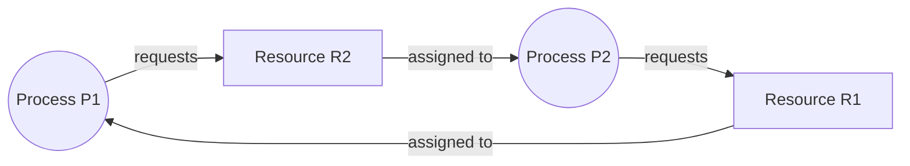
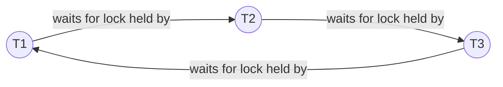
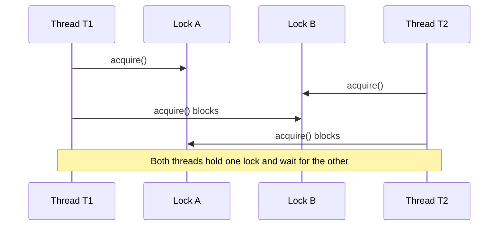

# Day 17 - Deadlocks Part 1

Difficulty: Intermediate  
Fresh Learning: 40 minutes  
Revision: 5 minutes  
Prerequisites: Days 14-16 - mutexes, semaphores, monitors, condition variables, critical sections  
Why this topic matters in interviews: Coffman conditions and resource-allocation graphs are standard OS interview material because they test whether you can reason about concurrent systems, not just define synchronization terms.

Imagine a database server where Transaction A has locked row 1 and now wants row 2. At the same time, Transaction B has locked row 2 and now wants row 1. Both transactions are alive. Both are waiting. Neither can move unless the other releases its lock first. The CPU may be free. The disk may be free. The machine may not look "crashed." Still, the useful work is stuck forever unless the system detects the problem, breaks it, or avoids creating it in the first place.

That stuck state is a deadlock.

Deadlocks are not only textbook problems about dining philosophers. They show up in file locks, database transactions, thread pools, device drivers, distributed services, package managers, build systems, and even UI applications that wait on the wrong thread. The pattern is always similar: independent actors each hold something, wait for something else, and accidentally form a cycle of dependency.

Yesterday's monitors and condition variables taught you how threads can wait correctly for a condition. Today is about a different question: what if the wait itself can never be satisfied because the system has created a circular dependency? A condition variable wait may be valid and temporary. A deadlock wait is structurally impossible to complete unless some outside action changes the system.

## Interview Definition

A deadlock is a situation where a set of processes or threads are permanently blocked because each one is waiting for a resource or event that can only be released or produced by another member of the same set. In operating systems, deadlock commonly occurs when resources are acquired in incompatible orders and the system allows processes to hold some resources while waiting for others.

In an interview, say: deadlock is not just "waiting." It is indefinite waiting caused by a circular dependency. The classic necessary conditions are mutual exclusion, hold and wait, no preemption, and circular wait. If all four hold at the same time, deadlock can occur.

## Key Definitions

- Deadlock: a state where a group of processes or threads are permanently blocked because each is waiting for another in the same group.
- Resource: anything a process may need before it can continue, such as a mutex, file lock, device, memory buffer, database row, or semaphore permit.
- Resource instance: one identical unit of a resource type. A printer pool with three printers has three instances.
- Request edge: in a resource-allocation graph, an edge from process to resource showing that the process is waiting for that resource.
- Assignment edge: in a resource-allocation graph, an edge from resource to process showing that the resource is currently held by that process.
- Mutual exclusion: at least one resource is non-shareable, so only one process can use it at a time.
- Hold and wait: a process holds at least one resource while waiting for another.
- No preemption: the OS cannot forcibly take the resource away; the holder must release it voluntarily.
- Circular wait: a cycle exists where each process waits for a resource held by the next process in the cycle.
- Starvation: a process waits for a very long time because scheduling or allocation keeps favoring others; unlike deadlock, the system as a whole may still be making progress.

## Mental Model

Think of deadlock as a group of people holding keys to rooms while standing in front of other locked rooms. Person A holds the key to room 1 and needs room 2. Person B holds the key to room 2 and needs room 3. Person C holds the key to room 3 and needs room 1. Nobody can enter the next room, and nobody wants to release the key they already have until their next step succeeds.

The mature version of the mental model is a wait-for cycle. Do not focus only on the resources. Ask: who is waiting for whom? If A can progress only after B releases something, and B can progress only after C releases something, and C can progress only after A releases something, the dependency graph has closed into a cycle.

This is different from ordinary waiting. If a thread waits for disk I/O, the disk can finish independently. If a consumer waits on a condition variable, a producer can add work and signal it. In a deadlock, every path to progress depends on another blocked participant in the same closed group.

## Layer 1: What happens at a high level?

At a high level, deadlock starts when a system allows concurrent actors to acquire resources incrementally. That is normal. A thread may lock a cache, then lock a user record. A transaction may lock one row, then another. A compiler may hold a file handle while waiting for a build lock. A driver may hold one kernel lock while requesting another subsystem's lock.

Incremental acquisition is useful because requiring every process to request every resource at the beginning would be wasteful and often impossible. Many programs do not know all future resources upfront. The problem is that incremental acquisition creates partial ownership. Once a process owns part of what it needs, it may refuse to release it while asking for the next part.

Deadlock becomes possible when several actors do this in incompatible orders. If all code always acquires resources in the same global order, cycles cannot form. But if one path locks A then B, and another path locks B then A, two threads can interleave in the dangerous way:

1. Thread 1 locks A.
2. Thread 2 locks B.
3. Thread 1 waits for B.
4. Thread 2 waits for A.

Neither thread is wrong locally. Each is following a plausible sequence. The bug appears at the system level, because the resource-ordering policy is inconsistent.

This is why deadlock questions are reasoning questions. Interviewers want to see whether you can move from "this thread is blocked" to "the dependency graph contains a cycle under non-preemptable resources."

## Layer 2: What happens inside the OS?

Inside the OS, resources are represented by kernel objects, locks, device queues, file descriptors, memory mappings, semaphores, wait queues, and scheduler states. When a process cannot acquire a resource immediately, it may be blocked. The scheduler removes it from the runnable set and places it on a wait queue associated with the resource or event.

Blocking itself is not the problem. Blocking is essential for efficiency. If a mutex is held, the waiting thread should usually sleep rather than burn CPU. If a disk request is pending, the process should wait while another process uses the CPU. The OS is designed around safe waiting.

Deadlock occurs when the wait queues form a closed dependency. A thread sleeping on lock B is harmless if some runnable thread will eventually release B. It is dangerous if the only thread that can release B is itself sleeping on lock A, and the only thread that can release A is sleeping on lock B.

Many general-purpose operating systems do not automatically detect every possible deadlock among all resources. That would require knowing the ownership and waiting relationships for every resource type, including application-level locks and database-level locks that the kernel cannot fully understand. Instead, OS kernels and runtimes usually provide mechanisms: locks, timeouts, try-lock operations, lock-ordering guidelines, debugging tools, and sometimes lock dependency checkers in development builds.

In databases, deadlock detection is more common because the database engine controls transaction locks. It can build a wait-for graph between transactions and abort one transaction to break the cycle. In the kernel, forcibly breaking arbitrary deadlocks is harder because taking a resource away may violate invariants or corrupt state.

## Layer 3: What happens at hardware or kernel level?

At the hardware level, deadlock is not a special CPU mode or instruction. The CPU continues executing whatever runnable work exists. The problem is in the dependency structure above the hardware: blocked execution contexts are waiting for events that cannot happen.

Locks are often built from atomic instructions such as compare-and-swap, test-and-set, exchange, or load-linked/store-conditional. These instructions help implement mutual exclusion. They do not automatically prevent deadlock. In fact, they can help create the conditions for deadlock by making exclusive ownership possible.

At the kernel level, a blocking lock may place the current thread into a sleeping state and link it to a wait queue. A spinlock may keep a CPU busy repeatedly checking whether the lock is available. Kernel code must be especially careful because some contexts cannot sleep. For example, code running in interrupt context cannot safely block waiting for a resource held by code that needs the interrupt to complete.

Memory ordering also matters. Correct locks include acquire and release ordering so protected data is visible correctly between cores. But memory-order correctness is separate from deadlock-freedom. A program can have perfect memory barriers and still deadlock if two CPUs acquire locks in opposite order.

The hardware-level lesson for interviews is: deadlock is a logical resource dependency bug. It is not fixed by "faster CPU," "more cores," or "atomic operations" alone. More cores can make the bad interleaving more likely because more code runs truly in parallel.

## Layer 4: What can go wrong?

The first problem is confusing deadlock with slow progress. A long wait is not always deadlock. A process waiting for network I/O may resume later. A low-priority thread may eventually run. A server under heavy load may look stuck but continue completing requests slowly. Deadlock means there is no possible progress inside the waiting set unless the system breaks the dependency.

The second problem is assuming one lock is safe but multiple locks are dangerous only in complex systems. Even two locks are enough. If one function locks `accountA` then `accountB`, while another locks `accountB` then `accountA`, a money-transfer system can deadlock.

The third problem is holding locks while calling unknown or slow code. If a thread holds a mutex and then calls user callbacks, logging, network I/O, filesystem code, or another subsystem, it may unexpectedly request more resources. This expands the dependency graph and can introduce cycles that are not obvious in the local function.

The fourth problem is using condition variables incorrectly. A condition variable wait releases its associated mutex, which often prevents deadlock. But if code waits while holding some other lock, or waits for a condition that requires another thread to acquire that other lock, a deadlock can still appear.

The fifth problem is thread-pool deadlock. Suppose a pool has two worker threads. Task A occupies worker 1 and waits for Task B. Task C occupies worker 2 and waits for Task D. But B and D are queued to the same pool and cannot run because all workers are blocked. No mutex is required; the limited worker slots are the resources.

## Step-by-Step Flow

Here is a concrete two-lock deadlock:

1. Thread T1 starts a transfer from Account A to Account B.
2. T1 locks Account A.
3. The scheduler switches to Thread T2.
4. T2 starts a transfer from Account B to Account A.
5. T2 locks Account B.
6. T2 tries to lock Account A, but Account A is held by T1, so T2 blocks.
7. The scheduler returns to T1.
8. T1 tries to lock Account B, but Account B is held by T2, so T1 blocks.
9. T1 cannot release Account A because it is blocked waiting for Account B.
10. T2 cannot release Account B because it is blocked waiting for Account A.
11. The wait-for graph is T1 -> T2 -> T1, so the system has a deadlock.

The same shape appears with files, database rows, semaphores, device locks, and distributed service calls. The resource names change, but the cycle is the important part.

## Diagram Section

### Resource Allocation Graph



This graph has a cycle: P1 waits for R2, R2 is held by P2, P2 waits for R1, and R1 is held by P1. With one instance of each resource, this cycle is a deadlock.

### Wait-For Graph



A wait-for graph hides the resource nodes and shows only process-to-process dependencies. A cycle in this graph is a direct sign that each participant depends on another participant in the same closed group.

### Deadlock Timeline



The timeline shows why local reasoning can be misleading. Each acquire looked valid when written, but the interleaving creates the cycle.

## Practical System Relevance

In Linux, deadlock can occur in user-space programs with pthread mutexes, file locks, semaphores, or IPC resources. Kernel developers also worry about lock ordering between scheduler locks, filesystem locks, memory-management locks, and device-driver locks. Development tooling can check lock dependency patterns, but production systems still rely heavily on disciplined design.

In Windows applications, deadlocks can occur with mutexes, critical sections, events, UI message waits, and COM or RPC calls. A classic UI deadlock happens when the UI thread waits synchronously for a background thread while the background thread tries to marshal work back to the UI thread.

In Android, app developers can deadlock by blocking the main thread while waiting for work that needs the main thread to continue. Android also has a visible symptom called ANR, or Application Not Responding, when the main thread is blocked too long. Not every ANR is a deadlock, but deadlocks are one possible cause.

In databases, deadlock is a normal operational concern. Two transactions may update rows in different orders. Many database engines detect cycles in the transaction wait-for graph and abort one transaction as the victim. This is why application code should be prepared to retry transactions.

In browsers, deadlocks are avoided partly by event-loop design and process isolation, but browser engines themselves are highly concurrent. Rendering, networking, storage, GPU, and extension subsystems can still face dependency bugs. The browser may appear frozen if a main event loop waits for work that cannot complete.

In servers, thread-pool deadlocks happen when tasks submit subtasks to the same bounded pool and then wait synchronously for them. The resource is not a mutex; it is worker capacity. This matters in cloud services because one bad dependency pattern can turn load spikes into stuck request queues.

In containers and distributed systems, deadlock-like dependency cycles can appear across services. Service A waits on Service B while holding a database connection. Service B waits on Service C while holding a lock. Service C calls back into Service A. The OS may not see a kernel-level deadlock, but the application dependency graph is still stuck.

## Code or Pseudocode Section

### Dangerous lock ordering

```c
// Thread path 1
lock(account_a);
lock(account_b);
transfer(account_a, account_b);
unlock(account_b);
unlock(account_a);

// Thread path 2
lock(account_b);
lock(account_a);
transfer(account_b, account_a);
unlock(account_a);
unlock(account_b);
```

The bug is not that locks exist. The bug is inconsistent ordering. If both paths always lock the lower account ID first, the circular wait condition is removed.

### Safer ordering pattern

```c
void transfer(Account *from, Account *to, int amount) {
    Account *first = from->id < to->id ? from : to;
    Account *second = from->id < to->id ? to : from;

    lock(first);
    lock(second);

    from->balance -= amount;
    to->balance += amount;

    unlock(second);
    unlock(first);
}
```

This pattern imposes a global order on locks. If every caller follows it, two transfers cannot create a cycle between account locks.

### Try-lock and backoff sketch

```c
lock(a);
if (!try_lock(b)) {
    unlock(a);
    sleep_short_random_time();
    retry();
}
critical_section();
unlock(b);
unlock(a);
```

This breaks hold and wait by refusing to hold `a` forever while waiting for `b`. It is not a complete design by itself, but it shows the principle: if the second resource is unavailable, release what you already hold and retry later.

### Observation commands

```bash
ps -eo pid,ppid,stat,wchan,comm
top -H -p <pid>
strace -p <pid>
lsof -p <pid>
```

These commands can help observe blocked processes and threads. `ps` may show sleep states and wait channels on Linux. `top -H` shows threads. `strace` may show a process blocked in a futex, file, or I/O system call. These tools do not magically prove deadlock, but they help you identify what each thread is waiting for.

## Common Misconceptions

- "Deadlock means the whole computer is frozen." False. Only a set of processes or threads may be deadlocked while the rest of the system runs normally.
- "Any long wait is a deadlock." False. A long wait can be slow I/O, starvation, heavy load, or a valid blocking operation. Deadlock requires a circular dependency with no internal progress.
- "Deadlock and starvation are the same." False. In starvation, other work may continue and the unlucky process may theoretically run later. In deadlock, the blocked set cannot progress without outside intervention.
- "More CPU cores prevent deadlock." False. More cores can even make bad interleavings easier to hit.
- "Atomic instructions prevent deadlock." False. Atomic instructions implement locks and counters; they do not enforce safe lock ordering.
- "A single process cannot be involved in deadlock." False. A process with multiple threads can deadlock internally. Even one thread can self-deadlock if it tries to acquire a non-recursive lock it already holds.
- "Timeouts solve deadlocks cleanly." Partly false. Timeouts can help recovery, but they may create partial work, retries, duplicate actions, or inconsistent state if not designed carefully.
- "Deadlock only happens with mutexes." False. It can involve semaphores, file locks, database locks, worker threads, memory buffers, devices, and service dependencies.

## Tricky Interview Corners

The first tricky corner is the word "necessary." The four Coffman conditions are necessary for deadlock in the classic resource model. That means if any one condition is impossible, deadlock cannot occur under that model. It does not mean the presence of all four guarantees a deadlock every second. It means deadlock is possible.

The second tricky corner is cycles with multiple resource instances. In a resource-allocation graph with one instance per resource type, a cycle implies deadlock. With multiple instances, a cycle may not be sufficient because another instance could become available and break the wait.

The third tricky corner is recursive locks. If a thread acquires a recursive lock twice, it must release it twice. Recursive locks can avoid self-deadlock in some designs, but they can also hide poor lock structure and make invariants harder to reason about.

The fourth tricky corner is lock ordering across abstraction boundaries. A function may look safe because it takes only one lock, but if it calls another function that takes a second lock, the real order is hidden. This is why large systems document lock hierarchy.

The fifth tricky corner is waiting while holding a lock. Sometimes it is correct if the wait operation atomically releases the associated lock, as condition-variable wait does. But waiting for arbitrary I/O, callbacks, RPCs, or futures while holding a lock is a common deadlock source.

The sixth tricky corner is deadlock in thread pools. No explicit lock cycle may appear in code. The finite worker pool is the resource. If all workers block waiting for work queued behind them, the dependency cycle is between tasks and worker capacity.

## Comparison Tables

### Deadlock vs Starvation

| Aspect | Deadlock | Starvation |
|---|---|---|
| Core idea | Closed group waits forever on each other | One actor waits too long because others keep winning |
| System progress | Blocked group makes no progress | System may still make progress |
| Main shape | Circular dependency | Unfair allocation or scheduling |
| Common fix | Break/prevent cycles, abort victim, order resources | Improve fairness, aging, priority adjustment |
| Interview trap | Calling any wait deadlock | Calling unfairness deadlock |

### Coffman Conditions

| Condition | Meaning | Common way to break it |
|---|---|---|
| Mutual exclusion | Some resource cannot be shared | Make resource shareable where possible |
| Hold and wait | Hold one resource while requesting another | Request all upfront or release before retry |
| No preemption | Resource cannot be forcibly taken | Allow rollback, abort, or preemption |
| Circular wait | Processes form a cycle of waiting | Enforce global resource ordering |

### Resource Allocation Graph vs Wait-For Graph

| Graph | Nodes | Best use |
|---|---|---|
| Resource allocation graph | Processes and resources | Teaching ownership and request edges |
| Wait-for graph | Processes only | Detecting cycles between waiting actors |

## How to Explain This in an Interview

### 30-second answer

A deadlock happens when a set of processes or threads are permanently blocked because each is waiting for a resource held by another member of the same set. The classic necessary conditions are mutual exclusion, hold and wait, no preemption, and circular wait. The most important signal is a cycle in the wait-for relationship.

### 2-minute answer

Deadlock is a resource dependency problem. Suppose T1 holds lock A and waits for lock B, while T2 holds lock B and waits for lock A. Both are blocked, and neither can release its current lock because each is waiting to enter the next part of the code. This satisfies mutual exclusion because locks are exclusive, hold and wait because each thread holds one lock while requesting another, no preemption because the OS does not forcibly take the lock away, and circular wait because T1 waits for T2 and T2 waits for T1. In a resource-allocation graph, this appears as a cycle. Deadlock prevention usually works by breaking one of these conditions, especially circular wait through consistent resource ordering.

### Deeper follow-up answer

In real systems, deadlock can occur beyond simple mutexes. Databases detect transaction deadlocks using wait-for graphs and abort one transaction. Thread pools can deadlock when all workers block waiting for queued subtasks that cannot start. UI systems can deadlock when the main thread waits for a background task that needs the main thread. The hard part is that the OS may not see all application-level resources, so prevention often depends on design rules: do not hold locks across slow calls, use consistent lock ordering, prefer timeouts or try-lock with careful recovery, and keep resource ownership boundaries explicit.

## Interview Questions

### Basic Questions

1. What is a deadlock?
2. How is deadlock different from ordinary blocking?
3. What are the four Coffman conditions?
4. What is hold and wait?
5. What is circular wait?

### Intermediate Questions

6. Explain a two-lock deadlock with threads T1 and T2.
7. Why does consistent lock ordering prevent deadlock?
8. What is a resource-allocation graph?
9. What is a wait-for graph?
10. How is deadlock different from starvation?
11. Why are timeouts not a perfect deadlock solution?

### Advanced Questions

12. Does a cycle in a resource-allocation graph always imply deadlock?
13. How can a thread pool deadlock without explicit mutexes?
14. Why is deadlock detection easier inside a database than inside a general OS?
15. How can condition variables reduce some deadlock risks but still be used incorrectly?

## Follow-Up Questions

Q: What is a deadlock?  
Follow-ups:
- Can the CPU still be running other work?
- Is a long wait always a deadlock?
- What makes the wait permanent?

Q: What are the Coffman conditions?  
Follow-ups:
- Are they necessary or sufficient?
- Which condition is easiest to break in lock-based code?
- Why does no preemption matter?

Q: Explain circular wait.  
Follow-ups:
- How do you show it in a graph?
- How does global lock ordering remove it?
- Can circular wait involve more than two processes?

Q: What is a resource-allocation graph?  
Follow-ups:
- What direction is a request edge?
- What direction is an assignment edge?
- What changes when resources have multiple instances?

Q: Deadlock vs starvation?  
Follow-ups:
- Which one involves a cycle?
- Can a starved process eventually run?
- Which scheduling technique helps starvation?

Q: How can a database handle deadlock?  
Follow-ups:
- Why can it abort a transaction?
- Why should application code retry transactions?
- What is a victim transaction?

Q: How can deadlock be prevented?  
Follow-ups:
- Which Coffman condition are you breaking?
- What is the tradeoff of requesting all resources upfront?
- Why can prevention reduce concurrency?

Q: Can one thread deadlock itself?  
Follow-ups:
- What happens with a non-recursive mutex?
- Do recursive locks always fix the design?
- Why can recursive locks hide bad structure?

## Trick Questions

Q: If a process is sleeping, is it deadlocked?  
Expected answer: Not necessarily. Sleeping is a normal blocked state. Deadlock requires an unbreakable dependency cycle among waiting actors.

Q: If the system has four Coffman conditions, is it currently deadlocked?  
Expected answer: Not necessarily. The conditions make deadlock possible. A specific deadlock requires the right allocation and wait cycle.

Q: Does a cycle in a resource-allocation graph always prove deadlock?  
Expected answer: Only when each resource type has a single instance. With multiple instances, a cycle may be possible without being an actual deadlock.

Q: Can a deadlock happen without mutexes?  
Expected answer: Yes. It can involve semaphores, file locks, database rows, worker slots, buffers, or service calls.

Q: Can adding more threads fix a thread-pool deadlock?  
Expected answer: It may hide the symptom temporarily, but the dependency design is still unsafe. The correct fix is to avoid blocking workers on work queued to the same exhausted pool or to separate pools and use async composition.

Q: If a lock uses atomic instructions, can it still deadlock?  
Expected answer: Yes. Atomicity helps implement mutual exclusion; it does not prevent circular wait.

Q: Is deadlock always an OS bug?  
Expected answer: No. Many deadlocks are application-level design bugs. The OS provides primitives, but the program decides resource acquisition order.

## Practical Debugging / Observation

When a program appears stuck, start by asking what each thread is waiting for. On Linux-like systems, these commands are useful:

```bash
ps -eo pid,ppid,stat,wchan,comm
top -H -p <pid>
pstack <pid>
strace -f -p <pid>
lsof -p <pid>
```

What to observe:

- If many threads are sleeping in futex waits, they may be blocked on mutexes or condition variables.
- If a thread holds a file descriptor or lock while waiting on another operation, inspect the dependency.
- If all worker threads are blocked waiting for futures from the same pool, suspect thread-pool starvation or deadlock.
- If database transactions fail with a deadlock error, check whether different code paths update rows in different orders.
- If a UI application freezes, check whether the main thread is synchronously waiting for background work that needs the main thread.

In C or C++ debugging, stack traces are often more useful than CPU metrics. A deadlocked process may use almost no CPU because its threads are sleeping. You need to inspect wait points and ownership, not only performance counters.

## Mini Quiz

### MCQs

1. Which condition says a process holds one resource while requesting another?  
   A. Mutual exclusion  
   B. Hold and wait  
   C. No preemption  
   D. Aging

2. Which graph directly shows process-to-process waiting?  
   A. Gantt chart  
   B. Page table  
   C. Wait-for graph  
   D. Memory map

3. Deadlock differs from starvation because deadlock usually involves:  
   A. More CPU usage  
   B. A circular dependency  
   C. A larger disk queue  
   D. A lower priority value

4. A common way to break circular wait is:  
   A. Add more cores  
   B. Enforce global resource ordering  
   C. Disable interrupts forever  
   D. Use larger stack memory

5. In a single-instance resource-allocation graph, a cycle generally indicates:  
   A. Page fault  
   B. Deadlock  
   C. Cache miss  
   D. Context switch

### Short-answer questions

1. Name the four Coffman conditions.
2. Why is holding a lock during a slow network call dangerous?
3. Why can a database recover from a transaction deadlock by aborting one transaction?

### Reasoning questions

1. Two threads transfer money between the same two accounts in opposite directions. What lock-ordering rule prevents deadlock?
2. A thread pool has four workers. All four workers block waiting for subtasks submitted to the same pool. Why can this become deadlocked?

### Answers

1. B  
2. C  
3. B  
4. B  
5. B  

Short answers:

1. Mutual exclusion, hold and wait, no preemption, circular wait.
2. The lock is held while the thread waits for an external event. Other threads needing the same lock cannot progress, and the external operation may depend directly or indirectly on those blocked threads.
3. The database controls transaction state and locks, so it can choose a victim transaction, roll it back, release its locks, and let the other transaction continue.

Reasoning answers:

1. Always lock accounts in a deterministic order, such as increasing account ID, regardless of transfer direction.
2. Worker slots are the limited resource. If all workers wait for queued subtasks and no worker is free to run those subtasks, the pool creates a closed dependency.

# 5-Minute Revision Column

## Revision Targets

- Day 16: Monitors and Condition Variables - R1 recall revision
- Day 14: Mutex, Locks, and Semaphores - R2 compression revision

## Day 16 - Monitors and Condition Variables

Core recall:

- A monitor groups shared state, protected operations, and a lock so only one thread runs monitor code at a time.
- A condition variable lets a thread sleep until a predicate over protected state may have changed.
- The condition is not stored in the condition variable. The condition is the predicate, such as `queue.size() > 0`.
- `wait` atomically releases the associated lock, blocks the thread, and reacquires the lock before returning.
- In Mesa-style monitors, `signal` only makes a waiter ready. The waiter must compete to reacquire the lock and re-check the predicate.
- Correct pattern: `while (!predicate) wait(cv, lock);` not `if (!predicate) wait(cv, lock);`

Key definitions:

- Monitor: shared state plus operations plus mutual exclusion.
- Condition variable: wait queue and wakeup mechanism associated with a lock.
- Predicate: the actual boolean state condition that decides whether progress is allowed.

Common traps:

- Waking up does not prove the condition is true.
- `signal` does not save a future wakeup if nobody is waiting.

Quick interview questions:

1. Why must condition-variable waits usually be inside a while loop?
2. What is the difference between the lock, the condition variable, and the predicate?

Mental model: the monitor is the locked service counter, the predicate is the ledger truth, and the condition variable is the waiting bench.

## Day 14 - Mutex, Locks, and Semaphores

Core recall:

- Mutex = ownership-based mutual exclusion for protecting one critical section or invariant.
- Semaphore = permit counter controlled by wait and signal.
- Binary semaphore has one permit, but it is not automatically the same as a mutex because ownership rules may differ.
- Counting semaphore is ideal for limiting identical resources such as connection-pool slots.
- Blocking locks sleep when unavailable; spinlocks burn CPU while waiting and are useful only for very short waits in contexts where sleeping is invalid.

Key definitions:

- Critical section: code that touches shared mutable state and must not run concurrently in unsafe ways.
- Wait/P: consume a semaphore permit or block.

Common traps:

- A lock makes code safe only if every access path follows the same lock discipline.
- Holding a lock across slow I/O can create contention and deadlock risk.

Quick interview questions:

1. When would you use a mutex instead of a counting semaphore?
2. Why is a spinlock not always faster than a blocking lock?

Mental model: a mutex is one owned key to a protected room; a counting semaphore is a tray of limited passes.

## Final Takeaway

Deadlock is a structural waiting problem, not just a slow program. It happens when a set of actors hold resources and wait for each other in a cycle. The four classic conditions are mutual exclusion, hold and wait, no preemption, and circular wait. The most practical prevention technique in ordinary lock-based code is consistent resource ordering. The most practical debugging habit is to identify what every blocked thread holds and what it is waiting for. If the wait-for graph closes into a cycle, you have the core shape of deadlock.

## What You Should Be Able To Answer Now

- Define deadlock in an interview-friendly way.
- Explain all four Coffman conditions.
- Draw a resource-allocation graph for a two-lock deadlock.
- Convert a resource-allocation graph into a wait-for graph.
- Explain deadlock vs starvation.
- Explain why lock ordering prevents circular wait.
- Identify thread-pool deadlock as a resource dependency problem.
- Discuss why databases can detect and recover from deadlocks more easily than a general OS.
