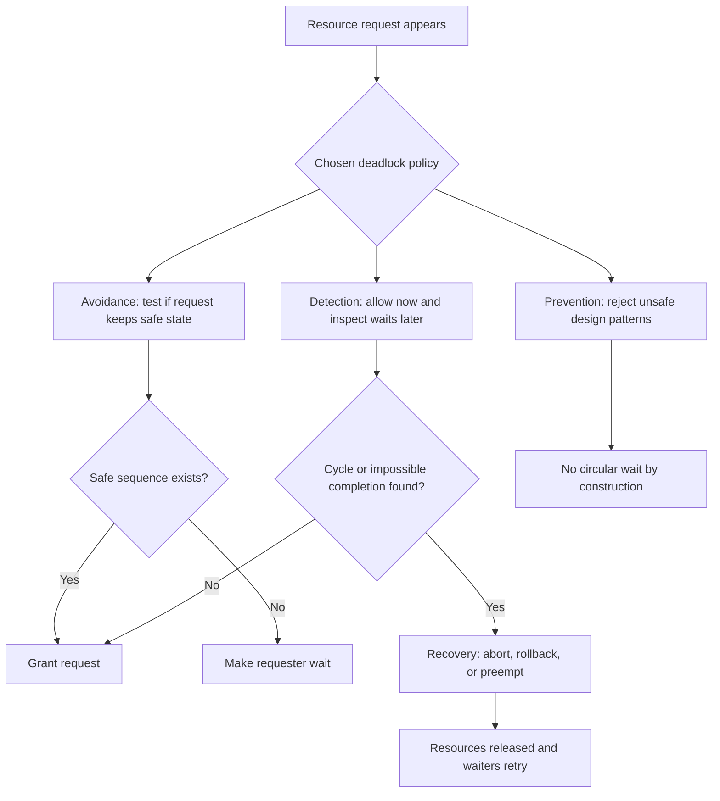
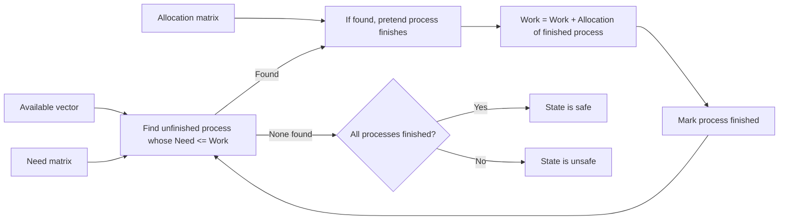
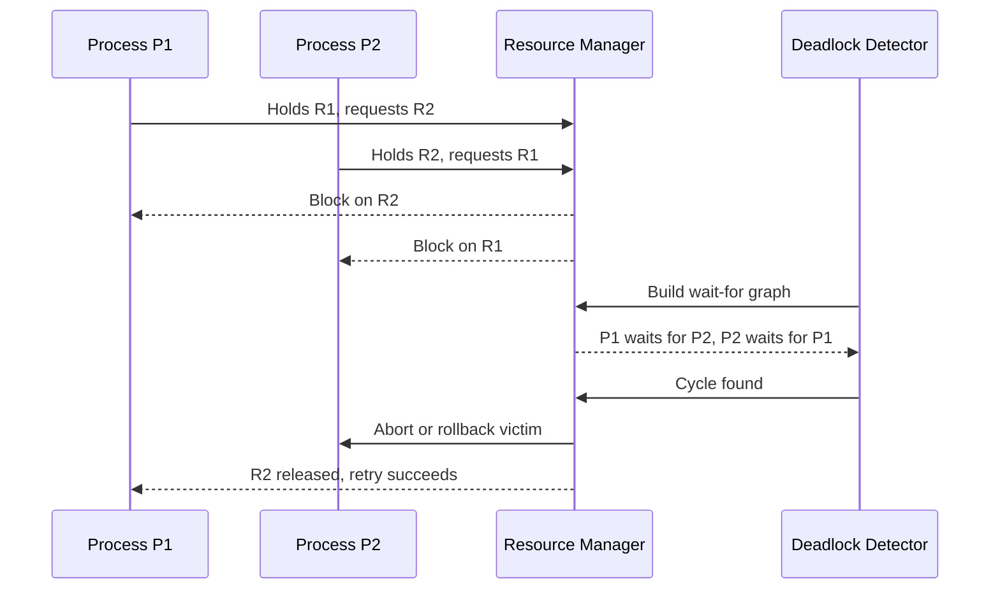

# Day 18 - Deadlocks Part 2

Difficulty: Advanced  
Fresh Learning: 40 minutes  
Revision: 5 minutes  
Prerequisites: Day 17 - Deadlocks Part 1, Coffman conditions, resource-allocation graphs, wait-for cycles  
Why this topic matters in interviews: Prevention, avoidance, detection, and recovery require crisp tradeoff reasoning. Interviewers want to know whether you can move beyond defining deadlock and choose a practical handling strategy for real systems.

Imagine a database server where two transactions are stuck. Transaction T1 has locked row A and wants row B. Transaction T2 has locked row B and wants row A. Yesterday, you learned how to recognize that as deadlock. Today, the harder question is: what should the system do about it?

One answer is: design the system so this situation can never happen. Another answer is: allow risky requests only when the system can prove a safe completion order still exists. Another answer is: let the system run, periodically detect cycles, then abort one participant. A final answer is: recover after the deadlock happens, perhaps by killing a process, rolling back a transaction, or preempting a resource.

Deadlock handling is not a single algorithm. It is a design choice. A real operating system, database, runtime, or distributed service must balance safety, performance, fairness, implementation cost, and user experience. Avoiding every possible deadlock may make the system too conservative. Ignoring deadlocks may make it freeze under rare but serious workloads. The interview-level skill is knowing the four broad strategies and the tradeoffs behind each one.

## Interview Definition

Deadlock handling is the set of techniques used to prevent deadlocks, avoid unsafe resource allocations, detect existing deadlocks, and recover from them. Prevention breaks at least one Coffman condition by design. Avoidance grants a request only if the system remains in a safe state. Detection allows deadlocks to occur, then finds cycles in the wait-for or resource graph. Recovery removes the deadlock by aborting, rolling back, preempting, or otherwise forcing progress.

In an interview, say: deadlock prevention is conservative design, deadlock avoidance is runtime safety checking, deadlock detection is post-fact cycle discovery, and deadlock recovery is the action taken after detection. Banker algorithm is the classic avoidance algorithm, not a general-purpose deadlock detector.

## Mental Model

Think of a deadlock-handling system as a bank manager lending limited equipment to multiple projects.

Prevention is the manager saying, "Everyone must request equipment in a fixed order, and nobody may hold one tool while waiting for another." This is safe but can be restrictive.

Avoidance is the manager asking before every loan, "If I approve this request, can all projects still finish in some order?" This is smarter, but it needs accurate maximum claims and current availability.

Detection is the manager allowing normal borrowing, then checking the dependency board when projects stop moving. If a cycle appears, the manager knows some intervention is needed.

Recovery is the intervention: cancel a project, take back a tool, roll back partial work, or restart one participant. It solves the current deadlock but may waste work.

The important mental model is not "one magic deadlock solution." It is a spectrum: stricter rules reduce risk but reduce flexibility; looser rules improve performance but require detection and recovery.

## Key Definitions

- Deadlock prevention: A design strategy that ensures at least one necessary deadlock condition can never hold.
- Deadlock avoidance: A runtime strategy that grants a resource request only if the resulting state is safe.
- Safe state: A state where there exists at least one sequence in which all processes can finish with available resources plus resources released by earlier finishers.
- Unsafe state: A state where the system cannot guarantee a completion sequence, even though it may not be deadlocked yet.
- Safe sequence: An ordering of processes such that each process can obtain its remaining maximum need, finish, and release resources for the next process.
- Banker algorithm: A classic deadlock-avoidance algorithm that uses maximum demand, allocation, need, and available resource vectors to test whether a request preserves safety.
- Deadlock detection: A strategy that allows deadlocks to occur and periodically or reactively checks for cycles or impossible completion.
- Deadlock recovery: The set of actions used to break a detected deadlock, such as terminating a process, rolling back a transaction, or preempting resources.

## Layer 1: What happens at a high level?

At a high level, a system has four choices.

First, it can prevent deadlocks by changing the rules of resource acquisition. If circular wait is the most dangerous condition, impose a global resource ordering: always acquire lock A before lock B before lock C. If hold-and-wait is dangerous, require a process to request all required resources at once or release what it holds before waiting. If no preemption is dangerous, allow the system to take resources back in some cases. If mutual exclusion is avoidable, make a resource shareable or copy-on-write.

Second, it can avoid deadlocks by inspecting each request before granting it. The system asks: "If I give this process what it wants now, can every process still finish in some order?" If yes, grant. If no, make the process wait even if the resource is currently available.

Third, it can detect deadlocks after they occur. The system builds a dependency graph or runs a matrix-based detection algorithm. If there is a cycle with single-instance resources, or if no process in a blocked set can complete under a multi-instance model, the system has found deadlock.

Fourth, it can recover. Recovery is usually unpleasant because it means undoing work or taking away something that a process believed it owned. Databases often choose a victim transaction and roll it back. Operating systems may kill a process or return an error. Distributed systems may use timeouts, leases, or fencing to force progress.

The strategies are not mutually exclusive. A system may prevent deadlock for kernel locks using lock ordering, avoid deadlock for a resource manager with known maximum claims, detect database transaction cycles, and recover by aborting one transaction.

## Layer 2: What happens inside the OS?

Inside the OS or runtime, resources are represented by metadata: lock owners, wait queues, resource counts, allocation tables, file locks, memory reservations, device queues, and process states. Deadlock-handling code reasons over this metadata.

For prevention, the OS or library enforces rules. A lock-order checker may verify that code does not acquire locks out of order. A nonblocking API may require callers to release one resource before trying another. Some resources are designed to be shareable, reducing mutual exclusion. For example, read-only file mappings can be shared by many processes.

For avoidance, the OS needs more information than most real processes provide. Banker algorithm requires every process to declare its maximum possible demand for each resource type. The system tracks:

- Available: how many free instances of each resource type exist.
- Max: the maximum demand each process may ever make.
- Allocation: how many instances each process currently holds.
- Need: Max minus Allocation.

When a process requests resources, the system temporarily simulates granting the request, then runs a safety check. If the simulated state has a safe sequence, the request is allowed. If not, the request waits.

For detection, the OS or subsystem builds a wait-for relationship. With one instance per resource, a wait-for graph is enough: process P1 waits for P2 if P2 holds a resource P1 needs. A cycle means deadlock. With multiple instances, detection needs resource counts and a process-completion simulation similar to the safety algorithm, but it uses current outstanding requests instead of declared maximum future claims.

For recovery, the OS chooses what to sacrifice. The victim may be the lowest-priority process, the process that has done the least work, the one holding the fewest resources, or the one easiest to restart. This is why recovery is policy, not only mechanism.

## Layer 3: What happens at hardware or kernel level?

Deadlock handling is mostly an OS, runtime, database, or application-level concern, but hardware and kernel behavior still matter.

Locks are often implemented using atomic CPU instructions such as compare-and-swap, test-and-set, or load-linked/store-conditional. These instructions help build mutual exclusion, but they do not prevent deadlock. A perfect atomic lock can still be acquired in a circular order.

Kernel code has stricter constraints than user code. Some kernel paths cannot sleep because they run in interrupt context or while holding a spinlock. That means recovery options are limited. The kernel cannot simply "roll back" arbitrary state the way a database transaction can. Kernel developers therefore rely heavily on prevention: strict lock ordering, lock dependency checking, short critical sections, and careful separation between sleeping locks and spinlocks.

Memory and I/O resources also complicate recovery. If a process holds a device lock while waiting for memory, and the memory reclaim path needs that same device lock, the system can enter a dangerous dependency loop. This is why kernels treat allocation flags, interrupt contexts, and lock hierarchies carefully.

At hardware level, there is no general deadlock detector that understands all software locks. The CPU can tell that a thread is spinning or sleeping, but it does not know the semantic dependency graph of database rows, Java monitors, file locks, or thread-pool workers. Deadlock handling needs higher-level metadata.

## Layer 4: What can go wrong?

Deadlock prevention can reduce concurrency too much. If every process must request all resources in advance, resources may sit idle while a process waits for one missing item. If every lock has a strict order, code may become harder to design, especially when modules evolve independently.

Deadlock avoidance can be impractical. Banker algorithm assumes known maximum demands and a fixed set of resource types. Many real programs do not know their maximum future lock or memory needs. Threads may create dynamic work, load plugins, open files based on user input, or call unknown libraries. The information needed for avoidance may simply not exist.

Deadlock detection can be expensive or too late. Checking too frequently wastes CPU. Checking too rarely leaves users waiting. Detection also needs accurate graph data. If a system cannot distinguish a slow operation from a true wait dependency, it may report false positives or miss real cycles.

Recovery can damage work. Killing a process might release locks but lose unsaved data. Rolling back a transaction is safer because databases are built for rollback, but it still wastes computation and may increase latency. Preempting resources is only safe when the resource can be saved and restored consistently.

The biggest interview trap is presenting one method as always best. A good answer explains where each strategy fits.

## Step-by-Step Flow

### Deadlock prevention flow

1. List the resource types the system controls: locks, files, buffers, devices, worker slots, database rows, or semaphores.
2. Identify which Coffman conditions can realistically be broken.
3. Make shareable resources shareable when possible.
4. For non-shareable resources, define acquisition rules such as global lock ordering.
5. Avoid holding resources while performing blocking calls when possible.
6. Add code review checks, runtime assertions, or lock-order tooling.
7. Treat violations as design bugs rather than waiting for production deadlocks.

### Deadlock avoidance flow using Banker algorithm

1. Store total resource instances for each resource type.
2. For every process, store its maximum declared demand.
3. Track current allocation and compute remaining need.
4. When a process requests resources, verify the request is not greater than its remaining need.
5. Verify the request is not greater than currently available resources.
6. Pretend to grant the request.
7. Run the safety check to search for a safe sequence.
8. If a safe sequence exists, commit the allocation.
9. If no safe sequence exists, make the process wait even though the resources may be physically available.

### Deadlock detection and recovery flow

1. Track who holds each resource and who is waiting for each resource.
2. Periodically or reactively build a wait-for graph or detection matrix.
3. Search for cycles or for a blocked set that cannot complete.
4. If no deadlock exists, continue normal execution.
5. If deadlock exists, choose a victim using policy: priority, cost, progress, resources held, or rollback safety.
6. Abort, roll back, preempt, or restart the victim.
7. Release its resources.
8. Wake blocked processes and let them retry.
9. Log the event because recurring deadlocks usually indicate a design flaw.

## Diagram Section

### Strategy map



This diagram shows that deadlock handling is a policy choice. Prevention acts before runtime requests become dangerous, avoidance checks every risky request, detection finds deadlock after it appears, and recovery forces progress.

### Banker safety check intuition



Banker algorithm does not need to run the processes. It simulates whether there is some completion order using available resources plus resources released by processes that could finish.

### Detection and recovery timeline



This is close to how database engines often handle transaction deadlocks: they detect a cycle and abort one transaction so the other can continue.

## Practical System Relevance

In Linux kernel development, deadlock prevention is extremely important because arbitrary rollback is rarely possible. Kernel code uses lock ordering discipline, lock dependency debugging, careful separation of spinlocks and sleeping locks, and rules about what can be called in interrupt context.

In Windows applications, deadlocks can happen with mutexes, critical sections, UI message loops, COM calls, events, and thread joins. Prevention often means avoiding synchronous waits on the UI thread and avoiding lock acquisition across callbacks into unknown code.

In Android, a common application-level deadlock pattern is blocking the main thread while waiting for work that needs the main thread to deliver a callback. The system may surface the symptom as an ANR. The deadlock-handling strategy is mostly prevention: do not block the main thread, use async callbacks carefully, and keep lock ownership away from UI lifecycle calls.

In databases, deadlock detection and recovery are standard. Two transactions can lock rows in opposite order. The database detects a wait-for cycle, chooses a victim transaction, rolls it back, and returns an error so application code can retry.

In servers, worker-pool deadlocks happen when all workers block waiting for subtasks queued to the same exhausted pool. Prevention means not blocking pool threads on work scheduled to the same pool, separating pools, using async composition, or bounding dependencies carefully.

In browsers, event loops prevent many shared-memory races at the JavaScript level, but browser engines are full of locks and task queues internally. Deadlock prevention relies on thread-affinity rules, avoiding blocking calls across process boundaries, and designing renderer, network, storage, and GPU interactions carefully.

In cloud systems, distributed deadlock-like cycles may involve services, locks, queues, database connections, and RPC calls. Recovery often uses timeouts, leases, idempotent retries, circuit breakers, and transaction aborts. A timeout is not a perfect deadlock detector, but it prevents infinite waiting.

In file systems, lock ordering matters because operations may involve directories, inodes, buffer cache entries, journals, and block devices. A filesystem that acquires locks inconsistently can deadlock under concurrent rename, delete, writeback, or metadata update paths.

## Code or Pseudocode Section

### Banker algorithm safety check pseudocode

```c
bool is_safe(int n, int m,
             int available[m],
             int allocation[n][m],
             int need[n][m]) {
    int work[m];
    bool finish[n];

    copy(work, available, m);
    fill(finish, false, n);

    bool progress = true;
    while (progress) {
        progress = false;

        for (int i = 0; i < n; i++) {
            if (finish[i]) continue;

            bool can_finish = true;
            for (int r = 0; r < m; r++) {
                if (need[i][r] > work[r]) {
                    can_finish = false;
                    break;
                }
            }

            if (can_finish) {
                for (int r = 0; r < m; r++) {
                    work[r] += allocation[i][r];
                }
                finish[i] = true;
                progress = true;
            }
        }
    }

    for (int i = 0; i < n; i++) {
        if (!finish[i]) return false;
    }
    return true;
}
```

This demonstrates the central idea: a state is safe if the system can repeatedly find at least one process whose remaining need can be satisfied, pretend it finishes, and add its released allocation back to the available pool.

### Lock ordering prevention pattern

```c
// Rule: always acquire account locks by increasing account id.
void transfer(Account *a, Account *b, int amount) {
    Account *first  = a->id < b->id ? a : b;
    Account *second = a->id < b->id ? b : a;

    lock(first->mutex);
    lock(second->mutex);

    a->balance -= amount;
    b->balance += amount;

    unlock(second->mutex);
    unlock(first->mutex);
}
```

The code prevents circular wait by forcing every transfer to acquire locks in the same global order. Without that rule, one thread could lock account A then wait for B while another locks B then waits for A.

### Database retry shape after recovery

```pseudo
for attempt in 1..MAX_RETRIES:
    begin transaction
    try:
        update row A
        update row B
        commit
        return success
    catch DeadlockVictimError:
        rollback
        sleep(backoff(attempt))

return failure
```

Database deadlock recovery often aborts one transaction. Application code should treat that as a retryable concurrency conflict, not as proof that the database is broken.

## Common Misconceptions

- "Deadlock prevention and deadlock avoidance are the same." False. Prevention changes design rules so a necessary condition cannot hold. Avoidance allows dynamic requests but checks whether granting them keeps the system safe.
- "Unsafe state means deadlock already exists." False. Unsafe means the system cannot guarantee a safe completion sequence. Deadlock may occur later depending on future requests.
- "Banker algorithm detects deadlocks." Not exactly. Banker algorithm is mainly an avoidance algorithm. It checks whether a proposed allocation leaves the system in a safe state.
- "If a resource is available, the OS should always grant it." False under avoidance. A currently available resource may be withheld if granting it would make the system unsafe.
- "Deadlock recovery is easy because the OS can just kill a process." Killing may release resources, but it can lose work, corrupt higher-level state if not designed safely, or harm user experience.
- "Timeouts prove deadlock." False. A timeout can break infinite waiting, but a slow network, overloaded server, or long I/O operation can also time out.
- "Lock ordering solves every deadlock." It helps with locks under your control, but it does not automatically solve dynamic resources, callbacks, unknown libraries, distributed calls, or worker-pool exhaustion.
- "More resources always remove deadlocks." More instances can reduce risk, but circular waits can still happen if demand exceeds available resources in the wrong pattern.

## Tricky Interview Corners

### Safe vs unsafe vs deadlocked

Safe state means there is at least one safe sequence. Unsafe state means no safe sequence is guaranteed. Deadlocked state means some processes are currently stuck in a cycle or impossible completion set. Every deadlocked state is unsafe, but not every unsafe state is deadlocked.

### Why Banker algorithm is rare in general OS scheduling

Banker algorithm needs maximum future demand. General-purpose processes often cannot declare accurate maximum needs for locks, files, memory, sockets, windows, callbacks, and library internals. That is why the algorithm is more important as an interview model than as a universal OS solution.

### Why prevention may hurt throughput

If a process must request all resources up front, it may hold resources long before it needs them. If strict ordering forces awkward code paths, resources may stay locked across longer sections. Safety improves, but concurrency may drop.

### Why recovery is easier in databases than kernels

Databases already have transaction logs, rollback, isolation, and retry semantics. Kernels manage arbitrary hardware and shared state where rollback is much harder. This is why databases often use detection and recovery, while kernels lean heavily on prevention.

### Why cycle detection differs for single-instance and multi-instance resources

With one instance per resource type, a cycle in the wait-for graph proves deadlock. With multiple instances, a cycle may not be enough because another instance might become available. Multi-instance detection must reason about counts.

## Comparison Tables

| Strategy | Main idea | Strength | Weakness | Common use |
|---|---|---|---|---|
| Prevention | Break a Coffman condition by design | Simple to reason about once rules are enforced | Can reduce concurrency or complicate APIs | Kernel lock ordering, coding standards |
| Avoidance | Grant only if state remains safe | More flexible than prevention | Needs maximum demand and runtime checks | Teaching model, controlled resource managers |
| Detection | Allow deadlock, then find it | Practical when deadlocks are rare | Deadlock exists until detected | Databases, some resource managers |
| Recovery | Force progress after detection | Restores liveness | May abort work or harm users | Transaction rollback, process termination |

| Term | Meaning | Interview trap |
|---|---|---|
| Safe state | Some completion order exists | It does not mean all schedules are good |
| Unsafe state | No guaranteed completion order | It is not automatically deadlock |
| Deadlocked state | Current blocked dependency cannot progress | It usually requires intervention |
| Safe sequence | One possible order that lets everyone finish | It is proof of safety, not the actual schedule |

| Recovery method | Works well when | Risk |
|---|---|---|
| Abort all deadlocked processes | Work is cheap or state is disposable | High wasted work |
| Abort one victim at a time | Victim can be chosen cheaply | May need repeated detection |
| Resource preemption | Resource state can be saved/restored | Not possible for many locks/devices |
| Rollback | System has transactional logs | Requires rollback support |
| Timeout and retry | Distributed calls or leases are involved | Can confuse slowness with deadlock |

## How to Explain This in an Interview

### 30-second answer

Deadlock can be handled in four ways: prevention, avoidance, detection, and recovery. Prevention breaks one of the necessary conditions, often circular wait through lock ordering. Avoidance checks whether granting a request leaves the system in a safe state, with Banker algorithm as the classic example. Detection allows deadlocks and finds cycles later. Recovery breaks the deadlock by aborting, rolling back, or preempting resources.

### 2-minute answer

After identifying deadlock, the next question is policy. Prevention is proactive: design the system so deadlock cannot occur, for example by requiring a fixed lock order or preventing hold-and-wait. Avoidance is dynamic: before granting a request, test whether all processes could still complete in some safe sequence. Banker algorithm uses available resources, current allocations, maximum demands, and remaining needs to make that decision. Detection is reactive: the system allows waiting and periodically checks dependency graphs. If it finds a cycle or a set that cannot complete, recovery chooses a victim and forces progress. The tradeoff is that prevention can be restrictive, avoidance needs advance knowledge, detection allows deadlocks to exist temporarily, and recovery may waste work.

### Deeper follow-up answer

In real systems, different layers choose different strategies. Kernel code often uses prevention because rollback is hard and deadlocks can threaten the whole machine. Databases often use detection and recovery because transactions can be rolled back safely. Distributed systems use timeouts, leases, and retries because a global perfect dependency graph is hard to maintain. Banker algorithm is conceptually important because it distinguishes safe, unsafe, and deadlocked states, but it is less common in general-purpose OS code because processes rarely declare accurate maximum future resource demands.

## Interview Questions

### Basic Questions

1. What are the four main strategies for handling deadlocks?
2. What is the difference between deadlock prevention and deadlock avoidance?
3. What is a safe state?
4. What is an unsafe state?
5. Why is every unsafe state not necessarily a deadlock?

### Intermediate Questions

6. How does lock ordering prevent circular wait?
7. What information does Banker algorithm need?
8. Why might an OS refuse a resource request even when the resource is available?
9. How does deadlock detection work with a wait-for graph?
10. Why is recovery easier in a database than inside an operating-system kernel?

### Advanced Questions

11. Why is Banker algorithm not widely used for arbitrary user processes?
12. How do detection algorithms differ for single-instance and multi-instance resource types?
13. How should a system choose a victim during deadlock recovery?
14. Can timeout-based recovery incorrectly classify a slow operation as a deadlock?
15. How can a thread-pool deadlock happen without traditional mutex deadlock?

## Follow-Up Questions

Q: What is deadlock prevention?  
Follow-ups:
- Which Coffman condition is easiest to break in practice?
- How does global lock ordering break circular wait?
- Why can prevention reduce concurrency?

Q: What is deadlock avoidance?  
Follow-ups:
- What is a safe sequence?
- Why does avoidance need maximum demand?
- Why can a request be denied even when resources are available?

Q: Explain Banker algorithm.  
Follow-ups:
- What are Available, Max, Allocation, and Need?
- What does the safety check simulate?
- Is Banker algorithm detection or avoidance?
- Why is it mostly a teaching model in general OS contexts?

Q: What is deadlock detection?  
Follow-ups:
- How does a wait-for graph help?
- When does a cycle prove deadlock?
- Why are multiple resource instances harder?

Q: What is deadlock recovery?  
Follow-ups:
- How do you choose a victim?
- What is the cost of rollback?
- Why can process termination be unsafe?
- How do databases recover from transaction deadlocks?

Q: Compare prevention and detection.  
Follow-ups:
- Which is more conservative?
- Which has lower normal-case overhead?
- Which strategy fits databases better and why?

Q: What is an unsafe state?  
Follow-ups:
- Is unsafe the same as deadlocked?
- Can an unsafe state still complete successfully?
- How does Banker algorithm use this distinction?

## Trick Questions

1. Q: If a system is in an unsafe state, is it already deadlocked?  
Expected answer: No. Unsafe means no guaranteed safe sequence exists. The system may still complete if future requests are favorable.

2. Q: Does Banker algorithm break circular wait?  
Expected answer: No. It avoids unsafe allocations by checking safe sequences. It does not directly impose lock ordering.

3. Q: If a resource is free, must it be granted immediately?  
Expected answer: Not under avoidance. The request can be delayed if granting it would make the state unsafe.

4. Q: Can deadlock detection be useful if prevention is possible?  
Expected answer: Yes. Prevention may be too restrictive or expensive. Some systems prefer detection and recovery when deadlocks are rare and rollback is cheap.

5. Q: Does a timeout prove a deadlock happened?  
Expected answer: No. A timeout indicates lack of response within a limit. It may be deadlock, overload, slow I/O, network delay, or a crashed dependency.

6. Q: Is killing one process always a safe recovery strategy?  
Expected answer: No. It may release resources, but it can lose user work or leave higher-level application state inconsistent unless the system is designed for it.

7. Q: Can a deadlock happen without locks?  
Expected answer: Yes. Worker slots, database rows, buffers, file descriptors, messages, and service calls can form dependency cycles.

8. Q: Does more RAM or more CPU cores eliminate deadlocks?  
Expected answer: No. More resources may reduce pressure, but circular waiting over finite resources can still occur.

## Practical Debugging / Observation

On Linux, these commands help observe blocking behavior, even though they do not magically solve deadlocks:

```bash
ps -eo pid,ppid,state,wchan,comm
top -H -p <pid>
strace -f -p <pid>
lsof -p <pid>
cat /proc/<pid>/stack
```

Use `ps` to see process states and wait channels. Use `top -H` to inspect threads. Use `strace` to see whether a process is stuck in `futex`, file I/O, socket I/O, or another system call. Use `lsof` to inspect files and sockets held by a process. Kernel stack inspection may require privileges and is mainly useful for native processes or kernel-level waits.

For database deadlocks, look at database-specific logs. Many engines report the two transactions, locks held, locks requested, and the victim transaction. The important habit is to identify the resource order and make the application acquire resources consistently or retry safely.

For thread-pool deadlocks, inspect worker counts and queued tasks. If every worker is blocked waiting for more work scheduled to the same pool, adding a lock-order graph will not be enough. The "resource" is worker capacity.

For application locks, log lock acquisition and release around suspicious paths. Include thread id, lock name, operation name, and timestamp. A repeated pattern like "thread A holds X waiting for Y" and "thread B holds Y waiting for X" is the practical shape of a wait-for cycle.

## Mini Quiz

### MCQs

1. Which strategy grants a resource only if the system remains in a safe state?  
A. Prevention  
B. Avoidance  
C. Detection  
D. Recovery

2. Which condition does global lock ordering primarily break?  
A. Mutual exclusion  
B. Hold and wait  
C. No preemption  
D. Circular wait

3. In Banker algorithm, `Need` is:  
A. Available minus Allocation  
B. Max minus Allocation  
C. Allocation minus Max  
D. Total resources minus Available

4. Which statement is true?  
A. Every unsafe state is deadlocked.  
B. Every deadlocked state is unsafe.  
C. Safe state means no process ever waits.  
D. Detection prevents deadlocks by construction.

5. Which recovery method is common in databases?  
A. Roll back one transaction victim  
B. Reboot the CPU  
C. Disable mutual exclusion globally  
D. Ignore wait-for cycles forever

### Short-answer questions

1. Why is Banker algorithm difficult to use for arbitrary user programs?
2. Why might prevention reduce throughput?
3. What makes victim selection important during recovery?

### Reasoning questions

1. A system has available resources, but granting one request would leave no safe sequence. Should avoidance grant the request? Explain.
2. A service times out while waiting for another service. Is this enough to conclude deadlock? What else would you inspect?

### Answers

1. B - Avoidance.
2. D - Circular wait.
3. B - Max minus Allocation.
4. B - Every deadlocked state is unsafe.
5. A - Roll back one transaction victim.

Short answers:

1. Banker algorithm needs known maximum future demand and controlled resource types. General programs have dynamic locks, files, callbacks, plugins, sockets, and memory needs that are hard to declare accurately.
2. Prevention can force all-at-once requests, strict ordering, or conservative waits, which may leave resources idle or lengthen critical sections.
3. A bad victim choice can waste lots of work, harm high-priority users, repeatedly abort the same process, or fail to release enough resources.

Reasoning answers:

1. No. Avoidance delays the request because safety is about guaranteed eventual completion, not immediate availability.
2. No. A timeout is evidence of waiting, not proof of deadlock. Inspect dependency graphs, held resources, retry behavior, logs, worker-pool saturation, and whether any participant can still progress.

# 5-Minute Revision Column

Revision Targets:

- Day 17: Deadlocks Part 1 - R1 Recall Revision
- Day 15: Classical Synchronization Problems - R2 Compression Revision

## Day 17 - Deadlocks Part 1 - R1 Recall Revision

Core recall: A deadlock is a permanent blocked dependency among a set of processes or threads. It is not just "slow waiting." It happens when each participant needs something that can only be released by another blocked participant in the same set. The four necessary Coffman conditions are mutual exclusion, hold and wait, no preemption, and circular wait. If all four are allowed, deadlock becomes possible. The most useful interview lens is the wait-for cycle: who is waiting for whom?

Key definitions:

- Deadlock: A state where a group of processes or threads cannot progress because each waits for another in the group.
- Resource: Anything a process needs to continue, such as a mutex, file lock, device, buffer, semaphore permit, worker slot, or database row.
- Circular wait: A closed chain where P1 waits for P2, P2 waits for P3, and eventually some process waits for P1.

Practical example: Two threads transfer money between the same accounts. Thread 1 locks account A then waits for account B. Thread 2 locks account B then waits for account A. Both are holding one lock and waiting for the other.

Common traps:

- Deadlock is not the same as starvation. Starvation is unfair repeated delay while others progress; deadlock is a closed no-progress dependency.
- A cycle in a resource-allocation graph proves deadlock only when each resource type has one instance. With multiple instances, counts matter.

Quick interview questions:

1. Why are the Coffman conditions necessary but not always sufficient to prove a current deadlock?
2. Why can adding more CPU cores fail to solve a lock-order deadlock?

Mental model: Deadlock is a closed wait-for loop, not ordinary waiting. Disk I/O can finish independently; a deadlocked participant waits on someone who is also stuck inside the same dependency group.

## Day 15 - Classical Synchronization Problems - R2 Compression Revision

Core recall:

- Producer-consumer models bounded handoff: producers wait when the buffer is full, consumers wait when it is empty.
- A mutex protects the buffer structure, but condition synchronization handles "not full" and "not empty."
- Readers-writers allows concurrent readers but requires exclusive writers.
- Dining philosophers demonstrates circular wait over multiple resources.
- Sleeping barber shows capacity-limited waiting and service coordination.

Definitions:

- Bounded buffer: A fixed-capacity queue shared by producers and consumers.
- Condition synchronization: Waiting until a required condition becomes true, such as "buffer not empty."

Example: A server request queue is producer-consumer. Accepting threads add requests; worker threads remove them. A bounded queue creates backpressure instead of unlimited memory growth.

Pitfalls:

- A mutex alone does not solve producer-consumer because it does not say when the buffer has space or data.
- Deadlock-free does not automatically mean fair; readers-writers policies can still starve readers or writers.

Tricky questions:

1. If readers only read, why do they need synchronization?
2. Can a dining-philosophers solution avoid deadlock but still cause starvation?

One-line final memory: Classical synchronization problems are templates for identifying shared state, waiting conditions, invariants, and failure modes.

## Final Takeaway

Deadlock handling is a strategy choice, not a single formula. Prevention removes a necessary condition, often by imposing ordering or avoiding hold-and-wait. Avoidance uses runtime safety checks and safe sequences, with Banker algorithm as the classic model. Detection allows deadlocks to occur and then finds cycles or impossible completion sets. Recovery breaks the deadlock by sacrificing work through abort, rollback, preemption, or restart.

The practical answer depends on the system. Kernels prefer prevention because rollback is hard. Databases often use detection and recovery because transactions are designed to roll back. Distributed systems rely on timeouts, leases, retries, and idempotency because perfect global knowledge is difficult.

## What You Should Be Able To Answer Now

- Explain the difference between deadlock prevention, avoidance, detection, and recovery.
- Define safe state, unsafe state, safe sequence, and deadlocked state.
- Walk through the Banker algorithm safety check at a high level.
- Explain why an available resource may still be denied under avoidance.
- Compare wait-for graph detection for single-instance resources with multi-instance detection.
- Describe practical recovery strategies and their costs.
- Explain why databases can recover from deadlocks more cleanly than kernels.
- Answer trick questions about unsafe states, timeouts, and Banker algorithm.
