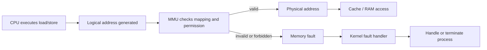
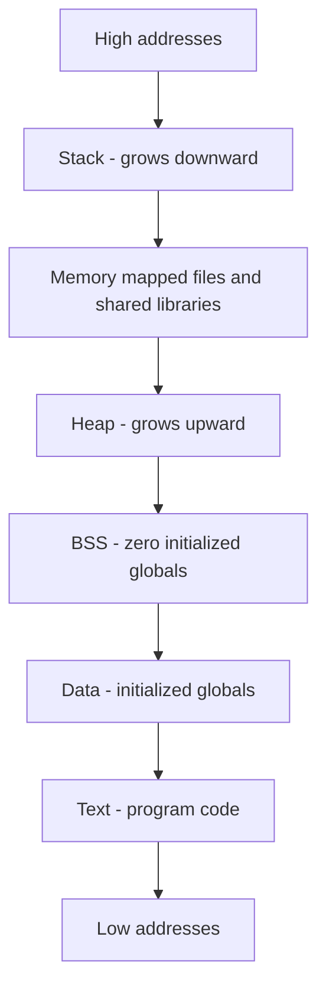
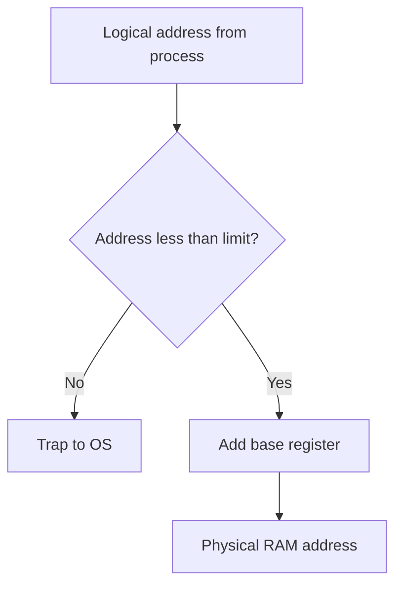

# Day 19 - Memory Management Basics

Difficulty: Intermediate  
Fresh Learning: 40 minutes  
Revision: 5 minutes  
Prerequisites: Days 03-05 - user mode, kernel mode, system calls, program vs process, process address space  
Why this topic matters in interviews: Memory management introduces the ideas behind address translation, process isolation, relocation, and protection. These ideas are the base for paging, TLBs, virtual memory, page faults, and many OS performance questions.

## Opening Intuition

Imagine you open a browser, a code editor, a music player, a terminal, and a database server on the same laptop. Each program behaves as if it owns memory. Chrome does not normally see the private variables of your terminal. A buggy C program does not normally overwrite the kernel. A game can allocate a large heap without knowing which exact RAM chips store its data.

That illusion is created by memory management.

Without memory management, every program would need to know where in physical RAM it should live. Two programs could accidentally use the same address. A malicious program could read another program's secrets. Moving a program in memory would break its internal pointers. Loading several processes at once would become fragile and unsafe.

The operating system solves this by giving each process a controlled view of memory. A program works with addresses that make sense inside its own world. The hardware and OS translate those addresses to real physical memory locations and enforce protection rules.

You see memory management whenever:

- Task Manager or `top` shows each process using memory.
- A program crashes with segmentation fault or access violation.
- A large app starts slowly because code and data must be loaded and mapped.
- A system becomes slow under memory pressure.
- A process is killed because it used too much memory.
- A container has a memory limit and gets terminated when it exceeds it.

Memory management is not just about "where bytes are stored." It is about isolation, safety, relocation, sharing, performance, and the clean abstraction that lets programs run without caring about raw hardware addresses.

## Interview Definition

Memory management is the operating system responsibility of allocating, tracking, translating, protecting, and reclaiming memory for processes and the kernel. It lets each process use logical addresses while the system maps those addresses to physical memory safely. The OS works with hardware support such as the MMU to enforce isolation, relocation, and access permissions.

In interview form: memory management allows multiple programs to share RAM without corrupting each other, while giving each process the abstraction of its own address space.

## Mental Model

Think of physical memory as a large apartment building, and each process as a tenant. The tenant does not get to walk into any room in the building. Instead, the building manager gives the tenant an apartment map: living room, kitchen, storage, bedroom. The tenant uses names and positions inside that apartment.

The real building manager knows which physical rooms correspond to which tenant's apartment. If a tenant tries to open another tenant's door, the manager blocks it. If the tenant moves to a different floor, the tenant's internal apartment map can still look the same.

In OS terms:

- The process sees logical addresses.
- RAM contains physical addresses.
- The MMU performs address translation.
- The OS manages address spaces, permissions, and allocation.
- Protection prevents one process from touching memory it does not own.

The mature interview mental model is: a process does not directly own physical RAM addresses. It owns an address space view, and the OS plus hardware translate and protect that view.

## Layer 1: What happens at a high level?

At a high level, memory management answers five questions.

1. Where can a process store its code, stack, heap, and global data?
2. How does the OS keep one process away from another process's memory?
3. How can a program run without knowing its exact physical RAM location?
4. How does the system decide what memory is free, used, shared, or protected?
5. What should happen if a process accesses an invalid address?

When you run an executable, the OS creates a process and builds a process address space. That address space contains regions such as:

- Text section for executable instructions.
- Data section for initialized global variables.
- BSS for zero-initialized globals.
- Heap for dynamic allocation.
- Stack for function calls and local variables.
- Mapped regions for shared libraries, files, and memory-mapped I/O.

The process uses addresses inside this logical view. The OS records which parts are valid, readable, writable, executable, shared, private, loaded, or not loaded yet.

This gives three major benefits.

First, programs become easier to write. A compiler and linker can generate code assuming a clean address space model. The program does not need to know what other programs are doing.

Second, the system becomes safer. If a process writes outside an allowed region, the hardware traps into the OS instead of silently corrupting another process.

Third, memory can be managed flexibly. The OS can relocate processes, share library pages, map files into memory, lazily load data, and later use paging or swapping.

## Layer 2: What happens inside the OS?

Inside the OS, memory management is tracked through metadata. The exact data structures differ between operating systems, but the responsibilities are similar.

The OS tracks:

- Which physical frames or memory ranges are free.
- Which memory belongs to each process.
- Which virtual or logical regions exist in a process.
- What permissions each region has.
- Which regions are backed by files, anonymous memory, shared libraries, or swap.
- What should happen on invalid access.

When a process asks for memory, for example through `malloc`, the call usually starts in user-space library code. If the existing heap space is enough, no system call may be needed. If more address space or backing memory is needed, the library requests help from the kernel using calls such as `brk`, `sbrk`, or `mmap` on Unix-like systems.

The kernel does not simply hand out random physical addresses to the process. It updates the process memory map and ensures the process has a valid region. Depending on the OS strategy, the physical memory may be assigned immediately or only later when the process first touches the page. That later idea becomes central in virtual memory.

The OS also handles process loading. When an executable starts:

1. The kernel reads executable metadata.
2. It creates a new process address space.
3. It maps code and data segments with suitable permissions.
4. It maps shared libraries.
5. It sets up the stack, arguments, environment, and initial registers.
6. It starts execution at the program entry point.

Protection is enforced through permissions. Code pages may be readable and executable but not writable. Heap pages may be readable and writable but not executable. Kernel memory is not accessible from normal user mode.

This is why a bad pointer is often caught. The CPU attempts an access, the memory management hardware checks whether the address is valid for that process and access type, and the OS receives a fault if it is not.

## Layer 3: What happens at hardware or kernel level?

Hardware support is essential. The OS cannot efficiently check every memory access in software. A program may perform billions of loads and stores per second. If every access required a full kernel function call, programs would become unusably slow.

The key hardware component is the Memory Management Unit, or MMU. The MMU translates addresses produced by the CPU into physical addresses and checks permissions.

In a simple relocation model, the CPU produces a logical address. The hardware may add a base register to produce a physical address, and it may compare the logical address with a limit register to ensure the process does not go out of range.

In modern systems, the idea is usually richer and page-based, but the foundation is the same: CPU-generated addresses are not blindly treated as raw RAM addresses.

Important hardware/kernel concepts:

- Base register: starting physical location for a process or segment in a simple model.
- Limit register: maximum valid range for that process or segment.
- MMU: hardware that translates and checks memory addresses.
- Trap/fault: controlled transfer to the kernel when an invalid or special memory access occurs.
- Privileged mode: kernel mode where the OS can modify memory-management registers and tables.
- User mode: restricted mode where normal programs cannot change address translation rules.

This mode distinction matters. If a normal process could update MMU tables freely, it could map the kernel, steal another process's memory, or mark malicious code as executable. Therefore, memory-management setup is privileged.

The kernel configures the hardware. The hardware enforces the rules at speed.

## Layer 4: What can go wrong?

Memory management bugs are serious because memory is the foundation of program execution.

Common failure cases include:

- Invalid pointer access: a process reads or writes an address not mapped in its address space.
- Buffer overflow: a program writes beyond a valid object and corrupts nearby data.
- Use-after-free: a program uses memory after the allocator has released or reused it.
- Memory leak: memory remains allocated even after the program no longer needs it.
- Stack overflow: deep recursion or huge local allocations exceed stack limits.
- Permission violation: code tries to write to read-only memory or execute non-executable memory.
- Fragmentation: free memory exists, but it is split into pieces that are hard to use efficiently.
- Kernel memory corruption: a bug in privileged code corrupts system memory and may crash the OS.

The OS can catch some errors, especially accesses outside valid regions or permission violations. It cannot catch every logical mistake. If a C program writes within its allocated heap but corrupts the wrong object, the access may be legal from the OS point of view but still wrong from the program point of view.

This distinction is a useful interview point: OS memory protection protects address spaces and permissions, not every high-level object boundary inside a process.

## Step-by-Step Flow

Here is a concrete flow for running a program with memory management:

1. The user starts an executable from a shell, file explorer, or launcher.
2. The parent process requests process creation through the OS.
3. The kernel creates a process control structure and a fresh address space.
4. The executable format is inspected to find code, data, entry point, and library requirements.
5. The kernel maps the code section as readable and executable.
6. The kernel maps writable data and heap-related regions.
7. The kernel creates an initial stack with program arguments and environment variables.
8. The MMU translation structures are configured for the process.
9. The process is scheduled on the CPU.
10. The CPU generates logical or virtual addresses while executing instructions.
11. The MMU translates each address and checks permissions.
12. Valid accesses proceed to cache and physical memory.
13. Invalid accesses trap into the kernel.
14. The kernel decides whether to handle the fault or terminate the process.

Here is a simple flow for an invalid memory write:

1. A process executes an instruction like `*ptr = 10`.
2. The CPU sends the target address to the MMU.
3. The MMU checks the process translation and permission metadata.
4. The address is missing or not writable.
5. The hardware raises a memory fault.
6. The CPU switches to kernel mode and enters the OS fault handler.
7. The OS checks whether this fault is recoverable.
8. If not recoverable, the OS sends a signal or exception to the process.
9. The process may terminate with segmentation fault or access violation.

## Diagram Section

### Logical to Physical Address Translation



This diagram shows the core idea: the CPU does not directly trust a process address. The MMU translates it and checks whether that access is allowed.

### Process Address Space Layout



This is a conceptual layout, not a promise of exact addresses. Different operating systems and security features can randomize or rearrange regions, but the separation of code, data, heap, stack, and mapped regions is the important mental model.

### Base and Limit Protection in a Simple Model



Base and limit registers are a clean way to understand relocation and protection before paging. The process can use addresses starting at zero, while hardware adds the real physical starting point and blocks out-of-range addresses.

## Practical System Relevance

### Linux

Linux gives each process a virtual address space. Process memory regions can be observed through files such as `/proc/<pid>/maps` and commands such as `pmap`. The kernel tracks mappings for executable code, heap, stack, shared libraries, anonymous memory, and memory-mapped files. Invalid memory access often results in `SIGSEGV`.

Linux also uses permissions such as read, write, and execute on memory mappings. This supports protections like non-executable stack and read-only code pages.

### Windows

Windows also uses per-process virtual address spaces and raises access violations for invalid memory access. Tools like Resource Monitor, Process Explorer, and VMMap show process memory regions, committed memory, private bytes, mapped files, stacks, and DLL mappings.

Windows protects kernel memory from user processes and supports memory-mapped files, dynamic library loading, guard pages, and page protection flags.

### Android

Android apps run as separate Linux processes with their own address spaces and app sandboxes. Memory limits matter because mobile devices have constrained resources. If an app leaks memory or uses too much RAM, the system may kill background processes or report application errors.

### Browsers

Modern browsers use multiple processes for isolation. A renderer process should not be able to directly read another site's memory or the browser's privileged process memory. Memory management combines OS process isolation with browser-level sandboxing.

### Databases

Databases care deeply about memory. Buffer pools, page caches, memory-mapped files, and lock tables all rely on controlled memory allocation. A database may keep hot disk pages in memory to reduce I/O latency, but it must avoid starving the rest of the system.

### Servers and Cloud Systems

Servers run many processes and containers on shared machines. OS memory management supports isolation between tenants and workloads. Containers often use cgroups to enforce memory limits. If a container exceeds its memory limit, it may be killed even though the physical machine still has other memory reserved for other workloads.

### File Systems

File systems interact with memory through buffer cache, page cache, and memory-mapped files. Reading a file may populate memory pages. Later reads may be served from RAM instead of disk. This is why memory management affects file I/O performance.

## Code or Pseudocode Section

### Observing a Process Memory Map on Linux

```bash
cat /proc/$$/maps
pmap $$
```

`$$` is the current shell process ID in many shells. These commands show mapped regions such as executable code, heap, stack, shared libraries, and special kernel-provided regions. The key observation is that a process has many memory regions with different permissions.

### A C Pointer Bug That the OS May Catch

```c
#include <stdio.h>

int main(void) {
    int *ptr = NULL;
    *ptr = 42;
    printf("done\n");
    return 0;
}
```

This writes through a null pointer. On a protected OS, address zero is normally not mapped for user writes, so the hardware raises a fault and the OS terminates the process. In Linux this often appears as a segmentation fault.

### A Bug the OS May Not Catch Immediately

```c
#include <stdio.h>
#include <stdlib.h>

int main(void) {
    int *items = malloc(3 * sizeof(int));
    items[0] = 10;
    items[1] = 20;
    items[2] = 30;
    items[3] = 40; // out of bounds
    free(items);
    return 0;
}
```

This is still a bug, but the OS may not catch it immediately because `items[3]` may land inside a mapped heap region. The OS protects memory regions at a coarse level, not every individual C array boundary.

### Pseudocode for Simple Base-Limit Translation

```text
function translate(logicalAddress):
    if logicalAddress < 0 or logicalAddress >= limit:
        raiseMemoryFault()
    return base + logicalAddress
```

This simple pseudocode captures two big ideas: relocation through `base`, and protection through `limit`.

## Common Misconceptions

1. Logical address and physical address are the same.  
   False. A logical address is what the process uses. A physical address refers to an actual RAM location after translation.

2. Memory management is only about allocation.  
   False. Allocation is only one part. Memory management also covers translation, protection, relocation, sharing, fault handling, and reclamation.

3. `malloc` always directly asks the kernel for RAM.  
   False. User-space allocators often reuse already obtained heap regions. They call the kernel only when they need more address space or mappings.

4. A segmentation fault always means the machine ran out of memory.  
   False. It usually means the process accessed memory it was not allowed to access.

5. The OS can detect every buffer overflow.  
   False. The OS can catch invalid region or permission accesses. It often cannot detect writes that remain inside mapped memory but violate language-level object boundaries.

6. Physical memory is unlimited because virtual addresses are large.  
   False. Address space size and actual RAM capacity are different. Virtual memory gives flexibility, not infinite real memory.

7. Kernel memory and user memory are separated only by convention.  
   False. Hardware privilege levels and MMU permissions enforce the separation.

8. Relocation means copying the process every time it runs.  
   False. Relocation means the program can be placed at different physical locations while its internal address view still works. Modern systems usually do this through address translation.

## Tricky Interview Corners

### Logical vs Virtual vs Physical Address

Many interviewers use logical and virtual address similarly in modern OS discussion, especially when talking about addresses generated by a program before MMU translation. Physical address means the actual memory location seen by RAM hardware. If the interviewer distinguishes logical from virtual in a textbook way, logical may refer to CPU-generated address and virtual may refer to the abstraction in a virtual-memory system. The safe answer is to define your terms.

### Address Binding Time

Address binding means deciding where program addresses correspond in memory. It can happen at:

- Compile time: if the final memory location is known in advance.
- Load time: when the program is loaded into memory.
- Execution time: while the program runs, using hardware relocation or translation.

Modern general-purpose systems rely heavily on execution-time binding because processes can be moved, mapped, shared, and isolated dynamically.

### Relocation Is Not the Same as Protection

Relocation lets a program run at a different physical location. Protection stops the program from accessing memory outside its allowed regions. A base register can help with relocation, while a limit register helps with protection.

### The OS Does Not Check Every Access Manually

The OS configures memory rules, but hardware enforces them for normal loads and stores. The kernel gets involved on faults, mapping changes, system calls, and exceptional cases.

### User Mode Cannot Change Its Own Translation Rules

This is crucial. If a user process could change MMU mappings or memory protection bits arbitrarily, process isolation would fail. Only privileged kernel code can install or modify the authoritative mappings.

### Memory Protection Is Not Full Program Safety

OS-level memory protection isolates processes and regions. It does not automatically make C or C++ memory-safe inside a process. That is why use-after-free, buffer overflow, and data races can still exist inside a valid address space.

## Comparison Tables

### Logical Address vs Physical Address

| Feature | Logical Address | Physical Address |
|---|---|---|
| Seen by | Program / CPU execution view | RAM hardware after translation |
| Controlled by | Compiler, loader, process address space | OS and memory hardware |
| Same across processes? | Can look similar | Must map to actual memory locations |
| Used for protection? | Checked through translation metadata | Final target after valid translation |
| Interview phrase | "Address used by the process" | "Actual RAM address" |

### Compile-Time, Load-Time, and Execution-Time Binding

| Binding time | Meaning | Strength | Weakness |
|---|---|---|---|
| Compile time | Address known before execution | Simple | Inflexible |
| Load time | Address chosen when loaded | More flexible | Hard to move while running |
| Execution time | Address translated during execution | Supports relocation and protection | Needs hardware support |

### Internal Safety Layers

| Layer | What it protects | Example failure |
|---|---|---|
| Language/runtime | Object boundaries and lifetime | Array out-of-bounds, use-after-free |
| Process address space | Process isolation | Segmentation fault |
| Kernel privilege | OS memory and hardware control | User process cannot update page tables |
| Container/cgroup | Workload resource limits | Container killed for memory limit |

## How to Explain This in an Interview

### 30-second answer

Memory management is how the OS gives each process a safe address space, maps process addresses to physical RAM, and enforces permissions. The process uses logical or virtual addresses, while the MMU translates them to physical addresses. This lets multiple processes share memory safely without directly controlling hardware addresses.

### 2-minute answer

When a program runs, the OS creates a process address space containing code, data, heap, stack, and mapped regions. The program works with logical addresses inside that view. The kernel configures memory-management hardware so each access is translated and checked. If the access is valid, it reaches physical memory. If it is invalid or violates permissions, the hardware traps to the kernel and the OS may terminate the process or handle the fault.

This gives relocation because the program can run without knowing its actual RAM location. It gives protection because one process cannot normally access another process's private memory or kernel memory. It also prepares the ground for paging, virtual memory, lazy loading, memory-mapped files, shared libraries, and page replacement.

### Deeper follow-up answer

The OS and hardware split responsibilities. The OS builds and maintains the memory metadata: process regions, permissions, physical allocation, and translation structures. The hardware MMU enforces translation and protection on ordinary memory accesses at CPU speed. User-mode code cannot modify these mappings directly because that would break isolation. When an access fails, the CPU enters kernel mode and invokes a fault handler. Some faults are normal and recoverable in virtual memory; others become segmentation faults or access violations.

The important subtlety is that OS protection is region-based. It can stop a process from writing kernel memory or unmapped memory, but it may not catch every incorrect write inside the process's own heap. So memory management is necessary for system safety, but language-level memory safety is a separate issue.

## Interview Questions

### Basic Questions

1. What is memory management in an operating system?
2. What is the difference between a logical address and a physical address?
3. What is the role of the MMU?
4. Why does each process need its own address space?
5. What is address binding?

### Intermediate Questions

6. Explain compile-time, load-time, and execution-time address binding.
7. How do base and limit registers support relocation and protection?
8. What happens when a process accesses invalid memory?
9. Why are user mode and kernel mode important for memory protection?
10. Why is `malloc` not always a direct kernel request?

### Advanced Questions

11. Why can the OS catch some memory bugs but not all buffer overflows?
12. How does memory management support shared libraries?
13. Why is execution-time binding important for modern systems?
14. How does process isolation help browser security?
15. What is the connection between memory management and virtual memory?

## Follow-Up Questions

Q: What is memory management?  
Follow-ups:

- Is it only allocation?
- How does it support isolation?
- What hardware support is required?
- What happens during invalid access?

Q: Logical address vs physical address?  
Follow-ups:

- Who generates the logical address?
- Who sees the physical address?
- Can two processes use the same logical address?
- Why is translation necessary?

Q: What is the MMU?  
Follow-ups:

- Why not let the OS check each access in software?
- What does the MMU do on an invalid access?
- Can user-mode code change MMU mappings?
- How does this relate to page tables later?

Q: What is address binding?  
Follow-ups:

- What is compile-time binding?
- Why is load-time binding more flexible?
- Why does execution-time binding require hardware?
- Which style do modern OSes rely on most?

Q: What is relocation?  
Follow-ups:

- Is relocation the same as protection?
- How does a base register help?
- Why should programs not depend on fixed physical addresses?
- How does relocation help multiprogramming?

Q: What is a segmentation fault?  
Follow-ups:

- Is it always out of memory?
- Is every page fault a segmentation fault?
- Can a program catch or handle it?
- Why might an out-of-bounds write not crash immediately?

Q: How does process isolation work?  
Follow-ups:

- What prevents one process from reading another process?
- What prevents user code from accessing kernel memory?
- How does isolation help containers and browsers?
- Can shared memory intentionally break isolation?

Q: What is the connection between memory management and performance?  
Follow-ups:

- Why does memory pressure slow systems?
- How can cache and TLB behavior matter?
- Why can too many processes affect memory?
- Why does file cache use RAM?

## Trick Questions

1. Q: If two processes both use address `0x400000`, must they refer to the same physical memory?  
   Expected answer: No. The same logical or virtual address in different processes can map to different physical memory.

2. Q: Does a segmentation fault mean the system has no RAM left?  
   Expected answer: Usually no. It means the process made an invalid or forbidden memory access.

3. Q: If an address is inside the heap mapping, is the program definitely using it correctly?  
   Expected answer: No. The access may be valid for the OS but still violate C object boundaries or allocator rules.

4. Q: Can a normal user process change its base register, limit register, or page tables directly?  
   Expected answer: No. Those controls are privileged because otherwise isolation would fail.

5. Q: Is physical memory the same as virtual memory?  
   Expected answer: No. Physical memory is actual RAM. Virtual memory is the address abstraction and mapping system.

6. Q: Does memory protection remove the need for safe programming practices?  
   Expected answer: No. It isolates processes and regions, but bugs inside a process can still corrupt that process.

7. Q: If a process can allocate a very large address range, does that mean RAM was fully reserved immediately?  
   Expected answer: Not necessarily. Modern systems can reserve address space and commit or back memory later.

## Practical Debugging / Observation

Use these commands to connect the concept to real systems.

```bash
ps aux
top
free -h
vmstat 1
cat /proc/$$/maps
pmap $$
ulimit -a
```

What to observe:

- `ps aux` shows process-level memory columns such as RSS and VSZ on many Unix-like systems.
- `top` shows live memory pressure and process memory usage.
- `free -h` separates used memory, free memory, and buffers/cache.
- `vmstat 1` helps show memory, swap, CPU, and I/O behavior over time.
- `/proc/<pid>/maps` shows the process address space layout.
- `pmap` summarizes mapped regions for a process.
- `ulimit -a` shows resource limits, including stack size on many systems.

On Windows, use:

```text
Task Manager
Resource Monitor
Process Explorer
VMMap
```

What to observe:

- Private bytes vs working set.
- DLL mappings.
- Stack and heap regions.
- Guard pages and committed memory.
- Per-process isolation in practice.

## Mini Quiz

### MCQs

1. Which component usually performs address translation during normal memory access?  
   A. Shell  
   B. Compiler  
   C. MMU  
   D. File system

2. A physical address refers to:  
   A. The address written in source code  
   B. The actual RAM location after translation  
   C. The name of a variable  
   D. A file path

3. Which binding style is most flexible for modern multiprogramming systems?  
   A. Compile-time binding  
   B. Execution-time binding  
   C. Manual binding by the programmer  
   D. No binding

4. If a process writes to read-only code memory, the likely result is:  
   A. The OS ignores it  
   B. The write always succeeds  
   C. A memory protection fault  
   D. The compiler restarts

5. Why is user-mode access to kernel memory blocked?  
   A. To make programs slower  
   B. To protect the OS and other processes  
   C. Because RAM cannot store kernel data  
   D. Because physical memory is optional

### Short-Answer Questions

1. Define logical address and physical address in two lines.
2. Why is the MMU needed instead of checking every access in the kernel?
3. What is the difference between relocation and protection?

### Reasoning Questions

1. Two processes print the same pointer value for a global variable. Explain why this does not prove they share the same physical memory.
2. A C program writes one integer beyond an allocated array and does not crash. Explain why the OS may not detect this immediately.

### Answers

1. C - MMU.
2. B - actual RAM location after translation.
3. B - execution-time binding.
4. C - memory protection fault.
5. B - to protect the OS and other processes.

Short answers:

1. A logical address is the address used by the program or CPU execution view. A physical address is the actual RAM address reached after translation.
2. Memory accesses are too frequent for software checking on every load/store. Hardware checks are fast and the OS handles only setup and exceptional cases.
3. Relocation lets a program run at different physical locations. Protection prevents access outside allowed memory regions or permissions.

Reasoning answers:

1. Each process has its own address space. The same logical address can map to different physical frames in different processes.
2. The out-of-bounds location may still be inside a mapped heap region. The OS sees a valid process memory access even though the C object boundary was violated.

# 5-Minute Revision Column

Revision Targets:

- Day 18: Deadlocks Part 2 - R1 recall revision, previous day reinforcement.
- Day 16: Monitors and Condition Variables - R2 compression revision, three-day spaced recall.

## Day 18 - Deadlocks Part 2 (R1 Recall Revision)

Core recall: deadlock handling has four broad strategies: prevention, avoidance, detection, and recovery. Prevention changes the design so at least one Coffman condition cannot hold, such as enforcing lock ordering to break circular wait. Avoidance is more dynamic: before granting a request, the system checks whether the resulting state remains safe. Detection allows deadlocks to happen, then looks for cycles or impossible completion. Recovery is the action after detection, such as aborting a process, rolling back a transaction, or preempting a resource.

Key definitions:

- Deadlock prevention: design rules that make deadlock structurally impossible.
- Deadlock avoidance: runtime approval only when the system stays in a safe state.
- Safe state: a state where some process completion order can satisfy all remaining needs.
- Banker algorithm: the classic avoidance algorithm using maximum demand, allocation, need, and available resources.

Practical example: databases often use detection and recovery. If two transactions lock rows in opposite order, the database can detect a wait-for cycle, choose a victim, roll it back, and let the application retry.

Pitfalls:

- Unsafe state does not mean deadlock already exists.
- Banker algorithm is avoidance, not a general deadlock detector.
- A timeout does not prove deadlock; it may be overload or slow I/O.

Tricky questions:

1. If a resource is available, should the system always grant it? Not under avoidance if it would make the state unsafe.
2. Is killing a process always safe recovery? No. It may lose work or leave higher-level state inconsistent.
3. Can deadlock happen without classic mutex locks? Yes. Worker slots, buffers, database rows, and RPC dependencies can form cycles.

One-line memory: prevention changes the rules, avoidance checks safe states, detection finds cycles, and recovery forces progress.

## Day 16 - Monitors and Condition Variables (R2 Compression Revision)

Core recall:

- A monitor groups shared state, protected operations, and a lock.
- A condition variable lets threads sleep until a protected state predicate may have changed.
- `wait` atomically releases the lock, blocks, and reacquires the lock before returning.
- In Mesa-style semantics, `signal` makes a waiter ready but does not guarantee it runs immediately.
- Always check the predicate in a `while` loop, not a one-time `if`.

Definitions:

- Monitor: a synchronization abstraction that permits one thread at a time inside protected code.
- Predicate: the actual boolean condition over shared state, such as `queue.size() > 0`.

Example: in a bounded buffer, a producer waits while the buffer is full, and a consumer waits while it is empty. Signals tell waiters that the state may now allow progress.

Pitfalls:

- A condition variable does not store the condition.
- A wakeup does not prove the condition is true.

Tricky questions:

1. Does `signal` save a wakeup if no thread is waiting? Usually no.
2. Does `wait` keep the mutex locked while sleeping? No, it releases it atomically and reacquires it before returning.

One-line memory: the lock protects state, the predicate defines truth, and the condition variable manages sleeping and wakeup.

## Final Takeaway

Memory management is the OS mechanism that makes programs feel like they have clean private memory while still sharing real RAM with the entire system. The process uses logical addresses; the hardware and OS translate them to physical addresses and enforce access rules. Relocation lets programs run without fixed physical locations. Protection prevents one process from corrupting another process or the kernel. The MMU makes these checks fast enough for ordinary execution. This foundation is necessary before paging, TLBs, virtual memory, page faults, and memory performance topics make sense.

## What You Should Be Able To Answer Now

- Define memory management in interview-ready language.
- Distinguish logical addresses from physical addresses.
- Explain why the MMU is needed.
- Describe base and limit register intuition.
- Explain address binding at compile time, load time, and execution time.
- Walk through what happens during invalid memory access.
- Explain why OS protection catches some memory bugs but not all.
- Connect memory management to Linux, Windows, Android, browsers, servers, databases, and containers.
