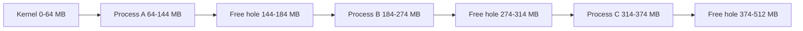
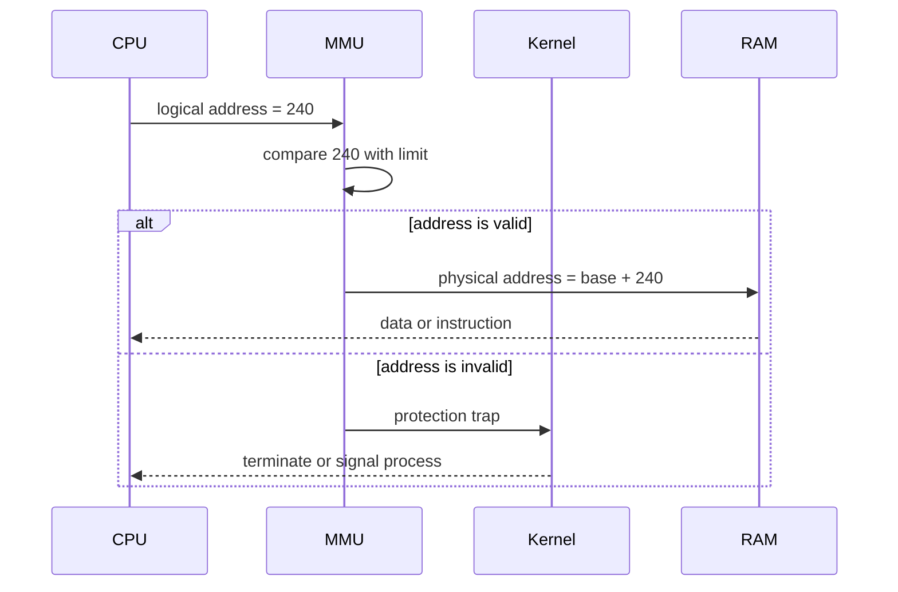
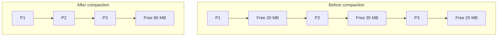

# Day 20 - Contiguous Memory Allocation

Difficulty: Intermediate  
Fresh Learning: 40 minutes  
Revision: 5 minutes  
Prerequisites: Day 19 - Memory Management Basics: logical address, physical address, MMU, relocation, and protection  
Why this topic matters in interviews: Fragmentation questions remain common because they test whether you understand memory allocation beyond definitions. Interviewers often ask you to compare internal and external fragmentation, trace first fit / best fit / worst fit, and explain why modern systems moved toward paging.

## Opening Intuition

Imagine a hostel with a long row of rooms. Some students need one room, some need two adjacent rooms, and some need five adjacent rooms because they are arriving as a group. If the hostel manager gives each group one continuous stretch of rooms, placement looks simple at first: find a large enough empty stretch and assign it.

The problem appears after many check-ins and check-outs. You may have ten empty rooms in total, but they are scattered as one room here, two rooms there, and three rooms somewhere else. A new group needs six adjacent rooms. The hostel has enough total empty rooms, but not enough continuous empty rooms. That is the core pain of contiguous memory allocation.

Early operating systems used similar ideas. A process was loaded into one continuous block of physical memory. If a process needed 40 MB, the OS tried to find a 40 MB continuous hole in RAM. This made address calculation simple, but it created fragmentation. Some memory was wasted inside allocated partitions, and some memory was free but unusable because it was broken into small pieces.

You still see this idea in practical systems even though modern general-purpose OSes rely heavily on paging. Bootloaders, embedded systems, kernel allocators, DMA buffers, huge pages, and some real-time systems still care about physically contiguous memory. So this topic is not only historical. It teaches the allocation tradeoff that later motivates paging, virtual memory, and smarter allocators.

## Interview Definition

Contiguous memory allocation is a memory-management technique where each process is placed in one continuous block of physical memory. The OS keeps track of occupied partitions and free holes, then allocates a hole large enough for a process. It is simple and fast for address translation, but it suffers from internal fragmentation in fixed partitions and external fragmentation in variable partitions.

## Mental Model

Think of physical memory as a single long parking lane and each process as a vehicle that needs a continuous parking space. A small car can fit in a small slot. A bus needs a long continuous slot. If the parking lane becomes full of gaps between parked vehicles, the total empty space may look large, but a bus still cannot park unless one gap is large enough.

The memory manager's job is to answer three questions:

1. Where is the next large enough continuous free block?
2. How much free memory will remain after placing the process?
3. How painful will this placement be for future allocations?

First fit answers quickly. Best fit tries to reduce leftover waste. Worst fit tries to keep large holes available. None of them is perfect because the future allocation pattern is unknown.

## Layer 1: What happens at a high level?

In contiguous allocation, the OS divides physical memory into regions. The kernel occupies a protected region, and user processes are loaded into available memory partitions. Each process gets one continuous range:

```txt
Process P1: physical addresses 10000 to 29999
Process P2: physical addresses 30000 to 54999
Process P3: physical addresses 70000 to 89999
```

The process does not normally think in raw physical addresses. It uses logical addresses such as 0, 4, 100, or 4096 relative to its own address space. The hardware and OS can translate these using a base and limit style mechanism:

- Base register: where the process starts in physical memory.
- Limit register: how large the process's legal address range is.

If process P1 starts at physical address 10000 and tries to access logical address 240, the physical address becomes:

```txt
physical address = base + logical address
physical address = 10000 + 240 = 10240
```

If P1 tries logical address 25000 but its limit is only 20000, the hardware traps because the access is outside its legal range.

At this level, contiguous allocation feels attractive. It is easy to understand, easy to implement, and easy to translate. The hard part is what happens as processes come and go.

## Layer 2: What happens inside the OS?

The OS maintains some data structure that records free and allocated regions. A simple version is a free list:

| Start Address | Size | Status |
|---:|---:|---|
| 0 | 64 MB | Kernel |
| 64 MB | 120 MB | Process A |
| 184 MB | 40 MB | Free |
| 224 MB | 90 MB | Process B |
| 314 MB | 70 MB | Free |

When a new process arrives, the OS searches the free holes and chooses one based on an allocation policy. After allocation, the free-list entry is updated or split. When a process exits, its memory region is returned to the free list, and adjacent free holes may be merged.

For example, if a 30 MB process is placed into a 70 MB hole, the OS may split the hole:

```txt
Before:
Free hole: start 314 MB, size 70 MB

After allocating 30 MB:
Process C: start 314 MB, size 30 MB
Free hole: start 344 MB, size 40 MB
```

If later Process C exits and the neighboring 40 MB region is still free, the OS can coalesce them back into one 70 MB hole. Coalescing is important because without it, free space becomes increasingly fragmented.

## Layer 3: What happens at hardware or kernel level?

The simplest hardware support for contiguous allocation uses relocation and protection registers:

- A base register stores the starting physical address of the process.
- A limit register stores the maximum legal logical address or process size.
- Every memory reference is checked against the limit.
- If valid, the base is added to produce the physical address.
- If invalid, the CPU traps into the OS.

This design enforces isolation. A user process cannot simply access another process's memory by guessing a physical address because its logical address must stay within its limit. The base and limit registers are privileged state. User code cannot change them directly; only the kernel can load them during dispatch or context switch.

Contiguous allocation is also tied to process loading. When the OS loads a program, it must choose a physical location and relocate addresses if needed. Dynamic relocation with base registers is better than hardcoding physical addresses because a program can be loaded at different places on different runs.

Hardware simplicity is the major advantage. There is no page table walk for every access, no multi-level page table structure, and no TLB dependency in the basic model. But the price is allocation inflexibility: a process needs one continuous physical chunk.

## Layer 4: What can go wrong?

The main failure mode is fragmentation.

Internal fragmentation happens when allocated memory contains unused space inside the allocated partition. This is common in fixed partition systems. If every partition is 100 MB and a process needs 62 MB, 38 MB is wasted inside that partition. Other processes cannot use that leftover space because the partition is already assigned.

External fragmentation happens when free memory exists, but it is split into holes that are too small or poorly placed. This is common in variable partition systems. If a process needs 80 MB and free memory is split into 30 MB, 20 MB, and 40 MB holes, the total free memory is 90 MB but no single hole is large enough.

Compaction can reduce external fragmentation by moving processes together to create one large free region. But compaction is expensive. Moving a process means copying memory, updating relocation information, pausing or coordinating execution, and handling I/O buffers carefully. In systems with hardware support for dynamic relocation, compaction is easier than with absolute addresses, but it is still not free.

## Fixed Partition Allocation

In fixed partition allocation, memory is divided into fixed-size partitions before process allocation. Each partition can hold one process.

Example:

```txt
Memory: 512 MB
Kernel: 64 MB
User partitions: four partitions of 112 MB each
```

If a process is smaller than 112 MB, the leftover space inside that partition is wasted. If a process is larger than 112 MB, it cannot run even if several partitions are free, unless the system supports overlays or another special strategy.

Fixed partitions are simple:

- Easy bookkeeping.
- Fast allocation.
- Clear protection boundary.
- Predictable partition layout.

But the waste can be severe:

| Partition Size | Process Size | Waste |
|---:|---:|---:|
| 100 MB | 98 MB | 2 MB |
| 100 MB | 60 MB | 40 MB |
| 100 MB | 12 MB | 88 MB |

This wasted space is internal fragmentation because the free space is trapped inside an allocated partition.

## Variable Partition Allocation

In variable partition allocation, the OS creates partitions dynamically based on process size. If a process needs 42 MB, the OS tries to allocate a 42 MB block rather than placing it into a fixed 100 MB partition.

This reduces internal fragmentation because the partition can match the process size more closely. But it introduces external fragmentation because processes leave holes of different sizes when they terminate.

Example:

```txt
Initial free memory: 300 MB
Allocate A = 80 MB
Allocate B = 60 MB
Allocate C = 70 MB
Free B = 60 MB
Allocate D = 50 MB
```

Now there may be a 10 MB leftover hole near D, plus whatever remains at the end. Over many allocations and frees, memory becomes a patchwork of allocated blocks and small holes.

Variable partition allocation is more flexible than fixed partition allocation, but the OS must choose a placement strategy carefully.

## Step-by-Step Flow

Here is a practical allocation flow for a variable partition system:

1. A process is created and requests a memory size.
2. The OS checks whether the requested size is valid and available.
3. The memory manager searches the free-list holes.
4. The selected allocation policy chooses a hole.
5. If the hole is larger than needed, the OS splits the hole.
6. The OS records the allocated region in the process metadata.
7. The dispatcher loads the process base and limit when the process runs.
8. The CPU checks every memory reference against the limit.
9. When the process exits, the OS marks its region free.
10. Adjacent free holes are merged if possible.
11. If external fragmentation becomes severe, the OS may consider compaction if supported.

## Diagram Section

### Diagram 1: Contiguous Allocation and External Fragmentation



This diagram shows the key interview issue: free memory can exist in multiple holes. A new process needs one hole large enough, not merely enough total free memory.

### Diagram 2: Base and Limit Address Translation



This is the basic hardware protection model behind contiguous allocation. The process uses logical addresses, while the hardware checks boundaries and produces physical addresses.

### Diagram 3: Compaction Before and After



Compaction moves allocated processes together so scattered holes become one large hole. It improves allocation opportunities but costs CPU time, memory bandwidth, and coordination.

## Allocation Algorithms

### First Fit

First fit scans the free list from the beginning and chooses the first hole large enough.

Example holes:

```txt
20 MB, 80 MB, 35 MB, 100 MB
Request: 30 MB
First fit chooses: 80 MB
Leftover: 50 MB
```

First fit is usually fast because it stops early. It does not try to find the mathematically best hole; it tries to find a good-enough hole quickly. Its common weakness is that small fragments may accumulate near the beginning of memory because that area is searched and split frequently.

### Best Fit

Best fit scans for the smallest hole that can satisfy the request.

Example holes:

```txt
20 MB, 80 MB, 35 MB, 100 MB
Request: 30 MB
Best fit chooses: 35 MB
Leftover: 5 MB
```

Best fit sounds efficient because it minimizes leftover space for the current allocation. The trap is that it can create many tiny holes that are too small for future processes. It may also require scanning the entire free list unless the holes are organized by size.

### Worst Fit

Worst fit chooses the largest available hole.

Example holes:

```txt
20 MB, 80 MB, 35 MB, 100 MB
Request: 30 MB
Worst fit chooses: 100 MB
Leftover: 70 MB
```

Worst fit tries to avoid tiny leftovers by splitting the largest hole. The intuition is that the remaining part may still be useful. In practice, it can waste large holes quickly and does not consistently outperform the others.

### Next Fit

Next fit is a variant of first fit. Instead of always starting from the beginning, it resumes scanning from where the last allocation ended. This can reduce repeated fragmentation near the front of memory, but it may also skip useful holes and behave worse depending on workload.

## Comparison Tables

### Fixed vs Variable Partition Allocation

| Feature | Fixed Partition | Variable Partition |
|---|---|---|
| Partition size | Chosen in advance | Chosen per process |
| Main waste | Internal fragmentation | External fragmentation |
| Allocation speed | Usually simple and fast | Needs hole search |
| Flexibility | Low | Higher |
| Large process issue | Cannot fit if larger than partition | Can fit if a large enough hole exists |
| Compaction relevance | Less central | Important for external fragmentation |

### Internal vs External Fragmentation

| Point | Internal Fragmentation | External Fragmentation |
|---|---|---|
| Where waste exists | Inside allocated block | Between allocated blocks |
| Common cause | Fixed-size partitions or rounded allocation | Variable-size allocation and deallocation |
| Can another process use it? | No, because block is already assigned | Not unless a hole is large enough |
| Example | 100 MB partition holds 62 MB process | Total 90 MB free split as 30 + 20 + 40 |
| Typical fix | Smaller partitions, dynamic allocation, paging | Compaction, paging, better placement |

### First Fit vs Best Fit vs Worst Fit

| Algorithm | Selection rule | Strength | Weakness |
|---|---|---|---|
| First fit | First large enough hole | Fast and simple | Can leave small holes near front |
| Best fit | Smallest sufficient hole | Reduces immediate leftover | Can create tiny unusable fragments |
| Worst fit | Largest hole | Leaves a larger remainder | Can consume large holes too aggressively |
| Next fit | First fit from last position | Avoids always starting at front | Workload-dependent behavior |

## Practical System Relevance

Modern desktop and server operating systems usually do not allocate each user process as one contiguous physical block. Paging solves the external-fragmentation problem by allowing a process's virtual address space to map to non-contiguous physical frames. That is why this lesson prepares you for Day 21.

Still, contiguous allocation ideas remain relevant:

- Boot process: early boot code often runs before the full virtual-memory system is active, so simple contiguous memory regions matter.
- Kernel memory: some kernel allocations require physically contiguous memory, especially for DMA or hardware buffers.
- Embedded systems: small systems may use simple fixed or variable partition allocation because predictability matters more than flexibility.
- Huge pages: large page mappings need larger contiguous physical regions than ordinary small pages.
- Real-time systems: predictable allocation can matter more than maximum memory utilization.
- Memory allocators: user-space allocators such as malloc manage contiguous regions inside heaps and still deal with splitting, coalescing, and fragmentation.

In Linux, general process memory is virtual and paged, but the kernel still distinguishes between normal allocations and allocations requiring physical contiguity. Device drivers may need DMA-safe buffers. The buddy allocator also works with blocks of physical pages and splits or coalesces blocks, so the fragmentation theme remains alive.

In databases and servers, memory pools often allocate chunks from larger arenas. Even when physical memory is paged, allocator-level fragmentation can hurt memory usage. A server may appear to have free memory while its allocator cannot satisfy a large contiguous request inside a specific pool.

In browsers, many processes and heaps are active at once. The OS may use paging, but browser engines and JavaScript runtimes still manage internal heaps where fragmentation and compaction affect latency. Garbage collectors often perform compaction for similar reasons: make allocation easier and improve locality.

## Code or Pseudocode Section

Here is simple C-like pseudocode for first fit:

```c
Block *allocate_first_fit(size_t request) {
    for (Block *hole = free_list; hole != NULL; hole = hole->next) {
        if (hole->size >= request) {
            if (hole->size == request) {
                remove_from_free_list(hole);
                return hole;
            }

            Block *allocated = split_front(hole, request);
            hole->start += request;
            hole->size -= request;
            return allocated;
        }
    }

    return NULL; // no sufficiently large contiguous hole
}
```

This demonstrates the central point: allocation fails if no single hole is large enough. It does not matter that total free memory across all holes might exceed the request.

Coalescing on free is equally important:

```c
void free_block(Block *block) {
    insert_sorted_by_address(&free_list, block);

    if (block->prev && block->prev->end == block->start) {
        merge(block->prev, block);
        block = block->prev;
    }

    if (block->next && block->end == block->next->start) {
        merge(block, block->next);
    }
}
```

This shows why the free list is often kept sorted by address. Adjacent free blocks can be merged only if the allocator can detect they touch each other.

For observation on a Linux machine, these commands connect the concept to real memory behavior:

```bash
free -h
cat /proc/meminfo
pmap -x <pid>
vmstat 1
```

`free -h` shows broad memory availability. `/proc/meminfo` exposes kernel memory categories. `pmap -x` shows a process's virtual memory mappings, reminding you that modern systems mostly expose virtual regions rather than one physical contiguous block. `vmstat 1` helps you observe memory pressure and swapping behavior, which will matter more in virtual memory lessons.

## Common Misconceptions

- "If total free memory is enough, allocation must succeed." False. Contiguous allocation needs one continuous hole large enough for the request.
- "Internal and external fragmentation are the same kind of waste." False. Internal waste is inside an allocated block. External waste is free space split between allocations.
- "Best fit is always best." False. Best fit can create tiny unusable holes and may require longer searches.
- "Compaction is a free cleanup step." False. Compaction moves memory and can be expensive or unsafe without relocation support.
- "Paging is unrelated to contiguous allocation." False. Paging is partly motivated by the limitations of contiguous allocation.
- "Base and limit registers are only for performance." False. They also enforce protection by preventing illegal memory access.
- "Fixed partitions never suffer external fragmentation." Mostly true in the classic sense, but they can still waste memory badly through internal fragmentation and poor partition sizing.

## Tricky Interview Corners

One common interview trap is being asked whether external fragmentation means memory is full. It does not. External fragmentation means usable free memory is scattered. The system may have enough total free memory, but not enough continuous free memory.

Another trap is assuming best fit always minimizes total waste. Best fit minimizes leftover space for the current allocation, but local optimization can create many small holes that are useless later. Allocation algorithms are workload-dependent because the OS does not know future process sizes and lifetimes.

Compaction questions often hide a hardware assumption. If the system has static relocation, moving a process is hard because addresses may already be fixed. If it has dynamic relocation through base registers or page tables, moving is easier because mappings can be updated. But even then, copying memory costs time and may interfere with running processes and I/O.

Interviewers may also ask why modern OSes still care about contiguous physical memory if paging exists. The answer is that some hardware operations and kernel subsystems still require contiguous physical regions. Paging makes virtual memory contiguous from the process view, but it does not magically remove every physical contiguity requirement.

Finally, do not confuse contiguous virtual memory with contiguous physical memory. A process can have a virtual range that appears continuous while the OS maps it to scattered physical frames. That is the central idea behind paging.

## How to Explain This in an Interview

### 30-second answer

Contiguous memory allocation means each process is placed in one continuous physical memory block. It is simple because address translation can use base and limit registers, but it causes fragmentation. Fixed partitions mainly cause internal fragmentation, while variable partitions mainly cause external fragmentation. Fit algorithms decide which free hole to use.

### 2-minute answer

In early memory-management schemes, the OS loaded each process into a continuous region of physical memory. The process used logical addresses, and hardware added a base address after checking the limit. This made relocation and protection manageable. The difficulty is allocation over time. With fixed partitions, a process may not use the full partition, causing internal fragmentation. With variable partitions, processes leave holes when they exit, causing external fragmentation. The OS may use first fit, best fit, worst fit, or next fit to choose holes. If free space becomes scattered, compaction can move processes together, but it is expensive.

### Deeper follow-up answer

The deeper design lesson is that contiguous allocation optimizes simplicity but loses flexibility. It assumes each process needs one large physical range, which becomes painful as process sizes and lifetimes vary. Paging changes the problem by splitting memory into fixed-size pages and frames so a process does not need one continuous physical region. But the fragmentation idea remains important because allocators, kernel memory, DMA buffers, huge pages, and embedded systems still face contiguity and fragmentation tradeoffs.

## Interview Questions

### Basic Questions

1. What is contiguous memory allocation?
2. Why does a process need a continuous block in this scheme?
3. What are base and limit registers used for?
4. What is internal fragmentation?
5. What is external fragmentation?

### Intermediate Questions

6. Compare fixed partition allocation and variable partition allocation.
7. Why can allocation fail even when total free memory is enough?
8. How does first fit differ from best fit?
9. Why can best fit create many tiny holes?
10. What is compaction, and why is it expensive?

### Advanced Questions

11. Why did paging become more attractive than contiguous allocation?
12. Can a modern OS still need physically contiguous memory? Give examples.
13. How does dynamic relocation make compaction easier?
14. Why is external fragmentation more associated with variable partitions?
15. How would you design a free-list allocator to support coalescing?

## Follow-Up Questions

Q: What is contiguous memory allocation?  
Follow-ups:
- Does the block need to be physically contiguous or virtually contiguous?
- How does the OS protect one process from another?
- Why is this simple for address translation?

Q: What is internal fragmentation?  
Follow-ups:
- Which allocation scheme commonly causes it?
- Can internal fragmentation happen in modern allocators?
- How is it different from external fragmentation?

Q: What is external fragmentation?  
Follow-ups:
- Can total free memory be enough but still unusable?
- How can compaction help?
- Why does paging reduce this issue?

Q: Compare first fit and best fit.  
Follow-ups:
- Which is faster?
- Which can create smaller leftover holes?
- Why is the best algorithm workload-dependent?

Q: Why is compaction costly?  
Follow-ups:
- What must be moved?
- What metadata must be updated?
- Why can I/O make moving memory tricky?

Q: Why did OSes move toward paging?  
Follow-ups:
- How does paging avoid the need for one large hole?
- Does paging remove all fragmentation?
- What kind of fragmentation can paging still have?

## Trick Questions

1. Q: If a system has 300 MB free in total, can it always load a 200 MB process under contiguous allocation?  
   Expected answer: No. It needs one continuous 200 MB hole.

2. Q: Is best fit always the best placement algorithm?  
   Expected answer: No. It may create tiny unusable holes and can be slower if it scans many holes.

3. Q: Does compaction increase total physical memory?  
   Expected answer: No. It rearranges allocated blocks so scattered free space becomes more usable.

4. Q: Does paging mean physical contiguity never matters?  
   Expected answer: No. Some kernel and hardware operations may still require contiguous physical memory.

5. Q: If a process has a contiguous virtual address range, must it be contiguous in RAM?  
   Expected answer: No. With paging, virtual continuity can map to scattered physical frames.

6. Q: Is external fragmentation wasted memory inside an allocated process?  
   Expected answer: No. That describes internal fragmentation.

7. Q: Can fixed partition allocation reject a process even when memory is free?  
   Expected answer: Yes, if no available partition is large enough for the process.

## Practical Debugging / Observation

On a modern Linux system, you will not usually see "process P occupies one physical block from X to Y" because virtual memory hides physical placement. But you can still observe memory-management ideas:

```bash
free -h
cat /proc/meminfo
pmap -x <pid>
cat /proc/<pid>/maps
vmstat 1
```

Look for three lessons:

- A process sees virtual mappings, not raw physical RAM addresses.
- Memory is divided into regions with permissions such as read, write, and execute.
- System memory pressure can exist even when individual mappings look valid.

If you study allocator behavior in C, you can also create and free many differently sized allocations, then observe process memory with `pmap`. The OS view and the allocator's internal view are not identical, but the splitting and coalescing idea is similar.

## Mini Quiz

### MCQs

1. Which fragmentation is most associated with fixed partition allocation?  
   A. External fragmentation  
   B. Internal fragmentation  
   C. Belady's anomaly  
   D. Thrashing

2. Which allocation policy chooses the first sufficiently large hole?  
   A. Best fit  
   B. Worst fit  
   C. First fit  
   D. Clock

3. Which condition can make contiguous allocation fail?  
   A. Total free memory is larger than the process  
   B. No single hole is large enough  
   C. The process has a stack  
   D. The CPU has registers

4. What does compaction mainly target?  
   A. Internal fragmentation  
   B. External fragmentation  
   C. System-call overhead  
   D. CPU scheduling latency

5. What hardware mechanism is commonly used in simple contiguous allocation?  
   A. Base and limit registers  
   B. Dining philosophers  
   C. Disk inode table  
   D. Round Robin queue

### Short-answer questions

1. Define contiguous memory allocation in two lines.
2. Why is external fragmentation different from internal fragmentation?
3. Why can compaction be expensive?

### Reasoning questions

1. Holes are 15 MB, 70 MB, 40 MB, and 90 MB. A process requests 35 MB. Which hole does first fit choose? Which hole does best fit choose? Which hole does worst fit choose?
2. A system has 20 MB, 25 MB, 30 MB, and 35 MB free holes. A process requests 80 MB. Explain why allocation fails under contiguous allocation but may succeed under paging.

### Answers

1. B  
2. C  
3. B  
4. B  
5. A  

Short answers:

1. Contiguous memory allocation places each process in one continuous block of physical memory. The OS tracks free holes and allocated partitions.
2. Internal fragmentation is wasted space inside an allocated block. External fragmentation is free space split into holes between allocated blocks.
3. Compaction copies process memory, updates relocation information, may pause work, and can conflict with active I/O or pinned memory.

Reasoning answers:

1. First fit chooses 70 MB. Best fit chooses 40 MB. Worst fit chooses 90 MB.
2. No single contiguous hole is 80 MB, so contiguous allocation fails. Paging can place the process across separate physical frames while presenting a continuous virtual address space.

# 5-Minute Revision Column

Revision targets from prepare: Day 19 - Memory Management Basics (R1), Day 17 - Deadlocks Part 1 (R2), Day 15 - Classical Synchronization Problems (R3).

## Day 19 - Memory Management Basics (R1 Recall Revision)

- Memory management lets each process use logical or virtual addresses while the OS and MMU map them to physical memory safely.
- The OS is not only allocating memory; it also tracks ownership, enforces permissions, supports relocation, and reclaims memory.
- Key definitions: logical address means the address generated by the program; physical address means the actual RAM location; MMU means the hardware unit that performs address translation and protection checks.
- Practical example: two processes may both use virtual address `0x400000`, but those addresses can map to different physical frames.
- Common traps: a segmentation fault usually means invalid or forbidden access, not "RAM is full"; `malloc` often serves memory from a user-space heap before needing new memory from the kernel.
- Quick interview questions: Why can two processes use the same logical address safely? Why should user code not modify page tables or relocation registers directly?
- Mental model: physical memory is the building; each process gets a private apartment map; the OS manager decides which real rooms the map points to.

## Day 17 - Deadlocks Part 1 (R2 Compression Revision)

- Deadlock is permanent waiting caused by a closed dependency cycle among processes or threads.
- The four Coffman conditions are mutual exclusion, hold and wait, no preemption, and circular wait.
- Resource-allocation graphs show request edges and assignment edges; a wait-for cycle is the important signal.
- Deadlock is not the same as slow I/O, sleeping, or starvation.
- A cycle proves deadlock directly only when each resource type has a single instance.

Definitions:

- Deadlock: a group is stuck because each member waits for another member.
- Hold and wait: a process keeps one resource while requesting another.

Traps:

- More CPU cores do not prevent deadlock.
- Atomic instructions can implement locks but do not prevent circular wait.

Quick questions:

1. Can deadlock happen without mutexes?
2. Why do all four Coffman conditions matter?

## Day 15 - Classical Synchronization Problems (R3 Flash Revision)

Classical synchronization problems are templates for reasoning about shared state and waiting conditions.

Must remember:

- Producer-consumer: bounded buffer, not-empty, and not-full coordination.
- Readers-writers: concurrent reads are allowed, but writers need exclusive access.
- Dining philosophers: multiple resources plus circular wait can create deadlock.

Killer pitfall: a mutex alone protects a buffer's structure, but it does not tell consumers when the buffer is non-empty or producers when it is not full.

Tricky question: Can a deadlock-free synchronization solution still starve a thread? Yes, fairness is a separate property.

## Final Takeaway

Contiguous memory allocation is simple because each process gets one continuous physical block and address translation can use base and limit registers. Its weakness is fragmentation. Fixed partitions waste space inside allocated blocks, while variable partitions scatter free memory into holes. Fit algorithms choose holes using different tradeoffs, but no policy can perfectly predict future allocations. Compaction can repair external fragmentation, but it costs time and coordination. Paging becomes attractive because it removes the need for a process to occupy one continuous physical region.

## What You Should Be Able To Answer Now

- Explain contiguous memory allocation in interview-ready language.
- Distinguish fixed partition and variable partition allocation.
- Compare internal fragmentation and external fragmentation.
- Trace first fit, best fit, worst fit, and next fit on a hole list.
- Explain why compaction helps and why it is expensive.
- Describe how base and limit registers provide relocation and protection.
- Explain why paging solves the single-large-hole problem.
- Connect fragmentation to real systems such as kernel buffers, allocators, huge pages, and embedded memory.
