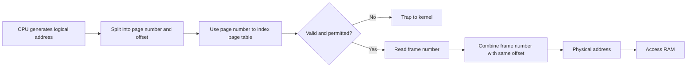
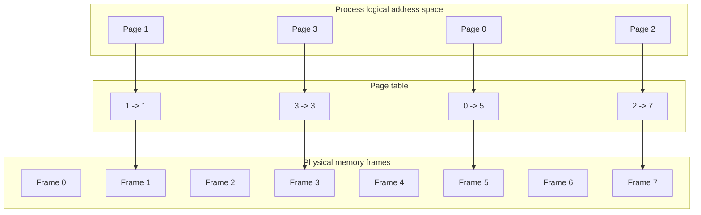

# Day 21 - Paging Basics

Difficulty: Intermediate  
Fresh Learning: 40 minutes  
Revision: 5 minutes  
Prerequisites: Days 19-20 - logical address, physical address, MMU, relocation, protection, fragmentation  
Why this topic matters in interviews: Paging is the foundation for virtual memory, demand paging, TLBs, page faults, multi-level page tables, and many numerical questions. If you can explain page number, offset, frame number, and page-table translation clearly, many later memory-management topics become much easier.

## Opening Intuition

Imagine a library that has thousands of books, but instead of requiring each subject to occupy one continuous shelf, the librarian divides every shelf into equal-sized slots. A large subject can now use slot 3 on one shelf, slot 19 on another shelf, and slot 44 somewhere else. The subject still appears organized in the catalog because the catalog maps "chapter 0, chapter 1, chapter 2" to the actual shelf slots.

Paging does a similar thing for memory.

Before paging, contiguous allocation tried to place a process in one continuous physical memory block. That was simple, but it created a painful problem: a process could fail to load even when total free memory was enough, because the free space was split into small holes. Paging removes this requirement. A process's logical address space is split into fixed-size pieces called pages, and physical memory is split into fixed-size pieces called frames. Any page can be placed into any free frame. The page table becomes the catalog that says where each page currently lives.

You experience the benefits every day. You can open a browser, editor, terminal, music app, and background services without each process needing one giant continuous RAM region. The operating system can scatter physical frames across RAM while giving each process the illusion of a clean, continuous address space.

Paging is also the bridge between simple memory allocation and modern virtual memory. Once the OS can translate virtual pages to physical frames, it can protect processes from each other, share read-only pages, load pages on demand, move pages to disk, and give each program a private view of memory.

## Interview Definition

Paging is a memory-management scheme in which a process's logical address space is divided into fixed-size pages and physical memory is divided into fixed-size frames. The OS maintains a page table that maps each page number to a frame number. During address translation, the page number selects a page-table entry, and the offset is copied unchanged to form the final physical address.

## Mental Model

Think of a process's memory as a numbered notebook and physical RAM as a set of equal-sized lockers. Page 0 of the notebook may be in locker 11, page 1 may be in locker 4, page 2 may be in locker 38, and so on. The process reads the notebook as if the pages are continuous. The OS and hardware use a directory, the page table, to find the real locker for each page.

The key mental split is:

1. The program thinks in pages and offsets.
2. RAM stores frames and offsets.
3. The page table converts page number to frame number.
4. The offset does not change because page size and frame size are equal.

If you remember only one sentence: paging replaces the need for one large continuous physical block with many small fixed-size physical frames connected by a page table.

## Layer 1: What happens at a high level?

At a high level, paging divides memory into equal units.

- Logical address space is divided into pages.
- Physical memory is divided into frames.
- Page size equals frame size.
- A page table records which frame contains each page.
- A logical address is split into page number and offset.
- The MMU uses the page table to translate the page number into a frame number.

Suppose page size is 4 KB. A process has logical addresses from 0 upward. The address range is divided like this:

```txt
Page 0: logical addresses 0 to 4095
Page 1: logical addresses 4096 to 8191
Page 2: logical addresses 8192 to 12287
Page 3: logical addresses 12288 to 16383
```

Physical memory is divided into frames of the same size:

```txt
Frame 0: physical addresses 0 to 4095
Frame 1: physical addresses 4096 to 8191
Frame 2: physical addresses 8192 to 12287
...
```

The process does not know or care which frames it receives. Its page table may say:

| Page Number | Frame Number |
|---:|---:|
| 0 | 7 |
| 1 | 2 |
| 2 | 10 |
| 3 | 4 |

So logical page 0 is in physical frame 7, logical page 1 is in frame 2, and so on. The process still sees pages in order, but physical memory can be scattered.

## Layer 2: What happens inside the OS?

The OS is responsible for creating and maintaining page tables. When a process is created, the OS sets up its address space and page-table metadata. When memory is allocated, loaded, shared, protected, or freed, the OS updates page-table entries.

A page-table entry usually contains more than only a frame number. Depending on the architecture and OS, it may contain:

| Field | Purpose |
|---|---|
| Frame number | Physical frame where the page is stored |
| Valid / present bit | Whether the mapping is legal and currently present |
| Protection bits | Read, write, execute permissions |
| Dirty bit | Whether the page has been modified |
| Accessed / referenced bit | Whether the page was recently used |
| User / supervisor bit | Whether user-mode code may access it |
| Caching bits | Whether hardware caching is allowed |

For today's topic, focus mainly on frame number, valid bit, and protection bits. The other fields become important in virtual memory, page replacement, and security.

When the OS loads a process, it may allocate frames for code, data, heap, and stack pages. The pages do not need to be physically adjacent:

```txt
Process virtual view:
+--------+--------+--------+--------+
| Page 0 | Page 1 | Page 2 | Page 3 |
+--------+--------+--------+--------+

Physical RAM:
+---------+---------+---------+---------+---------+---------+
| Frame 0 | Frame 1 | Frame 2 | Frame 3 | Frame 4 | Frame 5 |
+---------+---------+---------+---------+---------+---------+
             ^                   ^         ^
             |                   |         |
           Page 2              Page 0    Page 1
```

The OS also needs a way to tell the CPU where the current process's page table is. On many systems, a special register points to the active page table or page-table root. During a context switch, the kernel changes this register so the same virtual address in two different processes can translate to different physical frames.

This is a major reason paging helps isolation. Process A and Process B can both have a virtual address like `0x400000`, but their page tables map that address to different physical frames. One process cannot simply index into another process's memory unless the OS deliberately maps shared memory.

## Layer 3: What happens at hardware or kernel level?

Address translation is usually performed by the Memory Management Unit, or MMU. The CPU generates a logical or virtual address. The MMU splits the address into:

- page number
- offset

The page number is used to locate a page-table entry. The page-table entry provides the frame number. The offset is appended to the frame number to form the physical address.

For a simple system:

```txt
logical address = page number + offset
physical address = frame number + offset
```

If the page size is 4 KB, the offset needs 12 bits because 2^12 = 4096. In a 32-bit logical address:

```txt
31                              12 11             0
+--------------------------------+----------------+
|          page number           |     offset     |
+--------------------------------+----------------+
             20 bits                  12 bits
```

The lower 12 bits select a byte inside the page. The upper 20 bits select the page-table entry.

Example:

```txt
Page size = 4 KB = 4096 bytes
Logical address = 9000

page number = 9000 / 4096 = 2
offset = 9000 % 4096 = 808
```

If page 2 maps to frame 10:

```txt
physical address = frame number * page size + offset
physical address = 10 * 4096 + 808
physical address = 41768
```

In real machines, page-table lookup can be expensive because it may require memory access before the actual data access. That is why the Translation Lookaside Buffer, or TLB, exists. The TLB caches recent page-to-frame translations. TLB details are the next major topic, but the basic motivation starts here: paging is powerful, but naive page-table lookup adds overhead.

## Layer 4: What can go wrong?

Paging solves external fragmentation for process allocation, but it introduces new problems.

First, page tables consume memory. A process with a large virtual address space may need many page-table entries. If every process had one huge single-level page table, the overhead could be enormous. This motivates multi-level page tables and other page-table designs.

Second, address translation has overhead. Every memory access needs translation. Hardware makes this fast, but the translation path still matters. Without a TLB, one logical memory access may require reading the page table and then reading the actual memory location.

Third, paging can cause internal fragmentation. If page size is 4 KB and a process needs 4100 bytes, it needs two pages. The second page is mostly unused. This leftover space inside the allocated final page is internal fragmentation.

Fourth, page size is a tradeoff:

| Larger pages | Smaller pages |
|---|---|
| Fewer page-table entries | More page-table entries |
| Better TLB reach | Less internal fragmentation |
| More internal waste per partially used page | Finer-grained memory use |
| Useful for large memory regions | Useful for small allocations |

Finally, invalid page-table entries lead to traps. Sometimes the trap is a normal page fault handled by the OS, such as demand paging. Sometimes it is an illegal access, such as dereferencing an unmapped pointer. The difference matters. A page fault is not always a crash; it is a hardware exception that the OS may be able to handle.

## Step-by-Step Flow

Here is the basic address translation flow for paging:

1. A running process executes an instruction that references a logical address.
2. The CPU sends that logical address to the MMU.
3. The MMU splits the logical address into page number and offset.
4. The MMU uses the page number to locate the page-table entry for the current process.
5. The page-table entry is checked for validity and permissions.
6. If the entry is invalid or permission fails, the hardware traps to the kernel.
7. If the entry is valid, the frame number is read from the page-table entry.
8. The MMU combines frame number and offset.
9. The final physical address is sent to memory.
10. The memory read or write completes.

For numerical questions, use this smaller flow:

1. Identify page size.
2. Compute offset bits if page size is a power of two.
3. Split logical address into page number and offset.
4. Look up page number in the page table.
5. Replace page number with frame number.
6. Keep offset unchanged.
7. Compute physical address as `frame * page_size + offset`.

## Diagram Section

### Paging Address Translation



This diagram shows the key interview idea: the page number changes into a frame number, but the offset remains the same.

### Virtual Pages Mapped to Physical Frames



This is why physical memory does not need to be contiguous. The process sees page 0, page 1, page 2, page 3 in order, while RAM stores them in frames 5, 1, 7, and 3.

### Page Number and Offset Split

```txt
Logical address with 4 KB pages:

31                              12 11             0
+--------------------------------+----------------+
|          page number           |     offset     |
+--------------------------------+----------------+

If page size = 2^12 bytes, offset = 12 bits.
The remaining high-order bits identify the page.
```

This ASCII diagram is useful for numerical interviews. Page size determines offset bits. Address size minus offset bits determines page-number bits.

## Practical System Relevance

In Linux, each process has a virtual address space. The kernel maintains page-table structures that map user virtual pages to physical frames, file-backed pages, shared pages, or unmapped regions. Tools such as `pmap`, `/proc/<pid>/maps`, and `/proc/<pid>/smaps` show the virtual memory regions of a process. They do not simply show one continuous chunk of physical RAM.

In Windows, processes also use virtual address spaces backed by page tables. The memory manager handles private pages, mapped files, shared libraries, copy-on-write pages, working sets, and page faults. The details differ from Linux, but the core idea remains: virtual pages map to physical frames or backing storage under OS control.

In Android, app isolation relies heavily on virtual memory and paging. Each app process gets its own address space. Shared libraries and framework code may be mapped efficiently, while private app data remains protected.

In browsers, renderer processes, GPU processes, network services, and extensions run with isolated address spaces. Paging supports this isolation. Shared memory can still be created deliberately for performance, but it is controlled by OS mechanisms rather than accidental raw memory access.

In databases, memory-mapped files and buffer pools interact with paging. A database may map a file into virtual memory, but the OS still manages pages and page faults. High-performance databases often manage their own buffer pools carefully because OS paging behavior can affect latency.

In containers, processes still rely on the host kernel's memory management. Namespaces change what processes can see, and cgroups limit resources, but page tables and physical frames are still managed by the host OS kernel.

In cloud systems, virtual machines add another layer: guest virtual addresses may translate to guest physical addresses, which the hypervisor maps to host physical memory. That is why hardware support for virtualization and efficient page-table handling matters.

## Code or Pseudocode Section

Here is C-like pseudocode for simple paging translation:

```c
int translate(int logical_address, int page_size, int page_table[]) {
    int page_number = logical_address / page_size;
    int offset = logical_address % page_size;

    int frame_number = page_table[page_number];
    int physical_address = frame_number * page_size + offset;

    return physical_address;
}
```

This code demonstrates the core rule. Division gives the page number. Modulo gives the offset. The page table maps page to frame. The offset is preserved.

For a power-of-two page size, hardware uses bit operations instead of slow division:

```c
// page size = 4096 = 2^12
page_number = logical_address >> 12;
offset = logical_address & 0xFFF;
```

On Linux, you can observe virtual memory regions:

```bash
cat /proc/$$/maps
pmap $$
```

What to notice:

- The process has multiple virtual regions: code, heap, stack, shared libraries, memory mappings.
- The displayed addresses are virtual addresses, not raw physical RAM addresses.
- Regions can have different permissions such as read, write, and execute.

You can also inspect page size:

```bash
getconf PAGE_SIZE
```

Most common desktop/server systems use 4 KB base pages, though huge pages also exist.

## Common Misconceptions

1. "Paging means a process is stored continuously in RAM."  
   False. Paging allows a process's pages to be stored in non-contiguous physical frames.

2. "Page and frame mean the same thing."  
   Not exactly. A page belongs to logical or virtual address space. A frame is a physical memory block of the same size.

3. "Offset changes during address translation."  
   False. The page number is translated to a frame number. The offset remains unchanged.

4. "Paging removes all fragmentation."  
   False. Paging removes external fragmentation for process allocation, but it can still have internal fragmentation inside the last page.

5. "A page table stores actual data."  
   False. It stores mappings and metadata. The process data is in physical frames or backing storage.

6. "A page fault always means program crash."  
   False. A page fault is a trap. It may be normal, such as loading a page on demand, or fatal, such as illegal access.

7. "Virtual address and physical address are the same after paging."  
   False. Paging exists specifically because virtual/logical addresses are translated to physical addresses.

8. "Every process shares one page table."  
   Usually false. Each process has its own address-space mappings, though some kernel or shared-library mappings may be shared.

## Tricky Interview Corners

### Why page size matters

Small pages reduce internal fragmentation, because the unused part of a final page is smaller. But small pages increase the number of page-table entries and may increase translation overhead. Large pages reduce page-table size and improve TLB reach, but waste more memory when allocations do not fill a page.

### Why page tables can be large

A 32-bit address space with 4 KB pages has 2^20 possible pages. If each page-table entry is 4 bytes, a simple full page table would be about 4 MB per process. That may sound manageable for one process, but it becomes expensive across many processes, and 64-bit address spaces make naive single-level page tables impractical. This motivates multi-level page tables.

### Why paging improves protection

Every memory access can be checked against page-table permissions. One page can be read-only, another can be no-execute, and another can be unavailable to user mode. The OS can isolate processes by giving them different page tables.

### Why paging does not make memory unlimited

Paging gives flexible mapping. Virtual memory can make address spaces larger than physical RAM by using disk-backed storage, but physical memory, disk bandwidth, and page-fault cost still matter. If a system constantly moves pages between RAM and disk, it can thrash.

### Why page-table lookup is not free

Translation itself consumes hardware work and often memory accesses. TLBs reduce this cost by caching translations. Without a TLB, paging would be much slower.

## Comparison Tables

### Page vs Frame

| Aspect | Page | Frame |
|---|---|---|
| Belongs to | Logical / virtual address space | Physical memory |
| Size | Same as frame | Same as page |
| Identified by | Page number | Frame number |
| Used by | Process view | RAM allocation |
| Mapped through | Page table | Page table target |

### Paging vs Contiguous Allocation

| Aspect | Contiguous Allocation | Paging |
|---|---|---|
| Physical placement | One continuous block | Many fixed-size frames |
| External fragmentation | Common | Mostly removed for process allocation |
| Internal fragmentation | Fixed partitions may waste space | Final page may waste space |
| Translation | Base + offset style | Page table mapping |
| Flexibility | Lower | Higher |
| Overhead | Simpler metadata | Page-table and TLB overhead |

### Logical Address vs Physical Address

| Aspect | Logical / Virtual Address | Physical Address |
|---|---|---|
| Generated by | CPU while running program | MMU after translation |
| Visible to program | Yes | Usually no |
| Process-specific | Yes | Global RAM location |
| Uses paging terms | Page number + offset | Frame number + offset |

## How to Explain This in an Interview

### 30-second answer

Paging divides a process's logical memory into fixed-size pages and physical RAM into fixed-size frames. A page table maps each page to a frame. During address translation, the page number is replaced by the frame number, while the offset stays the same. This removes the need for a process to occupy one continuous physical memory block.

### 2-minute answer

Paging is used to solve the limitations of contiguous memory allocation. Instead of requiring one large continuous hole in physical memory, the OS divides logical address space into pages and RAM into equal-sized frames. A process can have page 0 in frame 5, page 1 in frame 2, and page 2 in frame 11. The process still sees a continuous logical address space because the MMU uses the process's page table to translate every address.

For an address, the high-order bits represent the page number and the low-order bits represent the offset. The page number indexes the page table. The page-table entry contains the frame number and permission bits. The frame number plus the unchanged offset gives the physical address. Paging improves memory utilization and protection, but it introduces page-table memory overhead and translation overhead, which is why TLBs and multi-level page tables are important.

### Deeper follow-up answer

In real systems, page-table entries contain metadata such as valid/present bits, read/write/execute permissions, dirty bits, accessed bits, and user/supervisor bits. These bits let the OS enforce isolation, implement demand paging, track replacement candidates, and support shared or copy-on-write mappings. Paging removes external fragmentation at the process-allocation level, but it can still cause internal fragmentation inside pages. Page size creates a tradeoff: larger pages reduce page-table pressure and improve TLB reach, while smaller pages reduce internal waste.

## Interview Questions

### Basic Questions

1. What is paging?
2. What is the difference between a page and a frame?
3. What does a page table store?
4. Why does paging remove the need for contiguous physical memory?
5. During paging translation, which part of the address remains unchanged?

### Intermediate Questions

6. Given page size 4 KB and logical address 9000, find page number and offset.
7. Why can paging still have internal fragmentation?
8. How does paging help process isolation?
9. What is stored in a page-table entry besides the frame number?
10. Why does a context switch affect address translation?

### Advanced Questions

11. Why can single-level page tables become too large?
12. Why is a TLB needed in a paged memory system?
13. How does page size affect internal fragmentation and page-table size?
14. Why is a page fault not always an error?
15. How can two processes share memory if they have separate page tables?

## Follow-Up Questions

Q: What is paging?  
Follow-ups:
- What problem from contiguous allocation does it solve?
- Does it remove internal fragmentation?
- How is it different from segmentation?

Q: What is a page table?  
Follow-ups:
- Who maintains it?
- Where is the active page table identified during execution?
- What permissions can a page-table entry contain?

Q: How is a logical address translated?  
Follow-ups:
- How do you compute page number and offset?
- Why does the offset remain unchanged?
- What happens if the page-table entry is invalid?

Q: Why are page tables expensive?  
Follow-ups:
- How many entries are needed for a 32-bit address space with 4 KB pages?
- Why are multi-level page tables used?
- How does a TLB reduce the cost?

Q: How does paging support protection?  
Follow-ups:
- What prevents one process from reading another process's memory?
- Can two processes map the same physical frame?
- Why are write and execute permissions useful?

Q: What happens during a context switch?  
Follow-ups:
- Why must the active address-space mapping change?
- Can the same virtual address point to different physical frames in different processes?
- Why can TLB entries become stale?

## Trick Questions

1. Q: If a process has consecutive virtual pages, must those pages be consecutive in physical memory?  
   Expected answer: No. The page table may map them to scattered frames.

2. Q: Is a frame inside the process's logical address space?  
   Expected answer: No. A frame is a physical memory block.

3. Q: Does paging eliminate all memory waste?  
   Expected answer: No. It removes external fragmentation for process placement, but internal fragmentation can still occur inside pages.

4. Q: If page size is 4 KB, how many offset bits are needed?  
   Expected answer: 12 bits, because 2^12 = 4096.

5. Q: Does the page table translate offset to another offset?  
   Expected answer: No. It translates page number to frame number. The offset stays the same.

6. Q: If a page-table entry is invalid, must the process be killed?  
   Expected answer: Not always. The OS may handle it as a valid page fault in demand paging, or it may terminate the process for illegal access.

7. Q: Can two processes have the same virtual address but different physical addresses?  
   Expected answer: Yes. Separate page tables allow the same virtual address to map differently per process.

## Practical Debugging / Observation

On Linux-like systems, inspect the current shell process's virtual memory map:

```bash
cat /proc/$$/maps
```

Look for:

- address ranges
- permissions such as `r-xp` or `rw-p`
- mapped files such as shared libraries
- stack and heap regions

Check page size:

```bash
getconf PAGE_SIZE
```

Inspect process mappings in a friendlier format:

```bash
pmap $$
```

Observe memory pressure:

```bash
free -h
vmstat 1
```

What to connect back to paging:

- The process sees virtual regions, not physical frame numbers.
- Page size affects how memory is divided.
- Page faults and swapping become visible indirectly through system behavior and tools.
- Permissions on memory regions are enforced through page-table metadata and OS policy.

## Mini Quiz

### MCQs

1. Paging divides physical memory into:
   A. Pages  
   B. Frames  
   C. Segments  
   D. Processes  

2. If page size is 8 KB, offset bits are:
   A. 8  
   B. 10  
   C. 12  
   D. 13  

3. A page table maps:
   A. frame number to process ID  
   B. page number to frame number  
   C. offset to page number  
   D. physical address to disk sector  

4. Paging mainly removes:
   A. CPU scheduling overhead  
   B. external fragmentation for process allocation  
   C. all internal fragmentation  
   D. all page faults  

5. During paging translation, the offset:
   A. is discarded  
   B. becomes the page number  
   C. remains unchanged  
   D. is stored in the PCB  

### Short-answer questions

1. Define page and frame in one line each.
2. Why can two processes use the same virtual address safely?
3. What is one reason page tables can become large?

### Reasoning questions

1. A system has 4 KB pages. Logical address 15000 belongs to which page, and what is the offset?
2. Why might very large pages improve performance but waste memory?

### Answers

1. B  
2. D  
3. B  
4. B  
5. C  

Short answers:

1. A page is a fixed-size block of logical address space; a frame is a fixed-size block of physical memory.
2. Each process has its own page-table mappings, so the same virtual address can map to different physical frames.
3. Large address spaces with small page sizes create many possible pages, requiring many page-table entries.

Reasoning:

1. `15000 / 4096 = 3` remainder `2712`, so page number is 3 and offset is 2712.
2. Large pages reduce page-table entries and can improve TLB reach, but a partially used large page wastes more memory internally.

# 5-Minute Revision Column

Revision Targets:

- Day 20: Contiguous Memory Allocation - R1 recall revision
- Day 18: Deadlocks Part 2 - R2 compression revision

## Day 20 - Contiguous Memory Allocation

Core recall: Contiguous allocation places each process in one continuous physical memory block. It is simple because address translation can use base and limit registers, but it struggles when free memory becomes scattered. Fixed partitions mainly cause internal fragmentation because a process may not fill its assigned partition. Variable partitions mainly cause external fragmentation because free holes appear between allocated blocks.

Key definitions:

- Internal fragmentation: wasted space inside an allocated block.
- External fragmentation: free memory split into holes too small or scattered for a request.
- Compaction: moving allocated blocks so scattered holes become one larger free region.

Practical example: a system may have 300 MB total free memory but still fail to load a 200 MB process if no single 200 MB continuous hole exists.

Pitfalls:

- Total free memory is not enough under contiguous allocation; the free space must be continuous.
- Best fit is not always best because it may create tiny unusable holes.
- Compaction is expensive and requires relocation support.

Tricky questions:

1. Can allocation fail even when total free memory is enough?
2. Which fragmentation type does paging mainly solve?
3. Why do some kernel or hardware operations still care about contiguous physical memory?

One-line final memory: contiguous allocation is easy to translate but hard to keep usable as holes appear.

## Day 18 - Deadlocks Part 2

Core recall:

- Prevention changes system rules so at least one Coffman condition cannot hold.
- Avoidance grants a request only if the state remains safe.
- Detection allows deadlocks, then finds cycles or impossible completion.
- Recovery breaks a detected deadlock by aborting, rolling back, or preempting.
- Banker algorithm is a classic avoidance algorithm, not a general deadlock detector.

Key definitions:

- Safe state: there exists at least one sequence in which every process can finish.
- Unsafe state: no guaranteed completion sequence exists, though deadlock may not have happened yet.

Example: databases often use detection and recovery. If two transactions lock rows in opposite order, the database can detect a wait-for cycle, abort one transaction, and ask the application to retry.

Pitfalls:

- Unsafe does not mean deadlocked.
- A timeout does not prove deadlock; it may be overload, slow I/O, or network delay.

Tricky questions:

1. If a resource is available, must it always be granted?
2. Does Banker algorithm break circular wait directly?

One-line final memory: prevention is design-time restriction, avoidance is runtime safety checking, detection is post-fact discovery, and recovery is forced progress.

## Final Takeaway

Paging is the memory-management idea that lets a process keep a clean logical address space without requiring continuous physical RAM. The OS divides logical memory into pages and physical memory into frames, then uses a page table to map page numbers to frame numbers. The offset remains unchanged during translation. This removes external fragmentation for process placement and enables protection, sharing, virtual memory, and demand paging. The cost is page-table overhead, translation overhead, and possible internal fragmentation inside pages. Once paging is clear, TLBs, multi-level page tables, page faults, and page replacement become much easier to understand.

## What You Should Be Able To Answer Now

- Explain why paging was introduced after contiguous memory allocation.
- Define page, frame, page table, page number, and offset.
- Translate a logical address into a physical address using a page table.
- Explain why the offset remains unchanged.
- Compare paging with contiguous allocation.
- Describe how paging supports process isolation and protection.
- Explain why page tables and TLBs matter for performance.
- Answer common numerical and trick questions about page size and address splitting.
