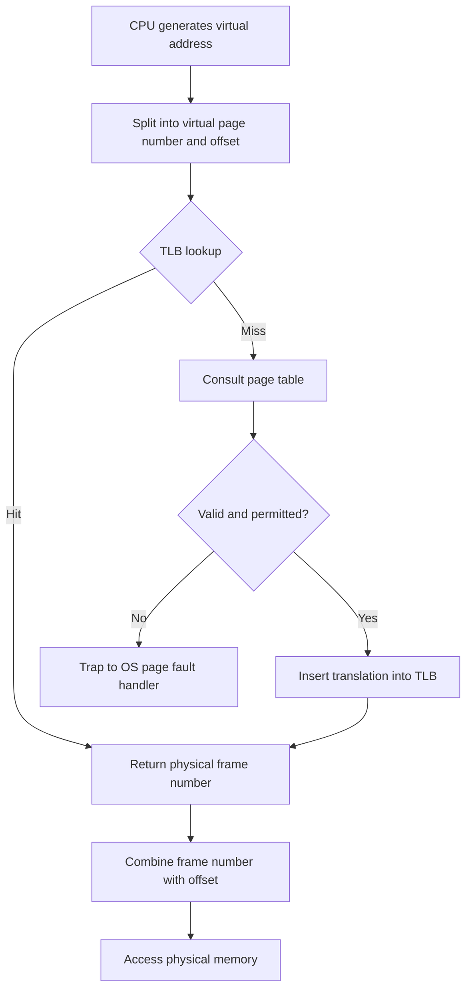
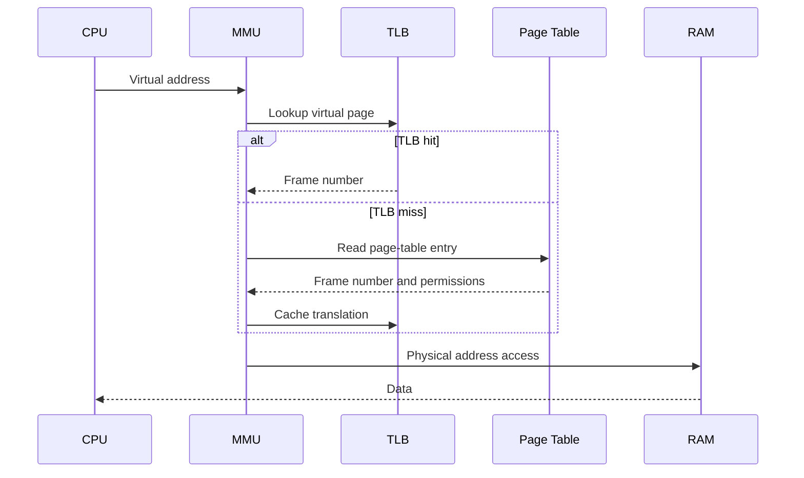

# Day 22 - Translation Lookaside Buffer

Difficulty: Intermediate  
Fresh Learning: 40 minutes  
Revision: 5 minutes  
Prerequisites: Day 21 - paging basics, page number, offset, page table, page-table entry  
Why this topic matters in interviews: TLB hit/miss behavior and effective access time are classic memory-management questions because they test whether you understand that address translation itself has a cost.

## Opening Intuition

Imagine every time you wanted to enter your apartment, you first had to walk to the building office, ask the manager which floor your apartment is on, return to the elevator, and then finally go to your room. The building may be well organized, but the lookup process would be painfully slow if you had to repeat it for every single door.

Paging has a similar hidden cost. A CPU does not directly use physical addresses for normal user programs. It generates a virtual address. That virtual address must be translated through a page table before the actual RAM location is known. In the simplest paging model, every memory access needs one page-table access plus one real data access. That means loading one variable could require two memory reads: first read the page-table entry, then read the actual value.

That is too expensive for real systems. Programs perform billions of memory references. If every reference doubled the memory traffic, paging would be correct but painfully slow.

The Translation Lookaside Buffer, or TLB, exists to solve this problem. It is a small, very fast hardware cache inside or near the Memory Management Unit. It remembers recent virtual-page to physical-frame translations. If the translation is found in the TLB, the CPU can avoid walking or reading the page table for that access.

You do not usually see the TLB directly in daily computer usage, but you feel its effects. Programs with good locality run faster because they repeatedly access the same pages. Context switches can disturb TLB contents, which is one reason switching between many processes has overhead. Large memory workloads, virtual machines, databases, browsers, and operating-system kernels all care deeply about TLB efficiency.

## Interview Definition

A Translation Lookaside Buffer is a small, fast associative cache used by the MMU to store recent virtual page number to physical frame number translations. On a TLB hit, address translation is performed quickly without reading the page table from memory. On a TLB miss, the system must find the translation in the page table, possibly handle a page fault, and then update the TLB.

## Key Definitions

- Translation Lookaside Buffer: a small hardware cache of recent virtual page to physical frame translations.
- TLB hit: the requested translation is found in the TLB, so the page table does not need to be consulted for that access.
- TLB miss: the requested translation is not in the TLB, so the system must consult the page table or handle a fault.
- Effective access time: the average memory-access cost after accounting for TLB hit rate, miss rate, and memory access time.
- Address-space identifier: a hardware tag that helps distinguish TLB entries belonging to different address spaces.
- TLB flush: invalidating TLB entries, often during mapping changes or context switches.
- TLB shootdown: cross-core invalidation of stale TLB entries after the OS changes a mapping.

## Mental Model

Think of the page table as the full address directory for a large city and the TLB as the few addresses you recently saved in your phone. The full directory is complete but slower to search. Your saved list is tiny but very fast.

The TLB does not replace the page table. It accelerates access to it. The page table remains the authoritative structure maintained by the operating system. The TLB is a hardware cache of selected page-table entries.

The mental model is:

1. The CPU creates a virtual address.
2. The MMU splits it into virtual page number and offset.
3. The TLB is checked first for that virtual page number.
4. If found, the frame number is returned immediately.
5. If not found, the page table is consulted and the TLB is updated.
6. The offset is combined with the frame number to form the physical address.

The key interview sentence is: TLB improves paging performance by caching recent address translations.

## Layer 1: What happens at a high level?

At a high level, every memory access in a paged system needs address translation. The CPU instruction may look simple:

```c
x = array[i];
```

But the hardware must answer a deeper question: where is the virtual address of `array[i]` stored in physical RAM?

Without a TLB, the flow is:

1. CPU generates virtual address.
2. MMU extracts virtual page number and offset.
3. MMU reads the page-table entry from memory.
4. Page-table entry gives the physical frame number.
5. MMU combines frame number and offset.
6. CPU reads or writes the actual physical memory location.

That means address translation itself costs memory access time. The TLB reduces this cost by remembering recent translations.

With a TLB hit:

1. CPU generates virtual address.
2. MMU checks TLB.
3. TLB returns frame number quickly.
4. Physical address is formed.
5. Data access proceeds.

With a TLB miss:

1. CPU generates virtual address.
2. MMU checks TLB and does not find translation.
3. Page table is consulted.
4. If the entry is valid, the translation is inserted into the TLB.
5. The original memory access is retried or continued.
6. If the entry is invalid, a page fault may occur.

The TLB is useful because programs show locality. If a program reads one byte from a page, it is likely to read nearby bytes from the same page soon. The same virtual page translation can be reused many times.

## Layer 2: What happens inside the OS?

The OS manages the page tables, but the TLB is usually hardware-managed or hardware-assisted. The exact design depends on the processor architecture.

The OS is responsible for:

- Creating page tables for each process.
- Updating page-table entries when memory mappings change.
- Marking entries valid, invalid, writable, read-only, executable, user-accessible, or kernel-only.
- Handling page faults when a translation is not currently valid.
- Managing context switches so one process does not accidentally use another process's translations.
- Invalidating stale TLB entries when mappings change.

The important point is that the TLB contains cached copies of translation information. If the OS changes a page-table entry but the old translation remains in the TLB, the CPU might keep using stale permissions or stale frame mappings. That would break correctness and protection.

So operating systems need TLB invalidation mechanisms. On many systems, when the kernel changes a mapping, it must flush or invalidate the affected TLB entry. On multiprocessor systems, this becomes harder because other CPU cores may also have cached that translation. The OS may need to send inter-processor interrupts so other cores invalidate their TLB entries too. This is sometimes called a TLB shootdown.

For interviews, you do not usually need low-level architecture-specific details, but you should know the core contract: page tables are authoritative, TLB entries are cached translations, and stale cached translations must be invalidated when mappings change.

## Layer 3: What happens at hardware or kernel level?

At hardware level, the TLB is typically associative. This means it does not work like a simple array where the virtual page number directly indexes one location. Instead, the hardware compares the requested virtual page number against multiple stored entries in parallel or near-parallel.

A TLB entry commonly stores information like:

- Virtual page number.
- Physical frame number.
- Valid bit.
- Permission bits such as read, write, execute, user/supervisor.
- Dirty or accessed information on some architectures.
- Address space identifier, process context identifier, or similar tag on systems that support it.

The offset is not stored as part of the translation. The offset is copied from the virtual address to the physical address because page and frame sizes match.

The page table itself may be multi-level. On a TLB miss, the hardware or kernel may have to walk several levels of page tables. That is why TLB misses can be much more expensive than the simple textbook model suggests.

Some processors perform hardware page-table walks. The MMU walks the page-table structure automatically after a TLB miss. Other designs use software-managed TLBs, where a TLB miss traps into the kernel and the OS fills the TLB. Either way, the programmer sees the same abstraction: virtual addresses are translated into physical addresses.

Context switching matters here. If process A's TLB entries remain active when process B starts running, process B could accidentally use process A's translations. Systems handle this by flushing the TLB on context switch, tagging TLB entries with address space identifiers, or using a mixture of both. Flushing is simple but expensive. Tagging is faster because translations from multiple address spaces can coexist safely.

## Layer 4: What can go wrong?

A TLB is a performance feature, but wrong handling can create correctness and security problems.

First, stale translations are dangerous. If the OS changes a mapping from writable to read-only but the old writable TLB entry remains, protection can be bypassed until the stale entry disappears. That is why invalidation matters.

Second, TLB misses can become a major bottleneck. A program that jumps randomly across a huge memory region may touch more pages than the TLB can hold. Even if the data is in RAM, translation overhead can hurt performance.

Third, context switches can reduce TLB effectiveness. When the scheduler moves between unrelated processes, useful translations may be flushed or displaced. This is one reason excessive process switching can harm performance beyond just saving and restoring registers.

Fourth, virtualization can add translation layers. A guest OS may translate guest virtual addresses to guest physical addresses, while the hypervisor maps guest physical addresses to host physical addresses. Modern CPUs have hardware support such as nested paging or extended page tables to reduce this cost, but TLB behavior remains important.

Finally, a TLB miss is not the same as a page fault. A TLB miss means the translation was not found in the fast cache. A page fault means the page-table entry indicates the access cannot currently be completed normally, perhaps because the page is not resident, the access violates permissions, or the mapping is invalid.

## Step-by-Step Flow

For a memory read with a TLB hit:

1. A user instruction references a virtual address.
2. The CPU sends the virtual address to the MMU.
3. The MMU splits the address into virtual page number and offset.
4. The TLB is searched for the virtual page number and current address-space tag.
5. The TLB entry is found.
6. Permission bits are checked.
7. The physical frame number is combined with the offset.
8. The CPU accesses the final physical memory location.

For a memory read with a TLB miss:

1. A user instruction references a virtual address.
2. The MMU checks the TLB.
3. No matching translation is found.
4. The page table is consulted by hardware or by a kernel trap handler.
5. If the page-table entry is valid and permissions allow the access, the translation is loaded into the TLB.
6. The physical address is formed using frame number plus offset.
7. The memory access completes.
8. If the page-table entry is invalid or permissions fail, the OS handles a page fault or protection fault.



This diagram separates a TLB miss from a page fault. A miss can still complete normally if the page table contains a valid translation.



This sequence shows the TLB as the first lookup point, not the final authority. The page table is still needed when the fast cache cannot answer.

## Practical System Relevance

In Linux, virtual memory areas describe ranges of process virtual memory, while page tables map pages to frames. The processor uses TLB entries to speed up repeated translations. When the kernel changes mappings, switches address spaces, or unmaps memory, it may need to invalidate TLB entries. On multi-core systems, this can involve coordination across cores.

In Windows, the memory manager also relies on hardware address translation and TLBs. Working sets, mapped files, copy-on-write pages, and page faults all interact with page-table state. The TLB is not normally visible in Task Manager, but memory-heavy workloads are affected by translation locality.

In Android, each app process has its own virtual address space. Fast address translation matters for app responsiveness, graphics pipelines, runtime execution, and shared libraries. Mobile systems also care about power: extra memory walks consume time and energy.

In browsers, renderer processes, JavaScript engines, WebAssembly memory, GPU processes, and sandboxing all rely on virtual memory. Large heaps and scattered memory access patterns can stress caches and TLBs.

In databases, TLB behavior can matter for buffer pools and memory-mapped files. A database touching a very large working set may suffer from TLB pressure even if the data is technically in RAM. Huge pages are sometimes used in server workloads to reduce the number of page translations needed for large memory regions.

In cloud systems and virtualization, address translation can be layered. Hardware support reduces overhead, but the TLB remains central because frequent translation misses can hurt VM performance.

In containers, the host kernel still manages page tables and TLB behavior. Containers isolate process views using namespaces and cgroups, but they do not create a separate kernel with separate hardware translation logic.

## Code or Pseudocode Section

You cannot usually inspect the TLB directly from a normal user program, but you can reason about locality.

```c
// Good spatial locality: accesses many values on the same pages.
long sum_sequential(int *a, int n) {
    long sum = 0;
    for (int i = 0; i < n; i++) {
        sum += a[i];
    }
    return sum;
}

// Poorer locality: jumps by one page-sized stride for 4-byte ints.
long sum_strided(int *a, int n) {
    long sum = 0;
    int stride = 4096 / sizeof(int);
    for (int i = 0; i < n; i += stride) {
        sum += a[i];
    }
    return sum;
}
```

The sequential loop reuses each translation for many nearby integers because one 4 KB page contains many `int` values. The strided loop may touch a new page on almost every iteration, which can increase TLB misses.

Useful observation commands:

```bash
time ./memory_walk
perf stat -e dTLB-loads,dTLB-load-misses ./memory_walk
pmap <pid>
cat /proc/<pid>/maps
```

`perf` can expose TLB-related counters on Linux systems where permissions allow it. `pmap` and `/proc/<pid>/maps` show virtual memory regions, not the TLB itself, but they help connect virtual layout to the translations the hardware must perform.

## Common Misconceptions

1. TLB and page table are the same.  
   They are not. The page table is the authoritative mapping structure. The TLB is a small hardware cache of recent translations.

2. A TLB miss always means the page is not in memory.  
   No. The page may be resident and valid; the translation simply was not in the TLB.

3. A page fault and a TLB miss are identical.  
   No. A TLB miss can be resolved by reading a valid page-table entry. A page fault requires OS fault handling.

4. TLB stores full physical addresses for every byte.  
   No. It typically stores page-level translations: virtual page number to physical frame number, plus metadata.

5. Offset changes during TLB translation.  
   No. The frame number changes, but the offset is carried unchanged.

6. Larger TLB is always better with no tradeoff.  
   A larger TLB can improve hit rate, but it may consume more area, power, and lookup complexity.

7. Context switching cost is only register saving.  
   No. It can also disturb caches, branch predictors, and TLB entries.

## Tricky Interview Corners

TLB hit ratio is often the center of numerical questions. If memory access time is 100 ns and TLB lookup is 10 ns, then a hit may cost about 110 ns. A miss may cost TLB lookup plus page-table memory access plus actual data access. A simplified effective access time formula is:

```txt
EAT = hit_ratio * hit_cost + miss_ratio * miss_cost
```

In a simple one-level page-table model:

```txt
hit_cost = TLB lookup + memory access
miss_cost = TLB lookup + page-table memory access + memory access
```

If TLB lookup is assumed negligible, some textbooks use:

```txt
EAT = h * m + (1 - h) * 2m
```

where `h` is hit ratio and `m` is memory access time. Always state your assumptions before calculating.

Another tricky area is multi-level page tables. A TLB miss may require several memory accesses to walk page-table levels before the final data access. That makes TLB misses more expensive in real systems than the simplest two-access textbook example.

Context switches are also tricky. A full TLB flush avoids one process using another process's translations, but it damages performance because the new process starts with a cold TLB. Address space identifiers reduce this by tagging entries with the process or address-space context.

Huge pages are a useful advanced detail. A larger page covers more memory with one TLB entry. That can reduce TLB misses for large sequential memory workloads, but it can increase memory waste or complicate allocation.

## Comparison Tables

| Concept | Meaning | Interview trap |
|---|---|---|
| Page table | Full mapping structure maintained by OS | Not a cache |
| TLB | Fast hardware cache of translations | Not authoritative |
| TLB hit | Translation found in TLB | Still must check permissions |
| TLB miss | Translation absent from TLB | Not automatically a page fault |
| Page fault | Mapping cannot complete normally | May be normal in demand paging |

| Event | Typical cause | Result |
|---|---|---|
| TLB hit | Recent page reused | Fast translation |
| TLB miss | Translation not cached | Page-table lookup or walk |
| Protection fault | Access violates permission | OS trap, often process signal/exception |
| Demand page fault | Page valid logically but not resident | OS loads or maps page |
| Invalid access fault | Address not legal for process | Program may be terminated |

## How to Explain This in an Interview

### 30-second answer

A TLB is a small hardware cache used by the MMU to speed up virtual-to-physical address translation. It stores recent mappings from virtual page numbers to physical frame numbers. On a TLB hit, the CPU avoids reading the page table. On a miss, the page table is consulted and the translation may be inserted into the TLB.

### 2-minute answer

In paging, every virtual address must be translated before memory can be accessed. Without a TLB, each memory reference may require first reading the page table and then accessing the actual data, which can nearly double memory access cost in the simple model. The TLB reduces this overhead by caching recently used page-table entries. Because programs usually show temporal and spatial locality, the same page translations are reused many times. A hit is fast; a miss requires a page-table lookup or page-table walk. If the page-table entry is invalid or permissions fail, the OS handles a page fault or protection fault.

### Deeper follow-up answer

The TLB also interacts with context switches, permission changes, multi-core systems, and virtualization. When the OS changes a mapping, stale TLB entries must be invalidated. During context switches, the OS may flush the TLB or rely on address-space tags so translations from different processes do not conflict. On multi-level page tables, a TLB miss can cost several memory accesses. In virtualized systems, nested translations make TLB efficiency even more important.

## Interview Questions

### Basic Questions

1. What is a Translation Lookaside Buffer?
2. Why is a TLB needed in a paged memory system?
3. What is the difference between a TLB and a page table?
4. What happens on a TLB hit?
5. What happens on a TLB miss?

### Intermediate Questions

6. Why is a TLB miss not always a page fault?
7. How does TLB hit ratio affect effective access time?
8. Why can context switching affect TLB performance?
9. What does associative lookup mean in the context of TLBs?
10. What information is commonly stored in a TLB entry?

### Advanced Questions

11. Why can multi-level page tables make TLB misses expensive?
12. What is a TLB shootdown, and why might it be needed on multi-core systems?
13. How can address-space identifiers reduce context-switch overhead?
14. Why can huge pages improve TLB performance?
15. How does virtualization make address translation more expensive?

## Follow-Up Questions

Q: What is a TLB?  
Follow-ups:
- Why can paging be slow without it?
- Is it managed by hardware, the OS, or both?
- What happens if a cached translation becomes stale?

Q: What is a TLB hit?  
Follow-ups:
- Does the CPU still need the offset?
- Are permissions still checked?
- Does a hit guarantee the memory access is legal?

Q: What is a TLB miss?  
Follow-ups:
- Does it always mean the page is on disk?
- How does the page table help resolve it?
- What if the page-table entry is invalid?

Q: How do you calculate effective access time?  
Follow-ups:
- What assumptions are you making about TLB lookup time?
- How does the formula change with multi-level page tables?
- Why does a small miss rate still matter?

Q: Why does context switching affect the TLB?  
Follow-ups:
- What could go wrong if old translations remain?
- What is a TLB flush?
- How do address-space identifiers help?

Q: Why do huge pages help?  
Follow-ups:
- What tradeoff can larger pages introduce?
- Why do databases sometimes use them?
- Does a huge page remove the need for a TLB?

## Trick Questions

1. Q: If there is a TLB miss, is the page definitely absent from RAM?  
Expected answer: No. The translation may simply be absent from the TLB while the page-table entry is valid.

2. Q: If the TLB has a translation, can the page table be ignored forever?  
Expected answer: No. Page tables are authoritative, and stale TLB entries must be invalidated when mappings change.

3. Q: Does a TLB store the offset?  
Expected answer: Usually no. It stores page-level translation information. The offset comes from the original virtual address.

4. Q: Is a TLB miss always handled by the operating system?  
Expected answer: Not always. Some architectures handle page-table walks in hardware; others trap to software.

5. Q: Does a higher TLB hit ratio always mean the program is faster overall?  
Expected answer: It helps translation cost, but total speed also depends on data cache behavior, CPU work, I/O, locks, and other bottlenecks.

6. Q: If two processes use the same virtual page number, must they share the same TLB entry?  
Expected answer: No. Entries must be separated by address space, usually by flushing or tagging.

7. Q: Can a TLB hit still lead to a protection fault?  
Expected answer: Yes, if the cached entry indicates that the attempted access violates permissions.

## Practical Debugging / Observation

Most systems do not expose the TLB as a normal file or command output. You observe it indirectly through performance counters and memory-access behavior.

On Linux:

```bash
perf stat -e dTLB-loads,dTLB-load-misses ./program
perf stat -e iTLB-loads,iTLB-load-misses ./program
pmap <pid>
cat /proc/<pid>/maps
time ./sequential_walk
time ./strided_walk
```

What to observe:

- Sequential memory access tends to reuse pages and translations.
- Page-sized or random strides can increase TLB pressure.
- `pmap` and `/proc/<pid>/maps` reveal virtual regions that require translation.
- `perf` counters, when available, can show whether TLB misses are actually occurring.

On Windows, tools such as Performance Monitor, Windows Performance Recorder, and CPU vendor profilers can expose low-level memory and TLB-related events depending on hardware support.

For interviews, the key debugging mindset is: if a memory-heavy program is slow even when data is in RAM, translation overhead, cache misses, and poor locality may all be suspects.

## Mini Quiz

### MCQs

1. The TLB primarily caches:
   A. File names  
   B. Virtual-page to physical-frame translations  
   C. Entire process images  
   D. Disk blocks  

2. A TLB miss means:
   A. The page must be absent from RAM  
   B. The program must crash  
   C. The translation was not found in the TLB  
   D. Physical memory is full  

3. In address translation, the offset:
   A. Is replaced by the frame number  
   B. Usually remains unchanged  
   C. Is stored only in the page table  
   D. Is always zero  

4. A context switch can hurt TLB performance because:
   A. The keyboard buffer is cleared  
   B. Useful translations may be flushed or displaced  
   C. The CPU loses all physical memory  
   D. Page size changes every time  

5. Effective access time depends heavily on:
   A. TLB hit ratio  
   B. File extension  
   C. Shell prompt color  
   D. Monitor refresh rate  

### Short-answer questions

1. Why is the TLB needed if the page table already exists?
2. Why is a TLB miss different from a page fault?
3. What problem do address-space identifiers solve?

### Reasoning questions

1. A program scans a 1 GB array sequentially. Another program jumps to one integer per page in random order. Which one is more likely to benefit from TLB locality, and why?
2. Why might a database choose huge pages for a large buffer pool?

### Answers

1. B
2. C
3. B
4. B
5. A

Short answers:

1. The page table is complete but memory-resident and slower to consult for every access; the TLB caches recent translations to avoid repeated page-table lookups.
2. A TLB miss means the fast cache lacks the translation. A page fault means the page-table entry cannot complete the access normally.
3. Address-space identifiers let TLB entries from different processes coexist safely without confusing identical virtual page numbers from different address spaces.

Reasoning:

1. The sequential scan is more likely to benefit because many adjacent elements live on the same pages, so each translation is reused. Random page jumps can exceed TLB capacity and cause frequent misses.
2. Huge pages let one TLB entry cover a larger memory region, reducing translation misses for large, mostly resident memory areas.

# 5-Minute Revision Column

Revision targets: Day 21 - Paging Basics (R1), Day 19 - Memory Management Basics (R2)

## Day 21 - Paging Basics - R1 Recall Revision

Paging divides a process's logical address space into fixed-size pages and physical memory into equal-size frames. The OS keeps a page table that maps page numbers to frame numbers. This removes the need for a process to occupy one continuous physical block of RAM, which solves the external-fragmentation problem from contiguous allocation.

Key definitions:

- Page: fixed-size block of a process's logical address space.
- Frame: fixed-size block of physical memory.
- Page table: per-process mapping from virtual pages to physical frames.

Core example: with a 4 KB page size, the lower 12 bits of an address are the offset. The page table changes the page number into a frame number, but the offset remains unchanged.

Pitfalls:

- Page and frame are not the same thing. A page is virtual; a frame is physical.
- Paging removes external fragmentation for process placement, but internal fragmentation can still exist inside the last page.

Quick interview questions:

1. If two virtual pages are consecutive, must their frames be consecutive?
2. Why does the offset stay unchanged during translation?

Mental model: the process owns a numbered notebook; RAM provides equal-sized lockers; the page table tells which locker holds each notebook page.

## Day 19 - Memory Management Basics - R2 Compression Revision

Memory management gives each process the illusion of a private address space while the OS and MMU map those logical addresses to real physical memory. It is not only allocation; it includes translation, relocation, protection, sharing, and reclaiming memory.

Five-bullet recall:

- Logical addresses are generated by the program.
- Physical addresses refer to actual RAM.
- The MMU performs hardware-supported translation.
- Protection prevents one process from freely touching another process's memory.
- The OS controls page tables, permissions, and fault handling.

Key definitions:

- Logical address: address as seen by the process.
- Physical address: actual RAM location after translation.
- MMU: hardware unit that translates and checks memory accesses.

Pitfalls:

- Same virtual address in two processes does not necessarily mean same physical memory.
- A segmentation fault usually means invalid or forbidden access, not simply low RAM.

Quick interview questions:

1. Why should user programs not directly modify address-translation structures?
2. How does memory protection support process isolation?

Mental model: the process sees an apartment map; the OS knows the real building layout and blocks illegal doors.

## Final Takeaway

The TLB is the performance bridge that makes paging practical. Paging gives safety, relocation, sharing, and flexible memory placement, but every memory access needs translation. The TLB caches recent translations so most accesses avoid a page-table lookup. A TLB hit is fast, a TLB miss is slower, and a page fault is a different event entirely. Context switches, huge pages, multi-level page tables, and virtualization all matter because they change translation cost. In interviews, explain the TLB as a hardware cache for page-table entries, then connect it to hit ratio and effective access time.

## What You Should Be Able To Answer Now

- Define a TLB in interview-friendly language.
- Explain why paging needs translation caching.
- Distinguish TLB hit, TLB miss, and page fault.
- Calculate simple effective access time from hit ratio assumptions.
- Explain why context switches can disturb TLB contents.
- Describe why stale TLB entries must be invalidated.
- Connect TLB locality to real program memory-access patterns.
- Explain why huge pages can reduce TLB pressure.
