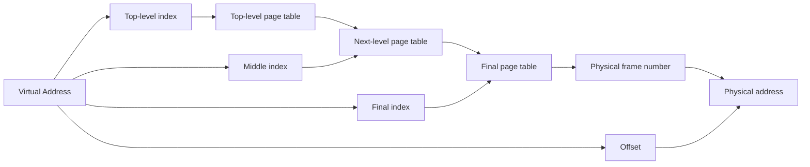
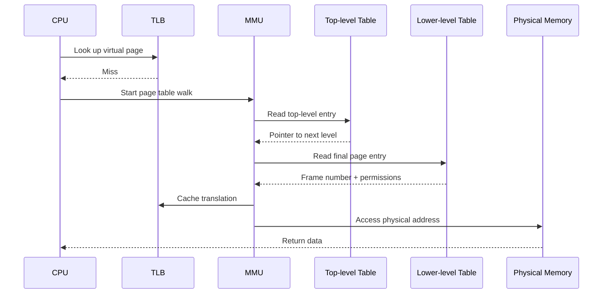
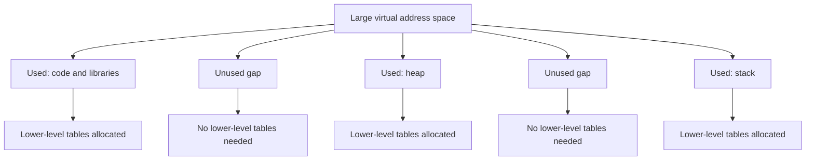

# Day 23 - Multi-Level Page Tables

Difficulty: Advanced  
Fresh Learning: 40 minutes  
Revision: 5 minutes  
Prerequisites: Paging basics, page table entries, TLB hits and misses, logical vs physical address translation  
Why this topic matters in interviews: Multi-level page tables explain why simple paging is not enough for large address spaces. Interviewers use this topic to test whether you understand both the elegance of paging and the memory overhead it creates.

## Opening Intuition

Imagine a huge university library. If every possible book slot in the library had a full paper record, even for shelves that are empty, the catalog itself would become enormous. Most students use only a small part of the library, but the catalog would still reserve space for every possible shelf, every possible aisle, and every possible floor.

A single-level page table has a similar problem. It is conceptually simple: take a virtual page number, use it as an index into a page table, and find the physical frame. But modern virtual address spaces are huge. A 32-bit or 64-bit process may have a very large possible virtual range while actually using only a small portion of it. If the operating system allocated one flat page table entry for every possible virtual page, the page table itself could waste a large amount of memory.

Multi-level page tables solve this by making the page table hierarchical and sparse. Instead of building the entire catalog upfront, the OS builds only the directory levels needed for the virtual regions a process actually uses. If a process never touches a large virtual range, the lower-level page tables for that range do not need to exist.

You see the effect of this idea whenever a modern system runs many processes, maps shared libraries, reserves large address regions, uses memory-mapped files, or supports 64-bit virtual memory. Each process can have a large virtual address space without requiring the OS to store a fully populated flat table for every possible page.

## Interview Definition

A multi-level page table is a hierarchical page table structure that breaks the virtual page number into multiple indexes. Each index selects an entry at one level of the hierarchy until the final level gives the physical frame number. This reduces memory overhead because lower-level page tables are allocated only for virtual address ranges that are actually used.

In an interview, say: multi-level paging keeps the benefits of paging while avoiding a huge contiguous single-level page table. It trades some translation complexity for much better scalability in large and sparse address spaces.

## Key Definitions

- Multi-level page table: a hierarchical page table where the virtual page number is split into indexes for multiple levels.
- Page table root: the top-level page table address used by the MMU to begin a page table walk.
- Page table walk: the hardware or software process of reading page table levels to find a translation after a TLB miss.
- Page directory entry: a higher-level entry that usually points to another page table page or marks a virtual range invalid.
- Page table entry: the final mapping entry that stores the physical frame number and access/protection bits.
- Sparse address space: a virtual address space where large ranges are unused or unmapped.
- Inverted page table: a page table design organized around physical frames rather than a per-process virtual page array.
- Hashed page table: a design that uses a hash of the virtual page information to find mappings in very large address spaces.

## Mental Model

Think of a multi-level page table as a nested address directory.

A flat page table is like one massive book where every possible apartment number in a country has a row, even if most addresses do not exist. A multi-level page table is like:

- first choose the state,
- then the city,
- then the street,
- then the house number.

If a city has no houses for this process, you do not need a street directory for it. If a region of virtual memory is unused, the OS does not allocate the lower-level page table pages for that region.

The key mental model is: paging converts one big lookup problem into a hierarchy of smaller lookup tables. The hierarchy is not mainly for faster lookup. The TLB handles speed. The hierarchy is mainly to make page table storage practical.

## Layer 1: What happens at a high level?

At a high level, multi-level paging still performs the same job as ordinary paging: it translates a virtual address into a physical address.

In basic paging, a virtual address is split into:

- virtual page number,
- offset within that page.

The page number indexes the page table, and the page table entry gives the physical frame number. The offset is copied unchanged into the physical address.

Multi-level paging changes how the virtual page number is interpreted. Instead of treating it as one large index into one huge table, the CPU or MMU splits it into several smaller indexes:

- top-level page directory index,
- next-level page table index,
- possibly more middle levels,
- final-level page table index,
- page offset.

Each level points to the next level. The final page table entry gives the physical frame number and permission bits.

This means address translation becomes a walk through a tree-like structure. The virtual address tells the hardware which branch to follow at each level. If an entry is missing or invalid, the translation fails and usually produces a page fault so the OS can decide what to do.

## Layer 2: What happens inside the OS?

The operating system maintains page table structures for each process address space. It creates top-level page table pages when the process is created, then allocates lower-level page table pages only when needed.

For example, when a process starts, it may need mappings for:

- program text,
- read-only data,
- writable data,
- heap,
- stack,
- shared libraries,
- memory-mapped files,
- kernel-visible regions depending on OS design.

The OS does not need to allocate page table entries for every unused gap between these regions. It can leave parts of the hierarchy absent. If the process later grows its heap, maps a file, or touches a new stack page, the OS can allocate the required lower-level page table page and fill in the final mapping.

The OS also uses each page table entry to store metadata beyond the frame number:

- present or valid bit,
- read/write permission,
- user/kernel permission,
- execute permission where supported,
- accessed/reference bit,
- dirty bit,
- copy-on-write status or related software flags,
- physical frame number.

When the scheduler switches from one process to another, the CPU must use the new process's page table root. On many architectures, a special register holds the physical address of the top-level page table. The OS updates that register during an address-space switch. The TLB may then need flushing or address-space tagging so stale translations from the old process do not get used incorrectly.

## Layer 3: What happens at hardware or kernel level?

At the hardware level, the MMU performs a page table walk when a translation is not already in the TLB. The exact details depend on the architecture, but the idea is consistent.

Suppose a simplified 32-bit system uses:

- 4 KB pages,
- 10 bits for page directory index,
- 10 bits for page table index,
- 12 bits for page offset.

The virtual address is split like this:

```txt
31                  22 21                  12 11          0
+---------------------+----------------------+-------------+
| Page directory idx  | Page table idx       | Offset      |
+---------------------+----------------------+-------------+
        10 bits              10 bits             12 bits
```

The translation flow is:

1. The CPU generates a virtual address.
2. The MMU checks the TLB for the virtual page translation.
3. On a TLB hit, the frame number is available immediately.
4. On a TLB miss, the MMU reads the page table root register.
5. It uses the first index to find a page directory entry.
6. That entry points to a lower-level page table page.
7. It uses the second index to find the final page table entry.
8. That entry gives the frame number and access permissions.
9. The offset from the original address is appended unchanged.
10. The resulting physical address is used for the memory access.
11. The translation may be inserted into the TLB.

On 64-bit systems, there may be more levels because the virtual address has more bits. Common x86-64 paging uses multiple levels such as PML4, page-directory-pointer table, page directory, and page table, with newer modes supporting even more address bits. The lesson for interviews is not to memorize every architecture name first. The important idea is that large virtual addresses require hierarchical page table structures because a flat table would be too large.

## Layer 4: What can go wrong?

Multi-level page tables solve the flat-table memory explosion, but they introduce tradeoffs.

First, a page table walk can require multiple memory accesses. If a translation misses in the TLB, the hardware may have to read entries from several levels before it even reaches the actual data. This is why the TLB is essential. Without a TLB, multi-level paging would make every memory access much more expensive.

Second, page table memory is reduced but not free. Each allocated page table page consumes memory. A process with a large scattered address space can still require many page table pages.

Third, page table updates are sensitive. If the OS changes a mapping, it must make sure stale TLB entries are invalidated. On multi-core systems, this may require TLB shootdowns across cores.

Fourth, sparse virtual memory can be useful but confusing. A process may reserve a huge virtual range without consuming physical memory or page table memory for every page immediately. This is common in memory allocators, language runtimes, and memory-mapped regions. Interviewers may test whether you confuse virtual address space size with physical RAM usage.

Fifth, page table structures are architecture-specific. The concept is portable, but the number of levels, entry format, huge page support, and hardware page-walk behavior vary.

## Step-by-Step Flow

Here is a practical flow for a memory access with a multi-level page table:

1. A running instruction tries to load from a virtual address.
2. The CPU separates the virtual address into page-table indexes and an offset.
3. The MMU checks the TLB for the virtual page number and address-space tag.
4. If the TLB hits, the MMU combines the cached frame number with the offset.
5. If the TLB misses, the MMU starts from the current process's page table root.
6. The first virtual-address index selects an entry in the top-level table.
7. If that entry is invalid, the CPU raises a page fault.
8. If valid, the entry points to the next-level table.
9. The next index selects an entry in the next table.
10. The walk continues until the final-level page table entry is reached.
11. The final entry is checked for present bit and permissions.
12. If the access is illegal or absent, a page fault occurs.
13. If valid, the frame number is combined with the original offset.
14. The translation is inserted into the TLB for future accesses.
15. The memory access proceeds using the physical address.

## Diagram Section

### Diagram 1: Address bits become a hierarchy



This diagram shows the main idea: the virtual page number is divided into several pieces, and each piece chooses an entry at one level of the page table hierarchy. The offset does not get translated; it is carried into the final physical address.

### Diagram 2: TLB miss causes a page table walk



This diagram connects Day 22 with today. A TLB miss does not automatically mean the page is absent from RAM. It often means the MMU must walk the multi-level page table to find the valid translation.

### Diagram 3: Why sparse allocation helps



The hierarchy lets the OS avoid building page table pages for unused virtual ranges. This is the core storage win.

## Practical System Relevance

In Linux, each process has a memory descriptor that represents its virtual address space. The system uses virtual memory areas for ranges such as code, heap, stack, shared libraries, and memory-mapped files. Page tables then provide the actual page-level mappings. Linux on common 64-bit hardware uses hierarchical page tables, and the kernel allocates lower-level page table pages as mappings are created. When mappings change, the kernel must keep the TLB consistent.

In Windows, the memory manager also relies on hierarchical paging, working sets, page faults, mapped files, and protection bits. A program may reserve a large virtual region while committing only part of it. This is possible because virtual address space and physical memory are separate ideas, and page table structures can represent sparse mappings.

In Android, every app runs in its own Linux process with an isolated virtual address space. Hierarchical page tables help support isolation, shared libraries, just-in-time runtimes, graphics buffers, and app sandboxes without requiring each app to allocate enormous flat page tables.

In browsers, renderer processes often reserve large heaps, isolate tabs or sites, use shared memory, and map executable code pages. Multi-level page tables make large sparse mappings practical, while the TLB keeps repeated translations fast.

In databases and servers, memory-mapped files and large buffer pools can create page-table and TLB pressure. Large pages or huge pages are sometimes used to reduce the number of page table entries and improve TLB coverage. This is not always free, because huge pages can affect memory flexibility and fragmentation.

In cloud systems and virtualization, address translation can be layered. A guest virtual address may translate to a guest physical address, which then translates to a host physical address. Hardware support such as nested paging reduces the overhead, but page-table walks and TLB behavior still matter.

In containers, the host kernel still owns the page tables. Containers do not create separate kernels, but their processes still use normal virtual memory isolation, page tables, permissions, and TLB caching.

## Code or Pseudocode Section

The following pseudocode shows the idea of a two-level page table walk. Real hardware is more complex, but the logic is useful for interviews.

```c
#define PAGE_SIZE 4096
#define OFFSET_BITS 12
#define INDEX_MASK 0x3ff

physical_address translate(uint32_t virtual_address) {
    uint32_t offset = virtual_address & 0xfff;
    uint32_t page_table_index = (virtual_address >> 12) & INDEX_MASK;
    uint32_t page_directory_index = (virtual_address >> 22) & INDEX_MASK;

    pde_t pde = page_directory[page_directory_index];
    if (!pde.present) {
        raise_page_fault(virtual_address);
    }

    pte_t *page_table = physical_to_kernel_pointer(pde.frame);
    pte_t pte = page_table[page_table_index];
    if (!pte.present || !access_allowed(pte)) {
        raise_page_fault(virtual_address);
    }

    return (pte.frame << OFFSET_BITS) | offset;
}
```

What this demonstrates:

- The offset is not looked up in a table.
- The first index selects a directory entry.
- The directory entry points to another table.
- The final page table entry gives the physical frame.
- Invalid entries lead to page faults.

Useful observation commands:

```bash
cat /proc/self/maps
pmap $$
cat /proc/meminfo
grep -i huge /proc/meminfo
```

On Linux, `/proc/self/maps` shows virtual memory regions of the current process. It does not print the full page table, but it helps you see why sparse virtual address regions exist. `pmap $$` shows the memory map of the current shell process. Huge-page fields in `/proc/meminfo` help connect page size choices to page table and TLB behavior.

## Common Misconceptions

1. "Multi-level page tables are faster than single-level page tables."
   Not directly. A page-table walk through multiple levels can be slower on a TLB miss. The main benefit is lower page-table memory usage for sparse address spaces. TLBs recover most of the speed in common cases.

2. "A 64-bit process uses physical memory for the entire 64-bit address space."
   False. Most of the virtual address space is unused or reserved. Page tables and physical frames are allocated only for actual mappings and committed pages.

3. "The offset changes during translation."
   False. Paging translates the page number to a frame number. The offset within the page remains the same.

4. "A missing lower-level table always means the program is broken."
   Not necessarily. It may simply mean that virtual range is not mapped. If the process touches it, the OS decides whether to grow a stack, demand-load a page, or terminate the process.

5. "The page table contains one entry per byte."
   False. It contains entries per page. With 4 KB pages, one entry covers 4096 bytes.

6. "The TLB replaces page tables."
   False. The TLB caches recent translations. Page tables remain the authoritative mapping structure.

7. "Inverted page tables and multi-level page tables are the same."
   False. Multi-level tables are usually organized by virtual address hierarchy per address space. Inverted page tables are organized around physical frames and typically need hashing or search.

## Tricky Interview Corners

The first tricky corner is the storage tradeoff. A single-level page table is easy to index, but it can require a huge table even when most virtual pages are unused. Multi-level paging saves memory by allocating lower levels lazily.

The second tricky corner is the speed tradeoff. A multi-level walk can cost multiple memory accesses. This is acceptable because most accesses hit in the TLB. If the TLB hit rate is poor, translation overhead becomes visible.

The third tricky corner is page table pages themselves. Page tables are stored in memory too. They are not abstract free metadata. If a process maps many scattered pages, it may need many page table pages.

The fourth tricky corner is huge pages. A huge page maps a larger memory range with one translation entry, reducing TLB pressure and page table depth for that region. But huge pages can waste memory if the program does not use the entire large page and can complicate allocation.

The fifth tricky corner is page faults during the walk. A missing or invalid entry at any level can cause a fault. The OS then checks whether the access is legal, whether it should allocate a page, whether data should be loaded from disk, or whether the process should be killed.

The sixth tricky corner is protection. Final entries and sometimes higher-level entries can contain permissions. A page may be present but still reject writes or execution.

The seventh tricky corner is virtualization. Nested page tables can multiply translation work because the processor may need to translate guest page-table references through host mappings. Hardware caching and TLB support are essential here.

## Comparison Tables

### Single-Level vs Multi-Level Page Tables

| Feature | Single-Level Page Table | Multi-Level Page Table |
|---|---|---|
| Structure | One flat array | Hierarchy of tables |
| Lookup idea | One page number index | Several indexes |
| Memory use | Can be huge for large sparse spaces | Lower levels allocated only when needed |
| TLB miss cost | Usually fewer table accesses | Multiple memory accesses |
| Best point | Simple concept | Scales to large address spaces |
| Main weakness | Wastes page table memory | More complex page walk |

### Multi-Level vs Inverted vs Hashed Page Tables

| Structure | Main idea | Useful when | Interview trap |
|---|---|---|---|
| Multi-level | Tree-like virtual-address hierarchy | Sparse virtual address spaces | Not automatically faster |
| Inverted | One entry per physical frame | Physical memory is much smaller than virtual space | Lookup by virtual address is harder |
| Hashed | Hash virtual page to find mapping | Very large address spaces | Hash collisions must be handled |

### Paging vs Segmentation Preview

| Feature | Paging | Segmentation |
|---|---|---|
| Unit | Fixed-size pages | Logical variable-size segments |
| Programmer view | Less visible | Matches code/data/stack style divisions |
| Fragmentation | No external fragmentation for pages | Can suffer external fragmentation |
| Address translation | Page number + offset | Segment number + offset |

## How to Explain This in an Interview

### 30-second answer

Multi-level page tables are hierarchical page tables used to avoid allocating one huge flat page table for a large virtual address space. The virtual page number is split into multiple indexes, and each index selects a level in the hierarchy. Lower-level tables are allocated only for used virtual regions, so sparse address spaces become practical.

### 2-minute answer

In basic paging, each process needs a page table mapping virtual pages to physical frames. A flat page table is simple but can waste a lot of memory because large address spaces may contain many unused regions. Multi-level paging solves this by treating the virtual page number as several indexes. The first index selects a top-level entry, which points to a lower-level table, and the process continues until the final entry gives the physical frame and permissions.

The main benefit is memory efficiency. If a large virtual range is unused, the OS does not allocate the lower-level tables for it. The tradeoff is that a TLB miss can require several memory accesses during the page-table walk. That is why TLBs are so important: they cache recent translations and avoid repeated walks.

### Deeper follow-up answer

On modern 64-bit systems, virtual address spaces are too large for flat page tables. Multi-level page tables, huge pages, TLBs, and hardware page walkers work together. The OS maintains the mappings, allocates lower-level page table pages lazily, updates permissions, and invalidates stale TLB entries when mappings change. In virtualization, nested paging can add another layer of translation, so hardware support and translation caching become even more important.

## Interview Questions

### Basic Questions

1. What problem do multi-level page tables solve?
2. Why is a single-level page table wasteful for large sparse address spaces?
3. What parts does a virtual address contain in paging?
4. Does the offset change during address translation?
5. What happens if a required page table entry is invalid?

### Intermediate Questions

6. How does a two-level page table translate a virtual address?
7. Why does a TLB matter more when using multi-level page tables?
8. What is the difference between a TLB miss and a page fault?
9. How do multi-level page tables support sparse virtual memory?
10. What kind of metadata is stored in page table entries?

### Advanced Questions

11. Why do 64-bit systems need more sophisticated page table structures?
12. How can huge pages reduce TLB pressure?
13. What is an inverted page table, and how is it different from hierarchical paging?
14. How can virtualization make address translation more expensive?
15. Why can scattered mappings still consume significant page table memory?

## Follow-Up Questions

Q: What problem do multi-level page tables solve?  
Follow-ups:
- Why is the problem worse in 64-bit systems?
- Would a TLB alone solve the memory overhead problem?
- What happens for unused virtual address ranges?

Q: How does a two-level page table work?  
Follow-ups:
- What does the first index select?
- What does the second index select?
- Where does the physical frame number come from?
- What happens to the offset?

Q: Why is a TLB important here?  
Follow-ups:
- How many memory reads might a TLB miss require?
- Is a multi-level walk needed on every access?
- Can a TLB hit still violate permissions?

Q: What is an inverted page table?  
Follow-ups:
- Is it indexed directly by virtual page number?
- Why might hashing be needed?
- What is the tradeoff compared with per-process hierarchical tables?

Q: How do huge pages help?  
Follow-ups:
- How do they affect TLB coverage?
- Can they increase internal waste?
- Why are huge pages common in databases or high-performance servers?

Q: What happens during a page fault in a multi-level page table?  
Follow-ups:
- Can the fault occur before the final level?
- How does the OS decide whether to allocate a page?
- When should the process be terminated?

## Trick Questions

1. Q: If a process has a 64-bit address space, does it have page table entries for every possible page?  
   Expected answer: No. Multi-level page tables allow sparse allocation. Lower-level tables are created only for mapped regions.

2. Q: Is a multi-level page table mainly a CPU speed optimization?  
   Expected answer: No. It mainly reduces page table memory overhead. TLBs are the main speed optimization.

3. Q: If a TLB miss occurs, does that prove the page is not present in RAM?  
   Expected answer: No. The translation may be absent from the TLB but present in the page table.

4. Q: Does the page offset go through the page table hierarchy?  
   Expected answer: No. The offset is carried unchanged and appended to the frame number.

5. Q: Are page tables stored outside memory in some special invisible place?  
   Expected answer: No. Page tables are data structures stored in memory, though hardware uses special registers and page-walk logic to access them.

6. Q: Can a present page still cause a fault?  
   Expected answer: Yes, if the attempted access violates permissions, such as writing to a read-only page or executing a non-executable page.

7. Q: Do containers avoid normal page table translation?  
   Expected answer: No. Containerized processes still rely on the host kernel's virtual memory and page table mechanisms.

## Practical Debugging / Observation

You normally do not inspect raw hardware page tables directly as a beginner, but you can observe virtual memory behavior around them.

```bash
cat /proc/self/maps
```

This shows mapped virtual regions for the current process. Notice that mappings are ranges, not one line per page. Large gaps may exist between regions.

```bash
pmap $$
```

This prints a process memory map for the current shell. It helps connect process memory regions to the idea that a process has many mapped areas, not one simple contiguous chunk.

```bash
grep -E "PageTables|HugePages|Hugepagesize" /proc/meminfo
```

This shows system-level memory spent on page tables and huge-page configuration on Linux. The exact fields vary by system, but they connect the concept to real memory usage.

```bash
perf stat -e dTLB-loads,dTLB-load-misses ./program
```

On systems where `perf` is available and permissions allow it, this can measure TLB-related events. High TLB miss rates can indicate poor translation locality, though performance always depends on the full workload.

## Mini Quiz

### MCQs

1. What is the main benefit of multi-level page tables?  
   A. They remove the need for a TLB  
   B. They reduce page table memory usage for sparse address spaces  
   C. They eliminate page faults  
   D. They make every memory access one cycle  

2. In paging, the offset is:  
   A. translated into a frame number  
   B. stored in the TLB only  
   C. copied unchanged into the physical address  
   D. used only during interrupts  

3. A TLB miss in a multi-level paging system usually means:  
   A. the page is definitely on disk  
   B. the process must terminate  
   C. the page table may need to be walked  
   D. physical memory is full  

4. A huge page can help because it:  
   A. maps a larger range with one translation  
   B. disables virtual memory  
   C. removes protection bits  
   D. forces contiguous virtual addresses to be contiguous in all cases  

5. An inverted page table is mainly organized by:  
   A. one table entry per byte  
   B. physical frames rather than each process's virtual page array  
   C. stack frames only  
   D. filesystem blocks  

### Short-answer questions

1. Why would a flat page table be wasteful for a mostly unused address space?
2. What does the top-level page table entry usually point to?
3. Why can a page-table walk be expensive?

### Reasoning questions

1. A process reserves a 4 GB virtual region but touches only 8 MB. Why does this not necessarily consume 4 GB of RAM or page tables?
2. Why might a database benefit from huge pages, and what is one possible downside?

### Answers

1. B
2. C
3. C
4. A
5. B

Short answers:

1. A flat table reserves entries for all possible virtual pages, even unused ones.
2. It points to the next-level page table page or marks the range invalid/unmapped.
3. It can require multiple memory reads before the actual data access, especially after a TLB miss.

Reasoning answers:

1. Reservation creates address-space intent, not immediate physical frames for every page. Lower-level page tables and frames are allocated only for actual mappings or committed/touched pages depending on OS policy.
2. Huge pages reduce the number of translations and improve TLB coverage for large memory regions. The downside is possible memory waste, harder allocation, or reduced flexibility.

# 5-Minute Revision Column

Revision targets from prepare:day:

- Day 22: Translation Lookaside Buffer, R1 - Recall Revision
- Day 20: Contiguous Memory Allocation, R2 - Compression Revision

## Day 22 - Translation Lookaside Buffer (R1)

Core recall: A TLB is a small, fast hardware cache inside or near the MMU that stores recent virtual page to physical frame translations. On a TLB hit, the CPU avoids walking the page table. On a TLB miss, the page table must be consulted, and if the mapping is invalid or absent, a page fault may occur. The TLB does not replace the page table; it only caches selected entries from the authoritative mapping.

Key definitions:

- TLB hit: the needed translation is already cached.
- TLB miss: the translation is not cached, so the page table must be consulted.
- Effective access time: the average memory access cost after accounting for TLB hit and miss behavior.

Practical example: A loop repeatedly reading nearby array elements usually benefits from TLB locality because many accesses fall within the same small set of pages.

Pitfalls:

- A TLB miss is not the same as a page fault.
- The offset is not stored as a separate translated value in the TLB.

Tricky questions:

- Can a TLB hit still fail due to permissions? Yes, if the cached entry says the attempted access is illegal.
- Why does a context switch affect the TLB? Translations from one address space must not be reused incorrectly for another.

One-line memory: TLB = fast translation cache; page table = authoritative mapping.

## Day 20 - Contiguous Memory Allocation (R2)

Core recall:

- Contiguous allocation places each process in one continuous physical memory block.
- Fixed partitions mainly cause internal fragmentation.
- Variable partitions mainly cause external fragmentation.
- First fit, best fit, and worst fit choose different free holes.
- Compaction can reduce external fragmentation but is expensive and needs relocation support.

Key definitions:

- Internal fragmentation: wasted space inside an allocated block.
- External fragmentation: free memory split into holes too small or scattered for a request.

Example: A system may have 300 MB free in total but fail to load a 200 MB process if no single 200 MB hole exists.

Pitfalls:

- Total free memory is not enough; contiguity matters.
- Best fit is not always best because it can create tiny unusable holes.

Tricky questions:

- Does compaction create more memory? No, it rearranges memory.
- Does paging make physical contiguity irrelevant everywhere? No, some kernel or device operations still need contiguous physical memory.

One-line memory: Contiguous allocation is simple but fragile because one process needs one continuous physical block.

## Final Takeaway

Multi-level page tables exist because basic paging creates a new problem: the page table itself can become too large. The hierarchy breaks a large virtual page number into smaller indexes and allocates lower-level tables only for mapped regions. This makes large, sparse address spaces practical. The cost is more complex translation on a TLB miss, which is why TLBs are essential. A strong interview answer should connect flat page table waste, sparse allocation, TLB miss cost, page faults, and real systems such as Linux, Windows, browsers, databases, and virtualization.

## What You Should Be Able To Answer Now

- Explain why single-level page tables do not scale well.
- Describe how a two-level page table translates an address.
- Explain why the offset remains unchanged during paging.
- Connect TLB misses to multi-level page table walks.
- Compare multi-level, inverted, and hashed page tables.
- Explain why huge pages can improve TLB coverage.
- Describe why sparse virtual memory does not imply equal physical memory usage.
- Answer trick questions about page faults, TLBs, and page table memory overhead.
