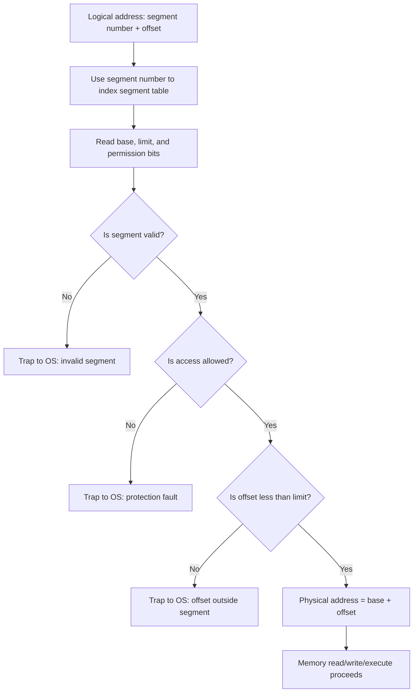
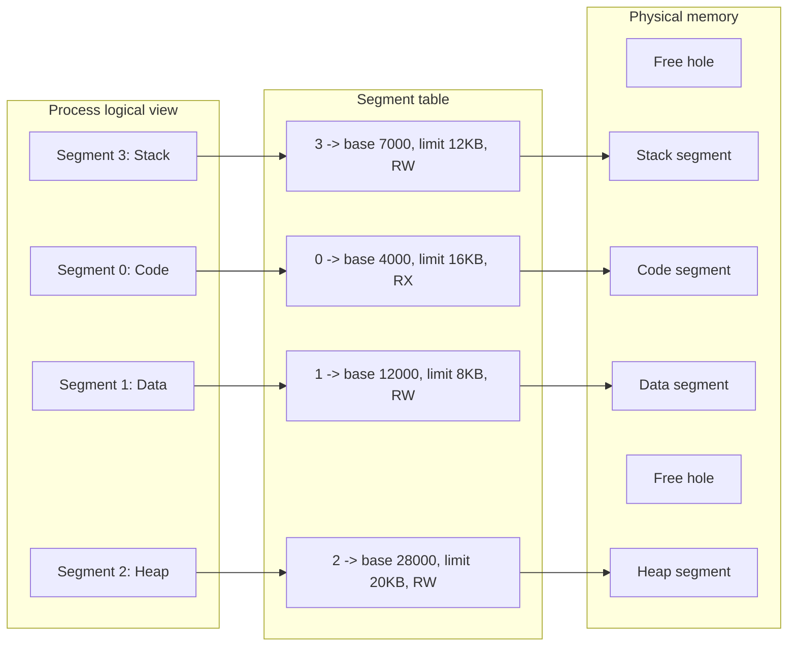
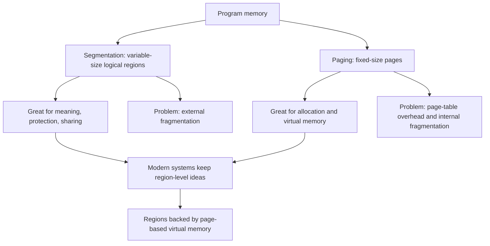

# Day 24 - Segmentation

Difficulty: Intermediate  
Fresh Learning: 40 minutes  
Revision: 5 minutes  
Prerequisites: Days 19-23: logical and physical addresses, MMU, contiguous allocation, paging, TLBs, and multi-level page tables  
Why this topic matters in interviews: Segmentation is one of the easiest memory-management topics to confuse with paging. Interviewers use it to test whether you understand programmer-visible memory regions, base-limit protection, sharing, fragmentation, and the reason modern systems prefer paging while still keeping segment-like ideas in protection and executable layouts.

Imagine a process as the program sees itself. It does not think, "I have page 0, page 1, page 2, and page 3." It thinks, "This is my code, this is my global data, this is my heap, this is my stack, and this shared library is mapped here." Paging is excellent for fixed-size physical allocation, but it does not match this natural programmer view. Segmentation was designed around that view: divide a program into logical variable-sized regions and give each region its own base, limit, and permissions.

The problem segmentation solves is not only "where should memory be placed?" It also asks, "What does this region mean?" Code should be executable but not writable. A stack should grow and be private. Shared library code can be shared across processes. A compiler, loader, and OS can reason about these logical parts more naturally when memory is divided by meaning.

Without a structure like segmentation, early systems had fewer clean ways to protect one part of a process from another or to share a meaningful region between processes. But segmentation also introduces a cost: because segments are variable-sized, physical memory can become full of holes. That is external fragmentation, and it is one reason pure segmentation is less common than paging in modern general-purpose systems.

## Interview Definition

Segmentation is a memory-management scheme in which a process is divided into logical, variable-sized segments such as code, data, heap, stack, and shared libraries. Each segment has a segment table entry containing a base address, a limit, and protection bits. A logical address is expressed as a segment number plus an offset; the MMU checks whether the offset is within the segment limit and then adds it to the segment base to produce the physical address. Segmentation matches the programmer's view of memory but can suffer from external fragmentation.

## Mental Model

Think of a process as a building divided into rooms by purpose. One room is the code room, one is the global-data room, one is the heap room, one is the stack room, and another may be a shared library room used by several buildings. Each room has a door sign saying where it begins, how large it is, and what actions are allowed inside it: read, write, execute, or share.

Paging is more like cutting every building into identical floor tiles and placing those tiles anywhere in the city. It is efficient for allocation. Segmentation is more like preserving meaningful rooms. It is easier to reason about purpose and protection, but rooms have different sizes, so fitting them into free physical memory becomes harder.

That is the core mental split:

- Paging divides memory into fixed-size blocks for allocation efficiency.
- Segmentation divides memory into logical regions for meaning, protection, and sharing.
- Modern systems often combine the ideas: programmer-visible regions are represented as mappings, while actual physical placement is page-based.

## Layer 1: What happens at a high level?

At a high level, segmentation gives each process a set of named or numbered memory regions. Instead of treating the process as one long linear address space, the OS and hardware treat the process as a collection of logical segments.

A simple process might have these segments:

| Segment | What it stores | Typical permissions |
|---|---|---|
| Code/text | Machine instructions | Read + execute |
| Read-only data | Constants, literals | Read only |
| Data | Initialized global/static variables | Read + write |
| Heap | Dynamically allocated memory | Read + write |
| Stack | Function calls, local variables, return addresses | Read + write |
| Shared library | Mapped library code/data | Depends on region |

The programmer or compiler thinks in terms of these regions because they have different meanings. The OS cares because each region may need different permissions, sharing behavior, and growth rules.

In pure segmentation, a logical address has two parts:

```txt
logical address = (segment number, offset)
```

The segment number selects an entry in the segment table. The offset says how far inside that segment the access is. If the offset is valid, the hardware calculates:

```txt
physical address = segment_base + offset
```

If the offset is outside the segment limit, the access is invalid and the hardware traps into the OS.

## Layer 2: What happens inside the OS?

The OS maintains a segment table for each process. A segment table is metadata that describes where each segment lives and what access is allowed.

A segment table entry usually contains:

- Base address: starting physical address of the segment.
- Limit: segment size or maximum legal offset.
- Protection bits: read, write, execute permissions.
- Valid bit: whether this segment currently exists.
- Sharing or ownership metadata: whether the segment is private or shared.

When a process is loaded, the OS and loader create logical regions for the executable, libraries, heap, stack, and other mappings. In a pure segmentation model, these regions can become entries in a segment table. If two processes share the same library code, their segment table entries can point to the same physical segment while still using process-specific segment numbers.

The OS uses segmentation for three major purposes:

1. Protection: code can be non-writable, stack can be non-executable, invalid offsets can be rejected.
2. Sharing: a shared library segment can be mapped into multiple processes.
3. Logical organization: memory regions match compiler and programmer concepts.

The hard part is allocation. Since segments are variable-sized, the OS must find a free hole large enough for each segment. Over time, free memory may become split into many small holes. Even if total free memory is large, no single hole may be large enough for a requested segment. That is the classic external fragmentation problem.

## Layer 3: What happens at hardware or kernel level?

The CPU's memory-management hardware needs a way to find the current process's segment table. A special register may point to the segment table, and another register may store its size. On every segmented memory reference, the hardware performs checks before allowing access.

The rough hardware flow is:

1. The CPU receives a logical address containing a segment number and offset.
2. The segment number is checked against the segment-table length.
3. The segment table entry is fetched.
4. The requested access is checked against permissions.
5. The offset is compared with the segment limit.
6. If valid, the base address is added to the offset.
7. If invalid, the CPU raises a trap or fault for the OS to handle.

This is why segmentation is strongly tied to protection. The hardware check is not a convention. It is enforced before the memory access completes.

On modern x86-64 systems, classic general-purpose segmentation is mostly disabled for ordinary address translation, and paging is the main memory-management mechanism. But the idea has not completely vanished. Segment registers and descriptor ideas still exist historically and in special cases, while modern OSes represent code, heap, stack, shared libraries, and memory-mapped files as virtual memory areas backed by page tables. The practical lesson for interviews is that segmentation is a foundational design idea even when pure segmentation is not the main mechanism used today.

## Layer 4: What can go wrong?

Segmentation can fail or become inefficient in several ways.

The first problem is external fragmentation. Because segments have different sizes, memory can become scattered into holes. Suppose free memory has holes of 10 KB, 20 KB, and 30 KB. Total free memory is 60 KB, but a new 40 KB segment cannot fit unless the OS compacts memory or rejects/suspends something.

The second problem is allocation overhead. The OS must search for a suitable hole using strategies like first fit, best fit, or worst fit. Those algorithms already appeared in contiguous allocation, and segmentation inherits the same placement problem.

The third problem is segment growth. A stack or heap can grow during execution. If another segment is placed immediately after it, growth may fail unless extra space was reserved or the OS can move segments.

The fourth problem is complexity. Segmentation expresses meaning well, but fixed-size pages are simpler for physical allocation, swapping, caching, and page replacement. That is why paging became dominant in modern virtual memory systems.

## Step-by-Step Flow

Here is the address-translation flow for pure segmentation:

1. The program generates a logical address such as `(segment = 2, offset = 140)`.
2. The CPU uses the current process's segment-table pointer to locate the segment table.
3. The segment number selects entry 2 from the segment table.
4. The hardware checks whether segment 2 is valid.
5. The hardware checks whether the operation is allowed, such as read, write, or execute.
6. The hardware compares `offset` with the segment limit.
7. If `offset >= limit`, the CPU raises a segmentation fault or protection fault.
8. If the offset is valid, the hardware computes `physical address = base + offset`.
9. The memory access proceeds at the computed physical address.
10. If the segment is shared, another process may have a different segment number pointing to the same physical region.

The important interview phrase is: segmentation translates a pair `(segment number, offset)` into a physical address by checking bounds and adding the segment base.

## Key Definitions

- Segment: a logical, variable-sized memory region such as code, data, heap, stack, or a shared library mapping.
- Segment table: a per-process table that stores metadata for each segment, including base, limit, validity, and protection bits.
- Segment number: the logical address field used to select a segment table entry.
- Offset: the distance from the beginning of the selected segment; it must be less than the segment limit.
- Base address: the starting physical address of a segment in pure segmentation.
- Limit: the maximum legal size or offset range of a segment.
- External fragmentation: wasted free memory caused by scattered holes between variable-sized allocations.
- Protection bits: metadata that controls whether a segment can be read, written, executed, or shared.

## Diagram Section

### Segmentation Address Translation



This diagram shows why segmentation is a protection mechanism, not only an address-calculation trick. The CPU checks validity, permissions, and bounds before producing the physical address.

### Logical Segments Mapped to Physical Memory



The logical view is clean and meaningful, but physical memory can contain segments in different places with holes between them. Those holes are where external fragmentation appears.

### Segmentation and Paging Comparison



This is the interview bridge: segmentation and paging are not random alternatives. They optimize different concerns, and modern systems often use region-level abstractions on top of paging.

## Practical System Relevance

In Linux, ordinary process memory is usually described by virtual memory areas, often visible through `/proc/<pid>/maps`. You can see code mappings, heap, stack, shared libraries, memory-mapped files, and permission flags such as `r-xp` or `rw-p`. This looks segment-like because each region has a purpose and permissions. But the actual address translation is page-based on modern hardware.

In Windows, a process also has a virtual address space with regions for image sections, heaps, stacks, mapped files, and shared libraries. The memory manager enforces permissions and backs regions with pages. Again, the logical idea of meaningful memory sections remains even though paging handles physical allocation.

In Android, each app runs in an isolated Linux process. The app's code, native libraries, managed runtime heap, stacks, and mapped resources are separate virtual regions. App sandboxing depends on page-table isolation and permissions, but the organization of memory still resembles a segmented view.

In browsers, renderer processes map JavaScript heaps, WebAssembly code, shared memory buffers, graphics buffers, and executable code regions with different permissions. A browser cares deeply about separating writable data from executable code because memory-corruption bugs become more dangerous when a region is both writable and executable.

In databases, memory-mapped files and buffer pools are region-like. A database may map a file into memory, and the OS represents that mapping as a virtual memory region with permissions and backing storage. Paging decides which pages are resident, but the mapping itself has segment-like meaning.

In cloud and container systems, containers do not get a private kernel, but their processes still have isolated virtual address spaces. Region permissions, page tables, and kernel-enforced memory protection remain essential. A container runtime may control resources through cgroups, but memory access is still enforced by the host kernel and hardware.

## Code or Pseudocode Section

The following C-like pseudocode shows the core segmented address translation logic:

```c
typedef struct {
    unsigned int base;
    unsigned int limit;
    bool readable;
    bool writable;
    bool executable;
    bool valid;
} SegmentEntry;

unsigned int translate(
    SegmentEntry table[],
    int table_size,
    int segment,
    unsigned int offset,
    AccessType access
) {
    if (segment < 0 || segment >= table_size) {
        trap("invalid segment number");
    }

    SegmentEntry entry = table[segment];

    if (!entry.valid) {
        trap("segment not present");
    }

    if (!permission_allows(entry, access)) {
        trap("protection violation");
    }

    if (offset >= entry.limit) {
        trap("offset outside segment bounds");
    }

    return entry.base + offset;
}
```

This demonstrates the three checks interviewers expect you to mention: valid segment, allowed operation, and offset within limit.

On a Linux machine, you can observe region-style memory organization with:

```bash
cat /proc/$$/maps
```

Look for lines that represent the shell's code, heap, stack, shared libraries, and mapped files. The output is not a pure segmentation table, but it shows the modern equivalent of meaningful memory regions with permissions.

Example permission flags:

```txt
r-xp  readable + executable, private mapping
rw-p  readable + writable, private mapping
---p  no access
```

The interview connection is strong: even when paging is the actual address-translation mechanism, OSes still organize process memory into logical regions with different permissions and backing behavior.

## Common Misconceptions

1. Segmentation and paging are the same thing.  
   They are different. Segmentation divides memory into variable-sized logical regions. Paging divides memory into fixed-size pages and frames.

2. Segmentation has no fragmentation.  
   Segmentation can suffer from external fragmentation because segments are variable-sized and must fit into physical holes in pure segmentation.

3. Paging matches the programmer's view better than segmentation.  
   Usually the opposite is true. Programmers think in code, heap, stack, and data regions. Segmentation matches that logical view better.

4. A segment number is the same as a page number.  
   A segment number selects a logical region. A page number selects a fixed-size virtual page.

5. The offset can be any value.  
   No. The offset must be less than the segment limit. Otherwise the access is invalid.

6. A segmentation fault always means the system uses pure segmentation.  
   No. The term "segmentation fault" survives historically. On modern systems it often means an invalid virtual memory access detected through paging and protection mechanisms.

7. Segmentation is only about memory allocation.  
   It is also about protection, sharing, and logical organization.

8. Modern OSes have no segment-like concepts.  
   Pure segmentation may not dominate address translation, but modern OSes still manage region-like areas such as code, heap, stack, shared libraries, and mapped files.

## Tricky Interview Corners

One tricky corner is the difference between external and internal fragmentation. Segmentation suffers mainly from external fragmentation because variable-sized segments leave holes between allocations. Paging suffers mainly from internal fragmentation because the last page of an allocation may be partly unused.

Another tricky corner is protection. A segment table naturally stores permissions at the segment level. That makes it easy to say: code is executable but not writable, data is writable but not executable, and a shared library can be mapped read-only into multiple processes.

The third corner is sharing. Two processes can share a code segment by having segment table entries point to the same physical region. The segment numbers do not need to be the same in both processes. What matters is that the entries point to the same underlying memory with compatible permissions.

The fourth corner is compaction. Since segmentation creates external fragmentation, the OS may need to move segments to combine free holes. But moving a segment requires updating base addresses and may be expensive, especially while processes are running.

The fifth corner is modern relevance. If an interviewer asks whether segmentation is still used, avoid a one-word answer. A stronger answer is: pure segmentation is not the main mechanism for memory management in most modern 64-bit general-purpose OS environments; paging dominates. But segment-like region concepts remain in process layouts, memory mappings, protection, and executable loading.

## Comparison Tables

### Segmentation vs Paging

| Feature | Segmentation | Paging |
|---|---|---|
| Division basis | Logical program regions | Fixed-size blocks |
| Unit size | Variable | Fixed |
| Address format | Segment number + offset | Page number + offset |
| Table entry stores | Base, limit, permissions | Frame number, flags |
| Main strength | Meaning, protection, sharing | Allocation, virtual memory, no external fragmentation |
| Main weakness | External fragmentation | Page-table overhead, internal fragmentation |
| Programmer view | Natural | Less natural |

### Segment Table vs Page Table

| Question | Segment table | Page table |
|---|---|---|
| What does entry represent? | One logical region | One fixed-size page |
| Does entry need a limit? | Yes | Usually no per-page limit; page size is fixed |
| Can entries differ greatly in size? | Yes | No, pages are same size |
| What is checked? | Bounds and permissions | Presence and permissions |
| What is added to offset? | Segment base | Frame base or frame number combined with offset |

### Internal vs External Fragmentation

| Type | Meaning | Common with |
|---|---|---|
| Internal fragmentation | Wasted space inside an allocated block | Paging, fixed partitions |
| External fragmentation | Free memory split into scattered holes | Segmentation, variable partitions |

## How to Explain This in an Interview

### 30-second answer

Segmentation divides a process into logical variable-sized regions such as code, data, heap, and stack. A logical address contains a segment number and an offset. The segment table stores the base, limit, and permissions for each segment. The hardware checks the offset and permissions, then adds the base to the offset to form the physical address. Segmentation is good for logical organization, protection, and sharing, but it can suffer from external fragmentation.

### 2-minute answer

In segmentation, memory is not viewed as one flat array of equal pages. Instead, it is divided according to program meaning. The code segment, stack segment, heap segment, and data segment may each have different sizes and permissions. When the CPU sees a logical address, it uses the segment number to find the segment table entry, checks whether the offset is within the limit, checks permissions, and then computes the physical address as base plus offset.

This design matches the programmer's view and supports protection naturally. For example, the code segment can be read-execute but not writable, while the data segment can be read-write but not executable. Shared libraries can also be mapped as shared segments. The tradeoff is that variable-sized segments create external fragmentation, so pure segmentation is harder to manage than paging.

### Deeper follow-up answer

The deeper comparison is that segmentation and paging optimize different things. Segmentation preserves logical meaning and gives variable-sized regions bounds and permissions. Paging uses fixed-size units, making physical memory allocation easier and avoiding external fragmentation. Modern systems generally rely on paging for actual translation and physical memory management, but they still expose segment-like regions through process memory maps, executable sections, stacks, heaps, shared libraries, and memory-mapped files.

## Interview Questions

### Basic Questions

1. What is segmentation in operating systems?
2. What are the two parts of a logical address in segmentation?
3. What does a segment table entry contain?
4. What is the role of the base and limit registers or fields?
5. Why does segmentation match the programmer's view of memory?

### Intermediate Questions

6. How does segmented address translation work step by step?
7. How does segmentation support memory protection?
8. Why can segmentation suffer from external fragmentation?
9. How is segmentation different from paging?
10. How can segmentation support sharing between processes?

### Advanced Questions

11. Why did modern systems move away from pure segmentation as the main memory-management technique?
12. How can segment-like ideas still exist in a page-based virtual memory system?
13. What happens if the offset is greater than or equal to the segment limit?
14. Compare segmentation with contiguous allocation.
15. Why is compaction more relevant to segmentation than paging?

## Follow-Up Questions

Q: What is segmentation?  
Follow-ups:
- Why are segments variable-sized?
- What examples of segments exist in a process?
- Why is segmentation called logical memory management?

Q: What is stored in a segment table?  
Follow-ups:
- Why is the limit field needed?
- What permissions can a segment have?
- How does the valid bit help?

Q: How is a segmented address translated?  
Follow-ups:
- What happens before the base is added?
- Why is checking the limit necessary?
- What kind of fault happens on invalid access?

Q: Segmentation vs paging?  
Follow-ups:
- Which one has external fragmentation?
- Which one has fixed-size units?
- Which one better matches the programmer's view?
- Why are modern systems mostly page-based?

Q: How does segmentation support sharing?  
Follow-ups:
- Can two processes use different segment numbers for the same physical segment?
- Why should shared code often be read-only?
- What happens if shared writable data is not synchronized?

Q: Does modern Linux use pure segmentation?  
Follow-ups:
- What does `/proc/<pid>/maps` show?
- Why do memory regions still matter?
- How do permissions like read, write, and execute relate to protection?

## Trick Questions

1. Q: If a system reports a segmentation fault, does that prove it uses pure segmentation?  
   Expected answer: No. The phrase is historical. On modern systems it commonly means an invalid virtual memory access, often detected through page-based protection.

2. Q: Does segmentation remove external fragmentation?  
   Expected answer: No. Segmentation can cause external fragmentation because segments are variable-sized.

3. Q: Is the segment offset translated by looking it up in another table?  
   Expected answer: No. The offset is checked against the limit and then added to the segment base.

4. Q: Can code and stack have different permissions in segmentation?  
   Expected answer: Yes. That is one of segmentation's natural strengths.

5. Q: If two processes share a segment, must it have the same segment number in both processes?  
   Expected answer: No. Their segment table entries can use different indexes while pointing to the same physical memory.

6. Q: Is paging more natural for the programmer than segmentation?  
   Expected answer: Usually no. Segmentation matches logical program parts better, while paging is better for fixed-size physical allocation.

7. Q: Does a segment table entry store a frame number?  
   Expected answer: In pure segmentation, it stores a base address and limit, not a page frame mapping.

## Practical Debugging / Observation

Use these commands on a Unix-like system to observe modern process memory regions:

```bash
cat /proc/$$/maps
```

Observe:

- Code regions usually have execute permission.
- Heap and stack regions usually have read-write permission.
- Shared libraries appear as mapped regions.
- File-backed and anonymous mappings can both exist.

Use:

```bash
pmap $$
```

Observe the mapped regions of the current shell process in a more compact form.

Use:

```bash
readelf -l /bin/ls
```

Observe executable program headers. These show how an executable is split into loadable regions with permissions. This is not a pure OS segment table, but it connects directly to the idea that code and data regions have different meanings and permissions.

Use:

```bash
ulimit -s
```

Observe the stack-size limit configured for the shell. Stack growth and limits are a practical reminder that memory regions are bounded and protected.

## Mini Quiz

### MCQs

1. In segmentation, a logical address is usually made of:
   A. frame number and offset  
   B. segment number and offset  
   C. inode number and offset  
   D. PID and page number  

2. A segment table entry mainly contains:
   A. base, limit, and permissions  
   B. only a frame number  
   C. only a process ID  
   D. only a file descriptor  

3. Segmentation mainly suffers from:
   A. no protection support  
   B. external fragmentation  
   C. inability to share memory  
   D. fixed page-size waste only  

4. Paging divides memory into:
   A. variable-sized logical regions  
   B. fixed-size pages and frames  
   C. only stack and heap  
   D. device buffers only  

5. If the offset is outside the segment limit:
   A. the OS silently wraps around  
   B. the hardware should raise a fault/trap  
   C. the segment expands automatically always  
   D. the page table is skipped  

### Short-answer questions

1. Why does segmentation match the programmer's view of memory?
2. What is the difference between base and limit?
3. How can segmentation support shared libraries?

### Reasoning questions

1. A process has three segments: code 20 KB, heap 50 KB, stack 10 KB. Physical memory has free holes of 30 KB, 25 KB, and 25 KB. Can the heap fit without compaction? Explain.
2. Why might an OS prefer paging for physical allocation but still keep region-level metadata for code, heap, stack, and mapped files?

### Answers

1. B
2. A
3. B
4. B
5. B

Short answers:

1. Because programs are naturally organized into logical regions such as code, data, heap, stack, and shared libraries, each with different meaning and permissions.
2. Base is the starting physical address of the segment. Limit is the maximum valid size or offset range for that segment.
3. Multiple processes can have segment table entries that point to the same physical memory region, often with read-only or controlled permissions.

Reasoning answers:

1. No. The heap needs one contiguous 50 KB hole in pure segmentation. Total free memory may be 80 KB, but no single hole is large enough.
2. Paging makes fixed-size allocation, swapping, and virtual memory efficient, while region-level metadata preserves logical meaning, permissions, and backing information.

# 5-Minute Revision Column

Revision Targets:

- Day 23: Multi-Level Page Tables - R1 recall revision
- Day 21: Paging Basics - R2 compression revision
- Day 12: Multithreading Models - R3 flash revision

## Day 23 - Multi-Level Page Tables

Core recall: A multi-level page table is a hierarchy that splits the virtual page number into multiple indexes. The top level points to lower-level page tables, and the final level gives the physical frame mapping. Its main purpose is memory efficiency for large sparse address spaces, not raw speed. TLBs are the speed optimization; multi-level structure is the space optimization.

Key definitions:

- Page table root: the starting point for a page-table walk.
- Page table walk: the process of following page-table levels after a TLB miss.
- Sparse address space: a large virtual address space where many regions are unmapped.

Pitfalls:

- Do not say a 64-bit process allocates page-table entries for every possible virtual page.
- Do not say the offset changes during translation; the offset is carried unchanged.

Quick questions:

1. Why are lower-level page tables allocated only when needed?
2. Does a TLB miss prove the page is absent from RAM?

Mental model: a nested directory where empty address ranges do not need their own detailed subdirectories.

## Day 21 - Paging Basics

Core recall: Paging divides logical memory into fixed-size pages and physical memory into equal-sized frames. A page table maps page number to frame number, while the offset remains unchanged. Paging allows a process's virtual pages to be scattered across RAM without requiring one contiguous physical block.

Key definitions:

- Page: fixed-size block of virtual/logical memory.
- Frame: fixed-size block of physical memory.
- Page table: mapping from virtual pages to physical frames plus flags.

Pitfalls:

- Page and frame are not the same; page is virtual, frame is physical.
- Paging removes external fragmentation for process placement, but internal fragmentation can still occur.

Quick questions:

1. If page size is 4 KB, how many offset bits are needed?
2. Can two processes use the same virtual address but map to different frames?

Mental model: a notebook's pages placed into numbered lockers in any order.

## Day 12 - Multithreading Models

Flash recall: Multithreading models describe how user-level threads map to kernel-level schedulable threads.

Must remember:

- Many-to-one: cheap user-level switching, but no true parallelism and one blocking call can block all user threads.
- One-to-one: parallelism and independent blocking, but more kernel overhead.
- Many-to-many: many user threads multiplexed over multiple kernel threads.

Killer trap: concurrency is not the same as parallelism.

Tricky question: If a program has 1,000 user-level threads, is it definitely using 1,000 OS threads or CPU cores? No.

## Final Takeaway

Segmentation divides a process into meaningful, variable-sized memory regions such as code, data, heap, stack, and shared libraries. Each segment has a base, limit, and permissions, so segmentation naturally supports bounds checking, protection, and sharing. Its weakness is external fragmentation because variable-sized segments must fit into physical holes. Paging dominates modern physical memory management because fixed-size pages are easier to allocate and move, but segment-like region ideas still appear in executable layouts, process memory maps, permissions, heaps, stacks, shared libraries, and mapped files. In interviews, the strongest answer compares segmentation with paging by explaining the tradeoff: meaning and protection versus allocation simplicity.

## What You Should Be Able To Answer Now

- Define segmentation in a clean interview-ready way.
- Explain how `(segment number, offset)` becomes a physical address.
- Describe what base, limit, valid bit, and permission bits do.
- Compare segmentation with paging without mixing up pages, frames, and segments.
- Explain why segmentation suffers from external fragmentation.
- Explain how segmentation supports protection and sharing.
- Connect segmentation to modern process memory regions such as code, heap, stack, shared libraries, and mapped files.
- Handle trick questions about segmentation faults, modern paging, and external fragmentation.
