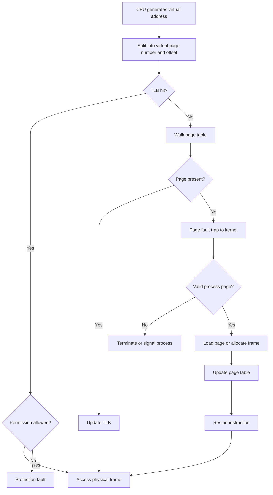
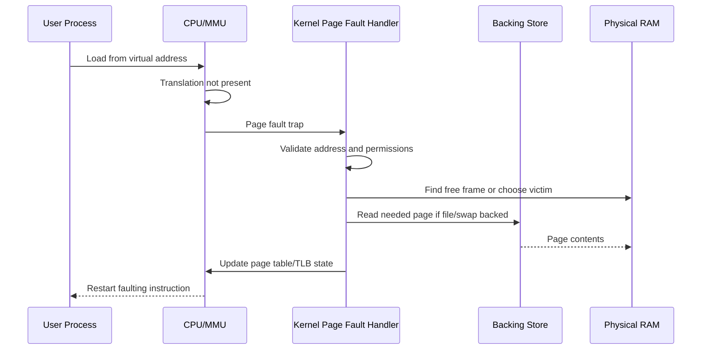
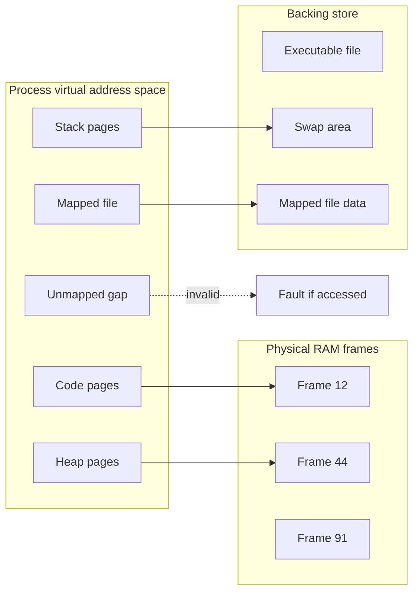

# Day 25 - Virtual Memory

Difficulty: Intermediate  
Fresh Learning: 40 minutes  
Revision: 5 minutes  
Prerequisites: Days 21-24: paging, TLB, multi-level page tables, segmentation  
Why this topic matters in interviews: Virtual memory connects address translation, page faults, lazy loading, swap, protection, and real system performance. Interviewers ask it because it reveals whether you understand memory as an OS-managed illusion rather than just "RAM size".

## Opening Intuition

Imagine opening a browser with twenty tabs, VS Code, a music app, a PDF reader, and a local server. The total memory those programs can potentially use may be larger than the physical RAM in the laptop, yet the system does not immediately crash. Each application also behaves as if it owns a clean private address space starting from familiar-looking addresses, even though many programs are sharing the same hardware memory.

Virtual memory is the mechanism that makes this possible. It gives every process the illusion of a large, private, continuous memory space, while the operating system and hardware translate those virtual addresses into actual physical frames only when needed.

Without virtual memory, programs would need to fit entirely in physical RAM before running, memory protection would be weaker, sharing libraries safely would be harder, and loading large programs would be slower. With virtual memory, the OS can load pages lazily, isolate processes, map files into memory, share read-only code pages, move inactive pages to disk, and let hardware catch illegal access attempts.

The important interview idea is this: virtual memory is not "fake RAM". It is an address-space abstraction backed by page tables, the MMU, physical frames, and sometimes disk-backed storage.

## Interview Definition

Virtual memory is an operating system memory-management technique that gives each process a large private virtual address space and maps virtual pages to physical frames using page tables and the MMU. Pages are brought into RAM only when needed through demand paging. If a process accesses a non-resident but valid page, a page fault occurs and the OS loads the page from disk or another backing store. Virtual memory improves isolation, flexibility, loading efficiency, and memory utilization.

## Key Definitions

Virtual memory: a memory abstraction in which each process uses virtual addresses that are translated to physical addresses by hardware and OS-maintained page tables.

Virtual address: the address generated by a program before translation by the MMU.

Physical address: the actual address in RAM after translation.

Demand paging: loading a page into RAM only when the process actually accesses it.

Lazy loading: delaying work, such as loading code or data pages, until the moment they are needed.

Page fault: a trap raised when a virtual page cannot be immediately translated for the attempted access, often because it is not resident or violates permissions.

Valid-invalid bit: a page table bit that tells whether a virtual page is a legal part of the process address space and whether the mapping can be used.

Swap space: disk-backed storage used to hold pages that are temporarily not resident in RAM.

Resident set: the subset of a process's virtual pages currently loaded in physical memory.

Backing store: the source from which a page can be loaded, such as an executable file, memory-mapped file, or swap area.

## Mental Model

Think of a process as a student who has a huge personal notebook with page numbers from 0 onward. The student writes page numbers in their code, but the actual pages are stored in a shared library building. The page table is the librarian's directory that says, "virtual page 42 is currently on shelf frame 900" or "virtual page 42 is valid but stored in the archive, fetch it if requested" or "virtual page 42 is not part of this student's notebook at all."

The process never directly sees the library shelves. It only uses notebook page numbers. The MMU checks the directory on every memory access. If the page is already on a shelf, access continues. If the page is valid but not present, the OS pauses the process, fetches the page, updates the directory, and resumes the process. If the page is invalid or permission is wrong, the OS reports an error such as a segmentation fault or access violation.

This model keeps three ideas separate:

- The virtual address space is the process's view.
- Physical RAM is the shared hardware resource.
- The page table is the controlled translation and protection mechanism.

## Layer 1: What happens at a high level?

At a high level, virtual memory lets a program run without all of its code and data being loaded into RAM at once. The process sees a large virtual address space with regions for code, heap, stack, shared libraries, memory-mapped files, and kernel-reserved areas. These regions may be valid even before every page is physically present.

When the CPU executes an instruction like "load from address X", address X is a virtual address. The MMU translates the virtual page number into a physical frame number and keeps the offset unchanged. If the page is present and permissions allow the access, the instruction continues. If not, the hardware traps into the kernel.

Demand paging is the practical policy behind this. Instead of eagerly loading every page of an executable, the OS loads only the pages touched by execution. For example, a large program may contain many error-handling paths, rarely used menu features, or library functions that never run in the current session. Loading all of that immediately wastes memory and startup time.

Virtual memory also gives each process isolation. Two processes can both use virtual address `0x400000`, but those virtual addresses can map to different physical frames. This is why one faulty user process cannot normally overwrite another process's memory.

## Layer 2: What happens inside the OS?

Inside the OS, each process has metadata describing its virtual address space. In a paging system, the page table records the state of each virtual page. A page table entry commonly contains a frame number when present, a present or valid bit, permission bits, dirty bit, accessed bit, and sometimes information about where to find the page if it is not resident.

When a process starts, the OS does not need to copy every byte of the executable into RAM. It can create virtual mappings that point to the executable file as backing store. The first time the process jumps into a code page that is not resident, a page fault occurs. The OS reads that page from the executable into a free physical frame, updates the page table, and restarts the faulting instruction.

For heap memory, the OS may reserve a virtual range before committing physical memory. A call such as `malloc` may obtain space from the allocator, but physical frames may still be assigned lazily as the program writes to pages. For stack growth, the OS may keep a guard page below the current stack. If the stack grows normally into the guard area, the OS can allocate another stack page. If it jumps too far, the OS treats it as invalid stack access.

When RAM pressure rises, the OS may evict some pages. Clean file-backed pages can often be discarded because they can be reread from the file. Dirty anonymous pages, such as modified heap or stack pages, need to be written to swap before their frames are reused. This is why swap is not simply "extra RAM"; it is a slower backing store that lets the OS keep inactive memory contents outside RAM.

## Layer 3: What happens at hardware or kernel level?

At hardware level, the CPU generates virtual addresses. The MMU translates them using the TLB and page tables. The virtual address is split into a virtual page number and an offset. The virtual page number selects a page-table entry, directly or through multiple page-table levels. The offset is copied unchanged into the final physical address.

If the TLB contains a valid translation, the CPU can form the physical address quickly. If the TLB misses, the processor or kernel walks the page table. If the page-table entry says the page is present and permissions are correct, the translation is inserted into the TLB and execution continues. If the entry says not present, invalid, or permission denied, the CPU raises a page fault trap.

The page fault handler runs in kernel mode. It must answer a precise question: is this fault legitimate and recoverable, or is it an illegal access?

A recoverable page fault might mean:

- the page belongs to a mapped executable but has not been loaded yet;
- the page belongs to a memory-mapped file and must be read from storage;
- the page was swapped out and must be swapped back in;
- the process touched a copy-on-write page that now needs a private copy;
- the stack is growing within its allowed limit.

An unrecoverable page fault might mean:

- the process accessed an unmapped address;
- the process wrote to a read-only page;
- the process executed data from a non-executable page;
- the process exceeded its stack limit;
- the kernel found corrupted or inconsistent memory metadata.

The kernel then either fixes the mapping and restarts the instruction, or delivers an error signal/exception to the process.

## Layer 4: What can go wrong?

Virtual memory can fail or become slow in several ways.

First, a page fault can be invalid. If a program dereferences a null pointer, uses a freed pointer, writes beyond an array, or jumps to a bad function pointer, the OS may detect that the address is not valid for that process. On Linux this often appears as `Segmentation fault`. On Windows it may appear as an access violation.

Second, page faults can be valid but expensive. A minor page fault may only require updating mappings or assigning a zero-filled page. A major page fault may require disk I/O, such as reading from an executable file or swap. Major faults are much slower than normal memory access.

Third, the system can thrash. If the combined working sets of active processes do not fit in RAM, the OS may spend more time moving pages in and out than executing useful work. CPU utilization can fall even though the system feels busy because the bottleneck becomes paging I/O.

Fourth, bad locality hurts performance. A program that jumps randomly across a huge memory region may cause frequent cache misses, TLB misses, and page faults. Virtual memory makes large address spaces convenient, but it does not remove the cost of poor access patterns.

Fifth, permissions matter. Virtual memory is part of security. Pages can be read-only, writable, executable, user-accessible, or kernel-only. Mistakes in permission handling can become serious vulnerabilities.

## Step-by-Step Flow

Here is the normal demand-paging flow for a process reading a virtual address:

1. The process executes an instruction that references a virtual address.
2. The CPU splits the address into virtual page number and offset.
3. The MMU checks the TLB for the virtual page translation.
4. If the TLB hits and permissions allow the access, the physical address is formed and memory is accessed.
5. If the TLB misses, the page table is checked.
6. If the page-table entry is present and valid, the TLB is updated and the instruction continues.
7. If the page is valid but not resident, the CPU raises a page fault trap.
8. The kernel page fault handler checks whether the access is legal.
9. The OS finds a free frame or evicts another page if necessary.
10. The OS loads the needed page from backing store or creates a zero-filled page.
11. The page table is updated to mark the page present with correct permissions.
12. The faulting instruction is restarted.
13. The process continues as if the memory had been available all along.

## Diagram Section



This flow separates a TLB miss from a page fault. A TLB miss may be solved by reading the page table. A page fault means the current translation cannot complete normally and the kernel must intervene.



This sequence shows why a recoverable page fault is not a crash. It is a controlled trap that lets the OS make the missing page available.



The process sees one virtual space, but pages may currently be in RAM, backed by files, swapped out, or invalid.

## Practical System Relevance

In Linux, virtual memory is visible through `/proc/<pid>/maps`, which shows virtual memory regions, permissions, and backing files. The actual translation still happens through page tables and the TLB. Linux uses demand paging for executables, shared libraries, anonymous memory, memory-mapped files, and copy-on-write after `fork`.

In Windows, each process has a private virtual address space with image sections, heaps, stacks, mapped files, and shared DLLs. Windows reports hard faults when data must be fetched from disk-backed storage and uses page protections to catch invalid access.

In Android, every app runs in an isolated process with its own virtual address space. Shared libraries, runtime heaps, memory-mapped APK resources, graphics buffers, and stack regions depend on virtual memory. App sandboxing is partly enforced by process isolation and page permissions.

In browsers, renderer processes rely heavily on virtual memory. JavaScript heaps, WebAssembly memory, shared array buffers, JIT-compiled code, and graphics buffers all need controlled permissions. Modern browsers try to avoid pages that are both writable and executable because that combination is dangerous.

In databases, memory-mapped files and buffer pools interact deeply with virtual memory. A database may map a large file and let the OS bring pages into RAM as they are touched. This can simplify I/O patterns, but poor access locality can still cause page faults and cache pressure.

In cloud systems and containers, each process still relies on the host kernel's virtual memory. Containers do not get separate hardware memory translation; they get isolated process views, namespaces, cgroups, and limits. Memory limits can cause reclaim, swapping, or out-of-memory termination depending on configuration.

## Code or Pseudocode Section

This small C-like example shows how a program can reserve a large region but only touch a small number of pages:

```c
char *buffer = reserve_large_virtual_region(1024 * 1024 * 1024); // 1 GB virtual

buffer[0] = 'A';              // first page may be allocated now
buffer[4096 * 100] = 'B';     // another page may be allocated now
```

The exact API differs by OS, but the idea is common: virtual address space can be reserved separately from physical frame allocation. The first write may trigger a page fault that causes the OS to provide a real page.

On Linux or WSL, these commands help observe the idea:

```bash
cat /proc/$$/maps
ps -o pid,vsz,rss,comm -p $$
vmstat 1
```

`VSZ` is virtual size: the address space reserved or mapped by the process. `RSS` is resident set size: the part currently in RAM. `vmstat` can show paging activity; columns such as `si` and `so` indicate swap-in and swap-out activity on many Linux systems.

Copy-on-write after `fork` is another practical virtual memory trick:

```c
pid_t pid = fork();
if (pid == 0) {
    global_value = 42;  // child may get a private copy of the modified page
}
```

After `fork`, parent and child can initially share physical pages marked copy-on-write. When one writes, a page fault lets the kernel allocate a private copy. This makes process creation much cheaper than copying all memory immediately.

## Common Misconceptions

1. Virtual memory means unlimited memory.  
   False. It gives a large address-space abstraction, but it is still limited by address width, OS policy, RAM, swap, and overcommit behavior.

2. A page fault is always a crash.  
   False. Many page faults are normal. Demand paging, stack growth, memory-mapped files, and copy-on-write can all use recoverable page faults.

3. TLB miss and page fault are the same.  
   False. A TLB miss means the translation was not in the TLB. The page table may still contain a valid resident mapping. A page fault means translation or permission handling cannot continue normally without kernel intervention.

4. Swap is as good as RAM.  
   False. Swap is much slower because it uses storage. It can prevent immediate failure, but heavy swapping can make the system unusably slow.

5. Virtual addresses are physical addresses with a different name.  
   False. Virtual addresses are process-visible addresses. Physical addresses refer to actual RAM locations after translation.

6. If two processes use the same virtual address, they must share memory.  
   False. The same virtual address in different processes usually maps to different physical frames unless the OS intentionally maps shared memory.

7. More virtual memory always improves performance.  
   False. Virtual memory improves flexibility and utilization, but poor locality, major page faults, TLB pressure, and thrashing can hurt performance.

## Tricky Interview Corners

The first tricky corner is the difference between valid, present, and permitted. A page may be valid for the process but not present in RAM yet. That can be a recoverable demand-paging fault. A page may be present but not writable. Writing to it causes a protection fault or copy-on-write handling. A page may be invalid entirely. Accessing it should fail.

The second tricky corner is page fault cost. A minor page fault may be relatively cheap because the page is already in memory or only needs a zero-filled frame. A major page fault is expensive because storage I/O is involved. Saying "page faults are slow" is broadly true, but interviewers like candidates who distinguish recoverable fault types.

The third tricky corner is overcommit. Some systems may allow a process to reserve more virtual memory than can be physically backed immediately. This can improve flexibility, but if processes actually touch too much memory later, the OS must reclaim, swap, or kill processes.

The fourth tricky corner is copy-on-write. After `fork`, pages can be shared read-only until a write happens. The write triggers a page fault, but that fault is useful: it lets the OS create a private copy only for the modified page.

The fifth tricky corner is memory-mapped files. Reading a mapped file can look like normal memory access in user code, but page faults may cause the OS to load file pages behind the scenes.

The sixth tricky corner is security. Page-table permissions help enforce read/write/execute rules. Many mitigations depend on these permissions, such as non-executable stacks and separation of writable data from executable code.

## Comparison Tables

| Concept | Meaning | Interview trap |
|---|---|---|
| Virtual address | Address used by the process | Not the same as RAM address |
| Physical address | Actual RAM address after translation | Process usually cannot directly use it |
| TLB miss | Translation not cached in TLB | Does not necessarily mean page absent |
| Page fault | Translation or permission cannot complete normally | Not always a crash |
| Swap | Disk-backed storage for evicted pages | Much slower than RAM |

| Demand paging | Eager loading |
|---|---|
| Loads pages when first touched | Loads needed content earlier |
| Faster startup and lower initial RAM use | Simpler reasoning but can waste memory |
| Can cause page faults during execution | Higher upfront cost |
| Works well when locality is good | Wasteful for rarely used code paths |

| Valid-invalid bit state | Meaning |
|---|---|
| Valid and present | Legal page, currently in RAM |
| Valid but not present | Legal page, must be loaded or restored |
| Invalid | Not part of the process address space or illegal for this access |

## How to Explain This in an Interview

### 30-second answer

Virtual memory gives each process a private virtual address space. The MMU translates virtual pages to physical frames using page tables and the TLB. With demand paging, pages are loaded only when touched. If a valid page is not resident, a page fault lets the OS load it and restart the instruction. If the access is invalid, the process gets an error.

### 2-minute answer

Virtual memory solves three problems: isolation, efficient memory use, and flexible loading. Each process uses virtual addresses, so two processes can use the same virtual address while mapping to different physical frames. The OS stores mappings in page tables, and the MMU checks those mappings on memory access. Pages do not all need to be in RAM. Code pages can be loaded from executables, file mappings can be read when touched, and inactive anonymous pages can be swapped out. When a process touches a missing but valid page, the CPU traps into the kernel. The kernel validates the access, finds or frees a frame, loads the page from backing store or creates it, updates the page table, and restarts the instruction. This is why page faults are sometimes normal. But if the access violates permissions or touches an invalid address, the OS reports a fault to the process.

### Deeper follow-up answer

At hardware level, the virtual address is split into page number and offset. The page number is translated through the TLB or page table, while the offset stays unchanged. Page-table entries contain present, valid, dirty, accessed, and permission metadata. A page fault handler must distinguish non-resident valid pages, copy-on-write writes, stack growth, mapped-file faults, and illegal accesses. The performance risk is that major faults require I/O, and too many faults can cause thrashing. The security benefit is that page permissions enforce isolation and prevent user programs from freely reading, writing, or executing arbitrary memory.

## Interview Questions

### Basic Questions

1. What is virtual memory?
2. Why does each process need its own virtual address space?
3. What is the difference between a virtual address and a physical address?
4. What is demand paging?
5. What is a page fault?

### Intermediate Questions

6. Why is a page fault not always an error?
7. What does the valid-invalid bit represent?
8. How does swap space support virtual memory?
9. What is the difference between a TLB miss and a page fault?
10. Why can two processes use the same virtual address safely?

### Advanced Questions

11. Explain the page fault handling steps.
12. How does copy-on-write use page faults?
13. Why can virtual memory improve program startup time?
14. How can virtual memory hurt performance?
15. What is the relationship between working set size and thrashing?

## Follow-Up Questions

Q: What is virtual memory?  
Follow-ups:
- Is virtual memory the same as swap?
- Does virtual memory require paging?
- Can virtual memory be larger than RAM?
- What hardware support is needed?

Q: What is a page fault?  
Follow-ups:
- When is it recoverable?
- When does it become a crash?
- What is the difference between minor and major faults?
- Why does the OS restart the faulting instruction?

Q: What is demand paging?  
Follow-ups:
- How does it improve startup time?
- What is the cost during execution?
- What pages are loaded from executable files?
- How does it interact with memory-mapped files?

Q: What is the valid-invalid bit?  
Follow-ups:
- Is invalid always the same as swapped out?
- Can a page be valid but not present?
- How do permission bits differ from validity?
- What happens if a process writes to a read-only valid page?

Q: What is swap space?  
Follow-ups:
- Is swap as fast as RAM?
- Which pages need to be written to swap before eviction?
- Can a system run without swap?
- Why does heavy swapping cause poor responsiveness?

Q: How does copy-on-write work?  
Follow-ups:
- Why is it useful after `fork`?
- Why does a write cause a page fault?
- Are pages copied immediately?
- What happens if neither process writes?

## Trick Questions

Q: If a program gets a page fault, has it definitely crashed?  
Expected answer: No. The OS may handle a valid missing page by loading it and restarting the instruction.

Q: If a page is not in the TLB, is it absent from RAM?  
Expected answer: No. It may be resident in RAM but missing from the TLB cache.

Q: If a process reserves 1 GB of virtual memory, has it consumed 1 GB of RAM?  
Expected answer: Not necessarily. Physical frames may be allocated lazily as pages are touched.

Q: Can two processes have the same virtual address mapped to different physical memory?  
Expected answer: Yes. That is normal process isolation.

Q: Is swap just slower RAM?  
Expected answer: No. It is disk-backed storage used for non-resident pages; it is far slower and changes performance behavior.

Q: Does the offset change during page translation?  
Expected answer: No. The page number is translated to a frame number; the offset stays the same.

Q: If a page is valid, can any access to it succeed?  
Expected answer: No. Permissions still matter. A write to a read-only page or execute from a non-executable page can fault.

## Practical Debugging / Observation

On Linux or WSL, use:

```bash
cat /proc/$$/maps
ps -o pid,vsz,rss,comm -p $$
vmstat 1
free -h
pmap $$
```

Observe the difference between virtual size and resident size. A process can have a large virtual address space while only a smaller portion is resident in RAM. In `/proc/<pid>/maps`, notice separate regions for executable code, heap, stack, shared libraries, and mapped files. Permissions like `r-xp` and `rw-p` show how virtual memory also enforces protection.

For page-fault observation, Linux tools such as `time -v`, `perf stat`, or process accounting can show minor and major faults where available:

```bash
/usr/bin/time -v ./program
```

Minor faults usually do not require disk I/O. Major faults usually involve reading from storage. If major faults are high, the system may be under memory pressure or the program may be touching file-backed pages heavily.

## Mini Quiz

### MCQs

1. What is the main purpose of virtual memory?  
   A. Make CPU faster  
   B. Give processes private virtual address spaces and map them to physical memory  
   C. Replace all disk storage  
   D. Remove the need for RAM  
   Answer: B

2. What part of a virtual address is unchanged during paging translation?  
   A. Page number  
   B. Frame number  
   C. Offset  
   D. Valid bit  
   Answer: C

3. A TLB miss means:  
   A. The page is definitely invalid  
   B. The translation is not in the TLB  
   C. The process has crashed  
   D. RAM is full  
   Answer: B

4. Demand paging loads a page:  
   A. Only when it is first needed  
   B. Only at shutdown  
   C. Only when CPU is idle  
   D. Only when the compiler requests it  
   Answer: A

5. Heavy swapping usually indicates:  
   A. Excellent locality  
   B. No memory pressure  
   C. Disk-backed paging pressure  
   D. No virtual memory  
   Answer: C

### Short-answer questions

1. Why can a page fault be normal?  
   Answer: Because a valid page may be intentionally loaded lazily, restored from swap, copied on write, or read from a mapped file when first touched.

2. What does the valid-invalid bit help detect?  
   Answer: Whether a virtual page is a legal part of the process address space or should be treated as invalid for translation.

3. Why is swap slower than RAM?  
   Answer: Swap uses storage devices, whose latency and bandwidth are much worse than physical memory.

### Reasoning questions

1. A process has 2 GB virtual size but 200 MB RSS. Is this automatically a problem?  
   Answer: No. It may have reserved or mapped 2 GB while only 200 MB is resident. The problem depends on working set, faults, and memory pressure.

2. Why does copy-on-write make `fork` efficient?  
   Answer: The OS can let parent and child share pages initially and only copy a page when one process writes to it.

# 5-Minute Revision Column

Revision targets from `prepare:day`: Day 24 Segmentation (R1), Day 22 Translation Lookaside Buffer (R2), Day 20 Contiguous Memory Allocation (R3).

## Day 24 - Segmentation (R1 Recall Revision)

- Segmentation divides a process into logical, variable-sized regions such as code, data, heap, stack, and shared libraries.
- A logical address has a segment number and offset. The segment table provides base, limit, validity, and protection bits.
- The MMU checks whether the offset is within the segment limit, then adds it to the segment base.
- Segmentation matches the programmer's logical view better than paging, but variable-sized segments can create external fragmentation.
- Protection is natural: code can be read/execute, data can be read/write, and shared libraries can be mapped with controlled permissions.

Key definitions:
- Segment: logical variable-sized memory region.
- Segment table: per-process table containing base, limit, and permissions.
- External fragmentation: free memory split into holes too scattered for large allocations.

Common traps:
- A segmentation fault on a modern system does not prove pure segmentation is used.
- Paging and segmentation are not the same: paging uses fixed-size pages, segmentation uses logical variable-sized regions.

Quick interview questions:
- Why does segmentation match the programmer's view of memory?
- Why can segmentation suffer from external fragmentation?

Mental model: segmentation is like dividing a process into meaningful rooms; each room has a base, size limit, and allowed actions.

## Day 22 - Translation Lookaside Buffer (R2 Compression Revision)

- TLB = small hardware cache of recent virtual-page to physical-frame translations.
- TLB hit avoids a page-table lookup; TLB miss requires consulting the page table.
- A TLB miss does not automatically mean a page fault.
- Context switches and mapping changes may require flushing or tagging TLB entries.
- Effective access time depends heavily on TLB hit ratio.

Key definitions:
- TLB hit: translation found in the TLB.
- TLB miss: translation absent from TLB, so page-table lookup is needed.

Example: repeated access to nearby array elements usually benefits from cached translations because many accesses fall within the same page.

Traps:
- TLB is not the page table.
- The offset is not translated by the TLB; it is carried through unchanged.

Quick interview questions:
- Why does a TLB improve paging performance?
- Can a TLB hit still fail because of permissions?

## Day 20 - Contiguous Memory Allocation (R3 Flash Revision)

Contiguous allocation places each process in one continuous physical memory block.

Must remember:
- Fixed partitions mainly cause internal fragmentation.
- Variable partitions mainly cause external fragmentation.
- First fit, best fit, and worst fit choose different free holes.

Killer pitfall: total free memory is not enough; contiguous allocation needs one continuous hole large enough for the request.

Tricky question: If 300 MB is free in total, can a 200 MB process always load? No, not if the largest continuous hole is smaller than 200 MB.

## Final Takeaway

Virtual memory is the OS abstraction that lets each process run in a private virtual address space while the MMU and page tables translate addresses to physical frames. Demand paging makes loading lazy: pages enter RAM when touched, not necessarily when the program starts. Page faults are the controlled mechanism that lets the kernel load missing valid pages, enforce permissions, support copy-on-write, and detect illegal access. The benefit is isolation, flexibility, sharing, and better memory use. The cost is translation overhead, page-fault latency, swap pressure, and possible thrashing when working sets do not fit in RAM.

## What You Should Be Able To Answer Now

- Explain virtual memory as an address-space abstraction, not just extra memory.
- Distinguish virtual addresses, physical addresses, pages, frames, and offsets.
- Explain demand paging and lazy loading.
- Walk through page fault handling step by step.
- Separate TLB misses from page faults.
- Explain valid-invalid bits, present state, and permissions.
- Describe how swap supports virtual memory and why it is slow.
- Connect virtual memory to copy-on-write, memory-mapped files, isolation, and thrashing.
