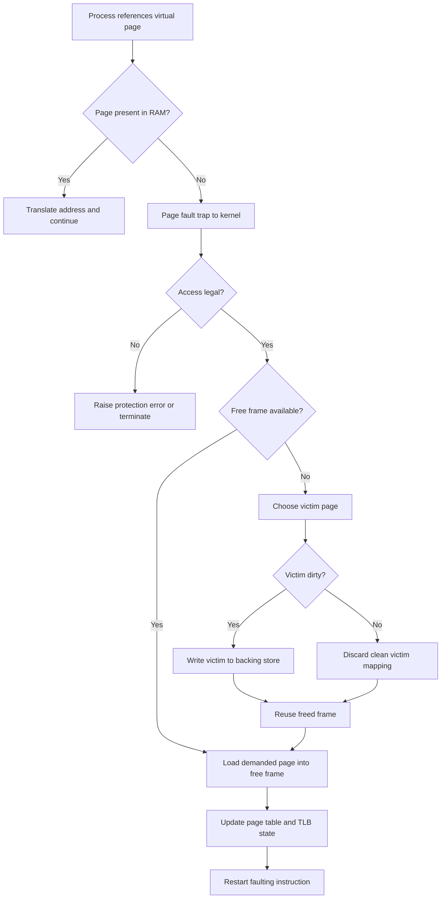
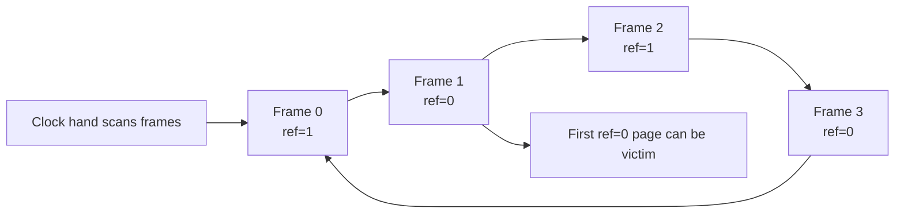

# Day 26 - Page Replacement Algorithms

Difficulty: Advanced  
Fresh Learning: 40 minutes  
Revision: 5 minutes  
Prerequisites: Day 25 - Virtual Memory  
Why this topic matters in interviews: Page replacement tests whether you can reason about demand paging under memory pressure, compare algorithm tradeoffs, explain why the theoretical best algorithm is not implementable, and connect page faults to real system slowdown.

## Opening Intuition

Imagine your laptop has a browser with many tabs, a code editor, a local database, a video call, and a few background services. Every process believes it has a large private virtual address space, but physical RAM is finite. At some point the operating system may need a free frame for a page that was just touched, while all frames are already occupied.

The OS now has a hard question: which resident page should be removed from RAM so the new page can come in?

That question is the job of a page replacement algorithm. It is not enough to say "remove any page." A poor choice can cause the same page to be needed again immediately, creating extra page faults and wasting time on disk or backing-store I/O. A good choice keeps pages with strong future usefulness and evicts pages that are unlikely to be used soon.

You see this in daily computer use when a system becomes slow after opening too many applications. The CPU may not be the main bottleneck. The machine may be spending time moving pages between RAM and backing storage. In Task Manager, Activity Monitor, `vmstat`, or `top`, this appears as memory pressure, high paging activity, hard faults, or swap usage.

The interview-level idea is simple but deep: virtual memory lets programs run with only part of their address space in RAM, and page replacement decides what to sacrifice when RAM is full.

## Interview Definition

Page replacement is the operating system policy used during demand paging when a required page must be loaded into RAM but no free physical frame is available. The OS selects a victim page, writes it back if it is dirty, marks its page-table entry non-present, loads the needed page into the freed frame, updates the page table, and restarts the faulting instruction. Common algorithms include FIFO, Optimal, LRU, and Clock.

## Key Definitions

Page replacement: the process of choosing a resident page to evict from physical memory when a new page must be loaded and no free frame is available.

Victim page: the page selected for eviction.

Page fault: a trap that occurs when the CPU cannot complete a virtual-address translation for the attempted access, often because the page is not resident.

Dirty page: a page whose contents have been modified in RAM and must be written back before eviction if its backing copy is stale.

Clean page: a page that matches its backing store and can usually be discarded without a write-back.

Reference string: a sequence of page accesses used to analyze page replacement behavior.

Frame: a fixed-size block of physical memory that can hold one page.

FIFO: First-In, First-Out replacement; evicts the page that has been in memory the longest.

Optimal replacement: a theoretical algorithm that evicts the page whose next use is farthest in the future.

LRU: Least Recently Used replacement; evicts the page that has not been used for the longest time in the past.

Clock algorithm: a practical approximation of LRU that uses a circular scan and a reference bit.

Belady's anomaly: the counterintuitive situation where increasing the number of frames causes more page faults for some algorithms, especially FIFO.

Thrashing: a state where the system spends excessive time servicing page faults rather than doing useful work.

## Mental Model

Think of RAM as a small desk and virtual memory as a large library. The process can refer to many books, but only a few open books fit on the desk. When the learner asks for a book that is not on the desk, someone must fetch it. If the desk is full, one open book must be removed.

FIFO removes the book that has been on the desk longest, even if it is still important. Optimal would remove the book that will not be needed for the longest time, but it requires knowing the future. LRU assumes the recent past predicts the near future and removes the book ignored for the longest time. Clock walks around the desk giving recently touched books a second chance.

This model is useful because page replacement is not about whether pages are valid. The pages are valid parts of the process address space. The issue is residency: which valid page is currently in physical RAM and which page can be temporarily moved out or discarded.

## Layer 1: What happens at a high level?

At a high level, page replacement begins when a process accesses a virtual page that is valid but not resident in RAM. The CPU tries to translate the address. The page-table entry says the page is not present, so the hardware raises a page fault and transfers control to the kernel.

The kernel checks whether the access is legal. If the address is invalid or violates permissions, the process may be terminated or receive an exception. If the page is valid but missing, the OS must bring it into memory. When a free frame exists, the OS can use it directly. When no free frame exists, the OS must choose a victim page.

The victim page is removed from RAM. If it is clean, the OS can often discard it because the same contents already exist in an executable file, mapped file, or other backing store. If it is dirty, the OS must write it back before reusing the frame. Then the needed page is read into that frame, the page table is updated, and the faulting instruction is restarted.

The process usually does not know this happened, except for the performance cost. From the program's view, it simply accessed memory. From the OS view, a memory reference triggered a trap, replacement decision, possible disk I/O, page-table update, and retry.

## Layer 2: What happens inside the OS?

Inside the OS, page replacement is tied to page tables, frame tables, memory pressure, and backing storage. The page table tracks whether a virtual page is present, writable, dirty, referenced, executable, or backed by a file or swap area. The frame table tracks which physical frames are occupied and which process or mapping owns them.

When free frames are plentiful, page faults are mostly allocation events. The OS takes a free frame, fills it, and maps it. Under memory pressure, free frames become scarce. The kernel may run page reclaim logic in the background or during the fault path. Reclaim tries to free frames before the system reaches an emergency state.

The replacement policy needs evidence. Hardware commonly provides an accessed or reference bit and a dirty bit in page-table entries. The accessed bit tells whether the page was used recently. The dirty bit tells whether eviction requires writing data back. Algorithms such as Clock use these bits because recording a perfect timestamp for every memory access would be too expensive.

The OS also distinguishes page types. A clean code page from an executable can be dropped and read again later. A clean memory-mapped file page may also be dropped. A dirty anonymous heap page must be written to swap before its frame is reused. A kernel page, pinned I/O buffer, or locked page may not be evictable at all. Real systems do not run textbook algorithms blindly; they apply policy within these constraints.

## Layer 3: What happens at hardware or kernel level?

At hardware level, every memory access goes through address translation. The Translation Lookaside Buffer, or TLB, caches recent translations. On a TLB miss, hardware or the kernel walks the page table. If the final entry says the page is present and permissions allow the access, translation completes. If the entry says not present, a page fault trap occurs.

During page replacement, the kernel may need to invalidate stale TLB entries after changing page tables. If a victim page was mapped in a process, the old translation must not remain usable in the TLB. On multiprocessor systems, TLB shootdowns may be needed so other CPU cores stop using stale translations. This is one reason memory management has costs beyond disk I/O.

The hardware reference and dirty bits are especially important. The OS may periodically clear reference bits and later observe which pages were touched again. This lets it approximate recency without trapping on every memory access. The dirty bit helps avoid unnecessary writes. Evicting a clean page is cheaper than evicting a dirty page because a clean page can often be discarded immediately.

Some systems also use page replacement together with prefetching and clustering. If one page from a file is faulted in, nearby pages might soon be useful. But aggressive prefetching can waste memory if the guess is wrong. Replacement, caching, and I/O policy are connected.

## Layer 4: What can go wrong?

The biggest failure mode is choosing victims poorly. If the OS repeatedly evicts pages that will be needed again almost immediately, the page fault rate rises. The system starts doing more page-in and page-out work than useful computation.

FIFO can evict heavily used pages simply because they arrived early. LRU can perform badly when access patterns scan through a data set larger than memory, because each new page pushes out the page that might be needed after the scan cycles. Clock is practical but approximate; it may choose a victim that is not truly least recently used.

Another problem is dirty-page write-back. If many dirty pages must be evicted at once, the system may stall waiting for storage. This is why operating systems often write dirty pages back in the background before memory becomes critically low.

The severe case is thrashing. Thrashing happens when the working sets of active processes do not fit in RAM. Adding more processes can actually reduce CPU utilization because the CPU waits while the OS handles page faults. The fix is not "use a smarter single victim choice" only. The OS may need to reduce the degree of multiprogramming, increase memory, change workload behavior, or protect each process's working set.

## Step-by-Step Flow

### Handling a Page Fault with Replacement

1. A process executes an instruction that references virtual address X.
2. The MMU checks the TLB and page table.
3. The page-table entry says the page is valid but not resident.
4. Hardware raises a page fault and enters kernel mode.
5. The kernel validates that the access is legal.
6. The kernel looks for a free physical frame.
7. If no free frame exists, the page replacement policy selects a victim page.
8. If the victim page is dirty, the OS writes it back to swap or its backing file.
9. The OS marks the victim page-table entry as not present and invalidates stale TLB entries.
10. The OS loads the demanded page into the freed frame.
11. The page-table entry is updated with the frame number and permissions.
12. The process resumes, and the faulting instruction is retried.

## Diagram Section

### Page Replacement Fault Path



This diagram shows the difference between a legal demand-page fault and an invalid memory access. Replacement happens only after the OS confirms the missing page is valid and no free frame is available.

### Clock Replacement Algorithm



Clock approximates LRU by giving pages with the reference bit set a second chance. When the hand sees `ref=1`, it clears the bit and moves on. When it sees `ref=0`, that page has not been referenced since the last pass and becomes a reasonable victim.

### Reference String Example

```txt
Reference string: 1 2 3 4 1 2 5 1 2 3 4 5
Frames: 3

FIFO intuition:
- Load 1, 2, 3.
- Page 4 arrives and evicts 1, the oldest page.
- Soon 1 and 2 are needed again, causing more faults.

LRU intuition:
- It tries to evict the page least recently touched.
- It usually follows locality better than FIFO.
- It still cannot know the future.
```

The example is useful because it separates arrival order from actual usefulness. FIFO cares about age in memory; LRU cares about recent use; Optimal cares about future use.

## Practical System Relevance

In Linux, page reclaim is more sophisticated than a pure textbook algorithm. The kernel tracks active and inactive pages, file-backed pages, anonymous pages, dirty pages, and unevictable pages. It uses reference information to approximate recency and tries to reclaim pages that are cheap or unlikely to be needed soon. You can observe memory pressure with tools such as `free`, `vmstat`, `top`, and `/proc/meminfo`.

In Windows, page replacement is visible through concepts such as working sets, hard faults, standby lists, modified pages, and pagefile activity. A hard fault does not always mean a bug; it often means the memory manager had to retrieve a page from disk or a mapped file.

In Android, memory pressure is especially important because devices have constrained RAM and many background apps. The system may reclaim file-backed pages, trim app memory, or kill background processes instead of allowing uncontrolled paging to destroy responsiveness.

In browsers, each tab or renderer process can create large heaps, compiled JavaScript code, images, and memory-mapped resources. If many tabs compete for memory, the system may evict pages, compress pages, discard tab resources, or suspend background work.

In databases, page replacement appears at two levels. The OS replaces virtual memory pages, while the database may also manage its own buffer pool pages. Poor coordination can cause double caching or surprising I/O. Many databases prefer explicit buffer management because they understand query access patterns better than the OS.

In cloud systems and containers, page replacement still belongs to the host kernel. Container memory limits can cause reclaim, swap activity, or out-of-memory kills. A container does not own a separate kernel page replacement algorithm; it runs under host memory policy and cgroup limits.

## Code or Pseudocode Section

### FIFO Pseudocode

```c
queue<int> frames;

on_page_fault(page p) {
    if (free_frame_exists()) {
        load_into_free_frame(p);
        frames.push(p);
        return;
    }

    int victim = frames.front();
    frames.pop();
    evict(victim);
    load_into_victim_frame(p);
    frames.push(p);
}
```

FIFO is simple, but the queue records arrival order, not usefulness. A page that arrived early but is used constantly can still be evicted.

### LRU Pseudocode

```c
on_page_access(page p) {
    p.last_used_time = now();
}

on_page_fault(page p) {
    page victim = page_with_oldest_last_used_time();
    evict(victim);
    load(p);
}
```

True LRU is expensive because every memory access would need to update recency metadata. Real systems approximate it using hardware reference bits, active/inactive lists, or Clock-like behavior.

### Clock Pseudocode

```c
while (true) {
    if (frame[hand].reference_bit == 0) {
        evict(frame[hand]);
        load(new_page, frame[hand]);
        advance(hand);
        break;
    }

    frame[hand].reference_bit = 0;
    advance(hand);
}
```

Clock is practical because it avoids perfect tracking. It asks a cheaper question: "Was this page referenced since the last time I checked?"

## Common Misconceptions

- Page replacement and page fault are the same thing. A page fault is the event; page replacement is one possible response when no free frame is available.
- FIFO is good because it is fair. FIFO is simple, but fairness by arrival time does not imply low page faults.
- Optimal replacement can be implemented if the OS is smart enough. Optimal needs future knowledge, so it is mainly a benchmark for comparison.
- LRU always performs best in real systems. LRU is often good because of locality, but it can suffer on large scans and is expensive to implement exactly.
- More frames always reduce page faults. This is true for stack algorithms such as LRU, but not for FIFO; Belady's anomaly exists.
- A clean page and a dirty page cost the same to evict. Dirty pages may require write-back, so they are usually more expensive.
- Swap means the system has effectively extended RAM. Swap is a much slower backing store and can change performance drastically.
- A page replacement algorithm alone can fix thrashing. Thrashing usually means the working sets do not fit; process mix and memory demand must be controlled.

## Tricky Interview Corners

Optimal replacement is not a real OS policy because it requires knowing the future reference string. Its value is analytical: it gives a lower bound on possible page faults for a given reference string and frame count.

LRU is based on temporal locality. If a page was used recently, it may be used again soon. This is a heuristic, not a law. A streaming workload can touch many pages once and push useful pages out of memory.

FIFO can show Belady's anomaly. With some reference strings, adding frames increases page faults because FIFO's queue order changes in a harmful way. This is counterintuitive and popular in interviews.

Clock is sometimes called second-chance replacement. It improves FIFO by checking the reference bit. A page that was recently used gets another chance instead of being evicted only because it is old.

Dirty pages influence replacement cost. A page that is not ideal from a recency perspective may still be cheaper to reclaim if it is clean. Real kernels often balance predicted usefulness and eviction cost.

The TLB must remain consistent with page tables. If the OS evicts a page and changes a page-table entry, stale translations must not remain usable.

Thrashing is a system-level symptom, not just an algorithm name. It appears when the active working sets of processes exceed available memory and page faults dominate execution.

## Comparison Tables

### Page Replacement Algorithms

| Algorithm | Victim choice | Main advantage | Main weakness |
|---|---|---|---|
| FIFO | Oldest loaded page | Very simple | Ignores actual usage; can show Belady's anomaly |
| Optimal | Page used farthest in future | Lowest possible faults for a known string | Requires future knowledge |
| LRU | Least recently used page | Uses locality well | Exact implementation is expensive |
| Clock | First page with reference bit 0 in circular scan | Practical LRU approximation | Still approximate; scan cost varies |

### Clean vs Dirty Victim

| Victim type | What eviction requires | Cost intuition |
|---|---|---|
| Clean file-backed page | Drop mapping; reread later if needed | Usually cheaper |
| Dirty file-backed page | Write modified contents back | More expensive |
| Dirty anonymous page | Write to swap before reuse | Often expensive |
| Pinned page | Cannot be evicted while pinned | Not a candidate |

### Page Fault vs TLB Miss

| Event | Meaning | Typical handling |
|---|---|---|
| TLB miss | Translation not in TLB cache | Walk page table; may still be in RAM |
| Page fault | Page-table state prevents immediate access | Kernel handles demand load, permission error, or invalid access |
| Replacement | Free-frame shortage during valid page fault | Select and evict a victim page |

## How to Explain This in an Interview

### 30-second answer

Page replacement is used in virtual memory when a needed page is not in RAM and there is no free frame. The OS chooses a victim page, writes it back if dirty, updates page tables, loads the demanded page, and restarts the instruction. FIFO, Optimal, LRU, and Clock differ mainly in how they choose the victim.

### 2-minute answer

In demand paging, not every valid virtual page is resident in physical memory. A process may touch a page that is valid but absent, causing a page fault. If a free frame exists, the OS loads the page. If memory is full, the OS must replace some resident page. FIFO evicts the oldest page, Optimal evicts the page whose next use is farthest away, LRU evicts the page unused for the longest time, and Clock approximates LRU using a reference bit. The practical goal is to reduce future page faults while considering eviction cost, especially whether a page is dirty. Bad replacement can lead to high page fault rates and eventually thrashing.

### Deeper follow-up answer

Real operating systems do not implement pure textbook algorithms exactly. Exact LRU would require updating metadata on every memory access, which is too expensive. Hardware helps with reference and dirty bits, and kernels build approximations using active/inactive lists, Clock-like scans, working-set ideas, and background reclaim. The policy must also respect unevictable pages, dirty write-back, memory-mapped files, anonymous memory, page cache behavior, TLB invalidation, and process memory limits. The key tradeoff is not only "which page is least useful?" but also "which page can be reclaimed cheaply without causing more faults immediately?"

## Interview Questions

### Basic Questions

1. What is page replacement?
2. When does the OS need a page replacement algorithm?
3. What is a victim page?
4. What is the difference between a clean page and a dirty page?
5. Why is Optimal replacement not implementable in a real OS?

### Intermediate Questions

6. Compare FIFO and LRU.
7. What is the Clock algorithm, and why is it called a second-chance algorithm?
8. What is Belady's anomaly?
9. Why can exact LRU be expensive?
10. How do reference and dirty bits help page replacement?

### Advanced Questions

11. Why can adding more frames increase page faults under FIFO?
12. How does page replacement interact with the TLB?
13. Why might a database not rely only on the OS page replacement policy?
14. What is thrashing, and why can CPU utilization fall during thrashing?
15. Why might evicting a clean page be preferred over evicting a recently unused dirty page?

## Follow-Up Questions

Q: What is page replacement?  
Follow-ups:
- Is every page fault followed by replacement?
- What must happen if the victim page is dirty?
- How does the OS know where to reload the evicted page later?

Q: Why is FIFO weak?  
Follow-ups:
- What information does FIFO ignore?
- Can FIFO evict a frequently used page?
- What is its connection to Belady's anomaly?

Q: Why is Optimal useful if it cannot be implemented?  
Follow-ups:
- How does it help compare algorithms?
- What future knowledge does it require?
- Can a compiler or runtime ever approximate future behavior?

Q: Why is LRU popular conceptually?  
Follow-ups:
- What locality assumption does it use?
- Why is exact LRU costly?
- What workload hurts LRU?

Q: How does Clock approximate LRU?  
Follow-ups:
- What does the reference bit mean?
- What happens when the hand sees reference bit 1?
- Why is this cheaper than exact timestamps?

Q: What is Belady's anomaly?  
Follow-ups:
- Which algorithm commonly demonstrates it?
- Do all algorithms suffer from it?
- Why is it surprising?

Q: What is thrashing?  
Follow-ups:
- How is it related to working sets?
- Why can adding processes make throughput worse?
- What can an OS do to reduce it?

## Trick Questions

Q: If a page fault occurs, must the OS always evict another page?  
Expected answer: No. If a free frame exists, the OS can load the demanded page without replacement.

Q: Is Optimal replacement the algorithm used by modern operating systems?  
Expected answer: No. It requires future knowledge. It is a theoretical benchmark, not a directly implementable policy.

Q: Does adding more RAM frames always reduce page faults for FIFO?  
Expected answer: No. FIFO can show Belady's anomaly, where more frames cause more page faults for certain reference strings.

Q: Is a TLB miss the same as a page fault?  
Expected answer: No. A TLB miss only means the translation is not cached. The page may still be resident in RAM.

Q: Can a clean page be evicted without writing it to disk?  
Expected answer: Usually yes, if the backing store already has the same contents.

Q: Does LRU know which page will be used next?  
Expected answer: No. It uses past recency as a prediction of future locality.

Q: Is page replacement only a process-level decision?  
Expected answer: No. It is system-wide policy constrained by process mappings, page types, dirty state, cgroups, pinned pages, and kernel memory rules.

## Practical Debugging / Observation

On Linux, these commands help observe memory pressure and paging behavior:

```bash
free -h
vmstat 1
top
cat /proc/meminfo
cat /proc/vmstat | grep -E "pgfault|pgmajfault|pswpin|pswpout"
```

What to observe:

- `free -h` shows available memory and swap usage.
- `vmstat 1` shows swap-in and swap-out activity in the `si` and `so` columns.
- `top` shows memory use per process and overall system load.
- `/proc/meminfo` exposes cached, active, inactive, dirty, and swap-related memory fields.
- `/proc/vmstat` can show page fault counters and swap counters.

On Windows, Resource Monitor and Performance Monitor can show hard faults/sec, committed memory, standby memory, and paging file activity. A few hard faults are normal. A sustained high rate during sluggish interaction suggests memory pressure.

On macOS, Activity Monitor shows memory pressure and swap used. The useful interview point is not the exact UI label; it is that operating systems expose signals when RAM is insufficient for the active workload.

## Mini Quiz

### MCQs

1. Page replacement is needed when:
   A. A process calls `malloc`  
   B. A valid demanded page is missing and no free frame is available  
   C. The TLB has an entry  
   D. A file is opened  

2. FIFO evicts:
   A. The most recently used page  
   B. The oldest loaded page  
   C. The cleanest page only  
   D. The page farthest in the future  

3. Optimal replacement chooses:
   A. The oldest page  
   B. The least recently used page  
   C. The page whose next use is farthest in the future  
   D. The page with the smallest address  

4. Clock replacement mainly uses:
   A. File names  
   B. Reference bits  
   C. Process IDs only  
   D. CPU burst estimates  

5. Belady's anomaly is associated with:
   A. FIFO  
   B. Exact LRU  
   C. Optimal  
   D. Address binding  

### Short-answer questions

1. Why is dirty-page eviction more expensive than clean-page eviction?
2. Why is exact LRU difficult to implement efficiently?
3. What is the difference between a TLB miss and a page fault?

### Reasoning questions

1. A program scans a huge file once and never returns to earlier pages. Why might LRU make poor choices if the scan shares memory with a hot working set?
2. A system has high CPU idle time but feels frozen and shows heavy swap activity. Why might this indicate thrashing?

### Answers

1. B
2. B
3. C
4. B
5. A

Short answers:

1. A dirty page contains modifications not yet reflected in backing storage, so it may need write-back before its frame can be reused.
2. Exact LRU would require updating recency metadata on every memory access or maintaining expensive ordering information.
3. A TLB miss means the translation is not cached; a page fault means page-table state prevents the access from completing without kernel handling.

Reasoning answers:

1. The scan can make one-time pages look recent, pushing out genuinely hot pages that will be reused soon.
2. The CPU is waiting while the OS moves pages between RAM and backing storage; useful execution is being replaced by paging work.

# 5-Minute Revision Column

Revision Targets:

- Day 25: Virtual Memory - Previous day reinforcement - R1
- Day 23: Multi-Level Page Tables - Three-day spaced recall - R2

## Day 25 - Virtual Memory (R1 Recall Revision)

Core recall:

- Virtual memory gives each process a private virtual address space while the OS and MMU translate virtual pages to physical frames.
- Demand paging loads pages only when touched, so a valid page can be part of the address space even when it is not resident in RAM.
- A page fault is not automatically a crash. It may be the normal mechanism for loading a missing valid page.
- Page tables carry frame numbers plus state such as present, valid, permission, accessed, and dirty bits.
- Swap space is backing storage for non-resident pages; it is far slower than RAM and should not be treated as free memory.

Key definitions:

- Virtual memory: an address-space abstraction backed by page tables, hardware translation, physical frames, and sometimes disk.
- Demand paging: lazy loading of pages when they are actually referenced.
- Page fault: a trap caused when a translation cannot immediately complete because the page is absent, invalid, or permission-blocked.

Common traps:

- Do not say virtual memory means unlimited memory.
- Do not confuse a TLB miss with a page fault.

Quick interview questions:

1. Why can two processes use the same virtual address without sharing data?
2. Why is a page fault sometimes normal and sometimes fatal?

Mental model:

The process sees notebook page numbers. The MMU and page table decide whether each notebook page currently maps to a real shelf in RAM, must be fetched, or is illegal.

## Day 23 - Multi-Level Page Tables (R2 Compression Revision)

Core recall:

- Multi-level page tables split the virtual page number into several indexes.
- The top-level table points to lower-level tables, and the final entry points to the physical frame.
- The main benefit is memory savings for large sparse address spaces.
- They are not mainly a speed optimization; the TLB is the speed layer.
- Empty virtual regions do not need allocated lower-level page tables.

Key definitions:

- Page table walk: the lookup through page-table levels after a TLB miss.
- Sparse address space: a large virtual range where only some regions are actually mapped.

Common traps:

- Do not say a 64-bit process needs page-table entries for every possible address.
- Do not say the page offset changes during translation.

Quick interview questions:

1. Why are multi-level page tables useful for 64-bit address spaces?
2. If a TLB miss happens, does it prove the page is absent from RAM?

Mental model:

A multi-level page table is a nested directory: choose a broad region, then a smaller region, then the final page. Unused regions do not need full directories.

## Final Takeaway

Page replacement is the policy decision behind memory pressure in demand-paged virtual memory. When a valid page is needed and RAM has no free frame, the OS must choose a victim page, handle dirty write-back if needed, update page tables, and resume execution. FIFO is simple but weak, Optimal is theoretical, LRU uses locality but is costly to implement exactly, and Clock is a practical approximation. The deeper interview skill is explaining why replacement decisions affect page fault rate, disk I/O, TLB consistency, working sets, and thrashing.

## What You Should Be Able To Answer Now

- Explain when page replacement is needed.
- Compare FIFO, Optimal, LRU, and Clock.
- Explain why Optimal cannot be implemented directly.
- Describe Belady's anomaly and why FIFO can suffer from it.
- Explain why dirty pages cost more to evict than clean pages.
- Distinguish TLB misses, page faults, and page replacement.
- Explain how poor replacement can lead to thrashing.
- Connect page replacement to real memory pressure in Linux, Windows, Android, browsers, databases, and containers.
