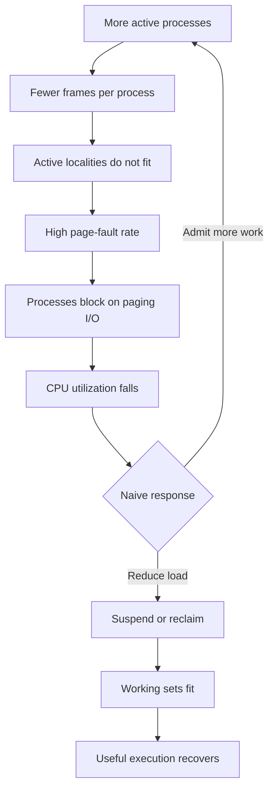
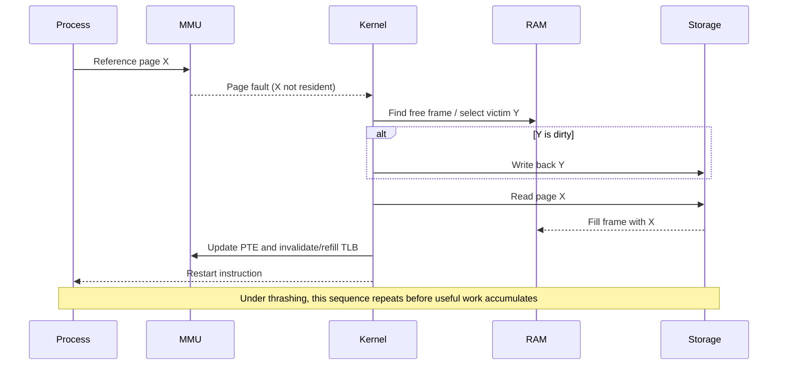

# Day 27 — Thrashing and Working Set

Difficulty: Advanced  
Fresh Learning: 40 minutes  
Revision: 5 minutes  
Prerequisites: Virtual memory, demand paging, page faults, page replacement algorithms  
Why this matters in interviews: Thrashing tests whether you can connect locality, memory pressure, replacement policy, CPU utilization, and system-wide performance instead of treating page faults as isolated events.

## Opening Intuition

Imagine a laptop with 8 GB of RAM running a browser with many tabs, an IDE, a video call, and two virtual machines. At first, opening another program merely makes the system a little slower. Then performance collapses: the disk stays busy, windows freeze, and even moving the pointer feels delayed. Curiously, CPU utilization may fall rather than rise.

The machine has not necessarily deadlocked or run out of valid virtual addresses. It may be spending most of its time moving pages between RAM and backing storage. A process gets a few frames, touches a page that is absent, waits for it to arrive, resumes, and immediately faults on another page that was just evicted. Useful execution becomes a small fraction of total work. This collapse is **thrashing**.

Thrashing exists because demand paging relies on locality. Virtual memory performs well when the actively used pages of running processes fit in physical memory. It performs badly when the system admits more active work than RAM can support. The working-set model gives the OS a way to estimate each process's current locality; page-fault frequency gives it a feedback signal. Together, they explain why “run more processes to keep the CPU busy” eventually becomes self-defeating.

## Interview Definition

Thrashing is a condition in which a system spends most of its time servicing page faults and moving pages between RAM and backing storage instead of executing useful instructions. It occurs when active processes do not have enough frames to hold their current localities. A working set approximates the pages a process has referenced within a recent window and therefore the frames it currently needs.

## Mental Model

Think of several cooks sharing a counter. Each cook needs a small group of tools for the current recipe. If every cook has enough counter space for that active group, work proceeds quickly. If management admits too many cooks, each gets only one or two slots. A cook retrieves a knife and removes someone else's pan; that cook retrieves the pan and removes the knife. The storeroom door stays busy while meals stop progressing.

The counter is RAM, the storeroom is backing storage, each tool is a page, and each cook's current recipe is its locality. A working set is the group of tools a cook has used recently. The lesson is not “keep every tool forever.” It is “keep the current recipe's tools resident.” Localities change over time, so allocation must adapt.

## Key Definitions

Thrashing: sustained excessive paging in which page-fault service dominates useful execution.

Working set: the set of distinct pages referenced by a process during a recent reference window.

Working-set window (Δ): the number of recent memory references, or an approximate time interval, used to define the working set.

Locality: a relatively stable phase in which execution repeatedly accesses a limited set of code and data pages.

Resident set: the pages of a process currently held in physical frames.

Page-fault frequency (PFF): the observed rate of page faults, used as feedback about whether a process has too few or more than enough frames.

Degree of multiprogramming: the number of processes actively competing for memory and CPU.

Local replacement: a process selects victims only from its own allocated frames.

Global replacement: a process may select a victim from the broader pool, potentially taking a frame from another process.

## Layer 1: What happens at a high level?

Programs do not access all their pages uniformly. A compiler may spend time parsing, then optimizing, then generating code. A browser renderer may execute JavaScript, lay out a page, and later decode an image. During each phase, a bounded cluster of pages is referenced repeatedly. This is temporal and spatial locality.

Demand paging exploits this behavior. The OS keeps the active cluster resident and leaves inactive pages on disk or in mapped files. Occasional faults are normal and useful: they avoid loading pages that might never be touched. Trouble starts when the sum of current localities is larger than available frames.

Suppose processes A, B, and C each need roughly 100 frames for their active phases, but only 220 frames are available. No replacement algorithm can manufacture the missing 80 frames. Every allocation is too small. Pages that will be needed again soon must be evicted, so faults cause more faults. This is a capacity failure, not merely a bad choice between FIFO and LRU.

The system can recover by freeing memory, reducing the active process count, suspending a process, reclaiming caches, compressing pages, or adding physical memory. Simply increasing multiprogramming usually worsens the condition.

## Layer 2: What happens inside the OS?

When the CPU references a nonresident page, hardware raises a page-fault exception. The kernel validates the address, finds or creates the page's backing data, obtains a free frame or selects a victim, performs any required write-back, loads the demanded page, updates the page table and TLB state, and restarts the instruction. While storage I/O is pending, the process blocks.

The scheduler sees a blocked process and runs another. Under ordinary load this overlaps I/O with useful CPU work. Under thrashing, that replacement process soon faults too. The ready queue shrinks while storage queues grow. A naive load controller may interpret low CPU utilization as insufficient multiprogramming and admit another process. That creates a destructive feedback loop:

1. Too many active processes divide frames too thinly.
2. Page faults rise because localities do not fit.
3. Processes block on paging I/O.
4. CPU utilization falls.
5. More work is admitted to raise CPU use.
6. Each process receives even fewer effective frames.
7. Page-fault latency and contention rise further.



The diagram shows why low CPU utilization can be a symptom of memory overload. The correct response may be to reduce runnable work, not add it.

## Layer 3: What happens at hardware or kernel level?

The MMU translates every virtual address using page tables and cached TLB entries. A present bit indicates whether a valid mapping currently has a resident physical frame. An access to a valid but nonresident mapping traps into the kernel. A TLB miss alone is not a page fault: a page-table walk can refill the TLB when the page remains resident.

Fault cost varies. A minor or soft fault may be satisfied from an existing in-memory page, such as a shared page or cached file page. A major or hard fault requires storage I/O and can cost millions of CPU cycles. Dirty anonymous victims may first require write-back to swap. Dirty file-backed pages may require filesystem write-back. Clean file-backed pages are often cheaper to discard because their data can be reread.

Replacement policies approximate recency through accessed/reference bits, aging counters, active and inactive lists, or Clock-like scans. Exact LRU would require updating ordered metadata on nearly every access, which is too expensive. The hardware reference bit supplies sampled evidence, not perfect future knowledge.

Thrashing also damages caches beyond the fault itself. Context switches and changing address spaces disturb TLB and CPU-cache locality. Storage requests queue behind one another. Dirty-page write-back competes with page-in traffic. On an HDD, seeks amplify the cost; on an SSD, latency is lower but still vastly slower than RAM, and heavy paging consumes bandwidth.

## Layer 4: What can go wrong?

The working-set window can be chosen badly. If Δ is too small, it misses part of the current locality and underestimates demand. If Δ is too large, it mixes old and current phases, overestimates demand, and keeps stale pages. There is no universal perfect window.

Global replacement can allow one fault-heavy process to steal frames from a healthy process, spreading instability. Local replacement isolates processes, but a process trapped with an insufficient allocation may thrash indefinitely even while another holds frames it does not need. Practical kernels combine priorities, reclaim classes, cgroup or job limits, minimum guarantees, and global pressure signals.

Average metrics can also conceal bursts. A process may have a modest fault rate over one minute but suffer repeated 500 ms stalls during interactive work. Monitoring must correlate fault type, storage activity, memory pressure, latency, and workload phase.

Finally, swapping is not the only explanation for a slow system. Lock contention, filesystem I/O, network stalls, CPU saturation, garbage collection, and thermal throttling can look similar. Diagnose from evidence.

## Step-by-Step Flow

1. A process enters a new execution phase and begins referencing a new locality.
2. Some required pages are absent, so initial page faults load them.
3. If enough frames are available, the locality becomes resident and the fault rate falls.
4. If the allocation is too small, loading one useful page evicts another page still in the locality.
5. The process resumes and soon references the recently evicted page.
6. Repeated major faults block the process and saturate storage or backing-store bandwidth.
7. Other processes compete for the same frames and I/O path.
8. Useful CPU utilization and throughput fall while response time rises.
9. The OS detects sustained pressure through reclaim activity, fault rate, working-set estimates, or pressure-stall signals.
10. It rebalances frames, trims caches, compresses memory, throttles or kills work, or suspends a process.
11. Once the remaining active working sets fit, fault rates fall and useful execution recovers.

## The Working-Set Model

Let the reference sequence be the pages touched by a process. For a window Δ, the working set at time *t*, written conceptually as **W(t, Δ)**, is the set of distinct pages referenced in the most recent Δ references.

If the last ten references are:

```text
2, 3, 2, 1, 5, 2, 4, 5, 2, 3
```

then for Δ = 5, the recent window is `2, 4, 5, 2, 3`, and the working set is `{2, 3, 4, 5}`. Its size is four frames. Repetition does not increase the size; distinct active pages matter.

For process *i*, let its demand be |Wᵢ|. The total demand is:

```text
D = Σ |Wᵢ|
```

If D is comfortably below the available frame count, all current working sets can reside. If D exceeds available frames, the OS should reduce multiprogramming or otherwise release memory. The formula is a model, not an oracle: real kernels approximate references and must account for shared pages, kernel memory, caches, pinned pages, and changing phases.



The sequence distinguishes the page-fault mechanism from thrashing. One fault is normal; sustained repetition caused by an undersized resident set is the pathological condition.

## Page-Fault Frequency Control

PFF uses feedback rather than explicitly retaining a set of recent page identities. The OS defines an acceptable fault-rate band:

- Above the upper threshold: the process probably has too few frames; allocate more if possible.
- Below the lower threshold: the process may hold surplus frames; reclaim some.
- Between thresholds: keep the allocation stable to avoid oscillation.

If a process exceeds the upper threshold and no frames are available, the system may suspend a process or reduce admitted work. PFF is simpler to reason about than exact working-set tracking, but it reacts after faults occur and thresholds depend on workload and storage cost.

Working set and PFF answer related questions. Working set estimates *which and how many pages are active*. PFF observes *whether the current allocation is succeeding*. A practical system can use both ideas indirectly.

## Local vs Global Replacement

| Property | Local replacement | Global replacement |
|---|---|---|
| Victim pool | Faulting process's frames | Frames across processes or a global pool |
| Isolation | Stronger | Weaker |
| Adaptability | Limited by fixed allocation | Can shift memory quickly |
| Failure mode | One process may thrash in isolation | One process can disrupt others |
| Predictability | Higher per process | Better aggregate flexibility |

Local replacement makes fault behavior more controllable: process A cannot directly evict process B's pages. Global replacement can improve utilization when B has spare frames, but under pressure it can create cascading faults. Modern systems rarely implement the textbook extremes without additional controls.

## Practical System Relevance

### Linux

Linux exposes useful evidence through `vmstat`, `/proc/meminfo`, `sar`, and pressure stall information. Rising major faults, sustained swap-in/swap-out, low available memory, high I/O wait, and memory-pressure stalls together are stronger evidence than a single “used memory” number. Linux also uses memory cgroups to account for and limit container workloads. Under severe pressure, reclaim may fail and an out-of-memory policy chooses a victim rather than permitting endless collapse.

### Windows

Windows manages per-process working sets and system page lists. Task Manager and Resource Monitor can show memory pressure, hard faults, commit use, and disk activity. A hard fault can read from a mapped file as well as the pagefile; it does not automatically mean “swap corruption.” Working-set trimming may reduce one process's residency so the system can satisfy broader demand.

### Android and browsers

Mobile devices often avoid unrestricted swap-style degradation by reclaiming caches, compressing memory, asking applications to trim memory, freezing background work, or killing lower-priority processes. Browsers similarly discard or suspend background tabs. Losing reconstructible state can be better than preserving every process while making the foreground unusable.

### Databases and servers

A database has its own buffer-pool locality while the OS manages process pages and page cache. Oversizing the database buffer pool can push the host into paging, turning predictable database I/O into competing layers of eviction. Server capacity planning therefore leaves headroom for the kernel, connections, query workspaces, and other processes.

### Cloud and containers

Containers share the host kernel and physical memory. A container limit does not create private RAM; it defines accounting and enforcement. A noisy workload can encounter heavy reclaim or an OOM kill at its cgroup boundary. Operators should examine both container-level and host-level pressure.

## Code or Pseudocode

Conceptual PFF controller:

```c
for each process p {
    rate = page_faults(p) / observation_interval;

    if (rate > HIGH_THRESHOLD) {
        if (free_frames_available())
            give_frame(p);
        else
            mark_for_load_reduction(p);
    } else if (rate < LOW_THRESHOLD && frames(p) > minimum_frames(p)) {
        reclaim_frame(p);
    }
}

if (total_working_set_demand() > available_frames())
    suspend_or_throttle_one_process();
```

This is deliberately simplified. Production kernels must prevent rapid give/take oscillation, distinguish costly faults from cheap ones, respect priorities and limits, and avoid reclaiming pinned or actively written pages.

## Practical Debugging / Observation

On Linux:

```bash
free -h
vmstat 1
cat /proc/meminfo
cat /proc/pressure/memory
pidstat -r 1
```

In `vmstat`, observe `si` and `so` for swap-in and swap-out, `r` and `b` for runnable and blocked work, and CPU `wa` for I/O wait. Do not diagnose thrashing from low `free` memory alone: Linux intentionally uses spare RAM for cache. Look for sustained paging plus stalls and poor throughput.

Run a controlled workload only on a disposable machine or VM. Compare response time before and after increasing memory demand. Avoid stress tests on production systems because they can trigger OOM termination and data loss.

On Windows, use Resource Monitor or Performance Monitor and correlate hard faults/sec, available memory, paging-file activity, disk latency, and process working sets. A brief burst while launching an application is normal; sustained high faults with severe latency is the concern.

## Common Misconceptions

1. **Any page fault means thrashing.** Page faults are fundamental to demand paging. Thrashing is a sustained rate that prevents useful progress.
2. **High RAM usage means thrashing.** Healthy systems use RAM for caches. Pressure, reclaim, major faults, stalls, and throughput matter more.
3. **Low CPU utilization means the machine needs more processes.** During thrashing, processes wait for paging I/O; more work can worsen the shortage.
4. **A better replacement algorithm always fixes thrashing.** Policy helps, but no algorithm can fit active demand that exceeds capacity.
5. **More virtual memory is equivalent to more RAM.** Backing storage expands addressable committed memory but does not provide RAM latency.
6. **Working set means every page allocated by a process.** It means recently active pages, not the entire virtual address space.
7. **Global replacement is always more efficient.** It adapts quickly but can spread one workload's pressure to others.
8. **SSD swap makes thrashing harmless.** SSDs reduce I/O latency but remain much slower than RAM and can become bandwidth-saturated.

## Tricky Interview Corners

### Why can CPU utilization fall during memory overload?

Faulting processes block while pages are fetched. If most active processes are blocked, the CPU has little useful work even though the system is overloaded.

### Can a process thrash under local replacement while freeable memory exists elsewhere?

Yes. Strict local replacement confines it to its allocation. Another process may retain underused frames unless a higher-level allocator rebalances them.

### Does a large working-set window always improve accuracy?

No. It may retain pages from an old phase and overestimate current need. A tiny window underestimates the locality. Δ balances noise against staleness.

### Why does increasing frames often help but not prove thrashing?

More frames can reduce faults by allowing the locality to fit, but the original slowdown could instead be ordinary file I/O, a leak, or lock contention. Evidence must show paging-driven stalls.

### Is thrashing possible without swap?

Yes. File-backed executable and mapped pages can be repeatedly discarded and reread. Systems may also spend excessive time reclaiming and refaulting cache pages. Swap is common but not required for the core phenomenon.

### Why can global replacement create cascading failure?

A faulting process takes a frame from another process. The victim process then faults and takes a frame elsewhere. Pressure propagates across resident sets.

## How to Explain This in an Interview

### 30-second answer

Thrashing happens when active processes have too few frames for their current localities, so they repeatedly fault and evict pages that will be needed again soon. The system spends more time paging than executing, storage activity rises, and CPU utilization may fall because processes are blocked. The OS can control it using working-set or page-fault-frequency ideas and by reducing multiprogramming.

### 2-minute answer

Demand paging works because programs exhibit locality: during a phase they repeatedly use a limited group of pages. That group is approximated by the working set, the distinct pages referenced in a recent window. If the sum of active working sets exceeds available frames, replacement becomes destructive. A demanded page displaces another page from the same active locality, so the process faults again shortly after resuming.

The kernel observes high fault and reclaim activity. PFF can add frames when a process exceeds an upper fault threshold and reclaim frames below a lower threshold. If no frames are available, it must reduce active demand by suspending, throttling, or terminating work. Local replacement gives isolation; global replacement adapts allocations but can spread interference.

### Deeper follow-up answer

I would distinguish TLB misses, soft faults, and major faults, then correlate paging with latency and throughput. I would also mention that exact working-set and LRU tracking are expensive, so real kernels use sampled reference information, reclaim lists, working-set approximations, pressure metrics, and workload controls. On containers, host and cgroup pressure must both be checked.

## Interview Questions

### Basic Questions

1. What is thrashing?
2. Why can CPU utilization decrease during thrashing?
3. What is a working set?
4. What is locality of reference?
5. How is a page fault different from thrashing?

### Intermediate Questions

6. How does the size of Δ affect a working-set estimate?
7. How does page-fault-frequency control allocate frames?
8. Compare local and global replacement.
9. Why can increasing multiprogramming reduce throughput?
10. What measurements would you use to diagnose thrashing?

### Advanced Questions

11. Why cannot an optimal replacement policy solve insufficient physical capacity?
12. How can global replacement spread memory pressure?
13. Can a no-swap system thrash?
14. How do container memory limits affect reclaim and OOM behavior?
15. Why might a database buffer pool create host-level memory pressure?

## Follow-Up Questions

Q: What is thrashing?  
Follow-ups:
- Is one major page fault thrashing?
- Can SSD-backed paging still thrash?
- What happens to response time and throughput?

Q: What is a working set?  
Follow-ups:
- Does it contain duplicate references?
- What happens if Δ is too large or too small?
- Is the resident set always equal to the working set?

Q: How would you control thrashing?  
Follow-ups:
- When should a process receive another frame?
- What if no free frame exists?
- Why might suspending work improve total throughput?

Q: Compare local and global replacement.  
Follow-ups:
- Which provides stronger isolation?
- Which adapts faster to phase changes?
- How can global replacement cause cascading faults?

Q: How would you diagnose it?  
Follow-ups:
- Why is low free memory insufficient evidence?
- Which faults require storage I/O?
- What Linux or Windows counters would you correlate?

## Trick Questions

Q: If CPU utilization is low, should the OS always admit another process?  
Expected answer: No. Low CPU use may occur because processes are blocked on paging I/O; another process can worsen thrashing.

Q: Is every page fault evidence of insufficient RAM?  
Expected answer: No. Demand paging, copy-on-write, and mapped-file access can cause normal faults. Sustained costly faults and poor progress indicate pressure.

Q: If a process owns 1 GB of virtual memory, is its working set 1 GB?  
Expected answer: No. Its working set contains pages referenced in the recent window; much of its virtual space may be inactive or nonresident.

Q: Does an SSD eliminate thrashing?  
Expected answer: No. It reduces storage latency but is still far slower than RAM and can saturate under repeated page traffic.

Q: Is a TLB miss a page fault?  
Expected answer: No. The translation may be absent from the TLB while the page remains resident and present in the page table.

Q: Can global replacement make a healthy process start faulting?  
Expected answer: Yes. Another process can take its frames, shrinking its resident set below its locality.

Q: Can removing a process increase total throughput?  
Expected answer: Yes. If the remaining working sets then fit in RAM, the reduction in paging can outweigh the lost parallelism.

## Mini Quiz

### MCQs

1. Thrashing primarily means:  
   A. High CPU arithmetic load  
   B. Excessive paging with little useful progress  
   C. A deadlocked disk driver  
   D. A full TLB

2. W(t, Δ) contains:  
   A. All pages in the virtual address space  
   B. All dirty pages  
   C. Distinct pages referenced in the recent window  
   D. Only executable pages

3. If Δ is much too large, the working set may:  
   A. Include stale localities  
   B. Become a TLB  
   C. Eliminate page faults  
   D. Contain only one page

4. Under global replacement, a victim may belong to:  
   A. Only the kernel  
   B. Only the faulting process  
   C. Another process  
   D. No resident set

5. A high PFF suggests that a process may need:  
   A. Fewer frames  
   B. More frames or load reduction  
   C. A smaller virtual address  
   D. More CPU registers

### Short-answer Questions

6. Why can a page repeatedly leave and re-enter RAM during thrashing?
7. State one benefit and one risk of global replacement.
8. Why is “used RAM” alone a weak diagnostic signal?

### Reasoning Questions

9. Four active processes each need about 80 frames for their current locality, but only 250 frames are available. Explain the likely behavior and a sensible response.
10. A server shows low CPU, high disk latency, sustained swap traffic, and many blocked processes. Explain why adding worker processes is risky.

### Answers

1. B  
2. C  
3. A  
4. C  
5. B  
6. Its allocation cannot hold the active locality, so loading one needed page evicts another page that will soon be referenced.  
7. Benefit: memory shifts toward current demand. Risk: one process can steal frames and destabilize others.  
8. Healthy systems use spare RAM for caches; paging rate, pressure stalls, fault cost, and throughput reveal whether usage is harmful.  
9. Total demand is about 320 frames, exceeding capacity by 70. Replacement will repeatedly remove active pages. Reduce active work or suspend a process so remaining working sets fit.  
10. The workers may be blocked on paging rather than lacking parallelism. More workers increase memory demand, faults, and I/O contention.

# 5-Minute Revision Column

Revision targets: Day 26 — Page Replacement Algorithms (R1); Day 24 — Segmentation (R2).

## Day 26 — Page Replacement Algorithms (R1 Recall Revision)

Page replacement is invoked when a demanded page is absent and no free frame exists. The OS chooses a victim, writes it back if dirty, invalidates its old mapping, loads the demanded page, updates translation state, and restarts the faulting instruction.

- **FIFO** evicts the oldest resident page. It is simple but can suffer Belady's anomaly.
- **Optimal** evicts the page whose next use is farthest in the future. It is a benchmark because the future is unknown.
- **LRU** evicts the least recently used page, relying on locality. Exact LRU is expensive.
- **Clock** approximates recency with a reference bit and a circular scan.

Key definitions:

- Page fault: an exception raised when an access cannot complete with the current translation, often because a valid page is nonresident.
- Victim page: the resident page selected for eviction.
- Dirty page: a modified page that may require write-back before its frame is reused.

Concrete example: with a full three-frame allocation, a reference to absent page 7 requires selecting a victim. Evicting a clean file-backed page is usually cheaper than evicting a dirty anonymous page.

Practical use: Linux and Windows use richer policies than pure textbook algorithms, but accessed bits, recency approximations, dirty state, and reclaim cost remain central.

Pitfalls:

- A fault does not always require replacement; a free frame may exist.
- A TLB miss is not a page fault.
- More frames do not always reduce FIFO faults because Belady's anomaly is possible.

Quick checks:

1. Why is Optimal not implementable online?
2. Why is a dirty victim more expensive than a clean victim?

## Day 24 — Segmentation (R2 Compression Revision)

- Segmentation divides a process into logical, variable-sized regions such as code, data, heap, and stack.
- A logical address is `(segment number, offset)`.
- The segment table stores a base, limit, permissions, and validity information.
- Hardware checks `offset < limit`, verifies permissions, and computes `base + offset`.
- Segmentation naturally supports logical protection and sharing but suffers external fragmentation.

Definitions:

- Segment: a variable-sized logical memory region.
- Limit: the legal size or maximum offset range of a segment.

Example: code may be read/execute, while stack is read/write and non-executable. Different segment metadata expresses those distinct purposes.

Traps:

- A modern “segmentation fault” does not prove the machine uses pure segmentation.
- Paging uses fixed-size pages and frames; segmentation uses variable-sized logical regions.

Quick checks:

1. Why does segmentation suffer external rather than internal fragmentation?
2. Can two processes share physical memory through different segment numbers?

Mental link: segmentation describes meaningful rooms; paging divides storage into equal tiles. Modern systems preserve region-like meanings while using paging for translation.

## Final Takeaway

Thrashing is a system-level performance collapse caused when active localities do not fit in available frames. Repeated page faults make processes wait for storage, reduce useful CPU work, and can trigger a harmful attempt to admit even more work. The working-set model estimates recent active pages, while PFF measures whether an allocation is succeeding. Local replacement favors isolation; global replacement favors adaptability but can spread pressure. The decisive remedy is often to reduce active memory demand so remaining working sets fit—not merely to choose a cleverer victim.

## What You Should Be Able To Answer Now

- Define thrashing and distinguish it from an ordinary page fault.
- Explain why CPU utilization can fall under memory pressure.
- Compute a working set from a recent reference window.
- Explain the effect of choosing Δ too small or too large.
- Compare working-set and PFF control.
- Compare local and global replacement.
- Diagnose paging-driven stalls using correlated system evidence.
- Explain why reducing multiprogramming can increase throughput.
