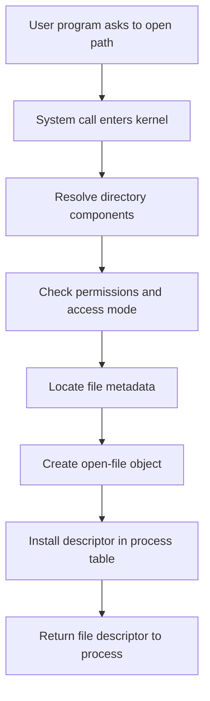
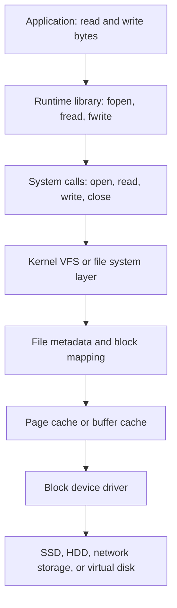
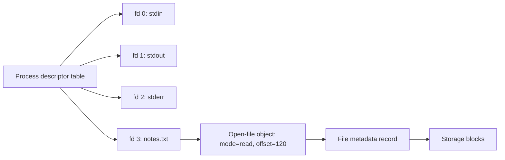

# Day 28 - File System Basics

Difficulty: Beginner  
Fresh Learning: 40 minutes  
Revision: 5 minutes  
Prerequisites: Days 01-05: OS basics, processes, address spaces, kernel services  
Why this topic matters in interviews: File systems are where OS abstraction becomes visible. Interviewers use file questions to test whether you understand persistence, naming, metadata, system calls, kernel objects, and the difference between a friendly path like `notes.txt` and the real storage work behind it.

## Opening Intuition

Imagine you are editing a resume in VS Code. You press Save, close the laptop, restart the machine, and the file is still there. That simple expectation hides several OS responsibilities: naming the file, locating it later, checking permissions, storing bytes on a device, caching data, tracking metadata, and giving your program a small handle through which it can keep reading or writing.

Without a file system, storage would look like a giant numbered array of blocks. A program would need to remember exactly which disk blocks contained its data, avoid overwriting other programs, rebuild names after every boot, and understand the details of every storage device. That would be fragile and unsafe. The file system solves this by turning persistent storage into meaningful objects: files, directories, attributes, permissions, and operations such as open, read, write, seek, close, rename, and delete.

You see file system basics every day: opening downloads, renaming folders, deleting screenshots, attaching PDFs to email, installing software, running programs, and watching applications complain that a file is "in use." At interview level, the important point is not just "a file stores data." The important point is that a file is an OS-managed abstraction over persistent storage, and the kernel mediates access through metadata and file handles.

## Interview Definition

A file system is the operating system component that organizes persistent storage into files and directories, tracks metadata such as size, ownership, permissions, and timestamps, and provides controlled operations like open, read, write, seek, close, rename, and delete. It lets applications use stable names and byte streams instead of directly managing raw disk blocks. The kernel enforces file access rules and returns file descriptors or handles so programs can perform later I/O efficiently.

## Mental Model

Think of a file system as a library plus a checkout desk.

The shelves are the storage device. The books are files. The catalog is the directory structure that maps human-friendly names to internal records. The book record contains metadata: title, owner, location, size, permissions, and status. The checkout desk is the kernel. A reader cannot walk into the storage room and rearrange shelves directly. The reader asks the desk to open a book. If access is allowed, the desk gives a checkout slip. That slip is like a file descriptor: it is not the book itself, but it lets the reader continue reading, writing, or closing that open file.

This model separates three ideas interviewers often test:

- Path name: how the user identifies the file.
- File metadata: what the OS knows about the file.
- Open file descriptor or handle: the per-process object used for ongoing I/O.

## Layer 1: What happens at a high level?

At the highest level, a file system gives programs a stable way to store and retrieve bytes.

A program normally does not say, "write these bytes to disk sector 8,932,211." It says, "open `report.pdf`, write these bytes, and close it." The OS and file system decide where the data lives, how directory names map to internal file records, which blocks are allocated, and when cached data is flushed to the storage device.

The file abstraction has three major jobs.

First, it provides naming. A file path like `C:\Users\Harsh\notes.txt` or `/home/harsh/notes.txt` is a name that can survive program termination and system reboot. Names are organized inside directories so humans and programs can find data again.

Second, it provides persistence. Process memory disappears when a process exits, but file data is intended to remain until it is deleted or the storage device fails. Persistence is the major difference between normal process memory and files.

Third, it provides controlled sharing. Many programs can refer to the same file by name. The OS can enforce permissions, locks, append behavior, and access modes. This is why file systems are both a storage abstraction and a protection mechanism.

## Layer 2: What happens inside the OS?

When a process opens a file, the request crosses from user mode into kernel mode through a system call such as `open`, `CreateFile`, or a higher-level runtime wrapper. The kernel then performs path resolution, permission checks, metadata lookup, and open-file table setup.

Path resolution means walking through each directory component. For `/home/harsh/os/day28.md`, the kernel must find `/`, then `home`, then `harsh`, then `os`, then `day28.md`. Each directory is itself a structured object that maps names to file-system records. On Unix-like systems, a directory entry often maps a name to an inode number. On Windows, the exact internal structure is different, but the same conceptual job exists: map names to file records.

Permission checks decide whether the process may perform the requested operation. Reading, writing, executing, appending, deleting, or traversing directories can have separate rules. The kernel considers the process identity, requested access mode, file permissions, and sometimes mount options, access control lists, or security labels.

After a successful open, the kernel creates an open-file object and returns a small identifier to the process. On Unix-like systems this identifier is a file descriptor, usually an integer such as 3, 4, or 5. On Windows it is usually called a handle. The process uses this descriptor or handle in later read, write, seek, and close calls. The descriptor is process-local, so descriptor 3 in one process is not automatically the same open file as descriptor 3 in another process.

## Layer 3: What happens at hardware or kernel level?

At the kernel/storage level, file I/O eventually becomes block I/O. Storage devices commonly read and write fixed-size units such as sectors or blocks, while applications prefer byte-oriented operations. The file system bridges that difference.

If a program writes 20 bytes into the middle of a file, the OS may need to find the storage block containing that byte range, read or modify a cached block, mark it dirty, and later flush it. Modern operating systems use a page cache or file cache so repeated reads do not always hit the physical device. This is why reading a file the second time can be much faster.

The file system must track which storage blocks belong to which file. Different file systems use different allocation structures, such as extents, block maps, FAT-style linked tables, or inode pointer trees. Day 29 and Day 30 go deeper into allocation and inodes. For Day 28, the key interview idea is enough: a file name is not the storage location. A name leads to metadata, metadata leads to storage mapping, and storage mapping leads to blocks.

Hardware also affects behavior. HDDs have seek time and rotational latency. SSDs have flash pages, erase blocks, wear leveling, and controller behavior. The OS hides these details from most applications, but performance still depends on access pattern. Sequential reads are usually easier to optimize than random tiny writes.

## Layer 4: What can go wrong?

Many file system bugs and interview traps come from forgetting that file I/O is shared, cached, and stateful.

A file may exist when you check and disappear before you open it because another process changed the directory. Permissions may allow reading but not writing. A write may return before data is physically durable because it is sitting in cache. A program may delete a file name while another process still holds an open descriptor. Disk space may run out after a file has already been opened. Two processes may write to the same file in an unsafe order. A path may point through symbolic links or mount points, so the apparent name is not the full story.

The OS tries to provide clear semantics, but different file systems and operating systems make different guarantees. This is why robust software checks return values, closes descriptors, handles partial reads and writes, uses atomic rename patterns when needed, and calls `fsync` or equivalent when durability matters.

## Step-by-Step Flow

Here is a practical flow for opening and reading a file:

1. A user program calls a library function such as `fopen("notes.txt", "r")`.
2. The C library prepares a system call such as `open`.
3. The CPU enters kernel mode through the system-call mechanism.
4. The kernel resolves the path component by component.
5. The kernel checks whether the process has permission to read the file.
6. The file system locates the file metadata record.
7. The kernel creates an open-file object with access mode and current offset.
8. The kernel installs a file descriptor in the process descriptor table.
9. The kernel returns the descriptor to the process.
10. The process calls `read(fd, buffer, size)`.
11. The kernel checks the open-file object, finds the requested byte range, and consults the file cache.
12. If data is cached, bytes are copied to the user buffer; if not, block I/O is issued and then copied.
13. The file offset advances for normal sequential reads.
14. The process calls `close(fd)` when done, allowing the kernel to release that descriptor.

## Diagram Section

### Diagram 1: Path to File Descriptor



This diagram shows why a file descriptor is not just the path string. The path is used to find and authorize the file. After that, the process mostly works through the descriptor.

### Diagram 2: File System Abstraction Stack



The file system sits between friendly application operations and lower-level storage mechanics. The exact layers vary by OS, but the abstraction direction is the same.

### Diagram 3: Descriptor Table and Open File Object



The descriptor table is per process. The open-file object stores state such as the current offset and mode. The metadata record points toward the actual stored content.

## Practical System Relevance

In Linux, file descriptors are central. Standard input, output, and error are descriptors 0, 1, and 2. When a shell runs `cat notes.txt`, the program receives a descriptor for the opened file and reads bytes through kernel system calls. Linux also exposes many things as file-like objects: pipes, sockets, devices, and entries under `/proc`.

In Windows, the kernel exposes file handles rather than Unix-style integer descriptors at the lowest level. The Win32 API function `CreateFile` can open normal files, devices, pipes, and other objects. The conceptual pattern is similar: request access, receive a handle, use it for I/O, then close it.

In Android, application sandboxing depends heavily on file permissions and per-app storage locations. Apps do not normally get arbitrary access to each other's private files. Media files, app data, shared storage, and content providers all build on controlled storage access.

In browsers, downloads, cache files, cookies, IndexedDB, profile data, and extension storage all depend on file system behavior. Browser security depends on ensuring a web page cannot freely read arbitrary local files just because the browser process itself can access the disk.

In databases, files are not just passive storage. Databases manage large files, logs, checkpoints, and sometimes memory-mapped regions. They care about durability and ordering, so they use careful write-ahead logging and sync operations. A database cannot simply assume that a successful write call means the data is permanently safe on the device.

In cloud and container systems, the file system abstraction may point to local disks, virtual disks, overlay file systems, network volumes, or object-storage-backed mounts. Containers often see their own root file system view even though the host kernel still manages the real storage underneath.

## Code or Pseudocode Section

### Minimal C-style file flow

```c
int fd = open("notes.txt", O_RDONLY);
if (fd < 0) {
    // handle error: missing file, permission denied, too many open files, etc.
}

char buffer[128];
ssize_t n = read(fd, buffer, sizeof(buffer));
if (n < 0) {
    // handle read error
}

close(fd);
```

This demonstrates the descriptor-based model. `open` returns a small process-local integer. Later `read` and `close` calls use that integer rather than repeating the path lookup.

### Safer write pattern with temporary file and rename

```c
write(temp_fd, new_contents, length);
fsync(temp_fd);
close(temp_fd);
rename("settings.tmp", "settings.json");
```

This pattern is common when software wants to avoid leaving a half-written configuration file. The idea is to write a complete new file, force important data toward durable storage, then atomically replace the old name with the new one. Exact guarantees depend on the OS and file system, but the pattern is much safer than overwriting the original file byte by byte.

### Useful shell observations

```bash
ls -l notes.txt
stat notes.txt
lsof notes.txt
df -h
du -sh .
```

`ls -l` shows permissions, owner, size, and timestamp. `stat` shows richer metadata. `lsof` can show which processes have a file open. `df -h` shows file system capacity. `du -sh .` estimates space used by a directory tree.

## Key Definitions

- File: A named OS abstraction for persistent data, usually treated as a sequence of bytes plus metadata.
- Directory: A file-system object that maps names to other file-system objects such as files and subdirectories.
- Metadata: Information about a file other than its user data, such as size, owner, permissions, timestamps, and block mapping information.
- File attribute: A specific metadata field such as read-only status, hidden flag, executable permission, or creation time.
- File descriptor: A small process-local integer used on Unix-like systems to refer to an open file or file-like object.
- File handle: A general OS-managed reference to an open object, commonly used in Windows terminology.
- Path: A string naming a file or directory by walking through directory components.
- File offset: The current position used by many sequential read and write operations on an open file.

## Common Misconceptions

- Misconception: A file name is the file.  
  Correction: A name is a directory entry that helps find a file-system object. The file's metadata and data can outlive or change independently of one particular path in some systems.

- Misconception: A file descriptor stores the file's contents.  
  Correction: A descriptor is only a process-local reference to an open-file object. The actual data remains in storage or cache.

- Misconception: Closing a file is optional because the OS will clean it up.  
  Correction: The OS usually releases descriptors when a process exits, but long-running programs can leak descriptors, delay flushes, and hit open-file limits.

- Misconception: `write` always means the bytes are permanently on disk.  
  Correction: A successful write may only mean the kernel accepted the data, possibly into cache. Durability may require `fsync`, `fdatasync`, or platform-specific equivalents.

- Misconception: Directories are just visual folders.  
  Correction: Directories are part of the file system's naming structure. They are represented and protected by OS-managed metadata.

- Misconception: If two processes use descriptor 3, they must refer to the same file.  
  Correction: File descriptors are process-local. Descriptor number 3 in two different processes can refer to completely different open objects.

## Tricky Interview Corners

### Open file after deletion

On Unix-like systems, deleting a file name with `rm` removes a directory entry. If a process already has the file open, the storage may remain until the last descriptor is closed. This is why disk space sometimes does not immediately return after deleting a large log file that a running process still holds open.

### Path check race

The pattern "check if file exists, then open it" can be unsafe. Another process can change the file between the check and the open. Robust programs prefer atomic open modes such as create-if-not-exists where available.

### Partial reads and writes

System calls can transfer fewer bytes than requested. This is especially common with pipes, sockets, terminals, signals, and non-blocking I/O, but robust file code should still treat return values carefully.

### Append mode

Append mode is not just "seek to end once." Many systems provide atomic append semantics for each write, which matters when multiple processes write logs.

### File cache confusion

High memory use does not necessarily mean a memory leak. OS kernels often use spare RAM to cache file data. That cache can often be reclaimed under memory pressure.

### Metadata updates

Renaming, permission changes, timestamp updates, and directory updates are metadata operations. A workload can be metadata-heavy even when it writes little user data.

## Comparison Tables

### File vs Directory

| Aspect | File | Directory |
|---|---|---|
| Main role | Stores user/application data | Maps names to file-system objects |
| User view | Document, executable, image, log | Folder/path component |
| Kernel view | Metadata plus data block mapping | Metadata plus name-to-object entries |
| Common operations | read, write, seek, truncate | lookup, create entry, remove entry, list |

### Path vs File Descriptor

| Aspect | Path | File descriptor |
|---|---|---|
| What it is | Name used to locate an object | Process-local reference to an open object |
| Example | `/tmp/a.txt` | `3` |
| Used during | Lookup/open | Read/write/close after open |
| Can become stale? | Yes, names can change | Descriptor remains tied to the open object |

### File Data vs Metadata

| Aspect | File data | Metadata |
|---|---|---|
| Meaning | Bytes the application cares about | Information about the file |
| Examples | Text, image bytes, database pages | Size, owner, mode, timestamps, block pointers |
| Updated by | write, truncate | chmod, rename, write size growth, timestamp changes |
| Interview trap | Not all writes are metadata-light | Metadata can dominate performance |

## How to Explain This in an Interview

### 30-second answer

A file system is the OS layer that organizes persistent storage into named files and directories. It tracks metadata such as size, permissions, and timestamps, maps file contents to storage blocks, and exposes operations like open, read, write, and close. Programs usually work through file descriptors or handles instead of directly controlling disk blocks.

### 2-minute answer

The file system solves the problem of turning raw persistent storage into safe, named, shareable objects. A path like `/home/user/a.txt` is resolved through directories. The kernel checks permissions, locates metadata, creates an open-file object, and returns a descriptor or handle. Reads and writes then use that open object, whose state can include access mode and current offset. Internally, the file system maps byte ranges to storage blocks and may use caches to improve performance. This abstraction lets programs ignore device details while the OS preserves protection, sharing, and persistence.

### Deeper follow-up answer

The subtle part is that file-system operations are not only data movement. They involve naming, metadata, caching, consistency, and concurrency. A successful write may not be durable yet. A deleted name may not free data while a process has the file open. Two processes may have separate descriptors pointing to the same file or different files. Directories are not just UI folders; they are OS-managed name maps. Good interview answers separate path names, metadata records, open-file objects, file descriptors, cache, and physical storage.

## Interview Questions

### Basic Questions

1. What is a file system?
2. What is a file?
3. What is a directory?
4. What is file metadata?
5. What is the difference between a path and a file descriptor?

### Intermediate Questions

6. What happens when a process opens a file?
7. Why does the OS return a file descriptor or handle?
8. Why is a file descriptor process-local?
9. What is the role of the file offset?
10. Why might a successful write not mean data is physically durable?

### Advanced Questions

11. What can happen if a file is deleted while another process has it open?
12. Why is check-then-open a race-prone pattern?
13. How does file caching improve performance?
14. Why can metadata-heavy workloads be slow?
15. How do file systems support both abstraction and protection?

## Follow-Up Questions

Q: What is a file descriptor?  
Follow-ups:
- Is the descriptor number globally unique?
- What happens to descriptors after `fork`?
- Why should long-running programs close descriptors?
- Can a socket also have a descriptor?

Q: What happens during `open`?  
Follow-ups:
- What is path resolution?
- When are permissions checked?
- What kernel state is created?
- Why is opening by path more expensive than using an existing descriptor?

Q: What is metadata?  
Follow-ups:
- Is file size data or metadata?
- Are permissions metadata?
- Why can metadata updates affect performance?
- How does metadata help protection?

Q: Why do file systems use caching?  
Follow-ups:
- What is the difference between cache and durable storage?
- Why can the second read be faster?
- What does `fsync` try to do?
- Can caching make debugging harder?

Q: Why are directories important?  
Follow-ups:
- Are directories only UI folders?
- What does a directory map?
- What happens during path traversal?
- Why do directory permissions matter?

## Trick Questions

Q: If `write` returns success, is the data definitely safe after a power loss?  
Expected answer: Not necessarily. The kernel may have accepted the bytes into cache. Durability may require sync operations and depends on file-system and device behavior.

Q: If two processes both have file descriptor 3, are they using the same file?  
Expected answer: Not necessarily. Descriptor numbers are process-local.

Q: If a file is deleted, must its storage be freed immediately?  
Expected answer: Not always. On Unix-like systems, data may remain while open descriptors still reference it.

Q: Is a directory just a visual folder shown by the file manager?  
Expected answer: No. It is a file-system object that maps names to other objects and has metadata and permissions.

Q: Does a file path directly contain the disk block addresses?  
Expected answer: No. The path is resolved through directories to metadata, and metadata or allocation structures lead to blocks.

Q: Is a file descriptor the same thing as a file name?  
Expected answer: No. A file name is used for lookup. A descriptor is returned after a successful open and refers to an open object.

Q: Can reading a file affect metadata?  
Expected answer: Sometimes. Some systems update access time metadata, although many optimize or disable frequent atime updates.

## Practical Debugging / Observation

Use these commands to connect theory to system behavior:

```bash
pwd
ls -la
stat filename
df -h
du -sh directory
lsof filename
```

Observe the difference between directory listing and detailed metadata. `ls -la` shows names, permissions, owners, sizes, and timestamps. `stat` gives a more direct metadata view. `df -h` reports free space by mounted file system, while `du -sh` reports approximate usage under a directory. If available, `lsof filename` shows processes holding a file open, which is useful when a file cannot be deleted, moved, or unmounted cleanly.

On Linux, you can also inspect descriptors for a running process:

```bash
ls -l /proc/<pid>/fd
```

This directory shows the process's open descriptors as links. It makes the descriptor-table idea concrete: descriptor numbers point to open files, pipes, sockets, devices, or other file-like objects.

## Mini Quiz

### MCQs

1. What does a file system primarily abstract?
   - A. CPU scheduling
   - B. Persistent storage organization
   - C. Network routing only
   - D. Compiler optimization

2. What is a file descriptor?
   - A. A process-local reference to an open file-like object
   - B. The full contents of a file
   - C. A disk sector number
   - D. A directory path string

3. Which item is metadata?
   - A. The text inside a document
   - B. The image pixels in a PNG
   - C. File permissions
   - D. A database row stored in the file

4. What usually happens during path resolution?
   - A. The CPU skips kernel mode
   - B. The OS walks directory components
   - C. The file is copied to every process
   - D. The descriptor number is written into the path

5. Why does a file cache help?
   - A. It avoids all permission checks forever
   - B. It can satisfy repeated reads from memory
   - C. It makes storage persistent without disks
   - D. It removes the need for directories

### Short-answer questions

1. Explain the difference between a path and a file descriptor.
2. Name three common pieces of file metadata.
3. Why should programs close files they open?

### Reasoning questions

1. A log file is deleted, but disk space does not return. Give a likely OS-level explanation.
2. A program writes a config file and crashes. On restart, the config is half-written. What safer write pattern could reduce this risk?

### Answers

1. B
2. A
3. C
4. B
5. B

Short answers:

1. A path is a name used to locate a file-system object. A descriptor is a process-local reference returned after opening an object.
2. Size, owner, permissions, timestamps, block mapping, type, link count, and attributes are common examples.
3. Closing releases process descriptor slots, lets the kernel clean up open-file state, and may help complete buffered writes.

Reasoning answers:

1. On Unix-like systems, another process may still hold the file open. The name is gone, but the storage may remain until the last descriptor closes.
2. Write the new content to a temporary file, sync it if durability matters, close it, and atomically rename it over the old file.

# 5-Minute Revision Column

Revision targets from prepare: Day 27 - Thrashing and Working Set (R1), Day 25 - Virtual Memory (R2).

## Day 27 - Thrashing and Working Set (R1 Recall Revision)

- Core recall: Thrashing happens when active processes do not have enough physical frames for their current localities, so the system spends most of its time handling page faults and moving pages instead of executing useful instructions.
- Key definitions: Thrashing is sustained excessive paging; working set is the set of pages referenced in a recent window; page-fault frequency is feedback about whether a process has too few or more than enough frames.
- Mental model: RAM is a shared workbench. If every worker's current tools fit, work moves. If too many workers share too little space, they keep fetching and evicting tools.
- Common traps: A normal page fault is not automatically thrashing. High RAM usage is not automatically bad because the OS may be using memory for cache.
- Interview recall: Low CPU utilization can mean the machine needs fewer active processes, not more, because processes may be blocked on paging I/O.
- Quick question: Can removing a process increase total throughput? Yes, if the remaining working sets then fit in memory.

## Day 25 - Virtual Memory (R2 Compression Revision)

- Virtual memory gives each process a private virtual address space while the MMU and page tables translate virtual pages to physical frames.
- Demand paging loads pages only when touched; lazy loading improves startup and memory use.
- A page fault is a trap, not always a crash. If the page is valid but not resident, the OS can load it and restart the instruction.
- Key definitions: swap space stores nonresident pages; valid-invalid bits help distinguish legal mappings from illegal accesses.
- Common traps: TLB miss and page fault are different. Reserving virtual memory does not necessarily consume the same amount of RAM.
- Quick question: Can two processes use the same virtual address for different physical frames? Yes, that is normal process isolation.

## Final Takeaway

File systems turn raw persistent storage into named, protected, reusable objects. The OS gives programs files and directories instead of forcing them to manage device blocks directly. Opening a file is a kernel-mediated process involving path lookup, permission checks, metadata lookup, and creation of an open-file object. File descriptors or handles are process-local references used for later I/O. The most important interview distinction is between path names, metadata, open-file state, cached data, and physical storage. Strong answers explain both the friendly abstraction and the kernel work hidden below it.

## What You Should Be Able To Answer Now

- Define a file system in interview-friendly language.
- Explain why files and directories are OS abstractions over persistent storage.
- Describe what happens when a process opens and reads a file.
- Distinguish path names, metadata, file descriptors, and file contents.
- Explain why a successful write may not equal durable storage.
- Identify common file-system metadata fields.
- Discuss why file caching improves performance.
- Answer trick questions about deletion, descriptors, directories, and partial durability.
