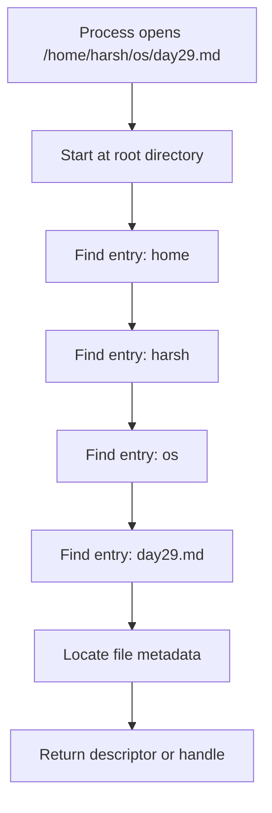
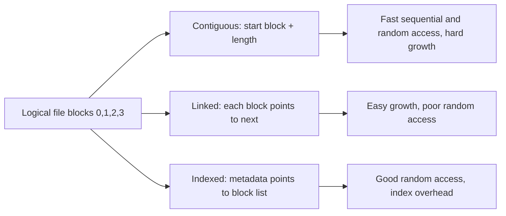
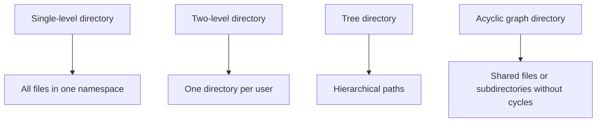

# Day 29 - Directory Structures and File Allocation

Difficulty: Intermediate  
Fresh Learning: 40 minutes  
Revision: 5 minutes  
Prerequisites: Day 28 - File System Basics  
Why this topic matters in interviews: Directory structure and allocation questions test whether you understand how a file name becomes stored data, why large files need metadata structures, and why different file systems make different performance tradeoffs.

## Opening Intuition

Imagine you save a movie project on your laptop:

```txt
C:\Users\You\Videos\projects\final-cut.mp4
```

or on Linux:

```txt
/home/you/videos/projects/final-cut.mp4
```

That path looks like a simple human-readable name. But the disk does not store a file as a sentence. Storage devices store blocks. A file system has to answer two practical questions every time a program opens a file:

1. How do we find the file's metadata from its path?
2. Once we find the file, how do we find the blocks that contain its data?

Directory structures solve the first problem. File allocation methods solve the second problem.

Without directories, a storage device would become one giant list of names. Two users could not naturally organize their files, duplicate names would be difficult to manage, and lookup would become painful as the number of files grows. Without allocation structures, the file system would not know which disk blocks belong to a file, in what order they should be read, and how the file should grow.

This is why file systems are not just "where files are stored." They are naming systems plus metadata systems plus block-mapping systems. When an interviewer asks about directory structures or allocation, they are really asking whether you can connect a high-level path like `notes/os/day29.txt` to the low-level reality of directories, metadata, and storage blocks.

## Interview Definition

A directory structure is the organization used by a file system to map names to files and subdirectories. It defines how paths are resolved, how users organize files, and how name conflicts are handled.

File allocation is the method used by a file system to map a file's logical byte sequence to physical storage blocks. Common methods include contiguous allocation, linked allocation, and indexed allocation.

In interviews, say this clearly: directories answer "where is this file by name?" while allocation answers "where are this file's data blocks?"

## Key Definitions

Directory structure: The organization a file system uses to arrange files and directories into a namespace.

Directory entry: A record inside a directory that maps a name to a file-system object or metadata identifier.

Path: A sequence of directory names and a final object name used to locate a file-system object.

Absolute path: A path resolved from the file-system root.

Relative path: A path resolved from the process's current working directory.

Contiguous allocation: A file allocation method where a file occupies consecutive storage blocks.

Linked allocation: A file allocation method where a file's blocks are connected as a chain.

Indexed allocation: A file allocation method where metadata or index blocks store pointers from logical file blocks to physical storage blocks.

External fragmentation: A condition where total free space exists, but it is split into small non-contiguous regions.

## Mental Model

Think of a file system as a city.

Directories are the street address system. They let you say `sector 4 / building B / room 302` instead of describing a physical coordinate every time. A path is a route through named directories.

File allocation is the warehouse inventory system. Once you reach the file's record, the file system still needs to know where its contents are stored. A small file might fit in one shelf area. A large file might be spread across many shelves. The allocation method is the rule that tells the file system how to list, follow, or index those shelves.

This model separates two ideas that learners often mix:

- A directory entry usually points to file metadata, not directly to every byte of data.
- The file metadata or allocation structure points to the data blocks.

So the path is not the data. The directory is not the data. The allocation map is what connects the file abstraction to storage blocks.

## Layer 1: What happens at a high level?

At a high level, a file system lets users and programs work with meaningful names instead of raw block numbers.

When a process opens `docs/report.txt`, the OS walks the directory path:

1. Start from a root directory or current working directory.
2. Find the entry named `docs`.
3. Confirm that `docs` is a directory and that access is allowed.
4. Inside `docs`, find the entry named `report.txt`.
5. Locate the file's metadata record.
6. Create an open-file entry and return a descriptor or handle.

After the file is open, reads and writes use the file's allocation information. If the process reads byte 8000, the file system calculates which logical block contains that byte and maps it to the correct physical block or extent on storage.

The important interview point: path resolution and block resolution are related but different stages.

## Layer 2: What happens inside the OS?

Inside the OS, directory entries usually map names to file identifiers. On Unix-like systems, that identifier is commonly an inode number. On Windows NTFS, the metadata is organized differently, but the idea is similar: the name leads to metadata, and metadata leads to data.

A directory itself is often stored as a special file whose contents are name-to-record mappings. The file system interprets those contents as directory entries. This is why Unix-like systems often say "directories are files," but with a special format and special operation rules.

The OS also keeps caches:

- Directory entry cache: remembers recent name lookups.
- Metadata cache: remembers file metadata such as inode data.
- Page cache or buffer cache: remembers file contents or storage blocks.

This caching matters because path lookup can involve multiple disk reads. A path like `/a/b/c/d/e.txt` may require checking each directory in the chain. With caching, repeated access to common directories becomes much faster.

## Layer 3: What happens at hardware or kernel level?

At the kernel level, the file system driver converts logical file operations into block-device operations. Storage devices usually expose fixed-size sectors or logical blocks. The file system groups those into file-system blocks, commonly 4 KiB or larger.

For reads:

1. The process asks to read from an open file descriptor.
2. The kernel checks the open-file state and current offset.
3. The file system maps the file offset to one or more logical file blocks.
4. The allocation method maps those logical file blocks to disk blocks or extents.
5. The kernel serves cached data if available, or asks the storage driver to fetch it.

For writes, the file system may need to allocate new blocks, update metadata, mark dirty cache pages, and later flush changes to storage. Journaling or copy-on-write file systems may add extra steps to protect metadata consistency after crashes.

This is where allocation method matters. A contiguous file can be mapped with simple arithmetic. A linked file may require following pointers. An indexed file may require reading an index block or inode pointer structure.

## Layer 4: What can go wrong?

Several problems appear if the directory or allocation design is weak.

Directories can become slow if a file system searches a huge directory linearly. Modern file systems often use hashed or tree-based directory indexes to speed up lookup.

Contiguous allocation can become fragmented. Even if total free space is large, there may not be one large continuous region for a growing file.

Linked allocation handles growth better but makes random access slow because reaching block number 10,000 may require following many links.

Indexed allocation supports direct and random access better, but it spends extra space on index blocks or pointer structures. Very large files need multi-level indexes, indirect blocks, extents, or tree structures.

Crashes can leave metadata inconsistent if updates are interrupted. For example, the file system might allocate a block but crash before the directory or metadata fully records it. Journaling, checksums, and careful write ordering reduce this risk.

## Step-by-Step Flow

Opening and reading a file follows this practical flow:

1. A process calls `open("projects/final-cut.mp4")`.
2. The kernel receives the system call and starts from the process's current working directory.
3. The file system looks for a directory entry named `projects`.
4. It checks permissions and confirms that `projects` is a directory.
5. It searches inside `projects` for `final-cut.mp4`.
6. The directory entry leads to the file's metadata record.
7. The kernel creates an open-file table entry with access mode and file offset.
8. The process receives a file descriptor or handle.
9. The process calls `read(fd, buffer, size)`.
10. The file system maps the current file offset to logical file blocks.
11. The allocation structure maps logical blocks to physical storage blocks.
12. Data is returned from cache or read from the storage device.
13. The file offset is advanced unless the operation is positioned I/O.

## Diagram Section

### Path Lookup: Name to Metadata



This diagram shows that opening a file is not one lookup. The OS resolves each path component step by step. Each directory component must exist, be a directory, and pass permission checks.

### Allocation Methods: Logical File to Blocks



The same logical file can be represented differently on disk. The allocation choice changes performance, fragmentation, growth behavior, and metadata overhead.

### Directory Structures Compared



Directory structures evolved because real systems need users, grouping, duplicate names in different folders, and controlled sharing.

## Directory Structures

### Single-Level Directory

A single-level directory stores all files in one directory.

Example:

```txt
/file1.txt
/notes.txt
/photo.jpg
/program.exe
```

This is simple, but it does not scale. Every file name must be unique across the whole system. Multiple users cannot naturally organize their own files. Searching and grouping become difficult as the number of files grows.

Interview use: mention it as the simplest design, useful for understanding the problem, but not practical for general-purpose multi-user systems.

### Two-Level Directory

A two-level directory gives each user a separate directory.

Example:

```txt
/alice/report.txt
/bob/report.txt
```

Now Alice and Bob can both have a `report.txt`. This solves user-level name conflicts. However, sharing files between users becomes less natural, and deeper project organization is still limited.

This structure is better than single-level, but still too rigid for modern systems.

### Tree-Structured Directory

A tree directory allows directories inside directories.

Example:

```txt
/home/harsh/os/day29.md
/home/harsh/ml/project/data.csv
/var/log/system.log
```

This is the common mental model used by most operating systems. It supports grouping, nested projects, relative paths, absolute paths, and separate namespaces.

Tree structures are easy to reason about because each object generally has one parent path. But pure trees do not naturally represent shared files with multiple names.

### Acyclic Graph Directory

An acyclic graph directory allows sharing without cycles. For example, two users may refer to the same file or shared project directory.

The key challenge is avoiding cycles. If directory links can form loops, recursive traversal becomes dangerous:

```txt
/a/b/link-to-a -> /a
```

Now a naive recursive search could run forever. File systems use rules, link counts, symbolic links, mount boundaries, or traversal safeguards to control this.

In interviews, connect this to hard links and symbolic links. Hard links give multiple names to the same underlying file metadata. Symbolic links are special files that contain a path to another location.

## File Allocation Methods

### Contiguous Allocation

In contiguous allocation, a file occupies a continuous run of storage blocks. Metadata only needs the starting block and length.

Example:

```txt
file A: start = 100, length = 5 blocks
blocks: 100, 101, 102, 103, 104
```

Advantages:

- Very fast sequential access.
- Very fast random access because block `i` is `start + i`.
- Simple metadata.
- Good for read-heavy files with known size.

Disadvantages:

- External fragmentation.
- Hard to grow files if the next blocks are already occupied.
- May require compaction or relocation.
- Allocating a file requires knowing or estimating size.

Contiguous allocation is conceptually clean, but general-purpose file systems need files to grow, shrink, and coexist with many other changing files. That makes pure contiguous allocation restrictive.

### Linked Allocation

In linked allocation, a file is stored as a linked list of blocks. Each block contains a pointer to the next block, or a separate table stores the chain.

Example:

```txt
file A: 15 -> 92 -> 31 -> 44 -> null
```

Advantages:

- No external fragmentation problem like contiguous allocation.
- Files can grow by adding any free block.
- Simple allocation for sequential reads.

Disadvantages:

- Random access is slow. To reach block 500, the system may need to follow 500 pointers.
- Pointer overhead consumes space.
- If a pointer is corrupted, part of the file can become unreachable.
- Blocks may be scattered, causing poor locality on HDDs and less efficient I/O patterns even on SSDs.

The File Allocation Table design is a classic related idea: instead of storing the next pointer inside each data block, a table stores block chains. This improves some management tasks but still has scaling and caching concerns for large disks.

### Indexed Allocation

In indexed allocation, each file has an index block or metadata structure that stores pointers to its data blocks.

Example:

```txt
index for file A:
logical block 0 -> physical block 15
logical block 1 -> physical block 92
logical block 2 -> physical block 31
logical block 3 -> physical block 44
```

Advantages:

- Supports direct access much better than linked allocation.
- File blocks can be scattered without requiring a linked traversal.
- File growth is easier than pure contiguous allocation.
- Metadata clearly records the block mapping.

Disadvantages:

- Index blocks consume space.
- Small files may waste index capacity unless optimized.
- Very large files need multi-level indexing or extent trees.
- Extra metadata reads may be needed if index data is not cached.

Indexed allocation is the foundation behind many real-world designs. Unix inode structures, indirect blocks, and modern extent-based trees all build on the idea that metadata maps logical file positions to storage locations.

## Comparison Tables

### Directory Structure Comparison

| Structure | Main idea | Strength | Weakness |
|---|---|---|---|
| Single-level | One directory for all files | Very simple | Name conflicts and poor organization |
| Two-level | One directory per user | Solves user name conflicts | Weak sharing and shallow organization |
| Tree | Directories inside directories | Natural hierarchy and paths | Sharing needs links or mounts |
| Acyclic graph | Shared objects without cycles | Supports controlled sharing | More complex traversal and deletion |

### File Allocation Comparison

| Method | Metadata | Random access | Growth | Main problem |
|---|---|---|---|---|
| Contiguous | Start block + length | Excellent | Difficult | External fragmentation |
| Linked | First block + next pointers | Poor | Easy | Pointer chasing and reliability |
| Indexed | Index of block pointers | Good | Good | Index overhead |

## Practical System Relevance

In Unix-like systems, directories map names to inode numbers. The inode contains metadata and pointers or extent information that map the file to data blocks. This is why renaming a file within the same file system can be cheap: the file data does not move; a directory entry changes.

In Linux ext-family file systems, older designs used direct and indirect block pointers, while newer designs such as ext4 use extents for efficient representation of contiguous block ranges. An extent says, in effect, "this logical range maps to this physical range," which is more compact than listing every block separately.

In Windows NTFS, file metadata lives in the Master File Table. Small file data can sometimes be resident inside metadata, while larger files use mapping information. Directories can be indexed for faster lookup.

In databases, file allocation interacts with database page management. A database often stores tables and indexes in large files and manages its own internal pages. The OS sees files and blocks, while the database sees relations, pages, records, and B-trees.

In browsers, cache directories can contain thousands of small files or database-like stores. Directory lookup performance and metadata overhead can affect startup time, cache cleanup, and profile operations.

In containers, overlay file systems add another layer. A container may see a normal directory tree, but writes may go to an upper writable layer while reads may come from lower image layers. The path abstraction stays familiar, but the mapping underneath is more complex.

In cloud systems, virtual disks and network file systems can make allocation less directly tied to physical disk locations. Still, the file system must maintain metadata and logical-to-storage mappings. The underlying storage service may perform additional mapping, replication, and caching.

## Code or Pseudocode Section

### Path Lookup Pseudocode

```c
inode* resolve_path(inode* start, char** components) {
    inode* current = start;

    for each name in components {
        if (!is_directory(current)) {
            return ERROR_NOT_DIRECTORY;
        }

        if (!has_execute_permission(current)) {
            return ERROR_PERMISSION_DENIED;
        }

        current = lookup_directory_entry(current, name);
        if (current == NULL) {
            return ERROR_NOT_FOUND;
        }
    }

    return current;
}
```

This shows why path lookup is iterative. Each component depends on the previous directory being found and searchable.

### Allocation Mapping Pseudocode

```c
block_no map_indexed_file(file_metadata* file, int logical_block) {
    index_block* index = read_index(file->index_block);
    return index->entries[logical_block];
}
```

In a real file system, this may involve direct blocks, indirect blocks, extents, B-trees, caching, permissions, and locking. The core idea is still logical file block to physical storage block mapping.

### Commands to Observe the Concept

```bash
pwd
ls -li
stat file.txt
find . -maxdepth 2 -type f
du -h file.txt
df -h
```

What to observe:

- `pwd` shows the current directory used for relative path lookup.
- `ls -li` on Unix-like systems shows inode numbers, making it visible that names point to metadata identifiers.
- `stat` shows metadata such as size, permissions, timestamps, and sometimes block counts.
- `find` walks directory structures recursively.
- `du` reports space used, which may differ from logical file size because allocation works in blocks.
- `df` reports file system level free and used space.

## Common Misconceptions

1. A directory is just a visual folder.
   Correction: A directory is a file-system object that maps names to file metadata or object identifiers.

2. A path directly stores the data location.
   Correction: A path is resolved through directories. Metadata and allocation structures lead to data blocks.

3. Contiguous allocation is always best because it is fastest.
   Correction: It is fast for access, but poor for growth and vulnerable to external fragmentation.

4. Linked allocation completely solves fragmentation.
   Correction: It avoids needing contiguous free space, but blocks can be scattered and random access becomes slow.

5. Indexed allocation has no cost.
   Correction: Index blocks or pointer structures consume space and may require extra I/O.

6. Deleting a directory entry always deletes the data immediately.
   Correction: Deletion usually removes a name and updates metadata. Actual data blocks may be freed later or remain until no links and open handles reference the file.

7. File size and disk space used are always the same.
   Correction: Files are allocated in blocks, can be sparse, can have metadata overhead, and may be compressed or deduplicated.

## Tricky Interview Corners

### Why directories are often treated as files

A directory needs to be stored persistently, just like a file. The difference is that the file system interprets its contents as entries rather than user data. Programs usually cannot write raw bytes into directories because corrupting the directory format would break name lookup.

### Why random access is bad in linked allocation

If the file is a chain, logical block 1000 is not found by simple arithmetic. The system has to follow the chain, unless it has auxiliary tables or cached chain information. This is the same reason linked lists have poor random indexing compared with arrays.

### Why contiguous allocation causes external fragmentation

External fragmentation means free space exists, but not in the required continuous region. A 1 GB file may fail to allocate contiguously even when total free space exceeds 1 GB, if the free blocks are split into small holes.

### Why indexed allocation still needs scaling tricks

One index block has finite capacity. Large files need multi-level indexes, extents, or trees. Otherwise the metadata becomes too large or too slow to manage.

### Why hard links complicate deletion

If two directory entries point to the same metadata, deleting one name should not necessarily delete the data. The file system needs a link count or equivalent metadata to know when the file object is no longer named.

## How to Explain This in an Interview

### 30-second answer

Directory structures organize file names into namespaces such as single-level, two-level, tree, or acyclic graph structures. File allocation methods decide how a file's logical blocks are placed on storage. Contiguous allocation is fast but hard to grow, linked allocation grows easily but has poor random access, and indexed allocation supports direct access with metadata overhead.

### 2-minute answer

When a program opens a path, the OS resolves each directory component until it reaches the file's metadata. That metadata then tells the file system how to map file offsets to storage blocks. Directory structures solve naming and organization; allocation methods solve data placement. Single-level directories are simple but do not scale. Two-level directories separate users. Tree directories support natural hierarchy. Acyclic graph directories support sharing but must avoid cycles. For allocation, contiguous allocation stores a file in consecutive blocks, linked allocation stores blocks as a chain, and indexed allocation stores block pointers in an index structure. The tradeoffs are access speed, fragmentation, growth, reliability, and metadata overhead.

### Deeper follow-up answer

Real file systems often combine these ideas. Directories may be indexed with hashes or B-trees for fast lookup. Files may use extents instead of one pointer per block, because a single extent can represent many contiguous blocks. Metadata updates may be journaled so that a crash does not leave directories or allocation structures inconsistent. The interview-level skill is to separate name lookup from block mapping and then explain the tradeoffs of each design.

## Interview Questions

### Basic Questions

1. What problem does a directory structure solve?
2. What is the difference between a file path and file metadata?
3. Why is a tree directory better than a single-level directory?
4. What is contiguous file allocation?
5. What is linked file allocation?

### Intermediate Questions

6. Compare contiguous, linked, and indexed allocation.
7. Why does contiguous allocation suffer from external fragmentation?
8. Why is random access slow in linked allocation?
9. How does indexed allocation improve random access?
10. Why do file systems need metadata in addition to file contents?

### Advanced Questions

11. How can hard links make deletion more complex?
12. Why can recursive directory traversal become unsafe in graph-like directory structures?
13. Why do modern file systems use extents or trees instead of only simple block pointers?
14. How does path lookup interact with permissions?
15. What can go wrong if a crash occurs while directory metadata is being updated?

## Follow-Up Questions

Q: What happens when a process opens `/home/user/a.txt`?  
Follow-ups:
- Which directory is searched first?
- What permission checks are needed?
- Does the path directly identify disk blocks?
- What might be cached during lookup?

Q: Why is contiguous allocation fast?  
Follow-ups:
- How do you calculate the physical block for logical block `i`?
- What happens when the file grows?
- What is external fragmentation?
- Where might contiguous ranges still be useful?

Q: Why is linked allocation poor for random access?  
Follow-ups:
- How do you reach the 1000th block?
- What happens if a pointer is corrupted?
- How does a file allocation table change the design?
- Is sequential access still reasonable?

Q: What does indexed allocation store?  
Follow-ups:
- Where is the index kept?
- What is the cost of index blocks?
- How are very large files supported?
- Why is it better for random access?

Q: What is an acyclic graph directory?  
Follow-ups:
- Why allow sharing?
- Why avoid cycles?
- How do symbolic links complicate traversal?
- How should deletion behave when multiple names point to one file?

## Trick Questions

Q: If two paths refer to the same file data, must they be identical strings?  
Expected answer: No. Hard links, symbolic links, mounts, or aliases can make different paths reach the same object or content.

Q: Does deleting a filename always erase the file contents immediately?  
Expected answer: No. It may remove a directory entry while metadata, open handles, or data blocks remain until safe to reclaim.

Q: Is linked allocation always better than contiguous allocation because it avoids external fragmentation?  
Expected answer: No. It improves growth flexibility but hurts random access and locality.

Q: In indexed allocation, does the index contain the file's actual user data?  
Expected answer: Usually no. It contains pointers or mappings to data blocks, though some file systems may store tiny files inside metadata as an optimization.

Q: Can a directory contain another directory?  
Expected answer: Yes in hierarchical file systems. The containing directory has an entry that points to the subdirectory's metadata.

Q: Is a file's logical block number the same as its physical disk block number?  
Expected answer: No. Allocation structures map logical file blocks to physical storage blocks.

Q: If total free space is enough, can contiguous allocation still fail?  
Expected answer: Yes. It may fail if there is no sufficiently large continuous free region.

## Practical Debugging / Observation

Use these commands on a Unix-like system or Git Bash where available:

```bash
mkdir -p demo/a/b
echo "hello" > demo/a/b/file.txt
ls -li demo/a/b/file.txt
stat demo/a/b/file.txt
du -h demo/a/b/file.txt
find demo -maxdepth 3 -type f -print
```

Observe that the path is hierarchical, while `ls -li` exposes an inode-like identifier. `stat` shows metadata. `du` may show allocated disk usage, which can differ from the five logical bytes in `hello`.

To observe sparse allocation:

```bash
truncate -s 1G sparse.bin
ls -lh sparse.bin
du -h sparse.bin
```

The logical size may be 1 GB, while actual disk usage may be much smaller. This is a strong example showing that logical file size and allocated physical storage are not always the same.

## Mini Quiz

### MCQs

1. What does a directory primarily map?
   A. CPU registers to memory  
   B. Names to file-system objects  
   C. Network packets to ports  
   D. Processes to threads  
   Answer: B

2. Which allocation method gives the simplest random access formula?
   A. Contiguous  
   B. Linked  
   C. Pure chain-based allocation  
   D. Single-level directory  
   Answer: A

3. Which allocation method suffers most directly from pointer chasing?
   A. Indexed  
   B. Contiguous  
   C. Linked  
   D. Tree directory  
   Answer: C

4. What is a major cost of indexed allocation?
   A. It cannot support random access  
   B. It needs metadata space for indexes  
   C. It requires every user to have one directory  
   D. It forbids large files  
   Answer: B

5. What problem does an acyclic graph directory try to support?
   A. CPU scheduling  
   B. File sharing without directory cycles  
   C. Page replacement  
   D. Interrupt handling  
   Answer: B

### Short-Answer Questions

1. Why is path lookup a step-by-step process?  
   Answer: Each path component must be resolved inside the directory found by the previous component, with type and permission checks along the way.

2. Why can contiguous allocation become difficult for growing files?  
   Answer: The blocks immediately after the file may already be allocated, so the file cannot expand contiguously without relocation or a new extent.

3. Why does indexed allocation support random access better than linked allocation?  
   Answer: The index can directly map a logical block number to a physical block pointer instead of requiring traversal through earlier blocks.

### Reasoning Questions

1. A file system has 10 GB free, but a 2 GB contiguous file allocation fails. How is that possible?  
   Answer: The free space may be split into many smaller holes, so no single 2 GB continuous region exists.

2. A user deletes one path to a file, but another path still opens the same content. What concept explains this?  
   Answer: Multiple directory entries may reference the same underlying file metadata, such as with hard links, so removing one name does not necessarily remove the file object.

# 5-Minute Revision Column

## Revision Targets

- Day 28: File System Basics - R1 Recall Revision
- Day 26: Page Replacement Algorithms - R2 Compression Revision

## Day 28 - File System Basics (R1)

Core recall: A file system is the OS layer that organizes persistent storage into files and directories. It tracks metadata such as size, permissions, ownership, timestamps, and block mapping information. Programs usually do not directly control disk sectors. They ask the kernel to open, read, write, seek, close, rename, or delete file-system objects.

Key definitions:

- File: a named abstraction for persistent data plus metadata.
- Directory: a file-system object that maps names to other objects.
- File descriptor: a small process-local integer used by Unix-like systems to refer to an open file or file-like object.

Practical example: When a program reads `notes.txt`, the OS checks permissions, finds metadata, maps file data to storage blocks, uses cache if possible, and returns bytes through the file descriptor.

Common traps:

- A file name is not the file itself.
- A descriptor does not store the file contents; it refers to an open object.

Quick interview questions:

1. Why can two processes both have descriptor 3 but refer to different files?
2. If `write` returns successfully, is the data definitely safe after power loss?

Mental model: The file system is a library catalog plus checkout desk. Names help locate records; descriptors are checkout slips; metadata tells the system where and how the real data is stored.

## Day 26 - Page Replacement Algorithms (R2)

Core recall:

- Page replacement runs when a needed page is not in RAM and no free frame is available.
- The OS chooses a victim page, writes it back if dirty, updates page tables, loads the demanded page, and restarts the faulting instruction.
- FIFO evicts the oldest resident page, but can show Belady's anomaly.
- Optimal is a benchmark because it needs future knowledge.
- LRU and Clock use recent access behavior to approximate useful eviction choices.

Key definitions:

- Victim page: the resident page selected for eviction.
- Dirty page: a modified page that may need write-back before eviction.

Common traps:

- A TLB miss is not the same as a page fault.
- A page fault does not always require eviction if a free frame exists.

Quick interview questions:

1. Why can a clean page be cheaper to evict than a dirty page?
2. Why is true Optimal replacement not implementable by a real OS?

Mental model: RAM is a small desk, virtual memory is a large library, and page replacement decides which open book leaves the desk when a new one must be brought in.

## Final Takeaway

Directory structures and file allocation solve two different parts of file-system design. Directories turn names and paths into metadata records. Allocation methods turn logical file blocks into physical storage locations. Single-level and two-level directories are simple but limited; tree directories are practical; acyclic graph directories support sharing with extra complexity. Contiguous allocation is fast but fragile for growth, linked allocation grows easily but hurts random access, and indexed allocation balances flexibility with metadata overhead. Strong interview answers separate path lookup from block mapping and then explain the tradeoffs.

## What You Should Be Able To Answer Now

- Explain how a file path is resolved through directories.
- Compare single-level, two-level, tree, and acyclic graph directory structures.
- Explain contiguous allocation and why it suffers from external fragmentation.
- Explain linked allocation and why random access is slow.
- Explain indexed allocation and why it needs extra metadata.
- Compare allocation methods using access speed, growth, fragmentation, and overhead.
- Describe why deleting a name may not immediately erase file data.
- Connect real file systems to inodes, directories, extents, and metadata.
