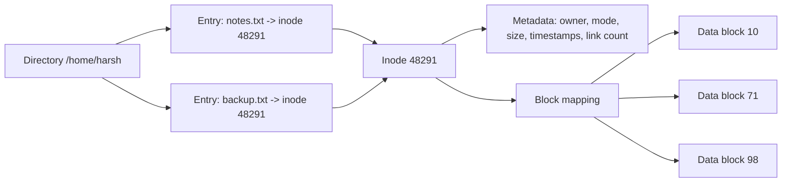
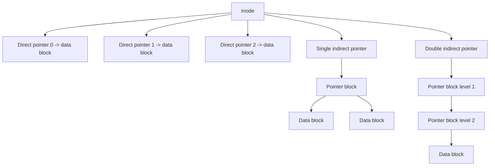
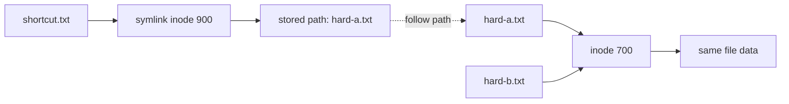

# Day 30 - Inodes and Unix File System Ideas

Difficulty: Intermediate  
Fresh Learning: 40 minutes  
Revision: 5 minutes  
Prerequisites: Days 28-29: file metadata, directories, paths, and file allocation  
Why this topic matters in interviews: Inodes connect file names, metadata, links, and block allocation into one practical Unix-style model. If you understand inodes, hard links, symbolic links, open-file behavior, and direct/indirect pointers, many Linux file-system interview questions become much easier to reason through.

## Opening Intuition

Imagine you create a file called `notes.txt`, make another hard link called `backup.txt`, open the file in a program, and then delete `notes.txt` from the terminal. The program may still read the file. `backup.txt` may still show the same content. Disk blocks may not be freed immediately. The file name you deleted was not the entire file.

That surprises many learners because everyday file managers make files look like names inside folders. Unix-like systems use a sharper separation:

- A directory maps a name to an inode number.
- An inode stores file metadata and block mapping information.
- File data lives in data blocks.
- Links decide how many directory names point to the same inode.
- Open file handles can keep file objects alive even after names are removed.

This topic exists because a file system needs more than a tree of names. It must track ownership, permissions, size, timestamps, block locations, link counts, and efficient access to small and large files. Inodes are the metadata anchor that makes this practical.

You see this idea whenever Linux commands show strange but explainable behavior: `ls -i` prints inode numbers, `ln` creates another name for the same file, `ln -s` creates a pathname reference, `rm` removes a directory entry, and `df` can say a disk is full even when `du` does not clearly explain where all space went because deleted-but-open files still occupy blocks.

## Interview Definition

An inode is a Unix-style file-system data structure that stores metadata about a file-system object and points to the blocks or block mappings that contain its data. A directory entry maps a human-readable name to an inode number. The inode usually stores type, permissions, owner, size, timestamps, link count, and data-block pointers, but not the file name itself.

Interview-ready version: a filename is just an entry in a directory; the inode is the file's real metadata record.

## Key Definitions

Inode: A file-system metadata record that identifies a file-system object and stores metadata plus data-block mapping information.

Directory entry: A mapping from a name inside a directory to an inode number.

Data block: A storage block that contains actual file content or, for some metadata structures, pointers to more blocks.

Direct pointer: A pointer in the inode that refers directly to a data block.

Indirect pointer: A pointer in the inode that refers to a block containing more pointers.

Double indirect pointer: A pointer to a block of pointers, where each pointer leads to another pointer block that finally points to data blocks.

Hard link: Another directory entry that points to the same inode as an existing file.

Symbolic link: A special file that stores a path string to another file or directory.

Link count: The number of hard directory entries pointing to an inode.

Open file description: Kernel state representing an open file instance, including file offset and access mode, often shared by duplicated file descriptors.

## Mental Model

Think of a Unix file system as a library.

The directory is the public catalog shelf. It contains names like `notes.txt` and tells you the catalog ID for each item. The inode is the catalog card for the actual item. It says who owns it, what permissions apply, how large it is, when it changed, how many catalog names point to it, and where the pages are stored. The data blocks are the pages or boxes where the content actually lives.

A hard link is like adding another catalog name that points to the same catalog card. A symbolic link is different: it is a note saying "go look at this path." If the target path changes or disappears, the note may become stale.

The useful interview distinction is:

- Directory entry = name to inode.
- Inode = metadata and block map.
- Data blocks = contents.
- Hard link = same inode, more names.
- Symbolic link = separate inode containing a path.

## Layer 1: What happens at a high level?

When a program opens `/home/harsh/notes.txt`, the OS does not jump directly to "file content." It walks the path one component at a time.

1. Start at the root directory inode for `/`.
2. Look inside that directory for the entry named `home`.
3. Use the inode number from that entry to load the `home` directory inode.
4. Look inside `home` for the entry named `harsh`.
5. Load the `harsh` directory inode.
6. Look inside `harsh` for the entry named `notes.txt`.
7. Load the file inode for `notes.txt`.
8. Check permissions and file type.
9. Create an open file record if access is allowed.
10. Use the inode's block mapping to read or write data blocks.

This is why directories are not only visual folders. A directory is itself a file-system object whose contents are name-to-inode mappings.

The inode gives the file system a stable internal identity for the object. A filename can change without moving file data. A file can have multiple hard-link names. A process can keep reading an already-open file even if its directory name is removed.

## Layer 2: What happens inside the OS?

Inside the kernel, file access is split across several concepts.

The path resolver walks directory entries and finds the target inode. The virtual file system layer gives applications a common interface such as `open`, `read`, `write`, `stat`, and `unlink`, even though the underlying file system may be ext4, XFS, Btrfs, tmpfs, or another implementation. The concrete file-system driver understands how to read its own inode format and block mapping structures.

When a process calls `open("notes.txt", O_RDONLY)`, the kernel checks whether the path exists, whether search permission allows walking parent directories, whether read permission allows opening the file, and whether the target object type matches the operation. If the check succeeds, the kernel returns a file descriptor, which is just a per-process integer handle.

The file descriptor points to kernel open-file state. That state points to a file object and ultimately to an inode or equivalent metadata object. The descriptor is not the file. The path is not the file. The inode is the durable file-system metadata identity.

This separation explains common Unix behavior:

- `mv old new` inside the same file system can be cheap because it changes directory entries, not file data.
- `rm file` removes a directory entry; it does not necessarily erase blocks immediately.
- A file with link count greater than 1 has multiple hard-link names.
- A deleted file can keep using disk space while a process still has it open.
- `stat file` reports inode metadata, not just pathname information.

## Layer 3: What happens at hardware or kernel level?

On storage, file systems divide space into blocks. The inode must help translate a file offset like "byte 9000" into a storage location. Older Unix-style file systems used a classic structure:

- Several direct pointers for small files.
- One single indirect pointer for medium files.
- One double indirect pointer for larger files.
- One triple indirect pointer for very large files.

Suppose the block size is 4 KiB. If a file read asks for byte offset 9000, the file system calculates which logical file block contains that byte. Offset 9000 is in logical block 2 because blocks 0 and 1 cover bytes 0-8191, and block 2 starts at byte 8192. The file system then uses the inode's mapping to find which physical storage block stores logical block 2.

For small files, direct pointers make lookup simple. For larger files, indirect pointers prevent the inode from needing a huge fixed array of block pointers. Instead, the inode points to blocks that contain many more block addresses.

Modern file systems often optimize further. For example, ext4 commonly uses extents rather than only old-style block pointers. An extent records a range mapping, such as "logical blocks 0 through 127 are stored starting at physical block 50000." That is compact and efficient for contiguous runs. Still, the interview model of direct and indirect pointers remains important because it teaches why metadata indirection exists.

At the hardware boundary, the disk or SSD does not understand pathnames. Storage receives block-level reads and writes. The file system translates names to inodes, inodes to block mappings, and block mappings to I/O operations.

## Layer 4: What can go wrong?

Several problems come from confusing names, inodes, and data blocks.

First, deleting a filename may not free space immediately. If another hard link still points to the inode, or if a process still has the file open, the file-system object can remain alive. This is why server logs can consume disk space even after someone runs `rm access.log` while the server still writes to the old open file.

Second, symbolic links can break. A symbolic link stores a path. If the target path is removed or renamed, the symlink becomes dangling. The symlink inode still exists, but following it fails.

Third, hard links can confuse backup tools and disk-usage calculations. Two names may point to one inode, so counting both names as separate files can overestimate storage use.

Fourth, inode exhaustion can happen. A file system can run out of inode records before it runs out of bytes, especially when millions of tiny files are created. In that case, free disk space may exist, but new files cannot be created because no metadata records remain.

Fifth, permissions apply through inode metadata, but path traversal also needs execute/search permission on parent directories. A file may be readable by mode bits, but the process may still fail to reach it if parent directory permissions block traversal.

## Step-by-Step Flow

Here is the practical flow when a process opens and reads a Unix-style file:

1. The program calls `open("/home/harsh/notes.txt", O_RDONLY)`.
2. The CPU enters kernel mode through the system-call path.
3. The kernel starts path resolution at the root inode because the path is absolute.
4. The kernel searches the root directory entries for `home`.
5. The `home` directory entry gives the inode number of the next directory.
6. The kernel checks search permission and loads the `home` directory inode.
7. The same lookup continues for `harsh`.
8. The kernel finds `notes.txt` in the final directory and obtains its inode number.
9. The kernel loads or finds the inode in cache.
10. The file type and permission bits are checked.
11. The kernel creates open-file state and returns a file descriptor such as `3`.
12. The program calls `read(3, buffer, 4096)`.
13. The kernel maps the current file offset to logical file blocks.
14. The inode's direct, indirect, or extent mapping identifies storage blocks.
15. Data is copied from the page cache or fetched from storage into memory.
16. The file offset advances, and the program receives the bytes.

## Diagram Section

### Name, Inode, and Data Blocks



This diagram shows why two names can refer to the same file. `notes.txt` and `backup.txt` are separate directory entries, but both point to inode `48291`. The inode is where metadata and block mappings live.

### Direct and Indirect Pointer Growth



Direct pointers keep small files fast. Indirect pointers allow large files without making every inode huge. The cost is extra metadata reads or cache lookups when following indirect levels.

### Hard Link vs Symbolic Link



A hard link points directly to the same inode. A symbolic link has its own inode and stores a path string that must be resolved later.

## Practical System Relevance

In Linux, commands make inode behavior visible:

```bash
ls -li
stat notes.txt
ln notes.txt hard-copy.txt
ln -s notes.txt soft-copy.txt
find . -inum 48291
df -i
lsof | grep deleted
```

`ls -li` shows inode numbers and helps prove that two hard-linked names refer to the same inode. `stat` shows metadata such as inode number, link count, permissions, size, and timestamps. `df -i` checks inode availability, which matters when a system has too many tiny files. `lsof | grep deleted` can reveal deleted files still held open by running processes.

In Unix-like file systems such as ext2/ext3, the classic teaching model uses direct and indirect pointers. In ext4, extents are a major optimization, but the inode is still the metadata anchor. In XFS and Btrfs, implementation details differ, but the high-level idea remains: names resolve to metadata objects, and metadata maps logical file regions to storage.

In Windows NTFS, the exact structure is not called a Unix inode, but the Master File Table plays a related role. NTFS records store metadata and mapping information. This is a useful comparison: "inode" is Unix vocabulary, but all real file systems need some metadata record that plays a similar responsibility.

In containers, the process may see a normal Unix path, but overlay file systems can layer read-only image files and writable container changes. The inode numbers and link behavior can become less intuitive across layers, but the same separation of names, metadata, and data remains essential.

In servers, inode behavior matters for log rotation. A common safe pattern is to rename the current log and signal the server to reopen logs. If you simply delete a large log file while the server still has it open, disk space may not return until that file descriptor closes.

In backup systems, hard links are often used to make incremental snapshots efficient. Multiple snapshot directories may contain names pointing to the same unchanged file inode. A naive copy tool can accidentally duplicate data or break hard-link relationships.

## Code or Pseudocode Section

### Observing hard links

```bash
echo "hello" > a.txt
ln a.txt b.txt
ls -li a.txt b.txt
stat a.txt
stat b.txt
```

Expected observation: `a.txt` and `b.txt` should show the same inode number. The link count should increase because two directory entries point to the same inode.

### Observing symbolic links

```bash
ln -s a.txt s.txt
ls -li a.txt s.txt
readlink s.txt
rm a.txt
cat s.txt
```

Expected observation: `s.txt` has a different inode because it is its own symbolic-link object. After removing `a.txt`, the symlink can become dangling if no file exists at the stored path.

### Simplified inode lookup pseudocode

```c
inode* resolve_path(path p) {
    inode* current = root_inode();

    for each component in p.components {
        if (!is_directory(current)) {
            return ERROR_NOT_DIRECTORY;
        }

        if (!can_search(current, current_process)) {
            return ERROR_PERMISSION;
        }

        dir_entry entry = lookup_name(current, component);
        if (!entry.exists) {
            return ERROR_NOT_FOUND;
        }

        current = load_inode(entry.inode_number);
    }

    return current;
}
```

This demonstrates the main idea: path resolution repeatedly searches directories, obtains inode numbers, and loads the next inode. The path string guides lookup, but the inode drives the actual file-system object.

### Simplified file offset mapping

```c
block_number map_file_offset(inode* node, uint64_t offset) {
    uint64_t logical_block = offset / BLOCK_SIZE;

    if (logical_block < DIRECT_POINTER_COUNT) {
        return node->direct[logical_block];
    }

    logical_block -= DIRECT_POINTER_COUNT;
    return lookup_indirect_block(node->single_indirect, logical_block);
}
```

Real file systems handle holes, extents, caching, journaling, permissions, and many corner cases. This simplified code is only to show why inodes need block mappings.

## Common Misconceptions

1. Misconception: The filename is stored inside the inode.  
   Correction: In Unix-style file systems, names live in directory entries. The inode stores metadata and block mapping information.

2. Misconception: Deleting a file always deletes data immediately.  
   Correction: `rm` removes a directory entry. Blocks are reclaimed only when link count is zero and no process holds the file open.

3. Misconception: A hard link is just a shortcut.  
   Correction: A hard link is another real directory entry pointing to the same inode. There is no primary name at the inode level.

4. Misconception: A symbolic link and hard link behave the same.  
   Correction: A symlink is a separate file containing a path. A hard link points directly to the same inode.

5. Misconception: Inode numbers are globally unique across the entire machine.  
   Correction: Inode numbers are meaningful within a file system. The pair of device plus inode identifies a file-system object more reliably.

6. Misconception: Free disk space guarantees new files can be created.  
   Correction: A file system can run out of inodes even if data blocks remain free.

7. Misconception: Direct pointers are outdated and therefore irrelevant.  
   Correction: Modern file systems may use extents, but direct/indirect pointers are still important for understanding metadata indirection and historical Unix design.

## Tricky Interview Corners

### Why can a deleted file still consume disk space?

If a process has the file open, the kernel still has open-file state referencing the file object. The directory entry may be gone, and link count may be zero, but the storage cannot be safely reclaimed until the last open reference closes.

### Why are hard links usually restricted for directories?

Hard-linking directories can create cycles in the directory graph and make traversal, cleanup, and consistency much harder. Unix-like systems normally restrict ordinary users from creating hard links to directories.

### Why can symbolic links cross file-system boundaries while hard links usually cannot?

A hard link points to an inode inside the same file system. A symlink stores a path string, so it can name something elsewhere, including another mounted file system.

### Why is link count important?

The link count tells how many directory entries refer to the inode. When the link count reaches zero and no open references remain, the file system can reclaim the inode and data blocks.

### Why does `mv` sometimes feel instant and sometimes slow?

Renaming within the same file system can update directory entries. Moving across file systems cannot simply reuse the same inode, so the data must be copied and the old name removed.

### Why can inode exhaustion happen with tiny files?

Each file needs metadata. Millions of tiny cache files, mail files, or extracted package files can consume available inodes before consuming all bytes on disk.

## Comparison Tables

### Hard Link vs Symbolic Link

| Feature | Hard link | Symbolic link |
|---|---|---|
| Points to | Same inode | Path string |
| Has separate inode | No, it is another directory entry to same inode | Yes |
| Breaks if original name removed | No, if another hard link remains | Often yes, if target path disappears |
| Can usually cross file systems | No | Yes |
| Common use | Multiple equal names for same file | Shortcuts, references, flexible paths |

### Directory Entry vs Inode vs Data Block

| Part | Main job | Contains filename? | Contains file content? |
|---|---|---:|---:|
| Directory entry | Map name to inode number | Yes | No |
| Inode | Store metadata and block map | Usually no | No, except special tiny-data optimizations in some systems |
| Data block | Store bytes or pointer data | No | Yes, for normal data blocks |

### Direct vs Indirect Pointers

| Pointer type | What it points to | Best for | Cost |
|---|---|---|---|
| Direct | Actual data block | Small files and early blocks | Simple and fast |
| Single indirect | Block containing data-block pointers | Medium files | One extra level |
| Double indirect | Block leading to more pointer blocks | Larger files | Two extra levels |
| Extent-style mapping | A contiguous range | Large contiguous regions | More complex metadata logic |

## How to Explain This in an Interview

### 30-second answer

An inode is the Unix file-system metadata record for a file-system object. A directory maps names to inode numbers. The inode stores metadata such as permissions, owner, size, timestamps, link count, and mappings to data blocks. Hard links are multiple names for the same inode, while symbolic links are separate files that store a path to another object.

### 2-minute answer

In Unix-like systems, a file is not just a filename. The filename lives in a directory entry. That entry points to an inode number. The inode is the core metadata structure: it records file type, permissions, ownership, size, timestamps, link count, and how to find file data blocks. For small files, older Unix designs used direct block pointers. For larger files, they used single, double, or triple indirect pointers so a fixed-size inode could still describe large files. Modern file systems may use extents, but the conceptual responsibility is the same.

This explains hard links and deletion behavior. A hard link creates another directory entry pointing to the same inode, so both names are equal. Removing one name only decreases the link count. The data disappears only when no hard links and no open references remain. A symbolic link is different because it has its own inode and stores a path string, so it can break if the target path disappears.

### Deeper follow-up answer

At lookup time, the OS resolves a path by walking directories component by component. Each directory lookup maps a name to the next inode. Once the target inode is found, the kernel checks permissions and opens the file. During reads and writes, the file offset is converted into logical file blocks, and the inode's mapping structures translate those logical blocks to storage blocks. The page cache, journaling, extents, and delayed allocation can optimize real implementations, but the interview foundation is the separation between namespace, metadata, and data.

## Interview Questions

### Basic Questions

1. What is an inode?
2. Does an inode store the file name?
3. What is the difference between a directory entry and an inode?
4. What metadata is commonly stored in an inode?
5. What is a hard link?

### Intermediate Questions

6. How does path resolution use directories and inodes?
7. Why can deleting a file fail to free disk space immediately?
8. How is a symbolic link different from a hard link?
9. Why are hard links usually limited to the same file system?
10. What is inode exhaustion, and why can it happen even with free disk space?

### Advanced Questions

11. Why did classic Unix inodes use direct and indirect pointers?
12. How do direct, single indirect, and double indirect pointers affect file-size support?
13. Why can `mv` be cheap within one file system but expensive across file systems?
14. How can log rotation go wrong if a process keeps the old file open?
15. Why is device plus inode a stronger identity than inode number alone?

## Follow-Up Questions

Q: What is an inode?  
Follow-ups:
- Which fields are stored in it?
- Why is the filename usually not stored there?
- How does it help with hard links?

Q: What happens when you run `rm file`?  
Follow-ups:
- Is the data immediately erased?
- What if another hard link exists?
- What if a process still has the file open?

Q: Hard link vs symbolic link?  
Follow-ups:
- Which one has a separate inode?
- Which one can become dangling?
- Which one can usually cross file-system boundaries?

Q: How does the OS open `/a/b/c.txt`?  
Follow-ups:
- What permissions are checked on parent directories?
- What does each directory lookup return?
- Where does the final file descriptor point?

Q: Why use indirect pointers?  
Follow-ups:
- Why not store every block pointer directly in the inode?
- What is the lookup cost of single vs double indirection?
- How do extents improve the representation?

Q: Why can a disk run out of inodes?  
Follow-ups:
- What workloads create many tiny files?
- Which command checks inode availability?
- How is this different from running out of bytes?

Q: Why is a hard link not a shortcut?  
Follow-ups:
- Which name is original after a hard link exists?
- What happens to link count?
- Why is this important for backups?

Q: How does log rotation interact with inodes?  
Follow-ups:
- Why can deleting the visible log fail to reclaim space?
- How can `lsof` help?
- Why should a service reopen its log file?

## Trick Questions

Q: If two filenames have the same inode number, are they two separate file contents?  
Expected answer: On the same file system, they are hard links to the same inode and same file content.

Q: If you delete the "original" name of a hard-linked file, is the file gone?  
Expected answer: No. There is no special original at the inode level. The file remains while another hard link or open reference exists.

Q: Can a symbolic link point to a file that does not exist?  
Expected answer: Yes. The symlink can store a path even if the target is missing; then it is dangling.

Q: Does a file descriptor store the filename?  
Expected answer: No. It is a process handle to kernel open-file state. The original path may be gone or renamed.

Q: If `df -h` shows free space, can file creation still fail?  
Expected answer: Yes. The file system may be out of inodes, or permissions/quotas may block creation.

Q: Can hard links usually point to directories?  
Expected answer: Ordinary hard links to directories are usually restricted to avoid cycles and consistency problems.

Q: Does `mv file newname` always copy data blocks?  
Expected answer: No. Within the same file system, it may only update directory entries. Across file systems, it generally requires copying data.

## Practical Debugging / Observation

Use these commands when learning inode behavior on a Unix-like system:

```bash
ls -li
stat file
find . -inum <inode-number>
df -i
du -sh .
lsof | grep deleted
ln source hardlink
ln -s source symlink
readlink symlink
```

What to observe:

- `ls -li` shows inode numbers, making hard links visible.
- `stat` shows link count, ownership, permissions, and timestamps.
- `find . -inum N` finds names that point to the same inode number in a tree.
- `df -i` shows inode usage; it catches "too many files" conditions.
- `du` estimates reachable disk usage by walking directory entries.
- `lsof | grep deleted` helps find deleted files still held open.
- `readlink` shows the path stored inside a symbolic link.

Small experiment:

```bash
echo "inode demo" > demo.txt
ln demo.txt demo-hard.txt
ln -s demo.txt demo-soft.txt
ls -li demo.txt demo-hard.txt demo-soft.txt
rm demo.txt
cat demo-hard.txt
cat demo-soft.txt
```

The hard link should still read the data because it points to the same inode. The symlink may fail because its stored target path `demo.txt` no longer exists.

## Mini Quiz

### MCQs

1. What does a Unix directory entry usually map?
   A. File content to disk sector  
   B. Name to inode number  
   C. Process ID to file descriptor  
   D. Virtual address to physical frame  

2. Which item usually stores owner, permissions, size, and timestamps?
   A. Directory entry  
   B. Inode  
   C. Shell history  
   D. CPU register  

3. A hard link creates:
   A. A path string pointing to a target  
   B. Another directory entry for the same inode  
   C. A copy of all file data  
   D. A new file system  

4. A symbolic link can become dangling because:
   A. It stores a path that may stop resolving  
   B. It has no inode  
   C. It must always be on the same file system  
   D. It deletes the target automatically  

5. `df -i` is useful for checking:
   A. CPU scheduling delay  
   B. Inode availability  
   C. TLB hit rate  
   D. Network throughput  

### Short-answer questions

1. Why does an inode usually not store the filename?
2. Why can deleting a file fail to free space immediately?
3. Why do indirect pointers help support large files?

### Reasoning questions

1. A server writes to `app.log`. You run `rm app.log`, but disk space does not return. Explain the likely inode/open-file reason.
2. You create `ln report.txt report2.txt` and then edit `report2.txt`. Why does `report.txt` also show the edit?

### Answers

1. B
2. B
3. B
4. A
5. B

Short answers:

1. Because filenames live in directory entries; multiple directory entries can point to the same inode.
2. The link count may not be zero, or an open file reference may still exist.
3. They let a fixed-size inode reach many more data blocks through pointer blocks.

Reasoning answers:

1. The directory entry was removed, but the server still has an open file descriptor referencing the file object. Blocks remain allocated until the descriptor closes.
2. Both names are directory entries pointing to the same inode and data blocks, so editing through either name changes the same file.

# 5-Minute Revision Column

Revision targets from `prepare:day`: Day 29 Directory Structures and File Allocation (R1), Day 27 Thrashing and Working Set (R2), Day 25 Virtual Memory (R3).

## Day 29 - Directory Structures and File Allocation - R1 Recall Revision

Core recall: directories solve naming; file allocation solves storage placement. A directory structure organizes files and subdirectories into a namespace. File allocation maps the logical byte sequence of a file to storage blocks. The clean interview line is: directories answer "how do I find this file by name?" while allocation answers "where are this file's data blocks?"

Key definitions:

- Directory structure: the organization of names and subdirectories in a file-system namespace.
- Directory entry: a record that maps a name to a file-system object or metadata identifier.
- Indexed allocation: a method where metadata/index blocks store pointers from logical file blocks to physical storage blocks.

Practical memory: a Unix-like directory maps names to inode numbers, while the inode or allocation metadata maps the file to blocks. Renaming within the same file system can be cheap because file data does not move.

Common traps:

- A path is not the physical data location.
- Contiguous allocation is fast but can fail from external fragmentation.

Quick questions:

- Why can two paths refer to the same file data?
- Why can linked allocation hurt random access?

## Day 27 - Thrashing and Working Set - R2 Compression Revision

Core recall:

- Thrashing means the system spends most of its time servicing page faults instead of executing useful work.
- It happens when active processes do not have enough frames for their current localities.
- Working set means recently used pages, not the whole virtual address space.
- Low CPU utilization can be a symptom of paging I/O, not a signal to add more processes.
- Page-fault frequency and working-set tracking are feedback ideas for controlling memory pressure.

Key definitions:

- Working set: distinct pages referenced during a recent window.
- Degree of multiprogramming: number of processes actively competing for memory and CPU.

Trap: a better replacement algorithm cannot make active memory demand fit if the combined working sets exceed RAM.

Quick questions:

- Can removing a process improve total throughput?
- Is a TLB miss the same as a page fault?

## Day 25 - Virtual Memory - R3 Flash Revision

Virtual memory gives each process a private virtual address space and maps virtual pages to physical frames using page tables and the MMU.

Must remember:

- Demand paging loads pages when touched.
- A valid page fault can be handled without crashing the process.
- TLB miss means missing translation cache entry, not necessarily missing RAM page.

Killer trap: virtual memory is not unlimited memory, and swap is not equivalent to RAM.

Tricky question: Can two processes use the same virtual address while mapping to different physical frames?

## Final Takeaway

Inodes are the metadata backbone of Unix-style file systems. A directory entry gives a name to an inode number, the inode stores metadata and block mapping information, and the data blocks store the file contents. This separation explains hard links, symbolic links, deletion behavior, log rotation issues, inode exhaustion, and why pathnames are not the same as file identity. In interviews, keep the model clean: name to inode, inode to metadata and blocks, blocks to bytes. Once that is clear, most Unix file-system questions become structured reasoning rather than memorized trivia.

## What You Should Be Able To Answer Now

- Explain what an inode stores and why it matters.
- Distinguish directory entries, inodes, and data blocks.
- Compare hard links and symbolic links accurately.
- Explain why deleting a file may not free space immediately.
- Describe direct and indirect block pointer ideas.
- Explain inode exhaustion separately from disk-space exhaustion.
- Reason about `ln`, `ln -s`, `rm`, `stat`, `ls -li`, and `df -i`.
- Give a strong interview answer for Unix file representation.
