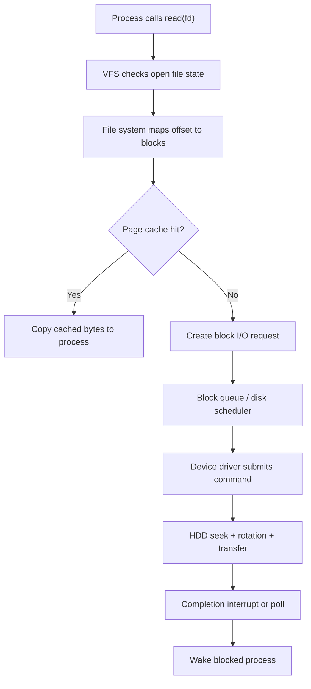
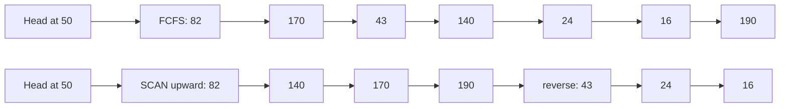
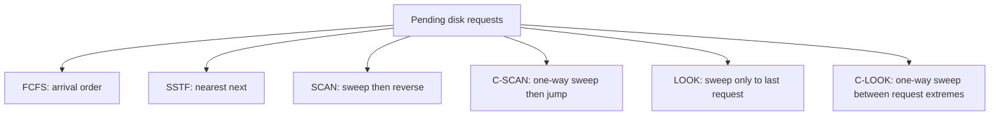

# Day 31 - Disk Scheduling

Difficulty: Intermediate  
Fresh Learning: 40 minutes  
Revision: 5 minutes  
Prerequisites: Days 28-30: file systems, metadata, file allocation, inodes, and block-level storage intuition  
Why this topic matters in interviews: Disk scheduling is a classic OS topic for reasoning about seek time, rotational latency, algorithm tradeoffs, starvation, and why storage hardware changes OS design priorities.

## Opening Intuition

Imagine a mechanical hard disk receiving requests for blocks near cylinder 15, then cylinder 180, then cylinder 22, then cylinder 170. If the disk head jumps back and forth in arrival order, most of the time is wasted moving the arm instead of transferring useful data. The CPU might be fast, the file system might know exactly which blocks it wants, and the process might be ready to continue, but the storage device becomes the bottleneck because physical movement is slow.

Disk scheduling exists because secondary storage is not just an abstract array of bytes. On a traditional HDD, reading a block depends on where the disk head currently is, which track the target block is on, how long the platter takes to rotate the right sector under the head, and how much data must be transferred. The OS or disk firmware can improve total performance by choosing a smarter order for pending I/O requests.

You see the result indirectly whenever a system feels slow even though the CPU is not fully used. A database scan, a log-heavy server, a virtual machine image, a browser cache, or a build tool may issue many storage requests. If those requests force random disk movement, latency can explode. On SSDs, mechanical seek time is gone, but scheduling still matters for fairness, batching, request merging, queue depth, and write behavior. The interview value is not memorizing every algorithm name; it is explaining what each algorithm optimizes and what it sacrifices.

## Interview Definition

Disk scheduling is the OS or storage-controller policy for ordering pending disk I/O requests so the device can serve them efficiently and fairly. In HDDs, the main goal is to reduce seek movement and rotational waiting while keeping response time acceptable. Classic algorithms include FCFS, SSTF, SCAN, C-SCAN, LOOK, and C-LOOK.

Interview-ready version: disk scheduling decides which disk request to serve next; on HDDs, good ordering reduces head movement, but aggressive optimization can hurt fairness or cause starvation.

## Key Definitions

Seek time: The time needed to move the disk arm/head to the target track or cylinder.

Rotational latency: The waiting time until the desired sector rotates under the head.

Transfer time: The time needed to actually move bytes between the disk and memory after positioning is ready.

Disk service time: The total time for a request, usually approximated as seek time plus rotational latency plus transfer time plus controller overhead.

FCFS: First-Come, First-Served; requests are handled in arrival order.

SSTF: Shortest Seek Time First; the next request is the one closest to the current head position.

SCAN: The elevator algorithm; the head moves in one direction servicing requests, reaches an end, then reverses.

C-SCAN: Circular SCAN; the head services requests in one direction, jumps back to the beginning, and repeats.

LOOK: Like SCAN, but the head reverses at the last pending request in a direction instead of going all the way to the physical end.

C-LOOK: Like C-SCAN, but it jumps from the last pending request in one direction back to the lowest pending request instead of the physical disk end.

## Mental Model

Think of a disk head like an elevator in a very tall building where people request floors. If the elevator handles requests strictly in arrival order, it might go from floor 5 to 90 to 6 to 88. Everyone eventually gets served, but the movement is wasteful. A smarter elevator continues in one direction, picks up people along the way, then reverses or loops.

The mature version of the mental model is this: disk scheduling is a tradeoff between movement efficiency and waiting fairness. FCFS is fair by arrival order but may waste movement. SSTF minimizes the next local movement but can keep far-away requests waiting. SCAN-style algorithms reduce movement while giving a more predictable sweep pattern. Circular variants make wait time more uniform by treating the disk as a one-way cycle.

## Layer 1: What happens at a high level?

A process rarely says, "move the disk head to cylinder 120." It asks for file bytes. The file system translates a pathname, inode, and file offset into logical or physical block requests. Those requests enter a queue. The block layer, disk scheduler, device driver, or storage firmware decides the order in which pending requests are submitted to the device.

For a mechanical disk, the current head location strongly affects request cost. Suppose the head is at cylinder 50 and pending requests are at 10, 55, 58, and 180. Serving 55 and 58 before 10 is likely cheaper than going backward to 10 first, because the head is already near 55. This is the basic idea behind seek-aware scheduling.

The OS also cares about user experience. A desktop system should not let one large backup job make every small interactive read wait forever. A database server may prefer throughput and batching. A real-time system may care about deadlines. Therefore, production schedulers are usually more complex than textbook algorithms, but the textbook algorithms give the vocabulary for the tradeoffs.

## Layer 2: What happens inside the OS?

Inside the OS, disk I/O sits below the file-system abstraction and above the device hardware. A read path may look like this:

1. A process calls `read` on a file descriptor.
2. The virtual file system layer identifies the file object and offset.
3. The concrete file system maps the file offset to storage blocks.
4. The page cache may satisfy the request immediately if data is already cached.
5. If storage access is needed, a block I/O request is created.
6. The block layer may merge adjacent requests, sort requests, or apply a scheduling policy.
7. The device driver submits commands to the storage device.
8. The disk or SSD firmware may reorder internally using its own command queue.
9. Completion interrupts or polling notify the kernel that data is ready.
10. The blocked process wakes up and continues.

Historically, OS disk schedulers had a very visible role because HDD head movement dominated latency. Modern systems often rely more on device firmware, NVMe queues, and simpler OS policies, especially for SSDs. Still, the OS must manage fairness, latency classes, writeback, cgroups, and I/O isolation. The interview bridge is: the same request queue idea remains, but the cost model changes when storage hardware changes.

## Layer 3: What happens at hardware or kernel level?

An HDD stores data on rotating platters divided into tracks and sectors. Tracks at the same radius across platters form a cylinder. A request becomes expensive when the head must move to a distant track. Once the head reaches the track, the disk may still wait for the desired sector to rotate under the head. Only then does transfer begin.

The rough HDD cost model is:

```txt
service time = seek time + rotational latency + transfer time + controller overhead
```

Seek time is often the largest and most variable part for random access. Rotational latency depends on RPM. Transfer time depends on data size and sequentiality. Sequential reads are fast because the head stays near the same track and the disk streams data. Random reads are slow because every request may need new positioning.

At kernel level, a disk scheduler may use the request's block number as a proxy for physical position. Real disks hide some geometry, remap sectors, cache data, and perform internal scheduling, so the OS often sees logical block addresses rather than exact cylinders. But logical proximity is still a useful idea, especially for explaining why adjacent I/O can be merged and why random I/O is expensive on HDDs.

For SSDs, there is no moving arm and no rotational latency. Random reads are much cheaper than HDD random reads. However, SSDs still have queues, parallel channels, erase blocks, garbage collection, write amplification, and firmware-level scheduling. That is why the classic algorithms are mostly a teaching model for HDDs, while modern production scheduling focuses on latency control, fairness, queue depth, and device characteristics.

## Layer 4: What can go wrong?

The first failure mode is terrible seek behavior. FCFS can bounce the head across the disk if requests arrive in an unlucky order. The system is technically fair by arrival time, but throughput is poor.

The second failure mode is starvation. SSTF can keep choosing nearby requests while a far-away request waits for a long time. This is especially likely under continuous load where new nearby requests keep arriving.

The third failure mode is poor tail latency. A policy may optimize average movement but cause some requests to wait much longer than expected. User-visible systems often care about the slowest requests, not only average throughput.

The fourth failure mode is using an outdated mental model for SSDs. If you explain modern SSD performance purely in terms of head movement, the answer sounds memorized. The correct answer is: disk scheduling algorithms were designed around HDD mechanics; modern storage still schedules I/O, but for different reasons.

The fifth failure mode is ignoring caches. Many reads never reach the disk because the page cache satisfies them. Many writes return before bytes are physically durable because they are buffered. Disk scheduling operates on the I/O requests that actually reach the block layer or device queue.

## Step-by-Step Flow

Here is a concrete HDD-oriented flow for a read that misses the page cache:

1. A process calls `read(fd, buffer, 4096)`.
2. The kernel checks the open file state and current file offset.
3. The file system maps the file offset to one or more logical block addresses.
4. The page cache is checked; the target page is missing.
5. The kernel creates a block I/O request.
6. The request enters the block-device queue.
7. The scheduler compares pending requests using its policy.
8. The chosen request is submitted to the disk driver.
9. The HDD moves the head to the target track if needed.
10. The platter rotates until the target sector arrives under the head.
11. The disk transfers data to memory, often using DMA.
12. The device signals completion.
13. The kernel marks the page cache page up to date.
14. The blocked process wakes and receives the requested bytes.

## Diagram Section

### HDD request path from file read to device



This diagram shows where disk scheduling fits. It does not choose file names or parse directories; it orders the lower-level block requests that survive cache lookup.

### Comparing head movement for FCFS and SCAN



FCFS follows arrival order and may jump back and forth. SCAN groups movement by direction, which usually reduces total head movement and produces a more predictable service pattern.

### Algorithm behavior at a glance



The family relationship matters: LOOK optimizes SCAN by not traveling to an empty physical end; C-LOOK similarly optimizes C-SCAN.

## Practical System Relevance

In Linux, disk I/O travels through the page cache, file system, block layer, scheduler, driver, and storage device. Depending on the kernel, device type, and configuration, schedulers such as `mq-deadline`, `bfq`, `kyber`, or `none` may be available. The exact scheduler names are less important for interviews than the reason they exist: balancing throughput, latency, fairness, and device characteristics.

On Windows, the storage stack also queues and reorders I/O. The user usually does not choose textbook algorithms directly. The practical idea is the same: the OS and storage stack try to avoid unnecessary work, batch requests, honor priorities, and keep applications responsive.

In databases, random disk I/O is a major reason indexes, buffer pools, sequential scans, write-ahead logs, and checkpoint strategies matter. A database that turns a workload into many small random reads behaves very differently on HDDs than one that performs mostly sequential I/O. This is why older database tuning advice strongly emphasized reducing random seeks.

In browsers and build tools, caches create many small files. On HDDs, scanning many tiny files can be slow because metadata and data may be scattered. On SSDs, the same workload improves significantly, but still has overhead from system calls, file-system metadata, and queueing.

In cloud systems, storage may be virtualized. A VM may see a virtual disk while the host maps requests to network storage, SSD-backed volumes, or replicated block devices. The guest OS scheduling policy is only one layer; the hypervisor, host, and storage service may also queue and reorder operations.

In containers, multiple containers share the host kernel and storage stack. I/O scheduling and cgroup controls can prevent one container from overwhelming storage and harming others. This connects disk scheduling to resource isolation, not just mechanical disks.

## Code or Pseudocode Section

### Simple scheduling example

Suppose the head starts at cylinder `50`, and pending requests are:

```txt
82, 170, 43, 140, 24, 16, 190
```

FCFS order is exactly:

```txt
50 -> 82 -> 170 -> 43 -> 140 -> 24 -> 16 -> 190
```

That creates long jumps. If SCAN is moving upward, it might serve:

```txt
50 -> 82 -> 140 -> 170 -> 190 -> 43 -> 24 -> 16
```

SCAN avoids alternating direction for every request. The improvement comes from reducing direction changes and grouping nearby requests.

### C-like SSTF pseudocode

```c
int choose_sstf(int head, int requests[], int n, bool done[]) {
    int best = -1;
    int best_distance = INT_MAX;

    for (int i = 0; i < n; i++) {
        if (done[i]) continue;

        int distance = abs(requests[i] - head);
        if (distance < best_distance) {
            best_distance = distance;
            best = i;
        }
    }

    return best;
}
```

This captures the core SSTF idea: choose the nearest pending request. The trap is visible too. If new nearby requests keep arriving, a far request may wait too long.

### Linux observation commands

```bash
lsblk
cat /sys/block/sda/queue/scheduler
iostat -x 1
vmstat 1
pidstat -d 1
```

What to observe:

- `lsblk` shows block devices and helps distinguish disks, partitions, and virtual devices.
- `/sys/block/.../queue/scheduler` can show the active scheduler for a block device on many Linux systems.
- `iostat -x` helps observe utilization, wait time, request rates, and queue behavior.
- `vmstat` can show blocked processes and I/O wait signals.
- `pidstat -d` connects I/O activity to processes.

Do not treat these commands as proof of a specific textbook algorithm. They are practical tools for observing storage pressure.

## Common Misconceptions

1. Misconception: Disk scheduling decides which process runs next.  
   Correction: CPU scheduling chooses runnable processes or threads. Disk scheduling orders storage I/O requests.

2. Misconception: FCFS is always bad.  
   Correction: FCFS is simple and fair by arrival order. It performs poorly when arrival order causes large head movement.

3. Misconception: SSTF is always optimal.  
   Correction: SSTF optimizes the next local seek, not global fairness. It can starve far-away requests.

4. Misconception: SCAN always goes to the physical end of the disk because useful work exists there.  
   Correction: SCAN may travel to an end by definition, but LOOK avoids unnecessary travel by reversing at the last pending request.

5. Misconception: C-SCAN and SCAN are the same.  
   Correction: SCAN services in both directions. C-SCAN services in one direction and wraps around, which can make waiting time more uniform.

6. Misconception: SSDs need the same scheduling algorithms as HDDs.  
   Correction: SSDs do not have mechanical seek or rotational latency. They still need I/O management, but the cost model is different.

7. Misconception: A successful `write` means the disk physically completed the write.  
   Correction: Writes may be buffered in OS cache or device cache. Durability requires stronger guarantees such as sync operations.

## Tricky Interview Corners

### Why is SSTF vulnerable to starvation?

SSTF chooses the request nearest to the current head. If the disk is busy and new nearby requests keep arriving, the head may keep serving the middle region while an old request near the edge waits. It improves local seek time but does not inherently enforce fairness.

### Why does C-SCAN often give more uniform wait time than SCAN?

In SCAN, requests near the middle can be served from either direction, while requests near the ends may see different wait patterns. C-SCAN treats service as a one-way circular sweep. After reaching the high end, it jumps back to the low end and begins again. This makes the service pattern more like a circular queue.

### Why does LOOK improve on SCAN?

SCAN may continue to a physical end even if there are no pending requests there. LOOK reverses at the last request in the current direction. It keeps the elevator idea but avoids empty travel.

### Why is rotational latency not solved by reducing seek time?

The head can reach the correct track, but the desired sector may have just passed. The disk must wait for rotation. Scheduling can sometimes improve this by considering sector position, but textbook algorithms usually simplify the model to cylinder movement.

### Why are modern storage stacks more complex than textbook algorithms?

Modern disks and SSDs hide geometry, perform internal caching, support command queues, and may reorder requests. The OS also manages priorities, cgroups, writeback, latency targets, and fairness. Textbook algorithms teach the mechanical tradeoff, not the full implementation.

### Why can a system have high I/O wait and low CPU usage?

Processes may be blocked waiting for storage. The CPU is available, but useful work cannot continue until data arrives. This is a storage bottleneck, not proof that the CPU scheduler is failing.

## Comparison Tables

### Disk Scheduling Algorithms

| Algorithm | Main idea | Strength | Weakness |
|---|---|---|---|
| FCFS | Serve in arrival order | Simple and arrival-fair | Can cause huge head movement |
| SSTF | Serve nearest request next | Reduces local seek time | Can starve far requests |
| SCAN | Sweep in one direction, then reverse | Predictable and efficient | May travel to empty ends |
| C-SCAN | Sweep one direction, then wrap | More uniform wait pattern | Return jump is not servicing work |
| LOOK | Sweep to last pending request, then reverse | Avoids empty end travel | Still direction-dependent |
| C-LOOK | One-way sweep between request extremes | Efficient circular behavior | Wrap request may wait |

### HDD vs SSD Scheduling Concerns

| Concern | HDD | SSD |
|---|---|---|
| Seek time | Major cost | Not mechanical |
| Rotational latency | Major cost | None |
| Sequential vs random gap | Very large | Smaller but still exists |
| Request ordering goal | Reduce movement and latency | Manage queues, fairness, parallelism, writes |
| Textbook algorithms | Directly motivated | Mostly historical/teaching context |

### Seek Time vs Rotational Latency vs Transfer Time

| Component | Meaning | Interview note |
|---|---|---|
| Seek time | Move head to target track | Dominates random HDD I/O |
| Rotational latency | Wait for sector under head | Depends on RPM |
| Transfer time | Move data after positioning | Better for large sequential reads |
| Queueing time | Wait behind other requests | Controlled by scheduling and load |

## How to Explain This in an Interview

### 30-second answer

Disk scheduling orders pending disk I/O requests. On HDDs, the goal is to reduce seek time and rotational latency by avoiding unnecessary head movement. FCFS is simple but can be inefficient, SSTF chooses the nearest request but may starve far requests, and SCAN/C-SCAN/LOOK-style algorithms improve predictability by sweeping across the disk.

### 2-minute answer

When a process reads a file, the OS eventually turns file offsets into block I/O requests. If several requests are pending, the storage stack can choose an order. On a mechanical disk, request order matters because the head has to move to tracks and wait for sectors to rotate. FCFS handles requests in arrival order, which is fair but can bounce the head around. SSTF chooses the closest request to reduce immediate seek cost, but it can starve requests far away. SCAN behaves like an elevator: it moves in one direction, serves requests along the way, then reverses. C-SCAN services in one direction and wraps around, which can make waiting more uniform. LOOK and C-LOOK avoid traveling to empty physical ends.

The modern caveat is important: SSDs do not have mechanical seek or rotational latency, so the old algorithms are less directly relevant. But scheduling still matters for queueing, fairness, request merging, latency, and write behavior.

### Deeper follow-up answer

The main performance terms are seek time, rotational latency, transfer time, and queueing time. For random HDD workloads, seek and rotation dominate, so reordering requests can greatly improve throughput. But optimizing only total movement can hurt fairness. A strong answer should connect algorithms to their failure modes: FCFS can waste movement, SSTF can starve, SCAN can do unnecessary end travel, LOOK improves that, and circular variants aim for more uniform wait time. Then connect it to real systems: page cache may avoid disk I/O entirely, storage devices have internal queues, and cloud or SSD-backed storage changes the cost model.

## Interview Questions

### Basic Questions

1. What is disk scheduling?
2. What are seek time, rotational latency, and transfer time?
3. Why is random access expensive on HDDs?
4. What does FCFS disk scheduling do?
5. Why is disk scheduling different from CPU scheduling?

### Intermediate Questions

6. How does SSTF choose the next request?
7. Why can SSTF cause starvation?
8. How does SCAN differ from FCFS?
9. What is the difference between SCAN and C-SCAN?
10. Why do LOOK and C-LOOK avoid unnecessary movement?

### Advanced Questions

11. Why are textbook disk scheduling algorithms less important for SSDs?
12. How can page cache behavior affect whether a disk request is scheduled at all?
13. Why can a system show high I/O wait while CPU utilization is low?
14. How do storage queues affect tail latency?
15. Why might a database prefer sequential I/O patterns?

## Follow-Up Questions

Q: What is disk scheduling?  
Follow-ups:
- Which layer creates block I/O requests?
- Why does request order matter more on HDDs?
- Is this the same as CPU scheduling?

Q: Explain FCFS disk scheduling.  
Follow-ups:
- Why is it simple?
- When can it perform badly?
- Does it prevent starvation by arrival order?

Q: Explain SSTF.  
Follow-ups:
- What does "shortest" mean here?
- Why is local optimization not the same as global fairness?
- Give a starvation scenario.

Q: Explain SCAN.  
Follow-ups:
- Why is it called the elevator algorithm?
- How does it reduce back-and-forth movement?
- What weakness does LOOK address?

Q: SCAN vs C-SCAN?  
Follow-ups:
- Which services requests in both directions?
- Why can C-SCAN have more uniform wait time?
- What does the wrap-around represent?

Q: HDD vs SSD scheduling?  
Follow-ups:
- Which HDD costs disappear on SSDs?
- Why does scheduling still matter on SSDs?
- What should you not say about SSDs in an interview?

Q: What causes high I/O wait?  
Follow-ups:
- Are blocked processes using CPU?
- How can storage bottlenecks make the CPU look idle?
- Which commands might help observe it?

Q: How does disk scheduling connect to file systems?  
Follow-ups:
- Does the scheduler understand filenames?
- How do inodes and allocation metadata create block requests?
- Can the page cache avoid disk access?

## Trick Questions

Q: Is SSTF always the best disk scheduling algorithm because it minimizes seek time?  
Expected answer: No. It minimizes the next seek locally, but it can starve far-away requests and may not optimize fairness.

Q: Does FCFS mean the disk head moves efficiently?  
Expected answer: No. FCFS is fair by arrival order, but arrival order may cause excessive head movement.

Q: Is disk scheduling the same as CPU scheduling?  
Expected answer: No. CPU scheduling chooses runnable execution units. Disk scheduling orders storage I/O requests.

Q: Does SCAN always need to travel to the physical end even when no requests exist there?  
Expected answer: Classic SCAN may move to the end, but LOOK improves this by reversing at the last pending request.

Q: Do SSDs have seek time and rotational latency?  
Expected answer: No mechanical seek or rotational latency exists, but SSDs still have queueing, controller behavior, and write-management costs.

Q: If a process is waiting for disk I/O, is it actively using the CPU?  
Expected answer: Usually no. It is blocked or waiting while the device completes the request.

Q: If `write` returns successfully, has disk scheduling definitely completed physical storage?  
Expected answer: Not necessarily. The write may have reached OS cache or device cache, not durable media.

## Practical Debugging / Observation

Use these commands on Linux-like systems when exploring storage behavior:

```bash
lsblk
cat /sys/block/sda/queue/scheduler
iostat -x 1
vmstat 1
pidstat -d 1
iotop
```

What to observe:

- Device type matters. HDD, SATA SSD, NVMe SSD, virtual disk, and network block device have different behavior.
- High `%util`, long await times, or growing queues can indicate storage pressure.
- `vmstat` can show blocked processes and I/O wait.
- Per-process tools can reveal which workload is issuing heavy reads or writes.
- Scheduler files under `/sys/block` show practical Linux scheduler configuration on many systems.

Small reasoning experiment:

```txt
Head starts at 50.
Requests arrive: 82, 170, 43, 140, 24, 16, 190.
```

Try writing the service order for FCFS, SSTF, SCAN upward, and C-SCAN upward. Then compare total head movement and ask which request waits longest. This exercise is more useful than memorizing definitions because it exposes the tradeoff between movement and fairness.

## Mini Quiz

### MCQs

1. Disk scheduling mainly orders:
   A. Runnable processes  
   B. Pending disk I/O requests  
   C. Page table entries  
   D. Network packets only  

2. On an HDD, seek time means:
   A. Waiting for the sector to rotate  
   B. Moving the head to the target track  
   C. Copying bytes after the head is positioned  
   D. Waking a blocked process  

3. Which algorithm can starve far-away requests?
   A. FCFS  
   B. SSTF  
   C. C-SCAN only  
   D. LOOK only  

4. The elevator algorithm usually refers to:
   A. FCFS  
   B. SSTF  
   C. SCAN  
   D. Random scheduling  

5. LOOK improves SCAN by:
   A. Ignoring all nearby requests  
   B. Reversing at the last pending request instead of an empty physical end  
   C. Removing all queues  
   D. Using CPU priority directly  

### Short-answer questions

1. Why can FCFS create poor HDD performance?
2. Why is C-SCAN often described as more uniform than SCAN?
3. Why are classic disk scheduling algorithms less central for SSDs?

### Reasoning questions

1. A disk head is at cylinder 100. Requests are at 20, 95, 105, and 180. Which request would SSTF choose first, and what risk does this policy have under continuous load?
2. A system has low CPU usage but many processes are stuck waiting for reads. Explain why adding CPU cores may not help.

### Answers

1. B
2. B
3. B
4. C
5. B

Short answers:

1. FCFS may force the head to jump across the disk in arrival order, wasting seek time.
2. C-SCAN services in one direction and wraps around, making the service pattern more like a circular sweep.
3. SSDs have no mechanical head or rotational latency; scheduling still matters, but for queues, fairness, parallelism, and writes.

Reasoning answers:

1. SSTF chooses 95 first because it is 5 cylinders away. Under continuous load, far requests like 20 or 180 may wait if nearby requests keep arriving.
2. The processes are blocked on storage, not CPU. More cores do not make the disk return data faster unless the bottleneck is elsewhere.

# 5-Minute Revision Column

Revision targets from `prepare:day`: Day 30 Inodes and Unix File System Ideas (R1), Day 28 File System Basics (R2).

## Day 30 - Inodes and Unix File System Ideas - R1 Recall Revision

Core recall: an inode is the Unix-style metadata record for a file-system object. A directory entry maps a human-readable name to an inode number; the inode stores metadata such as type, permissions, owner, size, timestamps, link count, and block mapping information. The filename usually lives in the directory entry, not inside the inode. This separation explains why hard links work, why renaming can be cheap, and why deleting a visible name may not free data immediately.

Key definitions:

- Inode: metadata and block-mapping record for a file-system object.
- Directory entry: a name-to-inode mapping inside a directory.
- Hard link: another directory entry pointing to the same inode.

Practical memory: `ls -li` can show two names sharing the same inode; `stat` shows link count and metadata; `df -i` checks inode availability. A symbolic link is different from a hard link because it is a separate file storing a path string.

Common traps:

- The "original" hard-link name is not special once multiple names point to the same inode.
- `rm file` removes a directory entry; storage is reclaimed only when no hard links and no open references remain.

Quick questions:

- Why can a deleted log file still consume disk space?
- Why can a symlink become dangling while a hard link remains valid?

Mental model: directory entry to inode, inode to metadata and block map, block map to file data.

## Day 28 - File System Basics - R2 Compression Revision

Core recall:

- A file system organizes persistent storage into files, directories, metadata, and operations.
- A file is a named abstraction over persistent bytes plus metadata.
- A directory maps names to file-system objects.
- A file descriptor or handle is an open reference, not the file's contents.
- `write` success may mean the OS accepted bytes into cache, not that power-loss durability is guaranteed.

Key definitions:

- Metadata: information about a file other than user data, such as size, permissions, owner, timestamps, and block mapping.
- File descriptor: a process-local integer used on Unix-like systems to refer to an open file or file-like object.

Example: when a program opens `notes.txt`, the OS resolves the path, checks permissions, creates open-file state, and returns a descriptor for later reads or writes.

Common traps:

- A file name is not the same as the file object.
- Descriptor number `3` in two processes does not necessarily refer to the same file.

Quick questions:

- Why is a directory more than a visual folder?
- Why might a database call `fsync` after writing important data?

Mental model: the file system is a library plus checkout desk; paths find items, metadata describes them, and descriptors are checkout slips for open access.

## Final Takeaway

Disk scheduling is about ordering storage requests so the device can serve them efficiently without ignoring fairness. For HDDs, the central costs are seek time, rotational latency, and transfer time, so reducing head movement matters a lot. FCFS is simple but can waste movement; SSTF reduces local movement but can starve; SCAN and C-SCAN add predictable sweep behavior; LOOK and C-LOOK avoid unnecessary travel to empty physical ends. In modern systems, SSDs and virtualized storage change the cost model, but the broader lesson remains: storage performance depends on queues, locality, latency, fairness, and device behavior.

## What You Should Be Able To Answer Now

- Define disk scheduling and distinguish it from CPU scheduling.
- Explain seek time, rotational latency, transfer time, and queueing time.
- Compare FCFS, SSTF, SCAN, C-SCAN, LOOK, and C-LOOK.
- Explain why SSTF can cause starvation.
- Explain why SCAN is called the elevator algorithm.
- Discuss why SSDs change the importance of classic HDD algorithms.
- Connect file-system block requests to storage queues.
- Reason about high I/O wait, low CPU usage, and storage bottlenecks.
